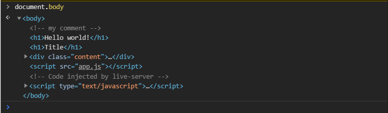
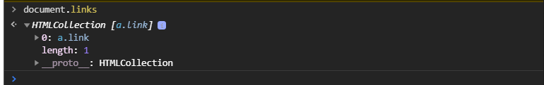

# Введение в DOM

<br>
<br>
<br>

[https://docs.google.com/presentation/d/1LA4_b6LrYjZ8WpfwPdMxKPf0IMZ_nFzHDdjITPUpsgE/edit?usp=sharing](https://docs.google.com/presentation/d/1LA4_b6LrYjZ8WpfwPdMxKPf0IMZ_nFzHDdjITPUpsgE/edit?usp=sharing),

<br>

[https://learn.javascript.ru/dom-nodes](https://learn.javascript.ru/dom-nodes)

<br>

[https://developer.mozilla.org/ru/docs/DOM/DOM_Reference/%D0%92%D0%B2%D0%B5%D0%B4%D0%B5%D0%BD%D0%B8%D0%B5](https://developer.mozilla.org/ru/docs/DOM/DOM_Reference/%D0%92%D0%B2%D0%B5%D0%B4%D0%B5%D0%BD%D0%B8%D0%B5)

<br>
<br>
<br>

Мы посмотрим какие методы у нас есть для получения элементов из **DOM**, что такое **DOM** и как нам с ним работать.

**DOM (Document Object Model)** - Это объектная модель документа. Это независимая от языка или платформы интерфейс который позволяет скриптам динамически общаться, изменять структуру и стили нашего документа. Так же это представление нашего документа ввиде иерархического древа узлов или элементов.

Т.е. на основе нашей **HTML** разметки, которую мы создаем, строится некая модель представленная ввиде узлов. В терминах **DOM** каждый тег это отдельный узел или **knot**. Так например просто текст или комментарий так же представлены узлами и мы их можем получать в **JS** в виде объектов. В принципе любой элемент который мы будем получать он будет представлен в виде объекта.

Для работы с **DOM** у нас есть специальное свойство **document**, специальная глобальная переменная которая позволяет нам получить доступ к **DOM** и через нее мы можем вызывать различные методы и использовать какие-то свойства.

Начнем с самого простого. Как мы можем получать элементы на странице. Есть множество старых методов для получения тех или иных документов это например **getElementsByClass**, **getElementsByName**, но чаще всего используют **querySelector** и **querySelectorAll**.

Например я хочу найти **div** с классом **content**. **querySelector** возвращает первый подходящий элемент к указанному селектору т.е. в наш метод мы передаем **css** селектор того элемента который мы хотим получить. Я могу в параметры передать **div** и вывести его в консоль.

```js
const div = document.querySelector("div");
console.log(div);
```


Я его могу просмотреть в виде объекта. для этого я пропишу **console.dir(div)**. 

```js
const div = document.querySelector("div");
console.dir(div);
```


Это огромный объект с наличием большого количества свойств и методов. Здесь вы должны понимать то что у нас элементы, есть определенная иерархия, различные элементы относятся к различным классам. Например мы можем посмотреть к какому классу относится **div** элемент. Если мы проскролим вниз то мы здесь увидим свойство **proto**, с которым мы так же будем знакомится в будущем.


Он имеет определенный набор свойств и методов которые присущи именно такого рода элементам. Если и здесь мы проскролим вниз то увидим **HTMLElement** это следующий класс от которого наследуется **htmlDivElement**


Общий класс с наличием определенных так же свойств и методов которые доступны для элементов типа **htmlElemtnt**.

Если двинимся еще ниже то увидим **Element**. Если двинимся еще ниже то увидим Node это общий узел класс для всех элементов и не только, в обем в целом для всех узлов. Дальше мы увидим **EveentTarget** здесь есть **addEventListener** с которым пы познакомимся позже. И в конечном будет **Object**. Эту иерархию можно посмотреть на [MDN](https://developer.mozilla.org/ru/docs/Web/API/Element).


Это та иерархия классов от которых происходят те или иные элементы в нашем DOM.

<br>
<br>
<br>
<br>
<br>

Ок мы нашли элемент **div**. Понимаем что элементы представляют собой объекты с определенными свойствами и методами. Здесь оснавная сложность при работе **DOM** заключается в том что бы помнить и знать все те свойства и методы которые нам доступны и уметь с ними работать.

Рассмотрим метод который позволяет нам получить все элементы по указанному селектору.

```js
const titles = document.querySelectorAll("h1");
console.dir(titles);
```


Мы с вами получаем так называемый **NodeList**

Это список элементов указанных подходящих под наш селектор. **NodeList** это псевдо массив, объект, коллекция которая представляет собой набор тех элементов которые подошли под наш селектор. У этого **NodeList** есть один нюанс что мы не можем с ним работать как с массивом. У **NodeList** есть **forEach**.


У него нет метода **map** и т.д. Т.е. мы не можем вызвать методы работы с массивом. Хотя это бывает очень удобно. Для того что бы преобразовывать такие коллекции в массивы и работать с ними как с массивами. Мы можем использовать несколько вещей. Я могу использовать **Array.from()** в параметры помещаю интересующую переменную.

```js
const titles = document.querySelectorAll("h1");
console.dir(titles);
console.log(Array.from(titles));
```
 

Я получаю элементы ввиде массива.
Так же довольно старым методом является вот такая вот запись.

```js
const titles = document.querySelectorAll("h1");
console.dir(titles);
// console.log(Array.from(titles));
console.log(Array.prototype.slice.call(titles));
```


И мы получим точно такой же результат.

Или для **NodeList** мы можем использовать вот такую штуку. Т.к. у **NodeList** есть итератор мы можем написать вот такую запись.

```js
const div = document.querySelector("div");
const titles = document.querySelectorAll("h1");
console.dir(titles);
// console.log(Array.from(titles));
// console.log(Array.prototype.slice.call(titles));
console.log([...titles]);
```


Для общего понимания мы должны знать то что полученная коллекция через **querySelectorAll** это снимок наших DOM узлов, это не живая коллекция. В целом для понимания это нужно знать.
Что понимается под тем что это не живая коллекция? Это значит что при изменении DOM в переменной **titles** например у нас не поменяется список узлов. Я могу получить эти же h1 через другую запись.

```js
const div = document.querySelector("div");
const titles = document.querySelectorAll("h1");

// console.log(Array.from(titles));
// console.log(Array.prototype.slice.call(titles));
// console.log([...titles]);
const h1 = document.getElementsByTagName("h1");
console.dir(h1);

```


Это HTMLCollection, однако если я чуть ниже выведу

```js
const div = document.querySelector("div");
const titles = document.querySelectorAll("h1");

// console.log(Array.from(titles));
// console.log(Array.prototype.slice.call(titles));
// console.log([...titles]);
const h1 = document.getElementsByTagName("h1");
console.dir(h1);
console.log(titles);
```


то это будет **NodeList**. Это отличные классы друг от друга. Соответственно что будет происходить с **h1** и **titles** если динамически или руками убрать какой-то элемент из разметки. В **NodeList** как и было останется два элемента, а в **HTMLCollection** останется лишь один элемент.


В этом и есть смысл в том что **HTMLCollection** это живые коллекции которые будут изменяться в случае изменения **DOM**. **NodeList** это не живые коллекции или снимки которые будут отображать то что было получено при загрузке выполнения этого метода. 

Тем не менее мы все равно будем использовать **querySelectorAll** и **querySelector** по причине его удобности гибкости.

Далее посмотрим на узлы и некоторые свойства которые мы можем использовать.

Во-первых у каждого элемента есть набор свойств которые дают возможность нам получить соседний элемент, вложенный элемент, рядом стоящие элементы или первые дочерние элементы и т.д.

Рассмотрим. К примеру, вбиваю в консоль браузер **div.nextSibling** вернет нам следующий узел после этого **div**. И здесь нужно быть внимательным, следующим узлом будет **#text**.


Откуда береться **#text**? А берется он отсюда


Перенос строки считается текстом и воспроизводится как отдельным текстовым узлом.

Если я буду использовать **nextElementSibling** то тогда я получу следующий элемент тег.


Тоже самое применимо к **firstChild** это первый текстовый узел.


Или **firstElemetChild** это ссылка которая находится внутри текста.


Cоответственно вы должны различать что есть узлы. Узлом может быть любой текст, комментарий в том числе. И мы это можем посмотреть если мы напишем.


Это используется редко но тем не менее об этом нужно знать и на всякий случай уметь пользоваться.

Некоторые элементы такие как **document.body** или **document.head**, они сразу находятся в **document** т.е. мне не нужно использовать какие-то методы 



я получаю тель документа.

 Или например **document.links** я получу **HTMLColection** всех ссылок.

 

Или **document.forms** мы получим все формы которых у нас нет на странице, но тем не менее это ссылки тех элементов которые храняться на странице.

Так же мы должны помнить еще об одной вещи это **BOM(Browser Object Model - это не официальное название)** - это те глобальные переменные которые нам предоставляет браузер. Например **window** у которого есть методы **alert**, **setTimeOut** и т.д. Это например **Navigator**, **location**. Это окружение и интерфейсы которые дают возможность нам из **JS** взаимодействовать с этими частями нашего браузера. И об этом мы так же должны помнить. 
