# Работа с атрибутами элементов.

В прошлом видео я не сказал как получить родительский элемент или ближайшего родителя. У нас свами есть **div** и для того что бы плучить родительский элемент этого **div**. При вызове в консоль я могу обратиться к **div** и вызвать у него свойство **parentElement** или **parentNode**. Домашним заданием будет разобраться чем отличается **parentElement** от **parentNode**.

```js
const div = document.querySelector("div");

console.log(div.parentElement);
```
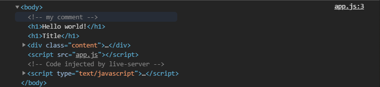

В **parantElement** будет хранится ссылка на прямого родителя для этого **div**. Тоже самое например у нас внутри **div** есть ссылка т.е. я могу создать переменную **link** в ней обратиться к **div** далее у элементов найженных через **querySelector** есть так же методы **querySelector** т.е я могу написать **div.querySelector()** и в параметрах указать то что я ищу **link** например.

```js
const div = document.querySelector("div");

const link = div.querySelector(".link");

console.log(link);
```
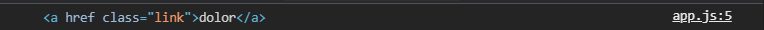

Я получаю элемент в котором находится наша ссылка. И так же у этой ссылки могу получить **parentElement**.

```js
const div = document.querySelector("div");

const link = div.querySelector(".link");

console.log(link.parentElement);
```

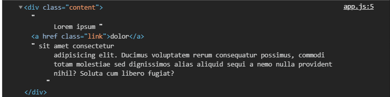

И это будет прямой родитель.

Так же помимо **parentElement** я могу использовать метод **clousest**. Т.е. если у меня довольно большая вложенность я использую этот метод в параметрах которого указываю элемент который я хочу найти.

```js
const div = document.querySelector("div");

const link = div.querySelector(".link");

console.log(link.closest(".content"));
```

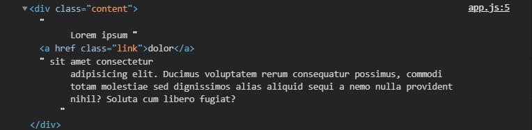

Таким образом у нас есть вот таких два простых решения как получить родителя. Едиственно что вы должны помнить что **parentElement** возвращает прямого родителя а **closest** возвращает ближайшего родителя с указанным селектором т.е. это может быть на уровень выше оберточный элемент.

<br>
<br>
<br>
<br>

Переходим к работе с атрибутами.

Здесь у нас довольно много чего есть, но самое расспостраненное это работа с классами. Мы можем ими манипулировать, добавляя, удаляя, проверяя наличие или переключая этот класс.

Допустим для нашего **div** мы хотим добавить класс. Для этого существует объект **classList**. Мы его кстати можем вывести в консоль.

```js
const div = document.querySelector("div");

const link = div.querySelector(".link");

console.log(div.classList);
```
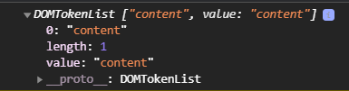

Это вот такой вот список из классов которые содержатся у этого элемента **div**. И мы можем добавить **div** новые классы. В **classList** есть методы если мы расскроем **proto**, то увидим методы.

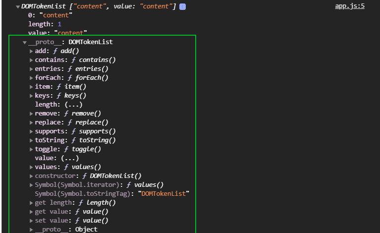

Через метод add в его параметрах я могу указать через запятую любое количество тех классов которые  я хочу добавить.

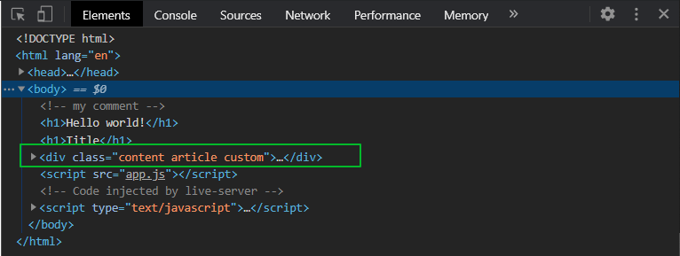

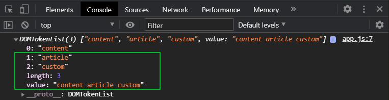

У **div** появляется два новых класса. Хотя если взгянуть в редактор ни каких новых классов нет. Всегда работай через инструменты разработчика браузера. Соответственно в объекте **classList** они тоже появляются в массиве. Здесь так же есть общее **value** всех классов.

Так же мы можем удалять те классы которые нам не нужны.

```js
const div = document.querySelector("div");

const link = div.querySelector(".link");

div.classList.add("article", "custom");
div.classList.remove("article");

console.log(div.classList);
```
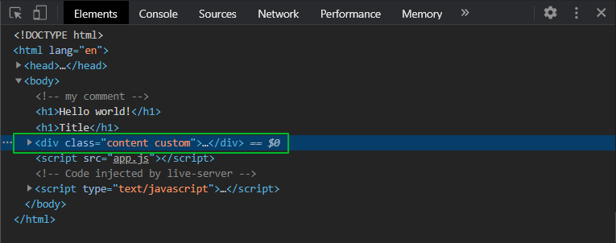

так же есть метод который позволяет нам проверить наличие этого класса или какого-то класса у элемента. Мы можем проверить это прямо в консоли браузера. Делается это с помощью метода **contains** в параметрах которого указываю искомый класс.

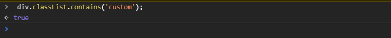

Возвращается **true** или **false** в зависимости от того есть этот класс у элемента или нет этого класса у элемента.

Так же мы можем использовать метод **togle** который позволяет переключать класс т.е. если класса нет то он будет добавлен, а если класс есть то он будет удален. Опять обращаюсь к консоли браузера.

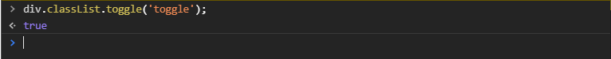

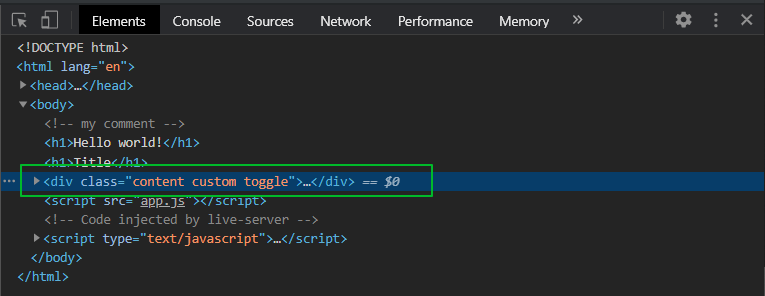

Если я еще раз верну этот метод, то он вернет **false**.

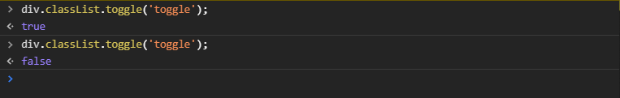

Если мы мосмотрим в **Elements** то увидим что класс был удален. Частый метод. Например при клике вам нужно **добавлять/удалять** класс что бы не делать проверку на то что класс есть или класса нет.


Двигаемся дальше. Так же мы можем получить классы если у **div** вызвать **className**, то там будут содержаться в виде строки все классы которые у нас есть у данного элемента.

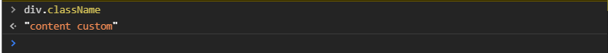

У части элементов есть так называемые обязательные свойства или общие атрибуты которые доступны всем элементам. Например у ссылки это может быть **href**.

```js
const div = document.querySelector("div");

const link = div.querySelector(".link");
console.log(link.href);
```
И я получаю то что у меня есть в ссылке.

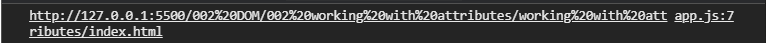

Смотрим что лежит в самой ссылке

```js
const div = document.querySelector("div");
const link = div.querySelector(".link");
console.dir(link);
```

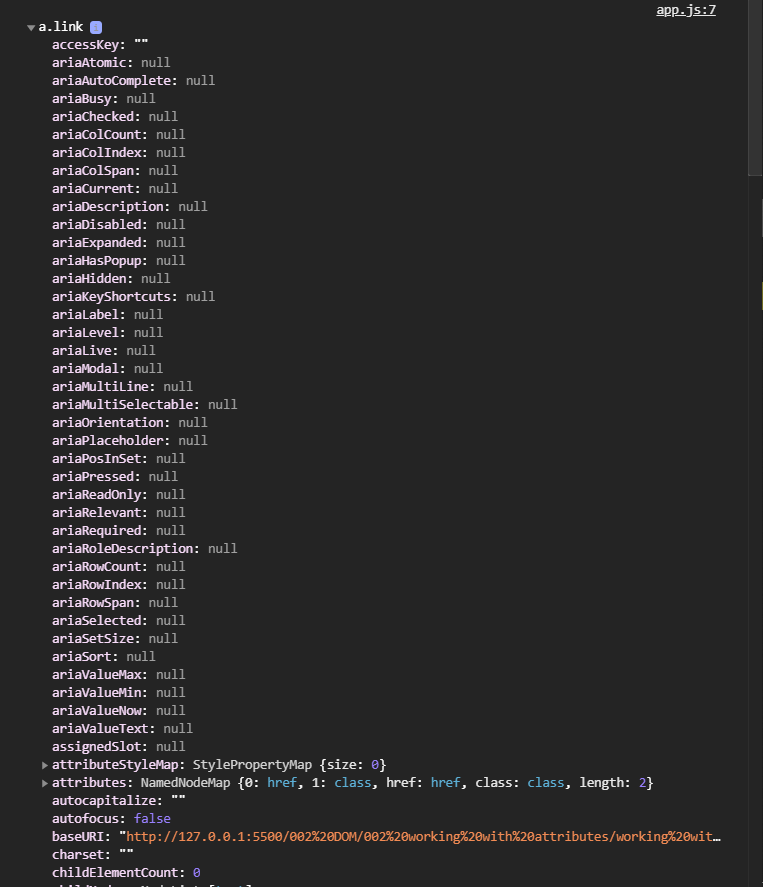

Выводится просто огромный список. Мы можем какие-то атрибуты забирать у элементов без использования специальных методов т.е. для картинки это может быть свойство **src** или например у элемента может быть **id** которые мы можем забирать не использую какие-то дополнительные методы.

 В остальном при работе с атрибутами мы можем использовать различные методы например такие как **get**, **add** и т.д. Т.е. это методы которые позволяют нам добавлять изменять каки-то атрибуты элемента как нам это удобно. 

 Рассмотрим **setAttribute()** он принимает соответственно название атрибута первым параметром, и его значения, вторым параметром.

```js
const div = document.querySelector("div");

div.setAttribute("id", "myId");

```
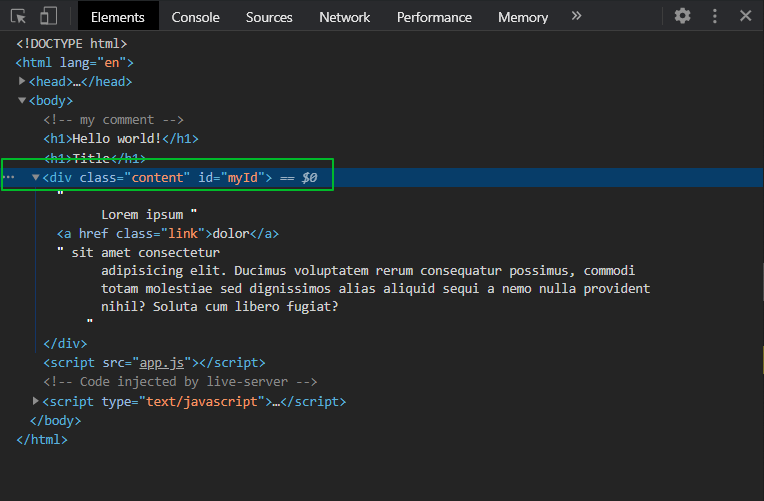

Сам id я могу получить следующим образом. В консоли.

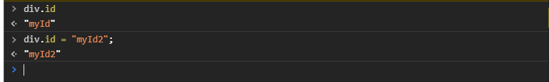

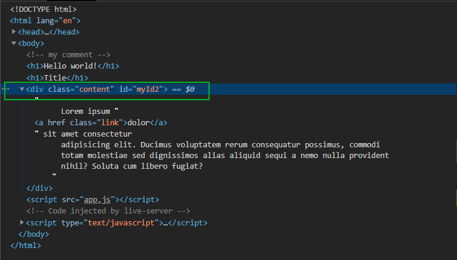

т.е. например для такого атрибута как **id** нам не обязательно использовать **setAttribute**. Опять же это подходит не для всех атрибутов.

Так же мы можем получить значение какого - нибудь атрибута. В параметрах **setAttribute** вбиваю интересуемый атрибут.

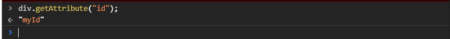

Так же я могу проверять наличие какиго-нибудь атрибута.

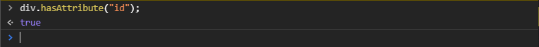

Я могу вызывать удаление атрибута.
 
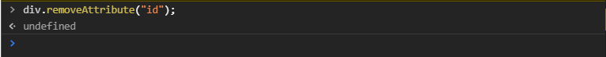

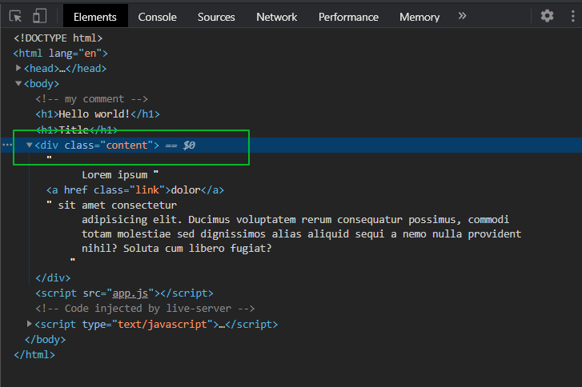

В HTML5 появилась возможность устанавливать свои кастомные атрибуты это так называемые **data** атрибуты с приставкой **data** т.е. я на элемент могу установить атрибут **data-(и любое произвольное название)** и потом работать с ним через **JS** это довольно удобно при создании какой-то логики использовать атрибуты для хранения например какой-то информации или индентификации какого-то элемента и т.д.

добавляю в свой кастомный атрибут в **index.html**.

```html
<!DOCTYPE html>
<html lang="en">
  <head>
    <meta charset="UTF-8" />
    <meta name="viewport" content="width=device-width, initial-scale=1.0" />
    <meta http-equiv="X-UA-Compatible" content="ie=edge" />
    <title>Working with attributes</title>
  </head>
  <body>
    <!-- my comment -->
    <h1>Hello world!</h1>
    <h1>Title</h1>
    <div class="content" data-myattr="myCustom value">
      Lorem ipsum <a href="" class="link">dolor</a> sit amet consectetur
      adipisicing elit. Ducimus voluptatem rerum consequatur possimus, commodi
      totam molestiae sed dignissimos alias aliquid sequi a nemo nulla provident
      nihil? Soluta cum libero fugiat?
    </div>
    <script src="app.js"></script>
  </body>
</html>
```
Для работы с этим атрибутом у нас есть специальный объект т.е. что бы получить какое-то значение оттуда я могу использовать специальное свойство **dataset**. В консоль.

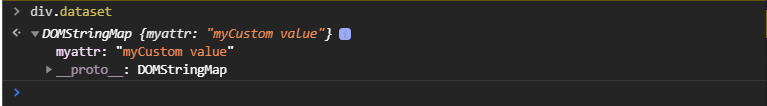

В нем есть объект в котором будет содержаться название моего атрибута без приставки **data** и дальше значение которое в нем содержится. И я млгу его считать и получить значение которое там находится.

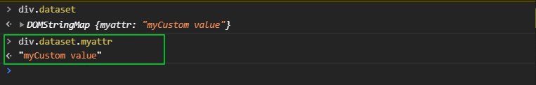

Могу попробовать перезаписать значение которое там есть.

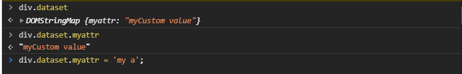

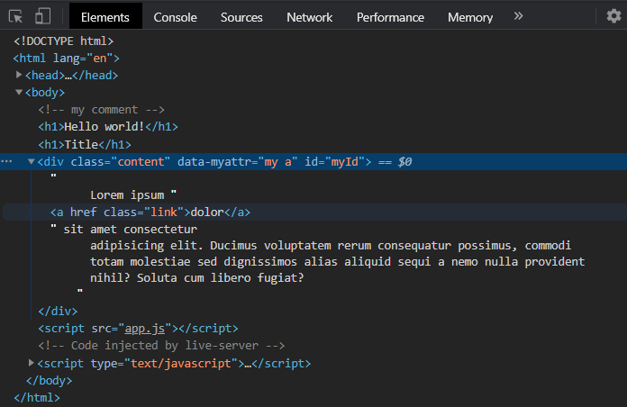

При этом эти же атрибуты мы можем получать и через **getAttribute**, но тогда я должен указывать полноценно **data-myattr**.

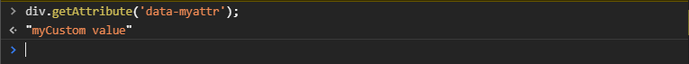

Но обычно можно использовать **dataset** он более короче.

И так мы с вами познакомились с методами добавления, удаления и изменения атрибутов. С объектом **dataset** для получения атрибутов с приставкой **data**. Мы знаем что есть такие атрибуты как **id, href, src, alt** которые можно получать без методов, а они будут как отдельные свойства вынесены в объект элемента. И соответственно мы с вами познакомились с тем как добавлять классы. Ну и в том числе прошли **parentElement**. 

