# Манипуляция DOM

Познакомимся с тем как мы можем манипулировать нашим **DOM** изменять его содержимое, добавлять или удалять элементы.

Начнем с методов. Это конечно не все методы и мы их рассмотрим поверхностно. Более подробно можно почитать о них на [MDN](https://developer.mozilla.org/ru/). У нас есть несколько методов как мы можем манипулировать содержимым элемента и добавлять новые элементы. 

Нахожу **h1**.

```js
const title = document.querySelector("h1");
```

И сразу в консоли браузера проверяю.

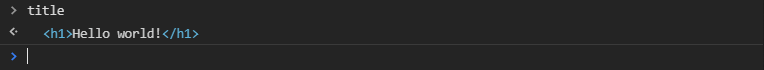

Какие у нас есть возможности управлять содержимым элемента? У нас есть несколько свойств, например **innerHTML**. Я могу записать новое html содержимое внутрь **title**. Кстати если присвоить пустую строку то содержимое будет удалено.

```js
const title = document.querySelector("h1");
title.innerHTML = "";
```

И соответственно я могу добавить.

```js
const title = document.querySelector("h1");
title.innerHTML = "<span>text</span>";
```
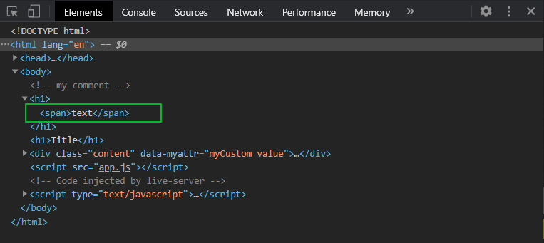

Добавляется тег span с содержимым. Но это не совсем безопасно так делать. Почему мы разберемся дальше.


Так же у нас есть **textContent** которое нам позволяет так же менять текстовое содержимое.

```js
const title = document.querySelector("h1");
title.innerHTML = "<span>text</span>";
title.textContent = "new text";
```

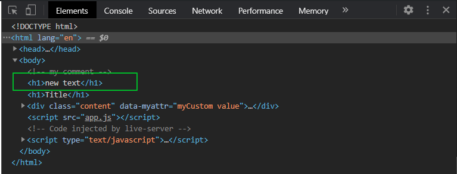

При этом как вывидите у нас внутри не создается тегов. У нас просто записывается внутрь текстовое содержимое. При этом если я попытаюсь записать тег.

```js
const title = document.querySelector("h1");
title.innerHTML = "<span>text</span>";
title.textContent = "<span>new text</span>";
```
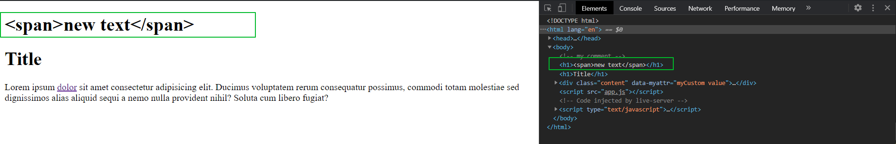

то у меня теги запишутся ввиде текста. И если я  выберу в браузере **Edit as HTML** 

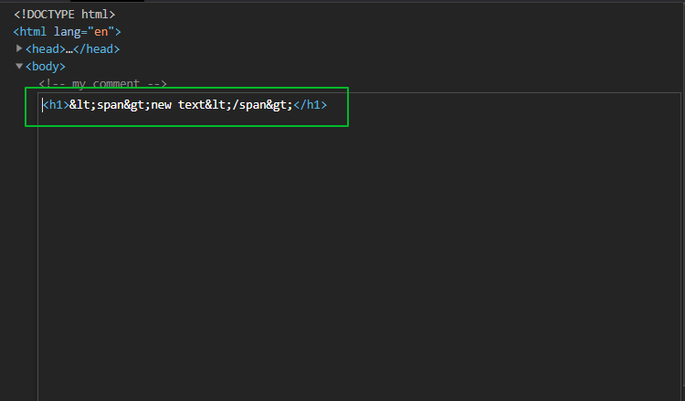

То мы увидим что здесь наши теги как символы добавлены что бы ничего не ломалось. Таким образом у нас добавляется текстовое содержимое.

Так же мы можем добавлять новые элементы при помощи методов **appendChild**, но он работает только с **DOM** элементами т.е. я не могу сделать

```js
const title = document.querySelector("h1");
title.innerHTML = "<span>text</span>";
title.textContent = "<span>new text</span>";
title.appendChild("<span>appen</span>");
```
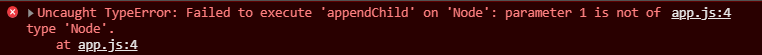

Ошибка о том что **appendChild** принимает **Node** параметр т.е. он принимает первый параметр в виде типа **Node** т.е. это должнен быть **DOM** узел **DOM** элемент. Мы вернемся к этому методу чуть позже.

У нас есть методы которые позволяют добавить содержимое в виде строки т.е. я могу использовать для этого метод **insertAdjacentHTML()** он принимает первым аргументом позицию которую я хочу вставить, всего есть четыре позиции:

1. '**beforebegin**': до самого element (до открывающего тега).
2. '**afterbegin**': сразу после открывающего тега  element (перед первым потомком).
3. '**beforeend**': сразу перед закрывающим тегом element (после последнего потомка).
4. '**afterend**': после element (после закрывающего тега).

Эти позиции определяют куда я могу вставить тот или иной элемент.

```js
const title = document.querySelector("h1");
title.innerHTML = "<span>text</span>";
title.textContent = "<span>new text</span>";
// title.appendChild("<span>appen</span>");
title.insertAdjacentHTML("beforebegin", "<h2>title h2</h2>");
```
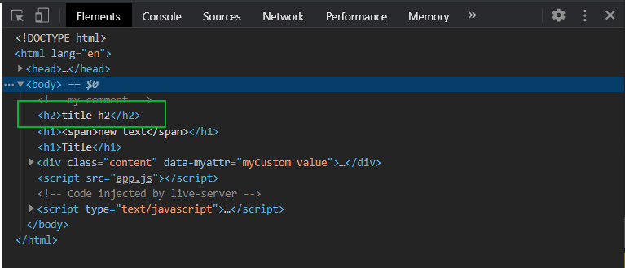

И перед тем элементом с которым мы работаем вставляется тот элемент который мы указываюем во аргументе.

Есть метод **insertAdjacentElement** который позволяет вставлять **Node** узлы т.е. **DOM** элементы так же в определенную позицию в элемент, до элемента или после элемента.

Что плохого в **innerHTML**? 

```js
title.innerHTML += "<span>new text</span>";
```

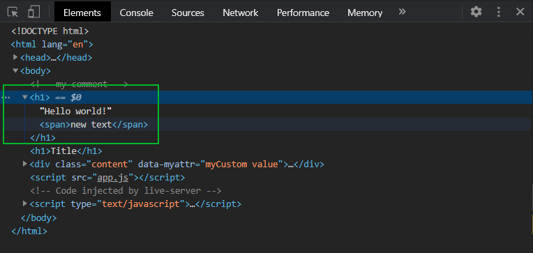

К текущему **h1** добавляется **span**. Почему так получается сделать? Потому что фактически наши **DOM** узлы являются отражением нашего **HTML**. **HTML** это всего лишь строки поэтому я могу выполнять такие операции. Так почему же это делать плохо? Получим наш span который мы вставили в **h1**.

```js
const title = document.querySelector("h1");

title.innerHTML += "<span>new text</span>";
const span = title.querySelector("span");
console.log(span);
```


Вот наш span элемент который находится внутри **h1** в его конце. Предположим я возьму и изменю наш **innerHTML** у **title**

```js
const title = document.querySelector("h1");
// title.innerHTML = "<span>text</span>";
// title.textContent = "<span>new text</span>";
// // title.appendChild("<span>appen</span>");
// title.insertAdjacentHTML("beforebegin", "<h2>title h2</h2>");
// title.insertAdjacentElement

title.innerHTML += "<span>new text</span>";
const span = title.querySelector("span");
console.log(span);
title.innerHTML += "<span>text2</span>";
```
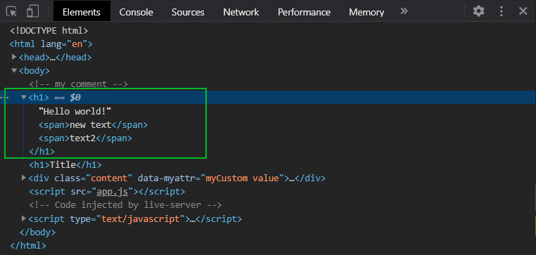

И у меня теперь два элемента **span**. Теперь я обращусь к тому **span** что я сохранил ранее, к его например **textContent** и попытаюсь поменять на любой текст.

```js
title.innerHTML += "<span>new text</span>";
const span = title.querySelector("span");
console.log(span);
title.innerHTML += "<span>text2</span>";
span.textContent += "abcd";
```
Что произойдет? Да ничего не произойдет.

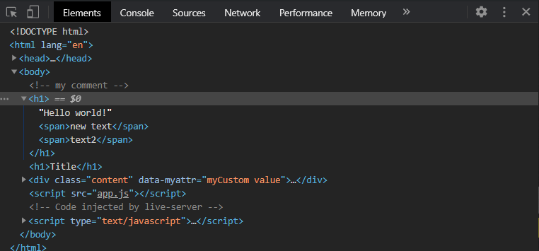

Наш тектс не изменился, new **text** остался таким же как и был. А **span** у нас существует и он изменился, если мы взглянем в консоль.

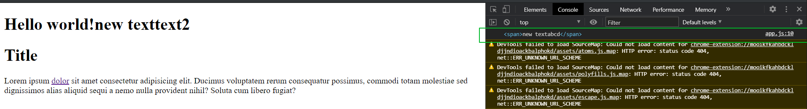

Текст в **h1** у этого span не меняется. Почему же так происходит? Если я закоментирую вот эту операцию то текст изменится 

Так происходит потому что **innetHTML** удаляет все существующие объекты внутри элемента для которого мы применяем **innerHTML** и мы теряем на них ссылки. Соответственно наш span вообще нигде не находится и его изменение **textContent** меняется только внутри самого объекта, но ни как больше на странице с ним связь не установлена. В этом и есть опасность **innerHTML**. И если я вместо **textContent** буду использовать **innerHTML** ничего не изменится, все будет точно также.

```js
const title = document.querySelector("h1");

title.innerHTML += "<span>new text</span>";
const span = title.querySelector("span");
console.log(span);
title.innerHTML += "<span>text2</span>";
span.innerHTML += "abcd";
```


Лучше всего для добавления тех или иных элементов использовать непосредственно методы которые работают с DOM узлами **appendChild**, **insertAdjacentHTML** и т.д.
Для того что бы создавать такие **DOM** узлы у нас есть специальные методы, метод **createElement()** он принимает название тега который мы хотим создать. Этот тег еще не добавляется на страницу и он у нас создается только внутри **JS**.

```js
const title = document.querySelector("h1");

const span = document.createElement("span");
console.log(span);
```


Я могу к нему применять все те же свойства и методы как к обычному **DOM** элементу т.е. я могу создать текствове содержимое.

```js
const title = document.querySelector("h1");

const span = document.createElement("span");
span.textContent = "span created by createElement";
console.log(span);
```


У него появляется текстовое содержимое. Я ему могу добавлять классы.

```js
const title = document.querySelector("h1");

const span = document.createElement("span");
span.textContent = "span created by createElement";
span.classList.add("myclass");
console.log(span);
```


Но этого элемента еще не будет в разметке. Для того что бы его добавить в разметку мы как раз таки и будем использовать метод например **appendChild** или **insertAdjacentElement**.

```js
const title = document.querySelector("h1");

const span = document.createElement("span");
span.textContent = "span created by createElement";
span.classList.add("myclass");
console.log(span);
title.appendChild(span);

```
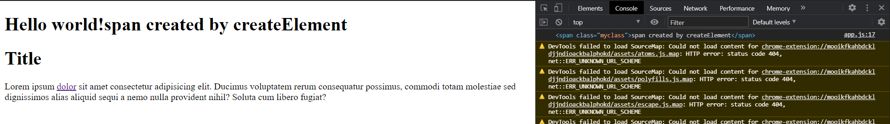

Теперь span который я добавил я смогу с ним делать все что угодно менять и т.д.

Следующий очень важный нюанс это то что если я этот же span который уже добавлен в **title** попробую добавить в **div**, то будет интересный конфуз.

```js
const title = document.querySelector("h1");
const div = document.querySelector("div");

const span = document.createElement("span");
span.textContent = "span created by createElement";
span.classList.add("myclass");
console.log(span);
title.appendChild(span);
div.appendChild(span);

```

У меня вообще выдало ошибку не так как у него. Для того что бы данный конфуз сработал мне пришлось обратиться к **const div = document.querySelector("div");** и после применить к нему **appendChild**. Так вот я span сначало добавил в **title** а потом в **div**.

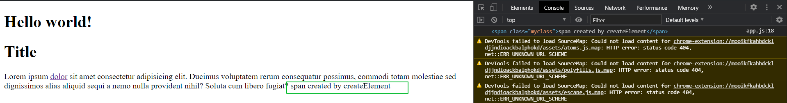

И как вы видите из **title** этот элемент исчез и появился он в конце **div**. Произошло это потому что **DOM** узлы могут быть только в одном экземпляре соответственно созданный нами span может быть только в одном экземпляре и соответственно если я его перемещаю, то он будет перемещаться в те элементы и удаляться из тех элементов вкоторых он был до этого. Об этом нужно помнить.

Теперь еще одна важная вещь это касательно создания элементов. Бывают такие ситуации когда вам нужно создать множество элементов и добавить их в разметку. Очень не выгодно в плане производительности если мы будем создавать элемент и сразу его добавлять потому что **DOM** оперции являются синхронными и при добавлении новых элементов вызывается перерисовка на странице, рассчет новых стилей и т.д. поэтому изначально лучше создать все элементы программно. Завернуть их либо в один элемент, какой-то **div**, либо для этого мы можем испольовать так называемый фрагмент, и после этого весь этот фрагмент добавить разметку.

Он создается с помощью метода **createDocumentFragment()** сюда ничего не передается

```js
const fragment = document.createDocumentFragment();
console.log(fragment);
```


Это DOM узел в котором мы можем так же вызывать методы добавления и т.д. т.е. мы можем внутрь добавлять какие-то элементы.

```js
const fragment = document.createDocumentFragment();
const colors = ["black", "yellow", "orange"];
```

я могу пройтись по этому массиву и на каждой итерации создать новый элемент **DOM** и добавить его во **fragment**.

```js
const fragment = document.createDocumentFragment();
const colors = ["black", "yellow", "orange"];
colors.forEach((color) => {
  const item = document.createElement("div");
  item.classList.add(`bg-${color}`);
  item.textContent = color;
  fragment.appendChild(item);
});
```

Таким образом мы наполним наш **fragment**, а **fragment** это фактически наш контейнер или коробка в которую мы складываем все наши элементы которые мы хотим в будущем добавить в разметку. Их еще нет в разметке.

Далее я добавляю это в разметку.

```js
const fragment = document.createDocumentFragment();
const colors = ["black", "yellow", "orange"];
colors.forEach((color) => {
  const item = document.createElement("div");
  item.classList.add(`bg-${color}`);
  item.textContent = color;
  fragment.appendChild(item);
});

document.body.appendChild(fragment);
```
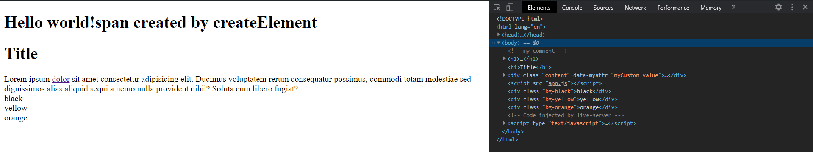

Самого **fragment** нет. Он как бы расстворяется т.е. он выкидыват все свое содержимое, но сам по себе не добавляется в разметку что очень удобно когда нам нужно сформировать множество элементов при этом не вызывая при каждом добавлении новую перерисовку а единоразово добавив все нужные нам элементы.

Плюс мы можем добавить какие-то стили. У item есть специальное свойство **style** в котором мы например мржем обратиться к **background** и добавим **color** т.е.  **item.style.background = color;**

```js
const fragment = document.createDocumentFragment();
const colors = ["black", "yellow", "orange"];
colors.forEach((color) => {
  const item = document.createElement("div");
  item.classList.add(`bg-${color}`);
  item.style.background = color;
  item.textContent = color;
  fragment.appendChild(item);
});

document.body.appendChild(fragment);
``` 

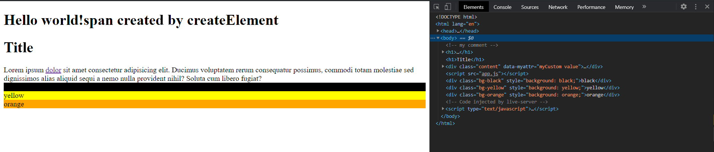

И получим такие вот фоновые цвета. Вот таким вот способом мы можем добавлять элементы с использованием **createElement**, **createDocumentFragment** и добавление их потом через **appendChild** или **insertAdjacentElement** и т.д. через различные методы мы их можем уже добавлять на страницу.

**Удаление элементов со страницы**. 

Здесь у нас есть два способа как мы можем удалить тот или иной элемент.

Мы можем вызвать удаление у самого элемента. Рассмотрим в консоли. Вызываю интересующий элемент и после применяю к нему метод **remove()**.

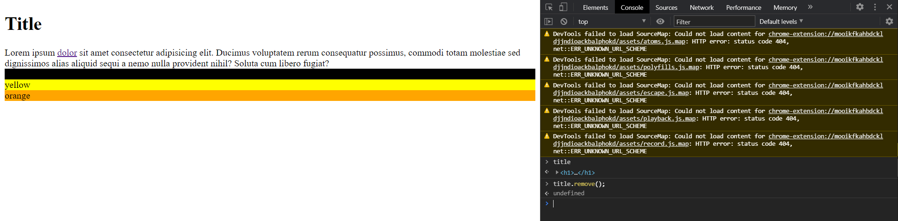

Очень удобно. Единственное что вы должны помнить что этот метод не поддерживается **IE11**. Но его пожно сполифилить. Что такое **polyfill** мы узнаем в будущих уроках. Но если очень кратко то это специальные скрипты которые дают возможность нам добавить функционал не потдерживаемых методов или каких-то **api** которых нет в старых браузерах.

Раньше для того что бы не испольовать метод **remove**, типо кросбраузерный метод, это удаление следующим способом. Мы должны были обратиться к родителю **title**.**parentElement.removeChild(title)**. Тогда произойдет тоже самое. Но это немного не удобно.

Больше методов вы можете посмотреть на [MDN](https://developer.mozilla.org/ru/).