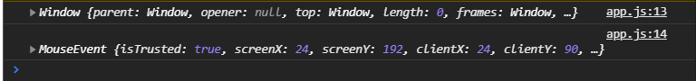

# Обработка событий.

<br>
<br>

[https://learn.javascript.ru/introduction-browser-events](https://learn.javascript.ru/introduction-browser-events)

[https://karmazzin.gitbooks.io/eloquentjavascript_ru/content/chapters/chapter14.html](https://karmazzin.gitbooks.io/eloquentjavascript_ru/content/chapters/chapter14.html)

Познакомимся с событиями. Как их добавлять на элементы, удалять с элементов и какие есть нюансы. По событиям урок разбит на две части. Первая это основы просто как мы можем навесить какое-то событие, обработать какое-то событие. И второе это всплытие и погружение о них мы поговорим подробнее в отдельном видео.

**Событие** - это любое проишествие которое может произойти в браузере, которое может сделать пользователь. Это соответственно клики, ввод данных, **submit form**, **scroll** и т.д. Событий довольно много в зависимости от элемента. События могут отличаться. У формы есть событие **submit** и т.д. Все эти события мы можем посмотреть на [MDN](https://developer.mozilla.org/ru/) выбрав нужные элементы, какие у них есть события или общие события для всех элементов.

Для того что бы навесить событие на какой-нибудь элемент есть несколько способов. Мы рассмотрим два способа. Есть третий способ это навешивание через непосредственно атрибуты на элементе в **html** это мы рассматривать не будем. Так обычно не делают. Второй способ который мы с вами рассмотрим, его обычно не используют, но я его хочу показать чисто для примера и разницы с используемым способом.

Попробуем найти нашу кнопку **button** и навесить на нее событие

```js
const btn = document.querySelector("button");
console.dir(btn);
```
С помощью **Console.dir** смотрю в консоли свойства объекта. То у данного элемента я могу наблюдать очень много таких свойств.


Эти свойства могут содержать обработчики событий. Обработчик событий это функция которую мы можем добавить и она отработает когда событие произойдет.

```js
const btn = document.querySelector("button");
btn.onclick = function () {
  console.log("click");
};
```


При клике на кнопку выводится в консоль действие которое мы на вешали и срабатывает счетчик.
Недостаток такого метода заключается в том что я не могу повешать множество обработчиков на один и тот же элемент используя это свойство потому что оно будет просто перезаписываться. Поэтому данный способ обычно не используют.

Мы будем использовать универсальный способ это метод **addEventListenner()** он принимает несколько аргументов, их три. Первый это тип события какой мы хотим обрабатывать это событие **click**, заметте пишем без приставки **on**. Второй аргумент это обработчик события т.е. сама фугкцию **function(){}**. И третий аргумент это объект с определенными настройками о которых мы как раз таки и поговорим в видео про всплытие и погружение.

```js
const btn = document.querySelector("button");

btn.addEventListener("click", function () {
  console.log("click");
});
```


Все работает. При этом я могу повешать несколько обработчиков. И будет сразу отрабатываться два обработчика.

```js
const btn = document.querySelector("button");

btn.addEventListener("click", function () {
  console.log("click");
});

btn.addEventListener("click", function () {
    console.log("click 2");
  });
```


События срабатывают в порядке их объявления в записи.

Каждый обработчик принимает событие **event**

```js
const btn = document.querySelector("button");
// btn.onclick = function () {
//   console.log("click");
// };

btn.addEventListener("click", function (e) {
    console.log(e);
  });
```
Этот обработчик событий пригодится нам для разных целей. Обычно его определяют как **i** или **e**, **event** в функции. Он будет сюда передаваться обязательно принимаете вы его или не принимаете, это второй вопрос. Если вам нужно использовать **event** вы его должны указать и соответственно можете использовать.

Что нас в этом **event** объекте событий интересует?


Конечно же здесь есть **target** который довольно часто используется. **type** события, где произошло событие координаты и т.д. Что очень важно, у события есть специальные методы которые нам пригодяться перейди в **proto**.


Поговорим про **preventDefault**. Вы должны знать о том что некоторые элементы например такие как ссылки или форма имеют встроенные специальные события, точнее не события а то что они делают по умолчанию.
Если мы хотим отменить это **default** действие которое делает браузер для этого элемента то мы должны использовать метод **preventDefault**.

```js
const btn = document.querySelector("button");
const link = document.querySelector("a");
// btn.onclick = function () {
//   console.log("click");
// };

// btn.addEventListener("click", function (e) {
//   console.log(e);
// });
link.addEventListener("click", function (e) {
  console.log("click");
});
```

И если я кликну на ссылку я на момент увижу наше событие.После произойдет перезагрузка страницы. Для того что бы остановить это действие я должен вызвать, это можно вызывать как в начале так и в конце обработчика события. У объекта **e** я могу вызвать **preventDefault()** и теперь при клике у меня будет выводится событие и не будет происходить перезагрузки страницы.

```js
const btn = document.querySelector("button");
const link = document.querySelector("a");

link.addEventListener("click", function (e) {
  e.preventDefault();
  console.log("click");
});
```


Мы можем удалять события с элементов. Для этого существует метод **removeEventListenner**, он принимает так же название события **click** и вторым аргументом он принимает название обработчика события которого нужно удалить. Т.к. мы используем анонимную функцию мы ее удалить не можем, на самом деле есть кое-какие способы, но так просто не можем.

Для этого мы можем вынести нашу функцию в глобальную видимость. Дать имя функции и вторым параметром передать эту функцию в обработчик события.

```js
const btn = document.querySelector("button");
const link = document.querySelector("a");

function clickhandler(e) {
  e.preventDefault();
  console.log("click");
}

link.addEventListener("click", clickhandler);
link.removeEventListener("click", clickhandler);
```
И теперь все работает точно так же как и до добавления события.

Также в качестве обработчика события мы можем предавать как обычную функцию так и стрелочные функции.

Вешаю событие на кнопку.

```js
btn.addEventListener("click", (e) => {
  console.log(e);
});
```


Отличия если мы передаем стрелочную функцию и если мы передаем обычную функцию. Давайте посмотрим на следующее, у обоих этих функций выведем this.

```js
const btn = document.querySelector("button");
const link = document.querySelector("a");
// btn.onclick = function () {
//   console.log("click");
// };

// btn.addEventListener("click", function (e) {
//   console.log(e);
// });

btn.addEventListener("click", (e) => {

  console.log(this);
  console.log(e);
});

function clickhandler(e) {
  e.preventDefault();
  console.log(this);
  console.log("click");
}

link.addEventListener("click", clickhandler);
// link.removeEventListener("click", clickhandler);
```



Если мы кликнем на кнопку то мы видим что **this** указывает на **window** и **MouseEvent** срабатывает.

Если я кликну на ссылку,там у нас передана обычная функция. То **this** будет указывать на сам элемент.


т.е. **this** будет указывать на сам элемент на который было повешано событие. Это важное отличие, о нем стоит знать. В каких-то ситуациях может быт будет удобно использовать стрелки, в каких-то обычную функцию. С этим мы рахберемся в будущем когда будем делать проект.

Теперь еще одна важная штука. Это делегирование события или если это упростить. Когда у нас бывает такая ситуация что те или иные элементы мы динамически добавляем на страницу.

У нас есть с вами кнопка. И предположим когда на нее будет происходить клик. Создаю в разметке пустой контейнер **div** с классом **conteiner**. В **app.js** обращюсь в данному классу. Мы с вами будем при клике на кнопку создавать элемент **div**, добавлять в него **textContent** и добавлять в него **Math.random** и потом в наш контейнер делать **appendChild(div)**.

```html
<!DOCTYPE html>
<html lang="en">
  <head>
    <meta charset="UTF-8" />
    <meta name="viewport" content="width=device-width, initial-scale=1.0" />
    <meta http-equiv="X-UA-Compatible" content="ie=edge" />
    <title>Event handling</title>
  </head>
  <body>
    <h1>Event handling</h1>
    <button>Click</button>
    <a href="">Click link</a>
    <div class="container"></div>
    <script src="app.js"></script>
  </body>
</html>
```

```js
const btn = document.querySelector("button");
const link = document.querySelector("a");

const container = document.querySelector(".container");

btn.addEventListener("click", (e) => {
  const div = document.createElement("div");
  div.textContent = Math.random();
  container.appendChild(div);
});
```


Кликаем и вот добавляются соответственно наши **div** на страницу.

Предположим что мы хотим добавлять какую-то кнопку или что-то внутрь этого **div** а потом отслеживать на нем события. Создаю кнопку  **const nestedBtn = document.createElement("button");** Добавляю текст для нашего **div**. И потом в **div** делаю **appendChild(nestedBtn)**. Ну и что бы мы видели эту кнопку зададим ему какой-нибудь текст  **const nestedbtn = document.createElement("button");**.

```js
const btn = document.querySelector("button");
const link = document.querySelector("a");

const container = document.querySelector(".container");

btn.addEventListener("click", (e) => {
  const div = document.createElement("div"); // создал div
  const nestedbtn = document.createElement("button"); // создал кнопку
  div.textContent = Math.random(); // добавил текст в div
  nestedbtn.textContent = "button"; // добавил текст в кнопку
  div.appendChild(nestedbtn); // добавил в div кнопку
  container.appendChild(div); // весь div закинул в контейнер
});

```


И вот в каждом из этих блоков есть кнопка. Но теперь у меня есть проблема. Предположим я хочу на каждой из этих кнопок отслеживать клик для каких-то действий для того что бы что-то выполнить или удалить элемент, получить там содержимое какое-то и т.д.

Что мне делать? Мне либо при каждом клике нужно идти и навешивать событие на вновь добавленную кнопку или я могу повесить обработчик события **click** на весь **container**. 

Как это будет выглядеть? 

через **container.addEventListener("click")** обращаюсь к добавлению события, первым параметром указываю какое событие я буду обрабатывать, вторым аргументом указываю **callback** обработчик **(e) => {}** где я буду выводить в консоль **e.target(цель)**.

```js
const btn = document.querySelector("button");
const link = document.querySelector("a");

const container = document.querySelector(".container");

btn.addEventListener("click", (e) => {
  const div = document.createElement("div"); // создал div
  const nestedbtn = document.createElement("button"); // создал кнопку
  div.textContent = Math.random(); // добавил текст в div
  nestedbtn.textContent = "button"; // добавил текст в кнопку
  div.appendChild(nestedbtn); // добавил в div кнопку
  container.appendChild(div); // весь div закинул в контейнер
});

container.addEventListener("click", (e) => {
  console.log(e.target);
});
```

Давайте посмотрим что теперь будет?


т.е. в **e.target** у меня будет находится кнопка или элемент на которую сейчас произошел клик в рамках этого **container** т.е. клик происходит на весь **conteiner**, но конкретно **target(цель)** является тот элемент на котором проихошло событие. Если я кликну на число то я получу **div**.


Выведем e.target ввиде dir.

```js
const btn = document.querySelector("button");
const link = document.querySelector("a");

const container = document.querySelector(".container");

btn.addEventListener("click", (e) => {
  const div = document.createElement("div"); // создал div
  const nestedbtn = document.createElement("button"); // создал кнопку
  div.textContent = Math.random(); // добавил текст в div
  nestedbtn.textContent = "button"; // добавил текст в кнопку
  div.appendChild(nestedbtn); // добавил в div кнопку
  container.appendChild(div); // весь div закинул в контейнер
});

container.addEventListener("click", (e) => {
  console.dir(e.target);
});
```
Можно проверить на **class** или например на **nodeName** и т.д. Можно добавить какое-то маркер на элемент на **tagName** можем проверить что бы выполнить какие-нибудь действия т.е. например если я хочу сделать проверку.

```js
const btn = document.querySelector("button");
const link = document.querySelector("a");

const container = document.querySelector(".container");

btn.addEventListener("click", (e) => {
  const div = document.createElement("div"); // создал div
  const nestedbtn = document.createElement("button"); // создал кнопку
  div.textContent = Math.random(); // добавил текст в div
  nestedbtn.textContent = "button"; // добавил текст в кнопку
  div.appendChild(nestedbtn); // добавил в div кнопку
  container.appendChild(div); // весь div закинул в контейнер
});

container.addEventListener("click", (e) => {
  console.dir(e.target);
  if (e.target.tagName === "BUTTON") {
    console.log("button clicked");
  }
});
```


Таким образом мы можем определить что нажатие проихошло на какой-то определенный элемент и мы хотим выполнить какое-то определенное действие если на него кликнуть. При этом этот элемент был добавлен динамически и что бы каждый раз на него не навешивать события мы можем сделать вот такую конструкцию. Мы этим будем пользоваться в будущем.