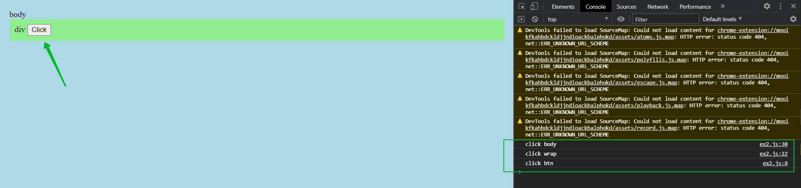

# Всплытие и погружение события

<br>
<br>

[https://docs.google.com/presentation/d/1o2wkXfqEIEv7FArGBAQbrIlVe-UBJUeccl703iQMym4/edit?usp=sharing](https://docs.google.com/presentation/d/1o2wkXfqEIEv7FArGBAQbrIlVe-UBJUeccl703iQMym4/edit?usp=sharing)

<br>
<br>

Об этом очень часто спрашивают на собеседовании и это довольно интересная штука.

Всплытие события. Предположим что у нас есть кнопка которая находится внутри **div** а он в свою очеред находится внутри **body**.

```html
<!-- ex2.html -->
<!DOCTYPE html>
<html lang="en">
  <head>
    <meta charset="UTF-8" />
    <meta name="viewport" content="width=device-width, initial-scale=1.0" />
    <meta http-equiv="X-UA-Compatible" content="ie=edge" />
    <title>Document</title>
    <style>
      body {
        padding: 10px;
        background: lightblue;
      }
      .wrap {
        padding: 10px;
        background: lightgreen;
      }
    </style>
  </head>
  <body>
    body
    <div class="wrap">
      div
      <button class="btn">Click</button>
    </div>
    <script src="ex2.js"></script>
  </body>
</html>
```

Всплытие события мы можем зацепить. Когда у нас одно и тоже событие, например клика, установлено на вложенный элемент к примеру **button**, и на его родителя **div**. Посмотрим как это происходит.

Сначало найдем два элемента.

```js
// ext2.js

const btn = document.querySelector(".btn");
const wrap = document.querySelector(".wrap");
```

Теперь мы поставим на нашу кнопку **btn.addEventListener("click");** Вторым параметром как обычно передаю функцию обработчик.

```js
// ext2.js

const btn = document.querySelector(".btn");
const wrap = document.querySelector(".wrap");

btn.addEventListener("click", (e) => {
  console.log("click btn");
});
```


Кликк сработал. Все как бы хорошо, никаких проблем нет. Но очень частая ситуация когда оберточный блок, в данном случае это **div** с классом **wrap**, так же имеет слушатель события такой же как вложенный элемент.

```js
// ext2.js

const btn = document.querySelector(".btn");
const wrap = document.querySelector(".wrap");

btn.addEventListener("click", (e) => {
  console.log("click btn");
});

wrap.addEventListener("click", (e) => {
  console.log("click wrap");
});
```


Это и есть эффект всплытия события т.е. когда у нас происходит событие на вложенном элементе и если у родителя есть обработчик такого же события, то оно произойдет и на родителе. Для того что бы остановить это действие, прекратить всплытие события мы можем использовать специальный метод из объекта **e.stopPropagetion**, есть **stopImmediatePropagation** но он используется крайне редко. Вызвав **stopPropagetion** у нас с вами при попытке клика. **Propagation(расспостранение)**.

```js
// ext2.js

const btn = document.querySelector(".btn");
const wrap = document.querySelector(".wrap");

btn.addEventListener("click", (e) => {
  e.stopPropagation();
  console.log("click btn");
});

wrap.addEventListener("click", (e) => {
  console.log("click wrap");
});
```


Тепрь ссобытие сработает непосредственно для кнопки, но не сработает на оберточном блоке. Если я кликну на оберточном блоке то все булет хорошо, событие так же сработает нормально.


Тоже самое сли мы добавим, что бы проверить дальше всплытие слушатель события на **body**

```js
const btn = document.querySelector(".btn");
const wrap = document.querySelector(".wrap");

btn.addEventListener("click", (e) => {
//   e.stopPropagation();
  console.log("click btn");
});

wrap.addEventListener("click", (e) => {
  console.log("click wrap");
});

document.body.addEventListener("click", (e) => {
  console.log("click body");
});
```
И уберем **e.stopPropagation();** то при клике отработают три события.


Клик отработает на **button**, **wrap**, **body**. Если вернем **e.stopPropagation();** то событие отработает единственный раз.


<br>
<br>
<br>
<br>

Что же такое погружение. На самом деле событие проходит два этапа. Сначало происходит погружение события, а потом происходит его всплытие. Но погружение по умолчанию не отслеживается т.е. мы его не перехватываем в своих обработчиках, оно не срабатывает. Для того что бы перехватить обработку события погружения мы должны на те же элементы добавить слушатель еще раз и передать третьим параметром в **EventListenner** либо **true** (это в старой спецификации), либо объект в котором свойство **capture** установить в  значение **true**.

Смотрим с **true**.

```js
// ext2.js

const btn = document.querySelector(".btn");
const wrap = document.querySelector(".wrap");

btn.addEventListener("click", (e) => {
  e.stopPropagation();
  console.log("click btn");
});

wrap.addEventListener(
  "click",
  (e) => {
    console.log("click wrap");
  },
  true
);

document.body.addEventListener(
  "click",
  (e) => {
    console.log("click body");
  },
  true
);
```


То мы видим что теперь, т.к. мы третьим параметром передали **true**, а можем передать как и объект 

```js
// ext2.js

const btn = document.querySelector(".btn");
const wrap = document.querySelector(".wrap");

btn.addEventListener("click", (e) => {
  e.stopPropagation();
  console.log("click btn");
});

wrap.addEventListener(
  "click",
  (e) => {
    console.log("click wrap");
  },
  { capture: true }
);

document.body.addEventListener(
  "click",
  (e) => {
    console.log("click body");
  },
  { capture: true }
);
```

Как мы видим сначало отрабатывает событие на **body** потом на **wrap**, а потом уже только на **btn** т.е. сначало происходит погружение, потом идет всплытие. Для того что бы отловить и то и другое и погружение и всплытие события мы должны повесить на тот же **wrap** и **boby** еще по одному обработчику только теперь без дополниельного перехвата погружения т.е. у нас теперь должны быть обработчики обычные которые будут реагировать на всплытие и обработчики которые будут реагировать на погружения с дополнительным параметром **capture: true**.

```js
// ext2.js

const btn = document.querySelector(".btn");
const wrap = document.querySelector(".wrap");

btn.addEventListener("click", (e) => {
  с
  console.log("click btn");
});

wrap.addEventListener("click", (e) => {
  console.log("click wrap");
});

document.body.addEventListener("click", (e) => {
  console.log("click body");
});

wrap.addEventListener(
  "click",
  (e) => {
    console.log("click wrap");
  },
  { capture: true }
);

document.body.addEventListener(
  "click",
  (e) => {
    console.log("click body");
  },
  { capture: true }
);
```



Погружение происходит, а всплытия нет из за того остановлено распостранение у события клика на кнопке **Propagation()**. Если я это закоментирую.

```js
// ext2.js

const btn = document.querySelector(".btn");
const wrap = document.querySelector(".wrap");

btn.addEventListener("click", (e) => {
  // e.stopPropagation();
  console.log("click btn");
});

wrap.addEventListener("click", (e) => {
  console.log("click wrap");
});

document.body.addEventListener("click", (e) => {
  console.log("click body");
});

wrap.addEventListener(
  "click",
  (e) => {
    console.log("click wrap");
  },
  { capture: true }
);

document.body.addEventListener(
  "click",
  (e) => {
    console.log("click body");
  },
  { capture: true }
);

```


Происходит погружение и всплытие.

Вот такое вот оно всплытие и погружение события. Очень хороший пример представлен в **ex1.html** и **ex1.js.**

```html
<!-- ext1.html -->
<!DOCTYPE html>
<html lang="en">
  <head>
    <meta charset="UTF-8" />
    <meta name="viewport" content="width=device-width, initial-scale=1.0" />
    <meta http-equiv="X-UA-Compatible" content="ie=edge" />
    <title>Hello world</title>
    <style>
      * {
        box-sizing: border-box;
        margin: 0;
        padding: 20px;
        transition: background 800ms;
      }

      html {
        height: 100%;
        background: hsl(193, 66%, 55%);
        font: bold 40px helvetica, sans-serif;
        color: red;
      }

      body {
        height: 100%;
        background: hsl(193, 66%, 65%);
      }

      .container {
        height: 100%;
        background: hsl(193, 66%, 75%);
      }

      ul {
        height: 100%;
        list-style: none;
        background: hsl(193, 66%, 85%);
      }

      li {
        height: 100%;
        background: hsl(193, 66%, 95%);
      }

      .highlight {
        background: red;
      }
    </style>
  </head>
  <body>
    <div class="container">
      <ul>
        <li>Click on a layer to watch the event move through the DOM tree.</li>
      </ul>
    </div>
    <script src="ex1.js"></script>
  </body>
</html>
```

<br>
<br>

```js
// ext1.js
var html = document.documentElement;
var body = document.body;
var div = body.querySelector('div');
var ul = body.querySelector('ul');
var li = body.querySelector('li');
var pause = 200;
// Capture
html.addEventListener('click', callback, true);
body.addEventListener('click', callback, true);
div.addEventListener('click', callback, true);
html.addEventListener('click', callback, true);
ul.addEventListener('click', callback, true);
li.addEventListener('click', callback, true);
// Bubble
html.addEventListener('click', callback, false);
body.addEventListener('click', callback, false);
div.addEventListener('click', callback, false);
html.addEventListener('click', callback, false);
ul.addEventListener('click', callback, false);
li.addEventListener('click', callback, false);

function callback(event) {
  var ms = (event.timeout = event.timeout + pause || 0);
  var target = event.currentTarget;

  setTimeout(function() {
    target.classList.add('highlight');
    setTimeout(function() {
      target.classList.remove('highlight');
    }, pause);
  }, ms);
}
```

Советую посмотреть на этот код и разобраться. Очень красиво сделано при клике на центральный элемент. Погружение происходит до того элемента а потом будет происходить всплытие
