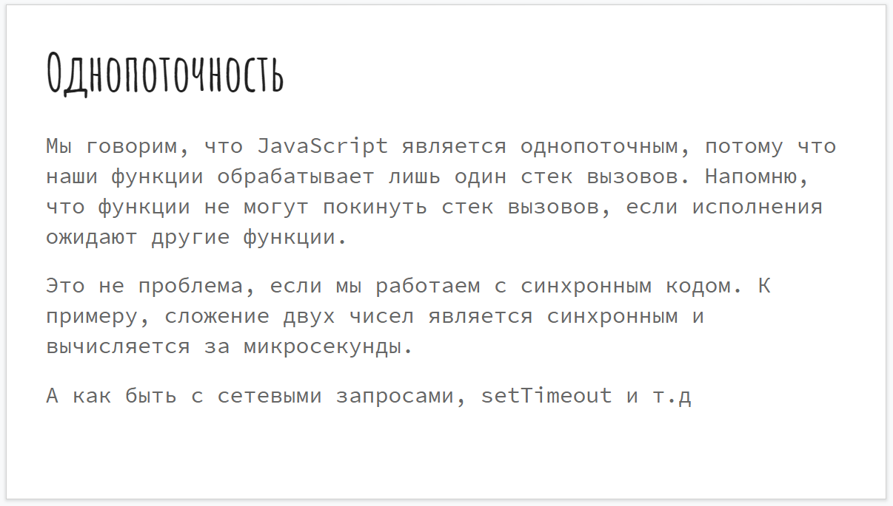
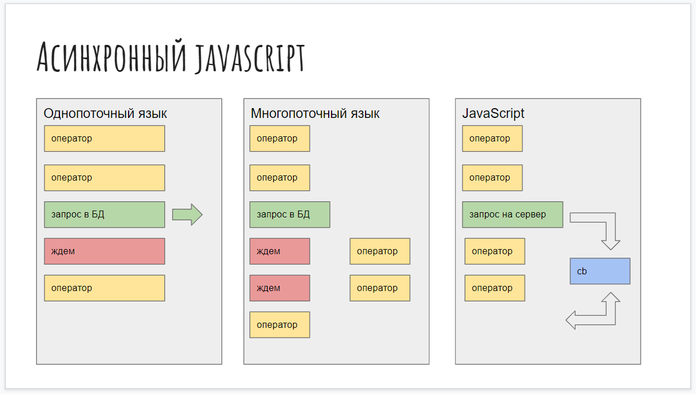
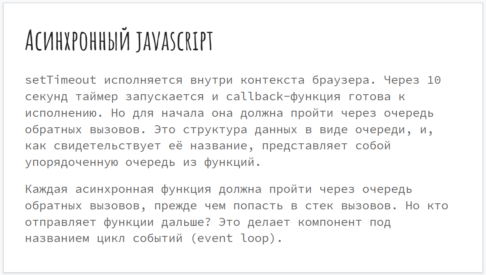

# Введение в асинхронность. Что такое event loop.

<br>

[https://docs.google.com/presentation/d/1CX9BamJ02FSdqahSBPfaIILhXbNISRjcs_B7nB59bpo/edit?usp=sharing](https://docs.google.com/presentation/d/1CX9BamJ02FSdqahSBPfaIILhXbNISRjcs_B7nB59bpo/edit?usp=sharing),

<br>

[https://habr.com/ru/company/oleg-bunin/blog/417461/](https://habr.com/ru/company/oleg-bunin/blog/417461/)

<br>

[https://www.youtube.com/watch?v=8aGhZQkoFbQ](https://www.youtube.com/watch?v=8aGhZQkoFbQ).

<br>

[https://habr.com/ru/company/oleg-bunin/blog/417461/](https://habr.com/ru/company/oleg-bunin/blog/417461/)

<br>

[https://tylermcginnis.com/javascript-visualizer/](https://tylermcginnis.com/javascript-visualizer/)

<br>


Поговорим о том как работае **JS**, что такое асинхронность и как устроен **event loop(цикл событий)**. 


т.е. в **call stack** добавляется наша функция которую мы вызвали. Она вызывается и выполняется. И соответственно сверху будут добавляться новые функции которые должны выполнятся. Очень легко **call stack** можно представить ввиде стопки чипсов **Pringles**, ввиде какой-нибудь стопки кирпичей. Мы не можем не съесть чипс со стоки снизу, ни вытащить кирпич снизу стопки пока не съедим те что сверху. 


Разберемся что такое локальный контекст исполнения.


т.е. у нас есть и глобальный контекст исполнения, наша функция в глобальном пространстве и внутри если у нас были созданы другие функции или переменные, у нах будет образовываться локальный контекст где будет содержаться те переменные и функции которые были внутри созданы.




Теперь что касается асинхронности.



Если мы взглянем на **JavaScript**. Он как мы уже выяснили является однопоточным. Но как ни странно большинство тяжелых операций являются синхронными. Если взгянем на слайд, то увидим что у нас сначало выполняются операции оператор за оператором. В какой-то момент мы хотим сделать какую-то асинхронную операцию, например выполнить запрос к серверу. В этот момет мы вызываем запрос, вызываем для этого специальную функцию, но наш код продолжает выполняться т.е. он не ждет пока наш запрос выполнится. Когда мы делаем запрос мы передаем **callback** функцию обратного вызова которая будет вызвана когда сервер нам ответит. Но когда нам сервер ответим мы точно не знаем потому что это зависит от скорости интернета, от того что сервер будет выполнять и сколько это времени займет. Когда нам сервер ответит наш **callback** выполнится и мы получим результат от сервера. Но мы можем точно знать что в той части кода который следовал после запроса мы не имеем доступа к результату выполения на сервере и мы еще не знаем что нам вернет наш сервер. Плюс если мы после первого запроса выполним еще один запрос, то нет никаких гарантий что первый запрос выполнится быстрее второго потому что это интернет.

Перейдем к тому как работают асинхронные операции в **JS**.


Разберемся как это работает.





Вот так выглядит общая схема выполнения асинхронных операций.


Т.е. если мы вызывате **setTimeout(callback, 10000)** передаем **callback** и говорим что он должен выполнится через некоторое время. Этот **callback** попадает в очередь **callback queue**(очередь обратного вызова) и ждет. Далее **event loop**(цикл событий) проверяет если **call stack**(стек вызовов) пуст и здесь все выполнилось, то он наш **callback** перемещает в наш стек вызовов **call stack**. Здесь мы должны знать одну важную вещь что источником синхронизации являются функции и **setTimeout** не гарантирует что **callback** выполнится ровно через 10 сек. Он гарантирует что **callback** выполнится не раньше чем через 10 секунд, но может выполнится позже и это будет зависить от того что сейчас происходит с **call stack**(стек вызовов). Если в нем есть какие-то дблокирующие операции или ресурсные опрерации, то это может занять больше времени и **callback** сразу не попадет в **call stack** и не выполнится наше действие, оно может выполнится позже потому что **call stack** должен быть пустым что бы из очереди **callback** - ов функция была передана в стек вызовов **call stack**. К этой презинтации будет несколько ссылок которые нужно просмотреть.

[https://www.youtube.com/watch?v=8aGhZQkoFbQ](https://www.youtube.com/watch?v=8aGhZQkoFbQ).

[https://habr.com/ru/company/oleg-bunin/blog/417461/](https://habr.com/ru/company/oleg-bunin/blog/417461/)

[https://tylermcginnis.com/javascript-visualizer/](https://tylermcginnis.com/javascript-visualizer/)

А теперь посмотрим на примеры которые так же часто задают на собеседовании. Это базовыве вещи которые могут спросить на собеседовании.

```js
console.log(1);
console.log(2);

setTimeout(() => {
  console.log(3);
}, 0);

console.log(4);
```

Стандартная вещь вас могут спросить в каком порядке выведутся вещи.


Почему это происходит? Исходя из предыдущего что я рассказывал. 

```js
console.log(1);
console.log(2);
```

Эти операции выполняются линейно друг за другом. Потом выполняется **setTimeout** и этот **callback** выполняется, **setTimeout** выполняется в браузерном **API**, этот **callback** становится в очередь **callback**-ов, но так как это синхронная операция 

```js
setTimeout(() => {
  console.log(3);
}, 0);
```
следующие действия **console.log(4);** продолжают выполняться. И соответсвтенно **console.log(4);** успеет выполниться. И когда он выполнится **call stack** стек вызовов будет пустым и тогда только **callback** попадет в стек вызова и сможет выполнится.

При этом если я сделаю внутри **setTimeout** **setTimeout**

```js
console.log(1);
console.log(2);

setTimeout(() => {
  console.log(3);
  setTimeout(() => {
    console.log(5);
  }, 0);
}, 0);

console.log(4);
```


то как вы видите callback выполняются по очереди.

Так же если у нас есть какие-то функции

```js
console.log(1);
console.log(2);

setTimeout(() => {
  console.log(3);
  setTimeout(() => {
    console.log(5);
  }, 0);
}, 0);

console.log(4);

function a() {
  console.log("a");
}

function b() {
  console.log("b");
}

a();
b();
```


Как мы видим setTimeout выполняются после выполнения функций.Т.е. тогда когда **call stack** будет свободен. Потому что они ждали в очереди **callback** пока выполнятся все вызовы и после попадем в **call stack**. 

Если я добавлю **debugger**

```js
console.log(1);
console.log(2);

setTimeout(() => {
  console.log(3);
  setTimeout(() => {
    console.log(5);
  }, 0);
}, 0);

console.log(4);

function a() {
  debugger;
  console.log("a");
}

function b() {
  console.log("b");
}

a();
b();
```
то здесь мы можем увидеть **call stack** и мы можем здесь увидеть вот наша функция **а** которая сейчас вызвана.


Надеюсь вы теперь до конца понимаете как работает **event loop**(цикл событий). Как работает асинхронность.