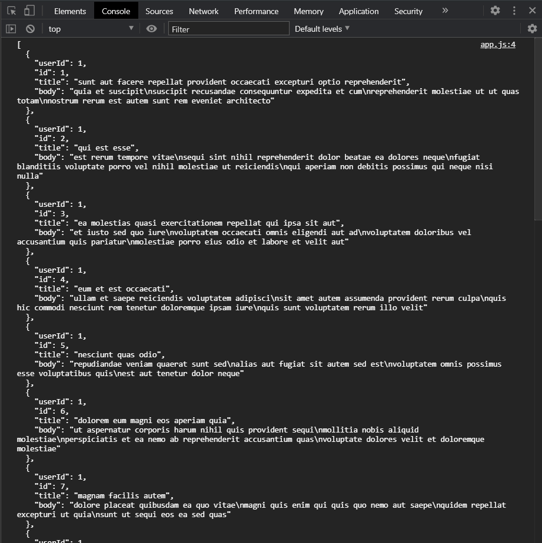
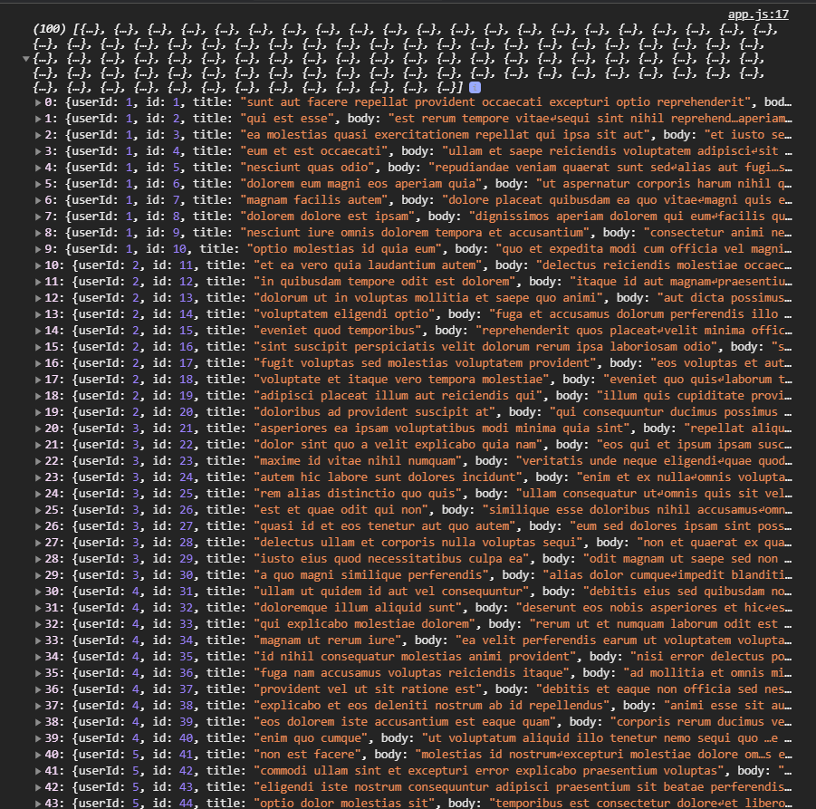

# Введение в Ajax

<br>

[https://docs.google.com/presentation/d/1zk7gYssA9iWoTB9mkxH98Dc1y5xuiapbBnG0BhBTuys/edit?usp=sharing](https://docs.google.com/presentation/d/1zk7gYssA9iWoTB9mkxH98Dc1y5xuiapbBnG0BhBTuys/edit?usp=sharing),

<br>

[https://habr.com/ru/post/120917/](https://habr.com/ru/post/120917/)

<br>

[https://developer.mozilla.org/ru/docs/Web/Guide/AJAX](https://developer.mozilla.org/ru/docs/Web/Guide/AJAX)

<br>

Разберемся что такое **AJAX** запросы и как с их помощью нам общаться с сервером. Сначало разберемся как все происходит и что такое **AJAX** и зачем он нужен. 

**AJAX** - это технология которая подразумевает общение с сервером и дальнейшее изменение страницы без ее перезагрузки. Обычно если вы помните стандартно сайт если вы например меняете какие-то фильтры в интернет магазине у вас происходит перезагрузка страницы и соответственно вы потом видите какой-то результат. **AJAX** запрос позволяет cделать запросы к серверу без перезагрузки страницы при помощи **JS**. 

С помощью специального метода в **JS** мы делаем запрос к серверу. Далее мы подписываемся на ответ от сервера на сам запрос мы его слушаем. И кгода ответ пришел мы в **JS** получаем данные от сервера и делаем какие-то изменения на странице. Для создания запроса в **JS** существует специальная функция конструктор называется она **XMLHttpRequest()**, она позволяет создать экземпляр запроса и потом с помощью этого экземпляра вызвать специальные методы для того что бы совершить запрос. **XMLHttpRequest()** возвращает нам на выходе объект который собственно нам и позволяет создавать, отправлять, обрабатывать запрос. 

Начнем с самого простого. У нас свами стоит задача сделать запрос на специальный демо сервер - это сервис для тестов запросов. Называется он [JSONPlaceholder](https://jsonplaceholder.typicode.com/). Им часто пользуются в качестве треренировки написания запросов. Получить ответ от сервера и вывести соответственно этот ответ на страницу.

Начнем с того что мы должны создать экземпляр **XMLHttpRequest()**. Для этого я создаю переменную, обычно ее называют **xhr** или **request**. И вызовем **XMLHttpRequest()**. Пока что мы не знакомы с опрератором **new**, что он делает и впринципе с функциями констуктора но тем не менее мы этим пользуемся.

```js
const xhr = new XMLHttpRequest();
console.log(xhr);

```
Сейчас мы просто создали экземпляр и получили методы. Если мы их выведем в консоль, то мы увидим что это будет объект в котором будут какие-то свойства и методы которые мы будем использовать.


Сначало нужно открыть запрос. Это можно сказать некие настройки нашего будущего запроса. Для этого у объекта **xht** вызываю метод **open()**, он принимает несколько параметров, но стандартно нам нужно только два это метод запроса и **url** адрес куда мы будем отправляь запрос. 

Методы запросов бывают разные. Стандартный это **GET** запрос для получения каких-то данных. **POST** запрос для отправки данных на сервер и создания например какой-то записи там. **PUT** запрос для обновления данных на сервере и **DELETE** для удаления. В зависимости от метода запроса мы можем передавать какие-то данные на сервер или не передавать. 

Нас сейчас интересует **GET** запрос. Указываем первым аргументом **GET**, не обязательно большими буквами, ввиде строки, вторым аргументом я указываю **url**


[https://jsonplaceholder.typicode.com/posts](https://jsonplaceholder.typicode.com/posts)


```js
const xhr = new XMLHttpRequest();
xhr.open("GET", "https://jsonplaceholder.typicode.com/posts");
```

Теперь нам нужно подписаться на событие получение данных от сервера. Есть несколько вариантов как это сделать точнее есть несколько событий на которые мы можем подписаться. 

Есть **redistedChange** специальное событие которое показывает изменение состояния запроса и вот есть несколько состояний запроса про это вы пожете почитать на **MDN**. Мы будем использовать событие **load** и событие **error**.

Для этого на объект **xhr** вызываю метод **addEventListenner("load")** и передаю **load** - это событие когда мы получили данные успешно от сервера т.е. наше общение не просто произошло с сервером а успешно произошло. Вторым аргументом я передаю обработчик события.

```js
const xhr = new XMLHttpRequest();
xhr.open("GET", "https://jsonplaceholder.typicode.com/posts");
xhr.addEventListener("load", () => {
  console.log("request loaded");
});
```

Это мы подписались на событие загрузки и получения данных от сервера. Для того что бы теперь отправить непосредственно запрос, потому что метод **open** он не отправляет запрос он только лишь его настраивает.

Мы должны у объекта **xhr** вызвать метод **send()** этот метод опционально принимает тело запроса в случае если вы делаете какие - то запросы например **post** т.е. например когда вам нужно данные передать на сервер. Но в данном случае так как мы делаем **GET** запрос нам не нужно никакие данные передавать. Мы хотим получить какие-то данные от сервера.

```js
const xhr = new XMLHttpRequest();
xhr.open("GET", "https://jsonplaceholder.typicode.com/posts");
xhr.addEventListener("load", () => {
  console.log("request loaded");
});
xhr.send();
```


Мы видим что у нас с вами выводится в консоль **request loaded**. Как бы все происходит хорошо. Но где же нам получить данные ответ от сервера. Ответ от сервера будет храниться в специальном свойстве в объекте **xhr** вызываю **responseText**

```js
const xhr = new XMLHttpRequest();
xhr.open("GET", "https://jsonplaceholder.typicode.com/posts");
xhr.addEventListener("load", () => {
  console.log(xhr.responseText);
});
xhr.send();
```


И как видите я в консоли получаю ответ. Это **JSON** массив объектов который мы в дальнейшем можем использовать. Важно понимать то что если я попытаюсь обратиться к этому свойству сразу после отправки

```js
const xhr = new XMLHttpRequest();
xhr.open("GET", "https://jsonplaceholder.typicode.com/posts");
xhr.addEventListener("load", () => {
//   console.log(xhr.responseText);
});
xhr.send();
console.log(xhr.responseText);
```
то я получу пустую строку.

Вы должны помнить что запросы асинхронны т.е. когда они произойдут и когда к наи придет ответ от сервера мы точно не знаем потому что это зависит от того как будет работать сервер, от скорости интрнета на клиенте и т.д. Соответственно мы не можем получить эти данные вне обработчика события потому что мы просто не знаем когда нам вернуться эти данные.

Мы можем так же модем обрабатывать ошибки подписавшись на событие **error**.

```js
const xhr = new XMLHttpRequest();
xhr.open("GET", "https://jsonplaceholder.typicode.com/posts");
xhr.addEventListener("load", () => {
  console.log(xhr.responseText);
});

xhr.addEventListener("error", () => {
  console.log("error");
});

xhr.send();
```
Об обработке ошибок у нас будет отдельное видео. Ошибка у нас может быть если у нас к примеру будет что-то не так с адресом.


На восьмой строке срабатывает обработчик ошибки. Если же будет ошибка в маршруте то я получаю **404**


Обратите внимание на очень важный нюанс. У нас отработала ошибка **404** но при этом у нас отработал на **4** строке на загрузку **load** мы получили ответ. Получили пустой объект.
Произошло это потому что общение с сервером прошло успешно т.е. слушатель событий на error будет отрабатывать если у нас общение с сервером будет происходить не успешно.

Если общение с сервером произошло успешно, но он нам вернул просто **404**. Он сказал что я не нашел того что ты искал или не существует такого маршрута, то у нас выпадет все равно что общение произошло успешно. И мы как бы попадаем в наш обработчик событий на **load**. Об этом нужно помнить.

Теперь обработаем эти данные и выведем их на страницу. Предварительно завернем всю нашу отправку данных в функцию и будем ее отправлять при клике на кнопку **Send request**.

```js
function getPosts() {
  const xhr = new XMLHttpRequest();
  xhr.open("GET", "https://jsonplaceholder.typicode.com/posts");
  xhr.addEventListener("load", () => {
    console.log(xhr.responseText);
  });

  xhr.addEventListener("error", () => {
    console.log("error");
  });

  xhr.send();
}
```

После вызова данная функция должна нам присылать ответ от сервера. Для того что бы она это сделала, так как у нас действие асинхронное мы не знаем когда это произойдет, и мы получим ответ только в событии **load**. Для этого мы должны передать в нашу функцию какой-нибудь **callback** который мы вызовем и передадим в него ответ от сервера когда запрос пройдет успешно. т.е. мы вызовем наш **cb()** и передалим наш ответ от сервера внутри события **load**. Но предварительно так как нам сервер возвращает **JSON** мы этот ответ переведем в обычный массив.

```js
function getPosts(cb) {
  const xhr = new XMLHttpRequest();
  xhr.open("GET", "https://jsonplaceholder.typicode.com/posts");
  xhr.addEventListener("load", () => {
    const response = JSON.parse(xhr.responseText);
    console.log(response);
    cb();
  });

  xhr.addEventListener("error", () => {
    console.log("error");
  });

  xhr.send();
}

getPosts();
```


И вот мы видим что у нас получен полноценный массив со всеми данными. Теперь нам остается в **getPosts** передать нашу функцию **cb** которая и получит наш ответ от сервера. Передаю **responce** в вызов **cb**. Для того что бы получить ответ я в **getPosts();** должен передать нашу функцию которая примет **response**

```js
function getPosts(cb) {
  const xhr = new XMLHttpRequest();
  xhr.open("GET", "https://jsonplaceholder.typicode.com/posts");
  xhr.addEventListener("load", () => {
    const response = JSON.parse(xhr.responseText);
    cb(response);
  });

  xhr.addEventListener("error", () => {
    console.log("error");
  });

  xhr.send();
}

getPosts((response) => {
  console.log(response);
});
```


я получаю массив пользователей. 

Теперь нам нужно перебрать этот массив пользователей, вывести его на страницу. Предварительно мы повесим обработчик события на кнопку при клике на которую мы будем вызывать функцию **getPosts**.

```js
const btn = document.querySelector("button");

function getPosts(cb) {
  const xhr = new XMLHttpRequest();
  xhr.open("GET", "https://jsonplaceholder.typicode.com/posts");
  xhr.addEventListener("load", () => {
    const response = JSON.parse(xhr.responseText);
    cb(response);
  });

  xhr.addEventListener("error", () => {
    console.log("error");
  });

  xhr.send();
}

btn.addEventListener("click", (e) => {
  getPosts((response) => {
    console.log(response);
  });
});
```
Когда мы будем проходить запросы **fetch** **promise** это будет выглядеть иначе.


Теперь нам нужно обработать этот ответ. Для этого нам соответственно нужно перебрать массив. Нам нужен какой-то контейнер куда мы будем выводить наши **post**-ы. Для этого у меня есть **div** с классом **container**. 

Мы можем подключить к себе **Bootstrap**.

Я буду перебирать наш response c помощью метода **forEach()** на каждом этапе мы будем получать один **post =>{}**. В нем я буду создавать **const fragment =**. только фрагмент я создам до перебора массива c**onst fragment = create.documentDocumentFragment()** мы его наполним и потом это все выбросим в разметку. Дальше перебираю массив **post** - ов где на каждой итерации создаю отдельный **post**. Для этого я создаю сначало **const card = document.createElement("div")**. Дальше этой карточке даю **card.classList.add('card')**. Далее я должен создать **const cardBody = document.createElement("div")** и даем ему класс **cardBody.classList.add("card_body")**. И сразу вкладываю его в нашу карточку. Можем впринцыпе сначало наполнить **card-body** потому что внутри него будет **title** и параграф с текстом. Поэтому мы сразу сначало создаем сначало **title**, параграф потом закидываю его в **card-body** и потом это все закидываю в **card**. **const title = document.createElement("h5)**. Так же добавляю класс **title.classList.add("card-title")**. Дальше по этому же принцыпу создаю параграф **const article = document.createElement("p")**. Добавляю класс **article.classList.add("cart-text")**. И далее благополучно делаю **cardBody.appendChild()** и передаю сначало наш **title** т.е. **appendChild(title)** а потом передаю **appendChild(article)**. т.е. Если я cardBody выведу в консоль.

```js
const btn = document.querySelector("button");

function getPosts(cb) {
  const xhr = new XMLHttpRequest();
  xhr.open("GET", "https://jsonplaceholder.typicode.com/posts");
  xhr.addEventListener("load", () => {
    const response = JSON.parse(xhr.responseText);
    cb(response);
  });

  xhr.addEventListener("error", () => {
    console.log("error");
  });

  xhr.send();
}

btn.addEventListener("click", (e) => {
  getPosts((response) => {
    const fragment = document.createDocumentFragment();
    response.forEach((post) => {
      const card = document.createElement("div");
      card.classList.add("card");
      const cardBody = document.createElement("div");
      cardBody.classList.add("card-body");
      const title = document.createElement("h5");
      title.classList.add("card-title");
      const article = document.createElement("p");
      article.classList.add("card-text");
      cardBody.appendChild(title);
      cardBody.appendChild(article);
      console.log(cardBody);
    });
  });
});
```


На каждой итерации у нас выводит c**ard-boby** у которого внутри есть **card-title** и **card-text**. Но в них еще нет контента. Поэтому нам нужно его туда добавить. И мы его как разтаки можем взять из нашего **post** там есть **title** и есть **body**.


Мы предварительно в **title.textContent = post.title**. И **article.textContent = post.body**.

```js
const btn = document.querySelector("button");

function getPosts(cb) {
  const xhr = new XMLHttpRequest();
  xhr.open("GET", "https://jsonplaceholder.typicode.com/posts");
  xhr.addEventListener("load", () => {
    const response = JSON.parse(xhr.responseText);
    cb(response);
  });

  xhr.addEventListener("error", () => {
    console.log("error");
  });

  xhr.send();
}

btn.addEventListener("click", (e) => {
  getPosts((response) => {
    const fragment = document.createDocumentFragment();
    response.forEach((post) => {
      const card = document.createElement("div");
      card.classList.add("card");
      const cardBody = document.createElement("div");
      cardBody.classList.add("card-body");
      const title = document.createElement("h5");
      title.classList.add("card-title");
      title.textContent = post.title;
      const article = document.createElement("p");
      article.classList.add("card-text");
      article.textContent = post.body;
      cardBody.appendChild(title);
      cardBody.appendChild(article);
      console.log(cardBody);
    });
  });
});
```


Теперь в саму карточку мы добавляем **card.appendChild(cardBody)**. И дальше мы в наш **fragment.appendChild(card)**.

```js
const btn = document.querySelector("button");

function getPosts(cb) {
  const xhr = new XMLHttpRequest();
  xhr.open("GET", "https://jsonplaceholder.typicode.com/posts");
  xhr.addEventListener("load", () => {
    const response = JSON.parse(xhr.responseText);
    cb(response);
  });

  xhr.addEventListener("error", () => {
    console.log("error");
  });

  xhr.send();
}

btn.addEventListener("click", (e) => {
  getPosts((response) => {
    const fragment = document.createDocumentFragment();
    response.forEach((post) => {
      const card = document.createElement("div");
      card.classList.add("card");
      const cardBody = document.createElement("div");
      cardBody.classList.add("card-body");
      const title = document.createElement("h5");
      title.classList.add("card-title");
      title.textContent = post.title;
      const article = document.createElement("p");
      article.classList.add("card-text");
      article.textContent = post.body;
      cardBody.appendChild(title);
      cardBody.appendChild(article);
      card.appendChild(cardBody);
      fragment.appendChild(card);
    });
  });
});
```

таким образом у нас на выходе есть готовый **fragment** после получения и перебора который мы теперь можем добавить в наш **container**. Для этого нам нужно предварительно наш контейнер найти. И соответственно после того как мы перебрали пользователей и наполнили **fragment** мы делаем **container.appendChild(fragment)**.

```js
const btn = document.querySelector("button");
const container = document.querySelector(".container");

function getPosts(cb) {
  const xhr = new XMLHttpRequest();
  xhr.open("GET", "https://jsonplaceholder.typicode.com/posts");
  xhr.addEventListener("load", () => {
    const response = JSON.parse(xhr.responseText);
    cb(response);
  });

  xhr.addEventListener("error", () => {
    console.log("error");
  });

  xhr.send();
}

btn.addEventListener("click", (e) => {
  getPosts((response) => {
    const fragment = document.createDocumentFragment();
    response.forEach((post) => {
      const card = document.createElement("div");
      card.classList.add("card");
      const cardBody = document.createElement("div");
      cardBody.classList.add("card-body");
      const title = document.createElement("h5");
      title.classList.add("card-title");
      title.textContent = post.title;
      const article = document.createElement("p");
      article.classList.add("card-text");
      article.textContent = post.body;
      cardBody.appendChild(title);
      cardBody.appendChild(article);
      card.appendChild(cardBody);
      fragment.appendChild(card);
    });
    container.appendChild(fragment);
  });
});
```


И как видите у нас все это попадает на нашу страницу.

Здесь довольно большая функция. Ее можно вынести в отдельную функцию которая всем этим будет заниматься.

```js
const btn = document.querySelector("button");
const container = document.querySelector(".container");

function getPosts(cb) {
  const xhr = new XMLHttpRequest();
  xhr.open("GET", "https://jsonplaceholder.typicode.com/posts");
  xhr.addEventListener("load", () => {
    const response = JSON.parse(xhr.responseText);
    cb(response);
  });

  xhr.addEventListener("error", () => {
    console.log("error");
  });

  xhr.send();
}

function renderPosts(response) {
  const fragment = document.createDocumentFragment();
  response.forEach((post) => {
    const card = document.createElement("div");
    card.classList.add("card");
    const cardBody = document.createElement("div");
    cardBody.classList.add("card-body");
    const title = document.createElement("h5");
    title.classList.add("card-title");
    title.textContent = post.title;
    const article = document.createElement("p");
    article.classList.add("card-text");
    article.textContent = post.body;
    cardBody.appendChild(title);
    cardBody.appendChild(article);
    card.appendChild(cardBody);
    fragment.appendChild(card);
  });
  container.appendChild(fragment);
}

btn.addEventListener("click", (e) => {
  getPosts(renderPosts);
});
```
При клике все так же выводятся **post**-ы на нашу страницу. Вот таким вот образом. Можно было делать это без функции просто в ряд прямо в ответе от сервера. Но немного усложнил что бы вы попрактиковались с теми же **callback** c **DOM** и т.д.

Подытожим. Для того что бы сделать запрос нам нужно сделать экземпляр **const xhr = new XMLHttpRequest();**. Открыть запрос и настроить куда и как мы хотим сделать запрос **xhr.open("GET", "https://jsonplaceholder.typicode.com/posts");** Повесить обработчик загрузки 

```js
xhr.addEventListener("load", () => {
    const response = JSON.parse(xhr.responseText);
    cb(response);
  });
```
Внутри мы парсим наш **responseText** ответ от сервера дальше его отправляем куда-то **cb(response);** что бы он вывелся или чтобы сделать с ним какие-нибудь манипуляции. И делаю **xhr.send();** для отправки самого запроса.