# post запросы


Для того что бы сделать **post** запрос нам необходимо будет сделать еще одну функцию которая будет отвечать за запрос. В будущем мы напишем небольшую обертку для запросов для того что бы их было удобно вызывать. Сейчас на данном этапе нам достаточно будет создать просто еще отдельную функцию для **post** запроса. Потому что он будет отличаться по настройкам и по тому что будет туда передаваться. 

Наш [JSONPlaceholder](https://jsonplaceholder.typicode.com/) позволяет делать нам **POST** запросы по адресу **/posts** например, для того что бы якобы добавить новую запись в **post**-ы. Это понятно что это делается фейково просто для тренировки. 

Сщздаю еще одну функцию **createPost(){}**. Копирую логику из **getPost**.


```js
const btn = document.querySelector("button");
const container = document.querySelector(".container");

function getPosts(cb) {
  const xhr = new XMLHttpRequest();
  xhr.open("GET", "https://jsonplaceholder.typicode.com/posts");
  xhr.addEventListener("load", () => {
    const response = JSON.parse(xhr.responseText);
    cb(response);
  });

  xhr.addEventListener("error", () => {
    console.log("error");
  });

  xhr.send();
}

function createPost(){
    const xhr = new XMLHttpRequest();
  xhr.open("GET", "https://jsonplaceholder.typicode.com/posts");
  xhr.addEventListener("load", () => {
    const response = JSON.parse(xhr.responseText);
    cb(response);
  });

  xhr.addEventListener("error", () => {
    console.log("error");
  });

  xhr.send();
}

function renderPosts(response) {
  const fragment = document.createDocumentFragment();
  response.forEach((post) => {
    const card = document.createElement("div");
    card.classList.add("card");
    const cardBody = document.createElement("div");
    cardBody.classList.add("card-body");
    const title = document.createElement("h5");
    title.classList.add("card-title");
    title.textContent = post.title;
    const article = document.createElement("p");
    article.classList.add("card-text");
    article.textContent = post.body;
    cardBody.appendChild(title);
    cardBody.appendChild(article);
    card.appendChild(cardBody);
    fragment.appendChild(card);
  });
  container.appendChild(fragment);
}

btn.addEventListener("click", (e) => {
  getPosts(renderPosts);
});

```

Что будет принимать **createPost**? Будет принимать тело которое мы будем отправлять на сервер. Если мы пойдем в **JSONPlaceholder** и посмотрим на примеры которые они нам предлагают.

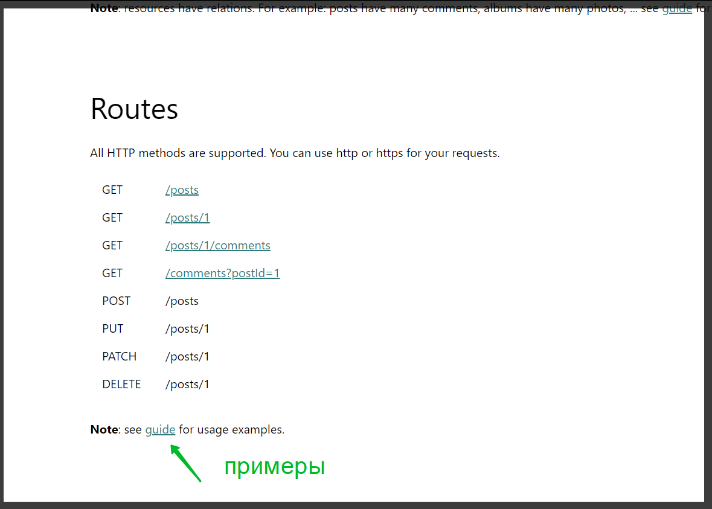

Например для **Create a resource** они используют **fetch**

```js
fetch('https://jsonplaceholder.typicode.com/posts', {
  method: 'POST',
  body: JSON.stringify({
    title: 'foo',
    body: 'bar',
    userId: 1,
  }),
  headers: {
    'Content-type': 'application/json; charset=UTF-8',
  },
})
  .then((response) => response.json())
  .then((json) => console.log(json))

// Output

{
  id: 101,
  title: 'foo',
  body: 'bar',
  userId: 1
}
```

Мы к **fetch** еще не подобрались. В будущем будем его разбирать в том числе. Здесь есть пример что они делают пример на адрес **'https://jsonplaceholder.typicode.com/posts'** методом **POST**. И в тело запроса передают объект будущего нашего поста.

Помимо этого они передаю заголовки запроса.

```js
 headers: {
    'Content-type': 'application/json; charset=UTF-8',
  },
```
Эти заголовки нужны для того что бы сервер правильно распознавал в каком формате мы будем передавать данные что мы их передаем в формате **JSON**.

Давайте попробуем реализовать. Я передаю **POST** запрос на тот же адрес который и был. В параметры функции **createPost** буду принимать **body** т.е. то что мы хотим отправить и **callback** т.е. **cb** который мы хотим вызвать когда придет ответ от сервера. **body** я буду передавать в вызов **xhr.send(body)** для того что бы от отправился на сервер. Предварительно нам его нужно будет превратить в **JSON**. Для этого **xhr.send(JSON.stringify(body));**

```js
const btn = document.querySelector("button");
const container = document.querySelector(".container");

function getPosts(cb) {
  const xhr = new XMLHttpRequest();
  xhr.open("GET", "https://jsonplaceholder.typicode.com/posts");
  xhr.addEventListener("load", () => {
    const response = JSON.parse(xhr.responseText);
    cb(response);
  });

  xhr.addEventListener("error", () => {
    console.log("error");
  });

  xhr.send();
}

function createPost(body, cb){
    const xhr = new XMLHttpRequest();
  xhr.open("POST", "https://jsonplaceholder.typicode.com/posts");
  xhr.addEventListener("load", () => {
    const response = JSON.parse(xhr.responseText);
    cb(response);
  });

  xhr.addEventListener("error", () => {
    console.log("error");
  });

  xhr.send(JSON.stringify(body));
}

function renderPosts(response) {
  const fragment = document.createDocumentFragment();
  response.forEach((post) => {
    const card = document.createElement("div");
    card.classList.add("card");
    const cardBody = document.createElement("div");
    cardBody.classList.add("card-body");
    const title = document.createElement("h5");
    title.classList.add("card-title");
    title.textContent = post.title;
    const article = document.createElement("p");
    article.classList.add("card-text");
    article.textContent = post.body;
    cardBody.appendChild(title);
    cardBody.appendChild(article);
    card.appendChild(cardBody);
    fragment.appendChild(card);
  });
  container.appendChild(fragment);
}

btn.addEventListener("click", (e) => {
  getPosts(renderPosts);
});
```

Так же нам нужно проставлять заголовки. Это мы сделаем чуточку позже. Посмотрим что будет если мы не проставим эти заголовки.

Теперь в разметке сделаю еще одну кнопку.

```html
<!DOCTYPE html>
<html lang="en">
  <head>
    <meta charset="UTF-8" />
    <meta name="viewport" content="width=device-width, initial-scale=1.0" />
    <link
      rel="stylesheet"
      href="https://stackpath.bootstrapcdn.com/bootstrap/4.5.2/css/bootstrap.min.css"
      integrity="sha384-JcKb8q3iqJ61gNV9KGb8thSsNjpSL0n8PARn9HuZOnIxN0hoP+VmmDGMN5t9UJ0Z"
      crossorigin="anonymous"
    />
    <title>Document</title>
  </head>
  <body>
    <h1>AJAX</h1>
    <button class="btn btn-primary btn-get-post">Get posts</button>
    <button class="btn btn-danger btn-add-post">Add new posts</button>
    <div class="container"></div>
    <script src="app.js"></script>
  </body>
</html>

```
Теперь у нас есть кнопка добавить **post** и получить **post**. Также кнопкам я задал специфичные классы для того что бы потом в скрипте их достать. В **app.js** находим эти кнопки.

```js
const btn = document.querySelector(".btn-get-post");
const btnAddPost = document.querySelector(".btn-add-post")
const container = document.querySelector(".container");

function getPosts(cb) {
  const xhr = new XMLHttpRequest();
  xhr.open("GET", "https://jsonplaceholder.typicode.com/posts");
  xhr.addEventListener("load", () => {
    const response = JSON.parse(xhr.responseText);
    cb(response);
  });

  xhr.addEventListener("error", () => {
    console.log("error");
  });

  xhr.send();
}

function createPost(body, cb){
    const xhr = new XMLHttpRequest();
  xhr.open("POST", "https://jsonplaceholder.typicode.com/posts");
  xhr.addEventListener("load", () => {
    const response = JSON.parse(xhr.responseText);
    cb(response);
  });

  xhr.addEventListener("error", () => {
    console.log("error");
  });

  xhr.send(JSON.stringify(body));
}

function renderPosts(response) {
  const fragment = document.createDocumentFragment();
  response.forEach((post) => {
    const card = document.createElement("div");
    card.classList.add("card");
    const cardBody = document.createElement("div");
    cardBody.classList.add("card-body");
    const title = document.createElement("h5");
    title.classList.add("card-title");
    title.textContent = post.title;
    const article = document.createElement("p");
    article.classList.add("card-text");
    article.textContent = post.body;
    cardBody.appendChild(title);
    cardBody.appendChild(article);
    card.appendChild(cardBody);
    fragment.appendChild(card);
  });
  container.appendChild(fragment);
}

btn.addEventListener("click", (e) => {
  getPosts(renderPosts);
});

```

При клике на **btnAddPost.addEventListtener("click",)** в обработчике события мы должны будем делать запрос, вызывать функцию **createPost()** в которую мы должны передать тело запроса. По примеру я могу передать такой же объект.

```js
const btn = document.querySelector(".btn-get-post");
const btnAddPost = document.querySelector(".btn-add-post");
const container = document.querySelector(".container");

function getPosts(cb) {
  const xhr = new XMLHttpRequest();
  xhr.open("GET", "https://jsonplaceholder.typicode.com/posts");
  xhr.addEventListener("load", () => {
    const response = JSON.parse(xhr.responseText);
    cb(response);
  });

  xhr.addEventListener("error", () => {
    console.log("error");
  });

  xhr.send();
}

function createPost(body, cb) {
  const xhr = new XMLHttpRequest();
  xhr.open("POST", "https://jsonplaceholder.typicode.com/posts");
  xhr.addEventListener("load", () => {
    const response = JSON.parse(xhr.responseText);
    cb(response);
  });

  xhr.addEventListener("error", () => {
    console.log("error");
  });

  xhr.send(JSON.stringify(body));
}

function renderPosts(response) {
  const fragment = document.createDocumentFragment();
  response.forEach((post) => {
    const card = document.createElement("div");
    card.classList.add("card");
    const cardBody = document.createElement("div");
    cardBody.classList.add("card-body");
    const title = document.createElement("h5");
    title.classList.add("card-title");
    title.textContent = post.title;
    const article = document.createElement("p");
    article.classList.add("card-text");
    article.textContent = post.body;
    cardBody.appendChild(title);
    cardBody.appendChild(article);
    card.appendChild(cardBody);
    fragment.appendChild(card);
  });
  container.appendChild(fragment);
}

btn.addEventListener("click", (e) => {
  getPosts(renderPosts);
});

btnAddPost.addEventListener("click", (e) => {
  createPost({
    title: "foo",
    body: "bar",
    userId: 1,
  });
});
```

Вынесу этот объект в переменную что бы было более удобнее. А так же вторым аргументом мне нужно передать функцию которая примет ответ от сервера **(response) => {}** и мы его выведем в консоль.

```js
const btn = document.querySelector(".btn-get-post");
const btnAddPost = document.querySelector(".btn-add-post");
const container = document.querySelector(".container");

function getPosts(cb) {
  const xhr = new XMLHttpRequest();
  xhr.open("GET", "https://jsonplaceholder.typicode.com/posts");
  xhr.addEventListener("load", () => {
    const response = JSON.parse(xhr.responseText);
    cb(response);
  });

  xhr.addEventListener("error", () => {
    console.log("error");
  });

  xhr.send();
}

function createPost(body, cb) {
  const xhr = new XMLHttpRequest();
  xhr.open("POST", "https://jsonplaceholder.typicode.com/posts");
  xhr.addEventListener("load", () => {
    const response = JSON.parse(xhr.responseText);
    cb(response);
  });

  xhr.addEventListener("error", () => {
    console.log("error");
  });

  xhr.send(JSON.stringify(body));
}

function renderPosts(response) {
  const fragment = document.createDocumentFragment();
  response.forEach((post) => {
    const card = document.createElement("div");
    card.classList.add("card");
    const cardBody = document.createElement("div");
    cardBody.classList.add("card-body");
    const title = document.createElement("h5");
    title.classList.add("card-title");
    title.textContent = post.title;
    const article = document.createElement("p");
    article.classList.add("card-text");
    article.textContent = post.body;
    cardBody.appendChild(title);
    cardBody.appendChild(article);
    card.appendChild(cardBody);
    fragment.appendChild(card);
  });
  container.appendChild(fragment);
}

btn.addEventListener("click", (e) => {
  getPosts(renderPosts);
});

btnAddPost.addEventListener("click", (e) => {
  const newPost = {
    title: "foo",
    body: "bar",
    userId: 1,
  };
  createPost(newPost, (response) => {
    console.log(response);
  });
});
```
И так что мы с вами сделали. Мы с вами создали функцию **createPost**. Она пока что делает тоже сомое, не обращайте внимания, мы немного занимаемся дублированием, но мы с вами в будущем сделаем немного иначе. 

У нас функция **createPost** принимает тело запроса **body** которое мы хотим отправить и **callback** должен выполнится в результате успешного ответа от сервера. И в**xhr.send(JSON.stringify(body));** мы передаем наше тело в формате **JSON**.

Далее мы по клику на кнопку **addPost** создаем новый объект **post** и отправляем его в функцию **createPost** и передаем **callback** который должен выполнится когда мы получим ответ от сервера.

Сморим работает ли это.

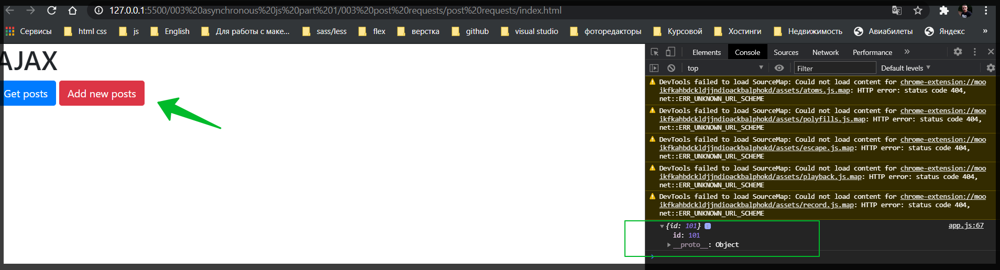

Нам приходит **id: 101**. Вообще мы запрос можем посмотреть в Network. Подробнее о нем будет в отдельном видео. Здесь мы можем увидеть те запросы и мы можем выбрать запросы только **XHR** и увидить что мы отправили запрос.

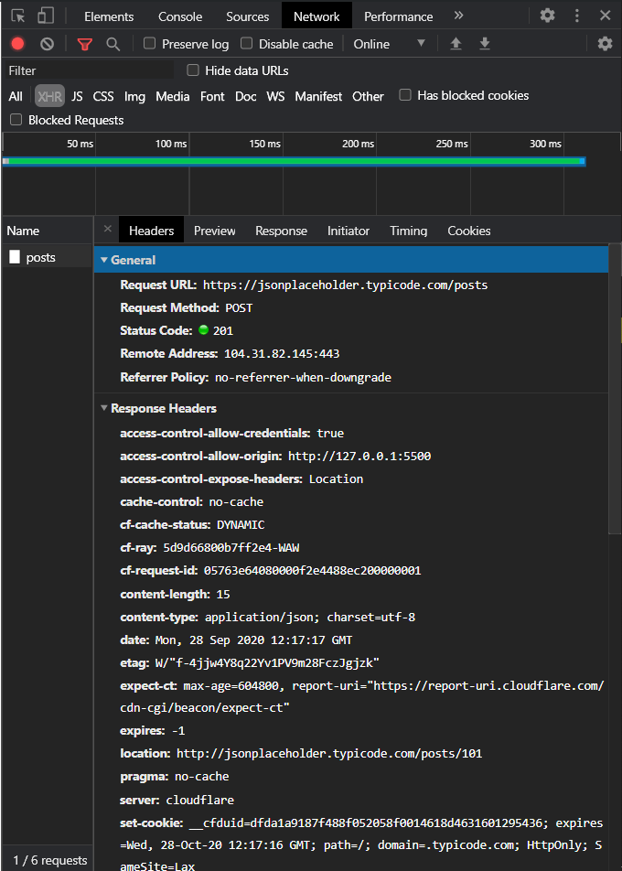

Здесь видно куда мы отправили, каким методом. В **Response** можно посмотреть что нам пришло.

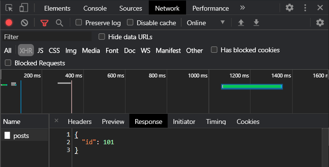

Если мы псмотрим в **JSONPlaceholder** то здесь указано что в ответе должна прийти вот такая запись.

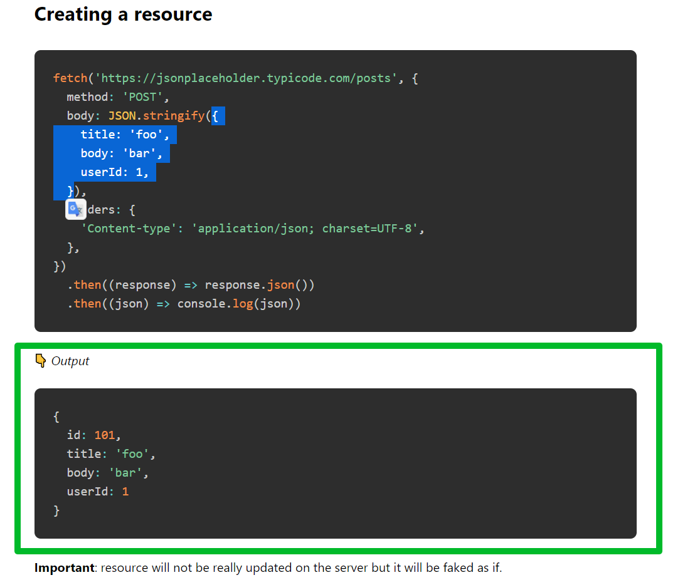

Не пришло это как раз таки потому что мы не установили **Content-type** т.е. 

```js
headers: {
    'Content-type': 'application/json; charset=UTF-8',
  },
```

Сервер не распознал что мы ему отправляем и вернул вот такой вариант как мы получили. 
поэтому давайте за **set**-тим. **xhr.setRequestHeader()** он принимает имя заголовка **"Content-type"**, и он принимает значение **application/json; charset=UTF-8**.

```js
const btn = document.querySelector(".btn-get-post");
const btnAddPost = document.querySelector(".btn-add-post");
const container = document.querySelector(".container");

function getPosts(cb) {
  const xhr = new XMLHttpRequest();
  xhr.open("GET", "https://jsonplaceholder.typicode.com/posts");
  xhr.addEventListener("load", () => {
    const response = JSON.parse(xhr.responseText);
    cb(response);
  });

  xhr.addEventListener("error", () => {
    console.log("error");
  });

  xhr.send();
}

function createPost(body, cb) {
  const xhr = new XMLHttpRequest();
  xhr.open("POST", "https://jsonplaceholder.typicode.com/posts");
  xhr.addEventListener("load", () => {
    const response = JSON.parse(xhr.responseText);
    cb(response);
  });

  xhr.setRequestHeader("Content-type", "application/json; charset=UTF-8");

  xhr.addEventListener("error", () => {
    console.log("error");
  });

  xhr.send(JSON.stringify(body));
}

function renderPosts(response) {
  const fragment = document.createDocumentFragment();
  response.forEach((post) => {
    const card = document.createElement("div");
    card.classList.add("card");
    const cardBody = document.createElement("div");
    cardBody.classList.add("card-body");
    const title = document.createElement("h5");
    title.classList.add("card-title");
    title.textContent = post.title;
    const article = document.createElement("p");
    article.classList.add("card-text");
    article.textContent = post.body;
    cardBody.appendChild(title);
    cardBody.appendChild(article);
    card.appendChild(cardBody);
    fragment.appendChild(card);
  });
  container.appendChild(fragment);
}

btn.addEventListener("click", (e) => {
  getPosts(renderPosts);
});

btnAddPost.addEventListener("click", (e) => {
  const newPost = {
    title: "foo",
    body: "bar",
    userId: 1,
  };
  createPost(newPost, (response) => {
    console.log(response);
  });
});
```

Теперь если мы с вами выполним все тоже самое нажмем **add new post**, то мы увидим что мы получим объект полноценный.

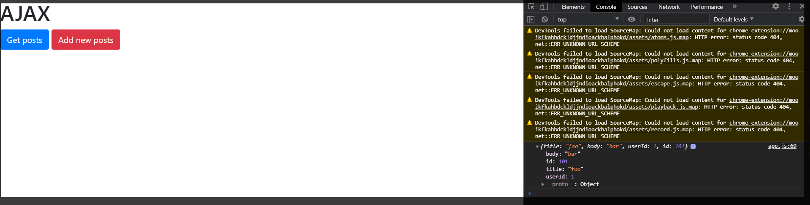

Если мы зайдем в **Network** и посмотрим на наш запрос, то мы увидим что мы отправили запрос, куда отправили и здесь есть **Request Headers**. Где мы указали свой **content-type**.

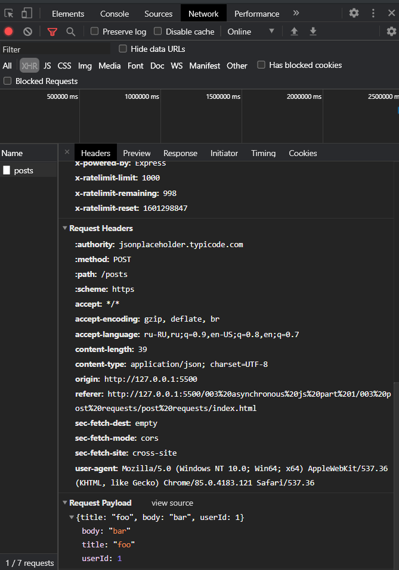

Теперь сервер правильно понял что мы хотим, что нам вернуть и соответсвенно венул нам новое значение. Вот так довольно таки легко мы можем сделать **post запрос**.

Следующая задача это добавлять наш **post** на страницу. Фактически мы будем добавлять такующе карточку как мы и создавали при рендеринге постов т.е. точно такуже карточку

```js
function renderPosts(response) {
  const fragment = document.createDocumentFragment();
  response.forEach((post) => {
    const card = document.createElement("div");
    card.classList.add("card");
    const cardBody = document.createElement("div");
    cardBody.classList.add("card-body");
    const title = document.createElement("h5");
    title.classList.add("card-title");
    title.textContent = post.title;
    const article = document.createElement("p");
    article.classList.add("card-text");
    article.textContent = post.body;
    cardBody.appendChild(title);
    cardBody.appendChild(article);
    card.appendChild(cardBody);
    fragment.appendChild(card);
  });
  container.appendChild(fragment);
}

```

Но здесь мы использовали массив так как **Get post** получает массив. Это можно немного упростить и вынести создание карточки в отдельную функцию, для того что бы иметь возможность ее вызвать в дальнейшем от **renderPosts**. Потому что в **renderPosts** мы рендерим конкретно все посты. А мы может быть хотим добавить какой-то отдельный пост. Соответственно этот шаблон, с помощью которого мы создвали мы можем вынести в отдельную функцию.

Создаю **function cardTemplate(post){}** он будет принимать **post** и на его основе создавать карточку

```js
const btn = document.querySelector(".btn-get-post");
const btnAddPost = document.querySelector(".btn-add-post");
const container = document.querySelector(".container");

function getPosts(cb) {
  const xhr = new XMLHttpRequest();
  xhr.open("GET", "https://jsonplaceholder.typicode.com/posts");
  xhr.addEventListener("load", () => {
    const response = JSON.parse(xhr.responseText);
    cb(response);
  });

  xhr.addEventListener("error", () => {
    console.log("error");
  });

  xhr.send();
}

function createPost(body, cb) {
  const xhr = new XMLHttpRequest();
  xhr.open("POST", "https://jsonplaceholder.typicode.com/posts");
  xhr.addEventListener("load", () => {
    const response = JSON.parse(xhr.responseText);
    cb(response);
  });

  xhr.setRequestHeader("Content-type", "application/json; charset=UTF-8");

  xhr.addEventListener("error", () => {
    console.log("error");
  });

  xhr.send(JSON.stringify(body));
}

function cardTemplate(post) {
  const card = document.createElement("div");
  card.classList.add("card");
  const cardBody = document.createElement("div");
  cardBody.classList.add("card-body");
  const title = document.createElement("h5");
  title.classList.add("card-title");
  title.textContent = post.title;
  const article = document.createElement("p");
  article.classList.add("card-text");
  article.textContent = post.body;
  cardBody.appendChild(title);
  cardBody.appendChild(article);
  card.appendChild(cardBody);
  return card;
}

function renderPosts(response) {
  const fragment = document.createDocumentFragment();
  response.forEach((post) => {
    fragment.appendChild(card);
  });
  container.appendChild(fragment);
}

btn.addEventListener("click", (e) => {
  getPosts(renderPosts);
});

btnAddPost.addEventListener("click", (e) => {
  const newPost = {
    title: "foo",
    body: "bar",
    userId: 1,
  };
  createPost(newPost, (response) => {
    console.log(response);
  });
});
```

теперь он создает **DOM** объект, наполняет его на основании **post** и возвращает **card**.

Этот **cardTemplate** мы темерь можем вызывать в **renderPosts** **const card = cardTemplate(post);**

```js
const btn = document.querySelector(".btn-get-post");
const btnAddPost = document.querySelector(".btn-add-post");
const container = document.querySelector(".container");

function getPosts(cb) {
  const xhr = new XMLHttpRequest();
  xhr.open("GET", "https://jsonplaceholder.typicode.com/posts");
  xhr.addEventListener("load", () => {
    const response = JSON.parse(xhr.responseText);
    cb(response);
  });

  xhr.addEventListener("error", () => {
    console.log("error");
  });

  xhr.send();
}

function createPost(body, cb) {
  const xhr = new XMLHttpRequest();
  xhr.open("POST", "https://jsonplaceholder.typicode.com/posts");
  xhr.addEventListener("load", () => {
    const response = JSON.parse(xhr.responseText);
    cb(response);
  });

  xhr.setRequestHeader("Content-type", "application/json; charset=UTF-8");

  xhr.addEventListener("error", () => {
    console.log("error");
  });

  xhr.send(JSON.stringify(body));
}

function cardTemplate(post) {
  const card = document.createElement("div");
  card.classList.add("card");
  const cardBody = document.createElement("div");
  cardBody.classList.add("card-body");
  const title = document.createElement("h5");
  title.classList.add("card-title");
  title.textContent = post.title;
  const article = document.createElement("p");
  article.classList.add("card-text");
  article.textContent = post.body;
  cardBody.appendChild(title);
  cardBody.appendChild(article);
  card.appendChild(cardBody);
  return card;
}

function renderPosts(response) {
  const fragment = document.createDocumentFragment();
  response.forEach((post) => {
    const card = cardTemplate(post);
    fragment.appendChild(card);
  });
  container.appendChild(fragment);
}

btn.addEventListener("click", (e) => {
  getPosts(renderPosts);
});

btnAddPost.addEventListener("click", (e) => {
  const newPost = {
    title: "foo",
    body: "bar",
    userId: 1,
  };
  createPost(newPost, (response) => {
    console.log(response);
  });
});
```

И дальше у нас все будет работать точно так же.

Но теперь мы можем создать эту карточку и у себя при создании POST.  В **createPost** я могу создать карточку и передать туда ответ.

```js
const btn = document.querySelector(".btn-get-post");
const btnAddPost = document.querySelector(".btn-add-post");
const container = document.querySelector(".container");

function getPosts(cb) {
  const xhr = new XMLHttpRequest();
  xhr.open("GET", "https://jsonplaceholder.typicode.com/posts");
  xhr.addEventListener("load", () => {
    const response = JSON.parse(xhr.responseText);
    cb(response);
  });

  xhr.addEventListener("error", () => {
    console.log("error");
  });

  xhr.send();
}

function createPost(body, cb) {
  const xhr = new XMLHttpRequest();
  xhr.open("POST", "https://jsonplaceholder.typicode.com/posts");
  xhr.addEventListener("load", () => {
    const response = JSON.parse(xhr.responseText);
    cb(response);
  });

  xhr.setRequestHeader("Content-type", "application/json; charset=UTF-8");

  xhr.addEventListener("error", () => {
    console.log("error");
  });

  xhr.send(JSON.stringify(body));
}

function cardTemplate(post) {
  const card = document.createElement("div");
  card.classList.add("card");
  const cardBody = document.createElement("div");
  cardBody.classList.add("card-body");
  const title = document.createElement("h5");
  title.classList.add("card-title");
  title.textContent = post.title;
  const article = document.createElement("p");
  article.classList.add("card-text");
  article.textContent = post.body;
  cardBody.appendChild(title);
  cardBody.appendChild(article);
  card.appendChild(cardBody);
  return card;
}

function renderPosts(response) {
  const fragment = document.createDocumentFragment();
  response.forEach((post) => {
    const card = cardTemplate(post);
    fragment.appendChild(card);
  });
  container.appendChild(fragment);
}

btn.addEventListener("click", (e) => {
  getPosts(renderPosts);
});

btnAddPost.addEventListener("click", (e) => {
  const newPost = {
    title: "foo",
    body: "bar",
    userId: 1,
  };
  createPost(newPost, (response) => {
    console.log(response);
    const card = cardTemplate(response);
    console.log(card);
  });
});
```

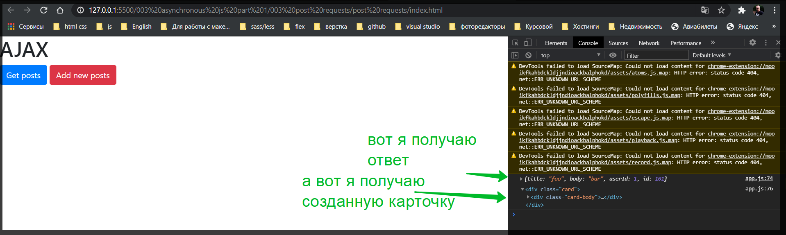

И мы теперь можем ее спокойно добавить в наш контейнер. Без использования впринципе **fragment** потому что карточка потому что карточка одна. **container.appendChild** или если мы хотим его добавить вначало потому что это **post** новый. Для этого я использую **container.insertAdJacentElement("befobegin", card)**.

```js
const btn = document.querySelector(".btn-get-post");
const btnAddPost = document.querySelector(".btn-add-post");
const container = document.querySelector(".container");

function getPosts(cb) {
  const xhr = new XMLHttpRequest();
  xhr.open("GET", "https://jsonplaceholder.typicode.com/posts");
  xhr.addEventListener("load", () => {
    const response = JSON.parse(xhr.responseText);
    cb(response);
  });

  xhr.addEventListener("error", () => {
    console.log("error");
  });

  xhr.send();
}

function createPost(body, cb) {
  const xhr = new XMLHttpRequest();
  xhr.open("POST", "https://jsonplaceholder.typicode.com/posts");
  xhr.addEventListener("load", () => {
    const response = JSON.parse(xhr.responseText);
    cb(response);
  });

  xhr.setRequestHeader("Content-type", "application/json; charset=UTF-8");

  xhr.addEventListener("error", () => {
    console.log("error");
  });

  xhr.send(JSON.stringify(body));
}

function cardTemplate(post) {
  const card = document.createElement("div");
  card.classList.add("card");
  const cardBody = document.createElement("div");
  cardBody.classList.add("card-body");
  const title = document.createElement("h5");
  title.classList.add("card-title");
  title.textContent = post.title;
  const article = document.createElement("p");
  article.classList.add("card-text");
  article.textContent = post.body;
  cardBody.appendChild(title);
  cardBody.appendChild(article);
  card.appendChild(cardBody);
  return card;
}

function renderPosts(response) {
  const fragment = document.createDocumentFragment();
  response.forEach((post) => {
    const card = cardTemplate(post);
    fragment.appendChild(card);
  });
  container.appendChild(fragment);
}

btn.addEventListener("click", (e) => {
  getPosts(renderPosts);
});

btnAddPost.addEventListener("click", (e) => {
  const newPost = {
    title: "foo",
    body: "bar",
    userId: 1,
  };
  createPost(newPost, (response) => {
    const card = cardTemplate(response);
    container.insertAdjacentElement("beforebegin", card);
  });
});
```
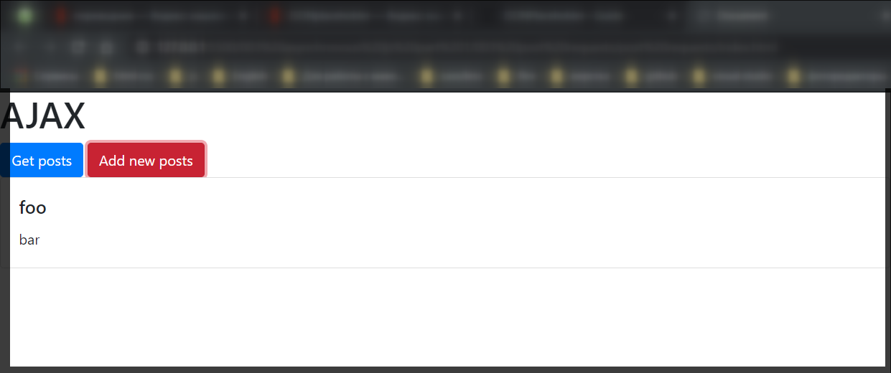

И вот он добавился. Проверим теперь если мы получили все посты. Жму  **Get posts** и после **Add new posts**.

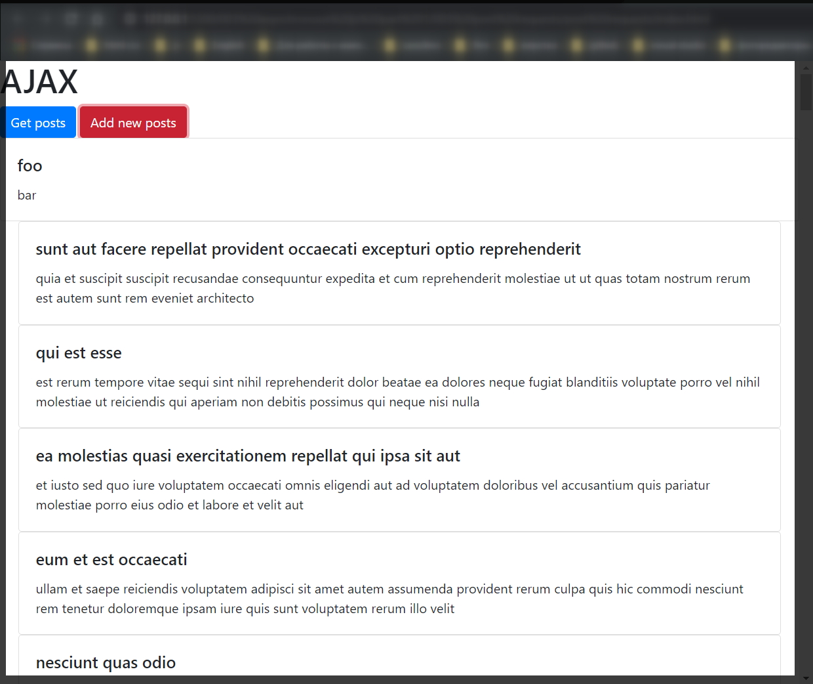

Так же добавляется.

Только beforebegin я написал не правильно так как он добавляется вне контейнер. А нужно **afterbegin**.

```js
const btn = document.querySelector(".btn-get-post");
const btnAddPost = document.querySelector(".btn-add-post");
const container = document.querySelector(".container");

function getPosts(cb) {
  const xhr = new XMLHttpRequest();
  xhr.open("GET", "https://jsonplaceholder.typicode.com/posts");
  xhr.addEventListener("load", () => {
    const response = JSON.parse(xhr.responseText);
    cb(response);
  });

  xhr.addEventListener("error", () => {
    console.log("error");
  });

  xhr.send();
}

function createPost(body, cb) {
  const xhr = new XMLHttpRequest();
  xhr.open("POST", "https://jsonplaceholder.typicode.com/posts");
  xhr.addEventListener("load", () => {
    const response = JSON.parse(xhr.responseText);
    cb(response);
  });

  xhr.setRequestHeader("Content-type", "application/json; charset=UTF-8");

  xhr.addEventListener("error", () => {
    console.log("error");
  });

  xhr.send(JSON.stringify(body));
}

function cardTemplate(post) {
  const card = document.createElement("div");
  card.classList.add("card");
  const cardBody = document.createElement("div");
  cardBody.classList.add("card-body");
  const title = document.createElement("h5");
  title.classList.add("card-title");
  title.textContent = post.title;
  const article = document.createElement("p");
  article.classList.add("card-text");
  article.textContent = post.body;
  cardBody.appendChild(title);
  cardBody.appendChild(article);
  card.appendChild(cardBody);
  return card;
}

function renderPosts(response) {
  const fragment = document.createDocumentFragment();
  response.forEach((post) => {
    const card = cardTemplate(post);
    fragment.appendChild(card);
  });
  container.appendChild(fragment);
}

btn.addEventListener("click", (e) => {
  getPosts(renderPosts);
});

btnAddPost.addEventListener("click", (e) => {
  const newPost = {
    title: "foo",
    body: "bar",
    userId: 1,
  };
  createPost(newPost, (response) => {
    const card = cardTemplate(response);
    container.insertAdjacentElement("afterbegin", card);
  });
});
```

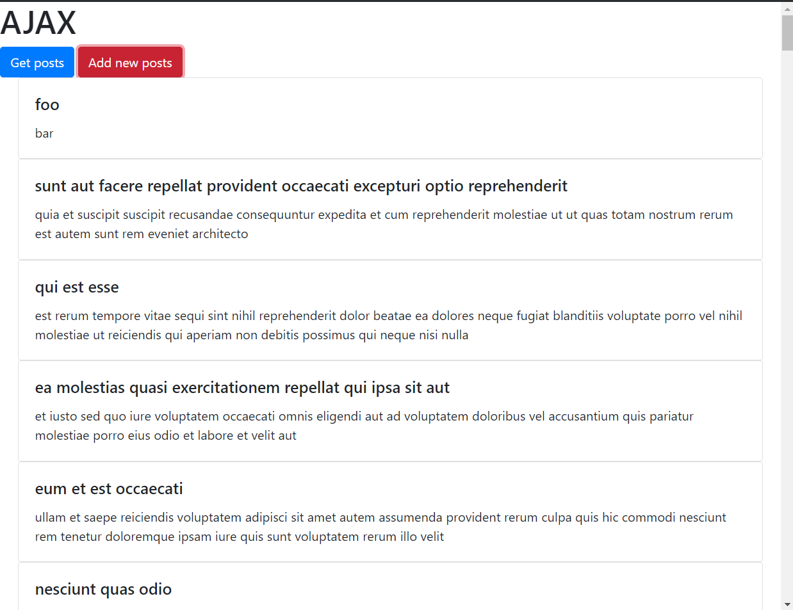

Функцию **createPost** так же можно вынести в отдельную функцию если у вас логика будет усложняться, если у вас появятся влюбом случае какие-то условия, вы будете что-то перепроверять и т.д. Но тем не менее мы с вами сделали такой базовый стандартный функционал с которым вы сможете столкнуться буквально ежедневно работая. Отправить запрос, получить данные и вывести их на страницу. Добавить новые данные  вывести результат на страницу и т.д.