# Отладка AJAX

Какие у нас есть инструменты для работы **AJAX** что бы отлавливать ошибки, как-то проверять его работу и различные ситуации?

Начнем с вкладки **Network** в которой мы можем отфильтровать наши запросы и выбрать фильтр **XHR**. Если мы делаем запросы то здесь мы можем увидеть как происходят эти запросы, сколько они времени занимают и т.д. Нажав на этот запрос мы с вами увидим более подробную информацию о запросе. 

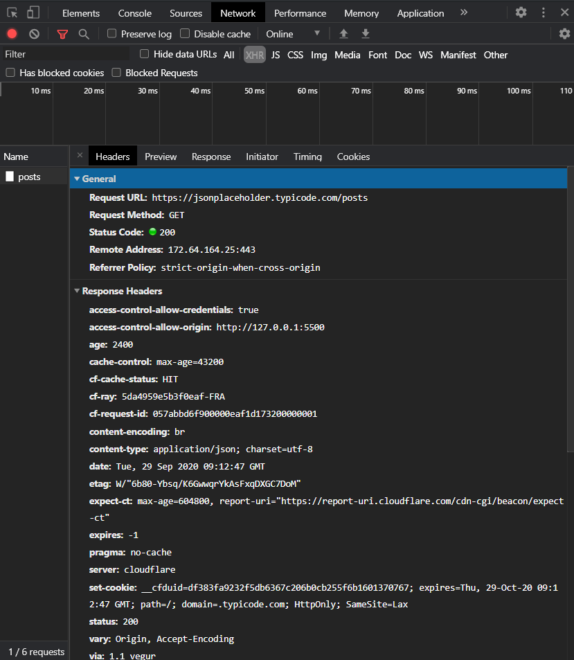

Куда мы делали запрос, каким методом, какие мы заголовки проставляли, какие мы заголовки получаем в ответе. Про заголовки мы в будущем будем говорить. 

Здесь мы можем смотреть **Preview**(предварительный просмотр) ответа.

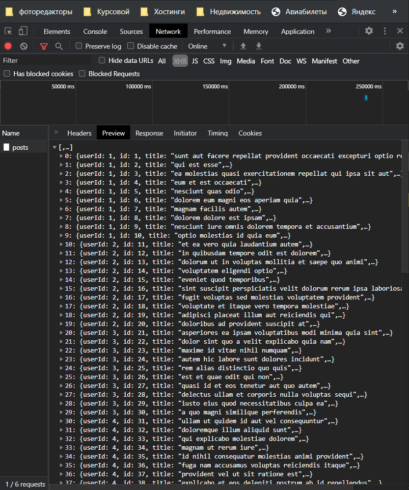

Это отформатированное **Preview** того что мы получили от сервера. 

Мы можем смотреть чистый **Response** в формате **JSON**

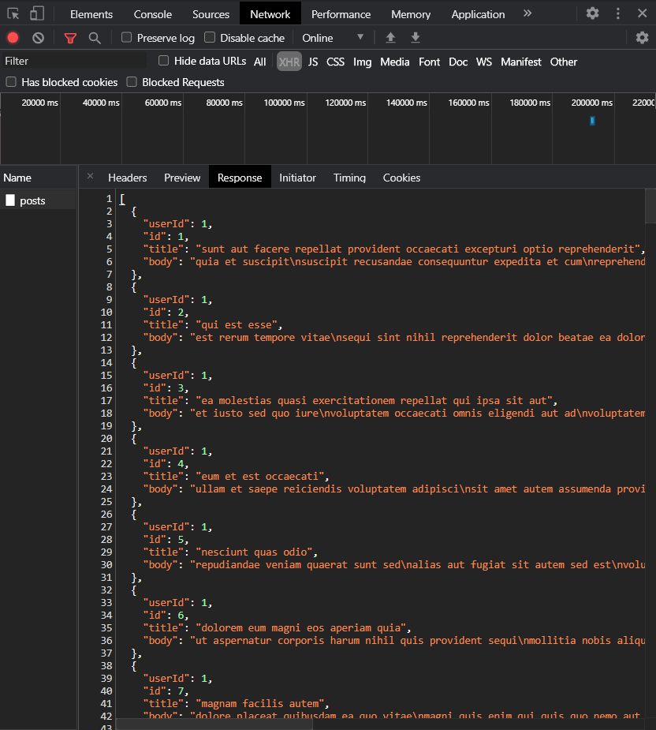

Так же во вкладке **Network** делать **offline** режим для нашего приложения и смотреть как оно себя будет вести в случае если у пользователя не будет сети.

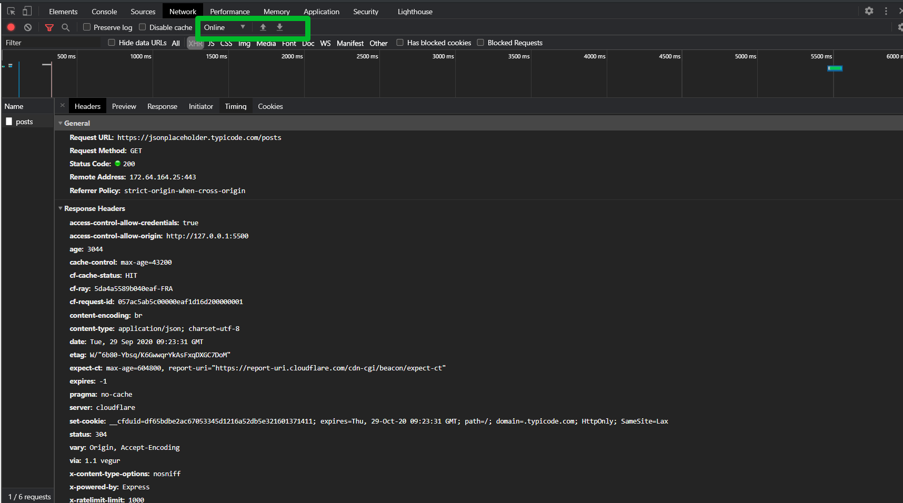

Там же я могу замедлять скорость интернета. Там же я могу добавлять какие-нибудь кастомные штуки.

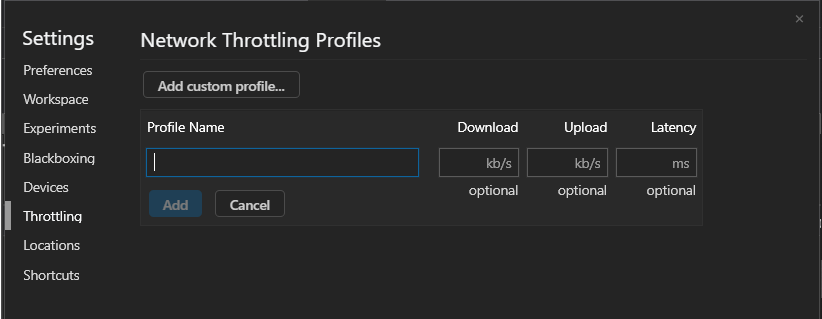

Здесь я могу задать какое-то имя, установить скорость загрузки запросов и могу установить задержку в соединении т.е. сколько будет идти соединение с нашим сервером. Наш браузер симулирует и мы посмотрим. Это очень важно проверять т.к. мы должны понимать как будет вести себя пользователь когда у него будет слабый интернет и т.д.

Во вкладке **Performance** я могу в **CPU** выставить медленную работу и смотреть как на более слабых девайсах будет работать наше приложение.

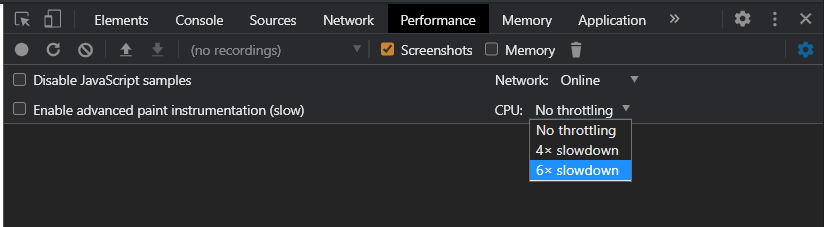

Так же в Network если я кликну правой кнопкой на запросе мы сможем открыть его в новой вкладке. Это действительно для **GET** запросов. Если мы так откроем **POST** запрос у нас все равно произойдет **POST** запрос.

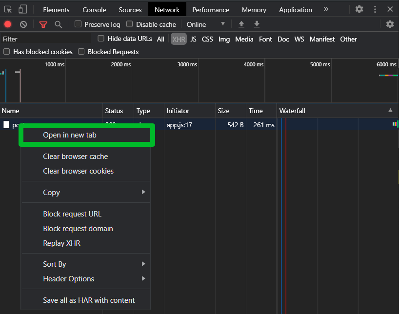

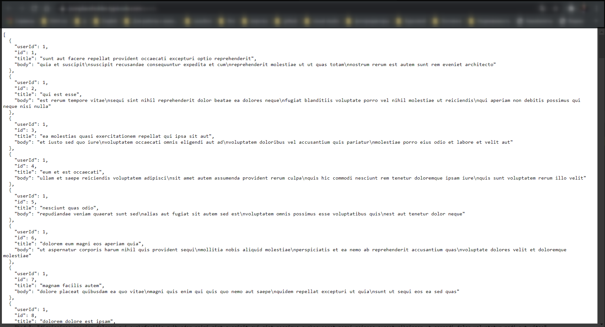

Так же мы можем копировать этот запрос в различных форматах.

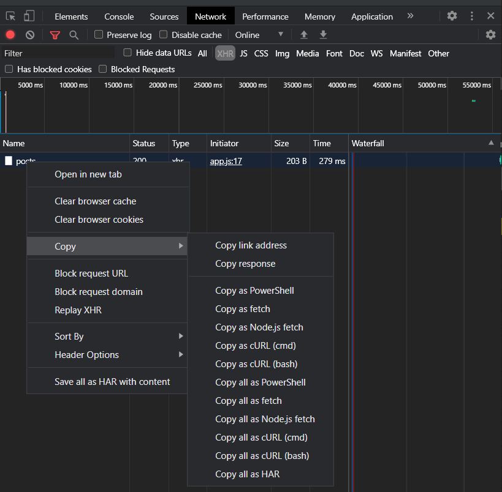

Копирование бывает довольно нужно штукой для того что бы его проверять где-то отдельно и делать запросы через другие системы.

Так же мы можем поторять запрос.

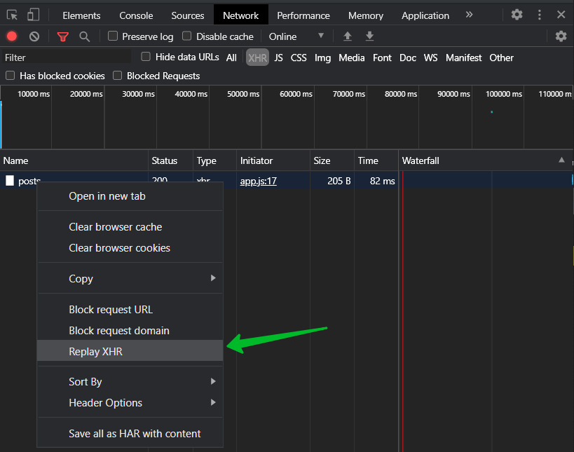

Это очень удобно при работе с **back-end** для того что бы заново что-то не клацать в приложении просто повторяем запрос и смотрим его результат.

Так же мы можем блокировать наш запрос для того что бы проверить как себя будет вести наше приложение если у нас например наш сервис очень часто бывает такое что мы делаем часто запросы на сторонние сервисы и на сторонние сервера и неизвестно как они себя будут вести в случае если т.е. как наше приложение будет себя вести если они не будут работать.

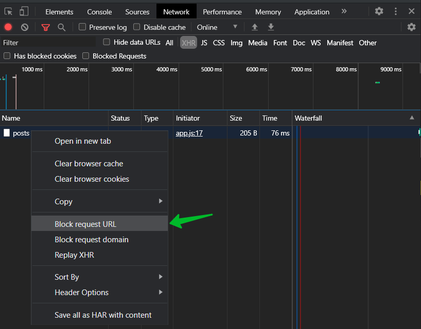

Помимо этого в разделе **Sources** в нашем **debuggin** мы можем. Здесь есть справа **XHR/fetch Breakpoints** где мы можем добавить **Breakpoint** и указать какое-то слово которое содержится в **URL**, например у нас это **posts** 

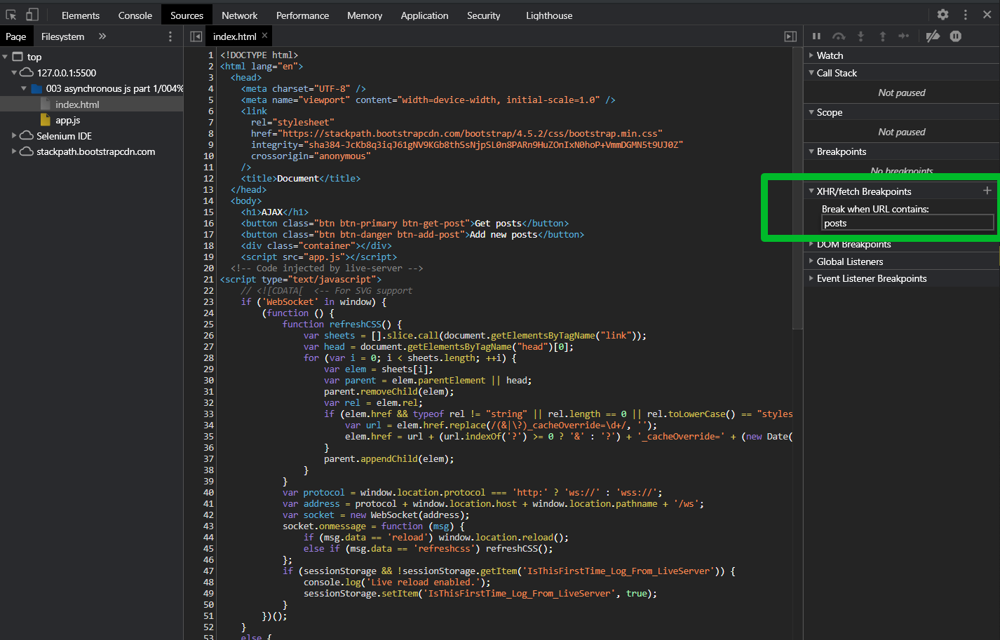

И когда будет происходить запрос

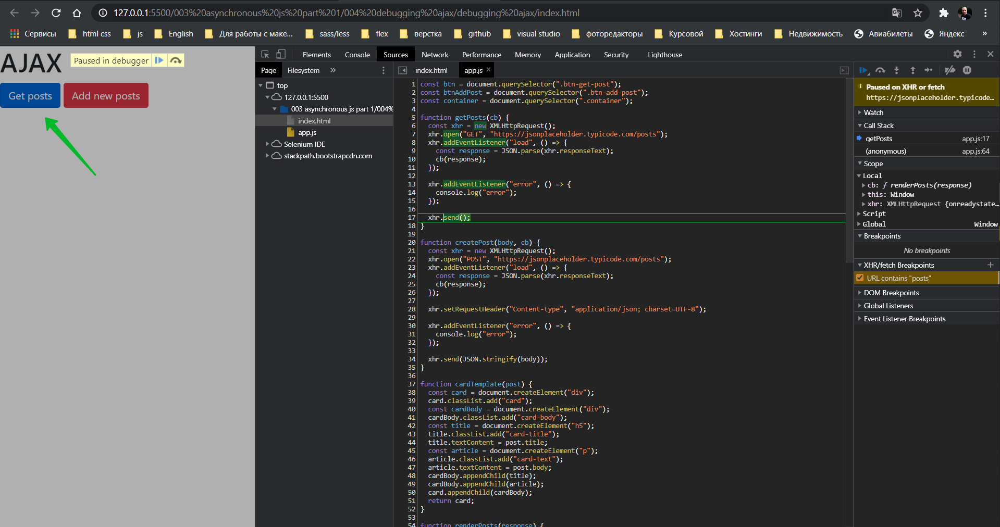

то мы выпадем сразу же в наш отладчик и сможем посмотреть что здесь происходило и т.д. При этом нам не нужно писать полностью адрес, нам нужно указать только какую-то часть которая содержится в адресе.

Пока что это в краце все. То что вам нужно в первую очередь для отладки. Это раздел **Network**.

Еще при **POST** запросе в **Network** у нас так же будет отображаться **Request Payload**

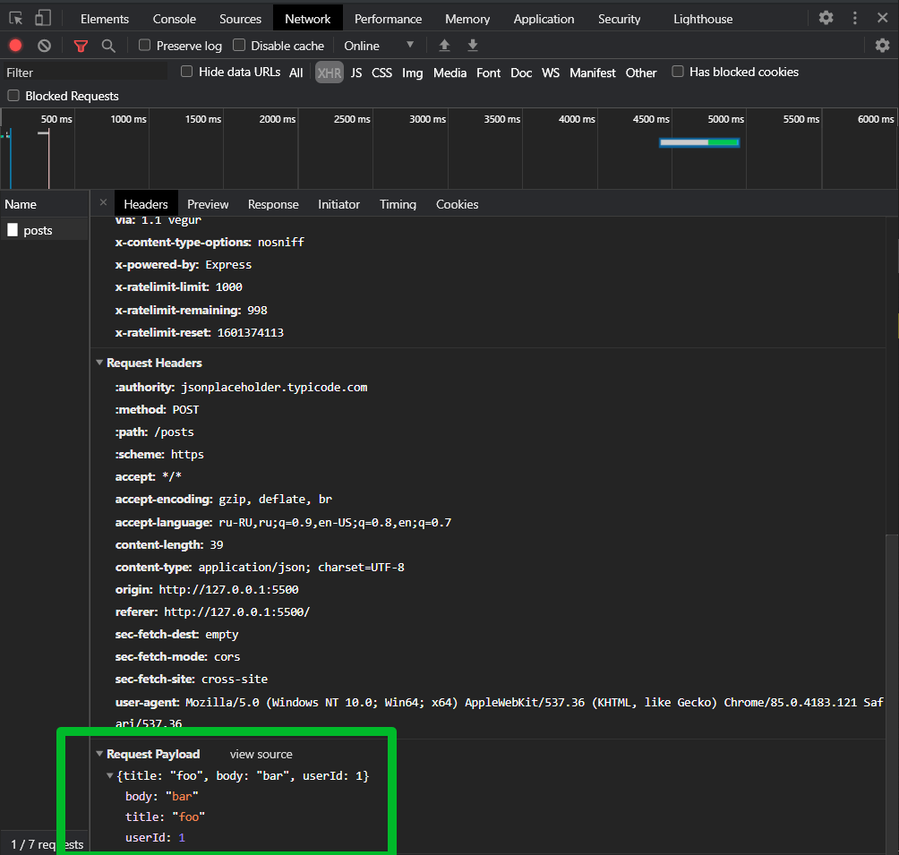

это то что мы отправляем на на сервер. Очень частая ошибка бывает что про это забывают, забывают посмотреть что отправляется на сервер и в итоге бьются какие-то ошибки просто потому что вы что-то не то туда отправляете. Всегда проверяйте что вы отправляете в случае POST запросов и т.д.
