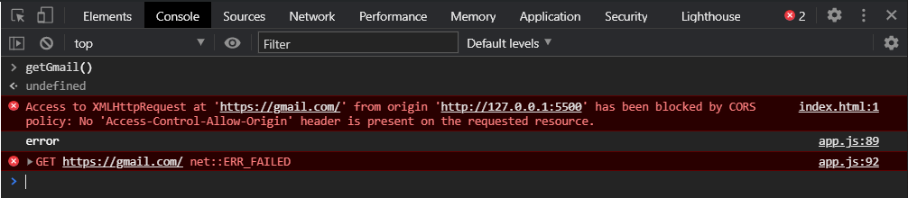
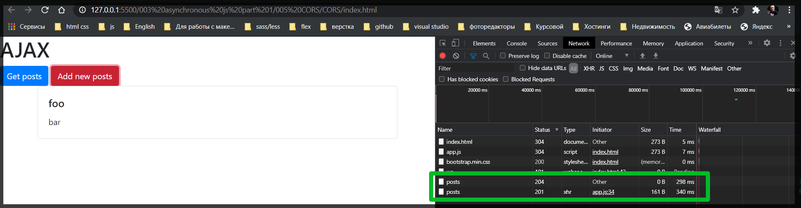
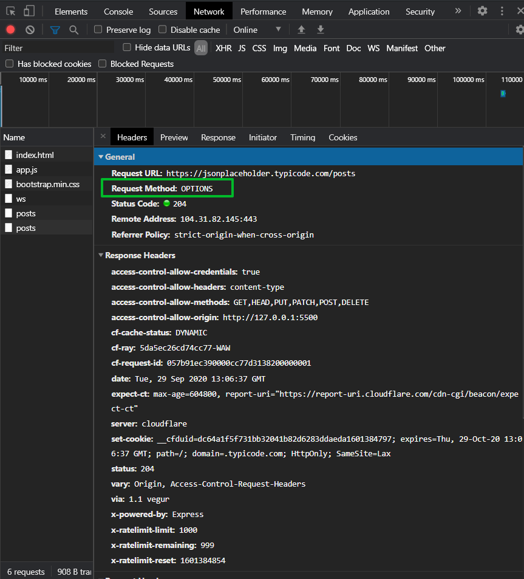
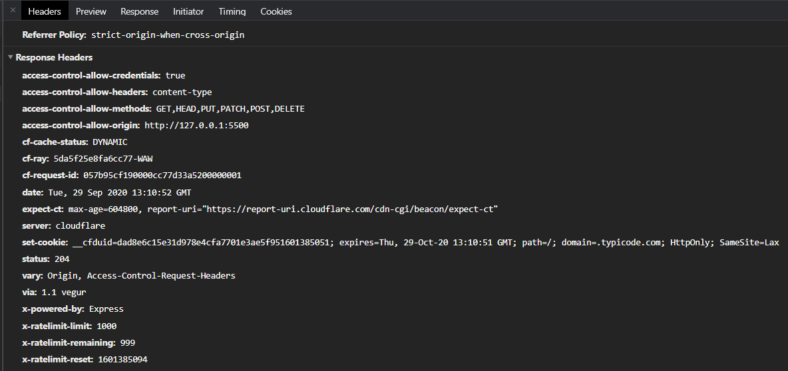
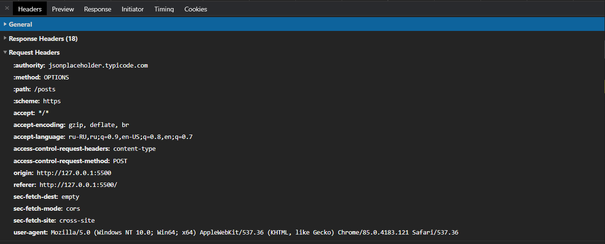
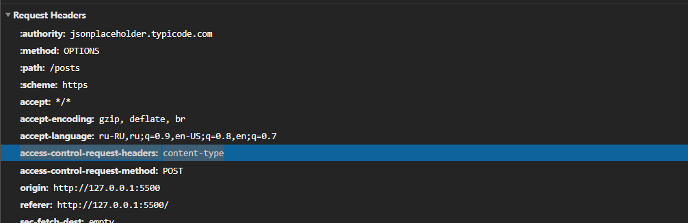
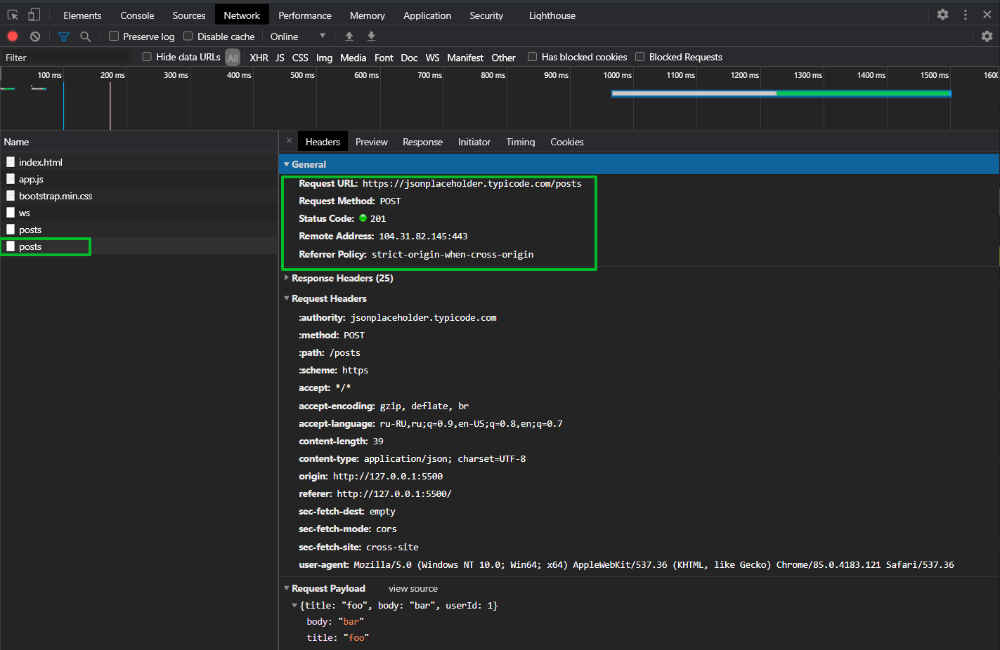
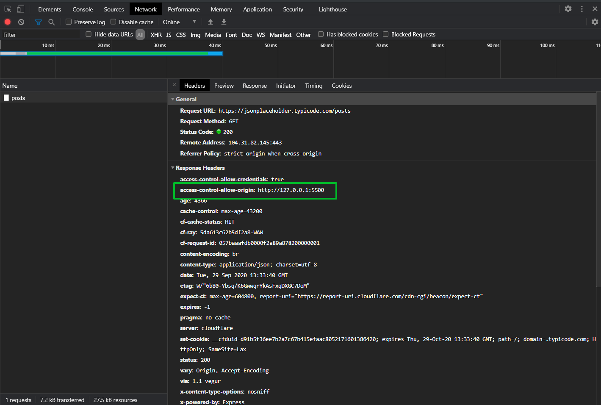

# CORS

С этим сталкивается каждый **font-end** разработчик когда отправляет запросы.

Давайте посмотрим когда мы получаем эту ошибку и что это такое? Копирую код функции **getPosts**. Чуть ниже добавляю коментарий CORS, вставляю эту функцию и переименовываю ее на **getGmail**.

```js
const btn = document.querySelector(".btn-get-post");
const btnAddPost = document.querySelector(".btn-add-post");
const container = document.querySelector(".container");

function getPosts(cb) {
  const xhr = new XMLHttpRequest();
  xhr.open("GET", "https://jsonplaceholder.typicode.com/posts");
  xhr.addEventListener("load", () => {
    const response = JSON.parse(xhr.responseText);
    cb(response);
  });

  xhr.addEventListener("error", () => {
    console.log("error");
  });

  xhr.send();
}

function createPost(body, cb) {
  const xhr = new XMLHttpRequest();
  xhr.open("POST", "https://jsonplaceholder.typicode.com/posts");
  xhr.addEventListener("load", () => {
    const response = JSON.parse(xhr.responseText);
    cb(response);
  });

  xhr.setRequestHeader("Content-type", "application/json; charset=UTF-8");

  xhr.addEventListener("error", () => {
    console.log("error");
  });

  xhr.send(JSON.stringify(body));
}

function cardTemplate(post) {
  const card = document.createElement("div");
  card.classList.add("card");
  const cardBody = document.createElement("div");
  cardBody.classList.add("card-body");
  const title = document.createElement("h5");
  title.classList.add("card-title");
  title.textContent = post.title;
  const article = document.createElement("p");
  article.classList.add("card-text");
  article.textContent = post.body;
  cardBody.appendChild(title);
  cardBody.appendChild(article);
  card.appendChild(cardBody);
  return card;
}

function renderPosts(response) {
  const fragment = document.createDocumentFragment();
  response.forEach((post) => {
    const card = cardTemplate(post);
    fragment.appendChild(card);
  });
  container.appendChild(fragment);
}

btn.addEventListener("click", (e) => {
  getPosts(renderPosts);
});

btnAddPost.addEventListener("click", (e) => {
  const newPost = {
    title: "foo",
    body: "bar",
    userId: 1,
  };
  createPost(newPost, (response) => {
    const card = cardTemplate(response);
    container.insertAdjacentElement("afterbegin", card);
  });
});

// СORS

function getGmail(cb) {
  const xhr = new XMLHttpRequest();
  xhr.open("GET", "https://gmail.com");
  xhr.addEventListener("load", () => {
    const response = JSON.parse(xhr.responseText);
    cb(response);
  });

  xhr.addEventListener("error", () => {
    console.log("error");
  });

  xhr.send();
}
```

И в этой функции меняю адрес на **https://gmail.com**. Удаляю

```js
const response = JSON.parse(xhr.responseText);
cb(response);
```

И внутри пытаюсь вывести и в консоль пытаюсь вывести xhr.responseText.

```js
const btn = document.querySelector(".btn-get-post");
const btnAddPost = document.querySelector(".btn-add-post");
const container = document.querySelector(".container");

function getPosts(cb) {
  const xhr = new XMLHttpRequest();
  xhr.open("GET", "https://jsonplaceholder.typicode.com/posts");
  xhr.addEventListener("load", () => {
    const response = JSON.parse(xhr.responseText);
    cb(response);
  });

  xhr.addEventListener("error", () => {
    console.log("error");
  });

  xhr.send();
}

function createPost(body, cb) {
  const xhr = new XMLHttpRequest();
  xhr.open("POST", "https://jsonplaceholder.typicode.com/posts");
  xhr.addEventListener("load", () => {
    const response = JSON.parse(xhr.responseText);
    cb(response);
  });

  xhr.setRequestHeader("Content-type", "application/json; charset=UTF-8");

  xhr.addEventListener("error", () => {
    console.log("error");
  });

  xhr.send(JSON.stringify(body));
}

function cardTemplate(post) {
  const card = document.createElement("div");
  card.classList.add("card");
  const cardBody = document.createElement("div");
  cardBody.classList.add("card-body");
  const title = document.createElement("h5");
  title.classList.add("card-title");
  title.textContent = post.title;
  const article = document.createElement("p");
  article.classList.add("card-text");
  article.textContent = post.body;
  cardBody.appendChild(title);
  cardBody.appendChild(article);
  card.appendChild(cardBody);
  return card;
}

function renderPosts(response) {
  const fragment = document.createDocumentFragment();
  response.forEach((post) => {
    const card = cardTemplate(post);
    fragment.appendChild(card);
  });
  container.appendChild(fragment);
}

btn.addEventListener("click", (e) => {
  getPosts(renderPosts);
});

btnAddPost.addEventListener("click", (e) => {
  const newPost = {
    title: "foo",
    body: "bar",
    userId: 1,
  };
  createPost(newPost, (response) => {
    const card = cardTemplate(response);
    container.insertAdjacentElement("afterbegin", card);
  });
});

// СORS

function getGmail(cb) {
  const xhr = new XMLHttpRequest();
  xhr.open("GET", "https://gmail.com");
  xhr.addEventListener("load", () => {
    console.log(xhr.responseText);
  });

  xhr.addEventListener("error", () => {
    console.log("error");
  });

  xhr.send();
}
```

И вызываю данную функцию прямо из консоли браузера.



И я получаю вот такую ошибку. Что это означает? Это означает то наш **gmail** не дает нам доступа и ругается на какие-то **CORS**-ы.

Что такое **CORS**?

**CORS(Cross-origin resource sharing)** - он позволяет описать политику или правила как один сайт будет предоставлять доступ к данным другого сайта.

Зачем это нужно?

Если не будет такой политики, то тогда любой сайт может пойти на другой сайт и забрать какие-то от туда ваши данные или сделать какие-то запросы.

CORS говорит нам о том что удаленный сервер должен предварительно разрешить операции, те которые к нему приходят запросы т.е. когда мы делаем какой-то запрос у нас в заголовках нашего запроса и в ответе от сервера при нашем запросе есть так называемые **Access-Control** заголовки в которых и определяется куда могут приходить запросы на сервер, с какими методами, какие заголовки можно показывать или вообще принимать и т.д.

Что происходит когда мы делаем запросы. Происходит так называемые **preflight** request или запросы **option** т.е. браузер сначало перед тем как делать какой-то запрос, это сделано для безопасности, идет на сервер. Посмотрим на нашем примере **AJAX**.

Если я кликаю на **Add** new **posts** у меня почему то в **XHR** показывается лишь один запрос вместо двух. Для того что бы увидель запрос со статусом **204** перехожу во вкладку **All**.



Один статус **204** второй статус **201**. Если мы посмотрим на статус **204** то мы увидим так называемый **Request Method: OPTIONS**



Этот запрос запрос который делает браузер. Его можно назвать предзапросом, который он делает перед тем как сделать мой запрос. Он как бы спрашивает у сервера какие методы он разрешает, с каких адресов он разрешает делать запросы и какие заголовки. Если мы посмотрим далее то увидим что здесь есть **Response Headers** и **Request Headers** т.е. заголовки запроса и заголовки ответа.





Если мы посмотрим то в заголовках запроса он отправляет в методе **OPTIONS access-control-request-headers: content-type**



Он отправляет и говорит что у нас есть заголовок **content-type** и **access-control-request-method: POST** т.е. мы делаем **post** запрос, **content-type** у нас там **JSON** и **origin: http://127.0.0.1:5500** откуда происходит наш запрос.

В **Response Headers** на этот метод нам приходит несколько заголовков

```
access-control-allow-credentials: true
access-control-allow-headers: content-type
access-control-allow-methods: GET,HEAD,PUT,PATCH,POST,DELETE
access-control-allow-origin: http://127.0.0.1:5500
```

В них говориться о том какие методы разрешены, разрешенные заголовки **content-type**, наш **origin** является разрешенным т.е. откуда мы делаем запрос вместо пути может быть звездочка в некоторых случаях и т.д. Тем самым сервер к которому мы делали запрос говорит что он разрешает эти запросы которые к нему собираются пойти.

и только после этого делается соответствующий запрос уже непосредственно **POST**.



Таким образом браузер обезопасивает сервер и не дает возможность делать запросы без разрешения на то сервера. 

Но не ко всем запросам отправляются prefly запросы с методом OPTIONS. Например если мы сделаем GET запрос, то prefly запроса не будет он не будет предварительно отправлять запрос, но тем не менее у нас все равно сервер будет указывать о том что он разрешает доступ с нашего адреса.



Обычно префлайд запросы не делаются если это **GET**, **HEAD** если они не содержат каких-то специфичных заголовков и т.д.

Вы должны помнить что не существует способа обойти эту безопасность браузера. Если на сервере не настроены **CORS**-ы или настроены так что вы не можете делать запросы откуда угодно, то вы с этим сделать ничего не сможете. На сервере могут быть настроены **CORS**-ы как под определенные адреса т.е. только с определенных адресов можно делать запрос, либо открыты для всех если это какой-то публичный **API**. Если вы сталкиваетесь с такой проблемой в работе что при попытке сделать запрос к вашему **API** вам приходит такая ошибка **CORS** то вы можете смело идти к **back-end** и просить его включить **CORS**-ы что бы дать доступ вам делать запросы на его сервер.
