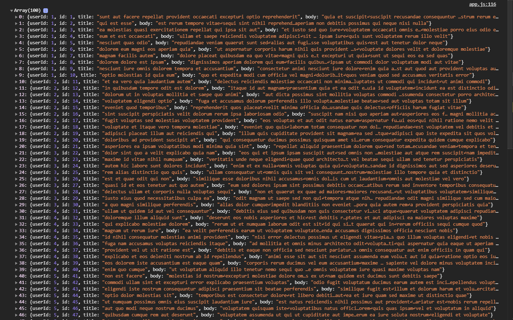
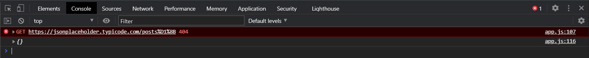

# Обработка ошибок

<br>

[http://callbackhell.com/](http://callbackhell.com/)

<br>

c прошлого проекта

```html
<!DOCTYPE html>
<html lang="en">
  <head>
    <meta charset="UTF-8" />
    <meta name="viewport" content="width=device-width, initial-scale=1.0" />
    <link
      rel="stylesheet"
      href="https://stackpath.bootstrapcdn.com/bootstrap/4.5.2/css/bootstrap.min.css"
      integrity="sha384-JcKb8q3iqJ61gNV9KGb8thSsNjpSL0n8PARn9HuZOnIxN0hoP+VmmDGMN5t9UJ0Z"
      crossorigin="anonymous"
    />
    <title>Document</title>
  </head>
  <body>
    <h1>AJAX</h1>
    <button class="btn btn-primary btn-get-post">Get posts</button>
    <button class="btn btn-danger btn-add-post">Add new posts</button>
    <div class="container"></div>
    <script src="app.js"></script>
  </body>
</html>
```

```js
const btn = document.querySelector(".btn-get-post");
const btnAddPost = document.querySelector(".btn-add-post");
const container = document.querySelector(".container");

function getPosts(cb) {
  const xhr = new XMLHttpRequest();
  xhr.open("GET", "https://jsonplaceholder.typicode.com/posts");
  xhr.addEventListener("load", () => {
    const response = JSON.parse(xhr.responseText);
    cb(response);
  });

  xhr.addEventListener("error", () => {
    console.log("error");
  });

  xhr.send();
}

function createPost(body, cb) {
  const xhr = new XMLHttpRequest();
  xhr.open("POST", "https://jsonplaceholder.typicode.com/posts");
  xhr.addEventListener("load", () => {
    const response = JSON.parse(xhr.responseText);
    cb(response);
  });

  xhr.setRequestHeader("Content-type", "application/json; charset=UTF-8");

  xhr.addEventListener("error", () => {
    console.log("error");
  });

  xhr.send(JSON.stringify(body));
}

function cardTemplate(post) {
  const card = document.createElement("div");
  card.classList.add("card");
  const cardBody = document.createElement("div");
  cardBody.classList.add("card-body");
  const title = document.createElement("h5");
  title.classList.add("card-title");
  title.textContent = post.title;
  const article = document.createElement("p");
  article.classList.add("card-text");
  article.textContent = post.body;
  cardBody.appendChild(title);
  cardBody.appendChild(article);
  card.appendChild(cardBody);
  return card;
}

function renderPosts(response) {
  const fragment = document.createDocumentFragment();
  response.forEach((post) => {
    const card = cardTemplate(post);
    fragment.appendChild(card);
  });
  container.appendChild(fragment);
}

btn.addEventListener("click", (e) => {
  getPosts(renderPosts);
});

btnAddPost.addEventListener("click", (e) => {
  const newPost = {
    title: "foo",
    body: "bar",
    userId: 1,
  };
  createPost(newPost, (response) => {
    const card = cardTemplate(response);
    container.insertAdjacentElement("afterbegin", card);
  });
});

// СORS

function getGmail(cb) {
  const xhr = new XMLHttpRequest();
  xhr.open("GET", "https://gmail.com");
  xhr.addEventListener("load", () => {
    console.log(xhr.responseText);
  });

  xhr.addEventListener("error", () => {
    console.log("error");
  });

  xhr.send();
}
```

Поговорим на тему обработки ошибок при запросах. Рассмотрим на примере прошлого проекта. Весь этот код в **app.js** не плох. Однако согласитесь было бы неплохо иметь универсальную функцию или набор универсальных функций под различные запросы. Потому что сейчас если я захочу сделать еще какой-то новый запрос мне нужно переиспользовать какую-то из этих функций или же писать еще одну новую функцию. Соответственно хотелось бы сделать какую-то универсальную функцию плюс сделать обработку ошибок.

Создаю новую функцию **myHttpRequest(){}**. Эта функция будет принимать метод запроса. Давайте это она будет принимать ввиде объекта, это я буду деструктурировать **{merthod, url} = {}** дефолтное значение будет пустым объектом, вторым аргументом будет принимать **callback**.

```js
function myHttpRequest({ method, url } = {}, cb) {}
```

Таким образом будет выглядеть наша функция. В теле функции мы будем делать все те же действия. По этому я скопирую весь этот код что был в **GET**.

```js
function myHttpRequest({ method, url } = {}, cb) {
  const xhr = new XMLHttpRequest();
  xhr.open("GET", "https://jsonplaceholder.typicode.com/posts");
  xhr.addEventListener("load", () => {
    const response = JSON.parse(xhr.responseText);
    cb(response);
  });

  xhr.addEventListener("error", () => {
    console.log("error");
  });

  xhr.send();
}
```

Но только вместо GET я буду подставлять переменную method, а вместо url **https://jsonplaceholder.typicode.com/posts** я буду подставлять **url** который передается снаружи. **Callback** так и остается при вызове.

```js
const btn = document.querySelector(".btn-get-post");
const btnAddPost = document.querySelector(".btn-add-post");
const container = document.querySelector(".container");

function getPosts(cb) {
  const xhr = new XMLHttpRequest();
  xhr.open("GET", "https://jsonplaceholder.typicode.com/posts");
  xhr.addEventListener("load", () => {
    const response = JSON.parse(xhr.responseText);
    cb(response);
  });

  xhr.addEventListener("error", () => {
    console.log("error");
  });

  xhr.send();
}

function createPost(body, cb) {
  const xhr = new XMLHttpRequest();
  xhr.open("POST", "https://jsonplaceholder.typicode.com/posts");
  xhr.addEventListener("load", () => {
    const response = JSON.parse(xhr.responseText);
    cb(response);
  });

  xhr.setRequestHeader("Content-type", "application/json; charset=UTF-8");

  xhr.addEventListener("error", () => {
    console.log("error");
  });

  xhr.send(JSON.stringify(body));
}

function cardTemplate(post) {
  const card = document.createElement("div");
  card.classList.add("card");
  const cardBody = document.createElement("div");
  cardBody.classList.add("card-body");
  const title = document.createElement("h5");
  title.classList.add("card-title");
  title.textContent = post.title;
  const article = document.createElement("p");
  article.classList.add("card-text");
  article.textContent = post.body;
  cardBody.appendChild(title);
  cardBody.appendChild(article);
  card.appendChild(cardBody);
  return card;
}

function renderPosts(response) {
  const fragment = document.createDocumentFragment();
  response.forEach((post) => {
    const card = cardTemplate(post);
    fragment.appendChild(card);
  });
  container.appendChild(fragment);
}

btn.addEventListener("click", (e) => {
  getPosts(renderPosts);
});

btnAddPost.addEventListener("click", (e) => {
  const newPost = {
    title: "foo",
    body: "bar",
    userId: 1,
  };
  createPost(newPost, (response) => {
    const card = cardTemplate(response);
    container.insertAdjacentElement("afterbegin", card);
  });
});

// СORS

function getGmail(cb) {
  const xhr = new XMLHttpRequest();
  xhr.open("GET", "https://gmail.com");
  xhr.addEventListener("load", () => {
    console.log(xhr.responseText);
  });

  xhr.addEventListener("error", () => {
    console.log("error");
  });

  xhr.send();
}

function myHttpRequest({ method, url } = {}, cb) {
  const xhr = new XMLHttpRequest();
  xhr.open(method, url);
  xhr.addEventListener("load", () => {
    const response = JSON.parse(xhr.responseText);
    cb(response);
  });

  xhr.addEventListener("error", () => {
    console.log("error");
  });

  xhr.send();
}
```

Проверяем что работает. В **myHttpRequest()** я передаю метод **"GET"** и **"https://jsonplaceholder.typicode.com/posts"**. Соответственно мы должны это все передавать объектом. И после этого объета должен идти наш **callback** т.е. это функия которая пример **res** и выведет его в консоль.

```js
const btn = document.querySelector(".btn-get-post");
const btnAddPost = document.querySelector(".btn-add-post");
const container = document.querySelector(".container");

function getPosts(cb) {
  const xhr = new XMLHttpRequest();
  xhr.open("GET", "https://jsonplaceholder.typicode.com/posts");
  xhr.addEventListener("load", () => {
    const response = JSON.parse(xhr.responseText);
    cb(response);
  });

  xhr.addEventListener("error", () => {
    console.log("error");
  });

  xhr.send();
}

function createPost(body, cb) {
  const xhr = new XMLHttpRequest();
  xhr.open("POST", "https://jsonplaceholder.typicode.com/posts");
  xhr.addEventListener("load", () => {
    const response = JSON.parse(xhr.responseText);
    cb(response);
  });

  xhr.setRequestHeader("Content-type", "application/json; charset=UTF-8");

  xhr.addEventListener("error", () => {
    console.log("error");
  });

  xhr.send(JSON.stringify(body));
}

function cardTemplate(post) {
  const card = document.createElement("div");
  card.classList.add("card");
  const cardBody = document.createElement("div");
  cardBody.classList.add("card-body");
  const title = document.createElement("h5");
  title.classList.add("card-title");
  title.textContent = post.title;
  const article = document.createElement("p");
  article.classList.add("card-text");
  article.textContent = post.body;
  cardBody.appendChild(title);
  cardBody.appendChild(article);
  card.appendChild(cardBody);
  return card;
}

function renderPosts(response) {
  const fragment = document.createDocumentFragment();
  response.forEach((post) => {
    const card = cardTemplate(post);
    fragment.appendChild(card);
  });
  container.appendChild(fragment);
}

btn.addEventListener("click", (e) => {
  getPosts(renderPosts);
});

btnAddPost.addEventListener("click", (e) => {
  const newPost = {
    title: "foo",
    body: "bar",
    userId: 1,
  };
  createPost(newPost, (response) => {
    const card = cardTemplate(response);
    container.insertAdjacentElement("afterbegin", card);
  });
});

// СORS

function getGmail(cb) {
  const xhr = new XMLHttpRequest();
  xhr.open("GET", "https://gmail.com");
  xhr.addEventListener("load", () => {
    console.log(xhr.responseText);
  });

  xhr.addEventListener("error", () => {
    console.log("error");
  });

  xhr.send();
}

function myHttpRequest({ method, url } = {}, cb) {
  const xhr = new XMLHttpRequest();
  xhr.open(method, url);
  xhr.addEventListener("load", () => {
    const response = JSON.parse(xhr.responseText);
    cb(response);
  });

  xhr.addEventListener("error", () => {
    console.log("error");
  });

  xhr.send();
}

myHttpRequest(
  {
    method: "GET",
    url: "https://jsonplaceholder.typicode.com/posts",
  },
  (res) => {
    console.log(res);
  }
);
```



Как видим у нас все отработало и я на 116 строке увидел ответ от сервера.

Что нам делать если мы будет молучать какие-то ошибки? Например мы можем ошибится с адресом куда мы делаем запрос. Мы получим ошибку **404**, но все равно выполнится **callback** который попадет в обработчик **load**

```js
xhr.addEventListener("load", () => {
    const response = JSON.parse(xhr.responseText);
    cb(response);
  }
```

Я напомню что **error** будет выполняться если у нас например мы делаем запрос не на тот адрес. Т.е. если я допущу именно в адресе, то тогда я выпаду в обработчик ошибки потому что браузер впринцыпе не смог связаться с нашим сервером.

В случае если же он с сервером связался, но сервер вернул какую-то ошибку, то мы будем попадать в то что мы успешно пообщались с сервером, получили от него какой-то результат. Дальше должны сами разобраться что с этим результатом делать. И если я ошибаюсь и делаю запрос не на тот маршрут, то я получу **404**, и пустой объект мне просто возвращает сервер, поэтому у меня получается вот такая штука.



Хотелось бы обработать эти ситуации. Начнем с того что мне нужно обработать ошибки которые нам может присылать сервер и нужно обработать статус кода. Нас устроит только тот случай если сервер нам будет возвращать статус код **200** или какой-то из двухсотых. Поэтому мы в нашем обработчике событий на загрузку пишем условие где мы проверяем что наш статус в объете **xhr** у нас есть свойство **status** где храниться код ответа. Все начинающиеся на двойку это будет успешный статус. Мы можем очень легко это проверить. Т.к. у нас может быть не один статус.

Мы можем сделать следующее. Я могу используя в параметрах условия **Math.floor()** в нем разделить **xhr.status / 100** и таким образом я получу какую-то цифру. Если статус будет равен например **200** то я получу цифру **2**, если **201** и т.д. то я получу какое-то дробное число тем самым округлив его вниз до двойки. И я проверяю что если результат этого деления не равен **!== 2**

```js
function myHttpRequest({ method, url } = {}, cb) {
  const xhr = new XMLHttpRequest();
  xhr.open(method, url);
  xhr.addEventListener("load", () => {
    if (Math.floor(xhr.status / 100) !== 2) {
    }
    const response = JSON.parse(xhr.responseText);
    cb(response);
  });

  xhr.addEventListener("error", () => {
    console.log("error");
  });

  xhr.send();
}

myHttpRequest(
  {
    method: "GET",
    url: "https://jsonplaceholder.typicode.com/posts",
  },
  (res) => {
    console.log(res);
  }
);
```

[Перейди сюда](error%20handling002.md)
