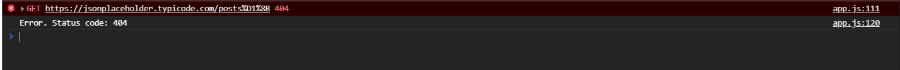
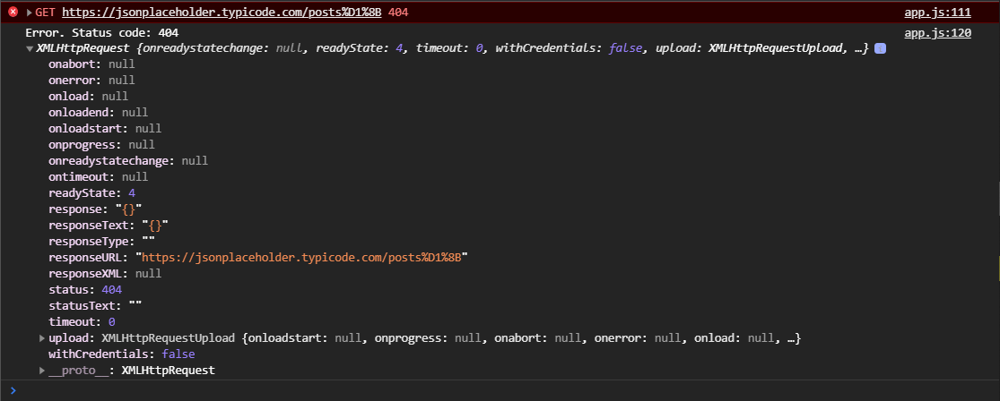
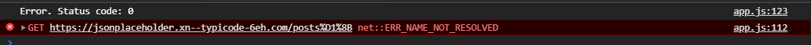
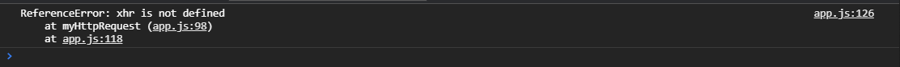

Продолжение

Мы можем проверить это в консоли. Короче получается **2**. Т.е. если в условии результат этого деления не равен **2**, значит статус не успешный, какой-то другой и мы должны как-то вернуть обратно нашему **callback** и сказать о том что у нас ошибка. И здесь мы должны узнать о некоторых так сказать соглашениях которые используются для **callback** особенно в случае запросов что **callback** должен принимать в качестве параметров. Первым параметром всегда объект ошибки, ну или ошибку, ну а вторым ответ от сервера. Т.е. в наш **callback** теперь мы должны передавать не ответ от сервера, первым аргументом, а ошибку. И уже вторым аргументом мы должны передавать ответ. Поэтому мы немного меняем наш **callback** и говорим что если произошла ошибка, то мы например вызываем **cb()** передаем туда ошибку, т.е. я могу написать текст **cb(`Error. Status code: ${xhr.status}`)**. И вторым аргументом я могу передать либо объект **xhr** что бы можно было что-то подробнее выцепить из ответа, или что то еще. Давайте ему обратно отправим **xhr**.

```js
const btn = document.querySelector(".btn-get-post");
const btnAddPost = document.querySelector(".btn-add-post");
const container = document.querySelector(".container");

function getPosts(cb) {
  const xhr = new XMLHttpRequest();
  xhr.open("GET", "https://jsonplaceholder.typicode.com/posts");
  xhr.addEventListener("load", () => {
    const response = JSON.parse(xhr.responseText);
    cb(response);
  });

  xhr.addEventListener("error", () => {
    console.log("error");
  });

  xhr.send();
}

function createPost(body, cb) {
  const xhr = new XMLHttpRequest();
  xhr.open("POST", "https://jsonplaceholder.typicode.com/posts");
  xhr.addEventListener("load", () => {
    const response = JSON.parse(xhr.responseText);
    cb(response);
  });

  xhr.setRequestHeader("Content-type", "application/json; charset=UTF-8");

  xhr.addEventListener("error", () => {
    console.log("error");
  });

  xhr.send(JSON.stringify(body));
}

function cardTemplate(post) {
  const card = document.createElement("div");
  card.classList.add("card");
  const cardBody = document.createElement("div");
  cardBody.classList.add("card-body");
  const title = document.createElement("h5");
  title.classList.add("card-title");
  title.textContent = post.title;
  const article = document.createElement("p");
  article.classList.add("card-text");
  article.textContent = post.body;
  cardBody.appendChild(title);
  cardBody.appendChild(article);
  card.appendChild(cardBody);
  return card;
}

function renderPosts(response) {
  const fragment = document.createDocumentFragment();
  response.forEach((post) => {
    const card = cardTemplate(post);
    fragment.appendChild(card);
  });
  container.appendChild(fragment);
}

btn.addEventListener("click", (e) => {
  getPosts(renderPosts);
});

btnAddPost.addEventListener("click", (e) => {
  const newPost = {
    title: "foo",
    body: "bar",
    userId: 1,
  };
  createPost(newPost, (response) => {
    const card = cardTemplate(response);
    container.insertAdjacentElement("afterbegin", card);
  });
});

// СORS

function getGmail(cb) {
  const xhr = new XMLHttpRequest();
  xhr.open("GET", "https://gmail.com");
  xhr.addEventListener("load", () => {
    console.log(xhr.responseText);
  });

  xhr.addEventListener("error", () => {
    console.log("error");
  });

  xhr.send();
}

function myHttpRequest({ method, url } = {}, cb) {
  const xhr = new XMLHttpRequest();
  xhr.open(method, url);
  xhr.addEventListener("load", () => {
    if (Math.floor(xhr.status / 100) !== 2) {
      cb(`Error. Status code: ${xhr.status}`, xhr);
      return;
    }
    const response = JSON.parse(xhr.responseText);
    cb(response);
  });

  xhr.addEventListener("error", () => {
    console.log("error");
  });

  xhr.send();
}

myHttpRequest(
  {
    method: "GET",
    url: "https://jsonplaceholder.typicode.com/posts",
  },
  (res) => {
    console.log(res);
  }
);
```

Т.е. теперь если я отправлю запрос не туда, то я получу в свой **cb** информацию об ошибке.



И уже в myHttpRequest, там где я вызываю свой запрос я буду вторым аргументом принимать два параметра это ошибка **err** и это **res**. И здесь я смогу консолить **err** и смогу консолить ответ **res**.

```js
const btn = document.querySelector(".btn-get-post");
const btnAddPost = document.querySelector(".btn-add-post");
const container = document.querySelector(".container");

function getPosts(cb) {
  const xhr = new XMLHttpRequest();
  xhr.open("GET", "https://jsonplaceholder.typicode.com/posts");
  xhr.addEventListener("load", () => {
    const response = JSON.parse(xhr.responseText);
    cb(response);
  });

  xhr.addEventListener("error", () => {
    console.log("error");
  });

  xhr.send();
}

function createPost(body, cb) {
  const xhr = new XMLHttpRequest();
  xhr.open("POST", "https://jsonplaceholder.typicode.com/posts");
  xhr.addEventListener("load", () => {
    const response = JSON.parse(xhr.responseText);
    cb(response);
  });

  xhr.setRequestHeader("Content-type", "application/json; charset=UTF-8");

  xhr.addEventListener("error", () => {
    console.log("error");
  });

  xhr.send(JSON.stringify(body));
}

function cardTemplate(post) {
  const card = document.createElement("div");
  card.classList.add("card");
  const cardBody = document.createElement("div");
  cardBody.classList.add("card-body");
  const title = document.createElement("h5");
  title.classList.add("card-title");
  title.textContent = post.title;
  const article = document.createElement("p");
  article.classList.add("card-text");
  article.textContent = post.body;
  cardBody.appendChild(title);
  cardBody.appendChild(article);
  card.appendChild(cardBody);
  return card;
}

function renderPosts(response) {
  const fragment = document.createDocumentFragment();
  response.forEach((post) => {
    const card = cardTemplate(post);
    fragment.appendChild(card);
  });
  container.appendChild(fragment);
}

btn.addEventListener("click", (e) => {
  getPosts(renderPosts);
});

btnAddPost.addEventListener("click", (e) => {
  const newPost = {
    title: "foo",
    body: "bar",
    userId: 1,
  };
  createPost(newPost, (response) => {
    const card = cardTemplate(response);
    container.insertAdjacentElement("afterbegin", card);
  });
});

// СORS

function getGmail(cb) {
  const xhr = new XMLHttpRequest();
  xhr.open("GET", "https://gmail.com");
  xhr.addEventListener("load", () => {
    console.log(xhr.responseText);
  });

  xhr.addEventListener("error", () => {
    console.log("error");
  });

  xhr.send();
}

function myHttpRequest({ method, url } = {}, cb) {
  const xhr = new XMLHttpRequest();
  xhr.open(method, url);
  xhr.addEventListener("load", () => {
    if (Math.floor(xhr.status / 100) !== 2) {
      cb(`Error. Status code: ${xhr.status}`, xhr);
      return;
    }
    const response = JSON.parse(xhr.responseText);
    cb(response);
  });

  xhr.addEventListener("error", () => {
    console.log("error");
  });

  xhr.send();
}

myHttpRequest(
  {
    method: "GET",
    url: "https://jsonplaceholder.typicode.com/postsы",
  },
  (err, res) => {
    console.log(err, res);
  }
);
```



Таким образом в случае ошибки здесь передаем строку с ошибкой **cb(`Error. Status code: ${xhr.status}`, xhr);** и передаем весь объект **xhr**. Соответственно здесь когда мы принимаем ее в нашем **callback**

```js
(err, res) => {
  console.log(err, res);
};
```

Мы ее принимаем как ошибку и как **res**. Мы можем проверить что если есть ошибка, то мы можем выполнить какие-то действия. Соответственно здесь мы делаем **return**

```js
function myHttpRequest({ method, url } = {}, cb) {
  const xhr = new XMLHttpRequest();
  xhr.open(method, url);
  xhr.addEventListener("load", () => {
    if (Math.floor(xhr.status / 100) !== 2) {
      cb(`Error. Status code: ${xhr.status}`, xhr);
      return;
    }
    const response = JSON.parse(xhr.responseText);
    cb(response);
  });

  xhr.addEventListener("error", () => {
    console.log("error");
  });

  xhr.send();
}
```

Функция дальше не продолжается. Иначе если статус **200** мы с вами парсим ответ и в **cb** первым аргументом отправляем **null** а вторым уже ответ.

```js
function myHttpRequest({ method, url } = {}, cb) {
  const xhr = new XMLHttpRequest();
  xhr.open(method, url);
  xhr.addEventListener("load", () => {
    if (Math.floor(xhr.status / 100) !== 2) {
      cb(`Error. Status code: ${xhr.status}`, xhr);
      return;
    }
    const response = JSON.parse(xhr.responseText);
    cb(null, response);
  });

  xhr.addEventListener("error", () => {
    console.log("error");
  });

  xhr.send();
}
```

Делается это для того что бы в нашем **callback** мы могли правильно проверить что если есть ошибка, то мы делаем какие-то действия выводим в консоль ошибку. Или указываю **return** с помощью которого прекращается работа. Иначе консолим **res**

```js
myHttpRequest(
  {
    method: "GET",
    url: "https://jsonplaceholder.typicode.com/postsы",
  },

  (err, res) => {
    if (err) {
      console.log(err);
      return;
    }
    console.log(res);
  }
);
```

Таким образом если в нашем запросе что-то пошло не так и нам вернулся не тот статус код, то мы его получим снаружи и сможем с ним что-то сделать. Вывести например уведомление пользователю о том что произошла какая то ошибка. Инача если **err** будет **null**, то в **callback** выполнится условие **else console.log(res);**

```js
const btn = document.querySelector(".btn-get-post");
const btnAddPost = document.querySelector(".btn-add-post");
const container = document.querySelector(".container");

function getPosts(cb) {
  const xhr = new XMLHttpRequest();
  xhr.open("GET", "https://jsonplaceholder.typicode.com/posts");
  xhr.addEventListener("load", () => {
    const response = JSON.parse(xhr.responseText);
    cb(response);
  });

  xhr.addEventListener("error", () => {
    console.log("error");
  });

  xhr.send();
}

function createPost(body, cb) {
  const xhr = new XMLHttpRequest();
  xhr.open("POST", "https://jsonplaceholder.typicode.com/posts");
  xhr.addEventListener("load", () => {
    const response = JSON.parse(xhr.responseText);
    cb(response);
  });

  xhr.setRequestHeader("Content-type", "application/json; charset=UTF-8");

  xhr.addEventListener("error", () => {
    console.log("error");
  });

  xhr.send(JSON.stringify(body));
}

function cardTemplate(post) {
  const card = document.createElement("div");
  card.classList.add("card");
  const cardBody = document.createElement("div");
  cardBody.classList.add("card-body");
  const title = document.createElement("h5");
  title.classList.add("card-title");
  title.textContent = post.title;
  const article = document.createElement("p");
  article.classList.add("card-text");
  article.textContent = post.body;
  cardBody.appendChild(title);
  cardBody.appendChild(article);
  card.appendChild(cardBody);
  return card;
}

function renderPosts(response) {
  const fragment = document.createDocumentFragment();
  response.forEach((post) => {
    const card = cardTemplate(post);
    fragment.appendChild(card);
  });
  container.appendChild(fragment);
}

btn.addEventListener("click", (e) => {
  getPosts(renderPosts);
});

btnAddPost.addEventListener("click", (e) => {
  const newPost = {
    title: "foo",
    body: "bar",
    userId: 1,
  };
  createPost(newPost, (response) => {
    const card = cardTemplate(response);
    container.insertAdjacentElement("afterbegin", card);
  });
});

// СORS

function getGmail(cb) {
  const xhr = new XMLHttpRequest();
  xhr.open("GET", "https://gmail.com");
  xhr.addEventListener("load", () => {
    console.log(xhr.responseText);
  });

  xhr.addEventListener("error", () => {
    console.log("error");
  });

  xhr.send();
}

function myHttpRequest({ method, url } = {}, cb) {
  const xhr = new XMLHttpRequest();
  xhr.open(method, url);
  xhr.addEventListener("load", () => {
    if (Math.floor(xhr.status / 100) !== 2) {
      cb(`Error. Status code: ${xhr.status}`, xhr);
      return;
    }
    const response = JSON.parse(xhr.responseText);
    cb(null, response);
  });

  xhr.addEventListener("error", () => {
    cb(`Error. Status code: ${xhr.status}`, xhr);
  });

  xhr.send();
}

myHttpRequest(
  {
    method: "GET",
    url: "https://jsonplaceholder.typicodeы.com/postsы",
  },

  (err, res) => {
    if (err) {
      console.log(err);
      return;
    }
    console.log(res);
  }
);
```



<br>
<br>
<br>
<br>
<br>
<br>

Это мы с вами обработали частично асинхронные ошибки т.е. те которые произойдут в нашем обработчике который вызовется через какое-то определенное время когда нам ответит сервер.

Но так же у нас могут быть какие-то синхронные ошибки т.е. непосредственно ошики в рамках кода. Мы не передали какие-то аргументы или где-то допустили какую-то ошибку. Мы выпадем в ошибку и в итоге этот **callback** никогда не выполнится, никогда не запуститься.

Для этого существует конструкция **try catch** которая позволяет обработать соответственно любые ошибки и выкинуть исключение в **catch**.

Для этого пишу конструкцию

```js
function myHttpRequest({ method, url } = {}, cb) {
  try {
  } catch (e) {}
  const xhr = new XMLHttpRequest();
  xhr.open(method, url);
  xhr.addEventListener("load", () => {
    if (Math.floor(xhr.status / 100) !== 2) {
      cb(`Error. Status code: ${xhr.status}`, xhr);
      return;
    }
    const response = JSON.parse(xhr.responseText);
    cb(null, response);
  });

  xhr.addEventListener("error", () => {
    cb(`Error. Status code: ${xhr.status}`, xhr);
  });

  xhr.send();
}
```

Мы соответственно в обертку **try** вносим весь наш запрос. И в **catch** мы выносим вызов **callback** в который передаю ошибку.

```js
function myHttpRequest({ method, url } = {}, cb) {
  try {
    const xhr = new XMLHttpRequest();
    xhr.open(method, url);
    xhr.addEventListener("load", () => {
      if (Math.floor(xhr.status / 100) !== 2) {
        cb(`Error. Status code: ${xhr.status}`, xhr);
        return;
      }
      const response = JSON.parse(xhr.responseText);
      cb(null, response);
    });

    xhr.addEventListener("error", () => {
      cb(`Error. Status code: ${xhr.status}`, xhr);
    });

    xhr.send();
  } catch (error) {
    cb(error);
  }
}
```

т.е **try cath** нам нужен для обработки синхронных в данном случае ошибок. Хотя мы можем не только обрабатывать их в таком формате. Т.е. если я выпаду в ошибку, закоментирую что нибудь из данного блока.



То как видите она уже не светиться красным. В остальных случаях когда проходит запрос и мы подписалиь на события **load**, то дальше мы обрабатываем асинхронные ошибки. Как минимум мы проверяем статус код.

Может быть такая ситуация что на пути к нашему серверу между клиентом и сервером будет например какой-нибудь **proksi** и он не пропустит по каким-то причинам запрос и вернет нам какой-то ответ и этот ответ может быть не **JSON**. И соответственно у нас может быть с этим проблема. Но мы с этим познакомимся в будущем как обходить эти ситуации.

В таком случае мы создали функцию, в данном случае для **GET** запроса, которая более менее универсальна и мы обрабатываем нвжные нам ошибки.

Давайте теперь посмотрим на POST запрос.

[Перейди сюда](error%20handling003.md)
