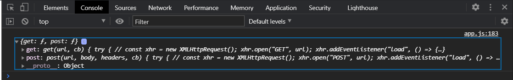
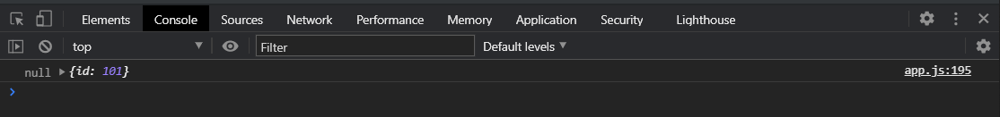
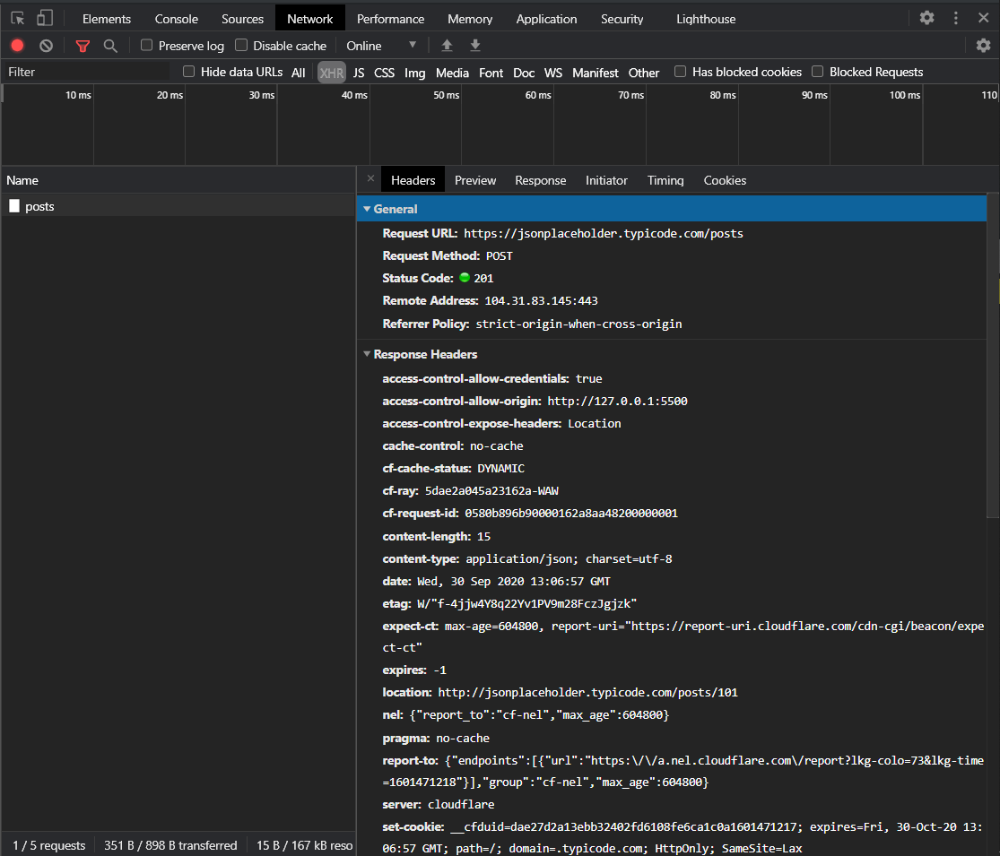
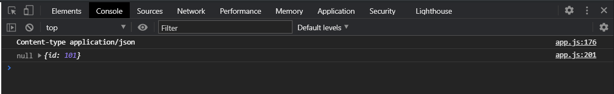
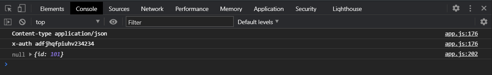
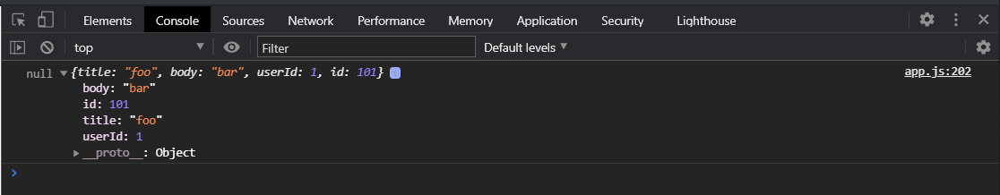

Продолжаем POST запрос.

И здесь у нас становится проблема. Мы могли бы это впринципе это закинуть все сюда, но тогда мы сильно начали бы раздувать эту функцию потому что у **POST** запроса нам нужно во-первых отправлять тело запроса т.е. мы должны принимать какое-то тело. Во-вторых нам нужно устанавливать заголовки если они есть и т.д. Это немного не удобно и хотелось бы сделать что-то универсальное.

Поэтому мы можем создать некий универсальный объект с набором методов для наших будущих запросов. Коментирую функцию **myHttpRequest**.

Создаю функцию и называю ее **http(){}** и эта функция будет возвращать объект в котором будут два метода **get(){}**, и это метод **post(){}**

```js
function http() {
  return {
    get() {},
    post() {},
  };
}
```

Метод **get** будет принимать похожие объекты т.е. он будет принимать **{ method, url } = {}, cb**. Даже на самом деле ему уже не нужно принимать метод потому что он подразумевает что это будет метод **get**, поэтому мы просто будем принимать **url** и будем принимать **cb**.

А метод **post** будет принимать как раз таки **url, body, headers, cb**

```js
function http() {
  return {
    get({ url, cb) {},
    post(url, body, headers, cb) {},
  };
}
```

C **get** запросом проблем особых нет, мы можем скоировать содержимое тела функции **myHttpRequest** Единственное что в **xhr.open** убрать переменную **method** и поставить **GET**.

```js
function http() {
  return {
    get(url, cb) {
      try {
        // const xhr = new XMLHttpRequest();
        xhr.open("GET", url);
        xhr.addEventListener("load", () => {
          if (Math.floor(xhr.status / 100) !== 2) {
            cb(`Error. Status code: ${xhr.status}`, xhr);
            return;
          }
          const response = JSON.parse(xhr.responseText);
          cb(null, response);
        });

        xhr.addEventListener("error", () => {
          cb(`Error. Status code: ${xhr.status}`, xhr);
        });

        xhr.send();
      } catch (error) {
        cb(error);
      }
    },
    post(url, body, headers, cb) {},
  };
}
```

Для метода **POST** нам практически подойдет все тоже самое, но только нам с вами понадобится несколько манипуляций. Во-первых я должен указать метод **xhr.open("POST", url);** Во-вторых мы должны отправлять тело запроса т.е. мы должны делать отправку тела и мы должны его **xhr.send(JSON.stringify(body))**; И мы должны как-то проставлять заголовки. Я предлагаю заголовки передавать в качестве объекта т.е. вызов этого всего может выглядеть следующим образом. Мы создаем переменную **const myHttp = http();** Данная функция нам возвращает объект с методами.

```js
function http() {
  return {
    get(url, cb) {
      try {
        // const xhr = new XMLHttpRequest();
        xhr.open("GET", url);
        xhr.addEventListener("load", () => {
          if (Math.floor(xhr.status / 100) !== 2) {
            cb(`Error. Status code: ${xhr.status}`, xhr);
            return;
          }
          const response = JSON.parse(xhr.responseText);
          cb(null, response);
        });

        xhr.addEventListener("error", () => {
          cb(`Error. Status code: ${xhr.status}`, xhr);
        });

        xhr.send();
      } catch (error) {
        cb(error);
      }
    },
    post(url, body, headers, cb) {
      try {
        // const xhr = new XMLHttpRequest();
        xhr.open("POST", url);
        xhr.addEventListener("load", () => {
          if (Math.floor(xhr.status / 100) !== 2) {
            cb(`Error. Status code: ${xhr.status}`, xhr);
            return;
          }
          const response = JSON.parse(xhr.responseText);
          cb(null, response);
        });

        xhr.addEventListener("error", () => {
          cb(`Error. Status code: ${xhr.status}`, xhr);
        });

        xhr.send(JSON.stringify(body));
      } catch (error) {
        cb(error);
      }
    },
  };
}

const myHttp = http();
console.log(myHttp);
```



Таким образом мы например можем метод post вызвать. т.е. я теперь могу обратится **myHttp.post()** и я должен передать адрес запроса **"https://jsonplaceholder.typicode.com/posts"**. Вторым аргумекнтом я передаю тело. Третьим аргументом предаю заголовки ввиде объекта.

```js
const btn = document.querySelector(".btn-get-post");
const btnAddPost = document.querySelector(".btn-add-post");
const container = document.querySelector(".container");

function getPosts(cb) {
  const xhr = new XMLHttpRequest();
  xhr.open("GET", "https://jsonplaceholder.typicode.com/posts");
  xhr.addEventListener("load", () => {
    const response = JSON.parse(xhr.responseText);
    cb(response);
  });

  xhr.addEventListener("error", () => {
    console.log("error");
  });

  xhr.send();
}

function createPost(body, cb) {
  const xhr = new XMLHttpRequest();
  xhr.open("POST", "https://jsonplaceholder.typicode.com/posts");
  xhr.addEventListener("load", () => {
    const response = JSON.parse(xhr.responseText);
    cb(response);
  });

  xhr.setRequestHeader("Content-type", "application/json; charset=UTF-8");

  xhr.addEventListener("error", () => {
    console.log("error");
  });

  xhr.send(JSON.stringify(body));
}

function cardTemplate(post) {
  const card = document.createElement("div");
  card.classList.add("card");
  const cardBody = document.createElement("div");
  cardBody.classList.add("card-body");
  const title = document.createElement("h5");
  title.classList.add("card-title");
  title.textContent = post.title;
  const article = document.createElement("p");
  article.classList.add("card-text");
  article.textContent = post.body;
  cardBody.appendChild(title);
  cardBody.appendChild(article);
  card.appendChild(cardBody);
  return card;
}

function renderPosts(response) {
  const fragment = document.createDocumentFragment();
  response.forEach((post) => {
    const card = cardTemplate(post);
    fragment.appendChild(card);
  });
  container.appendChild(fragment);
}

btn.addEventListener("click", (e) => {
  getPosts(renderPosts);
});

btnAddPost.addEventListener("click", (e) => {
  const newPost = {
    title: "foo",
    body: "bar",
    userId: 1,
  };
  createPost(newPost, (response) => {
    const card = cardTemplate(response);
    container.insertAdjacentElement("afterbegin", card);
  });
});

// СORS

function getGmail(cb) {
  const xhr = new XMLHttpRequest();
  xhr.open("GET", "https://gmail.com");
  xhr.addEventListener("load", () => {
    console.log(xhr.responseText);
  });

  xhr.addEventListener("error", () => {
    console.log("error");
  });

  xhr.send();
}

function myHttpRequest({ method, url } = {}, cb) {
  try {
    // const xhr = new XMLHttpRequest();
    xhr.open(method, url);
    xhr.addEventListener("load", () => {
      if (Math.floor(xhr.status / 100) !== 2) {
        cb(`Error. Status code: ${xhr.status}`, xhr);
        return;
      }
      const response = JSON.parse(xhr.responseText);
      cb(null, response);
    });

    xhr.addEventListener("error", () => {
      cb(`Error. Status code: ${xhr.status}`, xhr);
    });

    xhr.send();
  } catch (error) {
    cb(error);
  }
}

// myHttpRequest(
//   {
//     method: "GET",
//     url: "https://jsonplaceholder.typicode.com/posts",
//   },

//   (err, res) => {
//     if (err) {
//       console.log(err);
//       return;
//     }
//     console.log(res);
//   }
// );

function http() {
  return {
    get(url, cb) {
      try {
        // const xhr = new XMLHttpRequest();
        xhr.open("GET", url);
        xhr.addEventListener("load", () => {
          if (Math.floor(xhr.status / 100) !== 2) {
            cb(`Error. Status code: ${xhr.status}`, xhr);
            return;
          }
          const response = JSON.parse(xhr.responseText);
          cb(null, response);
        });

        xhr.addEventListener("error", () => {
          cb(`Error. Status code: ${xhr.status}`, xhr);
        });

        xhr.send();
      } catch (error) {
        cb(error);
      }
    },
    post(url, body, headers, cb) {
      try {
        const xhr = new XMLHttpRequest();
        xhr.open("POST", url);
        xhr.addEventListener("load", () => {
          if (Math.floor(xhr.status / 100) !== 2) {
            cb(`Error. Status code: ${xhr.status}`, xhr);
            return;
          }
          const response = JSON.parse(xhr.responseText);
          cb(null, response);
        });

        xhr.addEventListener("error", () => {
          cb(`Error. Status code: ${xhr.status}`, xhr);
        });

        xhr.send(JSON.stringify(body));
      } catch (error) {
        cb(error);
      }
    },
  };
}

const myHttp = http();

myHttp.post(
  "https://jsonplaceholder.typicode.com/posts",
  {
    title: "foo",
    body: "bar",
    userId: 1,
  },
  {
    "Content-type": "application/json",
  },
  (err, res) => {
    console.log(err, res);
  }
);
```

Что-то похожее вы можете увидеть в **Frameworks**. Это такая простенькая обертка. Вот так будет выглядеть наш вызов метода **post**. Однако у меня ругается так как еще должен быть **callback** который должен принимать ошибку **err** и **res** и вывожу в консоль.



Как мы видим **POST** запрос отправляется



Но нам вернулось **101** потому что мы не задали заголовки **Content-type**. При этом мы делаем это универсально для того что бы мы могли задавать не только один заголовок.

И как мы можем теперь это реализовать?

Нам единственно осталось в методе **post** это задать заголовки. Заголовки задаются методом как вы помните **setRequestHeaders** и туда передается одно значение, название заголовка и то что будет содержаться в этом заголовке.

Для того что бы это все руками не прописывать я могу сделать это вот таким вот образом. Пишу условие что если есть у нас заголовки то тогда я у **Object.entries(headers)**. я получаю массив пребираю с помощью **forEach()** мы получаем на каждой итерации ключ и значение **([key, value]) =>{console.log(key,value)}**

```js
function http() {
  return {
    get(url, cb) {
      try {
        // const xhr = new XMLHttpRequest();
        xhr.open("GET", url);
        xhr.addEventListener("load", () => {
          if (Math.floor(xhr.status / 100) !== 2) {
            cb(`Error. Status code: ${xhr.status}`, xhr);
            return;
          }
          const response = JSON.parse(xhr.responseText);
          cb(null, response);
        });

        xhr.addEventListener("error", () => {
          cb(`Error. Status code: ${xhr.status}`, xhr);
        });

        xhr.send();
      } catch (error) {
        cb(error);
      }
    },
    post(url, body, headers, cb) {
      try {
        const xhr = new XMLHttpRequest();
        xhr.open("POST", url);
        xhr.addEventListener("load", () => {
          if (Math.floor(xhr.status / 100) !== 2) {
            cb(`Error. Status code: ${xhr.status}`, xhr);
            return;
          }
          const response = JSON.parse(xhr.responseText);
          cb(null, response);
        });

        xhr.addEventListener("error", () => {
          cb(`Error. Status code: ${xhr.status}`, xhr);
        });

        if (headers) {
          Object.entries(headers).forEach(([key, value]) => {
            console.log(key, value);
          });
        }

        xhr.send(JSON.stringify(body));
      } catch (error) {
        cb(error);
      }
    },
  };
}

const myHttp = http();

myHttp.post(
  "https://jsonplaceholder.typicode.com/posts",
  {
    title: "foo",
    body: "bar",
    userId: 1,
  },
  {
    "Content-type": "application/json",
  },
  (err, res) => {
    console.log(err, res);
  }
);
```

Если сейчас я посмотрю в консоли то нам приходит



И если я например добавлю еще один заголовок. **"x-auth": "adfjhqfpiuhv234234"**, типо токен хочу передать то как видите он так же попадает.



Теперь мне остается в **forEach** выполнить **xhr.setRequestHeader(key,value)**

```js
const btn = document.querySelector(".btn-get-post");
const btnAddPost = document.querySelector(".btn-add-post");
const container = document.querySelector(".container");

function getPosts(cb) {
  const xhr = new XMLHttpRequest();
  xhr.open("GET", "https://jsonplaceholder.typicode.com/posts");
  xhr.addEventListener("load", () => {
    const response = JSON.parse(xhr.responseText);
    cb(response);
  });

  xhr.addEventListener("error", () => {
    console.log("error");
  });

  xhr.send();
}

function createPost(body, cb) {
  const xhr = new XMLHttpRequest();
  xhr.open("POST", "https://jsonplaceholder.typicode.com/posts");
  xhr.addEventListener("load", () => {
    const response = JSON.parse(xhr.responseText);
    cb(response);
  });

  xhr.setRequestHeader("Content-type", "application/json; charset=UTF-8");

  xhr.addEventListener("error", () => {
    console.log("error");
  });

  xhr.send(JSON.stringify(body));
}

function cardTemplate(post) {
  const card = document.createElement("div");
  card.classList.add("card");
  const cardBody = document.createElement("div");
  cardBody.classList.add("card-body");
  const title = document.createElement("h5");
  title.classList.add("card-title");
  title.textContent = post.title;
  const article = document.createElement("p");
  article.classList.add("card-text");
  article.textContent = post.body;
  cardBody.appendChild(title);
  cardBody.appendChild(article);
  card.appendChild(cardBody);
  return card;
}

function renderPosts(response) {
  const fragment = document.createDocumentFragment();
  response.forEach((post) => {
    const card = cardTemplate(post);
    fragment.appendChild(card);
  });
  container.appendChild(fragment);
}

btn.addEventListener("click", (e) => {
  getPosts(renderPosts);
});

btnAddPost.addEventListener("click", (e) => {
  const newPost = {
    title: "foo",
    body: "bar",
    userId: 1,
  };
  createPost(newPost, (response) => {
    const card = cardTemplate(response);
    container.insertAdjacentElement("afterbegin", card);
  });
});

// СORS

function getGmail(cb) {
  const xhr = new XMLHttpRequest();
  xhr.open("GET", "https://gmail.com");
  xhr.addEventListener("load", () => {
    console.log(xhr.responseText);
  });

  xhr.addEventListener("error", () => {
    console.log("error");
  });

  xhr.send();
}

function myHttpRequest({ method, url } = {}, cb) {
  try {
    // const xhr = new XMLHttpRequest();
    xhr.open(method, url);
    xhr.addEventListener("load", () => {
      if (Math.floor(xhr.status / 100) !== 2) {
        cb(`Error. Status code: ${xhr.status}`, xhr);
        return;
      }
      const response = JSON.parse(xhr.responseText);
      cb(null, response);
    });

    xhr.addEventListener("error", () => {
      cb(`Error. Status code: ${xhr.status}`, xhr);
    });

    xhr.send();
  } catch (error) {
    cb(error);
  }
}

// myHttpRequest(
//   {
//     method: "GET",
//     url: "https://jsonplaceholder.typicode.com/posts",
//   },

//   (err, res) => {
//     if (err) {
//       console.log(err);
//       return;
//     }
//     console.log(res);
//   }
// );

function http() {
  return {
    get(url, cb) {
      try {
        // const xhr = new XMLHttpRequest();
        xhr.open("GET", url);
        xhr.addEventListener("load", () => {
          if (Math.floor(xhr.status / 100) !== 2) {
            cb(`Error. Status code: ${xhr.status}`, xhr);
            return;
          }
          const response = JSON.parse(xhr.responseText);
          cb(null, response);
        });

        xhr.addEventListener("error", () => {
          cb(`Error. Status code: ${xhr.status}`, xhr);
        });

        xhr.send();
      } catch (error) {
        cb(error);
      }
    },
    post(url, body, headers, cb) {
      try {
        const xhr = new XMLHttpRequest();
        xhr.open("POST", url);
        xhr.addEventListener("load", () => {
          if (Math.floor(xhr.status / 100) !== 2) {
            cb(`Error. Status code: ${xhr.status}`, xhr);
            return;
          }
          const response = JSON.parse(xhr.responseText);
          cb(null, response);
        });

        xhr.addEventListener("error", () => {
          cb(`Error. Status code: ${xhr.status}`, xhr);
        });

        if (headers) {
          Object.entries(headers).forEach(([key, value]) => {
            xhr.setRequestHeader(key, value);
          });
        }

        xhr.send(JSON.stringify(body));
      } catch (error) {
        cb(error);
      }
    },
  };
}

const myHttp = http();

myHttp.post(
  "https://jsonplaceholder.typicode.com/posts",
  {
    title: "foo",
    body: "bar",
    userId: 1,
  },
  {
    "Content-type": "application/json",
    "x-auth": "adfjhqfpiuhv234234",
  },
  (err, res) => {
    console.log(err, res);
  }
);
```
Таким образом я задаю заголовки при запросе. И теперь сервер отвечает более развернуто.



