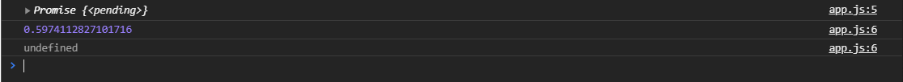

# Введение в Promises

<br>

[https://docs.google.com/presentation/d/1gNQuKKYSp3Yx7fpFI1jkXwNatv733oMNMAOik3E7sNo/edit?usp=sharing](https://docs.google.com/presentation/d/1gNQuKKYSp3Yx7fpFI1jkXwNatv733oMNMAOik3E7sNo/edit?usp=sharing)

<br>

Перед тем как начать знакомится с **promise** давайте вспомним **callback** и представим себе следующую ситуацию. Предположим у нас есть задача получить пост новости, онфирмацию о новости, получить к не комментарий отдельным запросом и получить информацию об авторе этого поста тоже отдельным запросом.

Какая на ждет проблема в случае с **callback**.


Предположим у нас есть функция **F1** которая выполняет запрос на сервер для получения поста новости, после этого когда она выполнила нужные действияона вызывает функцию **F2** для получения комментариев которая в свою очередь. Потом получив их что-то еще сделав вызывает функцию **F3** и такая вот получается цепочка.

Какая проблема у нас в таком коде?

Во-первых мы получаем вложенные функции и получаем так называемый **callback hell**, когда у нас один **callback** вложен в другой **callback** и так по цепочке. И в каждом из этих **callback** нам нужно проверять не произошла ли ошибка на предыдущем запросе. Т.е. если у нас функция **F1** например выполнила запрос и произошла ошибка эта функция не может прекратить исполнение и выйти с ошибкой исполнения, а она должна передать ошибку в следующую функцию **F2**. **F2** делает проверку если в ней есть ошибка, то она выходит и уведомляет пользователя о том что произошла какая-то ошибка. Если же нет ошибок она делает запрос и если в данной функции **F2** выявляется ошибка, то она передает дальше по цепочке эту ошибку следующей функции и так по цепочке дальше и дальше. Здесь у нас проблема в том что нам приходиться прокидывать эту ошибку от **callback** к **collback**-у для того что бы убедиться на каждом **callback** что нет ни какой ошибки. При этом у нас нет никаких гарантий что функция **F1** или **F2** не вызовет переданный ей **callback** повторно. Мало ли что может произойти. Поэтому у нас возникают сложности с обработкой ошибок. Трудности в работе стаким кодом и т.д.

Было бы лучше если бы мы получили вот такую вот ситуацию.


Когда у нас есть все три наши функции и если в какой-то из этих функций произойдет ошибка, то мы выпадем в ошибку и эта ошибка будет сработана для всех последующих функций т.е. каждая из следующих функций не будет выполнена.

В случае если функция **F1** выполняется успешно, то выполняется следующая функция, если она выполнилась переходим к выполнению третьей функции. Но если в функции **F2** происходит ошибка мы выпадаем и функция **F3** не выполняется. При этом у нас есть единый обработчик ошибки в случае если у нас где-то в этой цепочке произойдет какой-то сбой. Потому что с точки зрения бизнес логики это у нас одна сплошная задача которая должна получать пост, информацию о нем, о пользователе и т.д.

В нашем же случае это цепочка действий. И нам не хочется на каждой из этих функций обрабатывать ошибку. Мы хотели бы словить ошибку и выйти с этой ошибкой в одном обработчике. Либо же если у нас везде произошли положительные результаты то в итоге мы выйдем с положительным результатом одним и выполним то что нам нужно например отрендерим нашу страницу с новостью.

Поэтому в какой-то момент был предуман приметив **promise**(обещать). Это такой объект обещания помогает нам работать с асинхронным кодом и условно говоря сделать его немного синхронным плюс сделать его более структурированным без вложенных **callback** и без сложной вложенности. И котрый имеет одну точку выхода в ошибку, и мы можем вызвать сразу несколько асинхронных действий по цепочке выполняя их друг за другом.

Как он выглядит?

Для того что бы создать **promise** мы должны с вами объявить какую-нибудь переменную. Создать мы моэем его двумя способами.

Первый вариант мы можем записать его в переменную например **const promise =** вызывается он с помощью функции конструктора **new Promise()**. Принимает он в качестве аргумента **callback**. Этот **callback** в свою очередь примет две функции это **resolve** и функцию **reject**.

```js
const promise = new Promise((resolve, reject) => {});
```

Функция **resolve** скажет о том что этот **promise** выполнился успешно. Вызвав функцию **reject** мы скажем что этот **promise** выполнился не успешно.

Мы можем представлять себе **promise** как нейкий черный ящик в котором выполняется какая-то асинхронная операция. И по результатам ее выполнения вызовем либо **resolve** в случае успешного выполения этой асинхронной операции, либо **reject** в случае не успешного выполнения операции.

Для примера выполню **setTimeout()** который вызовет функцию **() => resolve()** в которую я передам **Math.random()** и выполню его через 10 сек.

```js
const promise = new Promise((resolve, reject) => {
  setTimeout(() => resolve(Math.random()), 10000);
});
```

Что в этот момент произойдет? Для того что бы теперь нам получить результат выполнения promise мы должны вызвать у него метод **then**. Сначало законсолю что у нас находится в переменной **promise**.

```js
const promise = new Promise((resolve, reject) => {
  setTimeout(() => resolve(Math.random()), 10000);
});

console.log(promise);
```

Там находиться объект и он имеет статус **pending**(рассматриваемый) это статус что promise был объявлен, но он еще не выполнился и он остается в состоянии **pending**. Для того что бы нам его выполнить мы дожны вызвать метод **then()** это один изметодов которые есть у **promise**.


Я его могу вызвать следующим способом я обращаюсь к **promise.then()** и метод **then** принимает вообще два аргумента. Первый аргумент в случае если **promise** разрешится успешно, то **callback** выпонится. И второй аргумент это **callback** который выполниться в случае если **promise** будет исполнен со статусом **reject**.

Мы будем использовать только первый аргумент потому что для обработки ошибок у нас есть отдельный метод **catch** с которым мы познакомимся чуть позже.

Соответственно метод **then** принимает **callback** в который будет переданы те данные которые были отправлены из промиса в функцию **resolve**.

```js
const promise = new Promise((resolve, reject) => {
  setTimeout(() => resolve(Math.random()), 10000);
});

// console.log(promise);
promise.then((x) => console.log(x));
```


И как вы видите по прошествии 10 сек выводится рандомное число. И если я расскрою **promise** в нем будет статус **resolved**. Ну или как у меня **fulfilled**.


Таким образом мы получили результат нашего действия. При этом, что очень важно, **then** позволяет строить цепочки т.е. каждый **then** это так же **promise** который выполнится и мы можем выстраивать дальнейшие цепочки через **then** выполняя следующие и следующие действия. При жтом на каждой цепочке then мы можем получать результат предыдущего **then**.

```js
const promise = new Promise((resolve, reject) => {
  setTimeout(() => resolve(Math.random()), 10000);
});

console.log(promise);
promise.then((x) => console.log(x)).then((y) => console.log(y));
```



мы получаем на первом **console.log x** а на втором **console.log** получаем **indefined**. Потому что наш первый **then** т.е. вот эта часть **.then((x) => console.log(x))** ничего не вернула. Если я вывод в консоль первого **then** заверну в фигурные скобки и верну **x**

```js
const promise = new Promise((resolve, reject) => {
  setTimeout(() => resolve(Math.random()), 1000);
});

console.log(promise);
promise
  .then((x) => {
    console.log(x);
    return x;
  })
  .then((y) => console.log(y));
```


У нас выполнился первый **then** он вернул какие-то данные. Все эти данные попали на следующий **then** и мы их увидели в следующем **then**. И такую цепочку можно выстраивать друг за другом. При этом пока не выполнится первая цепочка, вторая цепочка соответственно не запуститься т.е. они будут выполняться друг за другом.

Еще один не маловажный нюанс в том что если я вызову **promise.then()** еще раз

```js
const promise = new Promise((resolve, reject) => {
  setTimeout(() => resolve(Math.random()), 1000);
});

console.log(promise);
promise
  .then((x) => {
    console.log(x);
    return x;
  })
  .then((y) => console.log(y));

promise.then((z) => console.log(z));
```


Т.е. promise выполнился, он получил значение. Даже при повторном его вызове. Он уже знает что он уже **resolved** т.е. он уже выполнет и имеет определенное значение и возвращает уже это значение обратно.

Так же не маловажным нюансом является то что **promise** нам горантированно вызовет функцию **resolve** или **reject** только один раз при этом если вызовется функция **resolve**, то **reject** не может быть вызван и наоборот.

У нас не может быть такой ситуации как в случае с **callback** что наш **callback** внутри функции может вызваться несколько раз. Если вызван либо **resilve** либо **reject** то от гарантированно вызовется один раз.

Так же один не маловажный нюанс то что в **resolve** и **reject** мы можем передать толко один аргумент. Поэтому если нам нужно передавать какие-то сложные данные мы должны формировать и передавать объекты в наши **promice**.

Что же касается ошибок. Ошибки мы можем отлавливать в методе **catch**. при этом этот метод становится самым последним т.е. мы подписываемся на ошибку у последнего **then** и при этом если любой из **then** выпадет в ошибку мы попадем в обработчик **catch** т.е. не важно в каком **then** или в самом **promice** произойдет ошибка. Мы попадем в единый обработчик. Опять же тоже самое что у нас было с **callback** где в случае если у нас какая-то происходила ошибка внутри асинхронной функции мы должны были информацию об это ошибке передавать следующей функции для того что бы она проверила что если и была ошибка, то вывести что-то пользователю.

```js
const promise = new Promise((resolve, reject) => {
  setTimeout(() => resolve(Math.random()), 1000);
});

console.log(promise);
promise
  .then((x) => {
    console.log(x);
    return x;
  })
  .then((y) => console.log(y))
  .catch((err) => console.log(err));
```

Получу ошибку

```js
const promise = new Promise((resolve, reject) => {
  setTimeout(() => reject("error"), 1000);
});

console.log(promise);
promise
  .then((x) => {
    console.log(x);
    return x;
  })
  .then((y) => console.log(y))
  .catch((err) => console.log(err));
```


т.е. в нашеп **promise** произошла ошибка какая-то. Например сервер ответил статусом каким-то не тем, или произошла какая-то ошибка в том числе по синтаксису может быть. Мы выпадаем в **reject** и этот **reject** сразу попадает в **catch** и мы в немм ее уже обрабатываем. 