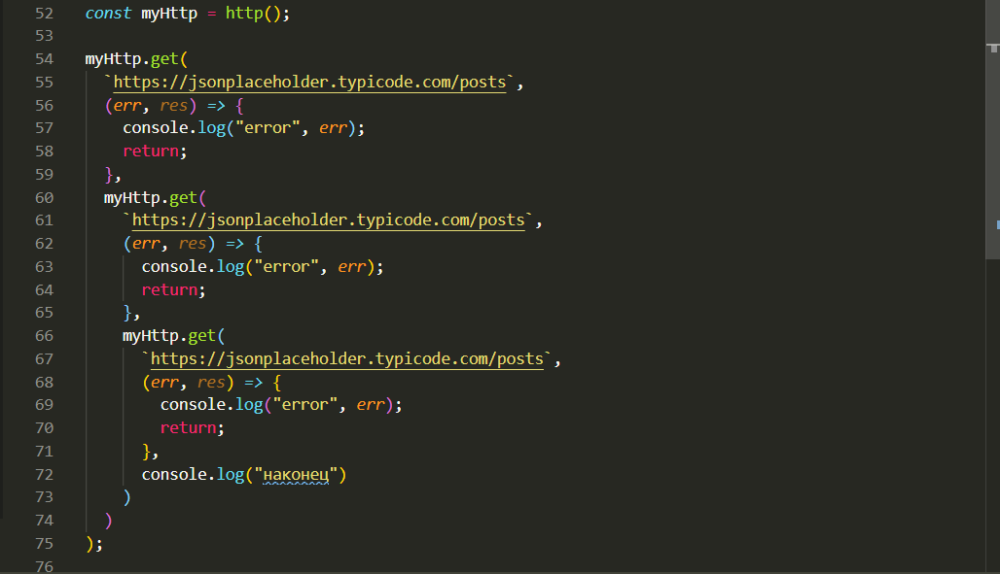
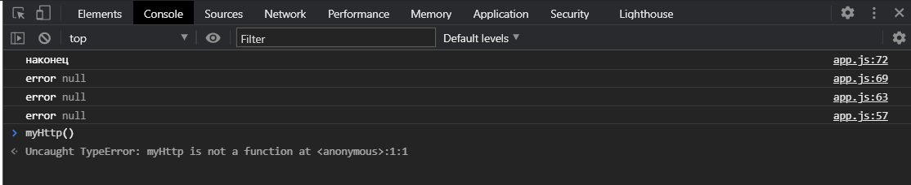
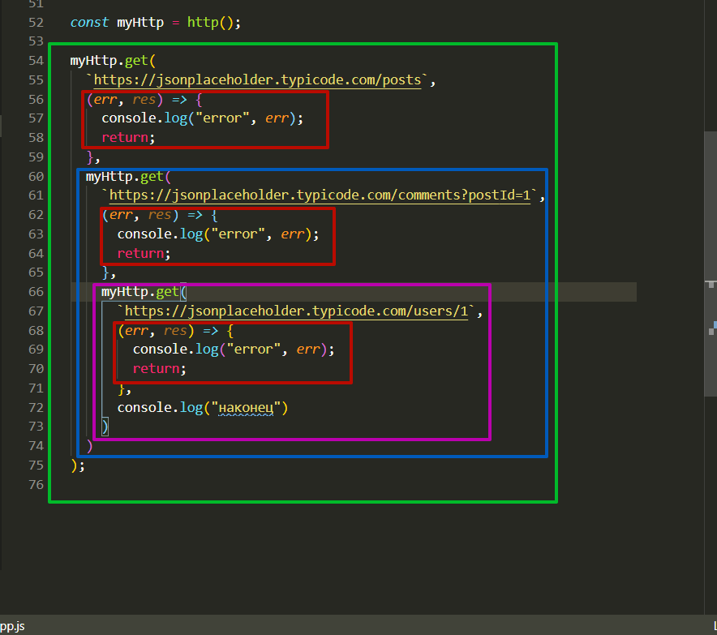
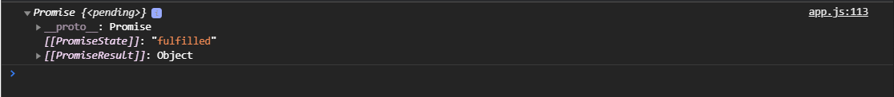
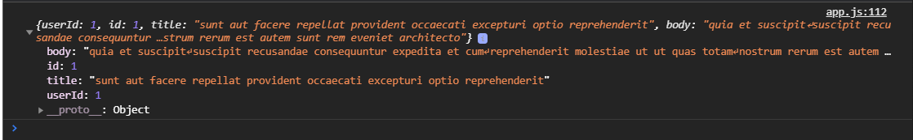
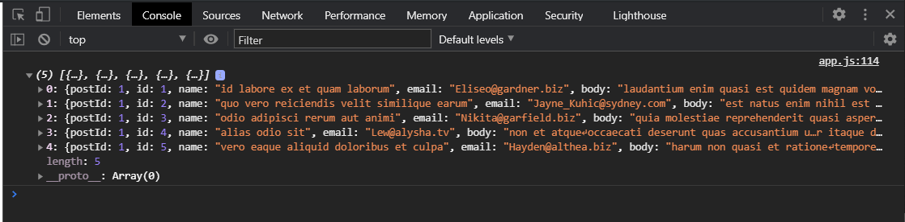
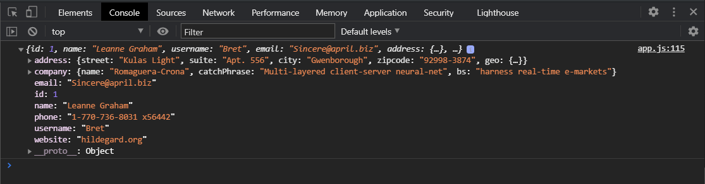

# Введение в promise.

Рассмотрим **promise** на примере **AJAX** запросов. Но сначало посмотрим на то что называется **callback hell**. Я использую всю ту же нашу функцию **http** которую мы писали с двумя методами **get** и **post**.

```js
function http() {
  return {
    get(url, cb) {
      try {
        const xhr = new XMLHttpRequest();
        xhr.open("GET", url);
        xhr.addEventListener("load", () => {
          if (Math.floor(xhr.status / 100) !== 2) {
            cb(`Error. Status code: ${xhr.status}`, xhr);
            return;
          }
          const response = JSON.parse(xhr.responseText);
          cb(null, response);
        });
        xhr.addEventListener("error", () => {
          cb(`Error. Status code: ${xhr.status}`, xhr);
        });
        xhr.send();
      } catch (error) {
        cb(error);
      }
    },
    post(url, body, headers, cb) {
      try {
        const xhr = new XMLHttpRequest();
        xhr.open("POST", url);
        xhr.addEventListener("load", () => {
          if (Math.floor(xhr.status / 100) !== 2) {
            cb(`Error. Status code: ${xhr.status}`, xhr);
            return;
          }
          const response = JSON.parse(xhr.responseText);
          cb(null, response);
        });
        xhr.addEventListener("error", () => {
          cb(`Error. Status code: ${xhr.status}`, xhr);
        });

        if (headers) {
          Object.entries(headers).forEach(([key, value]) => {
            xhr.setRequestHeader(key, value);
          });
        }
        xhr.send(JSON.stringify(body));
      } catch (error) {
        console.log(error);
      }
    },
  };
}

const myHttp = http();

myHttp.get(
  `https://jsonplaceholder.typicode.com/posts`,
  (err, res) => {
    console.log("error", err);
    return;
  },
  myHttp.get(
    `https://jsonplaceholder.typicode.com/posts`,
    (err, res) => {
      console.log("error", err);
      return;
    },
    myHttp.get(
      `https://jsonplaceholder.typicode.com/posts`,
      (err, res) => {
        console.log("error", err);
        return;
      },
      console.log("наконец")
    )
  )
);
```

Смотри вот эту часть кода





В myHttp первый запрос мы выполняем на получение постов **`https://jsonplaceholder.typicode.com/posts`**. Потом мы выполняем запрос на получения комментариев к этому посту **`https://jsonplaceholder.typicode.com/comments?postId=1`** и затем выполняю запрос на получение информации о пользователе который сделал этот post **`https://jsonplaceholder.typicode.com/users/1`**.

Как мы видим это типичная проблема под названием **callback hell** когда у нас в одном **callback** вкладывается, вызывается второй запрос вкладывается второй **callback** и т.д.



Разным цветом показаны 3-ри **callback**. Красным цветом показан блок обработки ошибок. Это сложно поддерживать потому что здесь нет никакой логики т.е. мы не выполняем никаких манипуляций с данными и т.д. Мы несколько раз получили вложенную функции и вывели в консоль. Если логика будет усложняться то это будет крайне сложно потдерживать.

Посмотрим на то как мы это же сможем реализовать с помощью промисов. Мы можем разбить наши функции. У нас есть фактически три вопроса которые мы делаем. И мы можем разбить их на три отдельные функции. Пока что мы не знакомы с **fetch**. Когда мы с ним познакомимся это немного поменяется структура. Но тем не менее уже на данном этапе мы можем это реализовать.

Мы создадим первую функцию **getPost** т.е. у нас будет три функции. Данная функция будет принимать **id**.

После у нас будет еще одна функция **getPostComments**. И третья функция **getUserCreatedPost**

```js
function getPost(id) {}

function getPostCommemts() {}
function getUserCreatedPost() {}
```

Внутри в каждой из этих функций мы будем возвращать **promise**. И я показывал в прошлом что мы можем записать **promise** в переменную, а потом его использовать. Но так же мы можем внутри функции сделать **return promise** и помом использовать его вызвать функцию например передав ей какие-то параметры на вход, в зависимости от вызова потому что мы можем в параметры функции передать что-то и потом использовать это внутри **promise** и непосредственно двигаться дальше.

В теле функции **getPost** пишу **return new Promise()**. Как вы помните **Promise** принимает функцию **() =>{}** которая в свою очередь принимает два аргумента, обычно им дают название **resolve** и **reject**, можно давать и другие названия. В нутри данной функции делаю вызов на адрес **myHttp.get(`https://jsonplaceholder.typicode.com/posts/1`)** добавляю **/1** что бы получить информацию о посте. Т.к. у нас **myHttp** работает при помощи **callback**, а не при помощи **promise**, хотя мы тоже это перепишем на **promise**, то мы должны передать **callback** в который попадет **(res) =>{}** хотя первым параметром указываем ошибку **err** не забываем **(err, res) =>{}**. В данной функции мы сделаем проверку если есть **err** то мы вызовем функцию **reject** и в нее передадим ошибку **(err)**. Т.е. если у нас от сервера придет err то мы сделаем **reject** т.е. отменим **promise** и скажем что что то пошло не так. Иначе если все хорошо то мы выполнем **resolve** и передадим в нее наш **res**

```js
function getPost(id) {
  return new Promise((resolve, reject) => {
    myHttp.get(`https://jsonplaceholder.typicode.com/posts/1`, (err, res) => {
      if (err) {
        reject(err);
      }
      resolve(res);
    });
  });
}

function getPostCommemts() {}
function getUserCreatedPost() {}
```

И тоже самое мы сделаем в остальных наших функциях на другие адреса.

```js
function getPost(id) {
  return new Promise((resolve, reject) => {
    myHttp.get(`https://jsonplaceholder.typicode.com/posts/1`, (err, res) => {
      if (err) {
        reject(err);
      }
      resolve(res);
    });
  });
}

function getPostCommemts() {
  return new Promise((resolve, reject) => {
    myHttp.get(
      `https://jsonplaceholder.typicode.com/comments?postId=1`,
      (err, res) => {
        if (err) {
          reject(err);
        }
        resolve(res);
      }
    );
  });
}
function getUserCreatedPost() {
  return new Promise((resolve, reject) => {
    myHttp.get(`https://jsonplaceholder.typicode.com/users/1`, (err, res) => {
      if (err) {
        reject(err);
      }
      resolve(res);
    });
  });
}
```

Мы с вами создали три функции которые выполняют запрос на соответствующий адрес и если в каждом из них произойдет ошибка мы вызываем **reject**, а если все хорошо мы вызываем **resolve** и передаем **response**.

Давайте посмотрим теперь как это может быть вызвано. Мы можем вызвать **getPost()** передать, **id** мы пока не используем. Вызываем **getPost()** он нам возвращает **promise**. Мы можем это законсолить.

```js
function http() {
  return {
    get(url, cb) {
      try {
        const xhr = new XMLHttpRequest();
        xhr.open("GET", url);
        xhr.addEventListener("load", () => {
          if (Math.floor(xhr.status / 100) !== 2) {
            cb(`Error. Status code: ${xhr.status}`, xhr);
            return;
          }
          const response = JSON.parse(xhr.responseText);
          cb(null, response);
        });
        xhr.addEventListener("error", () => {
          cb(`Error. Status code: ${xhr.status}`, xhr);
        });
        xhr.send();
      } catch (error) {
        cb(error);
      }
    },
    post(url, body, headers, cb) {
      try {
        const xhr = new XMLHttpRequest();
        xhr.open("POST", url);
        xhr.addEventListener("load", () => {
          if (Math.floor(xhr.status / 100) !== 2) {
            cb(`Error. Status code: ${xhr.status}`, xhr);
            return;
          }
          const response = JSON.parse(xhr.responseText);
          cb(null, response);
        });
        xhr.addEventListener("error", () => {
          cb(`Error. Status code: ${xhr.status}`, xhr);
        });

        if (headers) {
          Object.entries(headers).forEach(([key, value]) => {
            xhr.setRequestHeader(key, value);
          });
        }
        xhr.send(JSON.stringify(body));
      } catch (error) {
        console.log(error);
      }
    },
  };
}

const myHttp = http();

function getPost(id) {
  return new Promise((resolve, reject) => {
    myHttp.get(`https://jsonplaceholder.typicode.com/posts/1`, (err, res) => {
      if (err) {
        reject(err);
      }
      resolve(res);
    });
  });
}

function getPostCommemts() {
  return new Promise((resolve, reject) => {
    myHttp.get(
      `https://jsonplaceholder.typicode.com/comments?postId=1`,
      (err, res) => {
        if (err) {
          reject(err);
        }
        resolve(res);
      }
    );
  });
}
function getUserCreatedPost() {
  return new Promise((resolve, reject) => {
    myHttp.get(`https://jsonplaceholder.typicode.com/users/1`, (err, res) => {
      if (err) {
        reject(err);
      }
      resolve(res);
    });
  });
}

console.log(getPost());
```



Теперь я выполняю **getPost()** и в цепочке **then()** я получу результат того что вернет нам **getPost** т.е. результат нашего запроса **getPost().then((post) => console.log(post));**
```js
function http() {
  return {
    get(url, cb) {
      try {
        const xhr = new XMLHttpRequest();
        xhr.open("GET", url);
        xhr.addEventListener("load", () => {
          if (Math.floor(xhr.status / 100) !== 2) {
            cb(`Error. Status code: ${xhr.status}`, xhr);
            return;
          }
          const response = JSON.parse(xhr.responseText);
          cb(null, response);
        });
        xhr.addEventListener("error", () => {
          cb(`Error. Status code: ${xhr.status}`, xhr);
        });
        xhr.send();
      } catch (error) {
        cb(error);
      }
    },
    post(url, body, headers, cb) {
      try {
        const xhr = new XMLHttpRequest();
        xhr.open("POST", url);
        xhr.addEventListener("load", () => {
          if (Math.floor(xhr.status / 100) !== 2) {
            cb(`Error. Status code: ${xhr.status}`, xhr);
            return;
          }
          const response = JSON.parse(xhr.responseText);
          cb(null, response);
        });
        xhr.addEventListener("error", () => {
          cb(`Error. Status code: ${xhr.status}`, xhr);
        });

        if (headers) {
          Object.entries(headers).forEach(([key, value]) => {
            xhr.setRequestHeader(key, value);
          });
        }
        xhr.send(JSON.stringify(body));
      } catch (error) {
        console.log(error);
      }
    },
  };
}

const myHttp = http();

function getPost(id) {
  return new Promise((resolve, reject) => {
    myHttp.get(`https://jsonplaceholder.typicode.com/posts/1`, (err, res) => {
      if (err) {
        reject(err);
      }
      resolve(res);
    });
  });
}

function getPostCommemts() {
  return new Promise((resolve, reject) => {
    myHttp.get(
      `https://jsonplaceholder.typicode.com/comments?postId=1`,
      (err, res) => {
        if (err) {
          reject(err);
        }
        resolve(res);
      }
    );
  });
}
function getUserCreatedPost() {
  return new Promise((resolve, reject) => {
    myHttp.get(`https://jsonplaceholder.typicode.com/users/1`, (err, res) => {
      if (err) {
        reject(err);
      }
      resolve(res);
    });
  });
}

getPost().then((post) => console.log(post));
```



Теперь нам нужно сделать следующий запрос **getPostCommemts**. В **then** в **callback** вызываю **getPost().then((post) => getPostCommemts());** Его можно былобы передать как имя **callback** вот в таком формате **getPost()****.then****(getPostCommemts);** Но в таком формате не очень читабкельно и возможно придется делать какие-то предварительные действия. По этому лучше реализовывать вот так **getPost().then((post) => getPostCommemts());** Т.е. мы здесь получили **post**, они нам потом пригодяться, и мы вызываем функцию **getPostCommemts()**. Так как внутри ее **promise** т.е. мы возвращаем результатом выполнения этой функции будет **promise**, то мы продолжаем дальше в цепочке использовать **then(comments)** на следующей итерации мы получим **comments**. Так же вывожу их в консоль.

```js
function http() {
  return {
    get(url, cb) {
      try {
        const xhr = new XMLHttpRequest();
        xhr.open("GET", url);
        xhr.addEventListener("load", () => {
          if (Math.floor(xhr.status / 100) !== 2) {
            cb(`Error. Status code: ${xhr.status}`, xhr);
            return;
          }
          const response = JSON.parse(xhr.responseText);
          cb(null, response);
        });
        xhr.addEventListener("error", () => {
          cb(`Error. Status code: ${xhr.status}`, xhr);
        });
        xhr.send();
      } catch (error) {
        cb(error);
      }
    },
    post(url, body, headers, cb) {
      try {
        const xhr = new XMLHttpRequest();
        xhr.open("POST", url);
        xhr.addEventListener("load", () => {
          if (Math.floor(xhr.status / 100) !== 2) {
            cb(`Error. Status code: ${xhr.status}`, xhr);
            return;
          }
          const response = JSON.parse(xhr.responseText);
          cb(null, response);
        });
        xhr.addEventListener("error", () => {
          cb(`Error. Status code: ${xhr.status}`, xhr);
        });

        if (headers) {
          Object.entries(headers).forEach(([key, value]) => {
            xhr.setRequestHeader(key, value);
          });
        }
        xhr.send(JSON.stringify(body));
      } catch (error) {
        console.log(error);
      }
    },
  };
}

const myHttp = http();

function getPost(id) {
  return new Promise((resolve, reject) => {
    myHttp.get(`https://jsonplaceholder.typicode.com/posts/1`, (err, res) => {
      if (err) {
        reject(err);
      }
      resolve(res);
    });
  });
}

function getPostCommemts() {
  return new Promise((resolve, reject) => {
    myHttp.get(
      `https://jsonplaceholder.typicode.com/comments?postId=1`,
      (err, res) => {
        if (err) {
          reject(err);
        }
        resolve(res);
      }
    );
  });
}
function getUserCreatedPost() {
  return new Promise((resolve, reject) => {
    myHttp.get(`https://jsonplaceholder.typicode.com/users/1`, (err, res) => {
      if (err) {
        reject(err);
      }
      resolve(res);
    });
  });
}

getPost()
  .then((post) => getPostCommemts())
  .then((comments) => console.log(comments));
```



И последний **then** мы вызываем **.then((comments) => getUserCreatedPost);** Далее делаю следующую цепочку **.then(user => console.log(user));**

```js
function http() {
  return {
    get(url, cb) {
      try {
        const xhr = new XMLHttpRequest();
        xhr.open("GET", url);
        xhr.addEventListener("load", () => {
          if (Math.floor(xhr.status / 100) !== 2) {
            cb(`Error. Status code: ${xhr.status}`, xhr);
            return;
          }
          const response = JSON.parse(xhr.responseText);
          cb(null, response);
        });
        xhr.addEventListener("error", () => {
          cb(`Error. Status code: ${xhr.status}`, xhr);
        });
        xhr.send();
      } catch (error) {
        cb(error);
      }
    },
    post(url, body, headers, cb) {
      try {
        const xhr = new XMLHttpRequest();
        xhr.open("POST", url);
        xhr.addEventListener("load", () => {
          if (Math.floor(xhr.status / 100) !== 2) {
            cb(`Error. Status code: ${xhr.status}`, xhr);
            return;
          }
          const response = JSON.parse(xhr.responseText);
          cb(null, response);
        });
        xhr.addEventListener("error", () => {
          cb(`Error. Status code: ${xhr.status}`, xhr);
        });

        if (headers) {
          Object.entries(headers).forEach(([key, value]) => {
            xhr.setRequestHeader(key, value);
          });
        }
        xhr.send(JSON.stringify(body));
      } catch (error) {
        console.log(error);
      }
    },
  };
}

const myHttp = http();

function getPost(id) {
  return new Promise((resolve, reject) => {
    myHttp.get(`https://jsonplaceholder.typicode.com/posts/1`, (err, res) => {
      if (err) {
        reject(err);
      }
      resolve(res);
    });
  });
}

function getPostCommemts() {
  return new Promise((resolve, reject) => {
    myHttp.get(
      `https://jsonplaceholder.typicode.com/comments?postId=1`,
      (err, res) => {
        if (err) {
          reject(err);
        }
        resolve(res);
      }
    );
  });
}
function getUserCreatedPost() {
  return new Promise((resolve, reject) => {
    myHttp.get(`https://jsonplaceholder.typicode.com/users/1`, (err, res) => {
      if (err) {
        reject(err);
      }
      resolve(res);
    });
  });
}

getPost()
  .then((post) => getPostCommemts())
  .then((comments) => getUserCreatedPost())
  .then((user) => console.log(user));
```



Т.е. мы с вами в удобной форме в цепочке then вызываем нужные нам асинхронные функции. Они выполняются по очереди. На каждом **then** мы имеем результат предыдущего асинхронного действия. Соответственно это выглядет довольно читабельно. Чем вложенная форма вызовов **callback**.

В самом конце мы обязаны подписаться на **.catch(err => console.log(err))**

```js
function http() {
  return {
    get(url, cb) {
      try {
        const xhr = new XMLHttpRequest();
        xhr.open("GET", url);
        xhr.addEventListener("load", () => {
          if (Math.floor(xhr.status / 100) !== 2) {
            cb(`Error. Status code: ${xhr.status}`, xhr);
            return;
          }
          const response = JSON.parse(xhr.responseText);
          cb(null, response);
        });
        xhr.addEventListener("error", () => {
          cb(`Error. Status code: ${xhr.status}`, xhr);
        });
        xhr.send();
      } catch (error) {
        cb(error);
      }
    },
    post(url, body, headers, cb) {
      try {
        const xhr = new XMLHttpRequest();
        xhr.open("POST", url);
        xhr.addEventListener("load", () => {
          if (Math.floor(xhr.status / 100) !== 2) {
            cb(`Error. Status code: ${xhr.status}`, xhr);
            return;
          }
          const response = JSON.parse(xhr.responseText);
          cb(null, response);
        });
        xhr.addEventListener("error", () => {
          cb(`Error. Status code: ${xhr.status}`, xhr);
        });

        if (headers) {
          Object.entries(headers).forEach(([key, value]) => {
            xhr.setRequestHeader(key, value);
          });
        }
        xhr.send(JSON.stringify(body));
      } catch (error) {
        console.log(error);
      }
    },
  };
}

const myHttp = http();

function getPost(id) {
  return new Promise((resolve, reject) => {
    myHttp.get(`https://jsonplaceholder.typicode.com/posts/1`, (err, res) => {
      if (err) {
        reject(err);
      }
      resolve(res);
    });
  });
}

function getPostCommemts() {
  return new Promise((resolve, reject) => {
    myHttp.get(
      `https://jsonplaceholder.typicode.com/comments?postId=1`,
      (err, res) => {
        if (err) {
          reject(err);
        }
        resolve(res);
      }
    );
  });
}
function getUserCreatedPost() {
  return new Promise((resolve, reject) => {
    myHttp.get(`https://jsonplaceholder.typicode.com/users/1`, (err, res) => {
      if (err) {
        reject(err);
      }
      resolve(res);
    });
  });
}

getPost()
  .then((post) => getPostCommemts())
  .then((comments) => getUserCreatedPost())
  .then((user) => console.log(user))
  .catch((err) => console.log(err));
```
Если у нас будет ошибка в одном из этих then, то мы выпадем в cath и получим единственный обработчик наших ошибок. 

<br>

**[Перейди по ссылке дальше](introduction%20to%20promises002.md)**