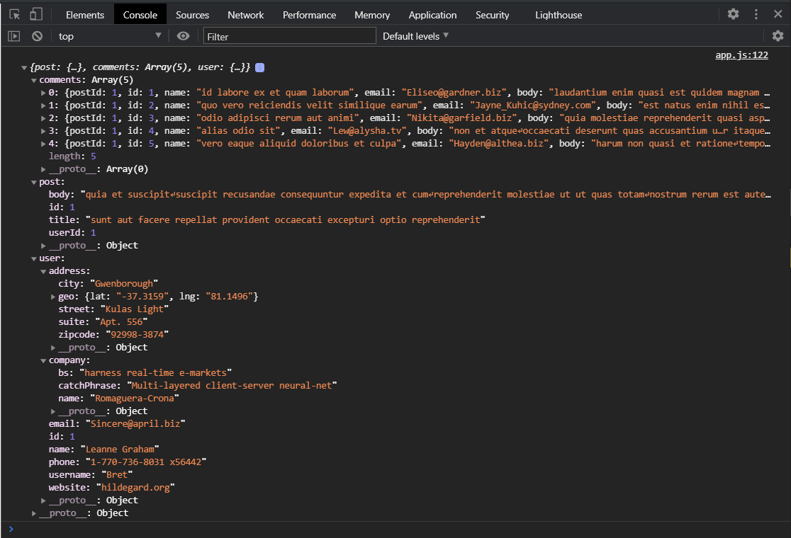

Попробуем передать данные между нашими **promises** т.е. между **getPost**, **getPostCommemts**,**getUserCreatedPost** и на выходе получить объект в котором будет информация о **post**, **comments**, **user**.

Для того что бы это сделать мы должны в каждый последующий наш **promise** передавать данные предыдущего т.е. как я говорил мы можем передавать данные между **then** и мы можем передавать их дальше в наш **promise**. Т.е. я в первом **then** получаю **post** - это результат вызова **getPost**. Этот **post** я передаю в **getPostComments(post)**. Соответственно в **getPostComments** я получу свой **post**


И я могу вытащить из него **id**. Т.е. деструктурируя я получу **id** поста.

```js
function getPostCommemts(post) {
  const { id } = post;
  return new Promise((resolve, reject) => {
    myHttp.get(
      `https://jsonplaceholder.typicode.com/comments?postId=1`,
      (err, res) => {
        if (err) {
          reject(err);
        }
        resolve(res);
      }
    );
  });
}
```

И могу подставить его в свой запрос

```js
function getPostCommemts(post) {
  const { id } = post;
  return new Promise((resolve, reject) => {
    myHttp.get(
      `https://jsonplaceholder.typicode.com/comments?postId=${id}`,
      (err, res) => {
        if (err) {
          reject(err);
        }
        resolve(res);
      }
    );
  });
}
```

На выходе после запроса я получу комментарии. Для того что бы дальше мне прокинуть **post**, потому что после выполнения **getComments**


Потому что в **resolve** я передаю результат запроса на комментарии.


Соответственно здесь мне нужно передавать объект. Соответственно как вы помните я говорил что нельзя передавать больше одного аргумерта в **resolve** поэтому мы здесь менятем **res** на объект и подставляем сюда **post** и через запятую указываю **comments: res** т.е. в **response** будут наши комментарии т.е. **resolve({ post, comments: res });**

```js
function http() {
  return {
    get(url, cb) {
      try {
        const xhr = new XMLHttpRequest();
        xhr.open("GET", url);
        xhr.addEventListener("load", () => {
          if (Math.floor(xhr.status / 100) !== 2) {
            cb(`Error. Status code: ${xhr.status}`, xhr);
            return;
          }
          const response = JSON.parse(xhr.responseText);
          cb(null, response);
        });
        xhr.addEventListener("error", () => {
          cb(`Error. Status code: ${xhr.status}`, xhr);
        });
        xhr.send();
      } catch (error) {
        cb(error);
      }
    },
    post(url, body, headers, cb) {
      try {
        const xhr = new XMLHttpRequest();
        xhr.open("POST", url);
        xhr.addEventListener("load", () => {
          if (Math.floor(xhr.status / 100) !== 2) {
            cb(`Error. Status code: ${xhr.status}`, xhr);
            return;
          }
          const response = JSON.parse(xhr.responseText);
          cb(null, response);
        });
        xhr.addEventListener("error", () => {
          cb(`Error. Status code: ${xhr.status}`, xhr);
        });

        if (headers) {
          Object.entries(headers).forEach(([key, value]) => {
            xhr.setRequestHeader(key, value);
          });
        }
        xhr.send(JSON.stringify(body));
      } catch (error) {
        console.log(error);
      }
    },
  };
}

const myHttp = http();

function getPost(id) {
  return new Promise((resolve, reject) => {
    myHttp.get(`https://jsonplaceholder.typicode.com/posts/1`, (err, res) => {
      if (err) {
        reject(err);
      }
      resolve(res);
    });
  });
}

function getPostCommemts(post) {
  const { id } = post;
  return new Promise((resolve, reject) => {
    myHttp.get(
      `https://jsonplaceholder.typicode.com/comments?postId=${id}`,
      (err, res) => {
        if (err) {
          reject(err);
        }
        resolve({ post, comments: res });
      }
    );
  });
}
function getUserCreatedPost() {
  return new Promise((resolve, reject) => {
    myHttp.get(`https://jsonplaceholder.typicode.com/users/1`, (err, res) => {
      if (err) {
        reject(err);
      }
      resolve(res);
    });
  });
}

getPost()
  .then((post) => getPostCommemts())
  .then((comments) => getUserCreatedPost())
  .then((user) => console.log(user))
  .catch((err) => console.log(err));
```

Теперь когда я сделал вот так **resolve({ post, comments: res });** на следующем шаге **then** вместо **comments**. Переименую это в **data** и смотрим.

```js
function http() {
  return {
    get(url, cb) {
      try {
        const xhr = new XMLHttpRequest();
        xhr.open("GET", url);
        xhr.addEventListener("load", () => {
          if (Math.floor(xhr.status / 100) !== 2) {
            cb(`Error. Status code: ${xhr.status}`, xhr);
            return;
          }
          const response = JSON.parse(xhr.responseText);
          cb(null, response);
        });
        xhr.addEventListener("error", () => {
          cb(`Error. Status code: ${xhr.status}`, xhr);
        });
        xhr.send();
      } catch (error) {
        cb(error);
      }
    },
    post(url, body, headers, cb) {
      try {
        const xhr = new XMLHttpRequest();
        xhr.open("POST", url);
        xhr.addEventListener("load", () => {
          if (Math.floor(xhr.status / 100) !== 2) {
            cb(`Error. Status code: ${xhr.status}`, xhr);
            return;
          }
          const response = JSON.parse(xhr.responseText);
          cb(null, response);
        });
        xhr.addEventListener("error", () => {
          cb(`Error. Status code: ${xhr.status}`, xhr);
        });

        if (headers) {
          Object.entries(headers).forEach(([key, value]) => {
            xhr.setRequestHeader(key, value);
          });
        }
        xhr.send(JSON.stringify(body));
      } catch (error) {
        console.log(error);
      }
    },
  };
}

const myHttp = http();

function getPost(id) {
  return new Promise((resolve, reject) => {
    myHttp.get(`https://jsonplaceholder.typicode.com/posts/1`, (err, res) => {
      if (err) {
        reject(err);
      }
      resolve(res);
    });
  });
}

function getPostCommemts(post) {
  const { id } = post;
  return new Promise((resolve, reject) => {
    myHttp.get(
      `https://jsonplaceholder.typicode.com/comments?postId=${id}`,
      (err, res) => {
        if (err) {
          reject(err);
        }
        resolve({ post, comments: res });
      }
    );
  });
}
function getUserCreatedPost() {
  return new Promise((resolve, reject) => {
    myHttp.get(`https://jsonplaceholder.typicode.com/users/1`, (err, res) => {
      if (err) {
        reject(err);
      }
      resolve(res);
    });
  });
}

getPost()
  .then((post) => getPostCommemts(post))
  .then((data) => console.log(data))
  .then((user) => console.log(user))
  .catch((err) => console.log(err));
```


Я получу объект где будет **post** и **comments**. Т.е. я уже получаю цельный объект с постом и комментариями.

Соответственно теперь я могу передать эти данные в следующий **getUserCreatedPost т.е. .then((data) => getUserCreatedPost(data)).**

Внутри **post** т.е. теперь мы здесь получим эти данные в


Мы получим здесь наши данные

```js
function getUserCreatedPost(data) {
  console.log(data);
  return new Promise((resolve, reject) => {
    myHttp.get(`https://jsonplaceholder.typicode.com/users/1`, (err, res) => {
      if (err) {
        reject(err);
      }
      resolve(res);
    });
  });
}
```


Т.е. я теперь из **post** могу вытащить **userId** который сделал этот **post**. Опять же деструктурирую забираю **post** из объекта и оттуда забираю **userId** и присваиваю все в переменную **data**. т.е. таким образом мы получим **userId** вывожу в консоль. Но таким образом мы получим все данные пользователя


Для того что бы получить **id** пользователя деструктурирую **userId**.

```js
function http() {
  return {
    get(url, cb) {
      try {
        const xhr = new XMLHttpRequest();
        xhr.open("GET", url);
        xhr.addEventListener("load", () => {
          if (Math.floor(xhr.status / 100) !== 2) {
            cb(`Error. Status code: ${xhr.status}`, xhr);
            return;
          }
          const response = JSON.parse(xhr.responseText);
          cb(null, response);
        });
        xhr.addEventListener("error", () => {
          cb(`Error. Status code: ${xhr.status}`, xhr);
        });
        xhr.send();
      } catch (error) {
        cb(error);
      }
    },
    post(url, body, headers, cb) {
      try {
        const xhr = new XMLHttpRequest();
        xhr.open("POST", url);
        xhr.addEventListener("load", () => {
          if (Math.floor(xhr.status / 100) !== 2) {
            cb(`Error. Status code: ${xhr.status}`, xhr);
            return;
          }
          const response = JSON.parse(xhr.responseText);
          cb(null, response);
        });
        xhr.addEventListener("error", () => {
          cb(`Error. Status code: ${xhr.status}`, xhr);
        });

        if (headers) {
          Object.entries(headers).forEach(([key, value]) => {
            xhr.setRequestHeader(key, value);
          });
        }
        xhr.send(JSON.stringify(body));
      } catch (error) {
        console.log(error);
      }
    },
  };
}

const myHttp = http();

function getPost(id) {
  return new Promise((resolve, reject) => {
    myHttp.get(`https://jsonplaceholder.typicode.com/posts/1`, (err, res) => {
      if (err) {
        reject(err);
      }
      resolve(res);
    });
  });
}

function getPostCommemts(post) {
  const { id } = post;
  return new Promise((resolve, reject) => {
    myHttp.get(
      `https://jsonplaceholder.typicode.com/comments?postId=${id}`,
      (err, res) => {
        if (err) {
          reject(err);
        }
        resolve({ post, comments: res });
      }
    );
  });
}
function getUserCreatedPost(data) {
  console.log(data);
  const {
    post: { userId },
  } = data;
  console.log(userId);
  return new Promise((resolve, reject) => {
    myHttp.get(`https://jsonplaceholder.typicode.com/users/1`, (err, res) => {
      if (err) {
        reject(err);
      }
      resolve(res);
    });
  });
}

getPost()
  .then((post) => getPostCommemts(post))
  .then((data) => getUserCreatedPost(data))
  .then((user) => console.log(user))
  .catch((err) => console.log(err));
```


Для того что бы динамически в будущем выводить пользователей в запрос передаю **myHttp.get(`https://jsonplaceholder.typicode.com/users/${userId}`.**

```js
function http() {
  return {
    get(url, cb) {
      try {
        const xhr = new XMLHttpRequest();
        xhr.open("GET", url);
        xhr.addEventListener("load", () => {
          if (Math.floor(xhr.status / 100) !== 2) {
            cb(`Error. Status code: ${xhr.status}`, xhr);
            return;
          }
          const response = JSON.parse(xhr.responseText);
          cb(null, response);
        });
        xhr.addEventListener("error", () => {
          cb(`Error. Status code: ${xhr.status}`, xhr);
        });
        xhr.send();
      } catch (error) {
        cb(error);
      }
    },
    post(url, body, headers, cb) {
      try {
        const xhr = new XMLHttpRequest();
        xhr.open("POST", url);
        xhr.addEventListener("load", () => {
          if (Math.floor(xhr.status / 100) !== 2) {
            cb(`Error. Status code: ${xhr.status}`, xhr);
            return;
          }
          const response = JSON.parse(xhr.responseText);
          cb(null, response);
        });
        xhr.addEventListener("error", () => {
          cb(`Error. Status code: ${xhr.status}`, xhr);
        });

        if (headers) {
          Object.entries(headers).forEach(([key, value]) => {
            xhr.setRequestHeader(key, value);
          });
        }
        xhr.send(JSON.stringify(body));
      } catch (error) {
        console.log(error);
      }
    },
  };
}

const myHttp = http();

function getPost(id) {
  return new Promise((resolve, reject) => {
    myHttp.get(`https://jsonplaceholder.typicode.com/posts/1`, (err, res) => {
      if (err) {
        reject(err);
      }
      resolve(res);
    });
  });
}

function getPostCommemts(post) {
  const { id } = post;
  return new Promise((resolve, reject) => {
    myHttp.get(
      `https://jsonplaceholder.typicode.com/comments?postId=${id}`,
      (err, res) => {
        if (err) {
          reject(err);
        }
        resolve({ post, comments: res });
      }
    );
  });
}
function getUserCreatedPost(data) {
  console.log(data);
  const {
    post: { userId },
  } = data;
  console.log(userId);
  return new Promise((resolve, reject) => {
    myHttp.get(
      `https://jsonplaceholder.typicode.com/users/${userId}`,
      (err, res) => {
        if (err) {
          reject(err);
        }
        resolve(res);
      }
    );
  });
}

getPost()
  .then((post) => getPostCommemts(post))
  .then((data) => getUserCreatedPost(data))
  .then((user) => console.log(user))
  .catch((err) => console.log(err));
```

и теперь на выходе в третьем **then** мы все еще не получим эти данные так как их еще необходимо объеденить. т.е. в **resolve** функции **getUserCreatedPost** деструктуризацию **resolve({ ...data, user: res });** т.е. т.к. в этом **promise** в **response** я получаю **user** то соответственно передаю user: res. А ...data, наш предыдущий объект **user** и **comments**, и мы оттуда деструктурируем это два свойства. Таким образом на третьем **then**, называю это **fullData**, получаю полные данные.

```js
function http() {
  return {
    get(url, cb) {
      try {
        const xhr = new XMLHttpRequest();
        xhr.open("GET", url);
        xhr.addEventListener("load", () => {
          if (Math.floor(xhr.status / 100) !== 2) {
            cb(`Error. Status code: ${xhr.status}`, xhr);
            return;
          }
          const response = JSON.parse(xhr.responseText);
          cb(null, response);
        });
        xhr.addEventListener("error", () => {
          cb(`Error. Status code: ${xhr.status}`, xhr);
        });
        xhr.send();
      } catch (error) {
        cb(error);
      }
    },
    post(url, body, headers, cb) {
      try {
        const xhr = new XMLHttpRequest();
        xhr.open("POST", url);
        xhr.addEventListener("load", () => {
          if (Math.floor(xhr.status / 100) !== 2) {
            cb(`Error. Status code: ${xhr.status}`, xhr);
            return;
          }
          const response = JSON.parse(xhr.responseText);
          cb(null, response);
        });
        xhr.addEventListener("error", () => {
          cb(`Error. Status code: ${xhr.status}`, xhr);
        });

        if (headers) {
          Object.entries(headers).forEach(([key, value]) => {
            xhr.setRequestHeader(key, value);
          });
        }
        xhr.send(JSON.stringify(body));
      } catch (error) {
        console.log(error);
      }
    },
  };
}

const myHttp = http();

function getPost(id) {
  return new Promise((resolve, reject) => {
    myHttp.get(`https://jsonplaceholder.typicode.com/posts/1`, (err, res) => {
      if (err) {
        reject(err);
      }
      resolve(res);
    });
  });
}

function getPostCommemts(post) {
  const { id } = post;
  return new Promise((resolve, reject) => {
    myHttp.get(
      `https://jsonplaceholder.typicode.com/comments?postId=${id}`,
      (err, res) => {
        if (err) {
          reject(err);
        }
        resolve({ post, comments: res });
      }
    );
  });
}
function getUserCreatedPost(data) {
  const {
    post: { userId },
  } = data;
  return new Promise((resolve, reject) => {
    myHttp.get(
      `https://jsonplaceholder.typicode.com/users/${userId}`,
      (err, res) => {
        if (err) {
          reject(err);
        }
        resolve({ ...data, user: res });
      }
    );
  });
}

getPost()
  .then((post) => getPostCommemts(post))
  .then((data) => getUserCreatedPost(data))
  .then((FullData) => console.log(FullData))
  .catch((err) => console.log(err));
```



При этом мы в getPost еще не передавали id. Ставлю любой интересующий id.

```js
function http() {
  return {
    get(url, cb) {
      try {
        const xhr = new XMLHttpRequest();
        xhr.open("GET", url);
        xhr.addEventListener("load", () => {
          if (Math.floor(xhr.status / 100) !== 2) {
            cb(`Error. Status code: ${xhr.status}`, xhr);
            return;
          }
          const response = JSON.parse(xhr.responseText);
          cb(null, response);
        });
        xhr.addEventListener("error", () => {
          cb(`Error. Status code: ${xhr.status}`, xhr);
        });
        xhr.send();
      } catch (error) {
        cb(error);
      }
    },
    post(url, body, headers, cb) {
      try {
        const xhr = new XMLHttpRequest();
        xhr.open("POST", url);
        xhr.addEventListener("load", () => {
          if (Math.floor(xhr.status / 100) !== 2) {
            cb(`Error. Status code: ${xhr.status}`, xhr);
            return;
          }
          const response = JSON.parse(xhr.responseText);
          cb(null, response);
        });
        xhr.addEventListener("error", () => {
          cb(`Error. Status code: ${xhr.status}`, xhr);
        });

        if (headers) {
          Object.entries(headers).forEach(([key, value]) => {
            xhr.setRequestHeader(key, value);
          });
        }
        xhr.send(JSON.stringify(body));
      } catch (error) {
        console.log(error);
      }
    },
  };
}

const myHttp = http();

// myHttp.get(
//   `https://jsonplaceholder.typicode.com/posts/1`,
//   (err, res) => {
//     console.log("error", err);
//     return;
//   },
//   myHttp.get(
//     `https://jsonplaceholder.typicode.com/comments?postId=1`,
//     (err, res) => {
//       console.log("error", err);
//       return;
//     },
//     myHttp.get(
//       `https://jsonplaceholder.typicode.com/users/1`,
//       (err, res) => {
//         console.log("error", err);
//         return;
//       },
//       console.log("наконец")
//     )
//   )
// );

function getPost(id) {
  return new Promise((resolve, reject) => {
    myHttp.get(`https://jsonplaceholder.typicode.com/posts/${id}`, (err, res) => {
      if (err) {
        reject(err);
      }
      resolve(res);
    });
  });
}

function getPostCommemts(post) {
  const { id } = post;
  return new Promise((resolve, reject) => {
    myHttp.get(
      `https://jsonplaceholder.typicode.com/comments?postId=${id}`,
      (err, res) => {
        if (err) {
          reject(err);
        }
        resolve({ post, comments: res });
      }
    );
  });
}
function getUserCreatedPost(data) {
  const {
    post: { userId },
  } = data;
  return new Promise((resolve, reject) => {
    myHttp.get(
      `https://jsonplaceholder.typicode.com/users/${userId}`,
      (err, res) => {
        if (err) {
          reject(err);
        }
        resolve({ ...data, user: res });
      }
    );
  });
}

getPost(50)
  .then((post) => getPostCommemts(post))
  .then((data) => getUserCreatedPost(data))
  .then((FullData) => console.log(FullData))
  .catch((err) => console.log(err));

```
Теперь мы можем вбивать любой **id**  и в итоге по цепочке мы получим нужную нам информацию. Но для этого пропиши в запросе для вывода динамических данных.


Давайте попробуем это чуть чуть уменьшить и обресовать.

[Смотри далее](introduction%20to%20promises003.md)