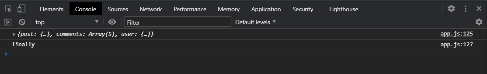

Посмотрим как наши данные передаются для того что бы было более менее понятно.

В **getPost** я передаю **id** нашего поста. Здесь же в **res** я получаю **1 post**. этот **post** передается в **resolve**.
Соответственно так как у нас эти функции вызываются в цепочке и каждой последующей передается результат предыдущей асинхронной операции. **res** из **resolve** функции **getPost** попадает в параметр **post** функции **getPostComments**. Далее их **post**  вытаскиваю **id** и далее этот **id** я передаю в запрос на получение комментариев **`https://jsonplaceholder.typicode.com/comments?postId=${id}`**. Далее в **callback** в responce я получаю комментарии и я их передаю в объект **resolve** в свойство **comments: res** т.е. **resolve({ post, comments: res });** А сам **getPostCommemts(post)** попадает в **resolve({ post, comments: res });** И исходя полученных данных в **resolve** мы формируем новый объект.

Дальше весь этот объект попадает в **function getUserCreatedPost(data)** попадает как **data**. Далее из **post** я забираю **userId** и его передаю так же в запрос **`https://jsonplaceholder.typicode.com/users/${userId}`** что бы получить пользователя по определенному **userId**. И теперь в **callback** в **responce** я получаю **userId** который я передаю в **resolve({ ...data, user: res });** А **data** это соответственно результат **resolve post** предыдущей функции они попадают в **resolve** где я их деструктурирую. И после получения всех данных **resolve({ ...data, user: res });** я формирую **fullData** где есть все эти данные в **promise**.

При этом у нас есть четкая структура, есть четкочитаемый порядок вызовов функций.

Так же у **promise** есть еще один метод **finally(наконец)** этот метод не поддерживается в **ie11**. Данный метод ничего не принимает и он выполниться в любом случае будь-то ошибка, будь-то успешное выполнение.

```js
function http() {
  return {
    get(url, cb) {
      try {
        const xhr = new XMLHttpRequest();
        xhr.open("GET", url);
        xhr.addEventListener("load", () => {
          if (Math.floor(xhr.status / 100) !== 2) {
            cb(`Error. Status code: ${xhr.status}`, xhr);
            return;
          }
          const response = JSON.parse(xhr.responseText);
          cb(null, response);
        });
        xhr.addEventListener("error", () => {
          cb(`Error. Status code: ${xhr.status}`, xhr);
        });
        xhr.send();
      } catch (error) {
        cb(error);
      }
    },
    post(url, body, headers, cb) {
      try {
        const xhr = new XMLHttpRequest();
        xhr.open("POST", url);
        xhr.addEventListener("load", () => {
          if (Math.floor(xhr.status / 100) !== 2) {
            cb(`Error. Status code: ${xhr.status}`, xhr);
            return;
          }
          const response = JSON.parse(xhr.responseText);
          cb(null, response);
        });
        xhr.addEventListener("error", () => {
          cb(`Error. Status code: ${xhr.status}`, xhr);
        });

        if (headers) {
          Object.entries(headers).forEach(([key, value]) => {
            xhr.setRequestHeader(key, value);
          });
        }
        xhr.send(JSON.stringify(body));
      } catch (error) {
        console.log(error);
      }
    },
  };
}

const myHttp = http();

function getPost(id) {
  return new Promise((resolve, reject) => {
    myHttp.get(
      `https://jsonplaceholder.typicode.com/posts/${id}`,
      (err, res) => {
        if (err) {
          reject(err);
        }
        resolve(res);
      }
    );
  });
}

function getPostCommemts(post) {
  const { id } = post;
  return new Promise((resolve, reject) => {
    myHttp.get(
      `https://jsonplaceholder.typicode.com/comments?postId=${id}`,
      (err, res) => {
        if (err) {
          reject(err);
        }
        resolve({ post, comments: res });
      }
    );
  });
}
function getUserCreatedPost(data) {
  const {
    post: { userId },
  } = data;
  return new Promise((resolve, reject) => {
    myHttp.get(
      `https://jsonplaceholder.typicode.com/users/${userId}`,
      (err, res) => {
        if (err) {
          reject(err);
        }
        resolve({ ...data, user: res });
      }
    );
  });
}

getPost(50)
  .then((post) => getPostCommemts(post))
  .then((data) => getUserCreatedPost(data))
  .then((FullData) => console.log(FullData))
  .catch((err) => console.log(err))
  .finally(() => console.log("finally"));
```



Он выполнился. При этом если где-то будет ошибка, то мы выпадем в ошибку, но **finally** так же выполнится. Т.е. может вам понадобится выполнить какое-то действие по завершению всей цепочки, обязательное, независимое от **cath** и **then**. Это бывает не так часто но знать об этом вы должны.

И еще в том числе не маловажное это **Promise.all** - это специальный метод который позволяет нам выполнить несколько **promise** и получить в одном **then** результат выполнения.

Допустим что мы заранее знаем какие у нас будут **id**. Нам просто нужно получить стек данных и дальше с ними продолжить работу.

Создаю дубль наших функций

```js
function getPost2(id) {
  return new Promise((resolve, reject) => {
    myHttp.get(
      `https://jsonplaceholder.typicode.com/posts/${id}`,
      (err, res) => {
        if (err) {
          reject(err);
        }
        resolve(res);
      }
    );
  });
}

function getPostCommemts2(id) {
  return new Promise((resolve, reject) => {
    myHttp.get(
      `https://jsonplaceholder.typicode.com/comments?postId=${id}`,
      (err, res) => {
        if (err) {
          reject(err);
        }
        resolve({ post, comments: res });
      }
    );
  });
}
function getUserCreatedPost2(userId) {
  return new Promise((resolve, reject) => {
    myHttp.get(
      `https://jsonplaceholder.typicode.com/users/${userId}`,
      (err, res) => {
        if (err) {
          reject(err);
        }
        resolve({ ...data, user: res });
      }
    );
  });
}
```

У нас есть три функции каждая из которых по отдельности принимает свой **id** и соответственно выполняют нужный запрос.

**Promise.all()** принимает массив **promise** т.е. мы должны сюда передать массив функций которые возвращают или являются промисами **Promise.all([getPost2(1)**, **getPostCommemts2(1)**, **getUserCreatedPost2(1)])**; и у промиса есть **then()** в котором мы получим все данные ввиде массива.

```js
function getPost2(id) {
  return new Promise((resolve, reject) => {
    myHttp.get(
      `https://jsonplaceholder.typicode.com/posts/${id}`,
      (err, res) => {
        if (err) {
          reject(err);
        }
        resolve(res);
      }
    );
  });
}

function getPostCommemts2(id) {
  return new Promise((resolve, reject) => {
    myHttp.get(
      `https://jsonplaceholder.typicode.com/comments?postId=${id}`,
      (err, res) => {
        if (err) {
          reject(err);
        }
        resolve(res);
      }
    );
  });
}
function getUserCreatedPost2(userId) {
  return new Promise((resolve, reject) => {
    myHttp.get(
      `https://jsonplaceholder.typicode.com/users/${userId}`,
      (err, res) => {
        if (err) {
          reject(err);
        }
        resolve(res);
      }
    );
  });
}

Promise.all([
  getPost2(1),
  getPostCommemts2(1),
  getUserCreatedPost2(1),
]).then((fulldata) => console.log(fulldata));
```


Т.е. мы предели массив **promise**. Каждый из них выполняет какую-то асинхронную операцию. В итоге мы получаем массив **fulldata** в том порядке в котором мы перадали их в массиве.

При этом мы можем легко это деструктурировать

```js
function getPost2(id) {
  return new Promise((resolve, reject) => {
    myHttp.get(
      `https://jsonplaceholder.typicode.com/posts/${id}`,
      (err, res) => {
        if (err) {
          reject(err);
        }
        resolve(res);
      }
    );
  });
}

function getPostCommemts2(id) {
  return new Promise((resolve, reject) => {
    myHttp.get(
      `https://jsonplaceholder.typicode.com/comments?postId=${id}`,
      (err, res) => {
        if (err) {
          reject(err);
        }
        resolve(res);
      }
    );
  });
}
function getUserCreatedPost2(userId) {
  return new Promise((resolve, reject) => {
    myHttp.get(
      `https://jsonplaceholder.typicode.com/users/${userId}`,
      (err, res) => {
        if (err) {
          reject(err);
        }
        resolve(res);
      }
    );
  });
}

Promise.all([
  getPost2(1),
  getPostCommemts2(1),
  getUserCreatedPost2(1),
]).then(([post, comments, user]) => console.log(post, comments, user));
```


И так жу у нас здесь есть **catch** в который выпадет ошибка в случае если на одном из **promise** у нас возникнет ошибка.

```js
function getPost2(id) {
  return new Promise((resolve, reject) => {
    myHttp.get(
      `https://jsonplaceholder.typicode.com/posts/${id}`,
      (err, res) => {
        if (err) {
          reject(err);
        }
        resolve(res);
      }
    );
  });
}

function getPostCommemts2(id) {
  return new Promise((resolve, reject) => {
    myHttp.get(
      `https://jsonplaceholder.typicode.com/comments?postId=${id}`,
      (err, res) => {
        if (err) {
          reject(err);
        }
        resolve(res);
      }
    );
  });
}
function getUserCreatedPost2(userId) {
  return new Promise((resolve, reject) => {
    myHttp.get(
      `https://jsonplaceholder.typicode.com/users/${userId}`,
      (err, res) => {
        if (err) {
          reject(err);
        }
        resolve(res);
      }
    );
  });
}

Promise.all([getPost2(1), getPostCommemts2(1), getUserCreatedPost2(1)])
  .then(([post, comments, user]) => console.log(post, comments, user))
  .catch((err) => console.log(err));
```
и далее которую мы сможем обработать.