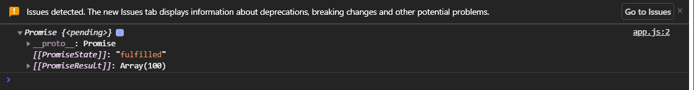

# fetch (извлечь)

Это новый стандарт для **AJAX** запросов который использует **promises**. Посмотрим на базовый синтаксис.

По умолчанию **fetch** делает **GET** запрос и возвращает **promise** в котором мы получим объект ответа.

Будем мы все так же использовать [JSONPlaceholder](https://jsonplaceholder.typicode.com/) И будем делать запрос на получение **post**.

Вызываю функцию **fetch** и она принимает первым аргументом это адрес куда мы хотим сделать запрос.

Вторым аргументом принимает объект с настройками если у нас не **GET** запрос или как то отличается от **GET** запроса. Если нам нужны дополнительные заголовки или если у нас **POST** запрос или другой метод запроса то мы можем вторым аргументом передать объект куда указать непосредственно **body**, **methods**, **headers** и т.д. Эти все настройки вы можете прочитать в документации по **feth**.

```js
fetch("https://jsonplaceholder.typicode.com/posts", {});
```

Здесь же базово вызвав эту функцию мы получаем на выходе **promise**

```js
fetch("https://jsonplaceholder.typicode.com/posts");
```

И вызываю в консоли.


После вызова я получаю **promise** который в свою очередь делает **AJAX** запрос и нам на выход будут даны методы **then** и **catch**. Соответственно **then** отработает если запрос прошел успешно. **Catch** отработает если есть какая-то ошибка.

```js
fetch("https://jsonplaceholder.typicode.com/posts")
  .then((response) => console.log(response))
  .catch((err) => console.log(err));
```


Т.к. сейчас запрос выполняется успешно мы получаем объект ответа **response** который будет содержать различную информацию о нашем запросе и в том числе методы для работы с ответом.

Мы можем получить какие-то заголовки можем получить статус. Для того что бы получить неасредственно **body** ответа, то что нам прислал сервер, нам нужно в нашем объекте **response** вызвать специальный метод в зависимости от того какие данные мы получили от сервера. Мы можем получать не только **JSON** но и другие форматы и соответственно в зависимости от этого мы будем у объекта **response** вызывать различные методы.


Эти методы мы пожем вызвать что бы получить непосредственно наши данные. Т.к. нам сервер возвращает данные в формате **JSON** мы должны в первой цепочке сделать **return response,json()**. Данный метод мы не можем вызывать более одного раза.

```js
fetch("https://jsonplaceholder.typicode.com/posts")
  .then((response) => console.log(response.json()))
  //   return response.json()
  .catch((err) => console.log(err));
```

Он нам возвращает так же **promise**



И здесь будет непосредственно значение т.е. тело что нам вернул сервер. Поэтому что бы получить сам ответ мы **return response.json()**. И дальше вызываю **then(posts)** где получаю посты.

```js
fetch("https://jsonplaceholder.typicode.com/posts")
  .then((response) => {
    return response.json();
  })
  .then((posts) => console.log(posts))
  .catch((err) => console.log(err));
```


Теперь когда мы получили наши **posts**. При этом заметьте они уже не в формате **JSON**, а полноценный массив который мы можем использовать у себя в приложении.

Т.е. в базовом формате вам нужно знать о том что **fetch** по умолчанию делает **GET** запрос. Если ваш запрос отличается от базового **GET** запроса вы должны передать второй аргумент с дополнительными настройками такими как **method**, **body**, **headers** и т.д. В первом **then** я получаю объект ответа от сервера. В этом объекте у вас будет набор свойств и методов для работы с ответом. Вы можете проверить **status code**, выполнить обработку каких-то ошибок. Вы можете получить соответственно какие-то заголовки и для того что бы получить тело запроса вы должны вызвать у **response** один из методов который преобразовывают ваши ответы от сервера в нужный вам формат **return response.json();** т.е. если вы получаете **JSON** вы вызываете **json**, если получаете **text** вызываете **text** и т.д. И соответственно на следующе цепочке вы получите непосредственно само тело ответа от сервера **.then((posts) => console.log(posts))**.

Давайте теперь посмотрим как это все обернуть в функцию потому что мы с вами в таком формате это использовать не будем. Обычно это будет заворачиваться в какие-то функции в которых мы уже будем выполнять наш запрос и дальше в зависимости от ситуации выполнять какие-то действия.

**function getPost(id){}** мы принимает **id**. Первый вариант как это можно реализовать. В теле я буду **return new Promise()** т.е. мы будем делать обертку промиса. Прописываю стрелочную функцию в параметры которой я принимаю **resolve** и **reject**.

```js
function getPost(id) {
  return new Promise((resolve, reject) => {});
}
```

Внутри я буду выполнять **fetch** на указанный адрес только с определенным **id**

```js
function getPost(id) {
  return new Promise((resolve, reject) => {
    fetch(`https://jsonplaceholder.typicode.com/posts/${id}`);
  });
}
```

Дальше я буду в цепочке then() получать объект ответа response вызывать => response.json().

```js
function getPost(id) {
  return new Promise((resolve, reject) => {
    fetch(`https://jsonplaceholder.typicode.com/posts/${id}`).then(
      (response) => response.json
    );
  });
}
```

На следующей цепочке **then()** мы будем получать наш **post** и отправлять его в **=> resolve()** т.е. мы что бы получить снаружи функции будем вызывать **resolve** и предавать туда **post**. Ну и соответственно делать **catch**.

```js
function getPost(id) {
  return new Promise((resolve, reject) => {
    fetch(`https://jsonplaceholder.typicode.com/posts/${id}`)
      .then((response) => response.json())
      .then((post) => resolve(post))
      .catch((err) => console.log(err));
  });
}
```

теперь мы можем вызвать **getPost(1)** передать **id** и вызвать метод **then()** и получить нужный нам **post**.

```js
function getPost(id) {
  return new Promise((resolve, reject) => {
    fetch(`https://jsonplaceholder.typicode.com/posts/${id}`)
      .then((response) => response.json())
      .then((post) => resolve(post))
      .catch((err) => reject(err));
  });
}

getPost(1).then((post) => console.log(post));
```

Едиственное что в **.catch((err) => reject(err));** т.e не **console.log(err)** а вот это вот. Т.е. если мы получим ошибку мы сделаем **reject**, выпадем в ошибку и сможем ее обработать уже снаружи. Результат в консоли.


Но нам не обязательно делать обертку. Мы сейчас сделали обертку **new Promises** над **fetch** т.к. **fetch** является так же **promise**. Мы можем сосем упростить эту запись и выполнить ее в следующем формате.

**function getPost2(id){}** мы можем сразу в теле функции написать **return** и указать наш **fetch**.

```js
function getPost2(id) {
  return fetch(
    `https://jsonplaceholder.typicode.com/posts/${id}`
  ).then((response) => response.json());
}
```

т.е. мы сразу возвращаем **fetch**. Then вернет нам **promise** соответсвтенно и мы можем снаружи сделать

```js
function getPost2(id) {
  return fetch(
    `https://jsonplaceholder.typicode.com/posts/${id}`
  ).then((response) => response.json());
}

getPost2(1)
  .then((post) => console.log(post))
  .catch((err) => console.log(err));
```


Но какая в такой ситуации есть проблема? Представлте что вы здесь делаете еще какие-то манипуляции и у вас возникнет какая-то ошибка.

Представим что **id** у нас выгдядит как тип пользователя к примеру **user-1**

```js
function getPost2(id) {
  return fetch(
    `https://jsonplaceholder.typicode.com/posts/${id}`
  ).then((response) => response.json());
}

getPost2("user-1")
  .then((post) => console.log(post))
  .catch((err) => console.log(err));
```


то у нас с вами возникает ошибка. Во-первых **404** мы с вами выпадаем из **then**. Но нам отсюда **user-1** нужно доставать цифру.

Мы можем сделать следующее преобразование.

```js
function getPost2(id) {
  const [userType, userId] = id.split("-");
  return fetch(
    `https://jsonplaceholder.typicode.com/posts/${userId}`
  ).then((response) => response.json());
}

getPost2("user-1")
  .then((post) => console.log(post))
  .catch((err) => console.log(err));
```


Давайте внимательно посмотрим что бы вам было ясно что здесь сделано. Я передаю в виде строки **user-1**. В **getPost2(id)** это принимается как **1**, как переменная **id**. Далее я с помощью **split("-")** разбиваю строку по указанному разделителю. Соответственно у нас будет два элемента это **user** и **1**. И при помощи деструктуризации я разбив забираю **userType** и **userId**. Соответсвенно в **userId** будет храниться цифра **1**. Все хорошо все работает.

Но представте что вдруг по каким-то причинам в вызове функции окажется **1**.

```js
function getPost2(id) {
  const [userType, userId] = id.split("-");
  return fetch(
    `https://jsonplaceholder.typicode.com/posts/${userId}`
  ).then((response) => response.json());
}

getPost2(1)
  .then((post) => console.log(post))
  .catch((err) => console.log(err));
```


Код не выполняется и **catch** не отрабатывает. Потому что мы передалю сюда **const [userType, userId] = id.split("-");** которую нельзя разбить на массив.

В таком случае что нам делать?

Мы можем модифицировать эту функцию не использую **new Promise** а используя из объекта **Promise** метод **resolve**.

Пишу **return Promise.resolve().then(() =>{})** и заворачиваю всю нашу кострукцию в **Promise.resolve()**

```js
function getPost3(id) {
  return Promise.resolve().then(() => {
    const [userType, userId] = id.split("-");
    return fetch(
      `https://jsonplaceholder.typicode.com/posts/${userId}`
    ).then((response) => response.json());
  });
}
```

**Promise.resolve()** можно сказать пустышка котрая делает **Promise.resolve()** дает нам метод **then** который вызовет всю нашу кострукцию и в результате нам вернется соответсвенно **fetch** c выполненным запросом или не выполненным.

Но теперь за счет того что у нас есть обертка **Promise.resolve()** вызвав функцию **getPost3**

```js
function getPost3(id) {
  return Promise.resolve().then(() => {
    const [userType, userId] = id.split("-");
    return fetch(
      `https://jsonplaceholder.typicode.com/posts/${userId}`
    ).then((response) => response.json());
  });
}

getPost3(1)
  .then((post) => console.log(post))
  .catch((err) => console.log(err));
```
Если я допускаю ошибку и наш код падает сдесь  **const [userType, userId] = id.split("-");** 


то у меня отрабатывает **catch**. У меня не упадет в **run time** мое приложение, а уменя выпадет ошибка что **id.split is not a function or its return value is not iterable** и я смогу эту ошибку обработать и что-то понять и узнать о ней. Это очень важный нюанс.

В будущем должен появится такой метод как **Promise.try()** который делает практически делает тоже самое.

Так же советую посмотреть еще на один метод **Promise.rase** это аналог **promise.all** с небольшим отличием.