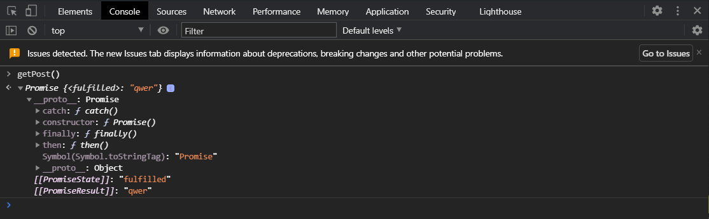
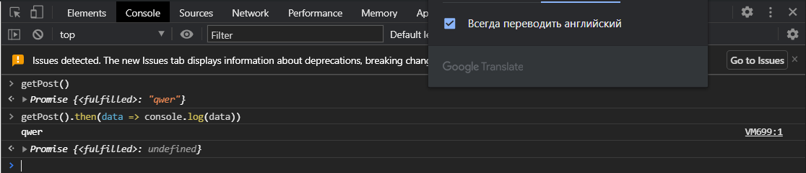
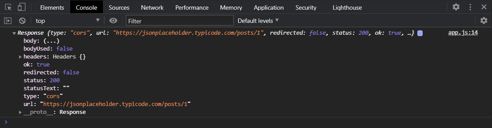
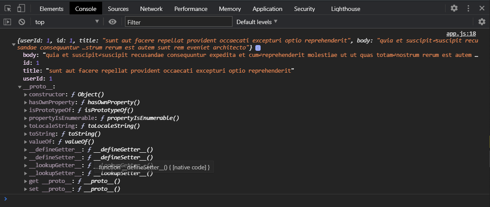
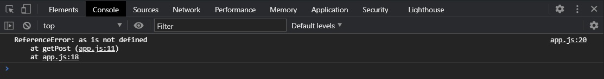
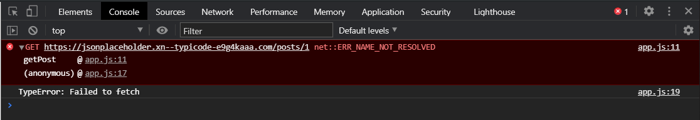
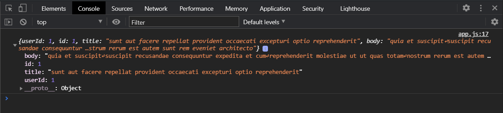
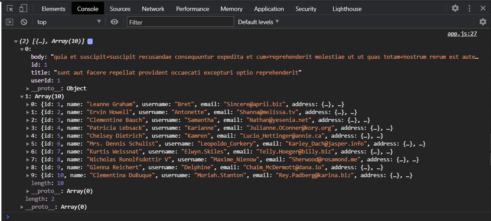
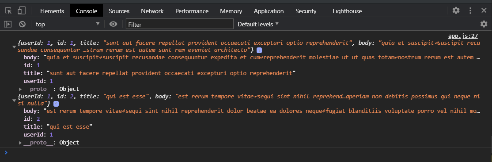

# async await

Это новый формат написания асинхронного кода. Посмотрим из чего он состоит. Какие есть нюансы и как мы можем его использовать.

У меня есть функция **getPost**

```js
function getPost(id) {
  return Promise.resolve().then(() => {
    const [userType, userId] = id.split("-");
    return fetch(
      `https://jsonplaceholder.typicode.com/posts/${userId}`
    ).then((response) => response.json());
  });
}
```

Препишем эту функцию с использованием **async await**. Начнем с ключевого слова **async**. Это ключевое слово ставиться перед объявлением функции или методов.

```js
async function getPost(id) {}
```

Что происходит когда мы объявляем функцию с ключевым словом **async**? Происходит следующее что **async** превращает эту функцию в такую которая всегда будет возвращать **promise** т.е. функция обявленная с ключевым словом **async** всегда будет возвращать **promise**. Проверяю.

```js
async function getPost(id) {
  return "qwer";
}
```

И вызову в консоли браузера



И нам возвращается **promice** который будет иметь статус **resolved** хотя у меня **fulfilled**. т.е. я уже могу получить какие то данные.



Превое что мы запоминаем это то что когда мы объявляем функцию с ключевым словом **async** она превращает нашу функцию сразу в такую которая возвращает нам **promise**.

Внутри этой функции мы можем использовать ключевое слово **await** которое можно так сказать замораживает наш код до выполнения асинхронного действия. При этом что интересно мы можем приенять **await** к чему угодно даже если это не асинхронное действие, не **promise** или не запрос **fetch** например.

```js
async function getPost(id) {
  const response = fetch(`https://jsonplaceholder.typicode.com/posts/${id}`);
}
```

И перед тем асинхронным действием, мы хотим подождать пока оно выполнится, ставлю **await**.

```js
async function getPost(id) {
  const response = await fetch(
    `https://jsonplaceholder.typicode.com/posts/${id}`
  );
  console.log(response);
}

getPost(1);
```



В консоль выпадает объект ответа от сервера после запроса с которым мы уже можем работать. При этом мы с вами здесь явно не пишем **Promise**, **new Promise**, **Promise.resolve** и т.д.

Т.е. фактически **async await** делает так что внутри, условно говоря, заворачивается в **Promise.resolve** и рабатает со всеми приимуществами **promise** т.е. с **fetch** и **then** которые мы можем использовать с нашей функцией. Таким образом если мы заканчиваем наш запрос, то получив **response** мы можем либо сделать отдельную переменную **data** в которую записать **await response.json()** как вы помните у того что возвращает **fetch** мы получаем объект ответа и соответственно мы должны вызвать метод **json** если хотим преобразовать **json** данные в обычные, объект или массив объектов. После этого далаю **return data** т.е. возвращаю те данные которые мы получили. Таким образом вне функции **getPost** мы с вами получим **then(data => console.log(data))**

```js
async function getPost(id) {
  const response = await fetch(
    `https://jsonplaceholder.typicode.com/posts/${id}`
  );
  const data = await response.json();
  return data;
}
getPost(1)
  .then((data) => console.log(data))
  .catch((err) => console.log(err));
```



И вот мы с вами получаем нужные нам данные. При этом как вы видите мы здесь не городим кучу цепочек **then** и наш код становится более похож на синхронный. У нас шаг за шагом, выполнение строка за строкой в итоге написанная в **retun data** попадает в наш **then**. В случае если возникает какая либо ошибка внутри **async** то она выпадет в **catch**. Пишу абракадабру.

```js
async function getPost(id) {
  as;
  const response = await fetch(
    `https://jsonplaceholder.typicode.com/posts/${id}`
  );
  const data = await response.json();
  return data;
}
getPost(1)
  .then((data) => console.log(data))
  .catch((err) => console.log(err));
```



то я попадаю сразу в ошибку что данная переменная небыла определена и я выпадаю сразу в **catch** т.е. у меня нет ошибки. Т.е. у меня нет ошибки которая ступит мой код. Я попадаю в **catch** и могу спокойно обработать эту ошибку. При этом в том числе я попаду в **catch** если ошибка будет асинхронной т.е. одно из преимуществ **async await** заключается в том что мы можем спокойно обработать как синхронные так и асинхронные ошибки.

Совершаю ошибку в обращении

```js
async function getPost(id) {
  const response = await fetch(
    `https://jsonplaceholder.tyйццццpicode.com/posts/${id}`
  );
  const data = await response.json();
  return data;
}
getPost(1)
  .then((data) => console.log(data))
  .catch((err) => console.log(err));
```



я так же выпаду в **catch**.

Таким образом мы можем обработать ошибки или обработать ответ от сервера. Так же здесь мы можем использовать и цепочки т.е. если я могу не писать **response.json()** т.е. выводить это в отдельную переменную. я могу сразу указать либо в **return response.json()**

```js
async function getPost(id) {
  const response = await fetch(
    `https://jsonplaceholder.typicode.com/posts/${id}`
  );
  return response.json();
}
getPost(1)
  .then((data) => console.log(data))
  .catch((err) => console.log(err));
```



Либо я могу вообще сделать **.then(res => res.json())** и после вернуть весь **feth** т.е **return response**.

```js
async function getPost(id) {
  const response = await fetch(
    `https://jsonplaceholder.typicode.com/posts/${id}`
  ).then((res) => res.json());
  return response;
}
getPost(1)
  .then((data) => console.log(data))
  .catch((err) => console.log(err));
```


Т.е. я сразу делаю **await feth** на **then** получаю объект **res**, привожу его к **json** и возвращаю весь этот **response**.

тогда у вас может возникнуть вопрос зачем нам впринцыпе здесь использовать **await** т.е. я эту функцию могу сделать вот так вот.

```js
async function getPost(id) {
  //   const response = await fetch(
  //     `https://jsonplaceholder.typicode.com/posts/${id}`
  //   ).then((res) => res.json());
  return fetch(`https://jsonplaceholder.typicode.com/posts/${id}`).then((res) =>
    res.json()
  );
}
getPost(1)
  .then((data) => console.log(data))
  .catch((err) => console.log(err));
```


Использование **await** это фактически защита т.к. я могу где-то выпадать в ошибки. Т.е. мне **async** гарантирует то что если внутри произойдет какая-то ошибка то я попаду в **catch** и у меня код не упадет.

Так же **async await** позволяет обрабатывать наш код **try catch**. Выглядит это следующим образом. И при этом мы можем делать какую-то дополнительную логику для **catch**

```js
async function getPost(id) {
  try {
    const response = await fetch(
      `https://jsonplaceholder.typicode.com/posts/${id}`
    ).then((res) => res.json());
    return response;
  } catch (err) {
    console.log(err);
  }
}
getPost(1)
  .then((data) => console.log(data))
  .catch((err) => console.log(err));
```

Для того что бы выкинуть из функции **get post** исключения, ошибку мы можем в **catch** сделать **return Promise.reject()** потому что если мы этого не сделаем мы не выпалдем в **catch**.

```js
async function getPost(id) {
  try {
    const response = await fetch(
      `https://jsonplaceholder.typicode.com/posts/${id}`
    ).then((res) => res.json());
    return response;
  } catch (err) {
    console.log(err);
    return Promise.reject(err);
  }
}
getPost(1)
  .then((data) => console.log(data))
  .catch((err) => console.log(err));
```

Либо я могу здесь написать **throw err**;

```js
async function getPost(id) {
  try {
    const response = await fetch(
      `https://jsonplaceholder.typicode.com/posts/${id}`
    ).then((res) => res.json());
    return response;
  } catch (err) {
    console.log(err);
    throw err;
  }
}
getPost(1)
  .then((data) => console.log(data))
  .catch((err) => console.log(err));
```

Либо могу написать **return Promise.reject(err);** в который передаю объект ошибки.

```js
async function getPost(id) {
  try {
    const response = await fetch(
      `https://jsonplaceholder.typicode.com/posts/${id}`
    ).then((res) => res.json());
    return response;
  } catch (err) {
    console.log(err);
    return Promise.reject(err);
  }
}
getPost(1)
  .then((data) => console.log(data))
  .catch((err) => console.log(err));
```

Если здесь не вернуть **return Promise.reject(err);** то снаружи я уже не выпаду в .**catch((err) => console.log(err));**

Зачем нам такая конструкция? Такая конструкция нам может понадобится для обработки наших ошибок т.е. если у нас здесь возникнут какие-то ошибки мы можем вывести какие-то дополнительные уведомления, что-то возможно записать, сделать какие-то действия и уже наружу отдать сказать что ничего не получилось.Т.е. мы можем использовать конструкцию **try catch** вместе с **async await**.

Если нам нужно выполнить несколько запросов. Например вы хотите получить посты и еще что-то. Вы можете это делать как отдельными функциями т.е. обычно это может быть написано вот так вот.

```js
async function getPost(id) {
  try {
    const response1 = await fetch(
      `https://jsonplaceholder.typicode.com/posts/${id}`
    ).then((res) => res.json());

    const response2 = await fetch(
      `https://jsonplaceholder.typicode.com/users`
    ).then((res) => res.json());

    return [response1, response2];
  } catch (err) {
    console.log(err);
    return Promise.reject(err);
  }
}
getPost(1)
  .then((data) => console.log(data))
  .catch((err) => console.log(err));
```



Но на самом деле мы можем вот такую запись передалеть на **Promise.all()** примерно это будет выглядеть следующим образом. Почему мы это будет объеденять в **Promise.all()** потому что у нас может быть какая-то из функций занять больше времени на выполнение чем им нужно и зачем нам ждать пока она выполниться потом выполнится следующая функция. Мы можем используя **Promise.all()** выполнить сразу все функции и получить от них результат. И мы можем в функции сделать **const [res1, res2] = await Promise.all()** и сюда передать наши функции которые мы хотим **const [res1, res2] = await Promise.all([getPost(1), getPost(2)]);**

```js
async function getPost(id) {
  try {
    const response = await fetch(
      `https://jsonplaceholder.typicode.com/posts/${id}`
    ).then((res) => res.json());
    return response;
  } catch (err) {
    console.log(err);
    return Promise.reject(err);
  }
}

async function getAll() {
  const [res1, res2] = await Promise.all([getPost(1), getPost(2)]);
  console.log(res1, res2);
}
getAll();
```



И как видите мы получаем сразу оба наших поста с **id: 1** и с **id: 2**. Это будет выглядеть короче. Если мы будем реализовывать такое нам желательно делать обертку дополнительную в виде функций которая будет получать какие-то данные. Т.е у нас отдельная функция для получения каких-то специфичных данных постов пользователей и т.д.

```js
async function getPost(id) {
  try {
    const response = await fetch(
      `https://jsonplaceholder.typicode.com/posts/${id}`
    ).then((res) => res.json());
    return response;
  } catch (err) {
    console.log(err);
    return Promise.reject(err);
  }
}
```

И отдельная функция которая получает все или делает ряд каких-то вызовов более мелких функций и т.д.

```js
async function getAll() {
  const [res1, res2] = await Promise.all([getPost(1), getPost(2)]);
  console.log(res1, res2);
}
getAll();
```

Резюмируя **async await** позволяет нам писать асинхронный код в более синхронном стиле. Мы должны помнить что мы работаем с использованием **async await** мы работаем с промисами и мы можем использовать **then catch**. Мы должны помнить что **async** выбрасывает ошибку любую асинхронную или синхронную в **catch** что является большим плюсом для нас. И так же мы можем обрабатывать ошибки при помощи **try catch**.
