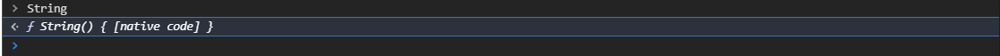
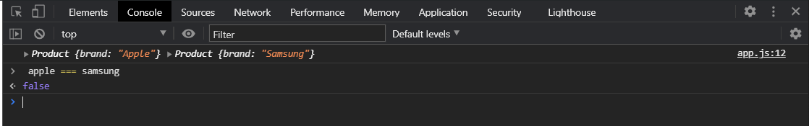

# Functions constructor

<br>
<br>

[https://docs.google.com/presentation/d/198EvGeoV5TEg7ThMmiMPFvpRThbSGQ-Pm4uwCer_pD8/edit?usp=sharing](https://docs.google.com/presentation/d/198EvGeoV5TEg7ThMmiMPFvpRThbSGQ-Pm4uwCer_pD8/edit?usp=sharing)

<br>
<br>

Начинаем изучать **ООП**. Одним из фундаментальных вещей в **ООП** являются такие вещи как **Class** и **constructor**.

**Constructor** - это функция которая служит, можно так сказать шаблоном для посторения объектов т.е. как мы с вами создавали объекты ранее.

Мы используя литерал объекта могли создать какой-нибудь объект, дать ему свойства **ключ : значение**. И использовать его.

```js
const Konstantine = {
  name: "Konstantine",
  age: 30,
};
```

Но что если мы хотим создавать новые и новые объекты из некоего шаблона. Плюс у нас объекты могут иметь наборы методов, какую-то логику и т.д. И каждый раз писать просто объект, создавая новый и новый объект это не очень удобно.

И здесь нам на помощь приходят так называемые **functions constructor**.

Как создаются такие функции?

Это обычные функции которые вызваны с оператором new. Мы уже с вами видели такие функции например **Promise** когда вызывали их с оператором new **Promise**. Это специальные функции конструкторы или встроенные классы, которые есть в **JS**, при вызове которых нам создается какая-то сущность, какой-то объект.

Поговорим про встроенные конструкторы которые есть в **JS**. Они есть для примитивных типов например как для строк или чисел.

```js
const str = new String("hello world");
console.log(str);
```


Мы получаем объект **String** и у нас будут проиндексированы каждый символ. Будет свойство **length**. И у него здесь есть свойство **proto** в котором написано что это **String**. Что такое **Prototype** в целом поговорим позднее. Но тем не менее здесь храняться методы для работы со строкой и это все происходит от **Object**.


Таких функций конструкторов встроенных в **JS** много. Тоже самое для числа, для объекта, для массива, для **promise**, для **data** в том числе.

Давайте выведем в консоль что такое **String()**.



И мы видим что это функция. Мы можем ее попробовать вызвать.


И я получаю просто значение.

Как же это работает внутри? И как же мы можем создать собственные функции **constructor**?

Для этого мы можем создать просто обычную функцию написав **function**, дальше мы объявляем ее имя. Обычно для функции конструкторов принято соглашение что они будут называться с большой буквы. Поэтому я называю нашу функцию конструктор как **function Product(){}**. И в теле я пока что делаю **console.log(this)**.

```js
function Product() {
  console.log(this);
}
```

Это обычная функция. Что же в ней такого?

Эта функция сановится функцией конструктором когда она вызывается с оператором **new**. Пишу так **const apple = new Product()**;

```js
function Product() {
  console.log(this);
}
const apple = new Product();
```


В консоли я вижу что на пятой строке вызвалась наша функция **Product** и **this** в ней указывает на какой-то **Object Product**.

Вызываю без оператора **new**.

```js
function Product() {
  console.log(this);
}
const apple = Product();
```


**this** теперь указывает на глобальный объект **Window**.

Т.е. оператор new делает что-то с нашей функцией что меняет ее поведение потому что внутри ее меняется **this**.

Что здесь происходит?

Здесь происходит несколько вещей. Давайте посмотрим еще один нюанс. Если мы вызываем функцию с операторм **new**, то в итоге в нашей переменной, если мы законсолим, будет тоже самое.

```js
function Product() {
  console.log(this);
}
const apple = new Product();
console.log(apple);
```


То в переменной будет тоже самое.

Если я уберу этот оператор, то

```js
function Product() {
  console.log(this);
}
const apple = Product();
console.log(apple);
```


Как мы видим **this** выходит в глобальный объект. А переменная **indefined**. Т.е. произошли какие-то изменения.

Какие же изменения происходят?

 Внутри нашей функции **Product** создается пустой объект и он привязывается к ключевому слову **this** т.е. **this** указывает на созданный внутри пустой объект. Мы можем добавлять свойства в этот объект или методы. После чего эта функция возвращает объект, созданный нами объект. Т.е. не явно здесь происходит действие.

```js
function Product() {
  console.log(this);
  // 1. Создается новый объект
  // 2. На этот объект устанавливается ссылка this
  // 3. Функция возвращает этот объект
}
const apple = Product();
console.log(apple);
```

При этом мы явно ни где **return** не указывали. Исходя из этого мы можем написать такую конструкцию.

```js
function Product() {
  // 1. Создается новый объект
  // 2. На этот объект устанавливается ссылка this
  // 3. Функция возвращает этот объект
  this.brand = "Apple";
  console.log(this);
}
const apple = new Product();
console.log(apple);
```


Теперь внутри у нас есть **Product**. Это объект и здесь есть свойство **brand: "Apple"**. И тоже самое в возращенном значении на 12 строке у нас объект Product и в нем есть **brand: "Apple"**.

Таким образом мы можем придти к тому что это можно расценивать как шаблон для создания объектов. Но этот шаблон не интересен если он не принимает какие-то аргументы. Потому что мы каждый раз например хотим создавать разные объекты имеющий одинаковый шаблон т.е. одинаковый набор свойств и методов, но сразными входными данными. Например сейчас я создаю с брендом **apple** а потом захочу создавать с брендом **Samsung**. Поэтому у нас наша функция конструктор может принимать **brand** параметр. Подставляю его в **this**. Этот парамерт я могу передавать при вызове.

```js
function Product(brand) {
  // 1. Создается новый объект
  // 2. На этот объект устанавливается ссылка this
  // 3. Функция возвращает этот объект
  this.brand = brand;
}
const apple = new Product("Apple");
console.log(apple);
```


Все работает точно так же. При этом теперь я могу создать еще один объект и передать другой **brand**.

```js
function Product(brand) {
  // 1. Создается новый объект
  // 2. На этот объект устанавливается ссылка this
  // 3. Функция возвращает этот объект
  this.brand = brand;
}
const apple = new Product("Apple");
const samsung = new Product("Samsung");
console.log(apple, samsung);
```


При этом эти два объекта не равны.



Т.е. наши функции конструкторы помогают нам создавать исходя из шаблона новые объекты с набором свойств и методов.

Как создавать методы внутри функции **constructor**?

Здесь все очень просто. Для того что бы это посмотреть давайте передадим еще несколько аргументов.

```js
// const str = new String("hello world");
// console.log(str);

function Product(brand, price, discount) {
  // 1. Создается новый объект
  // 2. На этот объект устанавливается ссылка this
  // 3. Функция возвращает этот объект
  this.brand = brand;
}
const apple = new Product("Apple", 100, 15);
const samsung = new Product("Samsung", 200, 25);
console.log(apple, samsung);
```

Внутри нашей функции конструктора мы создадим свойство **this.price** и таким же образом **discount**. И создаю метод **this.getPriseWithDiscount =** и запишем сюда **function(){}** которая будет расчитывать цену с учетом скидки и возвращать нам эту цену. Мы будем возвращать следующее **return (this.price \* (100 - this.discount)) /100;**

```js
function Product(brand, price, discount) {
  // 1. Создается новый объект
  // 2. На этот объект устанавливается ссылка this
  // 3. Функция возвращает этот объект
  this.brand = brand;
  this.price = price;
  this.discount = discount;
  this.getPriceWithDiscount = function () {
    return (this.price * (100 - this.discount)) / 100;
  };
}
const apple = new Product("Apple", 100, 15);
const samsung = new Product("Samsung", 200, 25);
console.log(apple, samsung);
```


Теперь как мы видим у нас создались два продукта. В каждом из них свои наборы свойств, с разными значениями и есть метод **getPriceWithDiscount** т.е. метод создается довольно просто.

Для того что бы его вызвать я могу прямо в консоли.


Таким образом мы создаем свойства и методы для наших функций конструктор. И такие функции конструкторы в **JS** еще означают классами.

**Класс** - это, если сильно упростить, собственный тип данных для объектов. т.е. мы придумываем какую-то сущность внутри своего приложения т.е. разделяем приложение на некоторые сущности и описываем эту сущность в форме объекта. Соответственно для того что бы создать шаблон такого объекта и иметь возможность его плодить многократно если это нужно, нам нужна функция конструктора и собственно говоря она является классом.

Так вот класс это как некий собственный тип данных который имеет набор свойств и методов для работы с экземпляром этого класса. Экземпляром класса является поражденные объекты от этого класса т.е. это фактически наши переменные **apple** и **samsung**.

Но вы должны точно различать, в **JS** появилось в **ES6** отдельная конструкция для создания классов. Мы сейчас смотрим на синтаксис **ES5**. Т.е. там появилась конструкция которая говорит о том что мы создаем класс. Но тем не менее эта конструкция это синтаксический сахар и под капотом у нас все равно существует функция конструктор. И вы должны хорошо различать так сказать по уровню абстракции что есть просто функция конструктор которая вызывается через оператор **new**. Это есть **Class** как собственный тип данных представленный функцией. Класс является набором методов и свойств говорящие о том как должен будет выглядеть пораждаемый объект от этой функции. Т.е. он является шаблоном для создания какой-то сущности собственного типа. Это может быть пользователь, продукт, это может быть часть интерфейса с набором методов т.е. если вы предположите что вы можете описать например какой-нибудь условный **AutoComplete(функция автозаполнения)** — это когда пользователь начинает вводить запрос в строку поиска, а система показывает ему найденные совпадения.

Т.е. вы можете описать некий например **input** ввиде класса и ему на вход будут подаваться какие-то данные, а он нам на выход будет отдавать набор методов или событий для работы с ним. И вот даже такую часть как **input** вы можете представлять ввиде класса т.е. не чисто **input** а например **AutoCompletempile** или поиск. Или например **DatePicker(выбор даты)** или например какие небудь **select(выбор)**. Т.е. любые элементы интерфейса вы можете представлять ввиде некого класса который имеет набор свойств и мектодов для работы с ним и вы его можете переиспользовать множество раз. В том числе вы можете представлять ввиде класса отдельные сущности такие как например пользователь. Это может быть каким-то продуктом. Это может быть каким-нибудь **item** т.е. это может быть чем угодно что имеет общие наборы свойств и методов которые вы будете не однакратно переиспользовать. Соответственно вам нужно понимать эти вещи и соответственно уметь их использовать и уметь разделять конструктор и непосредственно класс.

Для того что бы проверить от какого класса был создан экземпляр у нас есть специальный оператор называется он [instanceof](https://learn.javascript.ru/instanceof).


Или могу проверить класс **Array**


И да **Array** это тоже класс, функция конструктор которая предоставляет нам набор методов и свойств для работы с массивами. Когда мы фактически с вами просто пишем литерал объявления объекта или объявления массива, то фактически мы создаем новый массив ему дается набор методов, он пораждается от класса. Если опять же мы это посмотрим, то в массиве у нас идет **Array** В котором есть набор методов.


Просто набор методов записан в **Prototype**, но тем неменее это теже наборы методов.

Таким образом резюмируя в **JS** есть функции конструкторы. Функции конструкторы становятся таковыми когда вызываются с оператором **new**. По соглашению они должны называться с большой буквы. Именование таких функций конструкторов. Соответственно в **JS** функции конструкторы и классы представлены одной структурой. Мы в **ES6** конечно посмотрим на новый синтаксис но тем не менее. Вы должны понимать что класс это абстрактное понятие характеризующее способ организации данных в единую структуру с набором методов и свойств для работы с этими данными и возможностью пораждать новые экземпляры этих классов.