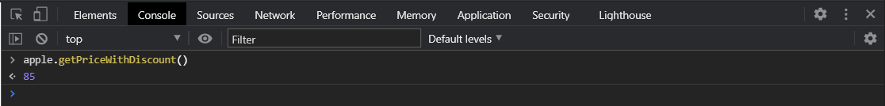

# Прототипы.

**Прототип** - это свойство объектов которое содержит свойства и методы своих родителей и родителей родителей. В свою очередь прототип это объект содержащий все те же свойства и методы. Он есть у любого объекта и если мы например посмотрим на массив то мы увидим его прототип в специальной ссылке **\_\_proto\_\_: Array(0)**.


Эту ссылку и то что в ней находится если мы будем проходить циклом по объекту. Но здеь будут содержаться можно сказать общие свойства и методы для тех экземпляров которые пораждаются от классов или тех объектов которые мы создаем. Например здесь для массива храняться методы массивов. При этом мы видим что внизу у нашего прототипа есть так же ссылка **\_\_proto\_\_** которая ведет на объект т.е. это как раз таки свойство родителей родителей вверх по цепочке. Т.е. у нас есть как бы корневой класс, называется он **Object**, от которого пораждаются любые объекты и соответственно по цепочке вверх мы видим все свойства и методы. В том числе если мы с вами обратимся к нашим экземплярам **apple**


то мы увидим что у него есть так же свойство **\_\_proto\_\_** и в нем будет находиться прототип функции **Product**. И после этого будет идти **\_\_proto\_\_: Object**.

Вы скажете зачем нужен прототип?

Он нужен для того что бы те экземпляры которые пораждаются от определенных классов имели общий доступ к их методам и свойствам. Т.е. сейчас мы например метод **getPriceWithDiscount** храниму внутри каждого из созданных экземпляров. Он есть в samsung он есть в **apple**.

Но мы можем как бы переместить **getPriceWithDiscount** в **\_\_proto\_\_:Object** и таким образом и таким образом не тянуть его внутри каждого экземпляра. не содержать его внутри каждого экземпляра. А иметь к нему доступ через **\_\_proto\_\_:Object**.

Прототип в том числе это специальное совойство которое отслеживается **JS** и при вызове метода из прототипа. Вообще при вызове метода у объекта он будет сначало искаться внутри самого объекта, а после этого будет идти по цепочке прототипов далее и далее в поисках этого метода.

Например мы можем у наших **apple** вызвать такой метод как **hasOwnProperty**. Этот метод пресущ объектам. Мы можем написать.


Возвращается истина потому что это его свойство которое храниться у него внутри объекта. И таким образом этот метод нигде не объявлен в рамках нашей функции конструктор, но он есть в прототипе и **JS** об этом знает и он его находит.

Как записывать в прототип какие-то методы?

Давайте запишем фунцию **getPriceWithDiscount** в прототип. Здесь все очень просто нам достаточно записать **Product.prototype.getPriceWithDiscount =** и сюда перемещаю нашу функцию.

```js
function Product(brand, price, discount) {
  // 1. Создается новый объект
  // 2. На этот объект устанавливается ссылка this
  // 3. Функция возвращает этот объект
  this.brand = brand;
  this.price = price;
  this.discount = discount;
}
Product.prototype.getPriceWithDiscount = function () {
  return (this.price * (100 - this.discount)) / 100;
};
const apple = new Product("Apple", 100, 15);
const samsung = new Product("Samsung", 200, 25);
// console.log(apple, samsung);
```

Теперь давайте посмотрим как будет выглядеть наш объект.


Теперь getPriceWithDiscount находится в прототипе. И если я его вызову то я получу результат.



При этом у **samsung** он так же есть в прототипе


Потому что у них один прототип от которого они были созданы и соответственно у него так же есть этот метод. Мы теперь не держим этот метод внутри самих экземпляров, а непосредственно имеем доступ к ним через их прототип.

При этом внутри прототипа **this** будет всегда указывать на конкретный экземпляр на **samsung** или **apple**.

При этом конечно же мы можем передавать какие-то значения т.е. у нас могут быть методы которые позволяют установливать какие-то значения.

```js
function Product(brand, price, discount) {
  // 1. Создается новый объект
  // 2. На этот объект устанавливается ссылка this
  // 3. Функция возвращает этот объект
  this.brand = brand;
  this.price = price;
  this.discount = discount;
}

Product.prototype.getPriceWithDiscount = function () {
  return (this.price * (100 - this.discount)) / 100;
};

Product.prototype.setPrise = function (newPrise) {
  this.price = newPrise;
};

const apple = new Product("Apple", 100, 15);
const samsung = new Product("Samsung", 200, 25);
// console.log(apple, samsung);
```

И мы можем взять теперь например вызвать **apple.setPrise()** и передать новую цену.


и мы получаем новую цену с учетом скидки.

Таким образом если резюмируя прототип это специальное свойство для любого объекта которое является объектом с набором свойств и методов которые доступны для всех поражденных от этого прототипа, ок этого класса или функкии конструктора экземпляров. И при обращении к такому методу соответственно **JS** ищет этот метод внутри объекта, потом ищет внутри прототипа, по цепочке прототипов.

Таки образом мы не содержим эти методы

```js
Product.prototype.getPriceWithDiscount = function () {
  return (this.price * (100 - this.discount)) / 100;
};

Product.prototype.setPrise = function (newPrise) {
  this.price = newPrise;
};
```

в рамках экземпляров. Мы их содержим в одном месте т.е. если это условно представить себе как хранилище с набором методов. Когда мы вызываем какой-то метод мы идем в это общее хранилище м забираем нужную нам функцию и применяем в рамках объекта. Тоже самое для **DOM** объектов для **XHR** запросов и т.д.

Если мы заглянем в свойство proto к примеру в new **XMLHttpRequest()** то он нам вернет объект с набором свойств и у него будет **\_\_proto: XMLHttpRequest** И здесь находяться свойства и методы которые доступны всем экземплярам которые буди пораждены этой функцией конструктором.


