# Наследование классов

Продолжение знакомства с классами, прототипами и в целом **ООП**. Мы сегодня будем знакомится с такой штукой как наследование.

**Наследование** - это одно из основных частей объектно ориентированного программирования.

Но перед тем как начать знакомство с ним давайте познакомимся с **Object.create**. Ранее мы знакомились с прототипами. Напомню что прототип это объект в котором храняться методы и свойства общедоступные для всех экземпляров поражденных от этого класса функции и т.д.

Что такое **Object.create**? Это специальный метод который позволяет создать новый объект с указанным объектом прототипа и свойствами. Выглядит следующим образом.

Например я создам **const protoForObj = {}** и здесь я создам метод который будет делать **sayHello(){}** и он будет возвращать **return 'Hello world';**

```js
const protoForObj = {
  sayHello() {
    return "Hello World";
  },
};
```

И я теперь могу создать объект **const obj = Object.create()** первым аргументом он принимает прототип т.е. объект который будет прототипом для нового объекта т.е. это **protoForObj**.

```js
const protoForObj = {
  sayHello() {
    return "Hello World";
  },
};

const obj = Object.create(protoForObj);
```

Теперь посмотрим на нашу переменную **obj** в консоли.

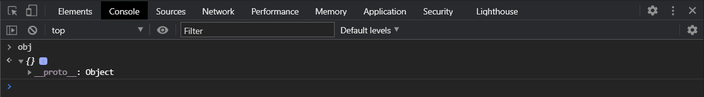

Но если мы откроем его ссылку **\_\_proto\_\_** то мы увидим что здесь есть метод

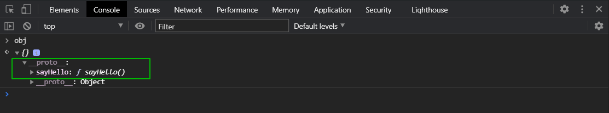

И далеше идет ссылка **\_\_proto\_\_:Object**. Т.е. мы создали пустой объкт для которого прототипом является объект **protoForObj**. И ему доступен этот метод. Если я в консоли вобью **obj.sayHello()**

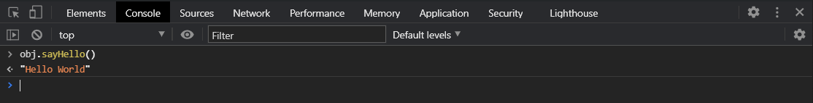

При этом мы можем добавить новое свойство в этот объект в **Object.create()** вторым аргументом передав объект с набором свойств. Однако если мы запишем вот так это будет не правильно.

```js
// Object.create

const protoForObj = {
  sayHello() {
    return "Hello World";
  },
};

const obj = Object.create(protoForObj, {
  firstName: "Konstantine",
});
```

Для того что бы все сработало корректно нужно использовать дескриптор.

```js
// Object.create

const protoForObj = {
  sayHello() {
    return "Hello World";
  },
};

const obj = Object.create(protoForObj, {
  firstName: {
    value: "Konstantine",
  },
});
```

Т.е. мы создаем свойство **firstName**, и мы ему должны передать объект со следующими настройками. Называется это [Property descriptor](https://javascript.info/property-descriptors). Если я сейчас выведу **obj**.

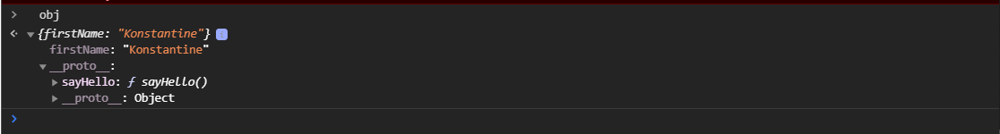

Т.е. **Object.create** создает новый объект с указанным им прототипом.

Как это нам помогает в наследовании?

Теперь поговорим про наследование. Во-первых что такое наследование и зачем оно нам нужно?

Смысл наследования заключается в том что бы взять от какого-нибудь родительского класса все свойства и методы и расширить их т.е. добавить какие-то новые свойства и методы возможно их расширить или переиспользовать. Это нужно для того что бы просто не повторять, не дублировать код и соответственно иметь возможность переиспользовать уже созданный код ранее.

Различают два наследования в **JS** это функциональное наследование и прототипное наследование.

Как это выглядит в нашем случае?

Создаю **function User(firstName, LastName){}**. Это будет сохранять **this.firstName = firstName** и соответственно **this.LastName = LastName**.

```js
function User(firstName, lastName) {
  this.firstName = firstName;
  this.lastName = lastName;
}
```

И так же давайте создадим ему в прототипе метод **User.prototype.getFullName = function(){}** и он будет возвращать **return `${this.firstName} ${this.lastName}`**.

```js
function User(firstName, lastName) {
  this.firstName = firstName;
  this.lastName = lastName;
}

User.prototype.getFullName = function () {
  return `${this.firstName} ${this.firstName}`;
};
```

И давайте сделаем еще

```js
// const str = new String("hello world");
// console.log(str);

function Product(brand, price, discount) {
  // 1. Создается новый объект
  // 2. На этот объект устанавливается ссылка this
  // 3. Функция возвращает этот объект
  this.brand = brand;
  this.price = price;
  this.discount = discount;
}

Product.prototype.getPriceWithDiscount = function () {
  return (this.price * (100 - this.discount)) / 100;
};

Product.prototype.setPrise = function (newPrise) {
  this.price = newPrise;
};

const apple = new Product("Apple", 100, 15);
const samsung = new Product("Samsung", 200, 25);
// console.log(apple, samsung);

// Object.create

const protoForObj = {
  sayHello() {
    return "Hello World";
  },
};

const obj = Object.create(protoForObj, {
  firstName: {
    value: "Konstantine",
  },
});

//

function User(firstName, lastName) {
  this.firstName = firstName;
  this.lastName = lastName;
}

User.prototype.getFullName = function () {
  return `${this.firstName} ${this.lastName}`;
};

User.prototype.sayHello = function () {
  return `Hello ${this.firstName} ${this.lastName}`;
};
```

У нас есть некий класс **User** в котором есть несколько свойств и два метода. И мы теперь хотим унаследоваться от него и создать новый класс, назовем это класс **Custome**, который будет иметь все те же свойства но еще плюс несколько дополнительных свойств. Для того что бы не дублировать т.е. мы берем то что наш **Customer** будет похож, у него будут схожие свойства с нашим User. В нем будет **firstName**, **lastName**. Что бы это не дублировать

```js
User.prototype.getFullName = function () {
  return `${this.firstName} ${this.lastName}`;
};

User.prototype.sayHello = function () {
  return `Hello ${this.firstName} ${this.lastName}`;
};
```

Мы с вами воспользуемся наследованием. Создаю **function Customer(firstName, lastName, membership){}** он так же принимает **firstName, lastName** и еще он будет принимать **membership**. В теле функции первое что нужно сделать для того что бы выполнить функциональное наследование мы должны вызвать внутри функции, внутри класса который хочет унаследоваться от другого т.е. в дочернем классе. Вызвать класс который является родительским **User.call()**. Напоминаю что метод **call** дает возможность вызвать функцию с заданным контекстом. Мы передаем в нее **this** в качестве контекста и так же передаем т.к. функция User принимает **firstName**, **lastName**. Мы передаем интересующие нас аргументы от класса которого наследуемся т.е. **firstName**, **lastName**.

```js
// const str = new String("hello world");
// console.log(str);

function Product(brand, price, discount) {
  // 1. Создается новый объект
  // 2. На этот объект устанавливается ссылка this
  // 3. Функция возвращает этот объект
  this.brand = brand;
  this.price = price;
  this.discount = discount;
}

Product.prototype.getPriceWithDiscount = function () {
  return (this.price * (100 - this.discount)) / 100;
};

Product.prototype.setPrise = function (newPrise) {
  this.price = newPrise;
};

const apple = new Product("Apple", 100, 15);
const samsung = new Product("Samsung", 200, 25);
// console.log(apple, samsung);

// Object.create

const protoForObj = {
  sayHello() {
    return "Hello World";
  },
};

const obj = Object.create(protoForObj, {
  firstName: {
    value: "Konstantine",
  },
});

//

function User(firstName, lastName) {
  this.firstName = firstName;
  this.lastName = lastName;
}

User.prototype.getFullName = function () {
  return `${this.firstName} ${this.lastName}`;
};

User.prototype.sayHello = function () {
  return `Hello ${this.firstName} ${this.lastName}`;
};

// Customer
function Customer(firstName, lastName, membership) {
  User.call(this, firstName, lastName);
}
```

как выпомните внутри функции конструктор **this** указывает на объект созданный внутри этой функции конструктора.

Сначало создадим **const user = new User("Konstantine", "Atroshchenko")** и проверяем что у него работают его методы.

```js
// const str = new String("hello world");
// console.log(str);

function Product(brand, price, discount) {
  // 1. Создается новый объект
  // 2. На этот объект устанавливается ссылка this
  // 3. Функция возвращает этот объект
  this.brand = brand;
  this.price = price;
  this.discount = discount;
}

Product.prototype.getPriceWithDiscount = function () {
  return (this.price * (100 - this.discount)) / 100;
};

Product.prototype.setPrise = function (newPrise) {
  this.price = newPrise;
};

const apple = new Product("Apple", 100, 15);
const samsung = new Product("Samsung", 200, 25);
// console.log(apple, samsung);

// Object.create

const protoForObj = {
  sayHello() {
    return "Hello World";
  },
};

const obj = Object.create(protoForObj, {
  firstName: {
    value: "Konstantine",
  },
});

//

function User(firstName, lastName) {
  this.firstName = firstName;
  this.lastName = lastName;
}

User.prototype.getFullName = function () {
  return `${this.firstName} ${this.lastName}`;
};

User.prototype.sayHello = function () {
  return `Hello ${this.firstName} ${this.lastName}`;
};

const user = new User("Konstantine", "Atroshchenko");

// Customer
function Customer(firstName, lastName, membership) {
  User.call(this, firstName, lastName);
}
```

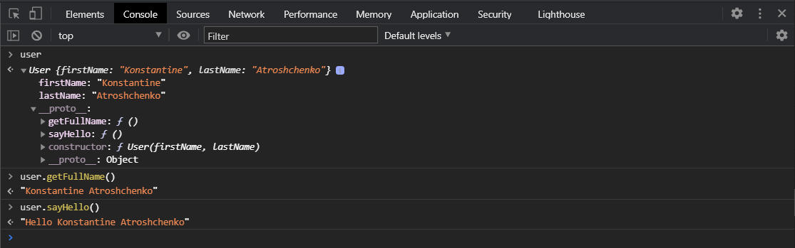

Теперь создадим **const customer = new Customer("Ekaterina", "Zaharova", "basic")**.

```js
// const str = new String("hello world");
// console.log(str);

function Product(brand, price, discount) {
  // 1. Создается новый объект
  // 2. На этот объект устанавливается ссылка this
  // 3. Функция возвращает этот объект
  this.brand = brand;
  this.price = price;
  this.discount = discount;
}

Product.prototype.getPriceWithDiscount = function () {
  return (this.price * (100 - this.discount)) / 100;
};

Product.prototype.setPrise = function (newPrise) {
  this.price = newPrise;
};

const apple = new Product("Apple", 100, 15);
const samsung = new Product("Samsung", 200, 25);
// console.log(apple, samsung);

// Object.create

const protoForObj = {
  sayHello() {
    return "Hello World";
  },
};

const obj = Object.create(protoForObj, {
  firstName: {
    value: "Konstantine",
  },
});

//

function User(firstName, lastName) {
  this.firstName = firstName;
  this.lastName = lastName;
}

User.prototype.getFullName = function () {
  return `${this.firstName} ${this.lastName}`;
};

User.prototype.sayHello = function () {
  return `Hello ${this.firstName} ${this.lastName}`;
};

const user = new User("Konstantine", "Atroshchenko");

// Customer
function Customer(firstName, lastName, membership) {
  User.call(this, firstName, lastName);
}

const customer = new Customer("Ekaterina", "Zaharova", "basic");
```

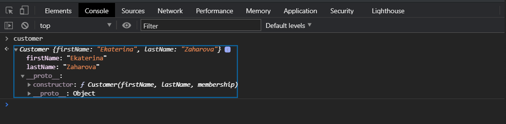

И как видите я не создаю здесь полей **firstName**, **lastName**. Потому что вызвав функцию **User** в контексте текущеко класса **Customer** у нас создались эти свойства

```js
this.firstName = firstName;
this.lastName = lastName;
```

и присвоились эти значения **User.call(this, firstName, lastName);**

Если у нас параметров много мы можем использовать вместо **call** метод **apply** и вторым параметром передать массив **arguments**.

```js
// const str = new String("hello world");
// console.log(str);

function Product(brand, price, discount) {
  // 1. Создается новый объект
  // 2. На этот объект устанавливается ссылка this
  // 3. Функция возвращает этот объект
  this.brand = brand;
  this.price = price;
  this.discount = discount;
}

Product.prototype.getPriceWithDiscount = function () {
  return (this.price * (100 - this.discount)) / 100;
};

Product.prototype.setPrise = function (newPrise) {
  this.price = newPrise;
};

const apple = new Product("Apple", 100, 15);
const samsung = new Product("Samsung", 200, 25);
// console.log(apple, samsung);

// Object.create

const protoForObj = {
  sayHello() {
    return "Hello World";
  },
};

const obj = Object.create(protoForObj, {
  firstName: {
    value: "Konstantine",
  },
});

//

function User(firstName, lastName) {
  this.firstName = firstName;
  this.lastName = lastName;
}

User.prototype.getFullName = function () {
  return `${this.firstName} ${this.lastName}`;
};

User.prototype.sayHello = function () {
  return `Hello ${this.firstName} ${this.lastName}`;
};

const user = new User("Konstantine", "Atroshchenko");

// Customer
function Customer(firstName, lastName, membership) {
  User.apply(this, arguments);
}

const customer = new Customer("Ekaterina", "Zaharova", "basic");
```

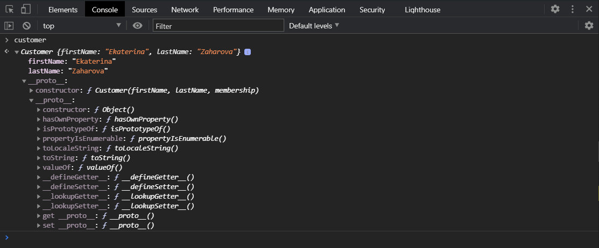

И я получаю тот же самый результат.

Но что будет если я захочу вызвать **customer.sayHello()**

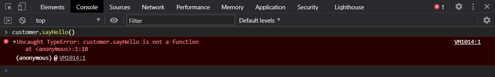

Если я посмотрю в прототип, то там просто нет этого метода который я вызываю.

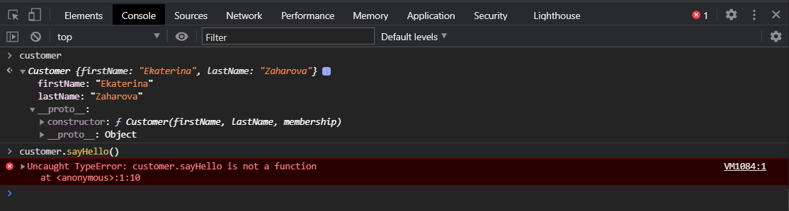

И соответственно у меня нет что вызывать т.е. **JS** пройдется по всей цепочке прототипов ища этот метод, не найдет этот метод и вернет нам ошибку.

Если бы метод **sayHello** был внутри самого класса **User**.

```js
// const str = new String("hello world");
// console.log(str);

function Product(brand, price, discount) {
  // 1. Создается новый объект
  // 2. На этот объект устанавливается ссылка this
  // 3. Функция возвращает этот объект
  this.brand = brand;
  this.price = price;
  this.discount = discount;
}

Product.prototype.getPriceWithDiscount = function () {
  return (this.price * (100 - this.discount)) / 100;
};

Product.prototype.setPrise = function (newPrise) {
  this.price = newPrise;
};

const apple = new Product("Apple", 100, 15);
const samsung = new Product("Samsung", 200, 25);
// console.log(apple, samsung);

// Object.create

const protoForObj = {
  sayHello() {
    return "Hello World";
  },
};

const obj = Object.create(protoForObj, {
  firstName: {
    value: "Konstantine",
  },
});

//

function User(firstName, lastName) {
  this.firstName = firstName;
  this.lastName = lastName;
  this.sayHello = function () {
    return `Hello ${this.firstName} ${this.lastName}`;
  };
}

User.prototype.getFullName = function () {
  return `${this.firstName} ${this.lastName}`;
};

User.prototype.sayHello = function () {
  return `Hello ${this.firstName} ${this.lastName}`;
};

const user = new User("Konstantine", "Atroshchenko");

// Customer
function Customer(firstName, lastName, membership) {
  User.apply(this, arguments);
}

const customer = new Customer("Ekaterina", "Zaharova", "basic");
```

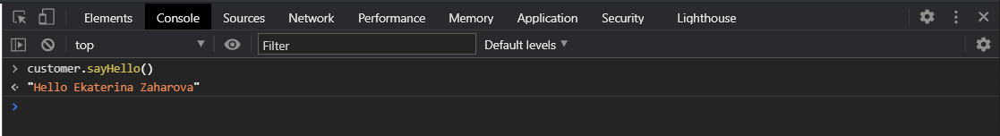

То **customer.sayHello** отработает нормально. Потому что при функциональном наследовании этот метод в том числе попал бы внутрь класса **customer** т.е. прототип таким способом не унаследовался и мы его не получили для класса **customer**

Теперь нам нужно унаследовать прототип т.е. нам нужно сделать прототипное наследование. И забрать прототип **User** в прототип **Customer**. Для того что бы это сделать мы должны после объявления класса **Customer** сделать следующее. **Customer.prototype =** и воспользоваться функцией **Object.create()** которая как вы помните создает новый объект с указанным прототипом. И сюда в **Object.create()** мы передаем прототип **Object.create(User.prototype);**

```js
// const str = new String("hello world");
// console.log(str);

function Product(brand, price, discount) {
  // 1. Создается новый объект
  // 2. На этот объект устанавливается ссылка this
  // 3. Функция возвращает этот объект
  this.brand = brand;
  this.price = price;
  this.discount = discount;
}

Product.prototype.getPriceWithDiscount = function () {
  return (this.price * (100 - this.discount)) / 100;
};

Product.prototype.setPrise = function (newPrise) {
  this.price = newPrise;
};

const apple = new Product("Apple", 100, 15);
const samsung = new Product("Samsung", 200, 25);
// console.log(apple, samsung);

// Object.create

const protoForObj = {
  sayHello() {
    return "Hello World";
  },
};

const obj = Object.create(protoForObj, {
  firstName: {
    value: "Konstantine",
  },
});

//

function User(firstName, lastName) {
  this.firstName = firstName;
  this.lastName = lastName;
}

User.prototype.getFullName = function () {
  return `${this.firstName} ${this.lastName}`;
};

User.prototype.sayHello = function () {
  return `Hello ${this.firstName} ${this.lastName}`;
};

const user = new User("Konstantine", "Atroshchenko");

// Customer
function Customer(firstName, lastName, membership) {
  User.apply(this, arguments);
}

Customer.prototype = Object.create(User.prototype);

const customer = new Customer("Ekaterina", "Zaharova", "basic");
```

Теперь если мы с вами посмотрим на Customer то мы с вами увидим **FirstName** и **LastName** и в **\_\_proto\_\_: User**, **\_\_proto\_\_: Object** мы увидим что появился **getFullName** и **sayHello**.

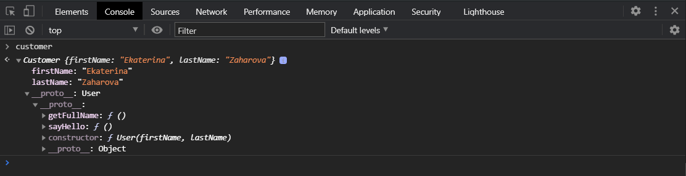

Мы увидим что мы перезаписали прототип. Это выглядит немного странно **\_\_proto\_\_: User**, **\_\_proto\_\_: Object** это потому что мы сюда записали свой прототип **User**. Т.е. сейчас это будет работать. Но мы потеряли одну штуку. Это конструктор который был в **User**. Т.е. если я закоментирую **// Customer.prototype = Object.create(User.prototype);** и вызову **customer** то я увижу что в прототипе есть свойство конструктора.

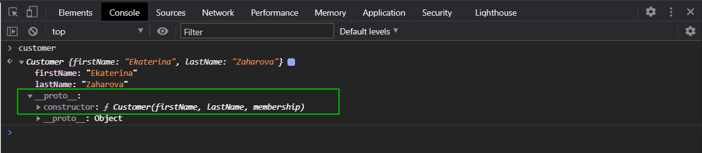

Это свойство содержит ссылку на саму функцию **Customer**. И при прототипном наследовании нам нужно ее вернуть для того что бы в будущем небыло никаких проблем. Поэтому мы делаем **Customer.prototype.constructor = Customer**.

```js
// const str = new String("hello world");
// console.log(str);

function Product(brand, price, discount) {
  // 1. Создается новый объект
  // 2. На этот объект устанавливается ссылка this
  // 3. Функция возвращает этот объект
  this.brand = brand;
  this.price = price;
  this.discount = discount;
}

Product.prototype.getPriceWithDiscount = function () {
  return (this.price * (100 - this.discount)) / 100;
};

Product.prototype.setPrise = function (newPrise) {
  this.price = newPrise;
};

const apple = new Product("Apple", 100, 15);
const samsung = new Product("Samsung", 200, 25);
// console.log(apple, samsung);

// Object.create

const protoForObj = {
  sayHello() {
    return "Hello World";
  },
};

const obj = Object.create(protoForObj, {
  firstName: {
    value: "Konstantine",
  },
});

//

function User(firstName, lastName) {
  this.firstName = firstName;
  this.lastName = lastName;
}

User.prototype.getFullName = function () {
  return `${this.firstName} ${this.lastName}`;
};

User.prototype.sayHello = function () {
  return `Hello ${this.firstName} ${this.lastName}`;
};

const user = new User("Konstantine", "Atroshchenko");

// Customer
function Customer(firstName, lastName, membership) {
  User.apply(this, arguments);
}

Customer.prototype = Object.create(User.prototype);
Customer.prototype.constructor = Customer;

const customer = new Customer("Ekaterina", "Zaharova", "basic");
```

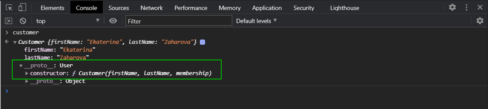

И мы видим что здесь теперь есть **constructor** который указывает на функцию **Customer** А в ее прототипе уже содержится **getFullName** и **sayHello**.

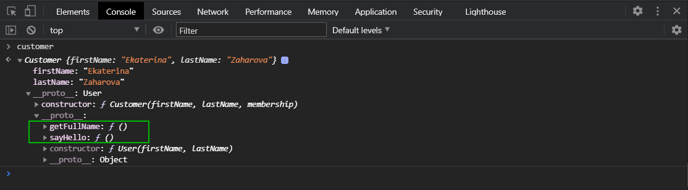

При этом мы можем определить свои какие-то методы в прототипе. Но обязательно мы их определяем после вот этих двух строчек.

```js
Customer.prototype = Object.create(User.prototype);
Customer.prototype.constructor = Customer;
```

Потому что вот эта строка конкретно

```js
Customer.prototype = Object.create(User.prototype);
```

Перезапишет прототип.

Если мы объявим до этой строки то мы в итоге все сотрем. Поэтому мы теперь можем писать **Customer.prototype.getMemberShip = function(){}** которая будет возвращать **return this.membership.toUpperCase()**.

```js
// const str = new String("hello world");
// console.log(str);

function Product(brand, price, discount) {
  // 1. Создается новый объект
  // 2. На этот объект устанавливается ссылка this
  // 3. Функция возвращает этот объект
  this.brand = brand;
  this.price = price;
  this.discount = discount;
}

Product.prototype.getPriceWithDiscount = function () {
  return (this.price * (100 - this.discount)) / 100;
};

Product.prototype.setPrise = function (newPrise) {
  this.price = newPrise;
};

const apple = new Product("Apple", 100, 15);
const samsung = new Product("Samsung", 200, 25);
// console.log(apple, samsung);

// Object.create

const protoForObj = {
  sayHello() {
    return "Hello World";
  },
};

const obj = Object.create(protoForObj, {
  firstName: {
    value: "Konstantine",
  },
});

//

function User(firstName, lastName) {
  this.firstName = firstName;
  this.lastName = lastName;
}

User.prototype.getFullName = function () {
  return `${this.firstName} ${this.lastName}`;
};

User.prototype.sayHello = function () {
  return `Hello ${this.firstName} ${this.lastName}`;
};

const user = new User("Konstantine", "Atroshchenko");

// Customer
function Customer(firstName, lastName, membership) {
  User.apply(this, arguments);
}

Customer.prototype = Object.create(User.prototype);
Customer.prototype.constructor = Customer;

Customer.prototype.getMemberShip = function () {
  return this.membership.toUpperCase();
};

const customer = new Customer("Ekaterina", "Zaharova", "basic");
```

Однако этот код не сработает так как мы не куда не сохранили **membership**. Потому что мы его вот здесь получили **function Customer(firstName, lastName, membership)** но не сохранили. В нашем классе **Customer** после вот этой части **User.apply(this, arguments);** этого функционального наследования. Мы делаем **this.membership = membership**.

```js
// const str = new String("hello world");
// console.log(str);

function Product(brand, price, discount) {
  // 1. Создается новый объект
  // 2. На этот объект устанавливается ссылка this
  // 3. Функция возвращает этот объект
  this.brand = brand;
  this.price = price;
  this.discount = discount;
}

Product.prototype.getPriceWithDiscount = function () {
  return (this.price * (100 - this.discount)) / 100;
};

Product.prototype.setPrise = function (newPrise) {
  this.price = newPrise;
};

const apple = new Product("Apple", 100, 15);
const samsung = new Product("Samsung", 200, 25);
// console.log(apple, samsung);

// Object.create

const protoForObj = {
  sayHello() {
    return "Hello World";
  },
};

const obj = Object.create(protoForObj, {
  firstName: {
    value: "Konstantine",
  },
});

//

function User(firstName, lastName) {
  this.firstName = firstName;
  this.lastName = lastName;
}

User.prototype.getFullName = function () {
  return `${this.firstName} ${this.lastName}`;
};

User.prototype.sayHello = function () {
  return `Hello ${this.firstName} ${this.lastName}`;
};

const user = new User("Konstantine", "Atroshchenko");

// Customer
function Customer(firstName, lastName, membership) {
  User.apply(this, arguments);
  this.membership = membership;
}

Customer.prototype = Object.create(User.prototype);
Customer.prototype.constructor = Customer;

Customer.prototype.getMemberShip = function () {
  return this.membership.toUpperCase();
};

const customer = new Customer("Ekaterina", "Zaharova", "basic");
```

И теперь будет все работать.

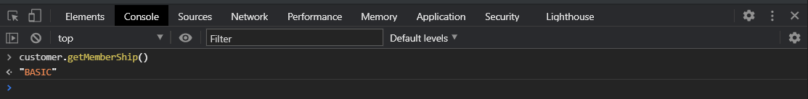


И так резюмируя. Наследование нужно для того что бы переиспользоватьсвойсва и методы другого класса схожего по логике и по функционалу, имеют какие-то общие свойства. Понятно что если у вас общих свойств нет товам не нужно наследоваться. Вы наследуетесь когда у вас есть схожая сужность, но отличающаяся т.е. ей нужны все те же свойства и методы которые есть у родителя, но и соответственно какие-то свои. Для того что бы не дулировать код вы можете унаследоваться. И в наследовании есть два этапа. 

1. **Функциональное наследование**. Когда мы внутри дочерней функции, дочернего класса вызываем родительский класс с использоватнием методов **call** иди **apply** передавая в качестве контекста вызова **this** т.е. текущие внутри данного класса контекст. Дальше мы можем наполнять какими-то свойствами данный класс и вы получите вот этой записью **User.apply(this, arguments);** все свойства и методы которые были объявлены внутри класса родителя. В данном случае **function User**.
2. После этого для того что бы сделать прототипное наследование вы обращаетесь к классу дочернему Customer к его prototype и записываете туда при помощи Object.create(User.prototype) прототип своего родителя от которого вы хотите унаследовать свойства и методы. Соответственно Object.create вернет новый объект с привязанным прототипом который был передан в аргумент Object.create. Далее так как мы перезаписали прототип мы теряем ссылку  на саму функцию, в данном случае Customer, поэтому нам ее нужно вернуть Customer.prototype.constructor = Customer; После этого мы можем создавать собственные методы в прототипе нашего дочернего класса и использовать методы которые были объявлены в родителе. Таким образом осуществляется наследование. 

Позже мы познакомимся как это устроено в ES6. Для тех кто изучал другие языки это выглядит немного странно потому что JS отличается своим наследованием. Но в ES6 у нас появились специальные конструкции которые выгляядят практически так же как в других языках соответственно позволяющие нам создавать классы и это будет выглядеть гораздо красивее. Но мы должны были знать то как это устроено здесь в ES5.