# Классы ES6

<br>
<br>

[https://docs.google.com/presentation/d/1MY0RBMHO9uoeeoMtG40NiyZFKCHQuF8BXuh25ygXJIs/edit?usp=sharing](https://docs.google.com/presentation/d/1MY0RBMHO9uoeeoMtG40NiyZFKCHQuF8BXuh25ygXJIs/edit?usp=sharing)

<br>
<br>

Теперь мы можем познакомится с новым стандартом объявления классов в **ES6**. У нас был класс **Product**. Создадим его аналог. Теперь для создания класса у нас есть специальное ключевое слово **class**.

```js
class ProductES {
  constructor() {}
}
```

Внутри тела класса мы можем объявлять методы. Если наш класс будет принимать какие-то аргументы, то ему нужен специальный метод **constructor(){}**. Этот метод не обязательно объявлять если наш класс не будет при вызове принимать каких-то аргументов. При этом это обычный метод. Это формат объявления как мы его уже объявляли в объектах. И он может принимать те аргументы которые будут переданы при инициализации класса.

```js
class ProductES {
  constructor(brand, price, discount) {}
}
```

Внутри конструктора мы можем через **this** задать все эти свойства.

```js
class ProductES {
  constructor(brand, price, discount) {
    this.brand = brand;
    this.price = price;
    this.discount = discount;
  }
}
```

Т.е. внутри метода **constructor** мы можем как раз таки объявить все наши свойства которые будут доступны внутри нашего класса. При этом здесь не желательно содержать какую-то логику внутри конструктора. Обычно здесь происходит лишь объявление каких-то свойств на основе тех параметров которые примет этот класс.

При этом важно мы вне метода **constructor**,внутри класса, я не могу объявлять какие-то переменные или свойства т.е. я это могу сделать либо в **constructor**, либо внутри других методов.

создаю переменную **const newProduct =** класс в **ES6** вызывается так же с оператором **new ProductES("Samsung", 200, 10)**.

```js
class ProductES {
  constructor(brand, price, discount) {
    this.brand = brand;
    this.price = price;
    this.discount = discount;
  }
}

const newProduct = new ProductES("Samsung", 200, 10);
```

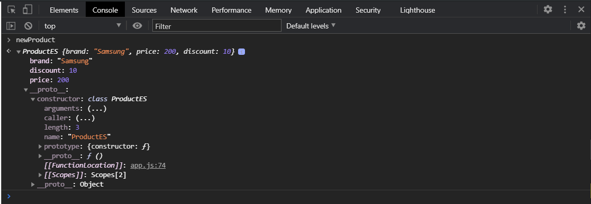

Фактически он нам создал все тоже самое. Метод **constructor** вызывается автоматически при вызове класса new **ProductES("Samsung", 200, 10);** и соответственно записывает все наши свойства внутрь создаваемого объекта через **this**. У него в прототипе уже указан **class productES**.

**Что очень важно!!!** В отличие от функций **ES5** и классов в ES5 мы не можем вызвать class **ES6** без оператора **new**.

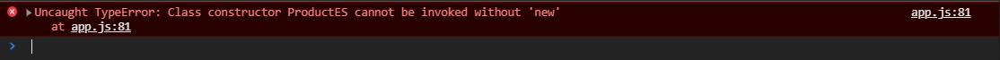

При этом у нас здесь есть явная отсылка к тому что это **classes** в отличие от **ES5** потому что в **ES5** разделение от функций конструкторов на классы лишь абстрактное, в рамках понятий что есть функции конструкторы и есть в целом классы, но по синтаксису и структуре это одно и тоже.

Здесь же у нас уже есть четкое разделение что у нас есть **class** и это именно **class**. Хотя под капотом у нас фактически происходит тоже самое.

Если мы хотим объявить какие-то методы. У нас был метод **getPriceWithDiscount**. Мы можем сделать так.

```js
class ProductES {
  constructor(brand, price, discount) {
    this.brand = brand;
    this.price = price;
    this.discount = discount;
  }
  getPriceWithDiscount() {
    return (this.price * (100 - this.discount)) / 100;
  }
}

const newProduct = new ProductES("Samsung", 200, 10);
```

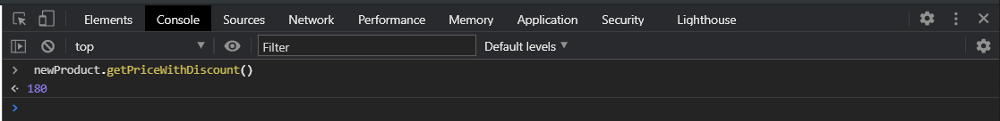

И я получаю стоимость с учетом скидки. Т.е. методы объявляются друг за другом вот в таком новом синтаксисе как и в объекте мы это могли делать когда в общем то проходили создание методов.

Реализую **setPrice**.

```js
class ProductES {
  constructor(brand, price, discount) {
    this.brand = brand;
    this.price = price;
    this.discount = discount;
  }
  getPriceWithDiscount() {
    return (this.price * (100 - this.discount)) / 100;
  }

  setPrice(newPrice) {
    this.price = newPrice;
  }
}

const newProduct = new ProductES("Samsung", 200, 10);
```

<br>
<br>
<br>

Как мы можем создавать методы внутри класса?

При этом если мы посмотрим в наш **newProduct** то эти методы сразу же запишутся в прототип.

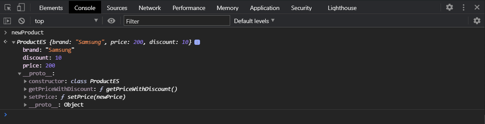

т.е. мы их не пишем как в **ES5** **prototype** и т.д, они автоматически попадают в прототип. Что выглядит гораздо симпатичнее и более читабельнее и т.д.

Так же классы **ES6** дают возможность создавать так называемые статические методы. Статические методы это те методы которые могут вызыватьсяотдельно от [истанциации](http://wikiredia.ru/wiki/%D0%98%D0%BD%D1%81%D1%82%D0%B0%D0%BD%D1%86%D0%B8%D1%80%D0%BE%D0%B2%D0%B0%D0%BD%D0%B8%D0%B5) т.е. отдельно от экземпляра класса, без его создания. Они не имеют доступа к **this**.

Для их создания я пишу ключевое слово **static** и дальше мы можем например создать какой-нибудь абстрактный метод создать наприер **plus (x,y){}** который будет возвращать **return x + y**.

```js
class ProductES {
  constructor(brand, price, discount) {
    this.brand = brand;
    this.price = price;
    this.discount = discount;
  }
  getPriceWithDiscount() {
    return (this.price * (100 - this.discount)) / 100;
  }

  setPrice(newPrice) {
    this.price = newPrice;
  }

  static plus(x, y) {
    return x + y;
  }
}

const newProduct = new ProductES("Samsung", 200, 10);
```

Этот метод мы не можем вызвать в экземпляре класса.

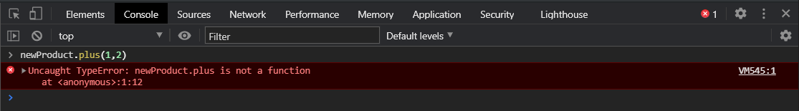

Если мы посмотрим в **newProduct**, то мы не увидим этого метода в прототипе.

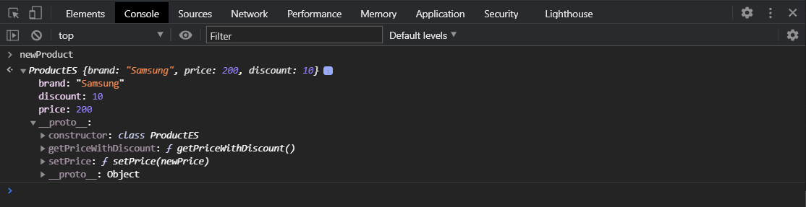

Но мы его можем увидеть если расскроем конструктор

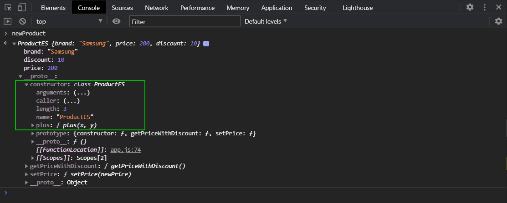

И он может быть вызван без [истанциации](http://wikiredia.ru/wiki/%D0%98%D0%BD%D1%81%D1%82%D0%B0%D0%BD%D1%86%D0%B8%D1%80%D0%BE%D0%B2%D0%B0%D0%BD%D0%B8%D0%B5) класса. Я могу например

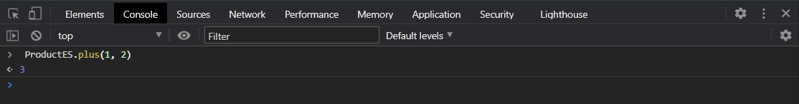

Например в **JS** есть класс **Date** который дает возможность работать с датой. Знакомтесь с ним самостоятельно. Это специальная функция конструктор которая позволяет нам работать с датой. В нем существует много методов для получения там года месяца, для естановки даты и т.д. Но тем не менее внем есть пример статический метод называется он **now**.

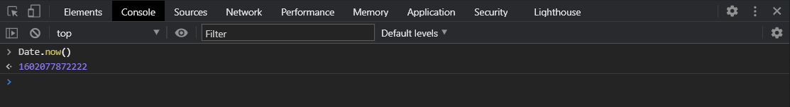

Он возвращает так называемый **times** temp момент времени. Если очень вкраце это число в милисекундах сколко прошло от **1970г**. В данном случае метод now пример статического метода который всегда возвращает нам момет времени при вызове, но при этом я не могу его вызвать на инстансе класса т.е. если я создам.

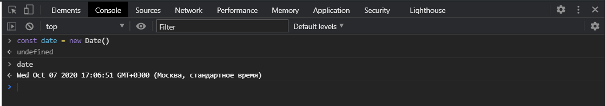

Это мне вернет текущую дату. При этом здесь есть довольно большое количество методов для работы с датой.

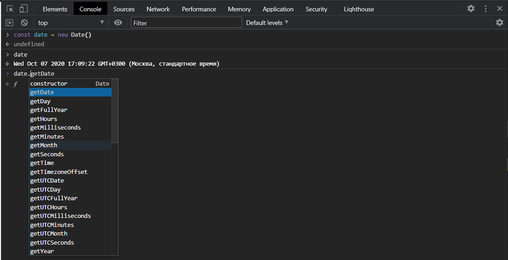

Но я не могу на нем вызвать метод now это мне вернет ошибку.

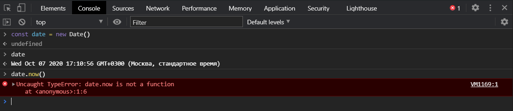

Потому что он находится непосредственно в самой функции сонкструктор **new Date()**, он находится там как статический метод.

Как понять когда вам нужен статический метод?

Все очень просто если ваш метод не требует обращения к **this** к самому классу, к самому объекту который поражден от этого класса, то это вполне возможно статический метод.

Так же мы можем делать вычисляемые свойства в классах, как и в объектах не только как в классах. Я могу создавать например вместо **setPrice** я могу создать вот такую штуку.

```js
class ProductES {
  constructor(brand, price, discount) {
    this.brand = brand;
    this.price = price;
    this.discount = discount;
  }
  getPriceWithDiscount() {
    return (this.price * (100 - this.discount)) / 100;
  }

  ["setPrise"](newPrice) {
    this.price = newPrice;
  }

  static plus(x, y) {
    return x + y;
  }
}

const newProduct = new ProductES("Samsung", 200, 10);
```

В моем **newProduct** будет этот метод.

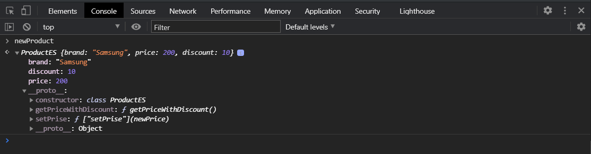

И я его все так же смогу вызвать, но этот синтаксис позволяет скажем так генерировать нам название для метода. В будущем вы узнаете особенно если обратитесь ко **View** или еще к каким-нибуть **frameworks** то там это так же используется в некоторых ситуациях, но тем не менее этот **["setPrise"]** может хранится в переменной. Т.е. я могу создать где-нибудь вне класса переменную.

```js
const methodName = "setPrise";

class ProductES {
  constructor(brand, price, discount) {
    this.brand = brand;
    this.price = price;
    this.discount = discount;
  }
  getPriceWithDiscount() {
    return (this.price * (100 - this.discount)) / 100;
  }

  [methodName](newPrice) {
    this.price = newPrice;
  }

  static plus(x, y) {
    return x + y;
  }
}

const newProduct = new ProductES("Samsung", 200, 10);
```

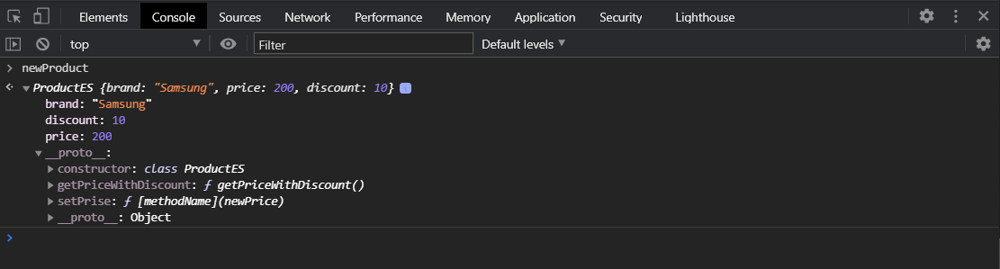

Если я его поменяю.

```js
const methodName = "setNewPrise";

class ProductES {
  constructor(brand, price, discount) {
    this.brand = brand;
    this.price = price;
    this.discount = discount;
  }
  getPriceWithDiscount() {
    return (this.price * (100 - this.discount)) / 100;
  }

  [methodName](newPrice) {
    this.price = newPrice;
  }

  static plus(x, y) {
    return x + y;
  }
}

const newProduct = new ProductES("Samsung", 200, 10);
```

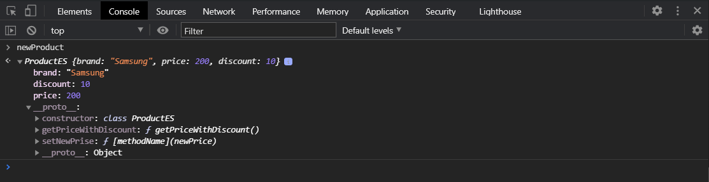

При это эта конструкция с вычисляемыми свойствами дает возможность например сокрыть некоторые методы при помощи использования **symbol**. Если вам интересно вы можете почитать про сокрытие методов или свойств при помощи **symbol** и вычисляемых свойств.

В том числе когда мы с вами проходили **Object.descriptor** для классов как и для объектов существуют **getter** и **setter**. Т.е. мы можем создать **get brand(){}** и мы будем возвращать **return this.\_brand**

```js
const methodName = "setNewPrise";

class ProductES {
  constructor(brand, price, discount) {
    this._brand = brand;
    this.price = price;
    this.discount = discount;
  }

  get brand() {
    return this._brand;
  }

  getPriceWithDiscount() {
    return (this.price * (100 - this.discount)) / 100;
  }

  [methodName](newPrice) {
    this.price = newPrice;
  }

  static plus(x, y) {
    return x + y;
  }
}

const newProduct = new ProductES("Samsung", 200, 10);
```

Напомню что **getter** и **setter** это специальные функции которые вкдут себя как методы. Соответственно они позволяют сокрыть некую логику взаимодействия с вашими свойствами в объекте.

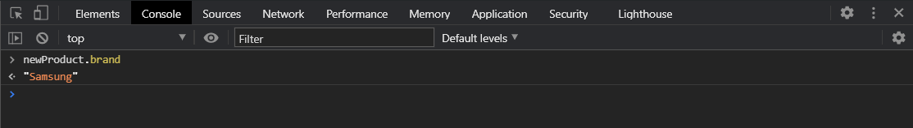

И если я сделаю **set brand(name){this.\_brand = name}**

```js
const methodName = "setNewPrise";

class ProductES {
  constructor(brand, price, discount) {
    this._brand = brand;
    this.price = price;
    this.discount = discount;
  }

  get brand() {
    return this._brand;
  }

  set brand(name) {
    this._brand = name;
  }

  getPriceWithDiscount() {
    return (this.price * (100 - this.discount)) / 100;
  }

  [methodName](newPrice) {
    this.price = newPrice;
  }

  static plus(x, y) {
    return x + y;
  }
}

const newProduct = new ProductES("Samsung", 200, 10);
```
Здесь может быть какая-то логика проверки не дающая просто так установить или считать свойства из нашего объекта.

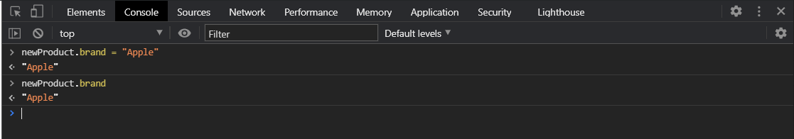

Резюмируя. Классы **ES6** позволяют по новому в плане синтаксиса и конструкции создавать классы. Теперь для этого используется ключевое слово **class**, далее мы указываем имя класса и открываем фигурные скобки. Внутри мы объявляем набор методов для работы с этим классом. Если у нас есть какие-то входные параметры которые будут переданы при вызове этого класса мы должны объявить функцию **constructor**, она будет вызвана автоматически при создании класса и она примет те параметры которые мы ей будем передавать. И в теле конструктора мы инициализируем какие-то свойства для нашего класса. Далее для того что бы создать методы мы используем такие методы как и в объектах. Мы можем создавать статические методы которые будут доступны толко на самом классе new **ProductES**, но не на его инстансе **newProduct**. Мы можем созавать вычисляемые методы. И мы можем использовать **setter** и **getter**.
