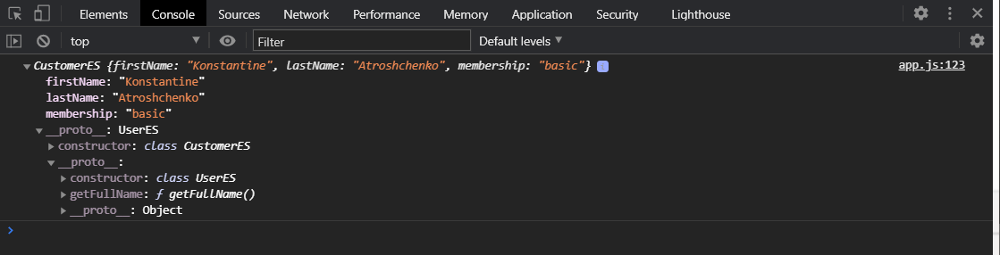

# Наследование ES6

Здесь на самом деле все очень просто. Как вы помните в **ES5** нам нужно было выполнять несколько действий. Пример кода из **ES5**.

```js
// const str = new String("hello world");
// console.log(str);

function Product(brand, price, discount) {
  // 1. Создается новый объект
  // 2. На этот объект устанавливается ссылка this
  // 3. Функция возвращает этот объект
  this.brand = brand;
  this.price = price;
  this.discount = discount;
}

Product.prototype.getPriceWithDiscount = function () {
  return (this.price * (100 - this.discount)) / 100;
};

Product.prototype.setPrise = function (newPrise) {
  this.price = newPrise;
};

const apple = new Product("Apple", 100, 15);
const samsung = new Product("Samsung", 200, 25);
// console.log(apple, samsung);

// Object.create

const protoForObj = {
  sayHello() {
    return "Hello World";
  },
};

const obj = Object.create(protoForObj, {
  firstName: {
    value: "Konstantine",
  },
});

//

function User(firstName, lastName) {
  this.firstName = firstName;
  this.lastName = lastName;
}

User.prototype.getFullName = function () {
  return `${this.firstName} ${this.lastName}`;
};

User.prototype.sayHello = function () {
  return `Hello ${this.firstName} ${this.lastName}`;
};

const user = new User("Konstantine", "Atroshchenko");

// Customer
function Customer(firstName, lastName, membership) {
  User.apply(this, arguments);
  this.membership = membership;
}

Customer.prototype = Object.create(User.prototype);
Customer.prototype.constructor = Customer;

Customer.prototype.getMemberShip = function () {
  return this.membership.toUpperCase();
};

const customer = new Customer("Ekaterina", "Zaharova", "basic");
```

<br>
<br>
<br>

В **ES6** мы познакомились как создавать классы. Теперь посмотрим как наследоваться.

Создаю еще раз класс **User**.

```js
class UserES {
  constructor(firstName, lastName) {
    this.firstName = firstName;
    this.lastName = lastName;
  }
  getFullName() {
    return `${this.firstName} ${this.lastName}`;
  }
}
```

Создал класс **UserES** c аргументами **firstName**, **lastName** и методом **getFullName**.

Теперь я хочу создать **Customer** на основе класса **User**. Дя этого я делаю следующие действия пишу **class CustomerES** и для того что бы унаследоваться я должени написать **extends** и указать от какого класса я наследуюсь **UserES{}**. Далее для того что бы произвести непосредственно наследование и получить свойства и методы которые были в родительском классе мне нужно во-первых, в конструкторе принимать параметры которые я хочу унаследовать от родительского класса **constructor(firstName, lastName,membership){}** и так же в **Customer** у меня было **membership**. Теперь для того что бы унаследовать свойства и методы родительского класса мне внутри конструктора нужно вызвать ключевое слово **super()** и передать те аргументы которые принимает **UserES** т.е. **firstName**, **lastName**. После этого я могу определять уже свои свойства для дочернего класса **this.membership = membership**. И после чего делаю инстанс класса **const customerEs = new CustomerES("Konstantine", "Atroshchenko", "basic")**.

```js
const newProduct = new ProductES("Samsung", 200, 10);

class UserES {
  constructor(firstName, lastName) {
    this.firstName = firstName;
    this.lastName = lastName;
  }
  getFullName() {
    return `${this.firstName} ${this.lastName}`;
  }
}

class CustomerES extends UserES {
  constructor(firstName, lastName, membership) {
    super(firstName, lastName);
    this.membership = membership;
  }
}

const customerEs = new CustomerES("Konstantine", "Atroshchenko", "basic");
console.log(customerEs);
```



И вот у меня вываливается в консоли мой экземпляр класса **CustomerES** у него есть **firstName: "Konstantine"**, **lastName: "Atroshchenko"** есть **membership: "basic"**. Прототипом записан **\_\_proto\_\_: UserES**. При этом здесь уже есть **constructor: class CustomerES** т.е. нам ничего возвращать не нужно. И нам доступен **UserES** и его **getFullName** метод.


Т.е. наследование существенно проще и более читабельно т.е. мы сразу видим какой класс от какого наследуется **class CustomerES extends UserES**. Внутри конструктора нужно вызвать **super** при этом мы можем через этот super вызывать методы родительского класса. Например мы можем сделать свой **getFullName (){}**.

```js
class UserES {
  constructor(firstName, lastName) {
    this.firstName = firstName;
    this.lastName = lastName;
  }
  getFullName() {
    return `${this.firstName} ${this.lastName}`;
  }
}

class CustomerES extends UserES {
  constructor(firstName, lastName, membership) {
    super(firstName, lastName);
    this.membership = membership;
  }
  getFullName() {
    console.log("new get full name method");
  }
}

const customerEs = new CustomerES("Konstantine", "Atroshchenko", "basic");
console.log(customerEs);
```

И если мы теперь попробуем вызвать его.


Если мы объявили такой же метод какой есть в родителе, то конечно будет отрабатывать метод родителя. Потому что когда вызываем метод **JS** ищет этот метод, находит его у родителя и не важно что такой метод есть еще дальше, все равно отработает родительский метод.

Для того что бы в дочернем классе вызвать метод родителя при выводе в консоль, в аргументе мы должны вызвать **super.getFullName()**.

```js
class UserES {
  constructor(firstName, lastName) {
    this.firstName = firstName;
    this.lastName = lastName;
  }
  getFullName() {
    return `${this.firstName} ${this.lastName}`;
  }
}

class CustomerES extends UserES {
  constructor(firstName, lastName, membership) {
    super(firstName, lastName);
    this.membership = membership;
  }
  getFullName() {
    console.log(super.getFullName());
  }
}

const customerEs = new CustomerES("Konstantine", "Atroshchenko", "basic");
console.log(customerEs);
```


И мы получаем вызов родительского метода. Результат получения от родительского метода мы можем записать **const ParentRes = super.getFullName()** и после возвращаю полученный результат **return `${parentRes}, membership: ${this.membership}`;**

```js
class UserES {
  constructor(firstName, lastName) {
    this.firstName = firstName;
    this.lastName = lastName;
  }
  getFullName() {
    return `${this.firstName} ${this.lastName}`;
  }
}

class CustomerES extends UserES {
  constructor(firstName, lastName, membership) {
    super(firstName, lastName);
    this.membership = membership;
  }
  getFullName() {
    const parentRes = super.getFullName();
    return `${parentRes}, membership: ${this.membership}`;
  }
}

const customerEs = new CustomerES("Konstantine", "Atroshchenko", "basic");
console.log(customerEs);
```


