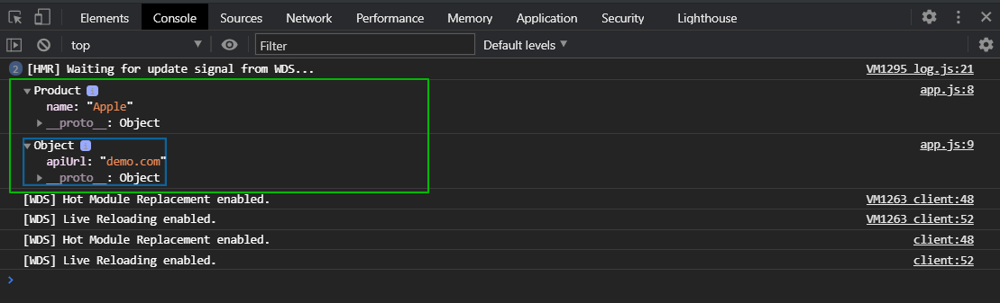

# Модули import export

[https://docs.google.com/presentation/d/175nLA1EdLcQU6HCErtC3nGg_FH2TtRfRg4SpcowFeho/edit?usp=sharing](https://docs.google.com/presentation/d/175nLA1EdLcQU6HCErtC3nGg_FH2TtRfRg4SpcowFeho/edit?usp=sharing)

Нововведение в **ES6** это модули. Представить модуль можно ввиде некой коробки внутри которой есть некий набор функций, инструкций или просто объектов. Они бъеденены ожной логикой и имеют отношение к какой-то отдельной сущности вашего приложения. Это может быть набор методов, функций для запросов к серверу, для получения там какой-то отдельной части данных. Или какие-то вспомогательные вычисления могут быть. На вход в модуль могут приходить другие модули и на выход он будет предоставлять непосредственно определенные функции которыми можно пользоваться снаружи этого модуля т.е. это некая коробка в которой есть определенная логика и наружу даются удобные методы которыми можно пользоваться в других модулях т.е. этот модуль может быть импортирован в другой модуль и там переиспользоваться. При этом экспортировать мы можем только часть функций или объектов внутри модуля которые мы хотим предоставить наружу. Остальные мы можем не экспортировать. Другой модуль их может также благополучно принимать. Вся структура строится из набора модулей или компонентов.

Модуль это отдельный **js** файл из которого мы можем экспортировать какие-то части

```js
// module1.js
const config = {
  apiUrl: "demo.com",
};

function myFunction() {
  console.log("module1, myFunction");
}

export { config as conf, myFunction as foo };
```

<br>

```js
// app.js
import { conf as c } from "./module1";
// import * as mod1 from './module1';
import Product from "./module2";

console.log(new Product("Apple"));
console.log(c);
// console.log(mod1.foo());
```

Я могу экспортировать не только несколько значений сразу, но и с заданными именами **export { config as conf, myFunction as foo };**

Запускаю **webpack** и смотрю.



Я могу импортировать по отдельности. Однако можно импортировать все сразу. для этого я могу прописать **import \* as mod1 from './module1';** И теперь я могу использовать все то что экспортирует этот модуль но с приставкой **mod1** т.е. **console.log(mod1.foo());**

Так же я могу импортировать какую-то сущность как **export default**. Т.е. **Export** позволяет устанавливать значения по умолчанию которое будет импортироваться при импорте модуля. Создаю **module2.js**.

```js
// module2.js
export default class Product {
  constructor(name) {
    this.name = name;
  }
}
```

Обычно если у вас модуль экспортирует что-то одно то это **export default**. Если у вас импортируется множество вещей из модуля то тогда используем просто **export**.

```js
// app.js
import { conf as c } from "./module1";
// import * as mod1 from './module1';
import Product from "./module2";

console.log(Product);
// console.log(c);
// console.log(mod1.foo());
```


Я могу вызвать **new Product()** т.к. там экспортируется класс.

```js
// app.js
import { conf as c } from "./module1";
// import * as mod1 from './module1';
import Product from "./module2";

console.log(new Product("Apple"));
console.log(c);
// console.log(mod1.foo());
```


Это очень удобно. При этом когда мы используем **export default** мы не ставим фигурных скобок, просто пишем имя под которым импортим. Так же мы можем при импорте указывать имя того что мы импортируем, но это применимо к обычным модулям не **default, import { conf as c } from "./module1";** и при вызове указать заданное имя **console.log(c);**

Резюмирую. Модули это новый удобный способ организации кода в замкнутые части внутри которых вы реализуете какую-то логику и наружу экспортируете нужные функции или объекты для использования этого модуля. Для того что бы экспортировать использую ключевое слово **export**. Я могу экспортировать как по отдельности функции и объекты классы, так могу экспортировать сразу все элементы. Или же если мы эекспортим что-то одно мы экспортим это по **default**. Таким образом мы при импорте не указываем фигурных скобок а задаю имя того что я хочу заимпортить.

При использовании обычного экспорта экспортируемые функции классы и т.д. я указываю в фигурных скобках. Я могу задавать собственные имена для экспортируемых частей и переиспользовать их внутри своего кода. Это дает четкую структуру разделения кода на отдельные блоки которые занимаются сугубо своей частью и наружу отдают функционал для манипуляции собой. Код становится более читабельным и удобнее в потдержке.
