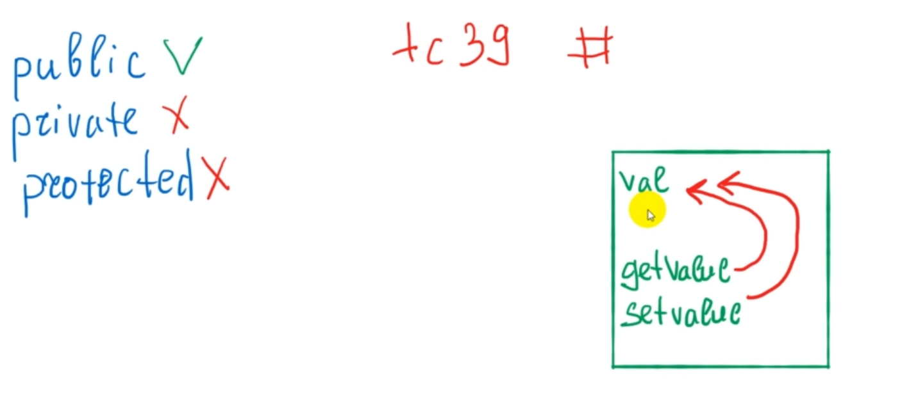

# Инкапсуляция

[https://learn.javascript.ru/internal-external-interface](https://learn.javascript.ru/internal-external-interface)

[https://medium.com/nuances-of-programming/инкапсуляция-состояния-в-javascript-без-использования-классов-в-2019-году-с-приватными-полями-5431df2a3bf7](https://medium.com/nuances-of-programming/инкапсуляция-состояния-в-javascript-без-использования-классов-в-2019-году-с-приватными-полями-5431df2a3bf7)

[https://github.com/tc39/proposal-private-methods](https://github.com/tc39/proposal-private-methods)

Это мы разбираем не зря только после модулей. Потому что инкапсуляция частично связана и модулями. Посмотрим схематически что такое инкапсуляция и каким образом она реализована в **JS**.

**Инкапсуляция** - это реализация приватность ваших модулей и точнее данных которые в них находятся. И выделение и создание внешних интерфейсов для взаимодействия с вашими данными которые находяться в модуле т.е. это еще другими словами можно сказать разделение на уровне доступа к вашим данным.

В чем здесь заключаеся проблема? Например в **TypeScript** у нас есть так называемые модификаторы доступа которые называются **public**, **privete**, **protected**, но в **JS** их нет. И все свойства которые были объявлены в объекте считаются публичными **public** т.е. к ним есть прямой доступ и мы их можем изменять.

Что означает **private** и **protected**?

**private** - это значит что поле т.е. это специальные ключевые слова которые указываются перед свойством или перед методом, повторюсь это только в **TypeScript** это работает. Но тем не менее это модификаторы доступа т.е. ключевые слова которые определяются перед методом или перед свойством и говорят о том что к ним запрещен прямой доступ из инстанса данного класса т.е. мы не можем получить доступы и изменять эти поля снаружи т.е. у экземпляра класса. И отличие между **private** и **protected** заключается в том что **private** поля не доступны для наследников класса а **protected** поля доступны для наследников. Но и **private** и **protected** недоступня для экземпляров класса. 

В **JS** этого нет хотя в **proposal tc39** (вроде так) по поводу создания приватных полей в **JS** советую поглядывать в этот репозиторий. Они должны будут помечатся #. Возможно в ближайшем будущем это появится.

Как же реализовать преватность тех или иных данных внутри **JS**?

Фактически такая преватность реализуется за счет областей видимости функций и замыкания. Т.е. у нас есть некая функция которая ограничена своей областью видимости. В ней могут быть созданы какие-то свойства для которых мы определяем внешние интерфейсы. Например: **getValue** и **setValue**. Эти методы получают с помощью замыкания доступ к переменной **val** и могут на нее влиять.

Наружу мы предоставляем только методы **getValue** и **setValue**. Это является внешними интерфейсами. При этом в этом файле может быть еще какая-нибудь логика которая сокрыта от пользователя и того кто пользуется эти модулем. У него есть методы через которые он может влиять на наш модуль, вызывать что-то в нем, получать какие-то данные или изменять какие-то данные. Напрямую доступ к какой-то переменной, каким-то свойствам он не имеет. В этом и есть как бы смысл инкапсуляции. Это реализуется как раз таки при помощи замыкания и области видимости функций.

Если переносить пример инкапсуляции во внешний мир т.е. в привычные нам вещи то это нас окружает повсюду.