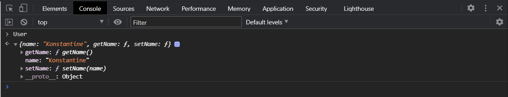
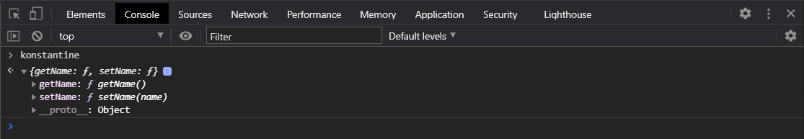
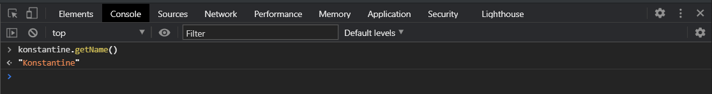
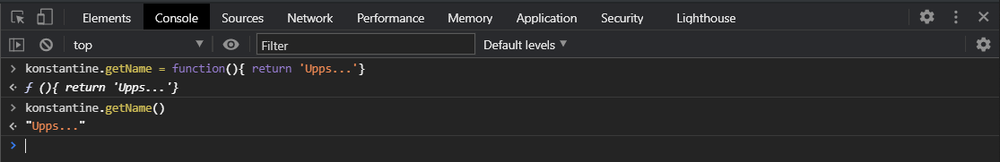
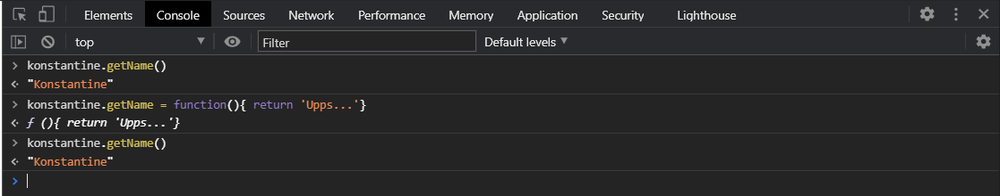
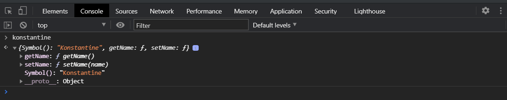
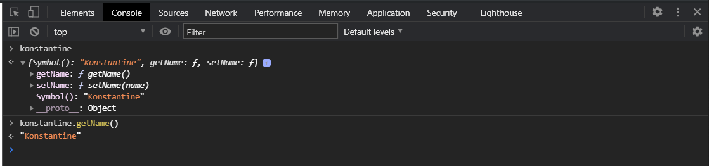

# Инкапсуляция №1

Посмотрим реализацию инкапсуляции в **JS**.

```js
const User = {
  name: "Konstantine",
  getName() {
    return this.name;
  },
  setName(name) {
    this.name = name;
  },
};
```

У него будет имя **name: "Konstantine"** и будет два метода **getName**, **setName**. Это наши некий интерфейс который мы даем что бы мы могли получить имя **getName() {return this.name;}** и могли установить имя **setName(name) {this.name = name;}**.



В данном случае проблема заключается в том что мы имеем прямой доступ к нашим полям. Можем их переопределить, заменить и т.д. Т.е. у нас нет ни какой приватности и все свойства по умолчанию считаются **public**.

Как мы можем реализовать некую приватность с использованием областей видимости функций?

Здесь все очень просто, мы используем замыкание. Мы создаем **function User(name){}** и мы можем вернуть методы которые будут давать доступ к переменной name, т.е. это у нас аргумент name мы в него передадим имя и мы будем его получать в замыкании. В теле функции создаю **let userName = name;** и мы возвращаем объект **return {}** в котором указываем наши методы **getName**, **setName**

```js
function User(name) {
  let userName = name;

  return {
    getName() {
      return userName;
    },
    setName(name) {
      userName = name;
    },
  };
}
```

т.е. теперь если мы вызовем эту функцию даже с оператором **new**.

```js
function User(name) {
  let userName = name;

  return {
    getName() {
      return userName;
    },
    setName(name) {
      userName = name;
    },
  };
}

const konstantine = new User("Konstantine");
```



Теперь у меня есть методы, но у меня нет доступа к самому name. Т.е. мы за счет замыкания получаем доступ к локальным переменным в рамках функции. Вне фуннкции **User** они не видны. У нас есть толко внешние методы **getName** и **setName** через которые мы можем взаимодействовать с теми или иными данными в нашем модуле.



Но здесь есть следующая проблема. Она заключается в том что мы можем сделать следующую запись. Я могу сказать что **konstantine.getName = function(){ return 'Upps...'}**. BИ пробуем вызвать **getName**.



Как вы видите мы с легкостью переопределили метод внутри модуля на другой метод. Теперь у нас нет доступа к тому методу который у нас был.

Мы это можем исправить так же с использованием специального метода у объектов **Object.freeze**.

Создаю все то же самое что и до этого, но возвращать теперь я буду вызов **Object.freeze({})** и передавать в него наш объект который мы возвращаем.

```js
function User(name) {
  let userName = name;

  return Object.freeze({
    getName() {
      return userName;
    },
    setName(name) {
      userName = name;
    },
  });
}

const konstantine = new User("Konstantine");
```

Метод Object.freeze делает так что он запрещает изменение методов и свойств объекта т.е. мы их не сможем попросту переопределить. Сначало попробую что у меня есть досту а потом попробую переопределить на другую функцию и вызвать еще раз.



Переопределение не вызвало ни каких ошибок, но при этом у нас все равно метод **getName** все так же возвращает нам тоже что и должен возвращать по умолчанию это имя нашего пользователя.

Так же мы можем использовать **object descriptor** т.е. мы можем определять какие-то свойства в объекте и давать им свойства **writable**, **configurable** и т.д. Смотри в первом разделе если не помнишь.

Что еще мы можем сделать что бы не дать доступ к каким-то свойствам?

Есть еще один такой хак с использованием так называемых **symbol**. Но опять же это реализуется с помощью замыкания. т.е. мы так или иначе мы будем использовать переменные и замыкание.

Опять создаю **function User(name){}**. В теле функции создаю переменную в которой мы будем его переопределять. На самом деле это не сильно принципиально мы можем так и оставить **name**. Добавим возможность **return {}**. Предположим что мы этот name хотим передать в этом объекте, но не хотим что бы к нему получили доступ. И здесь мы можем воспользоваться так называемым, прописываю в теле функции **User**, **symbol = Symbol()** даннай функция возвращает уникальный индентификатор который не будет равен любому другому **symbol** т.е. это абсолютно уникальный индентификатор который мы можем использовать. Чаще всего вы его использовать не будете. Он в основном используется для некоторых внутренних процессов в **JS** во избежание изменений т.е. конфликта имен и т.д. Теперь мы можем в объект который мы возвращаем за счет так называемых вычисляемых свойств подставить **[symbol]:name**.

```js
function User(name) {
  const symbol = Symbol();

  return {
    [symbol]: name,
    getName() {
      return userName;
    },
    setName(name) {
      userName = name;
    },
  };
}

const konstantine = new User("Konstantine");
```



И мы увидим что у нас есть некое свойство оно определено как **Symbol()** т.е. само его значения мы не видим, но мы видим что в нем есть какое-то значение. И методы теперь могут получать доступы к этому значению через следующую запись.

```js
function User(name) {
  const symbol = Symbol();

  return {
    [symbol]: name,
    getName() {
      return this[symbol];
    },
    setName(name) {
      this[symbol] = name;
    },
  };
}

const konstantine = new User("Konstantine");
```


Инкапсуляция достигается путем областей видимости у функций и замыкания с помощью которого мы можем получить доступ к локальным переменным объявленным внутри функции. Плюс у нас есть такой метод как **Object.freeze** который позволяет у объекта запретить переопределение методов и свойств. Так же мы узнали о **symbol** и о том как можно использовать.