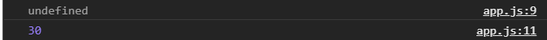
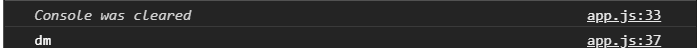
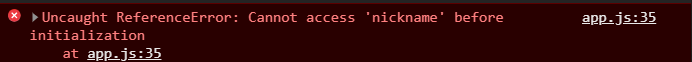
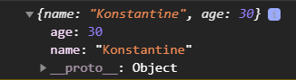
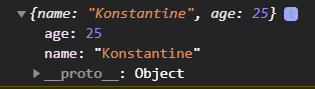

# Переменные

В JS существует три варианта объявления переменных
1. var
2. let
3. const

До ECMAScript6 2015 года существовало единственное ключевое слова **var** для объявления переменных.
**let** и **const** пришли со стандартом ECMAScript6 и внесли улучшения в объевления переменных.

```js
// var, let, const

var name = "Konstantine";
console.log(name);

```

Переменные могут переопределяться в зависимости от констант. Константы переопределяться не могут.

```js
// var, let, const

var name = "Konstantine";
console.log(name);
name = "Kos";
console.log(name);
```


Переменные могут объявляться с пустым значением т.е. без значения

```js
var age;
console.log(age); // в консоли выведется undefined(не определено).
```
После для нее мы можем задать какое - то значение. Обычно это делается при инициализации переменных, когда на старте их значение не известно, и оно будет получено в результате либо каких-то вычислений, либо полученных каких-то данных например с сервера или еще что-то. Потом она будет определена и мы соответственно получим ее значение.

```js
var age;
console.log(age);
age = 30;
console.log(age);
```


При переопределении переменных не ставится ключевое слово т.е. если объявил переменную **var age;** то дальше переопределяю вот так **age = 30;**.

Теперь немного про именование переменных. 

Переменные могут содержать в себе символы, числа, знак нижнего подчеркивания и знак доллара.
Переменные не могут начинаться с чисел. Есть некоторые правила по стилю написания переменных состоящих из нескольких слов.

```js
var $name = "Ivan";
console.log($name);
```
Обычно доллар используется в некоторых определенных ситуациях. Например еть библиотека jQuery которая использует доллар в качестве имени. Во вторых в некоторых framework доллар используется в качестве именования переменных. Обычно такое именование так просто не используется.

Можно начинать переменную с нижнего подчеркивания.

```js
var _name = "Maks";
console.log(_name);
```
Но есть так же нюансы в некоторых случаях когда использовать нижнее подчеркивание. Обычно просто так в начале переменной его не используют. 
Нельзя начинать название переменной с числа. Потому что интерпретатор пытается преобразовать его не в символ, а в число.

```js
var 1name = ''; // такой вариант нельзя использовать
```

Так же очень важно что бы называние переменной передавало смысл. Мы должны максимально выразительно описывать те данные которые там содержаться. Это улучшает читабельность кода и понимание того что храниться в этой переменной и для чего она нужна и т.д. 

Исходя из этого можно понять что переменные из одного слова не так часто состоят, потому что бывают какие-то сложные данные храняться и нужно более развернуто написать что это за переменная.

Есть несколько подходов по именованию таких переменных.

1. camelCase - это когда каждое последующее слово, кроме первого называется с большой буквы.

```js
var userAge = 30;
console.log(userAge);
```
2. underscore - это когда между словами ставится нижнее подчеркивание.

```js
var user_age = 20;
console.log(user_age);
```

3. Так же есть стиль когда каждое слово начинается с большой буквы. Обычно его просто так не используют. Его используют при определении классов.

```js
var UserAge = 40;
console.log(UserAge);
```
Принято то что те переменные которые объявляются с большой буквы называются классами. Обычные переменные которые содержат какие - то ваши данные текущие в приложении, числа, строки, какие-то объекты или массивы не должны называться с большой буквы.

Совет: В начале разработки нужно выбрать один из стилей и придерживаться его. Обычно это либо **camelCase** либо **underscore**.

**Проблемы Var**.
1. проблема заключалась в том что мы могли объявить несколько var c одинаковым именем.

```js
var car = "bmw";
var car = "audi";
console.log(car);
```
Переменная перезаписывается, но фактически я как бы два раза объявляю переменную с одним и тем же именем. Конечно в этой переменной будет содержаться последнее значение. Однако это немнго не логично и может вызвать какие - то ошибки. В большом приложении при именовании переменных легко допустить ошибку и написать переменную которая была объявлена в начале разработки и тем самым просто переписать ее значение, а не использовать данную переменную в качестве вновь созданной. И так ломается вся программа.

2. Всплытие var - это еще называют хостингом. Переменные var предварительно браузером собираются и выносятся браузером в самый верх кода, а уже непосредственное их определение происходит на месте где мы имм присваиваем значения. Выглядит это следующим образом.

```js
console.log(car);
var car = "bmw";
// var car = "audi";
console.log(car);
```

Если я сначало вывожу в консоль и лишь после этого присваиваю значение переменной, у меня в консоль выводится **undefined** т.е. переменная не определена. Т.е. у меня нет ошибки о том что у меня нет переменной, потому что я ее еще не объявлял, у меня есть просто undefined т.е. в данной переменной просто нет значения. Но когда я вывожу в консоль после того как объявил переменную, то на 31 строке выводится значение данной переменной. Это один из нюансов который може вводит в заблуждение.

**let** и **const**.
Здесь все очень просто. Мы можем объявить переменную с помощью let.

>Для того что бы предыдущий код не коментировать просто очищаю консоль **console.clear();**

```js
let nickname = "dmgame";
console.log(nickname);
```

let не может быть несколько

```js
let nickname = "dmgame";
let nickname = "dm";
console.log(nickname);
```


В данной ошибке говорится что индентификатор **nikname** задиклорирован, и я не могу еще раз объявить переменную с этим же именем. Я ее могу точно так же переопределять

```js
let nickname = "dmgame";
nickname = "dm";
console.log(nickname);
```


Плюс let в отличие от var не всплывают. Если я попытаюсь обратиться к nickname до фактического его объявления. у меня выведется ошибка.

```js
console.log(nickname);
let nickname = "dmgame";
let nickname = "dm";
console.log(nickname);
```


У меня с ним выводятся разные ошибки. Однако это исключает ошибок что я могу обратиться к переменной где ее еще нет.

Так же одно из отличий let от var заключается в блочной области видимости.

Далее есть **const**. В нем все тоже самое что и в let, не может быть двужх одинаковых констант. Константы не всплывают. В JS до этого не было констант и все использовали только var. const позволяет создать переменные которые не будут переопределяться, т.е. при переопределении будет выводиться ошибка.

```js
const firstName = "Tom";
firstName = "Jhon";
console.log(firstName);
```


Так же в отличие от let, const не могут быть инициализированы без значения. Они обязательно долны быть инициализированы.

Однако есть такой нюанс что константы мутабельны. Значение внутри констант может меняться. Запрет в const стоит только на переопределение. Это относиться только к ссылочным типам объектам, массивам и т.д. Мы можем изменить например то что находиться в объекте и при этом у меня не будет ошибки.

```js
const user = {
  name: "Konstantine",
  age: 30,
};
console.log(user);
```

Я не могу переопределить переменную user, но я могу изменить внутри содержимое.

Однако я могу написать вот так, и тем самым переопределить значение.

```js
const user = {
  name: "Konstantine",
  age: 30,
};
user.age = 25;
console.log(user);
```


Внутренне содержимое объектов может изменяться, но при этом это остается константой.  Однако если я попытаюсь переопределить константу.

```js
const user = {
  name: "Konstantine",
  age: 30,
};
user.age = 25;
user = {}
console.log(user);
```


