# Преобразование типов

Преобразование типов - это то как могут изменяться разные типы данных, точнее конвертироваться разные типы данных друг в друга т.е. мы можем из числа сделать строку и наоборот. Как например конвертируется массив в строку или число и т.д. Есть явные преобразования типа, и есть не явные.

Явное преобразовывание.

```js
let value;
value = 10;
console.log(value);
console.log(typeof value);
```
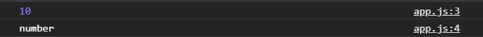

Рассмотрим перевод числа в строку.

```js
let value;
// Number to string
value = String(10);
console.log(value);
console.log(typeof value);
```
Функция String(), в параметры которой передаю число, преобразует число десять в строку.

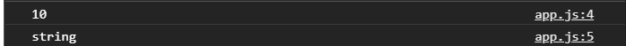

В параметрах функции String() могут быть какие то арифметические действия. Результат данного арифметического действия все равно будет число преобразованное в строку.

```js
let value;
// Number to string
value = String(40 + 10);
console.log(value);
console.log(typeof value);
```
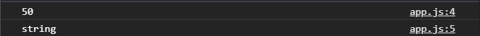

Так же мы можем преобразовывать в строку используя специальный метод toString. Для этого я должен число взять либо в круглые скобки, либо оно должно быть в переменной.

```js
let value;
// Number to string
value = (10).toString();
console.log(value);
console.log(typeof value);
```
если в переди точка, а в конце круглые скобки, как **.toString()**, то это называется методом. Методы делают преобразования над данными которые прописаны до точки.


**Boolean to String**

```js
// Boolean to String
value = String(true);

console.log(value);
console.log(typeof value);
```
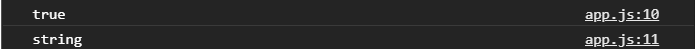

Тоже самое будет с false.

<br><br>

**Array to String**

```js
// Array to String
value = String([1, 2, 3]);

console.log(value);
console.log(typeof value);
```
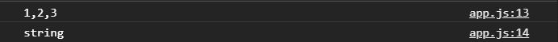

<br><br>

**Object to String**

```js
// Object to String
value = String({ name: "Konstantine" });

console.log(value);
console.log(typeof value);
```
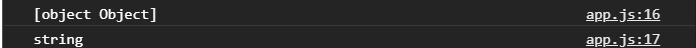

object Object это определенный нюанс в JS.

Так же преобразования в строку может происходить при пипытке конкотенации любого хначения со строкой.

```js
value = 30 + "";

console.log(value);
console.log(typeof value);
```
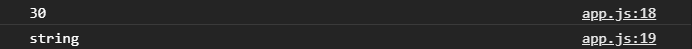
Если к числу прибавить строку, даже пустую. Если в нутри есть пробел, то это уже считпется символом. Если число сконкотенировать со строкой, это является не явным преобразованием. Если я после строки добавлю еще число, то я все равно получу строку.

```js
value = 30 + "" + 30;

console.log(value);
console.log(typeof value);
```
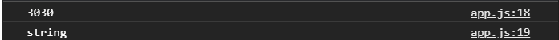

Если мы попробуем произвести обратное действие с пустой строкой 

```js
value = 30 - "";

console.log(value);
console.log(typeof value);
```
то получится такой же результат.
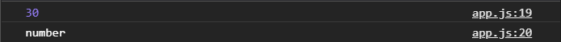

Однако если я произведу вычисления числа с символами.

```js
value = 30 - "asds";

console.log(value);
console.log(typeof value);
```

 то получаем NaN(Not-A-Number). Потому что **"asds"** не может быть преобразовано к числу.

 Если же в строке пропишем число.
 ```js
 value = 30 - "5";

console.log(value);
console.log(typeof value);
 ```
  То произойдет преобразование символа 5 в число с последующим арифметическим действием.
  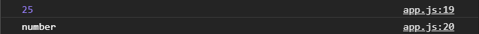

  Когда мы складываем со строкой, мы делаем конкотенацию и в лубом случае мы получим строку даже если вместо какого то числа будет **undefined**.

  ```js
value = 30 + "" + undefined;

console.log(value);
console.log(typeof value);
  ```
  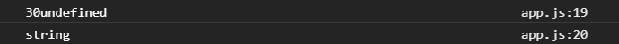

Это происходит потому что при конкотенации любой тип данных преобразуется к строке.
При любых других математических вычислениях будь-то вычитание, умножение, деление. Строка будет пытаться преобразовываться к числу. И соответственно если она может быть преобразована к числу это преобразование произойдет и выполнится математическое действие. Если строка не может быть преобразована к числу то мы получим **NaN**. Это не явное преобразование.
При этом не явное преобразование так же происходит и с другими типами например.

```js
value = true + 10;

console.log(value);
console.log(typeof value);
```
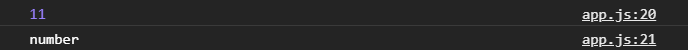

Получается 11, потому что true преобразуется при математических операциях, если нет строки, преобразуется к числу 1. Null преобразуется к нулю. False так же преобразуется к нулю.

```js
value = false + 10;

console.log(value);
console.log(typeof value);
```
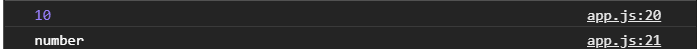

Если превести к числу Boolean значения, то мы получим собственно говоря эти числа.
Если мы попробуем провести какие - то математические операции например с **undefined**.
```js
value = false + undefined;

console.log(value);
console.log(typeof value);
```
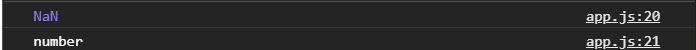

undefined при математических действиях, кроме сложения со строкой, будет преобразовываться к NaN.

Если мы преобразовываем наоборот строку в число.

```js
// String to Number
value = Number("23");

console.log(value);
console.log(typeof value);
```
Функция Number() явно преобразовывает строку в число
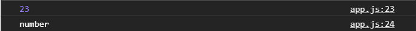

Если попробовать преобразовать Boolean
```js
// String to Number
value = Number(true);

console.log(value);
console.log(typeof value);
```
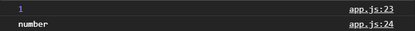

```js
// String to Number
value = Number(false);

console.log(value);
console.log(typeof value);
```
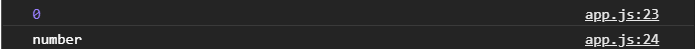

Если попробуем преобразовать Null

```js
value = Number(null);

console.log(value);
console.log(typeof value);
```
то так же будет ноль.

Если соответственно прпробовать преобразовать строку к числу
```js
value = Number('false');

console.log(value);
console.log(typeof value);
```
То соответственно преобразование не произойдет
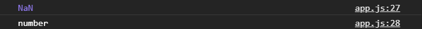

Если попробовать преобразовать массив к числу
```js
value = Number([1, 2, 3]);

console.log(value);
console.log(typeof value);
```
То также мы молучим NaN.

Так же есть несколько специальных функций которые помогают преобразовывать например к числу, приводить данный из строки это parseInt() и parseFloat().
parseInt() может принять строку которую преобразует в число.

```js
value = parseInt("200");

console.log(value);
console.log(typeof value);
```
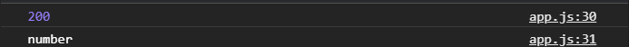

При этом если после числа будут идти какие - то символы, то он их отбросит и выведет число.
```js
value = parseInt("200asssdfg");

console.log(value);
console.log(typeof value);
```


Но очень важно что если перед числом будут идти какие-то символы, то мы получим NaN.
```js
value = parseInt("asssdfg200");

console.log(value);
console.log(typeof value);
```
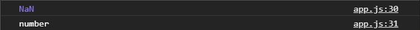

parseInt() служит для целых чисел, а parseFloat() для дробных.

```js
value = parseFloat("200.212px");

console.log(value);
console.log(typeof value);
```
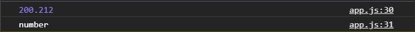

<br><br>
**Преобразовывание к Boolean**

Для этого есть специальная функция Boolean() которая принимая любое значение преобразовывает его в true или false. Так вот любая строка не пустая  будет считаться true.

```js
// Boolean
value = Boolean("hello");

console.log(value);
console.log(typeof value);
```
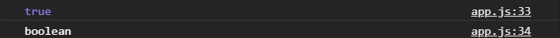

Пустая строка false

```js
// Boolean
value = Boolean("");

console.log(value);
console.log(typeof value);
```
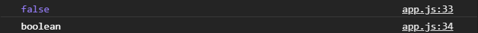

Однако если там есть пробел это считается true

```js
// Boolean
value = Boolean(" ");

console.log(value);
console.log(typeof value);
```
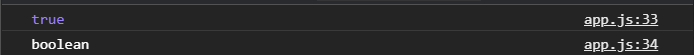

Любое число, как польжительное, так и отрицательное будет преобразовываться в true.

```js
// Boolean
value = Boolean(100);

console.log(value);
console.log(typeof value);
```


Однако ноль будет считаться false

```js
// Boolean
value = Boolean(0);

console.log(value);
console.log(typeof value);
```
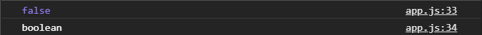

Тоже самое с undefined и null которые в Boolean являются false.

Пустой объект или пустой массив это всегда true

```js
// Boolean
value = Boolean({});

console.log(value);
console.log(typeof value);
```
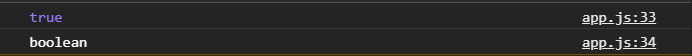
