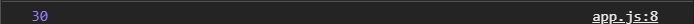

# Числа
 [https://docs.google.com/presentation/d/11i9ipXc6duAgYDn5QxxbT7yr0XwyWGO8PMNYhU8Gbhg/edit?usp=sharing](https://docs.google.com/presentation/d/11i9ipXc6duAgYDn5QxxbT7yr0XwyWGO8PMNYhU8Gbhg/edit?usp=sharing),

[https://learn.javascript.ru/number](https://learn.javascript.ru/number),

[https://developer.mozilla.org/uk/docs/Web/JavaScript/Reference/Global_Objects/%D0%A7%D0%B8%D1%81%D0%BB%D0%BE](https://developer.mozilla.org/uk/docs/Web/JavaScript/Reference/Global_Objects/%D0%A7%D0%B8%D1%81%D0%BB%D0%BE),

[https://developer.mozilla.org/uk/docs/Web/JavaScript/Reference/Global_Objects/Math](https://developer.mozilla.org/uk/docs/Web/JavaScript/Reference/Global_Objects/Math)

Рассмотрим более подробную работу с числами. Какие есть нюансы, есть операторы, и познакомимся так же с объектом math, который является объектом с определенными математическими функциями позволяющий делать различные вычисления.
Создаю три переменные

```js
// Numbers

const num1 = 10;
const num2 = 20;
let value;
```
В value буду записывать результат. Как вы все знаете есть простые арифметические операторы (+, *,/,-), мы их рассматривать не будем . Единственный нюанс который с ними связан это то как можно писать более сокращенные записи.

```js
const num1 = 10;
const num2 = 20;
let value;

value = num1 + num2;
console.log(value);
```


Часто бываю ситуации когда нам нужно изменить текущее значение  переменной прибавив к ней еще какое-то значение т.е. перезаписать. value которое равняется 30, я к нему захотел прибавить еще 100. Просто написать value + 100 ничего не даст по той простой причине что не происходит перезапись переменной. Для того что бы переопределить переменную ей нужно присвоить это значение т.е.

```js
const num1 = 10;
const num2 = 20;
let value;

value = num1 + num2;

value = value + 100;

console.log(value);
```


Сначало интерпритатор выполнит арифметическое действие, а после выполнит присвоение. Арифметические операции имеют более высокий преоритет, соответсвенно сначало происходит вычисление и лишь потом происходит присвоение.
Есть вариант этой записи в более коротком формате.

```js
const num1 = 10;
const num2 = 20;
let value;

value = num1 + num2;

value = value + 100;
value += 100;

console.log(value);
```
Тожесамое можно сделать с любыми другими операторами. Старайтесь использовать эту запись!!

Так же есть еще один оператор. Деление по модулю. Он выводит остаток от деления.

```js
value = 4 % 2;

console.log(value);
```
И в консоли выводится ноль. Бывают моменты когда данный оператор помогает существенно сократить код.

Инкремент и декркмент - это возможность увеличивать либо уменьшать переменную на еденицу

```js
value++;

console.log(value); // результат вывода 231
```

```js
value--;

console.log(value); // результат вывода 230
```

Так же мы можем писать ++value или --value. Отличие расположения этого оператора влияет на то когда происходит увеличение переменной. Если ++ стоит перед переменной, то изменения переменной произойдут сразуже на этой строке. Если стоит после переменной, то изменения произойдут на следующей строке. Это сильно влияет при использовании циклов.

**Не точные вычисления.**
```js
value = 0.6 + 0.7;

console.log(value);
```
Хотелось бы думать что результат вычислени будет 1.3, однако он таков


Если не вдаваться глубоко в подробности это происходдит из-за работы с памятью. Нюансы выделения памяти и то как работать с дробью JS. 
Эту проблему можно исправить двумя способами, их больше, но эти самые популярные.
Его можно округлить.

```js
value = 0.6 + 0.7;
value = value.toFixed(1);

console.log(value);
```
В параметрах указываю сколько знаков после запятой.


однако это строка. Для того что чтобы привести к числу можно поставить тернарный знак перед переменной.

```js
value = 0.6 + 0.7;
value = +value.toFixed(1);

console.log(value);
```


Либо обернуть это все в функцию parseInt() или parseFloat() в зависимости от типа данных которые мы хотим получить.

```js
value = 0.6 + 0.7;
value = parseFloat(value.toFixed(1));

console.log(value);
```


Либо еще один вариант использовать вот такую запись.

```js
value = (0.6 * 10 + 0.7 * 10) / 10;

console.log(value);
```


**Объект math.**
Представляет собой набор свойств и методов для работы с числами. Это довольно большой объект и более подробно можно изучить его в документации. Так же все его методы можно посмотреть в консоли.

```js
// Math

value = Math.PI;

console.log(value);
```


Методы вызываются через точку. Методы это функции записанные в свойства объекта.

```js
value = Math.random();

console.log(value);
```


Выводит от ноля до еденицы.
Есть методы округления

```js
value = Math.random(2.4);

console.log(value);
```
Округляются так же как и в математике до 0,5 в меньшую сторону, с 0,5 в большую.

Так же есть

```js
value = Math.ceil(2.1);// Результат 3

console.log(value);
```
Всегда округляет в большую сторону.
Его противопольжность
```js
value = Math.floor(2.9); // Результат 2

console.log(value);
```
Так же есть методы min и max. Рассмотрим на min
```js
value = Math.min(2, 12, 15, 0, 12); // Результат 0

console.log(value);
```
Метод random довольно часто используется для вычисления случайного значения. Это нужно для того что бы взять какой-то рандомный элемент из массива. Или просто нужно рандомное значение в промежутке каком-то.

```js
value = Math.random() * 10; 

console.log(value);
```
тогда мы всегда будем получать дробное число до 10-ти, но не включительно 10, т.к. отсчет идет от ноля. Что бы получить включительно 10.

```js
value = Math.random() * 10 + 1; 

console.log(value);
```

Но сейчас число дробное. Для того что бы его округлить я использую.

```js
value = Math.floor(Math.random() * 10 + 1); 

console.log(value);
```


Всегда округляет в меньшую сторону для того что бы мы не вышли за рамки нашего значения.

В случае если у нас есть массив и мы хотим получить рандомный элемент из массива, то запись будет выглядеть следующим образом. Например массив цветов.

```js
const arr = [
  "black",
  "red",
  "yellow",
  "pink",
  "white",
  "blue",
  "orange",
  "green",
];
value = Math.floor(Math.random() * arr.length);


console.log(value, arr[value]);
```
И в консоль для получения цвета вторым елементом передаю arr[value] который по index считывает значение данного элемента массива.


Такая запись довольно часто используется в рандомных вычислениях.