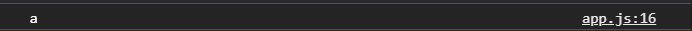

# Строки

[https://learn.javascript.ru/string](https://learn.javascript.ru/string),

[https://developer.mozilla.org/uk/docs/Web/JavaScript/Reference/Global_Objects/String](https://developer.mozilla.org/uk/docs/Web/JavaScript/Reference/Global_Objects/String).

Познакомимся более подробно со строками.

```js
const FirstName = "Konstantine";
const lastName = "Atroshchanka";
const age = 30;
const str = "Hello my name is Konstantine";

let value;
```

Первое с чем мы познакомимся это конкотенация.

```js
value = FirstName + lastName;

console.log(value);
```

Как мы видим две строки сконкотенированы. Если мы ходим что бы все это писалось отдельно конкотенируем пробел.

```js
value = FirstName + ' ' + lastName;

console.log(value);
```


Мы можем что-то добавлять к строке

```js
value = FirstName + " " + lastName;
value = value + " I am " + age;

console.log(value);
```


или же
```js
value = FirstName + " " + lastName;
value +=" I am " + age;

console.log(value);
```

У строки есть свойства

```js
value = FirstName.length;

console.log(value);
```

Это свойство возвращает длинну строки. Счет в строке начинается с ноля. Всего символов 11. 
Для получения какого то конкретного символа мы можем написать например.

```js
value = FirstName[10];

console.log(value);
```

В массив передаю index символа который хочу использовать. 
Откуда у строки есть длинна т.е. свойство. И здесь не совсем понятно откуда у строки появляется свойство. Свойства и методы в основном присущи объектам. Объектв могут содержать в себе свойства и методы.
Дело в том что JS так называемые объекты обертки, и временные объекты для примитивных типов для того что бы была возможность вызывать те или иные методы для их работы. 
Здесь все тоже самое. Строка остается примитивом и для того что бы можно было применить какие - то методы JS создает временный объект со значением этой строки и с набором методов и свойств для работы с этой строкой. 

Получение последнего элемента строки.

```js
value = FirstName[FirstName.length - 1];

console.log(value);
```
минус 1 потому что количество символов 11, а количество индексов 10. Поэтому для того что бы найти последний элемент в строке из длинны строки вычитаю 1.

```js
value = FirstName[FirstName.length - 1];
value = lastName[lastName.length - 1];

console.log(value);
```


<br>
<br>
<br>
Теперь немного о методах.

Методы есть разные для работы со строками которые так или иначе изменяют строку и возвращают нам измененный результат. Первое что нужно запомнить это то что строка исходная не меняется т.е. применяя какие - то методы к строке мы не изменяем саму строку. Эти методы возвращают нам измененное значение, которое мы можем присвоить переменной. Например петоды toLowerCase() или toUpperCase.

```js
value = FirstName.toUpperCase();

console.log(value);
```


Однако если во второй парамет вывода в консоль передать FirstName оно останется в прежнем регистре как и было написано изначально.

```js
value = FirstName.toUpperCase();

console.log(value, FirstName);
```


Так же есть метод concat(), он принимает строки которые мы хотим конкотенировать через запятую.

```js
value = FirstName.concat(' ', lastName);

console.log(value);
```


Есть метод, многих пугающий, это метод indexOf() который принимает подстроку которую мы хотим найти, т.е. мы хотим найти в строке какой - то символ, или какое - то слово, например я хочу найти букву n.

```js
value = FirstName.indexOf('n');

console.log(value);
```


Он возвращает индекс первого вхождения данной строки. Если букв n болше, он все равно вернет только первое вхождение.

Вторым параметром в indexOf я могу передать позицию с которой хочу начать поиск.

```js
value = FirstName.indexOf('n', 4);

console.log(value);
```


 И вот на 6 позиции индекса он находит еще букву n.

 Так жя я могу указывать непосредственно все слово. Таким образом я могу найти index и потом что-то с ним сделать.
 
 Если он не находит какого - то значения то в консоли выводится -1, что в свою очередь говорит о том что ничего небыло найдено.

 Противоположный ему есть lastIndexOf() соответственно он ищет наоборот с конца строки.

 Похожий на indexOf(), но возвращаемый немного другое значение является метод includes(). В параметнах указываю что я хочу найти. При нахождении данного значения он возвращает Boolean значение.

 ```js
 value = FirstName.includes('n');

console.log(value);
```


Если ввожу символ которого нет
```js
value = FirstName.includes('!');

console.log(value);
```


Так же я могу ввести полное имя и он мне вернет true говоря о том что такое имя есть. Если я введу в верхнем регистре то вернется false. Это говорит о том что метод чувствителен к регистру. Это зависит от того что каждый символ имеет свое уникальное значение в формате unicode т.е. маленькая буква имеет свое значение, большая буква имеет свое значение. Для корректного поиска обычно всю строку приводят к нижнему регистру или наоборот в зависимости от ситуации.

Так же есть некоторые методы взятия какой- либо строки из по строки. Грубо говоря вырезать что - то из строки. Этих методов аж 3, но самый используемый это slice. Есть еще subStr ...

Метод slice() принимает стартовое значение, стартовый индекс, с которого мы хотим начать что-то вырезать, и конечный индекс до которого будет производится вырезание, но не включая его.

```js
value = str.slice(0, 5);

console.log(value);
```


И в консоли я получаю вырезаемое значение.
slice используется чаще всего потому что он более универсальный. Во-первых я могу ему не передавать второго значения, если это будет 0 или вообше пустой параметр, то он вернет всю строку. Если я передаю один параметр то он вырежет начиная с этого индекса и до конца строки.

Так же он может принимать отрицательные значения.

```js
value = str.slice(0, -3);

console.log(value);
```


он вырезал с начала и до конца, однако в конце отнял три символа.

Так же есть метод replace() который позволяет заменить значение в строке. Я должен указать значение которое я буду искать, а вторым параметром указываю на что я хочу заменить.

```js
value = str.replace("Konstantine", "Ekaterina");

console.log(value);
```


Это были основные методы со строками. Их конечно же больше. Читай на официальной документации.
