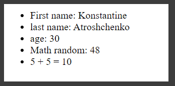

# Шаблонные строки

[https://docs.google.com/presentation/d/12SbhHaPH9pueWmnbapi0yiyWp4gUH6f9Nr5oQa62Hsk/edit?usp=sharing](https://docs.google.com/presentation/d/12SbhHaPH9pueWmnbapi0yiyWp4gUH6f9Nr5oQa62Hsk/edit?usp=sharing),

[https://developer.mozilla.org/ru/docs/Web/JavaScript/Reference/template_strings](https://developer.mozilla.org/ru/docs/Web/JavaScript/Reference/template_strings).

Это синтаксис который пришел в ES6 дабы упростить нам работу со строками когда мы хотим в строку добавить какие - то переменные. 
Сначало посмотрим как это было реализовано в синтаксисе ES5.

```js
const firstName = "Konstantine";
const lastName = "Atroshchenko";
const age = 30;

let str;

str = "Hello my name is " + firstName + " " + lastName;

console.log(str);
```
т.е. вот таким вот образом формировалась строка. Проблема здесь в том что мы постоянно разрываем строку, то ставим +, добавляем какую - то переменную, опять ставим + и т.д. Это все не очень удобно.

Представте что у нас есть какой-нибудь HTML шаблон в который нужно поставить переменные.

```js
const firstName = "Konstantine";
const lastName = "Atroshchenko";
const age = 30;

let str;

str = "Hello my name is " + firstName + " " + lastName;

str = "<ul>" + 
"<li>First name:" + firstName + "</li>" + 
"<li>Last name:" + lastName + "</li>" + 
"<li>age:" + age + "</li>" + 
"</ul>";

console.log(str);
```
Вот список с которым сложнова-то работать потому что есть много разрывов. А представте что у вас теперь возникает вложенность. Внутри еще должен быть еще какой-то тег в который будет завернуто содержимое и соответственно вам нужно добавить еще какие-то классы и т.д. Это все будет только усложнять и нагромождать разметку.

И сразу добавим это в DOM. Для того что бы это сделать я обращаюсь к document - это специальный объект который хранит в себе свойства и методы для работы с разметкой. Далее обращаюсь к его свойству body - это сам тег body. И у него есть свойство innerHTML - это непосредственно разметка которая находится в body в этом свойстве записано и мы можем это перезаписать.

```js
const firstName = "Konstantine";
const lastName = "Atroshchenko";
const age = 30;

let str;

str = "Hello my name is " + firstName + " " + lastName;

str =
  "<ul>" +
  "<li>First name:" +
  firstName +
  "</li>" +
  "<li>Last name:" +
  lastName +
  "</li>" +
  "<li>age:" +
  age +
  "</li>" +
  "</ul>";

// console.log(str);
document.body.innerHTML = str;
```


<br>
<br>
<br>
<br>

**Рассмотрим пример с ES6**.
Новый тип обявления строки который мы рассматривали раньше  косые кавычки **``**. Это новый синтаксис объявления строк с возможностью добавления в них пенеменных так называемый **template string**.
Пишу как обычный html. Однако для того что бы добавить переменную я использую специальный синтаксис **${}**.

```js
const firstName = "Konstantine";
const lastName = "Atroshchenko";
const age = 30;

let str;
str = `
<ul>
<li>First name: ${ firstName }</li>
<li>last name: ${ lastName }</li>
<li>age: ${ age }</li>
</ul>
`;
document.body.innerHTML = str;
```
Здесь адекватно воспринимаются пробелы. При этом здесь мы можем использовать вызовы функций, операторы сравнения, Data, тернарный оператор или любые другие операторы арифметические, логические и т.д.

Я могу делать все что угодно. Например вывести рандомное число.

```js
const firstName = "Konstantine";
const lastName = "Atroshchenko";
const age = 30;

let str;
str = `
<ul>
<li>First name: ${ firstName }</li>
<li>last name: ${ lastName }</li>
<li>age: ${ age }</li>
<li>Math random: ${Math.floor( Math.random() * (50)) }</li>
</ul>
`;
document.body.innerHTML = str;
```


Математические операции.

```js
str = `
<ul>
<li>First name: ${ firstName }</li>
<li>last name: ${ lastName }</li>
<li>age: ${ age }</li>
<li>Math random: ${Math.floor( Math.random() * (50)) }</li>
<li>5 + 5 = ${5 + 5 }</li>
</ul>
`;
```


