#Введение в объекты

[https://docs.google.com/presentation/d/1xokG57sfQBPh7tIL9_utYwbmkzOV7fHe5Gmgg1xidzE/edit?usp=sharing](https://docs.google.com/presentation/d/1xokG57sfQBPh7tIL9_utYwbmkzOV7fHe5Gmgg1xidzE/edit?usp=sharing),

[https://learn.javascript.ru/object](https://learn.javascript.ru/object),

[https://developer.mozilla.org/ru/docs/Learn/JavaScript/%D0%9E%D0%B1%D1%8A%D0%B5%D0%BA%D1%82%D1%8B/%D0%9E%D1%81%D0%BD%D0%BE%D0%B2%D1%8B](https://developer.mozilla.org/ru/docs/Learn/JavaScript/%D0%9E%D0%B1%D1%8A%D0%B5%D0%BA%D1%82%D1%8B/%D0%9E%D1%81%D0%BD%D0%BE%D0%B2%D1%8B)

Это будет базовое введение в объекты. Объекты состоят из полей в которые в свою очередь состоят из ключей и их значений. Поля могут быть как примитивными, так и ссылочными тапами (объекты, массивы либо какие то примитивные данные). 
При этом ключи объекта могут быть объявлены через кавычки  в случае если поле является сложным. Кавычки используются для имен ключей которые являются не валидными если они будут без кавычек. Без кавычек это писать нельзя потому что дефис будет не правильно распознан интерпретатором и у нас будет ошибка (SyntaxError Unexpected token). В том числе если мы например хотим использовать какие-то математические операторы. Например знак умножить т.е. какие-то специфичные символы.

```js
const user = {
  firstName: "Konstantine",
  age: 30,
  isAdmin: true,
  email: "Konstantine899@gmail.ru",
  "user-address": {
    sity: "Витебск",
  },
  skills: [
    "html",
    "css",
    "scss",
    "WebPack",
    "Babel",
    "Node.js",
    "Express",
    "MongoDB",
    "Mongoose",
    "Eslint",
  ],
};
```
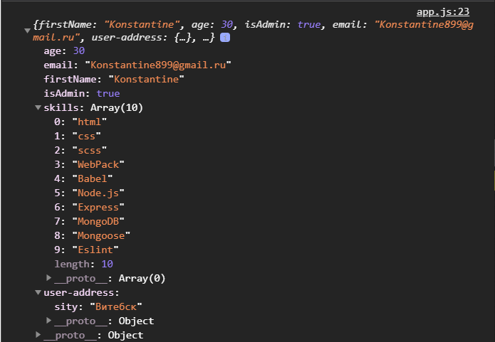

Теперь как же получить доступ к тем или иным свойствам. Есть два варианта. Создаю переменную которую буду переопределять.

В первую очередь я всегда пишу имя объекта и после через точку обращаюсь к названию свойства которое хочу получить.

```js
const user = {
  firstName: "Konstantine",
  age: 30,
  isAdmin: true,
  email: "Konstantine899@gmail.ru",
  "user-address": {
    sity: "Витебск",
  },
  skills: [
    "html",
    "css",
    "scss",
    "WebPack",
    "Babel",
    "Node.js",
    "Express",
    "MongoDB",
    "Mongoose",
    "Eslint",
  ],
};

let value;

value = user.firstName;

console.log(value);
console.log(user);
```

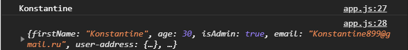

Второй вариант это через квадратные скобки в которых через скобки обращаюсь к ключам объекта. Это вариан чаще используется для тех ключей имя которых задано с помощью скобок. Однако можно использовать обычные имена ключей.

```js
const user = {
  firstName: "Konstantine",
  age: 30,
  isAdmin: true,
  email: "Konstantine899@gmail.ru",
  "user-address": {
    sity: "Витебск",
  },
  skills: [
    "html",
    "css",
    "scss",
    "WebPack",
    "Babel",
    "Node.js",
    "Express",
    "MongoDB",
    "Mongoose",
    "Eslint",
  ],
};

let value;

value = user.firstName;
value = user['isAdmin'];

console.log(value);
console.log(user);
```
 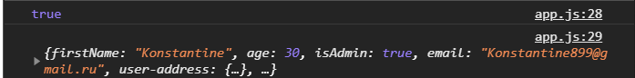

 Специфичные названия ключей,"user-address", через точку получить невозможно.

 ```js
 const user = {
  firstName: "Konstantine",
  age: 30,
  isAdmin: true,
  email: "Konstantine899@gmail.ru",
  "user-address": {
    sity: "Витебск",
  },
  skills: [
    "html",
    "css",
    "scss",
    "WebPack",
    "Babel",
    "Node.js",
    "Express",
    "MongoDB",
    "Mongoose",
    "Eslint",
  ],
};

let value;

value = user.firstName;
value = user['isAdmin'];
value = user['user-address'];

console.log(value);
console.log(user);
```
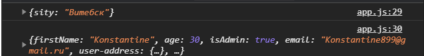

Для того что бы получить вложенные свойства в объекте, мы можем продолжить эту цепочку через точку либо через квадратные скобки. Обратите внимание что если в квадратных скобках не указывать кавычки то это будет распознаваться как переменная. Если же указать через кавычки то это будет распознанно как имя ключа.

```js
const user = {
  firstName: "Konstantine",
  age: 30,
  isAdmin: true,
  email: "Konstantine899@gmail.ru",
  "user-address": {
    sity: "Витебск",
  },
  skills: [
    "html",
    "css",
    "scss",
    "WebPack",
    "Babel",
    "Node.js",
    "Express",
    "MongoDB",
    "Mongoose",
    "Eslint",
  ],
};

let value;

value = user.firstName;
value = user['isAdmin'];
value = user['user-address'];
value = user['user-address'].sity;
value = user['user-address']['sity'];

console.log(value);
console.log(user);
```
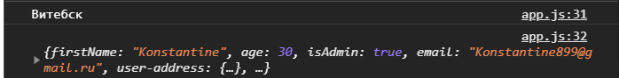

С использованием квадратных скобок мы можем подставлять сюда переменные в отличие от обращения через точку.
Создаю переменную **let prop = "email";** и 

```js
const user = {
  firstName: "Konstantine",
  age: 30,
  isAdmin: true,
  email: "Konstantine899@gmail.ru",
  "user-address": {
    sity: "Витебск",
  },
  skills: [
    "html",
    "css",
    "scss",
    "WebPack",
    "Babel",
    "Node.js",
    "Express",
    "MongoDB",
    "Mongoose",
    "Eslint",
  ],
};

let value;
let prop = "email";

value = user.firstName;
value = user["isAdmin"];
value = user["user-address"];
value = user["user-address"].sity;
value = user["user-address"]["sity"];

value = user[prop];

console.log(value);
console.log(user);
```

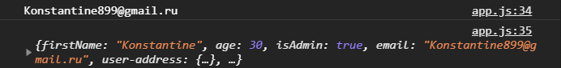

Такое обычно используется когда вы вычисляете какие то свойства. Вычисляемыми или пользователь может что - то передавать вам. В том числе в циклах используется такой же подход. 
К примеру я могу получить любой элемент массива skills.

```js
const user = {
  firstName: "Konstantine",
  age: 30,
  isAdmin: true,
  email: "Konstantine899@gmail.ru",
  "user-address": {
    sity: "Витебск",
  },
  skills: [
    "html",
    "css",
    "scss",
    "WebPack",
    "Babel",
    "Node.js",
    "Express",
    "MongoDB",
    "Mongoose",
    "Eslint",
  ],
};

let value;
let prop = "skills";

value = user.firstName;
value = user["isAdmin"];
value = user["user-address"];
value = user["user-address"].sity;
value = user["user-address"]["sity"];

value = user[prop][5];

console.log(value);
console.log(user);
```
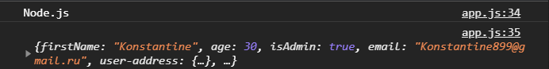

Что теперь касается записи свойств в объекте. Для того что бы перезаписать свойства в объекте мы обращмемся к этому объкту user, далее через точку или через квадратные скобки обращаюсь к какому-то полю, ставлю присваивание и перезаписываю значение.

```js
user.firstName = "Ekaterina";
value = user.firstName;

console.log(value);
```
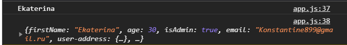

Если обратиться к свойству которого нет в этом объекте и занести в него значение, то это поле будет создано.

```js
const user = {
  firstName: "Konstantine",
  age: 30,
  isAdmin: true,
  email: "Konstantine899@gmail.ru",
  "user-address": {
    sity: "Витебск",
  },
  skills: [
    "html",
    "css",
    "scss",
    "WebPack",
    "Babel",
    "Node.js",
    "Express",
    "MongoDB",
    "Mongoose",
    "Eslint",
  ],
};

let value;
let prop = "skills";

value = user.firstName;
value = user["isAdmin"];
value = user["user-address"];
value = user["user-address"].sity;
value = user["user-address"]["sity"];

value = user[prop][5];

user.firstName = "Ekaterina";
value = user.firstName;

user.info = "Some info";
value = user.info;

console.log(value);
console.log(user);
```
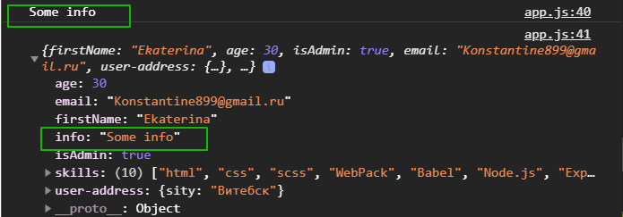

Как видим данное поле добавилось в объект user. 
Тоже самое если мы хотим перезаписать значение вложенного объекта. user["user-address"].sity = "Minsk";

```js
const user = {
  firstName: "Konstantine",
  age: 30,
  isAdmin: true,
  email: "Konstantine899@gmail.ru",
  "user-address": {
    sity: "Витебск",
  },
  skills: [
    "html",
    "css",
    "scss",
    "WebPack",
    "Babel",
    "Node.js",
    "Express",
    "MongoDB",
    "Mongoose",
    "Eslint",
  ],
};

let value;
let prop = "skills";

value = user.firstName;
value = user["isAdmin"];
value = user["user-address"];
value = user["user-address"].sity;
value = user["user-address"]["sity"];

value = user[prop][5];

user.firstName = "Ekaterina";
value = user.firstName;

user.info = "Some info";
value = user.info;

user["user-address"].sity = "Minsk";

console.log(value);
console.log(user);
```
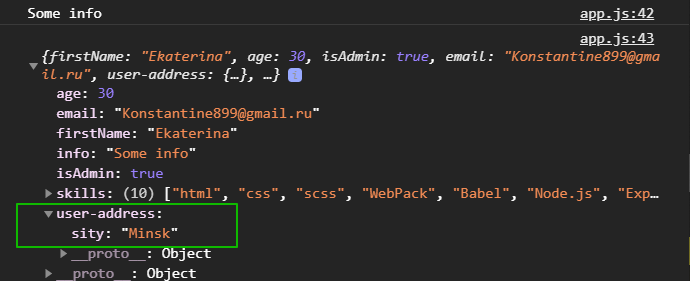

Точно так же можно создать.

```js
user["user-address"].country = "Belarus";
```
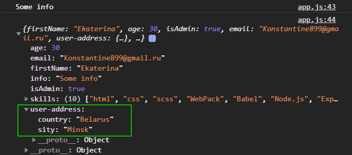

Единственная проблема которая может возникнуть это попытка добавить в несуществующий вложенный объект.

```js
user.plan.basic = "basic";
```
Когда мы пишем user.plan мы пытаемся обратиться к этому свойству оно = undefined и если мы к undefined пытаеся добавить свойство basic. В ошибке он говорит что он не может записать свойство basic у undefined. 
Если бы там изначально был бы объект, пустой например, то тогда этой проблемы бы небыло. Если есть объект, значит в него можно что-то записать.

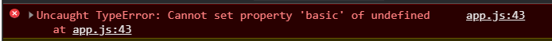

```js
const user = {
  firstName: "Konstantine",
  age: 30,
  isAdmin: true,
  email: "Konstantine899@gmail.ru",
  "user-address": {
    sity: "Витебск",
  },
  skills: [
    "html",
    "css",
    "scss",
    "WebPack",
    "Babel",
    "Node.js",
    "Express",
    "MongoDB",
    "Mongoose",
    "Eslint",
  ],
};

let value;
let prop = "skills";

value = user.firstName;
value = user["isAdmin"];
value = user["user-address"];
value = user["user-address"].sity;
value = user["user-address"]["sity"];

value = user[prop][5];

user.firstName = "Ekaterina";
value = user.firstName;

user.info = "Some info";
value = user.info;

user["user-address"].sity = "Minsk";
user["user-address"].country = "Belarus";

user.plan = {};
user.plan.basic = "basic";

console.log(value);
console.log(user);
```
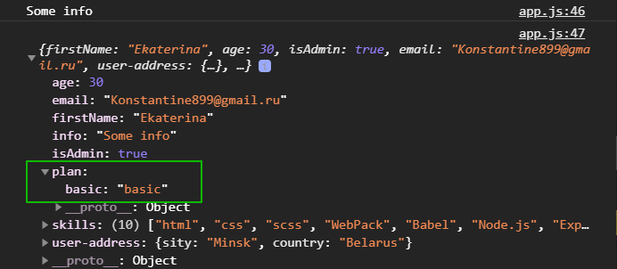