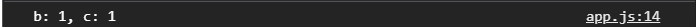
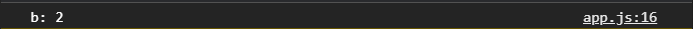
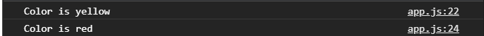
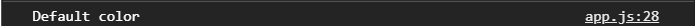
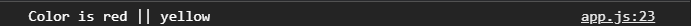

#Тернарный оператор и конструкция swich case.

[https://docs.google.com/presentation/d/1nRs0i7rRydj1K3HXO-64B3gK9ZpeMjafpLX0g0riOBM/edit?usp=sharing](https://docs.google.com/presentation/d/1nRs0i7rRydj1K3HXO-64B3gK9ZpeMjafpLX0g0riOBM/edit?usp=sharing),

[https://developer.mozilla.org/ru/docs/Web/JavaScript/Reference/Operators/%D0%A3%D1%81%D0%BB%D0%BE%D0%B2%D0%BD%D1%8B%D0%B9_%D0%BE%D0%BF%D0%B5%D1%80%D0%B0%D1%82%D0%BE%D1%80](https://developer.mozilla.org/ru/docs/Web/JavaScript/Reference/Operators/%D0%A3%D1%81%D0%BB%D0%BE%D0%B2%D0%BD%D1%8B%D0%B9_%D0%BE%D0%BF%D0%B5%D1%80%D0%B0%D1%82%D0%BE%D1%80)

```js
let a = 1;
let b = 0;

if (a > 0) {
  b = a;
} else {
  b += 1;
}

console.log(b);

```

Есть тернарные операторы - это оператор условный помогает сделать какое-то действие в зависимости от какого-то условия или выражения. Тернарный оператор чаще всего используется для того что бы что-то присвоить в переменную в зависимости от условия. 
Если мы возьмем пример выше, то увидим слишком много действий для того что бы присвоить переменной какое-то значение в зависимости от значения другой переменной.
Для этого так раз таки очень хорошо использовать тернарные операторы потому что они сокращают количество кода который вы будуте использовать.

Синтаксис: сначало пишется выражение, или же условие т.е. то что в результате будет преобразовано в **true** или **false**. После чего идет знак **?**, это непосредственно тот самый оператор, после которого идет действие которое выпониться если выражение правдиво. После идет **:** которое определяет действие **false**.

Как делать в принципе это не ошибка, но, тем не менее, не совсем верно

```js
a > 0 ? b = a : b += 1;

console.log(b);
```
Таким образом мы присваиваем значение в **b** и делаем выбор. Казалось бы все вроде бы логично и правильно, но не совсем. Но это можно зависать короче и это будет выглядеть логичнее.

Дело в том что тернарный оператор возвращает те значения которые были выбраны т.е. он возвращает то что было после знака вопроса, или после двоеточия.

Если я сделаю так

```js
let a = 1;
let b = 0;
let c = a > 0 ? b = a : b += 1;

console.log(`b: ${b}, c: ${c}`);
```


Оказывается что **с** тоже равно **1**. Это как раз таки результат работы тернарного оператрора который возвращает результат того что было выбрано. Поэтому если мы говорим о **b** и о том что мы хотим переопределять каку-то переменную **let c**, то это логично написать вот таким вот образом 

```js
let a = 1;
let b = 0;
b = a > 0 ? a : b + 1;

console.log(`b: ${b}`);
```
И дальше говорим если **a > 0**, то **a** (т.е. b = a), а иначе **b + 1**


Обычно тернарный оператор в таком формате и используют. Его не используют для сложной какое - то логики, потому что здесь нельзя выполнить множество действий. Точнее можно, но это будет не читабельно и 100% будет сбоить.

Во-вторых если разрастается тернарник, его сложно читать и не совсем понятно сразу что здесь происходит. Поэтому его обычно используют для определения чему равна переменная в зависимости от каких - то условий.
Тернарный оператор можно расширять. Мы можем писать более большие конструкции.

```js
// выражение ? если true : выражение ? если true : если false
```
Это своего рода **else if**. т.е. я говорю что если не **true**, то тогда давай проверим другое выражение и выполним какое-то действие.

```js
b = a > 0 ? 2 : a < 0 ? 3 : 0;

console.log(`b: ${b}`);
```


Таким образом у нас может быть такая цепочка до бесконечности. Но сходу это прочитать очень тяжело.

<br>
<br>
<br>

**Switch Case**

Используется тогда когда мы четко знаем что переменная может состоять из трех разных вариантов т.е. это всегда каких - то три четких значения.

```js
let color = "yellow";

switch (color) {
  case "yellow":
    console.log("Color is yellow");
  case "red":
    console.log("Color is red");
}
```


Однако в консоль выводится два значения. Это происходит потому что в **case** не добавлено специальное слово **break**, тем самым мы как бы прерываем работу **case** и дальше он не выполнит ни каких действий. 

Так же есть **default case**, он всегда пишется последним

```js
let color = "red";

switch (color) {
  case "yellow":
    console.log("Color is yellow");
    break;
  case "red":
    console.log("Color is red");
    break;
  default:
    console.log("Default color");
}
```


Default(по умолчанию), выводится если ни один из case не выполнился.

```js
let color = "";

switch (color) {
  case "yellow":
    console.log("Color is yellow");
    break;
  case "red":
    console.log("Color is red");
    break;
  default:
    console.log("Default color");
}
```


Еще раз повторюсь что в **switch case** мы определяем конкретные значения т.е. сы говорим что **color** или желтый или крассный или еще какой - то. Он не может быть больше, меньше или равен и т.д. Мы не можем здесь использовать операторы сравнения. Мы говорим четко из каких значений может быть данная переменная.

Это можно использовать в разных **select**, когда у нас есть четкий выбор одного из и мы четко знаем какой у нас набор значений **select** у его **option**. И мы как бы в зависимости от выбора выполним какое-то действие.

Так же case могут быть склеены. Например я хочу выполнить одно и тоже действие для двух **case**.

```js
let color = "red";

switch (color) {
  case "yellow":
  case "red":
    console.log("Color is red || yellow");
    break;
  default:
    console.log("Default color");
}
````


Или
```js
let color = "yellow";

switch (color) {
  case "yellow":
  case "red":
    console.log("Color is red || yellow");
    break;
  default:
    console.log("Default color");
}
```


И тоже выполняется. 
Если у вас есть **case** которые имеют одинаковые там, вызов функции или одинаковые действия, для того что бы не дублировать код вы можете склеить **case** т.е. это некое подобие **||**.