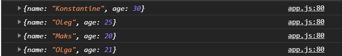

# Циклы

[https://docs.google.com/presentation/d/19_aP7liLVCaMOpWCTDbfpBkHeerRJxPTP2b6HmFK8xU/edit?usp=sharing](https://docs.google.com/presentation/d/19_aP7liLVCaMOpWCTDbfpBkHeerRJxPTP2b6HmFK8xU/edit?usp=sharing),

[https://learn.javascript.ru/while-for](https://learn.javascript.ru/while-for),

[https://learn.javascript.ru/object-for-in](https://learn.javascript.ru/object-for-in),

[https://frontender.info/es6-in-depth-iterators-and-the-for-of-loop/](https://frontender.info/es6-in-depth-iterators-and-the-for-of-loop/)

Одна из сложных тем. Очень часто нам нужно повторить како-то код некое количество раз. Или же нам нужно сгенерировать какие-то данные, например массив собрать или объект, или посчитать что-то перебрав массив и тому подобные задачи.
Для этого хорошо подходят циклы. Циклов в JS несколько.

Любой цикл, кроме **for of** и **for in**, состоит из нескольких частей.

1. Итератор - это счетчик который определяет сколько прошло итераций. Это шаг который нам нужно считать.
2. Условие. Пока условие действительно код будет выполняться и цикл будет работать. И это какое-то непосредственное действие которое увеличивает шаг. Или делает так что условие становится правдивым или в какой-то момент не правдивым.


Фигурные скобки это тело цикла которое будет выполняться пока в круглых скобках выражение будет true. У нас все идет построчно и пока все действия асинхронны, и пока не выполниться предыдущий код, следующий не начнет выполнятся.

Для того что бы нам взять какое-то количество, нам нужен итератор, нужно считать количество шагов в цикле.

для того что бы взять какое-то количество действий нам нужен итератор, нам нужно считать количество шагов в цикле. Обычно его называют **i**.

```js
let i = 0;

while (i < 10) {
  console.log(i);
}
```
Но такой цикл будет бесконечным по той причите что усливие никогда не будет **false** потому что **i** всегда остается нулем. 

Для того что бы условие и цикл прекратил свою работу нам нужно **i++** увеличивать, что бы в какой-то момент наш цикл остановился.

```js
// while, do while, for, for of, for in

let i = 0;

while (i < 10) {
  console.log(i);
  i++;
}
```


На самом деле это может быть упрощено

```js
// while, do while, for, for of, for in

let i = 0;

while (i++ < 10) {
  console.log(i);
}
```


Как вы помните у нас есть инкркмент и декркмент. Если **++** стоит после переменной, то он увеличит его на следующем шаге. т.е. он взял ноль и сравнил с десятью, ноль меньше десяти и это правда, потом произошло увеличение на еденицу. И по этому при ввыводе в консоль **i** уже равнялась **1**.
И когда итератор дошел до 9 он сравнил 9 с 10 и после чего произошло увеличение на еденицу и в консоль уже вывелась 10-ка.
Так это работает.

Однако в круглых скодках может быть не только условие, а любое выражение которое рано или поздно станет false что бы цикл прекратил свою работу. Либо останавливать сервер что бы не уходить в вечный цикл.

Мы можем сделать наоборот.

```js
let i = 10;

while (i--) {
  console.log(i);
}
```


Цикл остановил работу потому что ноль в Boolean представлении равен false.

<br>
<br>
<br>
<br>

**Цикл do while**

do while в отличие от while Сначало выполнит какое-то действие, а потом произойдет проверка условия.

```js
let i = 10;

while (i--) {
  console.log(i);
}

do {
  console.log("action");
} while (i > 0);
```


Если прямо в консоли мы попросим i то оно будет равно -1.

<br>
<br>
<br>
<br>

**Цикл for.**
Это более универсальный цикл и чаще всего используемый. Он состоит из нескольких частей. Ключевое слово for. Далее указываю инициализацию т.е. инициализирую итератор **i = 0**. Далее указываю условие **i < 10**, и дальше идет увеличение итератора** i++**. Точки с запятыми обязательны так как это разделение на части нашего цикла.

```js
for (let i = 0; i < 10; i++) {
  console.log(i);
}
```


Последовательность работы цикла for идет следующая. 
1. Cначало идет инициализация, единоразово **let i = 0;**
2. Проверка условия **i < 10;**
3. После чего выполняется тело цикла **console.log(i);**
4. После тела выполняется увеличение шага **i++**
5. И так по кругу пока итератор не получит **false**. т.е. пока условие правдиво цикл будет выполняться.

объявление переменной можно вынести выше. Можно убрать условие или его как-то поменять, но точки с запятыми должны оставаться.

Рассмотрим перебор строк. Перебирать можно любые итерируемые вещи в JS это массивы, строки и другие специфичные виды данных, объекты перебирать типо как **DOM-коллекции**. 


И так перебор строк.

В условии мы перебираем какую-то сущность, мы должны ориентироваться от ее длинны т.е. когда она закончится т.е. **str < str.length**.

```js
let str = "Hello";
let res = "";

for (let i = 0; i < str.length; i++) {
  console.log(i);
}
``` 
Если в консоль вывести **i** то мы все так же получим цифры.

т.е. индексы символов. Однако если обратиться к переменной и вызвать итератор **i**, то мы получим символы на каждой итерации.

```js
let str = "Hello";
let res = "";

for (let i = 0; i < str.length; i++) {
  console.log(str[i]);
}
```


На каждой итерации я получаю один символ из строки.

После чего я могу что-то сделать с сиволами.

```js
let str = "Hello";
let res = "";

for (let i = 0; i < str.length; i++) {
  console.log(str[i] + "!");
}
```


Могу присвоить значение в будушую строку 

```js
let str = "Hello";
let res = "";

for (let i = 0; i < str.length; i++) {
  res += str[i] + "*";
}
console.log(res);
```


<br>
<br>
<br>
<br>

Что касается массивов. Здесь принцип такой же.

```js
let colors = ["white", "black", "yellow", "orange"];

for (i = 0; i < colors.length; i++) {
  console.log(colors[i]);
}
```


Мы так же можем переопределить текущий элемент массива

```js
let colors = ["white", "black", "yellow", "orange"];

for (i = 0; i < colors.length; i++) {
  console.log(colors[i]);
  colors[i] = colors[i].toUpperCase();
}
console.log(colors);
```


Мы с вами увидим массив состоящий из этих же строк но состоящий из верхнего регистра.

Мы в цикле можем выполнять абсолютно любые действия, которые мы хотим сделать: вызовы функций, методов, присвоение, сравнение и т.д.

С массивами это отдельная тема потому что будет работа с методами. Это сортировка. Это перебирающие методы. 

Некоторые вещи с массивами можно сделать намного короче с помощью перебирающих методов. 

Мы можем перебирать массивы с объектами. Вообще очень часто приходят массивы с объектами которые нужно перебрать.

<br>
<br>
<br>
<br>

Однако сначало рассмотрим такие ключевые слова как  **break** и **continue**. 
**Continue** - это ключевое слово которое заставляет прекратить итерацию, или пропустить итерацию.

```js
for (let i = 0; i < 10; i++) {
  if (i === 5) {
    continue;
  }
  console.log(i);
}
```
После 4 не выводится 5.


Итерация была пропущена.

**Break** работает наоборот. Он останавливает дальнейшее итерирование цикла.

```js
for (let i = 0; i < 10; i++) {
  if (i === 5) {
    break;
  }
  console.log(i);
}
```


Т.е. если мы к примеру хотели найти определенного пользователя и мы его нашли, то незачем дальше производить поиск.

<br>
<br>
<br>
<br>

**Перебор массива объектов.**

```js
const users = [
  {
    name: "Konstantine",
    age: 30,
  },
  {
    name: "Oleg",
    age: 25,
  },
  {
    name: "Maks",
    age: 20,
  },
  {
    name: "Olga",
    age: 21,
  },
];

for (i = 0; i < users.length; i++) {
  console.log(users[i]);
}
```


И через точку в console.log я могу получить доступ к любому из свойст объекта.

```js
const users = [
  {
    name: "Konstantine",
    age: 30,
  },
  {
    name: "Oleg",
    age: 25,
  },
  {
    name: "Maks",
    age: 20,
  },
  {
    name: "Olga",
    age: 21,
  },
];

for (i = 0; i < users.length; i++) {
  console.log(users[i].name);
}
```


Или года

```js
const users = [
  {
    name: "Konstantine",
    age: 30,
  },
  {
    name: "Oleg",
    age: 25,
  },
  {
    name: "Maks",
    age: 20,
  },
  {
    name: "Olga",
    age: 21,
  },
];

for (i = 0; i < users.length; i++) {
  console.log(users[i].age);
}
```


При этом мы можем сформировать из этого массива объект.


Создаю пустой объект. И я хочу что бы в этом объекте ключами были имена, а значения были объектами.

```js
const users = [
  {
    name: "Konstantine",
    age: 30,
  },
  {
    name: "Oleg",
    age: 25,
  },
  {
    name: "Maks",
    age: 20,
  },
  {
    name: "Olga",
    age: 21,
  },
];

const usersObject = {};

for (i = 0; i < users.length; i++) {
  usersObject[users[i].name] = users[i];
}

console.log(usersObject);
```


Когда я обращаюсь к **usersObject[]** я могу подставлять сюда переменную, вычисляемое значение, и оно будет являться ключем в этом объекте. Если в этом объекте этого ключа нет, то он будет создан. Я могу записать туда **users[i].name**, таким образом я создаю в объекте **usersObject** создаю поле с именем пользователя на текущей итерации и запишем туда **users[i]**.

При выоде в консоль я получаю объект имен, в каждом их которых есть объект который ему принадлежал.

И теперь я могу в отдельности получить интересующий меня объект.

```js
const users = [
  {
    name: "Konstantine",
    age: 30,
  },
  {
    name: "Oleg",
    age: 25,
  },
  {
    name: "Maks",
    age: 20,
  },
  {
    name: "Olga",
    age: 21,
  },
];

const usersObject = {};

for (i = 0; i < users.length; i++) {
  usersObject[users[i].name] = users[i];
}

console.log(usersObject['Olga']);
```


<br>
<br>
<br>
<br>

**Циклы for of и for in.**

Цикл **for in** нужен для перебора объектов. 


Здесь все очень просто. Здесь нет итератора. Этот цикл проходится по всем ключам объекта до тех пор пока они не закончатся. После лет я могу произвольно назвать переменную **key**, далее пишу **in** и после пишу объект который хочу перебрать. 

В **key** будет содержаться ключ на каждой итерации.

```js
const user = {
  name: "Konstantine",
  age: 30,
};

for (let key in user) {
  console.log(key);
}
```


Я получаю ключи объекта.

С помощью этих ключей я могу получить значение в этом ключе. Обращаюсь к объекту **user** и в квадратных скобках указываю переменную которую хочу отобразить. Не через точку, а именно через квадратные скобки так как это переенная.

```js
const user = {
  name: "Konstantine",
  age: 30,
};

for (let key in user) {
  console.log(key);
  console.log(user[key]);
}
```


<br>
<br>
<br>
<br>

**Цикл for of**

Служит для более удобного перебора массивов. Обратите внимание я здесь не пишу итераторы, шаги и условия. Он проходится по всему массиву. Он так же имеет ключивые слова **break** и **continue**.

```js
const users = [
  {
    name: "Konstantine",
    age: 30,
  },
  {
    name: "Oleg",
    age: 25,
  },
  {
    name: "Maks",
    age: 20,
  },
  {
    name: "Olga",
    age: 21,
  },
];

for (let value of users) {
  console.log(value);
}
```

