# Введение в функции

[https://docs.google.com/presentation/d/1dHzcwDWIv_ybcmcI60UaalmB2o1brJOXhthDbJ4wecw/edit?usp=sharing](https://docs.google.com/presentation/d/1dHzcwDWIv_ybcmcI60UaalmB2o1brJOXhthDbJ4wecw/edit?usp=sharing),

[https://learn.javascript.ru/function-basics](https://learn.javascript.ru/function-basics)


Функция - это один из важнейших элементов любого языка программирования. Я вляется неким строительным элементом любого приложения. Все состоит из набора функций.

Функции могут быть разными, по разному вызываться. Здесь будут рассматриваться основы объявления функций и какие есть у них нюансы. Познакомимся с параметрами функций. Возвращаемыми значениями функций. Значениями по умолчанию и т.д.

В будущем рассмотрим стрелочные функции. Функции как методы. У них есть так же определенные отличияю

Есть несколько типов объявления функций.

**1.** function declaration (Объявление функции) 
**2.** function expression

**Function declaration**. Рассмотрим как выглядит.

```js
function sayHallo() {
  console.log("Hello world");
}
```


Пишу ключевое слово **function**, далее указываю(создаю) имя функции **sayHello()**, круглые скобки ставлю обязательно так как в них указываются параметры функции. После парамтров ставлю фигурные скобки, это тело функции. В теле функции должна содержаться вся логика работы этой функции.

Функции не должны быть очень большими по объему и они должны быть достаточно лаконичными и понятными. Так же еще один очень важный нюанс, это то что функции должны быть чистыми, это значит что функция не должна изменять глобальные переменные, она должна работать только с входными параметрами, в том числе если у нас есть массивы или объекты, то их желательно копировать, потому что как вы помните они передаются по ссылке. Соответственно при их изменении внутри фуункции они могут быть проблемы. 

Функции можно множество раз вызывать т.е. это очень хороший инструмент который позволяет единоразово написать каку-то логику и потом переиспользовать ее множество раз в вашем приложении. Для того что бы вызвать функцию достаточно прописать **sayHello()** и поставить круглые скобки.

```js
function sayHallo() {
  console.log("Hello world");
}
sayHallo();
```


Если не поставить круглые скобки, то в консоль выведеться тело функции (не знаю у меня вообще ничего не вывелось).

**Function declaration** (Объявление функции) имеет такую специфику что они всплывают, как и переменные **var** примерно, и функция объявленная с помощью **function declaration** доступны в любом месте кода.

Даже если я вызову функцию до ее фактического объявления.

```js
sayHallo();

function sayHallo() {
  console.log("Hello world");
}
```


Дело в том что браузер проходит по документу, собирает все функции и выносит вверх.

Входные параметры функций. 
Функция должна возвращать какой - то результат, она должна выполнять какие - действия и чаще всего она ее выполняет в зависимости от каких-то входных параметров или аргументов. Поэтому нужны какие-то передаваемые в функцию данные.

Через запятую в круглых скобках указываю параметры.

```js
function sayHallo(firstName, lastName) {
  console.log(firstName, lastName);
  console.log("Hello world");
}
sayHallo();
```


Изначально параметры не определены **undefined**, потому что мы ничего не передаем.
Для того что бы передать в функцию аргументы, мы их должны передать при вызове в круглых скобках в том же порядке в котором мы их объвили в функции.

```js
function sayHallo(firstName, lastName) {
  console.log(firstName, lastName);
  console.log("Hello world");
}
sayHallo('Konstantine','Atroshchenko');
```


И тогда я получаю к ним доступ внутри функции. Когда я объявляю аргументы - это фактически объявленные переменные. Это именно переменные. Они нам доступны в теле функции. Мы их можем изменять, перезаписывать и т.д. 
Таким образом я получил имя и фамилию и таким образом я могу с ними делать что-то.
Мы можем возвращать значение функции. Вообще функция всегда что-то возвращает, потому что, нам нужно получать от нее результат.
Если мы попытаемся присвоить результат функции в переменную и вывести ее в консоль.

```js
function sayHallo(firstName, lastName) {
  console.log(firstName, lastName);
  console.log("Hello world");
}
let res = sayHallo("Konstantine", "Atroshchenko");

console.log(res);
```
то мы увидим что в консоли выведеться **undefined**

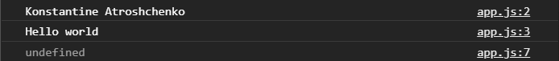

По умолчанию если в функции не указано что она возвращает, она возвращает **undefined**. Для того что бы указать что функция должна вернуть мы должны написать ключевое слово **return**, и дальше указать значение или выражение которое мы хотим вернуть. Если мы укажем выражение, то оно будет посчитано, обработано и его результат будет возвращен из этой функции.
Например я могу вернуть шаблонную строку

```js
function sayHallo(firstName, lastName) {
  console.log(firstName, lastName);
  console.log("Hello world");
  return `Hello ${firstName} ${lastName}`;
}
let res = sayHallo("Konstantine", "Atroshchenko");

console.log(res);
```
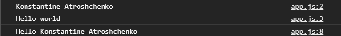

Если я передам другие параметры и присвою другой переменной.

```js
function sayHallo(firstName, lastName) {
  console.log(firstName, lastName);
  console.log("Hello world");
  return `Hello ${firstName} ${lastName}`;
}
let res = sayHallo("Konstantine", "Atroshchenko");
let res2 = sayHallo("Nikita", "Atroshchenko");

console.log(res2);
```
То как видите я уже получу другой результат.


Что очень удобно. Функция одна и для разных входных данных она выполняет одно и тоже действие, и возвращает нам какой-то результат.

С этим результатом так же можно что-то делать.

```js
function sayHallo(firstName, lastName) {
  console.log(firstName, lastName);
  console.log("Hello world");
  return `Hello ${firstName} ${lastName}`;
}
let res = sayHallo("Konstantine", "Atroshchenko");
let res2 = sayHallo("Nikita", "Atroshchenko") + "!";

console.log(res2);
```


т.е. я могу с результатом работы функции выполнять какие-то еще дополнительные действия. Арифметически все что угодно. Могу проверять, если там возвращается true то тогда делаем там что-то.
После return функция прекращает свое выполнение т.е. дальше код не выполняется. Если попробовать законсолить все что мы написали после return. Во-первых редактор подсветит то что это не возможно и у нас ничего не выведеться.

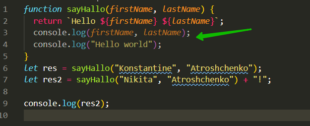

return может быть несколько т.е. я могу изначально делать какие-то проверки и не давать выполняться функциям, если например мне не переданы какие - то параметры. Т.е. я могу сделать проверку.

```js
function sayHallo(firstName, lastName) {
  if (!firstName) return;
  console.log(firstName, lastName);
  console.log("Hello world");
  return `Hello ${firstName} ${lastName}`;
}
let res = sayHallo("Konstantine", "Atroshchenko");
let res2 = sayHallo("Nikita", "Atroshchenko") + "!";

console.log(res2);
```
Т.е. если нет **firstName** с помощью **return** я могу остановить дальнейшее выполнение, или вывести в консоль или return какой - то ошибки. Т.е. я могу выполнить какое-то действие и если данных нет то прекратить работу функции.

```js
function sayHallo(firstName, lastName) {
  if (!firstName) return;
  console.log(firstName, lastName);
  console.log("Hello world");
  return `Hello ${firstName} ${lastName}`;
}
let res = sayHallo("Konstantine", "Atroshchenko");
let res2 = sayHallo("Nikita", "Atroshchenko") + "!";
let res3 = sayHallo();

console.log(res2);
```
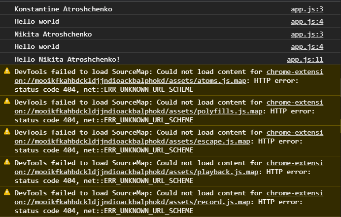

Как видим функция дальше не выполняется.

При вызове **res3** выводится **undefined**

```js
function sayHallo(firstName, lastName) {
  if (!firstName) return;
  console.log(firstName, lastName);
  console.log("Hello world");
  return `Hello ${firstName} ${lastName}`;
}
let res = sayHallo("Konstantine", "Atroshchenko");
let res2 = sayHallo("Nikita", "Atroshchenko") + "!";
let res3 = sayHallo();

console.log(res3);
```
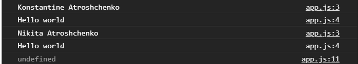

Далее я могу вывести ошибку.

```js
function sayHallo(firstName, lastName) {
  if (!firstName) return console.log("Error");
  console.log(firstName, lastName);
  console.log("Hello world");
  return `Hello ${firstName} ${lastName}`;
}
let res = sayHallo("Konstantine", "Atroshchenko");
let res2 = sayHallo("Nikita", "Atroshchenko") + "!";
let res3 = sayHallo();

console.log(res3);
```
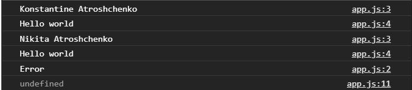

При этом если данные переданы то функция будет выполняться как вы видите чуть выше в консоли.

<br>
<br>
<br>
<br>

**Значение аргументов функции по умолчанию.**

С приходом новых стандартов это стало доступно. Это значит то что если в нашу функцию не переданы какие - то параметры, мы можем выставить какие - то значения по умолчанию. 
Как говорилось ранее, аргументы это вроде переменных. Прямо в передаче аргументов присваиваю им значения по умолчанию.

```js
function sayHallo(firstName = "Default", lastName = "Default") {
  if (!firstName) return console.log("Error");
  console.log(firstName, lastName);
  console.log("Hello world");
  return `Hello ${firstName} ${lastName}`;
}
let res = sayHallo("Konstantine", "Atroshchenko");
let res2 = sayHallo("Nikita", "Atroshchenko") + "!";
let res3 = sayHallo();

console.log(res3);
```
Теперь при вызове **res3** я в консоли получаю.

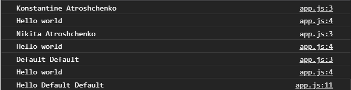

Это упрощает работу т.к. придется писать меньше проверок на то что у нас есть какие-то входные данные. И мы можем, если их не передали по каким - то причинам, поставить по умолчанию.

Если попробовать передать какое-то значение.

```js
function sayHello(firstName = "Default", lastName = "Default") {
  console.log(firstName, lastName);
  console.log("Hello world");
  return `Hello ${firstName} ${lastName}`;
}
// let res = sayHallo("Konstantine", "Atroshchenko");
// let res2 = sayHallo("Nikita", "Atroshchenko") + "!";
let res3 = sayHello(null);

console.log(res3);
```
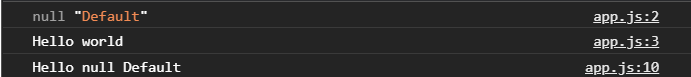

То мы увидим что в функцию поподает **null** и **"Default"**, потому что значение функции по умолчанию подставляются только в случае если ничего не передано. Если же передано даже не валидное значение в плане к преобразования к **false** оно все равно будет считаться как переданным значением. По-этому с этим нужно быть аккуратным. Это стоит все равно проверять что у нас не переданы какие-то данные нужного типа, и далее в тех местах где возможно попадание таких параметров.

<br>
<br>
<br>
<br>

**Область видимости функций.**

Есть глобальная область видимости - это наше глобальное пространство в котором пишем код, это доступ к объекту **window** к его функционалу таким как **console.log**, **alert** и т.д. И все переменные объявленные в этом файле без обертки в функцию, будут являться глобальными и будут доступны из любого места нашего кода.

```js
let x = 10;

function foo(params) {
  x = 20;
  console.log(x);
}
foo();

console.log(x);
```


Если мы обращаемся к какой-то переменной внутри функции без ее объявления, то эта переменная сначало ищется в рамках функции  (тело функции), возможно она была где-то объявлена, потом она будет искаться в параметрах функции и если ее там нет, то поиск выйдет на уровень выше в глобальное пространство.

Глядя на функцию приведенную выше. Сейчас я не объявлял переменную **х** нигде внутри функции, он посмотрел что внутри функции переменной не было объявлено, в параметрах ее нет. Он ее нашел в глобальном пространстве и изменил, таким образом переменная изменилась в глобальном пространстве в том числе. Это очень плохая практика. Функции не должны переопределять переменные в глобальном пространстве. Они должны работать только внутри себя созданными переменными и переданными им аргументами.

Теперь объявляю переменную внутри функции.

```js
let x = 10;

function foo(params) {
 let x = 20;
  console.log(x);
}
foo();

console.log(x);
```


И теперь я вижу другую ситуацию. Переменная объявленная внутри функции **let x = 20** при вызове функции **foo()** выводит в консоль **20**. А глобальная переменная выводится в **console.log(x)** и равняется **10**-ти.

Если мы объявляем переменную внутри функции, то она считается локальной и доступна только внутри функции. Если мы хотим ее получить снаружи нужно вернуть либо переменную либо результат.

```js
let x = 10;

function foo(params) {
  let x = 20;
  console.log(x);
  return x;
}
foo();

console.log(x);
```
В том числе если я объявлю эту переменную в аргументах.

```js
let x = 10;

function foo(x) {
   x = 20;
  console.log(x);
  return x;
}
foo();

console.log(x);
```
то произойдет все тоже самое.


Внутри функции выведется цифра 20, а вне функции останется цифра 10. Потому что как я говорил что объявленные в аргументах параметры, являются фактически объявлением переменной и они являются локальными и доступными только внутри функции и не доступны снаружи. **На это нужно обращать внимание и быть очень внимательным. В том чиле это касается и объектов.**

```js
const user = {
  name: "Konstantine",
  age: 30,
};

function getObj(obj) {
  console.log(obj);
}

getObj(user);
```
Я получаю внутри функции объект.

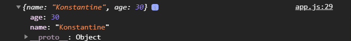

Изменяю в нем поле name

```js
const user = {
  name: "Konstantine",
  age: 30,
};

function getObj(obj) {
  console.log(obj);
  obj.name = "Kos";
}

getObj(user);

```

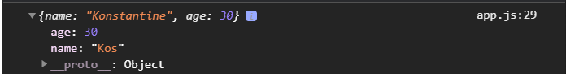

Если посмотреть на объект в консоли он хотя и пишет **name: "Konstantine"** - это было до определения. Но если я разверну объект то увижу. Так как объекты передаются по ссылке то я увижу обновленный объект с **name: "Kos"**.

Если я попробую вызвать в консоль после вызова функции, то я увижу что он уже изменен.

```js
const user = {
  name: "Konstantine",
  age: 30,
};

function getObj(obj) {
  obj.name = "Kos";
}

getObj(user);
console.log(user);
```

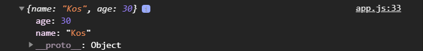

то увижу что он уже изменен.

Не смотря на то что я передаю объект в аргументы, я передаю ссылку на сам объект. Поэтому его нужно будет копировать, что бы у нас небыло таких проблем и с этим мы познакомимся чуть позже как копировать объекты и массивы в том числе. Но уже сейчас вы должны помнить об этой специфике и быть очень аккуратными с таким рода вещей. Такого не должно происходить т.е. передаваемые объекты не должны изменяться, либо они должны копироваться изменяться и возвращаться.

И так мы рассмотреди формат объявления функций **function declaration**. 

<br>
<br>
<br>
<br>

Еще один формат объявления функций это **function expression**.

Он фактически может делать все то же что и **function declaration** принимать аргументы, возвращать и все т.д. Единственно отличается формат объявления.


Мы его объявляем записывая в переменную т.е. мы присваиваем в переменную функцию.

```js
let square = function (x) {
  return x * x;
};
```
C таким объявлением соответственно складываются несколько нюансов, а точнее нюанс касающийся того что мы не можем вызвать эту функцию до ее фактического присвоения в переменную. Она не будет доступна нам и мы не сможем ее вызвать.
В остальном все тоже самое. Есть возможность что **function declaration** не везде можно будет объявить в отличие от **function expression**.


**Так же есть еще самовызывающаяся функция. Которая выглядит следующим образом.**

Ставим круглые скобки, пишу ключевое слово **function**, ставлю круглые скобки для принятия параметров, имя не задаю, далее ставлю фигурные скобки. Далее после фигурных скобок, либо после круглых скобок основных, мы должны поставить скобки вызова круглые. Таким образом мы сразу же вызовем функцию. И в эти круглые скобки передаем параметры.

```js
(function (msg) {
  console.log(msg);
})("Hello World");
```
Функция самовызывающаяся и при этом еще и ананимная потому что у нее нет имени, она вызывается сразу же когда ее прочитает интерпретатор. Она будет сразу вызвана и выполнена.

Часто в такие функции заворачивают основной код. При этом ей могут быть переданые какие - то входные данные с которыми она может работать или не работать. Внутри дальше реализуется какая - то логика. Это все нужно для того что бы инкапсулировать и закрыть доступ к конфликтам с глобальным пространством для того что бы не дай бог имена которые мы объявляем не были объявлены где то в другом коде либо в глобальном пространстве за счет чего произойдет поломка приложения. Таким образом мы как бы закрываем весь функционал фнутри самовызывающейся функции т.к. в функции есть локальная область видимости, то переменные видны толко в данной функции и не видны снаружи.