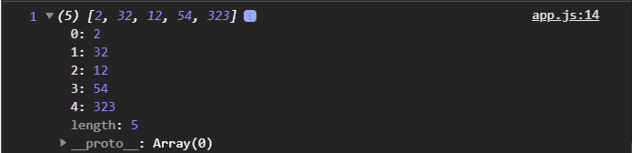

# Методы массивов

[https://learn.javascript.ru/array-methods](https://learn.javascript.ru/array-methods),

[https://www.freecodecamp.org/news/lets-clear-up-the-confusion-around-the-slice-splice-split-methods-in-javascript-8ba3266c29ae/](https://www.freecodecamp.org/news/lets-clear-up-the-confusion-around-the-slice-splice-split-methods-in-javascript-8ba3266c29ae/)

Рассмотрим базовые методы массивов и некоторые нюансы массивов.

```js
const numArr = [2, 32, 1234, 54, 323];

let value;

console.log(value, numArr);
```

Как и у строк у массивов есть длинна.

```js
const numArr = [2, 32, 1234, 54, 323];

let value;

value = numArr.length;

console.log(value, numArr);
```


Длинна это пять элементов. Счет в массиве так же как и со строками начинается с нулевого индекса. 
С длинной нужно быть немного аккуратным потому что можно сделать например вот так.

```js
const numArr = [2, 32, 1234, 54, 323];

let value;

value = numArr.length;
numArr.length = 0;

console.log(value, numArr);
```


И мы получаем пустой массив. 
или еще вариант.

```js
const numArr = [2, 32, 1234, 54, 323];

let value;

value = numArr.length;
numArr.length = 0;
numArr.length = 100;

console.log(value, numArr);
```


И получаем массив в 100 пустых значений. Это очень критично. Потому что массив это объект **length** его свойство и мы его перезаписываем. Соответственно происходят такие изменения и за этим нужно следить.

Как проверить что массив является массивом?

```js
const numArr = [2, 32, 1234, 54, 323];

let value;

value = numArr.length;
value = Array.isArray(numArr);

console.log(value, numArr);
```


 Есть специальная функция **Array.isArray()**, которая нам позволяет приняв массив сказать является ли этот элемент массивом. True говорит о том что является массивом.

 При этом есть еще несколько аналогичных способов.

Получить какой - то элемент массива я могу по его индексу

```js
const numArr = [2, 32, 1234, 54, 323];

let value;

value = numArr.length;
value = Array.isArray(numArr);
value = numArr[2];

console.log(value, numArr);
```


Я могу так же перезаписать это значение

```js
const numArr = [2, 32, 1234, 54, 323];

let value;

value = numArr.length;
value = Array.isArray(numArr);
value = numArr[2];
numArr[2] = 12;

console.log(value, numArr);
```


Тем самым во втором индексе меняется значение.

В массиве довольно много методов. Мы рассмотрим простые: добавление, удаление из массива. И есть более сложные такие как: перебирающие методы, сортировка и т.д.

Как и у строк у массивов есть метод **indexOf()** и в параметры передается искомый элемент, в данном случае число к примеру **32**.

```js
const numArr = [2, 32, 1234, 54, 323];

let value;

value = numArr.length;
value = Array.isArray(numArr);
value = numArr[2];
numArr[2] = 12;

value = numArr.indexOf(32);

console.log(value, numArr);
```


И выдает индекс под которым находится данное значение.

Методы которые могут менять массив т.е. добавление и удаление из массива. Для добавления есть два метода и для удаления есть два метода.
Отличаются они соответственно тем как они добавляют точнее куда они добавляют. Есть метод **push** и **pop**. **Push** - добавляет в конец ммассивы. **Pop** - удаляет с конца.

```js
const numArr = [2, 32, 1234, 54, 323];

let value;

value = numArr.length;
value = Array.isArray(numArr);
value = numArr[2];
numArr[2] = 12;

value = numArr.indexOf(32);
value = numArr.push(100);

console.log(value, numArr);
```


В конец массива добавилась цифра 100.

<br>
<br>
<br>
<br>

Метод **pop()**

```js
const numArr = [2, 32, 1234, 54, 323];

let value;

value = numArr.length;
// numArr.length = 0;
// numArr.length = 100;
value = Array.isArray(numArr);
value = numArr[2];
numArr[2] = 12;

value = numArr.indexOf(32);
value = numArr.push(100);
value = numArr.pop();

console.log(value, numArr);
```


Метод pop не принимает ни каких параметров. Он удаляет с конца один элемент массива и возвращает нам этот элемент т.е. в **value** мы получим сам элемент а длинна массива становится короче.

Противоположные им методы есть **shift** и **unshift**. **unshift** добавляет в начало и так же возвращает общую длинну.

```js
const numArr = [2, 32, 1234, 54, 323];

let value;

value = numArr.length;
value = Array.isArray(numArr);
value = numArr[2];
numArr[2] = 12;

value = numArr.indexOf(32);
value = numArr.push(100);
value = numArr.pop();
value = numArr.unshift(111);

console.log(value, numArr);
```


Метод **shift** удаляет сначало первый элемент и возвращать этот удаленный элемент.

```js
const numArr = [2, 32, 1234, 54, 323];

let value;

value = numArr.length;
value = Array.isArray(numArr);
value = numArr[2];
numArr[2] = 12;

value = numArr.indexOf(32);
value = numArr.push(100);
value = numArr.pop();
value = numArr.unshift(111);
value = numArr.shift();

console.log(value, numArr);
```


Мы можем так же часть массива обрезать используя метод **slice()**, так же как и строками принимает стартовое и конечное значение не вклячая конечного.

```js
const numArr = [2, 32, 1234, 54, 323];

let value;

value = numArr.length;
value = Array.isArray(numArr);
value = numArr[2];
numArr[2] = 12;

value = numArr.indexOf(32);
value = numArr.push(100);
value = numArr.pop();
value = numArr.unshift(111);
value = numArr.shift();
value = numArr.slice(0, 2);

console.log(value, numArr);
```


Он не изменяет исходный массив, что очень важно есть нюанс часть методов изменяют исходный массив и это бывает очень опасно. Он нам возвращает то что он взял из массива, т.е. ту часть которую он вырезал и соответственно мы с ним можем что-то сделать.

<br>
<br>
<br>
<br>
<br>

Есть метод довольно универсальный **splice()** он принимает стартовое значение, стартовый индекс и дает нам удалить какое-то количество из массива

```js
const numArr = [2, 32, 1234, 54, 323];

let value;

value = numArr.length;
value = Array.isArray(numArr);
value = numArr[2];
numArr[2] = 12;

value = numArr.indexOf(32);
value = numArr.push(100);
value = numArr.pop();
value = numArr.unshift(111);
value = numArr.shift();
value = numArr.slice(0, 2);
value = numArr.splice(1, 1);

console.log(value, numArr);
```


**splice** изменил массив. Он вернул ввиде массива то что он вырезал, то что он удалил это цифра **32**. Если я попробую удалить два элемента, то он вернет массив из двух элементов.

```js
const numArr = [2, 32, 1234, 54, 323];

let value;

value = numArr.length;
value = Array.isArray(numArr);
value = numArr[2];
numArr[2] = 12;

value = numArr.indexOf(32);
value = numArr.push(100);
value = numArr.pop();
value = numArr.unshift(111);
value = numArr.shift();
value = numArr.slice(0, 2);
value = numArr.splice(1, 2);

console.log(value, numArr);
```


Помимо этого **splice** позволяет на их место что-то добавить т.е. с этого места откуда я удалил я могу добавить новый элемент.

```js
const numArr = [2, 32, 1234, 54, 323];

let value;

value = numArr.length;
value = Array.isArray(numArr);
value = numArr[2];
numArr[2] = 12;

value = numArr.indexOf(32);
value = numArr.push(100);
value = numArr.pop();
value = numArr.unshift(111);
value = numArr.shift();
value = numArr.slice(0, 2);
value = numArr.splice(1, 2, "one", "two");

console.log(value, numArr);
```


Если я не хочу ничего удалять и мне нужно добавить с нужного индекса мы вместо удаляемого значения ставим ноль.

```js
const numArr = [2, 32, 1234, 54, 323];

let value;

value = numArr.length;
value = Array.isArray(numArr);
value = numArr[2];
numArr[2] = 12;

value = numArr.indexOf(32);
value = numArr.push(100);
value = numArr.pop();
value = numArr.unshift(111);
value = numArr.shift();
value = numArr.slice(0, 2);
value = numArr.splice(1, 2, "one", "two");
value = numArr.splice(1, 0, "one", "two");

console.log(value, numArr);
```


И тогда ничего не удаляется, а просто добавляются в массив те элементы которые я передаю в массив, следующим индексом от которого мы указали.

<br>
<br>
<br>
<br>
<br>
<br>

Далее есть метод **reverse()** он переворачивает массив.

```js
const numArr = [2, 32, 1234, 54, 323];

let value;

value = numArr.length;
value = Array.isArray(numArr);
value = numArr[2];
numArr[2] = 12;

value = numArr.indexOf(32);
value = numArr.push(100);
value = numArr.pop();
value = numArr.unshift(111);
value = numArr.shift();
value = numArr.slice(0, 2);
value = numArr.splice(1, 2, "one", "two");
value = numArr.reverse();

console.log(value, numArr);
```


**Как - то по моему он его нихрена не перевернул.**


<br>
<br>
<br>
<br>
<br>

Так же есть метод **concat()** который позволяет конкотенировать несколько массивов. В параметры я могу передать мой массив.

```js
const numArr = [2, 32, 1234, 54, 323];

let value;

value = numArr.length;
value = Array.isArray(numArr);
value = numArr[2];
numArr[2] = 12;

value = numArr.indexOf(32);
value = numArr.push(100);
value = numArr.pop();
value = numArr.unshift(111);
value = numArr.shift();
value = numArr.slice(0, 2);
value = numArr.splice(1, 2, "one", "two");
value = numArr.reverse();
value = numArr.concat(numArr);

console.log(value, numArr);
```


Я получаю копию. **concat()** кстати как и **slice()** может сделать копию массива. Если в **slice** ничего не передать, то он соответственно вернет копию массива. concat в том числе копирует текущий массив, добавляет то что я передаю в параметры **concat** и соответственно возвращает нам это. 

В **concat()** я могу передать как массивы, так и просто числа через запятую и он их соответственно добавит в конец т.е. сконкотенирует с массивом.
**concat()** я могу использовать вызывая его у пустого массива.

```js
const numArr = [2, 32, 1234, 54, 323];

let value;

value = numArr.length;
value = Array.isArray(numArr);
value = numArr[2];
numArr[2] = 12;

value = numArr.indexOf(32);
value = numArr.push(100);
value = numArr.pop();
value = numArr.unshift(111);
value = numArr.shift();
value = numArr.slice(0, 2);
value = numArr.splice(1, 2, "one", "two");
value = numArr.reverse();
value = numArr.concat(numArr);
value = [].concat(1, 2, 3);

console.log(value, numArr);
```


<br>
<br>
<br>
<br>
<br>

Далее рассмотрим метод **join()**.Он делает из массива строку принимая разделитель. Если разделитель не передан он нам вернет массив ввиде строки через запятую.

```js
const numArr = [2, 32, 1234, 54, 323];

let value;

value = numArr.length;
value = Array.isArray(numArr);
value = numArr[2];
numArr[2] = 12;

value = numArr.indexOf(32);
value = numArr.push(100);
value = numArr.pop();
value = numArr.unshift(111);
value = numArr.shift();
value = numArr.slice(0, 2);
value = numArr.splice(1, 0, "one", "two");
value = numArr.reverse();
value = numArr.concat(1, 2);
value = numArr.join();

console.log(value, numArr);
```


Если передаю пустую строку он возвращает слитно весь массив ввиде строки.

```js
const numArr = [2, 32, 1234, 54, 323];

let value;

value = numArr.length;
value = Array.isArray(numArr);
value = numArr[2];
numArr[2] = 12;

value = numArr.indexOf(32);
value = numArr.push(100);
value = numArr.pop();
value = numArr.unshift(111);
value = numArr.shift();
value = numArr.slice(0, 2);
value = numArr.splice(1, 0, "one", "two");
value = numArr.reverse();
value = numArr.concat(1, 2);
value = numArr.join("");

console.log(value, numArr);
```


Если передать пробел он возвращает весь массив через пробел.

```js
const numArr = [2, 32, 1234, 54, 323];

let value;

value = numArr.length;
// numArr.length = 0;
// numArr.length = 100;
value = Array.isArray(numArr);
value = numArr[2];
numArr[2] = 12;

value = numArr.indexOf(32);
value = numArr.push(100);
value = numArr.pop();
value = numArr.unshift(111);
value = numArr.shift();
value = numArr.slice(0, 2);
value = numArr.splice(1, 0, "one", "two");
value = numArr.reverse();
value = numArr.concat(1, 2);
value = numArr.join(" ");

console.log(value, numArr);
```


<br>
<br>
<br>
<br>

И есть метод который позволяет нам из строки сделать массив **split()** который разбивате строку на массив. Если мы ничего не предаем в параметры, то он возвращает строку переданную в массив ввиде одного элемента.

```js
const numArr = [2, 32, 1234, 54, 323];

let value;

value = numArr.length;
value = Array.isArray(numArr);
value = numArr[2];
numArr[2] = 12;

value = numArr.indexOf(32);
value = numArr.push(100);
value = numArr.pop();
value = numArr.unshift(111);
value = numArr.shift();
value = numArr.slice(0, 2);
value = numArr.splice(1, 0, "one", "two");
value = numArr.reverse();
value = numArr.concat(1, 2);
value = numArr.join(" ");
value = 'hello world'.split();

console.log(value, numArr);
```


Если я в параметр передам пуструю строку то нам каждую букву разобъет на отдельный элемент массива.

```js
const numArr = [2, 32, 1234, 54, 323];

let value;

value = numArr.length;
value = Array.isArray(numArr);
value = numArr[2];
numArr[2] = 12;

value = numArr.indexOf(32);
value = numArr.push(100);
value = numArr.pop();
value = numArr.unshift(111);
value = numArr.shift();
value = numArr.slice(0, 2);
value = numArr.splice(1, 0, "one", "two");
value = numArr.reverse();
value = numArr.concat(1, 2);
value = numArr.join(" ");
value = 'hello world'.split("");

console.log(value, numArr);
```


Если я передам разделитель, то он по этому разделителю разобъет строку на на элементы массива.

```js
const numArr = [2, 32, 1234, 54, 323];

let value;

value = numArr.length;
// numArr.length = 0;
// numArr.length = 100;
value = Array.isArray(numArr);
value = numArr[2];
numArr[2] = 12;

value = numArr.indexOf(32);
value = numArr.push(100);
value = numArr.pop();
value = numArr.unshift(111);
value = numArr.shift();
value = numArr.slice(0, 2);
value = numArr.splice(1, 0, "one", "two");
value = numArr.reverse();
value = numArr.concat(1, 2);
value = numArr.join(" ");
value = 'hello world'.split(" ");

console.log(value, numArr);
```

