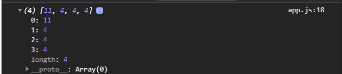
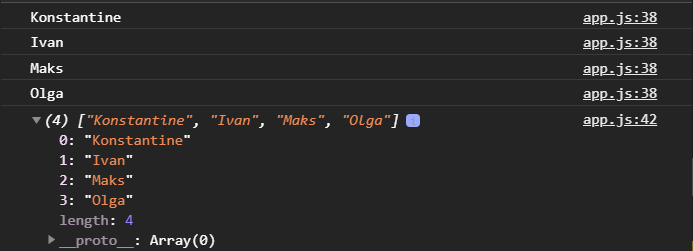
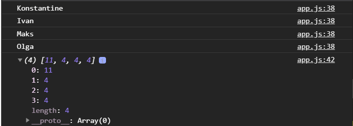
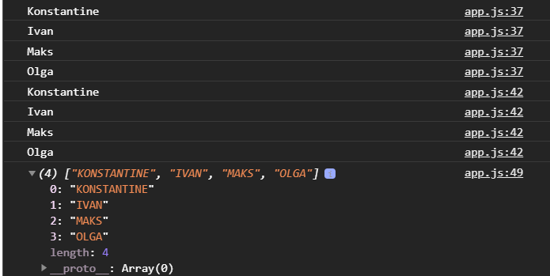
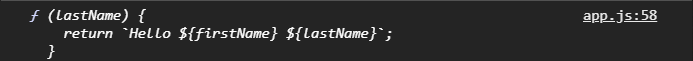

# Функции высшего порядка

[https://docs.google.com/presentation/d/1Rs6hlxVo1DyZiid9llVr4RObSwqDioGxAUty3ScIOi8/edit?usp=sharing](https://docs.google.com/presentation/d/1Rs6hlxVo1DyZiid9llVr4RObSwqDioGxAUty3ScIOi8/edit?usp=sharing),

<br>
<br>

[https://medium.com/nuances-of-programming/%D0%BF%D0%BE%D0%B4%D1%80%D0%BE%D0%B1%D0%BD%D0%B5%D0%B5-%D0%BE-%D1%84%D1%83%D0%BD%D0%BA%D1%86%D0%B8%D1%8F%D1%85-%D0%B2%D1%8B%D1%81%D1%88%D0%B5%D0%B3%D0%BE-%D0%BF%D0%BE%D1%80%D1%8F%D0%B4%D0%BA%D0%B0-2d94ace3e96c](https://medium.com/nuances-of-programming/%D0%BF%D0%BE%D0%B4%D1%80%D0%BE%D0%B1%D0%BD%D0%B5%D0%B5-%D0%BE-%D1%84%D1%83%D0%BD%D0%BA%D1%86%D0%B8%D1%8F%D1%85-%D0%B2%D1%8B%D1%81%D1%88%D0%B5%D0%B3%D0%BE-%D0%BF%D0%BE%D1%80%D1%8F%D0%B4%D0%BA%D0%B0-2d94ace3e96c)

<br>
<br>

[https://medium.com/nuances-of-programming/%D0%B8%D0%B7%D1%83%D1%87%D0%B0%D0%B5%D0%BC-%D1%84%D1%83%D0%BD%D0%BA%D1%86%D0%B8%D0%B8-%D0%B2%D1%8B%D1%81%D1%88%D0%B5%D0%B3%D0%BE-%D0%BF%D0%BE%D1%80%D1%8F%D0%B4%D0%BA%D0%B0-%D0%B2-javascript-c23daf53a5c0](https://medium.com/nuances-of-programming/%D0%B8%D0%B7%D1%83%D1%87%D0%B0%D0%B5%D0%BC-%D1%84%D1%83%D0%BD%D0%BA%D1%86%D0%B8%D0%B8-%D0%B2%D1%8B%D1%81%D1%88%D0%B5%D0%B3%D0%BE-%D0%BF%D0%BE%D1%80%D1%8F%D0%B4%D0%BA%D0%B0-%D0%B2-javascript-c23daf53a5c0)

<br>
<br>

Преред знакомством с функциями высшего порядка уточним два нюанса. Первый это в том что **JS** функции расцениваются как объекты, это особый тип но объекты.

И это можно проверить написав простую функцию.

```js
function foo() {
  console.log("Hello world");
}
foo();
```

Добавляю в функцию поле и вывожу в консоль.

```js
function foo() {
  console.log("Hello world");
}
foo();

foo.field = "Konstantine";

console.log(foo.field);
```


Хоть этот код и валидный, но его не рекомндуется использовать. Но это дает понимание того что функции в **JS** являются объектами.

 Помимо этого функции могут быть переданы в качестве параметров в другие функции. Могут быть присвоены в переменные. В общем-то с ними можно производить все теже манипуляции как и слюбыми типами данных. Поэтому функции в **JS** назваются функциями первого класса.

 Функции высшего порядка - это функции которые принимают в качестве параметров другие функции или возвращают функции.


 Функций в **JS** очень много. Например есть методы для перебора массивов **map()**, **filter()** и т.д. Они все являются функциями высшего порядка т.к. они принимают в качестве аргументов принимают другие функции.
 Или например в **DOM** это **Event Listener** который навешивает обработчик события на какой-то **DOM** узел и это в том числе функция высшего порядка т.к. она принимает в качестве аргумента другую функцию.

 Напишем аналог метода **map()** для массивов. Метод **map** возвращает новый массив состоящий из результатов вызова функции **callback**, которая была передана в качестве параметра, и возвращает новый массив состоящий из результатов вызова нашей функции.

 Это нужно в первую очередь для сокращения количества кода.

 Предположим у нас есть какой-либо массив, например с именами.

 ```js
 const arr = ["Konstantine", "Ivan", "Maks", "Olga"];
 ```

 И предположим мы хотим получить с вами массив состоящий из элементов где каждый элемент является длинной строки каждого элемента из массива **arr**.

 Предположим я могу написать цикл.

 ```js
 const arr = ["Konstantine", "Ivan", "Maks", "Olga"];

 let newArr = [];

 for (let i = 0; i < arr.length; i++ ){
    
}
```
Мне нужно создать новый массив. Для этого я предвирительно создам новый массив который будет пустым. И использую метод **push** я могу добавлять в этот массив. И я буду пушить длинну каждого элемента массива **arr**.

```js
const arr = ['Konstantine', 'Ivan', 'Maks', 'Olga'];

let newArr = [];

for (let i = 0; i < arr.length; i++) {
  newArr.push(arr[i].length);
}

console.log(newArr);
```



Я хочу что бы была возможность получить массив всех элементов имен, но только что бы каждый элемент был в верхнем регистре.

Я создаю новый массив, опять копирую цикл. Перебираю массив имен, но только на каждой итерации я пушу в **newArr2** каждую строку перевожу в верхний регистр и добавляю в новый массив.

```js
const arr = ["Konstantine", "Ivan", "Maks", "Olga"];

let newArr = [];

for (let i = 0; i < arr.length; i++) {
  newArr.push(arr[i].length);
}

console.log(newArr);

let newArr2 = [];

for (let i = 0; i < arr.length; i++) {
    newArr2.push(arr[i].toUpperCase());
  }
  console.log(newArr2);
```


И вуаля все работает.

Но здесь сразу же две проблемы. Первая в том что приходится дублировать код, начинаю создавать кучу разных переменных непонятных. Логика работает так же не понятно, потому что нужно вглядываться и понимать что здесь происходит и это все в общем-то не красиво и не правильно.

Может возникнуть вопрос как я это могу объеденить в функцию? Но возникает проблема что каждый раз я могу выполнять разные действия с одним элементом массива. Где-то мне нужна его длинна, где-то я хочу преобразовать его значение и т.д. Соответственно это усложняет работу и я буду попросту дублировать код.

<br>
<br>
<br>
<br>

**Переписываю это используя функции высшего порядка.**


Создаю функцию **mapArray** которая будет принимать два параметра **arr**, **fn**. Внутри себя она будет создавать новый массив **const res = [];**. Далее в цикле она будет проходиться по переданному массиву но на каждой итерации она будет пушить в результирующий массив **res** результат переданной функции **fn** т.е. **newArr2.push(fn());** В нутрь **mapAtrray** я буду передавать один элемент массива **newArr2.push(fn(arr[i]));**

```js
function mapArray(arr, fn) {
  const res = [];
  for (let i = 0; i < arr.length; i++) {
    newArr2.push(fn(arr[i]));
  }
  return res;
}
```

Дальше мы в зависимости от поставленной задачи т.е. в зависимости от того как я хочу преобразовывать свой массив я буду передавать в функцию которая будет принимать один элемент массива, что-то с ним делать и возвращать измененный результат. 


Пишу функцию **nameLength** которая будет принимать один элемент массива **el**. И дале буду просто **return el**. Дальше вызываю **mapArray()**  и передадим ему новый созданный массив **names**. А вторым аргументом я буду передавать имя нашей **callback** функции **nameLength**. Не вызывая ее а просто передавая ее имя.

```js
const names = ["Konstantine", "Ivan", "Maks", "Olga"];

function mapArray(arr, fn) {
  const res = [];
  for (let i = 0; i < arr.length; i++) {
    newArr2.push(fn(arr[i]));
  }
  return res;
}

function nameLength(el) {
  console.log(el);
  return el;
}

mapArray(names, nameLength);
```
В вызове функции **mapArray**, вторым аргументом я могу передать саму функцию **nameLength** т.е. весь ее код.

```js
const names = ["Konstantine", "Ivan", "Maks", "Olga"];

function mapArray(arr, fn) {
  const res = [];
  for (let i = 0; i < arr.length; i++) {
    res.push(fn(arr[i]));
  }
  return res;
}

mapArray(names, function nameLength(el) {
  console.log(el);
  return el;
});
```
 Т.е. у нас в массив имен попадает в **mapArray** в аргумент **arr** и тудаже попадает функция **nameLength** в **fn**. Далее в цикле перебирается массив имен и на каждой итерации я пушу в результирующий массив **res**, который создается при каждом вызове **mapArray** вызов c**allback** функции **res.push(fn(arr[i]));** т.е. **fn** которая принимает один элемент массива и что-то с ним делать.

 Если я запишу результат в переменную и выведу в консоль.

 ```js
 const names = ["Konstantine", "Ivan", "Maks", "Olga"];

function mapArray(arr, fn) {
  const res = [];
  for (let i = 0; i < arr.length; i++) {
    res.push(fn(arr[i]));
  }
  return res;
}

const result = mapArray(names, function nameLength(el) {
  console.log(el);
  return el;
});

console.log(result);
```


 
То я получаю тот же массив что и был.

Но в функции **nameLength** я могу выполнять какие-то преобразования или возвращать то что мы хотим. Например я хочу возвращать длинну одного элемента из строки.

```js
const names = ["Konstantine", "Ivan", "Maks", "Olga"];

function mapArray(arr, fn) {
  const res = [];
  for (let i = 0; i < arr.length; i++) {
    res.push(fn(arr[i]));
  }
  return res;
}

const result = mapArray(names, function nameLength(el) {
  console.log(el);
  return el.length;
});

console.log(result);
```


А теперь я например хочу перевести все в верхний регистр. Я создаю еще одну функцию **nameToUpperCase** которая так же будет принимать элемент **el**. В теле она будет возвращать этот элемент в верхнем регистре.
Далее я могу создать еще одну переменную  и в функции **mapArray** вторым аргументом вызывать не **nameLength** а **nameToUpperCase**.

```js
const names = ["Konstantine", "Ivan", "Maks", "Olga"];

function mapArray(arr, fn) {
  const res = [];
  for (let i = 0; i < arr.length; i++) {
    res.push(fn(arr[i]));
  }
  return res;
}
function nameLength(el) {
  console.log(el);
  return el.length;
}

function nameToUpperCase(el) {
  console.log(el);
  return el.toUpperCase();
}

const result = mapArray(names, nameLength);
const result2 = mapArray(names, nameToUpperCase);

console.log(result2);
```


И я получаю массив в верхнем регистре.
Таким образом существенно сокращается количество кода. Мы делаем его более гибким и расширяем. Для каждой отдельной задачи, для работы с массивом, есть отдельная функция обработчик которая будет делать что-то с каждым из элементов на каждой итерации массива.

 Это будет часто использоваться, но как я уже говорил для этого будет использоваться специальный метод map.

 <br>
 <br>
 <br>
 <br>

 **Теперь поговорим о том случае когда функции возвращаются из других функций**.

 Т.е. у нас функции высшего порядка это те функции которые принимают в качестве параметров другие функции или возвращают другие функции.

 Предположим у нас есть **function greeting** которая принимает **(firstName)** а в теле цикла возвращаю другую функцию без имени которая будет принимать **(lastName)** и она в своем теле будет возвращать шаблонную строку.

 ```js
 function greeting(firstName) {
  return function (lastName) {
    return `Hello ${firstName} ${lastName}`;
  };
}

const testGreeting = greeting("Konstantine");
console.log(testGreeting);

```

В результате этой записи в переменной **testGreeting** будет находится функция.



Эта функция возвращена и принимает **lastName** т.е. я могу ее вызвать и передать ей **lastName**.

```js
function greeting(firstName) {
  return function (lastName) {
    return `Hello ${firstName} ${lastName}`;
  };
}

const testGreeting = greeting("Konstantine");
const fullName = testGreeting("Atroshchenko");
console.log(fullName);
```


Возвращает полное имя с приставкой **Hello**. Это довольно простой пример и не особо юзабельный в обычной жизни, но тем не менее он дает понимание того что мы можем из одной функции вернуть другую функцию и потом ею воспользоваться.

Но есть еще один вариант как ею можно воспользоваться. Я могу присвоить переменной вызов обеих функций сразу. Для этого вызываю главную функции **greeting** прописываю в ее параметры интересующее меня значение и после закрытия скобки, открываю новые скобки. Так как функция **greeting** возвращает функцию, то я могу сразу после вызова **greeting()**, без каких либо знаков припинания, поставить круглые собки и вызвать возвращаемую функцию.

```js
function greeting(firstName) {
  return function (lastName) {
    return `Hello ${firstName} ${lastName}`;
  };
}

// const testGreeting = greeting("Konstantine");
// const fullName = testGreeting("Atroshchenko");
const fullName = greeting("Konstantine")("Atroshchenko");
console.log(fullName);
```


<br>
<br>
<br>
<br>

Еще один пример.

```js
function question(job) {
  if (job === "developer") {
    return function (name) {
      return `${name}, что такое JavaScript?`;
    };
  } else if (job == "teacher") {
    return function (name) {
      return `${name}, какой предмет вы ведете?`;
    };
  }
}

const developerQuestion = question("developer");
console.log(developerQuestion);

```

Проверяю что в консоли возвращается функцию в зависимости от того какой тип профессии мы передаем. 
И соответственно дальше я могу вызвать эту функцию и передать ей имя.

```js
function question(job) {
  if (job === "developer") {
    return function (name) {
      return `${name}, что такое JavaScript?`;
    };
  } else if (job == "teacher") {
    return function (name) {
      return `${name}, какой предмет вы ведете?`;
    };
  }
}

const developerQuestion = question("developer");
console.log(developerQuestion("Konstantine"));
```


Таким образом у меня получается вопрос.

Тоже самое я могу сделать с **teacherQuestions**.

```js
function question(job) {
  if (job === "developer") {
    return function (name) {
      return `${name}, что такое JavaScript?`;
    };
  } else if (job == "teacher") {
    return function (name) {
      return `${name}, какой предмет вы ведете?`;
    };
  }
}

const developerQuestion = question("developer");
console.log(developerQuestion("Konstantine"));
const teacherQuestions = question("teacher");
console.log(teacherQuestions("Olga"));
```


И соответственно у нас будет вопрос для преподавателя.


Хотелось бы эту задачу упростить. Вообще если у вас возникает множество условий мы можем превратить вот эту часть

```js
if (job === "developer") {
    return function (name) {
      return `${name}, что такое JavaScript?`;
    };
  } else if (job == "teacher") {
    return function (name) {
      return `${name}, какой предмет вы ведете?`;
    };
  }
```
так скажем в словарь. т.е. я могу создать что бы не делать кучу условий и представте что их может быть гораздо больше условий и гораздо больше вариантов работы. Я могу создать объект где ключем будет название работы а значением будет сам вопрос.

```js
function question(job) {
  const jobDictionary = {
    developer: " что такое JavaScript?",
    teacher: "какой предмет вы ведете?",
  };
}
```
После удаления условия я могу венуть функцию которая будет принимать имя, а вместо вопроса она будет подставлять из словаря **jobDictionary** и через квадратные скобки обращаюсь к типу профессии **[job]**

```js
function question(job) {
  const jobDictionary = {
    developer: " что такое JavaScript",
    teacher: "какой предмет вы ведете",
  };
  return function (name) {
    return `${name}, ${jobDictionary[job]}?`;
  };
}

const developerQuestion = question("developer");
console.log(developerQuestion("Konstantine"));
const teacherQuestions = question("teacher");
console.log(teacherQuestions("Olga"));
```


У нас существенно сокращается код и его проще расширять т.е. каждый раз когда у нас будет добавляться новая профессия ее достаточно добавить в словарь и функция будет работать. Мне не надо писать else if, дублировать одну и ту же функцию фактически с разными вопросами. Но тем не менее это так же остается функцией высшего порядка которая возвращает другую функцию.

**Это нужно знать хорошо!!!**
