# Что такое this. Контекст вызова функции.

[https://docs.google.com/presentation/d/1-qAPOQqQS73az6uk5t5mwrrCin45LDAVmgPTIYRYybs/edit?usp=sharing](https://docs.google.com/presentation/d/1-qAPOQqQS73az6uk5t5mwrrCin45LDAVmgPTIYRYybs/edit?usp=sharing),

[https://habr.com/ru/company/ruvds/blog/419371/](https://habr.com/ru/company/ruvds/blog/419371/),

[http://ryanmorr.com/understanding-scope-and-context-in-javascript/](http://ryanmorr.com/understanding-scope-and-context-in-javascript/),

[https://learn.javascript.ru/call-apply](https://learn.javascript.ru/call-apply)

<br>
<br>
<br>
<br>

**This** - это контекст вызова функции. В принципе это довольно простая штука, но тем не менее очень важная и имеет некоторые нюансы.

создаю простую функцию 

```js
function getThis() {
  console.log(this);
}
```

**this** и контекст вызова определяются непосредственно при вызове функции т.е. если сейчас я вызову эту функцию.

```js
function getThis() {
  console.log(this);
}

getThis();
```
то в консоли я увижу что **this** ссылается на объект **window**.

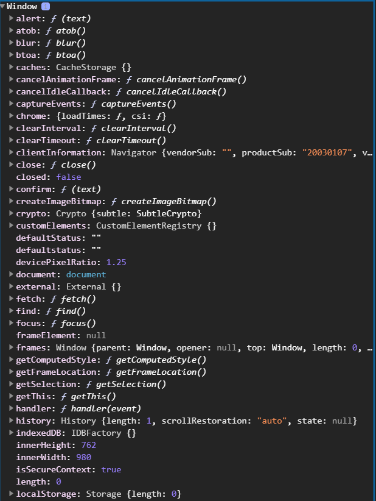

Скролить не перескролить. Очень много свойств.

В строгом режиме т.е. при строгой типизации это будет **undefined**.

Ключевое слово **this** в обычной глобальной области ссылается на глобальный объект **window**.

Это очень легко объяснить если я сделаю вот такую запись.

```js
function getThis() {
  console.log(this);
}

getThis();

console.log(window.getThis);
```

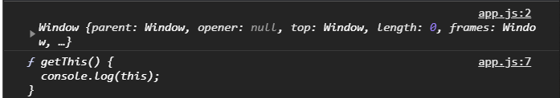

то мы увидим что в данном объекте храниться эта функция. И я ее могу вызвать через объект **window**.

```js
function getThis() {
  console.log(this);
}

getThis();
window.getThis();
console.log(window.getThis);
```
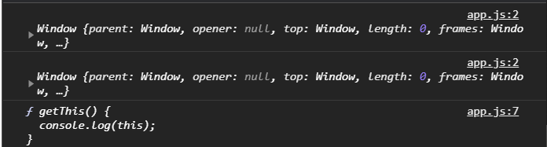

Так же мы можем использовать функцию в качестве методов. Метод это когда функция передана в качестве свойства в объекте.

```js
const prod1 = {
  name: "Intel",
  price: 100,
  getPrice:
};
```
Помимо полей я могу в объекте объявить функцию, например **getPrice**. Делется это двумя способами. Первый способ написать ключ **getPrice** и далее в значении передать функцию которая внутри себя может получить доступ к **this**. Такую функцию можно вызвать обратившись к объекту у которого вызываю данную функцию.

```js
const prod1 = {
  name: "Intel",
  price: 100,
  getPrice: function () {
    console.log(this);
  },
};
prod1.getPrice();
```

Так как функция была вызвана в контексте объекта, то и в консоли мы увидим наш объект.

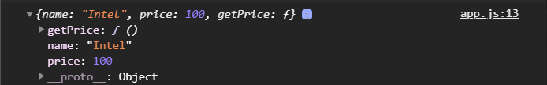

И например я могу получить досуп к цене **this.price**.

```js
const prod1 = {
  name: "Intel",
  price: 100,
  getPrice: function () {
    console.log(this.price);
  },
};
prod1.getPrice();
```


Т.е. мы видим что у нас вызвав функцию в качестве  метода объекта, внутри этой функции **this** будет указывать на этот объект **prod1**.
 Вообще очень легко запомнить что **this** будет равен тому что находится перед самой крайней правой точкой **prod1.getPrice();** т.е. в данном случае **prod1**.

 В примере выше эквивалентная запись **window.getThis();**


 Если мы например сделаем како-нибудь вложенный объект

```js
 const prod1 = {
  name: "Intel",
  price: 100,
  getPrice: function () {
    console.log(this.price);
  },
  info: {
    information: ["2.3ghz"],
    getInfo: function () {
      console.log(this);
    },
  },
};
prod1.getPrice();
prod1.info.getInfo();
```

то мы увидим что **this** внутри функции **getInfo** уже будет указывать на объект **info**.

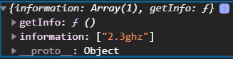

т.е. мы уже будем иметь в качестве **this** объект **info**. И мы например можем получить доступ к **information**. 

Таким способом мы видим зависимости от того где была объявлена функция будет меняться наш **this** и непосредственно контекст вызова.
Контекст вызова определяется непосредственно при вызове функции и при этом не важно где была и как была определена функция.

Т.е. например я могу определить функцию **getPrice** вне самого объекта.

```js
function getPrice() {
  console.log(this.price);
}

const prod1 = {
  name: "Intel",
  price: 100,
  getPrice: function () {
    console.log(this.price);
  },
  info: {
    information: ["2.3ghz"],
    getInfo: function () {
      console.log(this);
    },
  },
};
prod1.getPrice();
prod1.info.getInfo();
getPrice();
```
При вызове такой функции мы получим **undefined**. Потому что в **console.log(this.price);** будет указывать на **window** а у **window** нет такого свойства **price**.
Но я могу передать данную функцию в качестве свойства в объект.либо вот так передать

```js
function getPrice() {
  console.log(this.price);
}

const prod1 = {
  name: "Intel",
  price: 100,
  getPrice: getPrice,
  info: {
    information: ["2.3ghz"],
    getInfo: function () {
      console.log(this);
    },
  },
};
prod1.getPrice();
prod1.info.getInfo();
```

Либо новый синтаксис позволяет сократить данную запись если ключ и значение совпадают.

```js
function getPrice() {
  console.log(this.price);
}

const prod1 = {
  name: "Intel",
  price: 100,
  getPrice,
  info: {
    information: ["2.3ghz"],
    getInfo: function () {
      console.log(this);
    },
  },
};
prod1.getPrice();
prod1.info.getInfo();
```

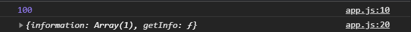

При этом это будет работать даже если создам например объект **prod2** и после вызвать у этого объекта **getPrice()** то я получаю цену для объекта **prod2**.

```js
function getPrice() {
  console.log(this.price);
}

const prod1 = {
  name: "Intel",
  price: 100,
  getPrice,
  info: {
    information: ["2.3ghz"],
    getInfo: function () {
      console.log(this);
    },
  },
};
prod1.getPrice();
prod1.info.getInfo();

const prod2 = {
  name: "AMD",
  price: 50,
  getPrice,
};

prod2.getPrice();
```

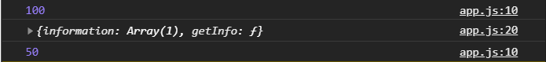

Вызывается все таже функция **getPrice**, но за счет вызова в разных контекстах мы имеем доступ к разным объектам и тем самым мы делаем эту функцию универсальной с ненадобностью ее повторять.

Так же мы можем объявлять в новом формате методы. Если раньше мы писали например 

```js
getInfo: function () {
      console.log(this);
    },
```
то сейчас можно написать вот такую запись например.

```js
getName() {
    console.log(this.name);
  },
```
Это будет являтся методом. И мы можем его вызвать

```js
function getPrice() {
  console.log(this.price);
}

const prod1 = {
  name: "Intel",
  price: 100,
  getPrice,
  getName() {
    console.log(this.name);
  },
  info: {
    information: ["2.3ghz"],
    getInfo: function () {
      console.log(this);
    },
  },
};
prod1.getPrice();
prod1.info.getInfo();
prod1.getName();

const prod2 = {
  name: "AMD",
  price: 50,
  getPrice,
};

prod2.getPrice();
```
И мы получаем имя.

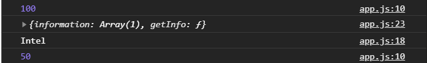

Что-то я слабо понял!!!


При этом мы можем передать какие-то функции к примеру функцию **getName**, и я ее хочу использовать в **prod2**. то я могу сделать вот такую запись.

```js
function getPrice() {
  console.log(this.price);
}

const prod1 = {
  name: "Intel",
  price: 100,
  getPrice,
  getName() {
    console.log(this.name);
  },
  info: {
    information: ["2.3ghz"],
    getInfo: function () {
      console.log(this);
    },
  },
};


const prod2 = {
  name: "AMD",
  price: 50,
  getPrice,
};

prod2.getName =prod1.getName;
prod2.getName()
```


т.е. как я сказал не важно о том как и где была объявлена главное что она была передана в объект и вызвана в контексте этого объекта.

Так же мы можем делать цепочки вызовов методов. Пример.

```js
let str = "Hello world";
const reversStr = str.split("").reverse("").join("");
console.log(reversStr);
```


Наша строка была разбита на массив при помощи метода **split**, при помощи метода **reverse** была перевернута, при помощи метода **join** была обратно склеена в строку. Это называется вызов методов цепочки т.е. мы друг за другом вызываем методы.

Почему они работают? Здесь все очень просто. Потому что каждый из этих методов возвращает объект у которого есть следующий метод. Т.е. например метод **split** вернет массив по символьно. У массива есть метод **reverse** поэтому он его применит и развернет этот массив. У этого массива есть метод **join** который обратно превратит его в строку.

Если я попробую вызвать метод которого нет у результата вызова предыдущего метода, то я получу ошибку о том что **метод is not a function** т.е. такого метода нет.

<br>
<br>
<br>
<br>

**Как это можно реализовать в контексте метода this и вообще наших методов объекта?**


Так же вынесу функцию **getName** в глобальное пространство. И так же создаю новый объект **product3**.

```js
function getThis() {
  console.log(this);
}

function getName() {
  console.log(this.name);
}

// getThis();
// window.getThis();
// console.log(window.getThis);

function getPrice() {
  console.log(this.price);
}

const prod1 = {
  name: "Intel",
  price: 100,
  getPrice,
  getName() {
    console.log(this.name);
  },
  info: {
    information: ["2.3ghz"],
    getInfo: function () {
      console.log(this);
    },
  },
};
// prod1.getPrice();
// prod1.info.getInfo();
// prod1.getName();

const prod2 = {
  name: "AMD",
  price: 50,
  getPrice,
};

prod2.getName = prod1.getName;
// prod2.getPrice();
// prod2.getName()

let str = "Hello world";
const reversStr = str.split("").reverse("").join("");
// console.log(reversStr);

const prod3 = {
  name: "ARM",
  price: 200,
  getPrice,
  getName,
};

prod3.getName().getPrice();

```

А теперь попробую вызвать эти методы в цепочке. И происходит ошибка. Хотя с начало мы увидим **ARM** потому что **getName** вызвался

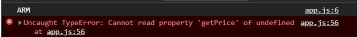

Дальше получаю ошибку о том что он не может прочитать свойство **getPrice**. Происходит это потому что когда мы не пишем явно **return** она возвращает **undefined**. **getName() //undefined**. Таким образом мы на следующем этапе пытаемся у **undefined** вызвать метод **getPrice**, что в общем-то не может быть воспроизведено.

Для того что бы этот вызов произошел каждая из функций должна вернуть **this**.

```js
function getThis() {
  console.log(this);
  return this;
}

function getName() {
  console.log(this.name);
  return this;
}

// getThis();
// window.getThis();
// console.log(window.getThis);

function getPrice() {
  console.log(this.price);
}

const prod1 = {
  name: "Intel",
  price: 100,
  getPrice,
  getName() {
    console.log(this.name);
  },
  info: {
    information: ["2.3ghz"],
    getInfo: function () {
      console.log(this);
    },
  },
};
// prod1.getPrice();
// prod1.info.getInfo();
// prod1.getName();

const prod2 = {
  name: "AMD",
  price: 50,
  getPrice,
};

prod2.getName = prod1.getName;
// prod2.getPrice();
// prod2.getName()

let str = "Hello world";
const reversStr = str.split("").reverse("").join("");
// console.log(reversStr);

const prod3 = {
  name: "ARM",
  price: 200,
  getPrice,
  getName,
};

prod3.getName().getPrice();
```
Результат вызова **getName** будет объект **prod3**. И у этого объекта есть метод **getPrice**. И мы вызовем фактически **prod3.getPrice()**.

Но это будет работать только в том случае если у объекта который возвращает предыдущий метод есть следующий метод который мы вызываем. Таким образом мы можем построить цепочки вызовов методов.

<br>
<br>
<br>
<br>

**Далеше то что касается this это еще потеря контекста и вообще потеря контекста и вообще возможность вызывать функцию с определенным контекстом.**

Т.е. у нас например есть. Беру в **prod3** коментирую методы **getPrice** и **getName**.
Для того что бы в этот объект не записывать данные методы мы можем воспользоваться специальными методами. Это метод **call** и метод **apply**. Они позволяют указать в каком контексте мы хотим вызвать указанную функцию.

Я могу попросить вызвать функцию **getPrice** например. Она у меня объявлена выше. Но для того что бы ее вызвать в контексте **prod3** я должен указать этой функции метод **getPrice.call**, помните что функции это тоже объекты по этому у них тоже есть методы. Метод **call** который принимает первым аргументом **this** в контексте которого т.е. он принимает контекст в котором должна быть вызвана эта функция, в нашем случае это объект **prod3**.

```js
function getThis() {
  console.log(this);
  return this;
}

function getName() {
  console.log(this.name);
  return this;
}

// getThis();
// window.getThis();
// console.log(window.getThis);

function getPrice() {
  console.log(this.price);
}

const prod1 = {
  name: "Intel",
  price: 100,
  getPrice,
  getName() {
    console.log(this.name);
  },
  info: {
    information: ["2.3ghz"],
    getInfo: function () {
      console.log(this);
    },
  },
};
// prod1.getPrice();
// prod1.info.getInfo();
// prod1.getName();

const prod2 = {
  name: "AMD",
  price: 50,
  getPrice,
};

prod2.getName = prod1.getName;
// prod2.getPrice();
// prod2.getName()

let str = "Hello world";
const reversStr = str.split("").reverse("").join("");
// console.log(reversStr);

const prod3 = {
  name: "ARM",
  price: 200,
  // getPrice,
  // getName,
};

getPrice.call(prod3);

// prod3.getName().getPrice();

```


Таким образом я вызвал контекст в котором я хочу вызвать функцию **getPrice**.

Я так же могу передать какие-то аргументы. Например **getPrice** может принимать **currency**. В функции **getPrice** выставляю **currency** и прописываю ей значение по умолчанию **currency = '$'**. И вывожу в консоль **currency + this.price**.

```js
function getThis() {
  console.log(this);
  return this;
}

function getName() {
  console.log(this.name);
  return this;
}

// getThis();
// window.getThis();
// console.log(window.getThis);

function getPrice(currency = '$') {
  console.log(currency + this.price);
}

const prod1 = {
  name: "Intel",
  price: 100,
  getPrice,
  getName() {
    console.log(this.name);
  },
  info: {
    information: ["2.3ghz"],
    getInfo: function () {
      console.log(this);
    },
  },
};
// prod1.getPrice();
// prod1.info.getInfo();
// prod1.getName();

const prod2 = {
  name: "AMD",
  price: 50,
  getPrice,
};

prod2.getName = prod1.getName;
// prod2.getPrice();
// prod2.getName()

let str = "Hello world";
const reversStr = str.split("").reverse("").join("");
// console.log(reversStr);

const prod3 = {
  name: "ARM",
  price: 200,
  // getPrice,
  // getName,
};

getPrice.call(prod3);

// prod3.getName().getPrice();

```


Таким образом при вызове **getPrice.call(prod3);** у меня уже подставлен **$**. Однако если я в вызове передам второй параметр.

```js
function getThis() {
  console.log(this);
  return this;
}

function getName() {
  console.log(this.name);
  return this;
}

// getThis();
// window.getThis();
// console.log(window.getThis);

function getPrice(currency = "$") {
  console.log(currency + this.price);
}

const prod1 = {
  name: "Intel",
  price: 100,
  getPrice,
  getName() {
    console.log(this.name);
  },
  info: {
    information: ["2.3ghz"],
    getInfo: function () {
      console.log(this);
    },
  },
};
// prod1.getPrice();
// prod1.info.getInfo();
// prod1.getName();

const prod2 = {
  name: "AMD",
  price: 50,
  getPrice,
};

prod2.getName = prod1.getName;
// prod2.getPrice();
// prod2.getName()

let str = "Hello world";
const reversStr = str.split("").reverse("").join("");
// console.log(reversStr);

const prod3 = {
  name: "ARM",
  price: 200,
  // getPrice,
  // getName,
};

getPrice.call(prod3, "*");

// prod3.getName().getPrice();
```


То в консоль вместо доллара выводится звездочка. Таким образом я могу передавить еще какие-то аргументы. Но первым должен идти обязательно контекст вызова **prod3**. Если без контекста, то должен быть указан **null**. Это возможно если вы например хотите переиспользовать например математические функции для разных контекстов.

Метод **apply** он фактически точно такой же. Единственное отличие в том что он принимает аргументы передаваемые в функции в качестве массива. Т.е. если матод **call** до бесконеячности принимает аргументы **getPrice.call(prod3, "*", "", "", ...)**, то apply.

```js
function getThis() {
  console.log(this);
  return this;
}

function getName() {
  console.log(this.name);
  return this;
}

// getThis();
// window.getThis();
// console.log(window.getThis);

function getPrice(currency = "$") {
  console.log(currency + this.price);
}

const prod1 = {
  name: "Intel",
  price: 100,
  getPrice,
  getName() {
    console.log(this.name);
  },
  info: {
    information: ["2.3ghz"],
    getInfo: function () {
      console.log(this);
    },
  },
};
// prod1.getPrice();
// prod1.info.getInfo();
// prod1.getName();

const prod2 = {
  name: "AMD",
  price: 50,
  getPrice,
};

prod2.getName = prod1.getName;
// prod2.getPrice();
// prod2.getName()

let str = "Hello world";
const reversStr = str.split("").reverse("").join("");
// console.log(reversStr);

const prod3 = {
  name: "ARM",
  price: 200,
  // getPrice,
  // getName,
};

// getPrice.call(prod3, "*");
getPrice.apply(prod3, ["*"]);

// prod3.getName().getPrice();
```


Так же у нас есть возможность потерять контекст. Потеря контеста происходит когда мы передаем какие-то методы внутрь других функций которые будут вызваны в рамках другого контекста. Самый базовый пример который вы можете встретить это **setTimeout**.

Предположим что в **prod3** есть **getPrice** и вызову **setTimeout(prod3.getPrice, 1000);**

```js
function getThis() {
  console.log(this);
  return this;
}

function getName() {
  console.log(this.name);
  return this;
}

// getThis();
// window.getThis();
// console.log(window.getThis);

function getPrice(currency = "$") {
  console.log(currency + this.price);
}

const prod1 = {
  name: "Intel",
  price: 100,
  getPrice,
  getName() {
    console.log(this.name);
  },
  info: {
    information: ["2.3ghz"],
    getInfo: function () {
      console.log(this);
    },
  },
};
// prod1.getPrice();
// prod1.info.getInfo();
// prod1.getName();

const prod2 = {
  name: "AMD",
  price: 50,
  getPrice,
};

prod2.getName = prod1.getName;
// prod2.getPrice();
// prod2.getName()

let str = "Hello world";
const reversStr = str.split("").reverse("").join("");
// console.log(reversStr);

const prod3 = {
  name: "ARM",
  price: 200,
  getPrice,
  // getName,
};

// getPrice.call(prod3, "*");
// getPrice.apply(prod3, ["*"]);

// prod3.getName().getPrice();

setTimeout(prod3.getPrice, 1000);
```


Доллар потому что у меня есть по дефолту **currancy = '$'**, если не передано. Здесь **setTimeout(prod3.getPrice, 1000);** я передал ссылку на эту функцию которую я хочу вызвать через одну секунду. Из-за чего получается **setTimeout** работает в контексте **window**. У **window** свойства **price** нет и соответственно я получаю **undefined**.

Это можно исправить несколькими способами. Есть способ со стролочными функциями, но это разберем позднее. А сейчас посмотрим на **bind**.
Я могу создать как отдельную переменную **const getPriceBind =** и я могу вызвать у метода** prod3.getPrice** вызвать метод **bind()**. Метод **bind**, в отличии от **aply** и **call**, не вызывает функцию стоящую справа, в нашем случае это **getPrice**, он возвращает эту функцию с уже привязаным контекстом. В свои параметры он принимает привязаный контекст т.е. **prod3** при этом еще можно передать следующими аргументами привязанные аргументы. Например для **getPrice** будет звездочка.

```js
function getThis() {
  console.log(this);
  return this;
}

function getName() {
  console.log(this.name);
  return this;
}

// getThis();
// window.getThis();
// console.log(window.getThis);

function getPrice(currency = "$") {
  console.log(currency + this.price);
}

const prod1 = {
  name: "Intel",
  price: 100,
  getPrice,
  getName() {
    console.log(this.name);
  },
  info: {
    information: ["2.3ghz"],
    getInfo: function () {
      console.log(this);
    },
  },
};
// prod1.getPrice();
// prod1.info.getInfo();
// prod1.getName();

const prod2 = {
  name: "AMD",
  price: 50,
  getPrice,
};

prod2.getName = prod1.getName;
// prod2.getPrice();
// prod2.getName()

let str = "Hello world";
const reversStr = str.split("").reverse("").join("");
// console.log(reversStr);

const prod3 = {
  name: "ARM",
  price: 200,
  getPrice,
  // getName,
};

// getPrice.call(prod3, "*");
// getPrice.apply(prod3, ["*"]);

// prod3.getName().getPrice();

const getPriceBind = prod3.getPrice.bind(prod3, "*");
console.log(getPriceBind);

setTimeout(prod3.getPrice, 1000);

```
И теперь в **getPrice** я могу законсолить.

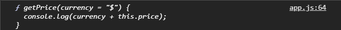

У нас будет содержаться наша функция, но уже с привязаным контекстом к объекту **prod3**.
Теперь ели я эту функцию передам в **setTimeout** у меня контекст не будет изменен

```js
function getThis() {
  console.log(this);
  return this;
}

function getName() {
  console.log(this.name);
  return this;
}

// getThis();
// window.getThis();
// console.log(window.getThis);

function getPrice(currency = "$") {
  console.log(currency + this.price);
}

const prod1 = {
  name: "Intel",
  price: 100,
  getPrice,
  getName() {
    console.log(this.name);
  },
  info: {
    information: ["2.3ghz"],
    getInfo: function () {
      console.log(this);
    },
  },
};
// prod1.getPrice();
// prod1.info.getInfo();
// prod1.getName();

const prod2 = {
  name: "AMD",
  price: 50,
  getPrice,
};

prod2.getName = prod1.getName;
// prod2.getPrice();
// prod2.getName()

let str = "Hello world";
const reversStr = str.split("").reverse("").join("");
// console.log(reversStr);

const prod3 = {
  name: "ARM",
  price: 200,
  getPrice,
  // getName,
};

// getPrice.call(prod3, "*");
// getPrice.apply(prod3, ["*"]);

// prod3.getName().getPrice();

const getPriceBind = prod3.getPrice.bind(prod3, "*");
console.log(getPriceBind);

setTimeout(getPriceBind, 1000);
```
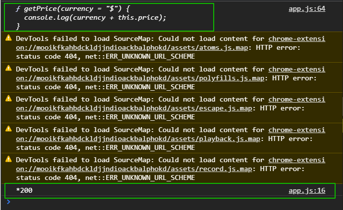

При этом в первый параметр **setTimeout** я могу передать полностью эту запись **prod3.getPrice.bind(prod3, "*")** и этот контекст **prod3.getPrice.bind** не может быть изменен с использованием **call** или **apply**. Т.е. если я привязал через **bind** контекст, то он таким остается навсегда.
Это не самый лучший метод потому что писать такие записи не очень читабельно бывает и он редко используется. Здесь на помощь нам могут придти стрелочные функции которые разберем попозже.

Итог: мы познакомились с тем что такое ключевое слово **this**. Он всегда указывает на контекст вызова

```js
function getThis() {
  console.log(this);
  return this;
```
Определяется этот контекст в момент вызова. В глобальном контексте **this** указывает на объект **window**. В рамках объекта он будет указывать на объект для которого вызвана эта функция. Так же есть возможность вызывать методы в цепочке. Для этого каждый из методов должен вернуть объект у которого есть следующий метод который вызывается в цепочке. Так же мы можем вызывать глобальные функции указывая им контекст при вызове это методы **call** и **apply**. Так же мы можем функциям и методам привязать намертво, **bind**, так сказать контекст с которыона будет вызываться не зависимо от того где мы ее будем вызывать в будущем.