# Стрелочные функции

[https://docs.google.com/presentation/d/1FZLdHz3NqeKc-h_YsIT4IYbflbz__HQ0-L9knu7lahY/edit?usp=sharing](https://docs.google.com/presentation/d/1FZLdHz3NqeKc-h_YsIT4IYbflbz__HQ0-L9knu7lahY/edit?usp=sharing),

[https://medium.com/@KucherDev/%D0%BA%D0%BE%D0%B3%D0%B4%D0%B0-%D0%B8-%D0%BF%D0%BE%D1%87%D0%B5%D0%BC%D1%83-%D1%81%D1%82%D0%BE%D0%B8%D1%82-%D0%B8%D1%81%D0%BF%D0%BE%D0%BB%D1%8C%D0%B7%D0%BE%D0%B2%D0%B0%D1%82%D1%8C-%D1%81%D1%82%D1%80%D0%B5%D0%BB%D0%BE%D1%87%D0%BD%D1%8B%D0%B5-%D1%84%D1%83%D0%BD%D0%BA%D1%86%D0%B8%D0%B8-es6-3135a973490b](https://medium.com/@KucherDev/%D0%BA%D0%BE%D0%B3%D0%B4%D0%B0-%D0%B8-%D0%BF%D0%BE%D1%87%D0%B5%D0%BC%D1%83-%D1%81%D1%82%D0%BE%D0%B8%D1%82-%D0%B8%D1%81%D0%BF%D0%BE%D0%BB%D1%8C%D0%B7%D0%BE%D0%B2%D0%B0%D1%82%D1%8C-%D1%81%D1%82%D1%80%D0%B5%D0%BB%D0%BE%D1%87%D0%BD%D1%8B%D0%B5-%D1%84%D1%83%D0%BD%D0%BA%D1%86%D0%B8%D0%B8-es6-3135a973490b),

[https://developer.mozilla.org/uk/docs/Web/JavaScript/Reference/Functions/%D0%A1%D1%82%D1%80%D1%96%D0%BB%D0%BA%D0%BE%D0%B2%D1%96_%D1%84%D1%83%D0%BD%D0%BA%D1%86%D1%96%D1%97](https://developer.mozilla.org/uk/docs/Web/JavaScript/Reference/Functions/%D0%A1%D1%82%D1%80%D1%96%D0%BB%D0%BA%D0%BE%D0%B2%D1%96_%D1%84%D1%83%D0%BD%D0%BA%D1%86%D1%96%D1%97)

Стрелочные функции это новая фича в JS. Это еще один вариант объявления функций. Познакомимся с синтаксисом, как объявлять функции, какие есть вариации в их объявлениях, где их стоит использовать где не стоит использовать и какие есть отличия по отношению к обычным функциям.

Стрелочная функция присваивается в переменную. Обычно их объявляют в **const** потому что предполагается что вы не будете переопределять функцию.

Синтаксис следующий. Если у нас есть несколько аргументов, в данном случае два аргумента, это будет простая функция которая будет складывать два числа, то мы ставим круглые скобки которые принимают аргументы **x** и **y**. Дальше ставим стрелку и можем написать выражение **x + y**.

```js
const plus = (x, y) => x + y;
```

Как вы видите первое отличие нет ключевого слова **function**. Появилась стрелка. А так же есть возможность писать короткую запись и это конкретно короткая запись. Оно заключается в том что если нам нужно выполнить одно какое-то действие, то мы можем опустить фигурные скобки и опустить ключевое слово **return**. Эта функция вот такая же как эта обычная функция.

```js
function plusFoo(x, y) {
  return x + y;
}
``` 
Это две эквивалентные функции. Но стрелочная функция выглядит намного короче.

Стрелочную функцию я вызываю точно так же как и обычную функцию.

```js
const plus = (x, y) => x + y;

plus(1, 2);
```

Присвою вызов в переменную и вызову в консоль.

```js
const plus = (x, y) => x + y;

const plusRes = plus(1, 2);
console.log(plusRes);
```


<br>
<br>
<br>
<br>
<br>
<br>

**Вариации объявления стрелочной функции**.
Если у нас нет аргументов, то мы просто ставим круглые скобки стрелку и выполняем какое-то действие.

```js
const withoutArgs = () => console.log("Hello world");
```

Если у нас только один аргумент, то мы можем круглые скобки опустить и написать например.

```js
const plus = (x, y) => x + y;

const plusRes = plus(1, 2);
// console.log(plusRes);

const withoutArgs = () => console.log("Hello world");
const singleArg = (x) => x * 2;
```
Если вбить в консоли браузера

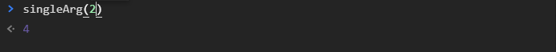

То получим 4.

Выглядит довольно коротко и лаконично.

Здесь в данных функциях мы так же можем передавать параметры функций по умолчанию

```js
const plus = (x = 0, y = 0) => x + y;

const plusRes = plus(1, 2);
// console.log(plusRes);

const withoutArgs = () => console.log("Hello world");
const singleArg = (x) => x * 2;
console.log(singleArg);
```

И теперь если я вызову функцию без аргументов, в консоли браузера, то получу ноль.

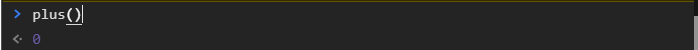

Если например как в **singleArg** ставить параметр по умолчанию, то этот аргумент должен быть взят в скобки.

```js
const plus = (x = 0, y = 0) => x + y;

const plusRes = plus(1, 2);
// console.log(plusRes);

const withoutArgs = () => console.log("Hello world");
const singleArg = (x = 1) => x * 2;
console.log(singleArg);
```

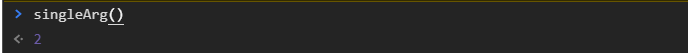

Так же частым **use case**(вариантом использования) стрелочных функций для того что бы вернуть объект. Только перед этим мы свами посмотрим, если нужно писать больше чем одну строку в теле функции

```js
const plus = (x = 0, y = 0) => x + y;

const plusRes = plus(1, 2);
// console.log(plusRes);

const withoutArgs = () => console.log("Hello world");
const singleArg = (x = 1) => x * 2;
const moreActions = (a, b) => {
  a *= 2;
  b *= 3;
  return a + b;
};
```

Если я в теле функции я прописываю более одной строки , то обязательно нужно возвращать результат с помощью ключевого слова **return**. И таким образом если я в консоли передам

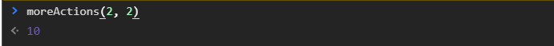

>И так по объявлению: я могу объявлять функции с аргументами, ставлю круглые скобки, указываю аргументы, ставлю стрелку после которого пишу условие. Если в условии одно действие то фигурные скобки опускаются и не используется ключевое слово **return**  т.е. данное действие будет вызвано и сразу вернется результат.

>Если функция без аргументов мы просто ставим круглые скобки. Если один аргумент мы можем опустить круглые скобки.

>Если в теле функции более одного действия, расскрываем фигурные скобки, пишем какую-то логику и спомощью ключевого слова **return** возвращаю результат работы этой функции.

<br>
<br>
<br>

**Возврат объекта при помощи стрелочной функции**. Такое часто может быть когда мы хотим сформировать новый объект и т.д.

```js
const reternObj = (str = "") => {
  return {
    value: str,
    length: str.length,
  };
};
```
**str** - по умолчанию принимает пустую строку. А хочу возвращать объект с полями **value** куда будет передана данная строка, и следующее поле **length** в значение которого будет передана длинна строки.
Теперь если я вызову эту функцию в консоли и передам какие-то значения.

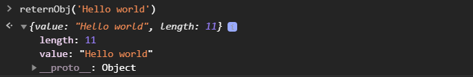

то я получу объект в котором есть переданное мной значение и его длинна.
Данную функцию можно сократить, но так как объект, так и открытие тела функции это фигурные скобки для того что бы интерпретатор разобрался что здесь к чему их нужно завернуть просто в круглые скобки и дальше написать в фигурных скобках что мы хотим вернуть объект.

```js
const reternObj = (str = "") => ({
  value: str,
  length: str.length,
});
```
Таким образом у нас все сработает правильно и объект будет возвращен.

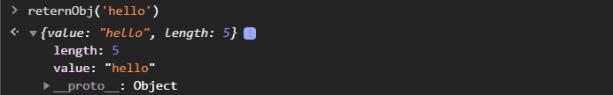

<br>
<br>
<br>
<br>

**Основные отличия стрелочных функций по сравнению с обычными**.

1. У обычной функции есть псевдоколлекция аргументов. Она используется на данной момент гораздо реже потому что с появлением деструктурирующего присваивания и операторов **rest** и **spreed** у нас есть возможность получить те аргументы функции при помощи этих операторов. Но это чуть позднее. Но тем не менее у функции есть специальная коллекция это итерируемый объект который хранит в себе все аргументы которые были переданы в функцию, даже если они небыли объявлены.

```js
function plusFoo(x, y) {
  console.log(arguments);
  return x + y;
}

plusFoo(1, 2, 3, "hello");
```
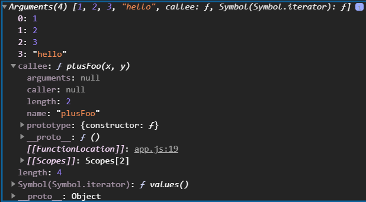

Такой элемент хоть и похож на массив, однако его называют псевдо массивом. В самом низу скриншота можно убедится что это **Object**. Но тем не менее его можно перебирать циклом обычным и через определенные лайф хаки например **call** или **apply** и т.д. можно превратить в обычный массив, но это отдельная история.

Такого нет у стрелочной функции. Например в функции **moreActions**. Попробую тоже самое.

```js
const moreActions = (a, b) => {
  console.log(arguments);
  a *= 2;
  b *= 3;
  return a + b;
};
```

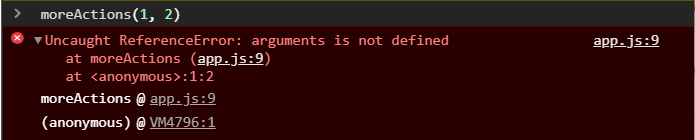

Это первое основное отличие.

Так же стрелочные функции не имеют собственного контекста т.е. у них нет собственного **this** и они его берут из контекста на уровень выше. т.е. наша функция имеет, когда мы например объявляем в качестве мотода объекта, ее **this** будет всегда ссылаться на объект.

```js
const obj = {
  firstName: "Konstantine",
  getFirstName() {
    console.log(this);
  },
};

obj.getFirstName();
```

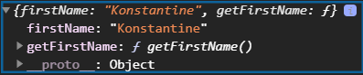

И наш **this**, как мы видим в консоли, указывает на **obj** в контексте которого он был вызыван.

Такая история не работает со стрелочными функциями

```js
const obj = {
  firstName: "Konstantine",
  age: 30,
  getFirstName() {
    console.log(this);
  },
  getAge: () => console.log(this),
};

obj.getAge();
```
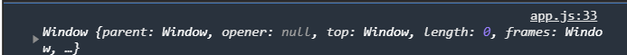

Так как стрелочные функции не имеют собственного контекста, они берут этот контекст с уровня выше. Уровень выше над объектом это глобальный объект **window**. При этом к стрелочным функциям мы можем применить **call** и **apply**, но **this** передаваемый в эти методы т.е. контекст вызова ни как не повлияет на эту функцию т.е. она примет аргументы если мы ей передадим через **call** и **apply**, но именно **this** она свой не изменит.
Это можно исправить несколькими вариантами. **getAge** заворачиваю в функцию. Так же создаю промежуточное свойство **getAgeArrow:** и присваиваю **null**.

```js
const obj = {
  firstName: "Konstantine",
  age: 30,
  getFirstName() {
    console.log(this);
  },
  getAgeArrow: null,
  getAge() {
    this.getAgeArrow = () => console.log(this);
  },
};

obj.getAge();
obj.getAgeArrow();
```

т.е. мы объявили метод **getAge**. Внутри я беру свойство **this.getAgeArrow**. Потому что как **getAge** как обычная функция имеет доступ к объекту **obj** и **this** у него работает правильно. Я получаю доступ к свойству которое изначально было **getAgeArrow: null**, и присваиваю функцию **() => console.log(this);** и далее я могу вызывать **obj.getAgeArrow();**
Вызываю именно так потому что в **getAgeArrow** храниться стрелочная функция которая имеет правильный контекст.

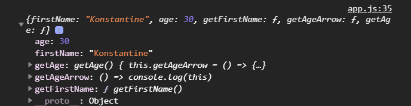

Имеет она его правильный потому что она была объявлена и записана в **getAge** и так как эта функция имеет свой контекст который находится внутри этой функции, а значит он тоже привязан к объекту **obj**.

Можно это сделать вот таким форматом. Я могу внутри **getAge** передать стрелочную функцию как **callback** в **setTimeout**. Вообще одно из самых распостраненных применений в стрелочной функции это как раз таки это применение их как **callback**. И как раз таки когда мы проходили **this** мы проходили потерю контекста, и я говорил о том что эту потерю можно исправить как раз таки использованием стрелочных функций 

```js
const obj = {
  firstName: "Konstantine",
  age: 30,
  getFirstName() {
    console.log(this);
  },
  getAgeArrow: null,
  getAge() {
    // this.getAgeArrow = () => console.log(this);
    setTimeout(() => console.log(this));
  },
};

obj.getAge();
obj.getAgeArrow();
```

Теперь когда мы вызываем **obj.getAge();** у нас ставится **setTimeout** и выполняется функция **() => console.log(this)**. Эта функция будет выполнена практически сразу. В этом тоже есть определенные нюансы...

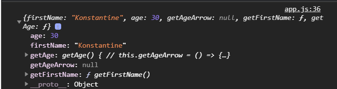

И у нас опять же есть доступ ко всем свойствам данного объекта потому что мы работали в рамках контекста функции **getAge**, которая внутри себя имеет контекст, и как раз таки стрелочная функция за счет того что она берет контекст на уровень выше, она его его отсюда **getAge** и получает и использует.

Но обычно стрелочные функции не используются как в качестве методов для объектов.
В основном самое распостраненное их применение это конечно же использование в качестве **callback** в различных методов массивов с которыми познакомимся позднее.


