# Перебирающие методы массивов.

[https://docs.google.com/presentation/d/1iRUQLMYVqmkI74mnsrjbDniS4VbsUplF6fipaUdV3Dc/edit?usp=sharing](https://docs.google.com/presentation/d/1iRUQLMYVqmkI74mnsrjbDniS4VbsUplF6fipaUdV3Dc/edit?usp=sharing),

[https://medium.com/@stasonmars/%D0%BE%D0%B1%D1%8A%D1%8F%D1%81%D0%BD%D1%8F%D0%B5%D0%BC-%D0%BC%D0%B5%D1%82%D0%BE%D0%B4%D1%8B-%D0%B2-%D0%BC%D0%B0%D1%81%D1%81%D0%B8%D0%B2%D0%B0%D1%85-js-filter-vs-map-vs-reduce-vs-foreach-995ef7468c4a](https://medium.com/@stasonmars/%D0%BE%D0%B1%D1%8A%D1%8F%D1%81%D0%BD%D1%8F%D0%B5%D0%BC-%D0%BC%D0%B5%D1%82%D0%BE%D0%B4%D1%8B-%D0%B2-%D0%BC%D0%B0%D1%81%D1%81%D0%B8%D0%B2%D0%B0%D1%85-js-filter-vs-map-vs-reduce-vs-foreach-995ef7468c4a),

[https://learn.javascript.ru/array-iteration](https://learn.javascript.ru/array-iteration)

<br>
<br>
<br>
<br>

Очень важная тема. Метод **sort** и метод **find**. 

Мы проходили циклы и знаем что с их помощью можно перебрать массивы.

Но в реальных проектах эти циклы не используются по причине того что они не выразительны, они не описывают того что происходит с массивом т.е. что вы хотите с ним сделать.

Читабельность кода и понимание того что здесь происходит это очень важная часть любого приложения.

Поэтому рассмотрим специальные перебираемые методы.

1. **forEach** - это метод просто перебора массива т.е. данный метод ничего не возвращает. Все методы принимают в качестве аргумента callback т.е. функцию обратного вызова. И в зависимости от метода, того что возвращает эта функция, будет меняться результат работы. В данном случае forEach просто перебирает массив и ничего не возвращает т.е. это как некая замена цикла for.
2. **filter** - из названия понятно что он делает.
3. **map** - этот метод возвращает новый массив основываясь на основе вызова callback.
4. **reduce** - так же довольно важный метод который позволяет разворачивать массив. Помогает формировать какие-то структуры, например из массива сделать объект
5. **some/every** - они позволяют проверить есть ли в массиве например some возвращает true ИЛИ false в зависимости от того что есть хотя бы один элемент удовлетворяющий нашему callback или условию в callback. every соответственно вернет true если все элементы массива удовлетворяют условию нашего callback.
6. **sort** - сортировка массива.
7. **find** - для поиска какого-то элемента массива.

<br>
<br>
<br>
<br>

Начнем с **ForEach**.

У меня есть массив пользователей.

```js
const users = [
  {
    _id: "5cdce6ce338171bb473d2855",
    index: 0,
    isActive: false,
    balance: 2397.64,
    age: 39,
    name: "Lucile Finley",
    gender: "female",
    company: "ZOXY",
    email: "lucilefinley@zoxy.com",
    phone: "+1 (842) 566-3328",
    registered: "2015-07-12T09:39:03 -03:00"
  },
  {
    _id: "5cdce6ce0aa8d071fa4f4cc5",
    index: 1,
    isActive: true,
    balance: 2608.48,
    age: 33,
    name: "Woodward Grimes",
    gender: "male",
    company: "FORTEAN",
    email: "woodwardgrimes@fortean.com",
    phone: "+1 (960) 436-3138",
    registered: "2014-09-08T03:24:39 -03:00"
  },
  {
    _id: "5cdce6ce103de120d32d6fe4",
    index: 2,
    isActive: true,
    balance: 1699.99,
    age: 25,
    name: "Robinson Coleman",
    gender: "male",
    company: "GENMOM",
    email: "robinsoncoleman@genmom.com",
    phone: "+1 (852) 543-3171",
    registered: "2019-04-23T08:24:58 -03:00"
  },
  {
    _id: "5cdce6cebada7a418d8ccb3d",
    index: 3,
    isActive: true,
    balance: 2621.84,
    age: 25,
    name: "Austin Benton",
    gender: "male",
    company: "ZILIDIUM",
    email: "austinbenton@zilidium.com",
    phone: "+1 (977) 573-2627",
    registered: "2016-08-02T10:08:24 -03:00"
  },
  {
    _id: "5cdce6ced81fe99596d9cef5",
    index: 4,
    isActive: true,
    balance: 1297.31,
    age: 37,
    name: "Casandra Stout",
    gender: "female",
    company: "ANACHO",
    email: "casandrastout@anacho.com",
    phone: "+1 (929) 465-3804",
    registered: "2018-04-14T11:27:26 -03:00"
  },
  {
    _id: "5cdce6ce6c3ae6c4d6f39e88",
    index: 5,
    isActive: false,
    balance: 2165.49,
    age: 20,
    name: "Valencia Carrillo",
    gender: "male",
    company: "XEREX",
    email: "valenciacarrillo@xerex.com",
    phone: "+1 (977) 522-3378",
    registered: "2014-02-14T11:45:27 -02:00"
  }
];
```

Каждый пользователь это отдельный объект состоящий из множество полей.

Здесь я обращаюсь к массиву **user** и вызываю у него метод **forEach()**. Он в свою очередь принимает **callback**. **callback** буду передавать в виде функции стрелок. В этот **callback** будет передаваться три значения это элемент массива, я его назову **user**, потому что отдельный элемент массива это отдельный **user**. Вторым элементом будет передаваться **id** этого элемента в массиве, называю просто **i**. И третий параметр это весь массив **arr**. Далее в теле цикла вывожу эти элементы в консоль.

```js
users.forEach((user, i, arr) => {
  console.log(users, i, arr);
});
```
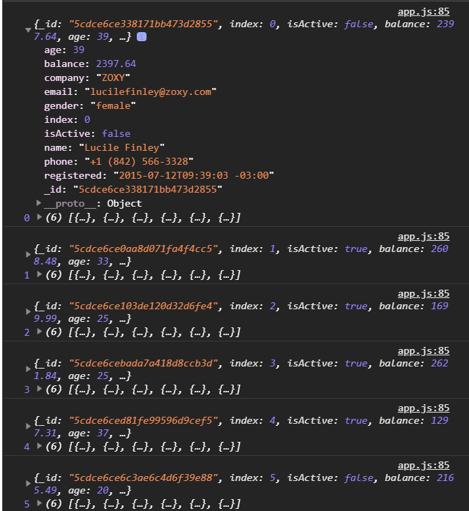

Выводится весь массив.

В данном случае если нам какие-то элементы не нужны например **i** и **arr**. 

```js
users.forEach((user) => {
  console.log(user);
});
```
И я буду получать только **user**. Все зависит от ситуации. Фактически это тоже самое что и цикл **for** только более короткая его версия.

<br>
<br>
<br>
<br>

Рассмотрим метод **filter**. Который более интересен. Например мы с вами хотим отфильтровать пользователей. У каждого из наших пользователей есть поле **age** указывающее на его возраст. Мы например хотим получить только тех пользователь чей возраст меньше 30. Это обычная ситуация например у вас есть там какая-нибудь фильтрация например в списке пользователей в приложении.
У метода **users** вызываю **filter()**. Он так же на каждой итерации принимает в **callback** принимает один элемент массива это **user**, **i** , **arr**. Но так как мне нужен один элемен массива я оставляю только **user**. 
И здесь очень просто **filter** вернет новый массив основываясь на результате вызова **callback**. Если результат вызова **callback** будет **true**, то этот элемент войдет в выборку и попадет в новый массив. 
Если будет **false** то этот элемент не попадет в новый массив. Поэтому достаточно написать **user.age < 30**.

```js
const userLess30 = users.filter((user) => user.age < 30);
console.log(userLess30);
```

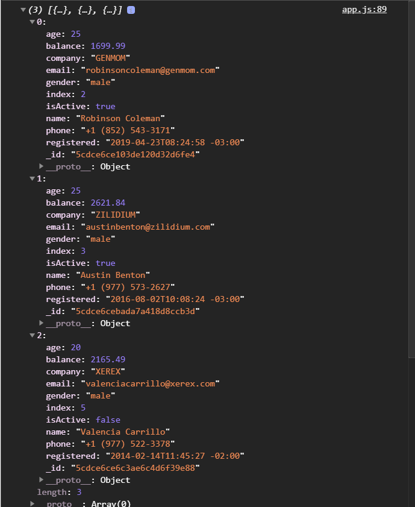

Еще раз повторюсь что **filter** возвращает новый массив в который входят только те элементы для которых переданный **callback** внутрь **filter** вернул **true**.

Еще один пример. У нас у каждого из пользователей есть поле **isActive**. И соответственно мы хотим выбрать только ответственных пользователей. Здесь все тоже самое только другое условие.

```js
const activeUsers = users.filter((user) => user.isActive === true);
console.log(activeUsers);
```
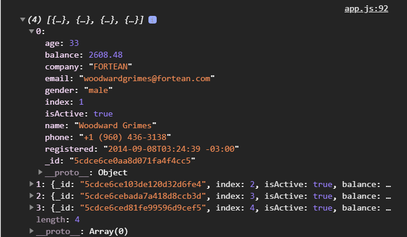

И он находит четырех пользователей.

Однако приравнивать это к **true** не обязательно так как данное условие все равно должно вернуть **true**. Можно просто записать вот так.

```js
const activeUsers = users.filter((user) => user.isActive);
console.log(activeUsers);
```
так как он все равно выберет пользователей соответствующих данному блоку условия.

Вы можете заметить на сколько выразительнее и читабельнее становится код. Это мы могли бы с делать с помощью цикла **for** но это было бы абсолютно не читабельно. Было бы больше кода.

<br>
<br>
<br>
<br>

Рассмотрим метод **map**. Данный метод позволяет создать новый массив из того что будет возвращать нам **callback** переданный в него. т.е. у нас например у нас есть список пользователей и мы хотим получить в виде массива все имена наших пользователей.

Метод **map** точно так же принимает три аргумента, которые не обязательно последние два пердавать если вы их не будуте использовать. И map вернет новый массив состоящий из тех элементов, тех значений который вернет на каждой итерации **callback**. Я в **callback** буду возвращать **user.name**.

```js
const usersName = users.map((user) => user.name);
console.log(usersName);
```
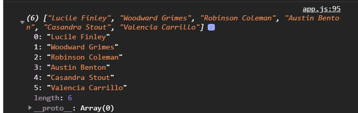

Так мы можем сформировать массив чего угодно, любых других данных. Например я хочу вернуть объект с именем и возрастом. т.е. не хочу полный объект, а хочу какие-то часть полей взять. Я могу написать круглые скобки, в них фигурные скобки и написать в них.

```js
const usersName = users.map((user) => ({
  name: user.name,
  age: user.age,
}));
console.log(usersName);
```
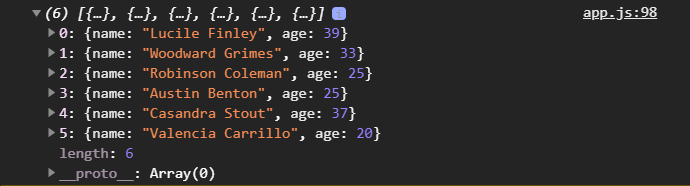

И я получаю массив из объектов где каждое поле это будет соответственно **age** и **name**. т.е. я могу сформировать какой-то новый массив в зависимости от ситуации.

<br>
<br>
<br>
<br>
<br>

Рассмотрим метод **reduce**. Он нам позволяет развернуть массив. Преобразовать массив в какую-то другую сущность или например банально что-то посчитать.

У нас у каждого **user** есть **balance** и нам нужно проссумировать сумму всех балансов пользователей, посчитать **total** баланс такой. **const totalBalance = users.reduce()** принимает уже два аргумента. Первый аргумент это **callback** а второй аргумент это старотовое значение. Если второй аргумент не передан то стартовым элементом будет считаться первый элемент массива. Мы передаем стартовое значение в который мы будем плюсовать наш баланс.

Сам **callback** принимает два параметра. Первый параметр это так называемый аккумулятор **acc** - это как раз таки стартовое значение, помимо того что это стартовое значение это переменная в которой будет храниться результат предыдущей итерации. 

Вторым параметром **callback** будет сам **user**. и так же здесь принимается индекс и весь массив и я их не передаю.

```js
const totalBalance = users.reduce((acc, user) => {
  console.log(acc, user);
}, 0);
```
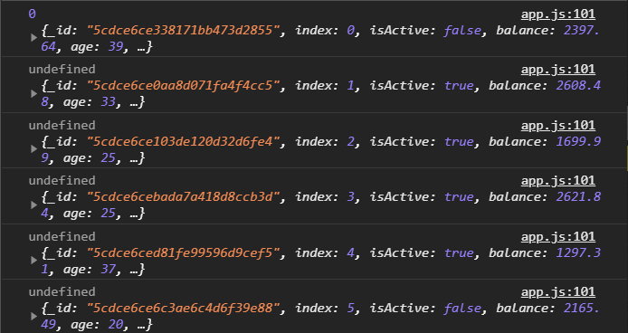

Если я уберу старотовое значение и пока уберу вызов **user** а то он занимает очень много места.

```js
const totalBalance = users.reduce((acc, user) => {
  console.log(acc);
});
```
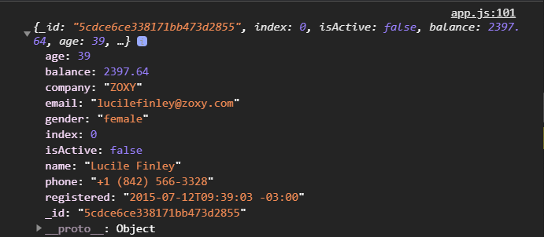

Он передает только стартовое значение.

Если передаю стартовое значение

```js
const totalBalance = users.reduce((acc, user) => {
  console.log(acc);
}, 0);
```

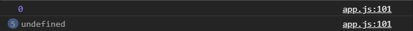

то сначало идет **0**, а потом идет **undefined**. Это происходит потому что итерации продолжаются т.е. **reduce** проходится по массиву, по каждому элементу и он нам дает результат предыдущего вызова. Первый вызов **acc** равер ноль, **callback** функция ничего не вернула и она возвращает **undefined** котороую мы и получаем на следующей итерации.

Если я буду возвращать acc то на каждой итерации я буду получать наши нули.

```js
const totalBalance = users.reduce((acc, user) => {
  console.log(acc);
  return acc;
}, 0);
```


от итерации к итерации будет передаваться значение.

Теперь я могу сделать так.

```js
const totalBalance = users.reduce((acc, user) => {
  console.log(acc);
  return (acc += user.balance);
}, 0);
```

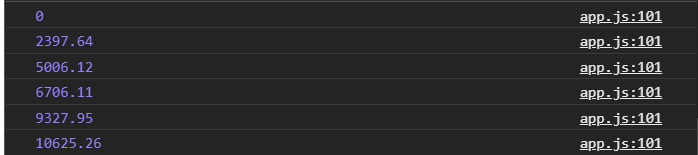

Т.е. каждое предыдущее значение ссумируется со значением на текущей итерации и выводится сумма и т.д. и т.д.

Если я выведу в консоль **totalBalance** то я выведу последнее оставшееся значение которое и будет являться суммой всех балансов пользователей.

```js
const totalBalance = users.reduce((acc, user) => {
  console.log(acc);
  return (acc += user.balance);
}, 0);

console.log(totalBalance);
```


Это можно сократить написав в одну строку.

```js
const totalBalance = users.reduce((acc, user) => acc += user.balance, 0);

console.log(totalBalance);
```


Но так же очень частой задачей может быть сформировать из массива объект объектов. Например мы с вами получили массив пользователей, который у нас есть, и хотим сформировать из этого массива объект где ключем будет **id** одного пользователя, а значением весь объект пользователя.
Опять же можно было бы использовать обычный цикл в котором создать сначало пустой объект до цикла. Потом пройтись циклом по массиву и на каждой итерации создавать один элемент объекта, но опять же это получается немного длиннее по коду и не совсем сразу понятно.

Можно это сделать при помощи **reduce**. Перебираю массив **const userObj = users.reduce(() =>{}, {})** и в качестве стартового значения передаю пустой объект. На каждой итерации мы получим наш аккумулятор **acc** исходное значение, и получим одного пользователя **user** т.е. **const userObj = users.reduce((acc, user) =>{}, {})**. В теле **callback** в **acc[]** записывать в качестве ключа **user._id** т.е. это будет строка и будем это приравнивать к объекту user т.е. мы будем записывать туде объект **user**. И далее я буду возвращать **acc**.

```js
const userObj = users.reduce((acc, user) => {
  acc[user._id] = user;
  return acc;
}, {});

console.log(userObj);
```
И мы получаем объект объектов.

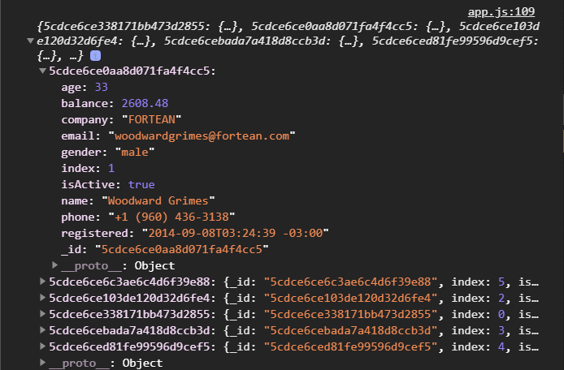

С объектами бывает просто работать проще по причине того что к ним быстрее достучаться. Например если мне нужен какой-нибудь пользователь я их вывел в список, я знаю каждого id, то дальше мне очень просто по этому id доставать его из объекта нежели искать его в массиве и перебирать массив. Поэтому это довольно расспостраненная штука когда вам нужно сформировать из массива объект объектов.


Теперь два метода схожих это **some/every**.

Метод **some** возвращает **true** или **false** если хотябы один элемент массива соответствует **callback** вернет **true**.

Проверим что у нас есть хотя бы один мужчина в списке. **const isMale = users.some((user) => {})**, **some** точно так же как и все остальные принимает **callback** который принимает один элемент массива и **index** и **array** которые я писать не буду. 

В этом **callback** я должен возвращать какое-то выражение которое будет в результате преобразовываться в **true** или в **false**. Соответсвенно мы проверяем что **const isMale = users.some((user) => users.gender === "maile");** т.е. мы как бы спрашиваем если кто-нибудь среди пользователей чей пол равен мужскому т.е. **male**.

```js
const isMale = users.some((user) => user.gender === "male");
console.log(isMale);
```


Возвращает **true** так как хотябы один пользователь такой есть.

Метод every напротив проверяет что каждый элемент удовлетворяет т.е. для каждого элемента массива **callback** вернет **true**.

```js
const isAllMale = users.every((user) => user.gender === "male");
console.log(isAllMale);
```


Это означает что нет не каждый, есть и женщины.

Мы можем проверить всем ли пользователям больше 18-ти.

```js
const isAll18 = users.every((user) => user.age > 18);
console.log(isAll18);
```


Возвращается **true** так как все пользватели старше 18.

Эти методы перебирающие очень важны. Их использовать нужно в любом случае когда у вас стоит какая-то задача по работе с массивами потому что как вы видите они во-первых занимают меньше кода. Во-вторых они гараздо читабельнее и понятнее.

<br>
<br>
<br>
<br>

Рассмотрим метод **find**.
Этот метод дает возможность найти какой-то элемент в массиве. Метод **find** в качестве параметра принимает элемент массива. И для того элемента массива для которого **callback** вернет **true**, тот и будет возвращен методом **find**.

```js
const user = users.find((user) => user.name === "Valencia Carrillo");
console.log(user);
```
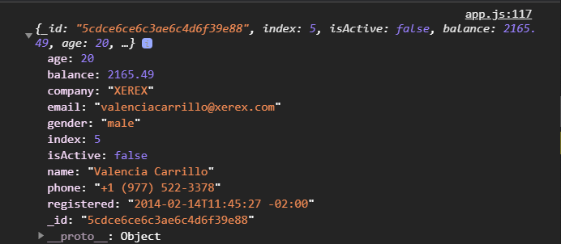

<br>
<br>
<br>
<br>

Рассмотрим метод **sort**.
Метод сортировки может для вас оказаться немного странным по началу и принцып его работы. Но на самом деле все довольно просто.
В его сортировке есть несколько нюансов. Первый нюанс заключается в том что он изменяет исходный массив. Второй нюанс в том что он сортирует по умолчанию по ликсическому значению т.е. он сортирует как строки элементы массива.

```js
const strArr = ["Konstantine", "Bill", "Anna"];
strArr.sort();
console.log(strArr);
```
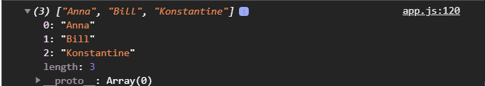

И вот он отсортировал по алфавиту.

Но если я попробую сделать тоже самое с массивом чисел, то у меня получится совсем не так.

```js
const numArr = [10, 7, 44, 32];
numArr.sort();
console.log(numArr);
```
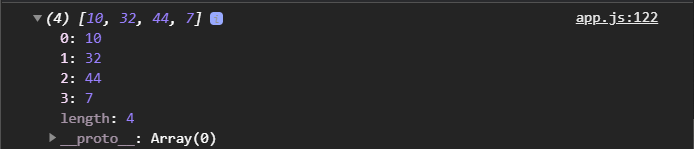

Все дело в том как сортирует метод sort. В ликсическом значении цифра 7 больше чем другие цифры в этом массиве.

Для того что бы заставить метод sort сортировать правильно в него нужно передавать callback. Этот callback будет принимать пары, обычно их называют a b, но я предпочитаю **prev** и **next**.

```js
const strArr = ["Konstantine", "Bill", "Anna"];
strArr.sort();
const numArr = [10, 7, 44, 32];
numArr.sort((prev, next) => {
  console.log(prev, next);
});
console.log(numArr);
```
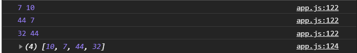

он передает пары.

Что бы метод **sort** сортировал правильно мы должны возвращать одно из трех значений. Это либо цифру **0**, либо цифру **> 0**, либо цифру меньше ноля.
Если наша цифра будет больше ноля то элементы нужно поменять местами т.е. если у нас предположим есть **10** и **7**. Если мы вычтем **10** - **7** это будет положительное число, и это означает что число слева, в массиве, больше чем число справа тем самым число что справо нужно поставить в переди т.е. левее и т.д.
Если мы сделаем наоборот **7-10**, то нам вернется отрицательное число. Таким образом сначало должно идти **7** а потом **10**. И если мы ноль возвращаем, то ничего не сортировать. Здесь все упрощается до вот такой записи.

```js
const numArr = [10, 7, 44, 32];
numArr.sort((prev, next) => prev - next);
console.log(numArr);
```
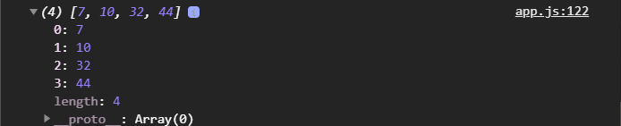

Просто на каждой паре чисел мы вычитаем и если будет положительное число мы будем переставлять. Если будет отрицательно будет так же переставлять. Если ноль то ничего переставлять не будет.

Тоже самое мы можем делать не только с примитивными типами, но и с массивами объектов. В параметрах **callback** я также принимаю **prev** и **next** только теперь это объекты. Для более понятливости переименовываю в **prevUser** и в **nextUser**. В теле функции делаю все тоже самое только добавляю при этом интересующие поля объектов.

```js
const users = [
  {
    _id: "5cdce6ce338171bb473d2855",
    index: 0,
    isActive: false,
    balance: 2397.64,
    age: 39,
    name: "Lucile Finley",
    gender: "female",
    company: "ZOXY",
    email: "lucilefinley@zoxy.com",
    phone: "+1 (842) 566-3328",
    registered: "2015-07-12T09:39:03 -03:00",
  },
  {
    _id: "5cdce6ce0aa8d071fa4f4cc5",
    index: 1,
    isActive: true,
    balance: 2608.48,
    age: 33,
    name: "Woodward Grimes",
    gender: "male",
    company: "FORTEAN",
    email: "woodwardgrimes@fortean.com",
    phone: "+1 (960) 436-3138",
    registered: "2014-09-08T03:24:39 -03:00",
  },
  {
    _id: "5cdce6ce103de120d32d6fe4",
    index: 2,
    isActive: true,
    balance: 1699.99,
    age: 25,
    name: "Robinson Coleman",
    gender: "male",
    company: "GENMOM",
    email: "robinsoncoleman@genmom.com",
    phone: "+1 (852) 543-3171",
    registered: "2019-04-23T08:24:58 -03:00",
  },
  {
    _id: "5cdce6cebada7a418d8ccb3d",
    index: 3,
    isActive: true,
    balance: 2621.84,
    age: 25,
    name: "Austin Benton",
    gender: "male",
    company: "ZILIDIUM",
    email: "austinbenton@zilidium.com",
    phone: "+1 (977) 573-2627",
    registered: "2016-08-02T10:08:24 -03:00",
  },
  {
    _id: "5cdce6ced81fe99596d9cef5",
    index: 4,
    isActive: true,
    balance: 1297.31,
    age: 37,
    name: "Casandra Stout",
    gender: "female",
    company: "ANACHO",
    email: "casandrastout@anacho.com",
    phone: "+1 (929) 465-3804",
    registered: "2018-04-14T11:27:26 -03:00",
  },
  {
    _id: "5cdce6ce6c3ae6c4d6f39e88",
    index: 5,
    isActive: false,
    balance: 2165.49,
    age: 20,
    name: "Valencia Carrillo",
    gender: "male",
    company: "XEREX",
    email: "valenciacarrillo@xerex.com",
    phone: "+1 (977) 522-3378",
    registered: "2014-02-14T11:45:27 -02:00",
  },
];

users.sort((prevUser, nextUser) => prevUser.age - nextUser.age);
console.log(users);
```

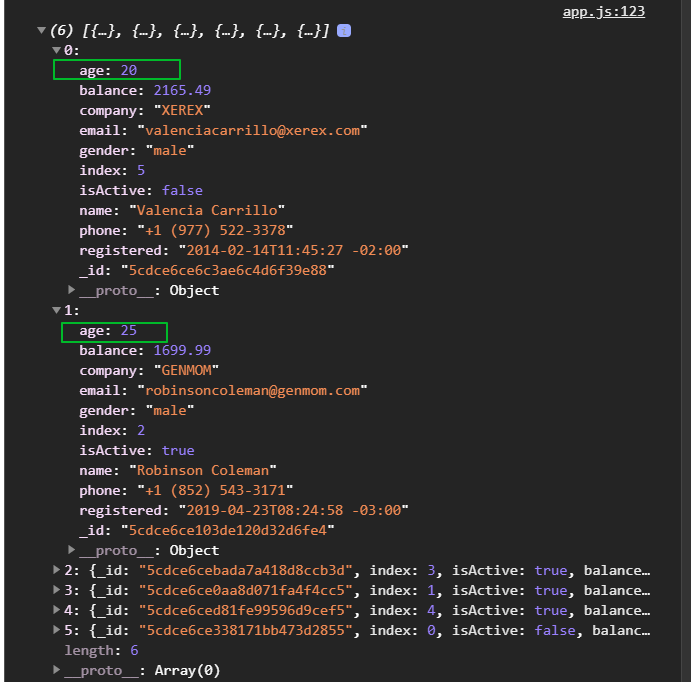

то мы теперь увидим что пользователи отсортированы по возрасту.