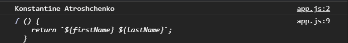
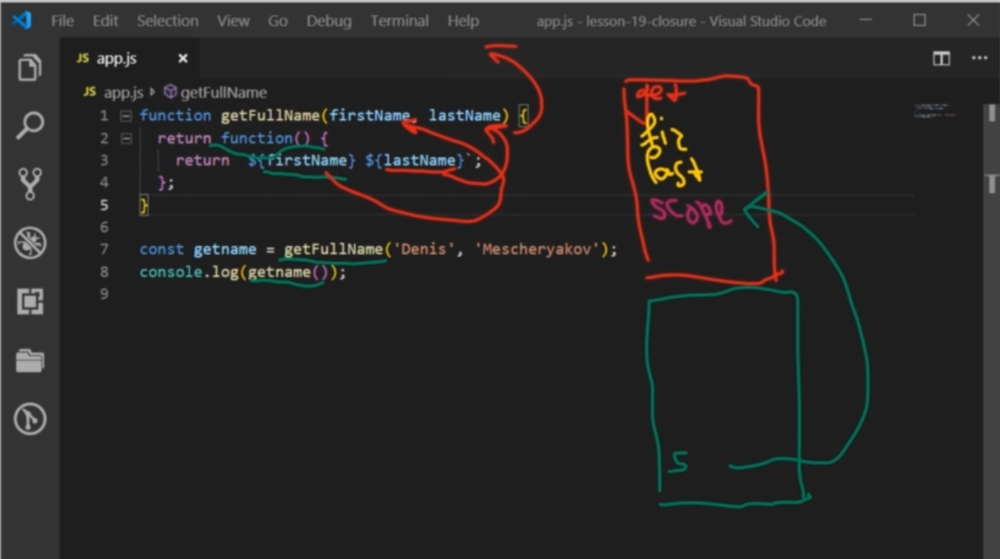
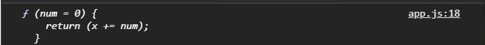
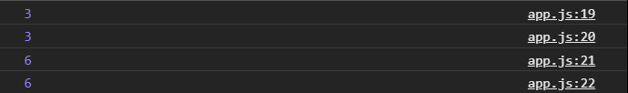
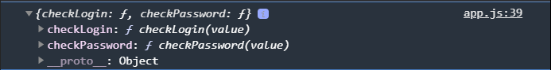
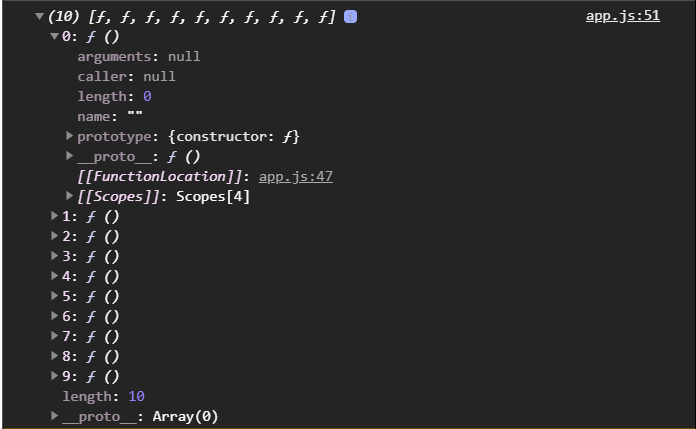
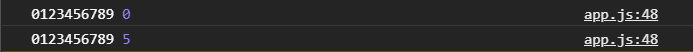
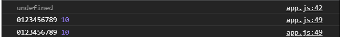

# Замыкание

<br>
<br>
<br>

[https://docs.google.com/presentation/d/17XkkZaPwrNgApxz_07RymNPBYFTMK4lmZLjKtkHUEu8/edit?usp=sharing](https://docs.google.com/presentation/d/17XkkZaPwrNgApxz_07RymNPBYFTMK4lmZLjKtkHUEu8/edit?usp=sharing),

<br>

[https://medium.com/@sshambir/%D0%BE%D1%81%D0%B2%D0%B0%D0%B8%D0%B2%D0%B0%D0%B5%D0%BC-%D0%B7%D0%B0%D0%BC%D1%8B%D0%BA%D0%B0%D0%BD%D0%B8%D1%8F-%D0%B2-javascript-5b83267ef7d1](https://medium.com/@sshambir/%D0%BE%D1%81%D0%B2%D0%B0%D0%B8%D0%B2%D0%B0%D0%B5%D0%BC-%D0%B7%D0%B0%D0%BC%D1%8B%D0%BA%D0%B0%D0%BD%D0%B8%D1%8F-%D0%B2-javascript-5b83267ef7d1),

<br>

[https://medium.com/javascript-scene/master-the-javascript-interview-what-is-a-closure-b2f0d2152b36](https://medium.com/javascript-scene/master-the-javascript-interview-what-is-a-closure-b2f0d2152b36),

<br>

[https://medium.com/dailyjs/i-never-understood-javascript-closures-9663703368e8](https://medium.com/dailyjs/i-never-understood-javascript-closures-9663703368e8)

<br>
<br>
<br>
<br>
<br>

>**Замыкание это та штука которую все спрашивают на собеседовании. Это одна из фундаментальных вещей JS. При этом она относительно не сложная. Хотя при первом столкновении с ней могут быть некие трудности и недопонимания.**

**Замыкание** - это функция которая ссылается на свободные переменные. Свободные переменные это все переменные которые небыли переданы этой функции как параметры и небыли объявлены внутри этой функции как локальные переменные.

Другими словами, функция определенная в замыкании запоминает то окружение в котором она была создана и имеет к нему доступ, а так же она имеет доступ к окружению выше и может соответственно получать различные переменные из окружения родительских функций и т.д.

Создаю функцию **getFullName()** она будет принимать два параметра это **firstName** и **lastName**. Вывожу это в консоль. И далее в теле этой функции возвращаю другую функцию которая в свою очередь будет использовать эти переменные в замыкании.

```js
function getFullName(firstName, lastName) {
  console.log(firstName, lastName);
  return function () {
    return `${firstName} ${lastName}`;
  };
}
```

Передаю результат вызова в переменную **getname**, и в вызове функции передаю два параметра **Konstantine**, **Atroshchenko**.

```js
function getFullName(firstName, lastName) {
  console.log(firstName, lastName);
  return function () {
    return `${firstName} ${lastName}`;
  };
}

const getname = getFullName("Konstantine", "Atroshchenko");
console.log(getname);
```



В первую очередь в консоли выводится переданный **firsName** и **lastName** которые мы видим на второй строке. И на 9-ой строке в переменной **getName** будет храниться функция которая в случае вызова

```js
function getFullName(firstName, lastName) {
  console.log(firstName, lastName);
  return function () {
    return `${firstName} ${lastName}`;
  };
}

const getname = getFullName("Konstantine", "Atroshchenko");
console.log(getname());
```


вернет строку с нашим **firstName** и **lastName**.

Удаляю на второй строке **console.log(firstName, lastName);**

```js
function getFullName(firstName, lastName) {
  return function () {
    return `${firstName} ${lastName}`;
  };
}

const getname = getFullName("Konstantine", "Atroshchenko");
console.log(getname());
```

Что здесь происходит? При каждом вызове функции **getFullName** будет создаваться новый контекст исполнения. У нас есть глобальный контекст исполнения в котором мы имеем доступ к таким переменным как **window**, **document** и т.д.
Так же создается вложенный контекст исполнения для вложенной функции. И у нас будет образовываться внутри у каждой функции лексическое окружение.

Он сделал скрин функции и объясняет. Попробуй понять. Для каждой из наших функций создается лексическое окружение в котором будут храниться переменные которые были объеялены внутри функции. И специальное своейство **scope** которое будет хранить в себе ссылку на лексическое окружение выше. Т.е. в данном случае у нас будет лексическое окружение для функции **getFullName**, в которой будут в качестве параметров получены **firstName** и **lastName**. И далее будет свойство **scope**. У функции которую мы возвращаем

```js
return function () {
  return `${firstName} ${lastName}`;
};
```

вот его скриншот



у нее будет так же лексическое окружение в котором нет ни каких параметров, там могут быть аргументы, но в данном случае это не критично. Но у нее есть так же свойство **scope** которое ведет на уровень выше, на родительскую функцию **getFullName**.

Таким образом когда мы внутри вложенной функции пытаемся обратиться к переменным. А в данном случае у нас функция **getFullName** уже прекратила свою работу т.к. я ее вызвал, она выполнилась и вернула вложенную функцию. Соответственно дальше когда я вызываю **getname**, я уже вызываю вложенную функцию. Данная функция запомнила свое окружение в котором она была объявлена. Она пытается выполнить данный код и обращается к переменным **firstName** и **LastName**. Данная функция смотрит внутри себя, у нее небыло таких переменных объявлено и переданно в качестве параметров. Соответственно она идет на уровень выше и ищет их в параметрах родительской функции **getFullName**. Если она и там их не обнаружит, искомые аргументы, то она пойдет еще на уровень выше и будет искать их в более высоком уровне окружения. Таким образом она по цепочке может переходить по уровням получая доступ к тем или иным переменным, при этом возвращаемая функция может запоминать эти переменные в лексическом окружении и может их изменять, получать измененное состояние.

Смотрим как это работает. Создаю функцию **updateValue()** эта функция будет принимать какое-то значение, **val**. В теле функции сохранять его в переменной **x = val**. И возвращать другую функцию которая в свою очередь будет так же получать значение **num** и в теле вложенной функции **update** значение **x** т.е. **return (x +=num)**.

```js
function updateValue(val) {
  let x = val;
  return function (num) {
    return (x += num);
  };
}
```
т.е. мы создали функцию **updateValue**, она примет при вызове какое-то значение **val** и присвоит его в переменную x и вернет другую функцию.
Вложенная функция при вызове тоже примет какое-то значение, прописываю значение по умолчанию аргументам глобальной и локальной функции.

```js
function updateValue(val = 0) {
  let x = val;
  return function (num = 0) {
    return (x += num);
  };
}
```
локальная функция изменит **x**, который был объявлен в родителькоской функции.

Создаю переменную **updtVal =** которой присваиваю результат вызова функции **updateValue** и в ее параметры напримет передаю цифру **2**.

```js
function updateValue(val = 0) {
  let x = val;
  return function (num = 0) {
    return (x += num);
  };
}

const updtVal = updateValue(2);
console.log(updtVal);
```
Помним о том что мы возвращаем функцию, то в этой переменной будет храниться функция.



Это значит что я могу эту функцию вызвать и передать в ее параметры например цифру **1**.

```js
function updateValue(val = 0) {
  let x = val;
  return function (num = 0) {
    return (x += num);
  };
}

const updtVal = updateValue(2);
console.log(updtVal(1));
```


т.е. вызвалась вот эта функция 

```js
return function (num = 0) {
    return (x += num);
  };
```

В num была передана цифра **1** и был изменен  **х** на уровне выше.

При это если я еще раз вызову эту функцию и передат туда **0**.

```js
function updateValue(val = 0) {
  let x = val;
  return function (num = 0) {
    return (x += num);
  };
}

const updtVal = updateValue(2);
console.log(updtVal(1));
console.log(updtVal(0));
```


то цифра три остается измененная. Получается запоминаем то окружение, в том числе мы его изменили перед этим на 18 строке, но на 19 строке оно остается измененным.

Что самое интересное это то, что если мы создадим еще одну такуюже функцию **updtVal2** и сделаем несколько ее вызовов.

```js
function updateValue(val = 0) {
  let x = val;
  return function (num = 0) {
    return (x += num);
  };
}

const updtVal = updateValue(2);
const updtVal2 = updateValue(4);
console.log(updtVal(1));
console.log(updtVal(0));
console.log(updtVal2(2));
console.log(updtVal2(0));
```



то мы увидим что у нас будут разные числа. Цифра 3 при вызове **updtVal**, а цифра 6 при вызове **updtVal2**. Это нас приводит к выводу что во-первых при каждом выводе создается новый контекст исполнения и новое лексическое окружение. Соответственно эти две функции **updtVal** и **updtVal2** т.е. мы вроде возвращаем одну и туже функцию

```js
return function (num = 0) {
    return (x += num);
  };
```
Но она будет работать с разным окружением с разным контекстом исполнения, соответственно у нее будет разный **val** разный **х** и они будут менять разные переменные не зависимо друг от друга. В каждый момемент времени у нас будет работать только один контекст исполнения. Соответственно при каждом вызове будут разные значения. К каким переменным будет иметь доступ  функция через замыкание определяется от того где она была объявлена.

Немного возможно сложная концепция.

<br>
<br>
<br>
<br>

Еще один очень юзабельный пример это когда мы хотим скрыть доступ к каким-то переменным и вернуть наружу только набор методов в который позволяет как-то взаимодействовать с этими переменными.

Например создаю функцию которая называется **checkCred(){}** и она будет в себе хранить две переменные **const login** и **const password**.

И мы можем наружу, из этой функции, вернуть объект с методами т.е. до этого мы возвращали просто другие функции. Сейчас мы можем вернуть объект с методами. В объекте прописываю функцию **checkLogin** которая будет принимать значение которое будет передавать пользователь, а возвращать мы будем **login === value**. 

И тоже сомое для **checkPassword**

```js
function checkCred() {
  const login = "rest";
  const password = "somePassword";

  return {
    checkLogin(value) {
      return login === value;
    },
    checkPassword(value) {
        return password === value;
      },
  };
}
```
Что мы сделали таким образом? Мы создали локальные переменные const **login = "rest";** и **const password = "somePassword";** внутри функции **checkCred** к которым нет доступа снаружи. Мы далее вернули во внешний мир объект с двумя методами **checkLogin** и **checkLogin** который эти методы в замыкании получают доступ к переменным **login** и **password** и сравнивают их с тем **value** который был передан и возвращают **true** или **false**.

```js
function checkCred() {
  const login = "test";
  const password = "somePassword";

  return {
    checkLogin(value) {
      return login === value;
    },
    checkPassword(value) {
      return password === value;
    },
  };
}

const check = checkCred();
console.log(check);
```



Правильно он нам вернул объект с двумя методами **checkLogin** и **checkPassword**. Теперь я могу их вызвать. К примеру вызову **checkLogin** и передав в него аракадабру.

```js
function checkCred() {
  const login = "test";
  const password = "somePassword";

  return {
    checkLogin(value) {
      return login === value;
    },
    checkPassword(value) {
      return password === value;
    },
  };
}

const check = checkCred();
console.log(check.checkLogin('asdf'));
```


Он возвращает **false** потому что то что я ему передал не сопостовимо с **login**. Если я передам правильный логин, то он возвращает **true**.

Но при этом как вы видите мы не имеем прямого доступа к переменным **login** и **password**. Только через отдельные методы.

Еще не маловажный нюанс заключается в том что переменные которые были объявлены и используются в замыкании. Они будут оставаться и храниться в памяти и не будут очищаться ни как потому что у нас будет связь между ними и теми функциями или методами которые их используют, которые к ним имеют доступ.

<br>
<br>
<br>

Теперь еще один пример. Создаю функцию **closureExample(){}**. Данная функция будет создавать массив функций **const arrOfFunc = []**. И у нас будет переменная **value = ''**. Дальше я создаю цикл **for (let i = 0; i < 10; i++)**. На каждой итерации этого цикла мы будем изменять переменную **value += i;** И так же на каждой итерации в массив **arrOfFunc буду push()** функцию. Функции как вы помните это объекты и мы их можем передавать куда угодно. В параметры **push** добавляю функцию которая будет обращаться к **value** и **i**.

```js
function closureExample() {
  const arrOfFunc = [];
  const value = "";

  for (let i = 0; i < 10; i++) {
    value += i;
    arrOfFunc.push(function () {
      console.log(value, i);
    });
  }
}
```
Это такой же класический пример который могут предложить на собеседовании в качестве задачи, чуть может в упрощенном варианте.

вывожу в консоль результат добавления **console.log(arrOfFunc);** и вызываю функцию **closureExample();**

```js
function closureExample() {
  const arrOfFunc = [];
  let value = "";

  for (let i = 0; i < 10; i++) {
    value += i;
    arrOfFunc.push(function () {
      console.log(value, i);
    });
  }
  console.log(arrOfFunc);
}
closureExample();
```



И как вы видите в консоль выводит 10-ть функций каждая из которых делает одно и тоже ссылается к **value** и к **i** т.е. c **onsole.log(value, i);**
Вызов в консоль удаляю а вместо этого возвращаю этот массив 

```js
function closureExample() {
  const arrOfFunc = [];
  let value = "";

  for (let i = 0; i < 10; i++) {
    value += i;
    arrOfFunc.push(function () {
      console.log(value, i);
    });
  }
  return arrOfFunc;
}
const res = closureExample();
```
Теперь пробую вызвать функции которые там содержаться

```js
function closureExample() {
  const arrOfFunc = [];
  let value = "";

  for (let i = 0; i < 10; i++) {
    value += i;
    arrOfFunc.push(function () {
      console.log(value, i);
    });
  }
  return arrOfFunc;
}
const res = closureExample();
res[0]();
```


И мы получаем странное значение. И еще раз попробуем вызвать.

```js
function closureExample() {
  const arrOfFunc = [];
  let value = "";

  for (let i = 0; i < 10; i++) {
    value += i;
    arrOfFunc.push(function () {
      console.log(value, i);
    });
  }
  return arrOfFunc;
}
const res = closureExample();
res[0]();
res[5]();
```


**i** мы получаем правильно согласно итерации, а **value** мы получаем все значения которые были в цикле.

Дело в том что когда фактически мы вызываем функции которые были добавлены в этот массив 

```js
function () {
      console.log(value, i);
}
```
вот этот цикл уже завершил свою работу

```js
for (let i = 0; i < 10; i++) {
    value += i;
    arrOfFunc.push(function () {
      console.log(value, i);
    });
  }
```
И мы уже работаем с **let value = "";** которое  было полностью обработано и наполнено значениями.

Это происходит потому что в условии цикла я использую **let** т.е. **for (let i = 0; i < 10; i++)**. 

**let** имеет так называемую область видимости. Соответственно блоком являются вот эти фигурные скобки цикла т.е. само тело цикла. Тем самым на каждой итерации создается новое **let** в котором пробрасывается текущее значение итераций, поэтому мы каждый раз имеем доступ к новому **let** который мы получаем в замыкании. 

Это можно легко поломать если мы вместо **let** начнем использовать **var**

```js
function closureExample() {
  const arrOfFunc = [];
  let value = "";

  for (var i = 0; i < 10; i++) {
    value += i;
    arrOfFunc.push(function () {
      console.log(value, i);
    });
  }
  return arrOfFunc;
}
const res = closureExample();
res[0]();
res[5]();
```


Как мы помним **var** всплывают. И в данном случае когда мы объявили **var i**. Фактически она не явно объявилась вначале функции **closureExample**, она всплыла вверх. И это легко проверить в верху функции вывожу в консоль.

```js
function closureExample() {
  console.log(i);
  const arrOfFunc = [];
  let value = "";

  for (var i = 0; i < 10; i++) {
    value += i;
    arrOfFunc.push(function () {
      console.log(value, i);
    });
  }
  return arrOfFunc;
}
const res = closureExample();
res[0]();
res[5]();
```



И мы получаем в консоль не ошибку а **undefined**, это значит что эта переменная уже объявлена, но у нее еще нет ни какого значения.

Поэтому фактически когда мы в цикле используем **i**, он изменяет глобальную **i**, которая была объявлена до цикла и уже на момент вызова функции **res[0]();** это **i** измененное имеет значение 10.

Изучи ссылки там более подробно написано!!! Эта тема может быть затянута на часы рассуждения.

