# Методы объектов про которые часто забывают

<br>
<br>
<br>

[https://medium.com/youstart-labs/javascript-object-methods-every-developer-should-know-c68c132a658](https://medium.com/youstart-labs/javascript-object-methods-every-developer-should-know-c68c132a658),

[https://wecodetheweb.com/2016/02/12/immutable-javascript-using-es6-and-beyond/](https://wecodetheweb.com/2016/02/12/immutable-javascript-using-es6-and-beyond/)

<br>
<br>
<br>

Эта тема посвещена копированию объектов и некоторые методы которые мы можем вызывать для объектов. 

Этими методами часто пренебрегаю или не знают начинающие разработчики.

Копирование объекта.
Копирование может быть поверхностное и может быть соответственно глубокое копирование вложенных объектов.

Не глубокое копирование. Это часто нужно делать потому что как вы уже знаете объекты копируются по ссылке и соответственно нам очень часто может быть нужно скопировать этот объект и передать его например в другую функцию или еще куда либо.

```js
let obj1 = {
  name: "Konstantine",
};

let newObj = obj1;
```

Предположим что я захотел его скопировать. И именно такое копирование **let newObj = obj1;** будет неправильным. Создастся ссылка на объект **obj1** и **newObj** будет фактически ссылаться на **obj1**.

И это легко проверить вывести в консоль вот такую запись.

```js
let obj1 = {
  name: "Konstantine",
};

let newObj = obj1;
console.log(newObj === obj1);
```
В консоли выводится **true**. 
И если мы попробуем изменить в **newObj** например name, то мы увидим что данное поле изменится и в **obj1**. Поэтому нас этот метод не устраивает.

Первый метод который приходит на помощь это **assign**. Вызывается он у специального класса, функции **Object**. Он принимает в себя первым аргументом **target** т.е. это объект который мы хотим копировать. Дальше он принимает **src** т.е. любое количество объектов из которых мы хотим копировать. 

Рассмортим простой вариант копирования объекта в новый объект. Для этого в **target**(цель) передаю пустой объект. Вторым аргументом я передаю объект **obj1** которого мы хотим скопировать свойства.

```js
let obj1 = {
  name: "Konstantine",
};

let newObj = Object.assign({}, obj1);
console.log(newObj);
```
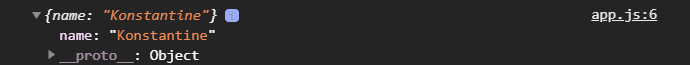

И как мы видим в консоли есть объект с полем name. Далее проверяю равныли объекты **newObj** и **obj1**.

```js
let obj1 = {
  name: "Konstantine",
};

let newObj = Object.assign({}, obj1);
console.log(newObj === obj1);
```
В консоли выводится **false**.  Т.е. исменение **newObj** не приводит к изменению **obj1**.

Так же в **Object.assign** мы можем копировать несколько объектов. Предположим что у меня есть еще один объект. Это объект я могу так же передать следующим аргументом.

```js
let obj1 = {
  name: "Konstantine",
};

let obj2 = {
  age: 20,
};

let newObj = Object.assign({}, obj1, obj2);
console.log(newObj);
```

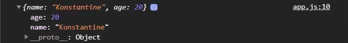

В newObj попадут все свойства обоих объектов. Он фактически их объедедяет и передает в **target**.

Теперь разберем следующее. Если в **target** я передам не новый объект, а подставлю **obj1**.

```js
let obj1 = {
  name: "Konstantine",
};

let obj2 = {
  age: 20,
};

let newObj = Object.assign(obj1, obj2);
console.log(newObj);
```
У нас в консоли выводится все тоже самое, но есть небольшое отличие что так как **target** служил **obj1**. Вновь проверим на эквивалентность объектов 

```js
let obj1 = {
  name: "Konstantine",
};

let obj2 = {
  age: 20,
};

let newObj = Object.assign(obj1, obj2);
console.log(newObj === obj1);
```
То в консоли выведеться **true** потому что **obj1** служил как целевым объектом, т.е. он был взят как целевой объект и в него были скопированы новый свойства из **obj2**. Теперь получается что **newObj** опять ссылается на **obj1**.

```js
let obj1 = {
  name: "Konstantine",
};

let obj2 = {
  age: 20,
};

let newObj = Object.assign(obj1, obj2);
console.log(newObj);
console.log(obj1);
```
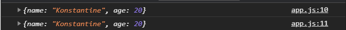

Он так же получил свойство **age** хотя изначально этого небыло. За этим нужно следить. 

При этом еще не маловажная штука **Object.assign** это то что он может совместить общие свойства и добавить новые свойства.
Предположим что у нас в **obj2** есть так же name


```js
let obj1 = {
  name: "Konstantine",
};

let obj2 = {
  name: "Ivan",
  age: 20,
};

let newObj = Object.assign(obj1, obj2);
console.log(newObj);
console.log(obj1);
```


Если в **obj1** есть какие-то свойства которые есть и в **obj2**, то они будут перезаписаны в **obj1** и плюс добавятся новые свойства.

Если в **target** передать пустой объект.

```js
let obj1 = {
  name: "Konstantine",
};

let obj2 = {
  name: "Ivan",
  age: 20,
};

let newObj = Object.assign({}, obj1, obj2);
console.log(newObj);
console.log(obj1);
```


Теперь у **newObj** есть  **name: "Ivan", age: 20**. Опять же **obj2** перезаписал **obj1**.

Положение важно. Если я **obj1**, **obj2** поменяю местами.

```js
let obj1 = {
  name: "Konstantine",
};

let obj2 = {
  name: "Ivan",
  age: 20,
};

let newObj = Object.assign({}, obj2, obj1);
console.log(newObj);
console.log(obj1);
```


Это самый простой способ который помогает нам совместить какие-то настройки. **Object.assign** делает поверхностное копирование. 

Переопределяю объект и прописываю в **obj1** новое поле в которое помещаю еще один объект в котороый входит поле навыков. После чего копирую **obj1**

```js
let obj1 = {
  name: "Konstantine",
  info: {
    skills: ["html", "css"],
  },
};

let obj2 = {
  name: "Ivan",
  age: 20,
};

let newObj = Object.assign({}, obj2, obj1);
newObj = Object.assign({}, obj1);
console.log(obj1);
```
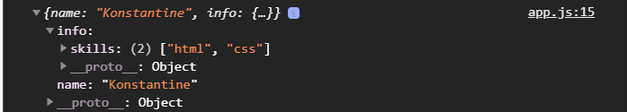

Далее провожу следующее сравнение **console.log(newObj.info === obj1.info);**

```js
let obj1 = {
  name: "Konstantine",
  info: {
    skills: ["html", "css"],
  },
};

let obj2 = {
  name: "Ivan",
  age: 20,
};

let newObj = Object.assign({}, obj2, obj1);
newObj = Object.assign({}, obj1);
console.log(newObj.info === obj1.info);
```
Мы получаем **true**. Потому что не делается глубокое копирование т.е. если есть вложенные объекты, они копируются по ссылке. Теперь эти два объекта одинаковы. Если мы произведем изменения в **newObj.info**, то соответственно произойдет изменение и в **obj1.info.**

<br>
<br>
<br>
<br>

Есть несколько способов что бы сделать глубокое копирование. Самый простой способ это при помощи **JSON**, специальных методов **JSON.stringify()** и **JSON.parse()**. 

Помимо этого для не глубокого копирования есть возможность сделать это при помощи деструктуризации. С этим мы познакомимся когда будем проходить деструктурирующее присваивание и т.д.

Делаем при помощи **JSON**.

**JSON** - это специальный объект содержащий методы для работы с специальным типом **JSON**. Обычно такой тип мы получаем от сервера когда он передает специальную **JSON** строку в которую можно загнать любые сложные типы объекты или массивы.

При помощи **JSON.stringify()** мы выполняем конвертацию объекта или массива в **JSON** формат. И если мы хотим расспарсить т.е. вернуть обратно, то мы используем **JSON.parse**.

Смотрим как это выглядит в консоли.

```js
let obj1 = {
  name: "Konstantine",
  info: {
    skills: ["html", "css"],
  },
};

let obj2 = {
  name: "Ivan",
  age: 20,
};

let newObj = Object.assign({}, obj2, obj1);
newObj = Object.assign({}, obj1);
console.log(JSON.stringify(obj1));
```


т.е. это уже не объект, это специальная строка. В основном в таком формате данные могут быть отправлены на сервер и соответственно я могу это распарсить при помощи метода **parse**. 

Таким образом для того что бы сделать глубокое копирование  я могу сделать следующую штуку. Мне фактически нужно сделать два действия. Первое действие, мне нужно превратить в **JSON** мой объект который я хочу скопировать т.е. я сначало делаю 

```js
let objJson = JSON.stringify(obj1);
```
я создаю переменную которй присваиваю результат перевода объекта в **JSON** формат. После чего я могу переопределить **newObj** и присвоить ей результат парсинга объекта **obj1** т.е. развернуть объект.

```js
let obj1 = {
  name: "Konstantine",
  info: {
    skills: ["html", "css"],
  },
};

let obj2 = {
  name: "Ivan",
  age: 20,
};

let newObj = Object.assign({}, obj2, obj1);
newObj = Object.assign({}, obj1);
let objJson = JSON.stringify(obj1);
newObj = JSON.parse(objJson);
console.log(newObj)

```
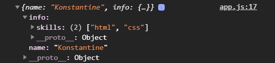

Если я попробую сравнить 

```js
let obj1 = {
  name: "Konstantine",
  info: {
    skills: ["html", "css"],
  },
};

let obj2 = {
  name: "Ivan",
  age: 20,
};

let newObj = Object.assign({}, obj2, obj1);
newObj = Object.assign({}, obj1);
let objJson = JSON.stringify(obj1);
newObj = JSON.parse(objJson);
console.log(newObj.info === obj1.info);
```
В консоли выводится false. Это самый простой способ сделать глубокое копирование.

 Это можно сократить. Тем самым отпадает нужда создавать дополнительную переменную.

```js
let obj1 = {
  name: "Konstantine",
  info: {
    skills: ["html", "css"],
  },
};

let obj2 = {
  name: "Ivan",
  age: 20,
};

let newObj = Object.assign({}, obj2, obj1);
newObj = Object.assign({}, obj1);

newObj = JSON.parse(JSON.stringify(obj1));
console.log(newObj.info === obj1.info);
```
Таким образом он фактически сначало выполнит **JSON.stringify(obj1)** превратит объект в **JSON** и потом сразу же его распарсит и мы получим новый скопированный объект.

<br>
<br>
<br>
<br>

Теперь еще несколько методов которые очень важны для работы с объектами.

Первый метод это **Object.keys()**. Он нам возвращает ключи ввиде массива. Он принимает объект который я хочу получить.

```js
let obj1 = {
  name: "Konstantine",
  info: {
    skills: ["html", "css"],
  },
};

let obj2 = {
  name: "Ivan",
  age: 20,
};

let newObj = Object.assign({}, obj2, obj1);
newObj = Object.assign({}, obj1);

newObj = JSON.parse(JSON.stringify(obj1));
// console.log(newObj.info === obj1.info);

let keys = Object.keys(obj2);
console.log(keys);
```
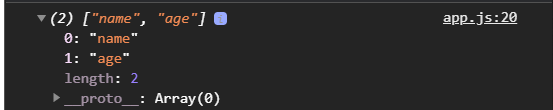

Теперь это массив и с ним довольно удобно будет работать. Если например нам нужно будет сделать с ключами, например их перебрать или получить доступ к значению каждого ключа в объекте не прибегая например к такому циклу как **for in**.

Вот здесь **let keys = Object.keys(obj2);** можно продолжать в цепочке вызывать методы массивов т.к. он вызывает массив.

Метод **Object.values()** он так же принимает объект

```js
let obj1 = {
  name: "Konstantine",
  info: {
    skills: ["html", "css"],
  },
};

let obj2 = {
  name: "Ivan",
  age: 20,
};

let newObj = Object.assign({}, obj2, obj1);
newObj = Object.assign({}, obj1);

newObj = JSON.parse(JSON.stringify(obj1));
// console.log(newObj.info === obj1.info);

let keys = Object.keys(obj2);
console.log(keys);
let values = Object.values(obj2);
console.log(values);
```

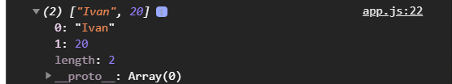

Как видите мы получаем значение каждого ключа.

Так же очень важный метод это метод **entries** о нем так же часто не помнят или не знают. Им очень удобно пользоваться, он возвращает массив массивов где каждым элементом является пара ключ и значение объекта.

```js
let obj1 = {
  name: "Konstantine",
  info: {
    skills: ["html", "css"],
  },
};

let obj2 = {
  name: "Ivan",
  age: 20,
};

let newObj = Object.assign({}, obj2, obj1);
newObj = Object.assign({}, obj1);

newObj = JSON.parse(JSON.stringify(obj1));
// console.log(newObj.info === obj1.info);

let keys = Object.keys(obj2);
console.log(keys);
let values = Object.values(obj2);
console.log(values);
let entries = Object.entries(obj2);
console.log(entries);
```

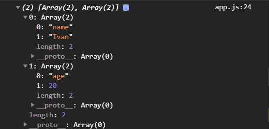

Как вы видите мы получили массив который состоит из массивов где каждый элемент является массивом и состоит из двух элементов это ключ и его значение.

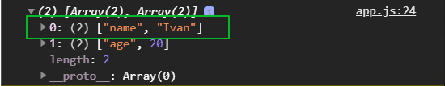

Мы потом посмотри как при помощи деструктуризации очень хорошо получать эти значения и в принципе выполнять какие-то операции, так же очень часто используется когда нам что-то нужно сделать с объектом или на основе его перебрать собрать какие-то новые формы и т.д.

И последний метод, не последний метод который есть у **Object**, мы еще познакомимся с некоторыми по типу **create()**, **freese** и т.д.

Очень не маловажный на данном этапе это **Object.fromEntries()** впринципе это аналог **entries**, но это в другую сторону т.е. он делает из массива ключей и значений делает объект. В его параметры пераметры передаю массив где у нас должен быть массив ключей и значений.

```js
let obj1 = {
  name: "Konstantine",
  info: {
    skills: ["html", "css"],
  },
};

let obj2 = {
  name: "Ivan",
  age: 20,
};

let newObj = Object.assign({}, obj2, obj1);
newObj = Object.assign({}, obj1);

newObj = JSON.parse(JSON.stringify(obj1));
// console.log(newObj.info === obj1.info);

let keys = Object.keys(obj2);
console.log(keys);
let values = Object.values(obj2);
console.log(values);
let entries = Object.entries(obj2);
console.log(entries);
let fromEntries = Object.fromEntries([["a", "value"]]);
console.log(fromEntries);
```
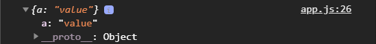

И я получаю теперь объект в котором у нас ключом является первый элемент вложенного массива, а значением второй элемент, т.е. я могу создать еще один массив внутри массива.

```js
let obj1 = {
  name: "Konstantine",
  info: {
    skills: ["html", "css"],
  },
};

let obj2 = {
  name: "Ivan",
  age: 20,
};

let newObj = Object.assign({}, obj2, obj1);
newObj = Object.assign({}, obj1);

newObj = JSON.parse(JSON.stringify(obj1));
// console.log(newObj.info === obj1.info);

let keys = Object.keys(obj2);
console.log(keys);
let values = Object.values(obj2);
console.log(values);
let entries = Object.entries(obj2);
console.log(entries);
let fromEntries = Object.fromEntries([
  ["a", "value"],
  ["b", "b_value"],
]);
console.log(fromEntries);
```
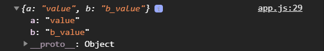

Мы получаем вот такой объект. Мы можем посмотреть на MDN что [Object.fromEntries](https://developer.mozilla.org/ru/docs/Web/JavaScript/Reference/Global_Objects/Object/fromEntries) работает с разными типами в том числе например c Map c которым мы познакомимся в будущем.

Мы рассмотрели довольно важные методы. Совет запимните и используйте их при возможности.

1. **Object.assign** - для копирования или совмещения, бывает такое что нужно совместить смержить так казать объект. 
   
2. **JSON.stringify()** и **JSON.parse()** для глубокого копирования.

3. **Object.keys()** для получения ключей объекта.

4. **Object.values()** для получения значений объекта.

5. **Object.entries()** который возвращает массив массивов где ключ и значение это элемент одной пары объекта.

6. **Object.fromEntries()** из массива с массивами вернет нам новый объект.
