# Деструктуризация

<br>
<br>

[https://docs.google.com/presentation/d/1VIpoedDIK_c-vcZilmIfhjgNIufHkTmIYiftx-IEY-4/edit?usp=sharing](https://docs.google.com/presentation/d/1VIpoedDIK_c-vcZilmIfhjgNIufHkTmIYiftx-IEY-4/edit?usp=sharing)

<br>

[https://medium.com/@stasonmars/%D0%B4%D0%B5%D1%81%D1%82%D1%80%D1%83%D0%BA%D1%82%D1%83%D1%80%D0%B8%D0%B7%D0%B0%D1%86%D0%B8%D1%8F-%D0%B2-es6-%D0%BF%D0%BE%D0%BB%D0%BD%D0%BE%D0%B5-%D1%80%D1%83%D0%BA%D0%BE%D0%B2%D0%BE%D0%B4%D1%81%D1%82%D0%B2%D0%BE-b865bb71f376](https://medium.com/@stasonmars/%D0%B4%D0%B5%D1%81%D1%82%D1%80%D1%83%D0%BA%D1%82%D1%83%D1%80%D0%B8%D0%B7%D0%B0%D1%86%D0%B8%D1%8F-%D0%B2-es6-%D0%BF%D0%BE%D0%BB%D0%BD%D0%BE%D0%B5-%D1%80%D1%83%D0%BA%D0%BE%D0%B2%D0%BE%D0%B4%D1%81%D1%82%D0%B2%D0%BE-b865bb71f376)

<br>
<br>
<br>

Это нововведение нужно для того чтобы упростить сложные структуры и иметь возможность разбить их на более простые. Кто работал с **JS** ранее мог встречатся с такой конструкцией.

```js
const user = {
  firstName: "Konstantine",
  lastName: "Atroshchenko",
};
```
Бывают такие ситуации что мы хотим взять **firstName** и **lastName** из объекта для того что бы их вывести или куда-то передать. Для этого я создаю переменную.

```js
const user = {
  firstName: "Konstantine",
  lastName: "Atroshchenko",
};

const firstName = user.firstName;
const lastName = user.lastName;

console.log(firstName);
```
В консоль выведется **konstantine**.

Но у нас очень маленький объект, всего с двумя свойствами и мы уже делаем вот такие структуры из переменных. В этом легко запутаться особенно когда есть вложенные объекты. 

И здесь нам на помощь приходит деструктуризация.

Здесь все очень просто. Мы пишем **const** или **let** в зависимости от ситуации. Ставим фигурные скобки. Деструктурировать мы можем объекты, массивы, входные параметры в функции если это объекты или массивы. Соответственно для того что бы выполнить деструктуризацию я пишу **const** открываю фигурные скобки и указываю те свойства которые мы хотим вытянуть из объекта это **firstName** и **lastName**, только они должны называться так же как они называются в объекте. После закрытия фигурных скобок присваиваю **user**.

```js
const user = {
  firstName: "Konstantine",
  lastName: "Atroshchenko",
};

// const firstName = user.firstName;
// const lastName = user.lastName;

const { firstName, lastName } = user;

console.log(firstName);
```

В консоли выводится **Konstantine**. Таким методом я вытянул отдельные свойства их объекта **user**. И мы их теперь можем использовать.

```js
const user = {
  firstName: "Konstantine",
  lastName: "Atroshchenko",
};

// const firstName = user.firstName;
// const lastName = user.lastName;

const { firstName, lastName } = user;

console.log(firstName, lastName);
```


Это существенно может упростить наш код и дать ему больше читабельности.

Но конечно же это не все. Начнем с **default** значений. Например у нас может быть такое что в объекте нет какого-то свойства, оно то есть, то нет. Например свойсто age его здесь нет. И я задаю ему **default** значение.

```js
const user = {
  firstName: "Konstantine",
  lastName: "Atroshchenko",
};

// const firstName = user.firstName;
// const lastName = user.lastName;

const { firstName, lastName, age = 30 } = user;

console.log(age);
```
В консоли получаю 30.

Если этот age будет в объекте.

```js
const user = {
  firstName: "Konstantine",
  lastName: "Atroshchenko",
  age: 25,
};

// const firstName = user.firstName;
// const lastName = user.lastName;

const { firstName, lastName, age = 30 } = user;

console.log(age);
```


То присвоится то значение которое записано в объекте.


Так же при деструктуризации мы можем использовать другие имена для наших свойств. Например нас не устраивает **firstName** **lastName** и мы хотим например вмество **firstName** хотим **name** получить. Для этого я ставлю двоеточие и пишу как я хочу использовать эту переменную.

```js
const user = {
  firstName: "Konstantine",
  lastName: "Atroshchenko",
  age: 25,
};

// const firstName = user.firstName;
// const lastName = user.lastName;

const { firstName: name, lastName, age = 30 } = user;

console.log(name);
```


Если я попробую обратиться к **firstName**, то он уже не доступен.

В случае с **default** значением это так же возможно.

```js
const user = {
  firstName: "Konstantine",
  lastName: "Atroshchenko",
  age: 25,
};

// const firstName = user.firstName;
// const lastName = user.lastName;

const { firstName: name, lastName, age: years = 30 } = user;

console.log(years);
```


<br>
<br>
<br>

Теперь как работать с вложенными объектами.

```js
const user = {
  firstName: "Konstantine",
  lastName: "Atroshchenko",
  age: 25,
  info: {
    work: "myWork",
    skills: ["html", "css"],
  },
};

// const firstName = user.firstName;
// const lastName = user.lastName;

const { firstName: name, lastName, age: years = 30 } = user;

console.log(years);
```

И теперь как получить этот вложенный объект? Пишу **const** открываю фигурные скобки, в них пишу название вложенного объекта, после чего с помощью присваивания указываю родительский объект из которого я вытаскиваю данный объект.

```js
const user = {
  firstName: "Konstantine",
  lastName: "Atroshchenko",
  age: 25,
  info: {
    work: "myWork",
    skills: ["html", "css"],
  },
};

// const firstName = user.firstName;
// const lastName = user.lastName;

// const { firstName: name, lastName, age: years = 30 } = user;

const { info } = user;

console.log(info);
```
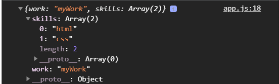

Для того что бы его деструктурировать после **info** ставлю двоеточие, открываю фигурные скобки и указываю те свойства которые я хочу вытянуть.

```js
const user = {
  firstName: "Konstantine",
  lastName: "Atroshchenko",
  age: 25,
  info: {
    work: "myWork",
    skills: ["html", "css"],
  },
};

// const firstName = user.firstName;
// const lastName = user.lastName;

// const { firstName: name, lastName, age: years = 30 } = user;

const {
  info: { work },
} = user;

console.log(work);

```


Я так же могу задавать какие-то **default** значения

```js
const user = {
  firstName: "Konstantine",
  lastName: "Atroshchenko",
  age: 25,
  info: {
    work: "myWork",
    skills: ["html", "css"],
  },
};

// const firstName = user.firstName;
// const lastName = user.lastName;

// const { firstName: name, lastName, age: years = 30 } = user;

const {
  info: {
    work: default_work = "default_work",
    skills: default_skills = "default_skills",
  },
} = user;

console.log(default_work, default_skills);
```

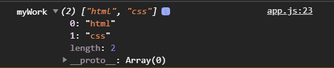

<br>
<br>
<br>
<br>

Посмотрим на деструктуризацию массивов.

```js
const colors = ["white", "black", "red"];
```
И мы можем вытянуть отдельные элементы из массива. При этом в отличие от объектов мы можем сразу указывать любые произвольные имена которые мы хотим. Единственное здесь правило что мы должны указывать их по порядку.

создаю **const** так же как в объектах я ставил фигурные скобки здесь я ставлю квадратные скобки. И далее указываю имена переменных под которыми мы хотим вытянуть соответствующий элемент массива, например **white**, при этом я могу написать вот так **w**, **b**, **red** назову полностью, ставлю равно и указываю из какого массива я это достаю.

```js
const colors = ["white", "black", "red"];
const [w, b, red] = colors;
console.log(w, b, red);
```


И вот я вытаскиваю каждый элемент массива. Все довольно просто. 

Я могу задавать какие-то **default** значения и если элементов нет, то при вытаскивании элементов из массива я могу спокойно указать переменную и задать ей значение, тем самым указав значение по умолчанию.

```js
const colors = ["white", "black", "red"];
const [w, b, red, green = 'green'] = colors;
console.log(w, b, red, green);
```


Но если он будет

```js
const colors = ["white", "black", "red", "#89432d"];
const [w, b, red, green = "green"] = colors;
console.log(w, b, red, green);
```


Мы можем пропускать какие-то значения т.е. я могу деструктурировать не все по порядку значения а какие-то из них пропустить. При вытаскивании свойст просто указываю запятую и далее вытаскиваю оставшиеся свойства.

```js
const name = ["Konstantine", "Ivan", "Maksim"];
const [, name2, name3] = name;
console.log(name2, name3);
```


либо 

```js
const name = ["Konstantine", "Ivan", "Maksim"];
const [, , name3] = name;
console.log(name3);
```
За счет количиста запятых мы пропускаем нужное количество элементов.

Мы можем так же деструктурировать вложенные массивы.

После написания **const** ставлю квадратные скобки, через запятую указываю что пропускаю первый элемент. Дальше я также ставлю квадратные скобки тем самым указываю что деструктурирую вложенный массив и указываю под какими переменными я хочу вытянуть переменные в том же поряжке в котором они идут.

```js
const nestedArr = ["hello world", ["key", "value"]];
const [, [key, value]] = nestedArr;
console.log(key, value);
```


Таким образом мы можем вытянуть что-то из вложенных массивов.


<br>
<br>
<br>
<br>

Так же у нас есть операторы **Rest** и **Spreed**

Оператор **Rest** дает возможность получить какой-то остаток от массива, или там используется при копировании массивов

```js
const name = ["Konstantine", "Ivan", "Maksim"];
const [name1, ...otherNames] = name;
console.log(name1, otherNames);
```
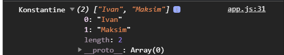

Таким образом в **name1** у меня попадает **Konstantine**, а все остальные имена в массиве попадают в **otherNames**. Таким образом я могу получить остаток. Но он,** ...otherNames**, должен идти всегда в конце т.е. что бы забрать остаток.

При помощи **Rest** мы можем так же скопировать объект. Например у нас есть массив имен и мы хотим его скопировать. Здесь у нас есть два варианта как его скопировать.

Первый вариант это написать const [...newNames] = names;

```js
const names = ["Konstantine", "Ivan", "Maksim"];
const [name1, ...otherNames] = names;
const [...newNames] = names;
console.log(newNames);
```
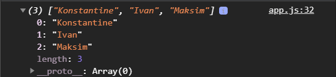

И смогу получить их в отдельной переменной что бы они небыли связаны. Либо я могу это же сделать, но вот в таком формате

```js
const names = ["Konstantine", "Ivan", "Maksim"];
const [name1, ...otherNames] = names;
// const [...newNames] = names;
const newNames = [...names];
console.log(newNames);
```

Здесь я использую оператор Rest как **Spreed** т.е. **const newNames = [...names];**


Но в отличие от предыдущего мы здесь использовали три точки перед массиво names. Он получается расскладывает каждый элемент в новый массив.

Как мы знаем **console.log()** принимает элементы через запятую. И здесь я хотел бы вывести каждое имя через запятую а не через массив. При выводе в консоль тоже могу поставить три точки и указать имя переменной.

```js
const names = ["Konstantine", "Ivan", "Maksim"];
const [name1, ...otherNames] = names;
// const [...newNames] = names;
const newNames = [...names];
console.log(...newNames);
```


И он передаст их как отдельные элементы в консоль не как массив.

Напоминаю это не глубокое копирование т.е. в данном случае у нас примитивные данные, поэтому проблем нет, но если есть вложенные объекты то соответственно будут некоторые сложности.

Тоже самое мы можем делать с объектами т.е. мыможем их копировать но перед этим посмотрим еще кое-что с массивами. Мы можем склеивать массивы при помощи оператора spreed. Склеим массив имен и массив цветов.

```js
const colors = ["white", "black", "red", "#89432d"];
const [w, b, red, green = "green"] = colors;
// console.log(w, b, red, green);

const names = ["Konstantine", "Ivan", "Maksim"];
const [name1, ...otherNames] = names;
// const [...newNames] = names;
const newNames = [...names];
console.log(...newNames);

// const nestedArr = ["hello world", ["key", "value"]];
// const [, [key, value]] = nestedArr;
// console.log(key, value);

const colorNames = [...colors, ...names];
console.log(colorNames);
```

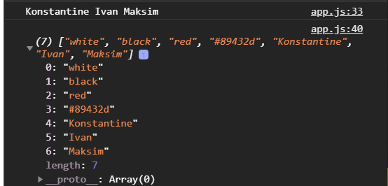

И мы получаем один общий массив. т.е. мы сделали конкотенацию.

Мы можем встраивать это не только в таком виде. Здесь могут быть еще значения.

```js
const colors = ["white", "black", "red", "#89432d"];
const [w, b, red, green = "green"] = colors;
// console.log(w, b, red, green);

const names = ["Konstantine", "Ivan", "Maksim"];
const [name1, ...otherNames] = names;
// const [...newNames] = names;
const newNames = [...names];
console.log(...newNames);

// const nestedArr = ["hello world", ["key", "value"]];
// const [, [key, value]] = nestedArr;
// console.log(key, value);

const colorNames = ['some value', ...colors, ...names];
console.log(colorNames);
```

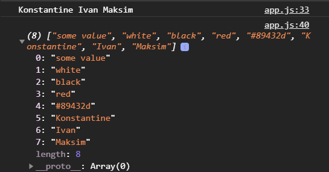

<br>
<br>
<br>
<br>

Теперь что касается копирования объектов.

```js
const user = {
  firstName: "Konstantine",
  lastName: "Atroshchenko",
  age: 25,
  info: {
    work: "myWork",
    skills: ["html", "css"],
  },
};

const newUser = { ...user };
console.log(newUser);
```
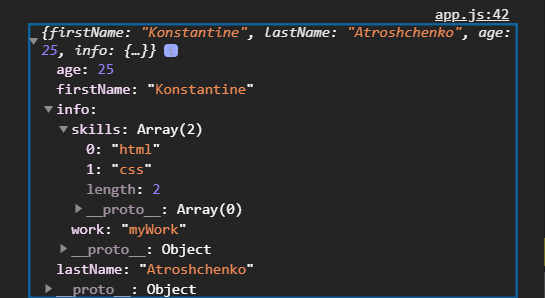

И я получаю копию объекта. Но опять же помним это поверхностное копирование и вложенные объекты не копируются, а передаются по ссылке.

Мы можем здесь сделать на подобие **Object.assign()**. Вторым аргументом в **newUser** я мгу добавить **age: 30** тем самым произойдет склейка т.е. это свойство заменит то свойство которе было в **user**. Главное опять же порядок, сначало идет объект который мы копируем и лишь после этого идет свойство которое мы хотим изменить.

```js
const user = {
  firstName: "Konstantine",
  lastName: "Atroshchenko",
  age: 25,
  info: {
    work: "myWork",
    skills: ["html", "css"],
  },
};

const newUser = { ...user, age: 30 };
console.log(newUser);
```
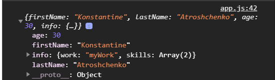

<br>
<br>
<br>
<br>

Смешанная диструктуризация. У нас в объекте **user** ну или в данном случае **newUser** есть **info** в котором у нас есть есть **skills** в котором есть **html** и **css**. И мы хотим получить эти значения. И сделаю тоже самое.

```js
const user = {
  firstName: "Konstantine",
  lastName: "Atroshchenko",
  age: 25,
  info: {
    work: "myWork",
    skills: ["html", "css"],
  },
};

const newUser = { ...user, age: 30 };

const {
  info: {
    skills: [html, css],
  },
} = newUser;
console.log(html, css);
```


прписываю **const** и фигурные скобки в которых указываю что я хочу, **info:** дальше я его деструктурирую **{}** получаю свойство **skills:** дальше также деструктурирую на массив и получаю первый элемент массива **html** и второй **css**. И указываю с какого объекта это все я забираю **= newUser**.

<br>
<br>
<br>
<br>

Теперь посмотрим на деструктуризацию и операторы **Rest** **Spreed** в рамках функций когда мы передаем что - то в параметры.

Функция **myPerson** будет принимать объект. И в данную функцию я буду передавать объект **newUser**

```js
function myPerson(obj) {}
myPerson(newUser);
```

Во-первых мы можем передавать копируя этот объект если мы не хотим его как - то поломать.
Во-вторых мы можем  в **myPerson(obj)** в параметрах, для того что бы потом не обращаться вот так вот 

```js
function myPerson(obj) {
  console.log(obj.lastName)
}
myPerson(newUser);
```
и т.д. Что бы не получать вот так по отдельности элементы мы можем их так же деструктурировать. Т.е. в параметрах **myPerson** поставить фигурные скобки и написать что я хочу вытащить. И тогда я буду иметь возможность получить их по этим переменным.

```js
const user = {
  firstName: "Konstantine",
  lastName: "Atroshchenko",
  age: 25,
  info: {
    work: "myWork",
    skills: ["html", "css"],
  },
};

const newUser = { ...user, age: 30 };

const {
  info: {
    skills: [html, css],
  },
} = newUser;
// console.log(html, css);

function myPerson({ lastName, firstName }) {
  console.log(lastName, firstName);
}
myPerson(newUser);
```


Но может быть проблема заключающаяся в том что если я не передам объект по каким-то причинам, то я получу ошибку что я не могу деструктурировать у **undefined** т.к. небыло передано значение при вызове функции.

```js
const user = {
  firstName: "Konstantine",
  lastName: "Atroshchenko",
  age: 25,
  info: {
    work: "myWork",
    skills: ["html", "css"],
  },
};

const newUser = { ...user, age: 30 };

const {
  info: {
    skills: [html, css],
  },
} = newUser;
// console.log(html, css);

function myPerson({ lastName, firstName }) {
  console.log(lastName, firstName);
}
myPerson();
```

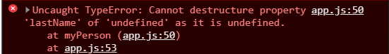

По этому, что бы таких случаев не возникало, лучше передать значение по умолчанию для всего деструктурируемого объекта **function myPerson({ lastName, firstName } = {})** и мы говорим что это будет пустой объект. Ошибка у нас исчезнет, но появится undefined т.е. **lastName**, **firstName** нет в пустом объекте.

```js
const user = {
  firstName: "Konstantine",
  lastName: "Atroshchenko",
  age: 25,
  info: {
    work: "myWork",
    skills: ["html", "css"],
  },
};

const newUser = { ...user, age: 30 };

const {
  info: {
    skills: [html, css],
  },
} = newUser;
// console.log(html, css);

function myPerson({ lastName, firstName } = {}) {
  console.log(lastName, firstName);
}
myPerson();
```


**lastName**, **firstName** мы можем задать значение по умолчанию.

```js
const user = {
  firstName: "Konstantine",
  lastName: "Atroshchenko",
  age: 25,
  info: {
    work: "myWork",
    skills: ["html", "css"],
  },
};

const newUser = { ...user, age: 30 };

const {
  info: {
    skills: [html, css],
  },
} = newUser;
// console.log(html, css);

function myPerson({ lastName = '&', firstName = '&' } = {}) {
  console.log(lastName, firstName);
}
myPerson();
```


 Так же мы можем деструктурировать вложенные объект который у нас есть **info. info: { skills } = {}** ему так же прописывам пустой объект что бы все хорошо работало. И все таки я передам при вызове функции объект **newUser**.

 ```js
 const user = {
  firstName: "Konstantine",
  lastName: "Atroshchenko",
  age: 25,
  info: {
    work: "myWork",
    skills: ["html", "css"],
  },
};

const newUser = { ...user, age: 30 };

const {
  info: {
    skills: [html, css],
  },
} = newUser;
// console.log(html, css);

function myPerson({
  lastName = "&",
  firstName = "&",
  info: { skills } = {},
} = {}) {
  console.log(skills);
}
myPerson(newUser);
```

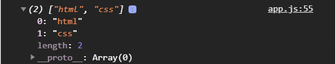

<br>
<br>
<br>
<br>

Так же давайте посмотрим еще на один пример. Это когда мы можем получить все аргументы внутри функции. 

Как вы помните у функции есть специфльное ключевое слово arguments в котором содержатся все аргументы переданные в нашу функцию. вызываю функцию и передаю параметры.

```js
function foo(x, y) {
  console.log(arguments);
}
foo(1, 2);
```

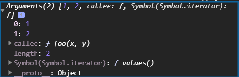

В этой коллекции содержаться эти два значения которые переданы.

Во-первых операторы **Rest** **Spreed** позволяют превратить любую итерируему коллекцию в обычный массив.

Раньше это делалось вот так **console.log([].slice.call(arguments));**

```js
const user = {
  firstName: "Konstantine",
  lastName: "Atroshchenko",
  age: 25,
  info: {
    work: "myWork",
    skills: ["html", "css"],
  },
};

const newUser = { ...user, age: 30 };

const {
  info: {
    skills: [html, css],
  },
} = newUser;
// console.log(html, css);

function myPerson({
  lastName = "&",
  firstName = "&",
  info: { skills } = {},
} = {}) {
  console.log(skills);
}
// myPerson(newUser);

function foo(x, y) {
  console.log(arguments);
  console.log([].slice.call(arguments));
}
foo(1, 2);
```
и мы получили бы наши аргумены ввиде массива.

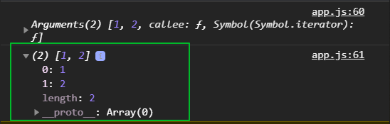

Т.е. это был такой хук что бы скопировать любую итерируемую коллекцию. В **slice** если в него не передано аргументов, то он возвращает копию массива. **call** указывает в каком контексте мы хотим вызвать вот этот метод **[].slice.** 
Либо можно было встретить такую запись **console.log(Array.prototype.slice.call(arguments));**

```js
const user = {
  firstName: "Konstantine",
  lastName: "Atroshchenko",
  age: 25,
  info: {
    work: "myWork",
    skills: ["html", "css"],
  },
};

const newUser = { ...user, age: 30 };

const {
  info: {
    skills: [html, css],
  },
} = newUser;
// console.log(html, css);

function myPerson({
  lastName = "&",
  firstName = "&",
  info: { skills } = {},
} = {}) {
  console.log(skills);
}
// myPerson(newUser);

function foo(x, y) {
  console.log(arguments);
  console.log(Array.prototype.slice.call(arguments));
}
foo(1, 2);
```
Теперь есть оператор Rest и Spred, и нам такие записи больше не нужны.

```js
const user = {
  firstName: "Konstantine",
  lastName: "Atroshchenko",
  age: 25,
  info: {
    work: "myWork",
    skills: ["html", "css"],
  },
};

const newUser = { ...user, age: 30 };

const {
  info: {
    skills: [html, css],
  },
} = newUser;
// console.log(html, css);

function myPerson({
  lastName = "&",
  firstName = "&",
  info: { skills } = {},
} = {}) {
  console.log(skills);
}
// myPerson(newUser);

function foo(x, y) {
  console.log(arguments);
  // console.log(Array.prototype.slice.call(arguments));
  const [...args] = arguments;
  console.log(args);
}
foo(1, 2);
```

и мы получаем нашу args копию наших аргументов в виде массива.

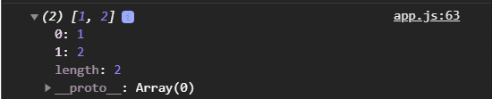

Если при вызове функции я передал больше аргументов. В нашем случае **1**, **2** попадают в **x** и **y**, а остальные попадают например в **others**.

```js
const user = {
  firstName: "Konstantine",
  lastName: "Atroshchenko",
  age: 25,
  info: {
    work: "myWork",
    skills: ["html", "css"],
  },
};

const newUser = { ...user, age: 30 };

const {
  info: {
    skills: [html, css],
  },
} = newUser;
// console.log(html, css);

function myPerson({
  lastName = "&",
  firstName = "&",
  info: { skills } = {},
} = {}) {
  console.log(skills);
}
// myPerson(newUser);

function foo(x, y, ...others) {
  console.log(arguments);
  // console.log(Array.prototype.slice.call(arguments));
  const [...args] = arguments;
  console.log(others);
}
foo(1, 2, 5, 6);
```
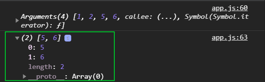

бывают такие ситуации когда мы получаем данные ввиде массива и нам нужно с этими данными что-то сделать. И я например хочу передать их не ввиде массива, а ввиде аргументов.

```js
const numbers = [2, 3];
function foo2(x, y) {
  console.log(x, y);
}
foo(...numbers);
```
Он разложит элементы массива и каждый элемент попадет туде куда нужно. Т.е. при вызове функции не надо перечислять индексы с которыми мы хотим работать.
