# Object description

<br>
<br>
<br>

[https://learn.javascript.ru/descriptors-getters-setters](https://learn.javascript.ru/descriptors-getters-setters),

<br>

[https://developer.mozilla.org/uk/docs/Web/JavaScript/Reference/Global_Objects/Object/defineProperty](https://developer.mozilla.org/uk/docs/Web/JavaScript/Reference/Global_Objects/Object/defineProperty)

<br>
<br>
<br>

Этот урок дает понять некоторые тонкости в JS и в объектах. Это дескрипторы для объектов.

```js
const car = {
  brand: "Audi",
  year: 2020,
};
```

У нас есть возможность контролировать свойства и давать им некоторые настройки. Для этого есть специальный метод **Object.defineProperty()**. Этот метод позволяет определить некие настройки для нашего объекта и для конкретного свойства в нем.

Например мы ходим определить настройки для свойства **year**. Т.е. первым параметром **Object.defineProperty()** я указываю какой объект я хочу конфигурировать, вторым параметром я определяю либо новое свойство либо текущее свойство которое мы хотим конфигурировать. Я хочу конфигурировать **year**. И третьим параметром мы передаем объект называемый дескриптор, который имеет некоторые настройки. Эти настройки конкретно.

1. **configurable** - Равен true только в том случае, если тип этого дескриптора свойства может быть изменён и если свойство может быть удалено из содержащего его объекта. **Значение по умолчанию установлено в false**.
2. **enumerable** - Равен true только в том случае, если это свойство можно увидеть через перечисление свойств содержащего его объекта.**Значение по умолчанию установлено в false**.
3. **writable** - Равен true только в том случае, если значение, ассоциированное со свойством, может быть изменено с помощью оператора присваивания.**Значение по умолчанию установлено в false**.
4. **get** - Функция, используемая как геттер свойства, либо undefined, если свойство не имеет геттера. Возвращаемое значение функции будет использоваться как значение свойства.**Значение по умолчанию установлено в undefined**.
5. **set** - Функция, используемая как сеттер свойства, либо undefined, если свойство не имеет сеттера. Функция принимает единственным аргументом новое значение, присваиваемое свойству.
**Значение по умолчанию установлено в undefined**.

Начнем с проятых свойств **configurable**, **enumerable**, **writable**. Что они дают? По умолчанию они все **true**.

Начнем с **configurable**.

```js
const car = {
  brand: "Audi",
  year: 2020,
};

Object.defineProperty(car, "year", {
  configurable: false,
});
```

Что это нам дает. Во-первых заглянем в сам объект **car** в консоли, т.е. вбиваю в консоль браузера.

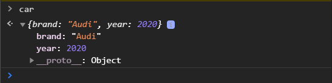

У нас ничего не поменялось. Как есть так и остается. Но что меняется? Во-первых мы теперь не можем удалить данное свойство. Если я в консоли браузера вобъю **delete car.year**. Объект **delete** дает возможность удалить какое-то свойство их объекта. Возвращается **false** и если проверить объект, то ничего удалено небыло.

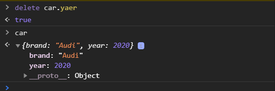

При этом мы теперь не можем конфигурировать это свойство. Т.е. если я еще раз попробую определить

```js
const car = {
  brand: "Audi",
  year: 2020,
};

Object.defineProperty(car, "year", {
  configurable: false,
});

Object.defineProperty(car, "year", {
  enumerable: false,
});
```

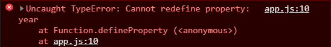

Я получаю ошибку о том что я не могу ни как изменять свойство year. Потому что была запрещена его конфигурация **configurable: false**. 

Но мы можем его перезаписывать. В консоли.

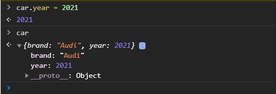

<br>
<br>
<br>

Теперь разберем свойство **enumerable**.

```js
const car = {
  brand: "Audi",
  year: 2020,
};

Object.defineProperty(car, "year", {
  // configurable: false,
  enumerable: false,
});
```
Эта настройка делает свойство, year в данном лучае, не итерируемым. Если мы в консоли браузера посмотрим на это свойство то увидим что оно подсвечивается серым цветом. Его точно так же можно поменять.

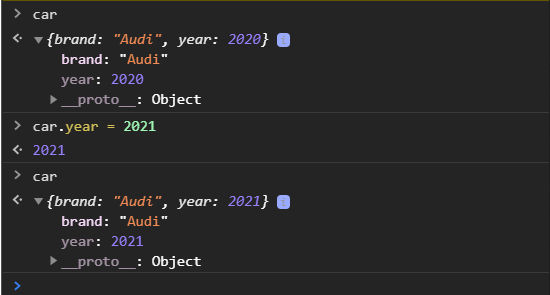

Но у объектов есть метод **keys** или **value**. Попробую вызвать массив ключей объекта.

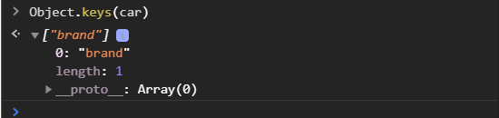

Тоже самое будет для **values**.

Также у объекта есть метод  **car.propertyIsEnumerable**

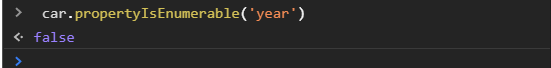

и он нам говорит **false**, оно не перебираемое. Тоже самое этого свойства на будет видимо в цикле.

Так же **car.hasOwnProperty('year')**

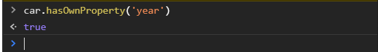

Он отведит что да это его свойство. Однако мы его не можем перебирать.

<br>
<br>
<br>

Свойство writable.

```js
const car = {
  brand: "Audi",
  year: 2020,
};

Object.defineProperty(car, "year", {
  // configurable: false,
  // enumerable: false,
  writable: false,
});
```
Оно запрещает запись данного свойства.

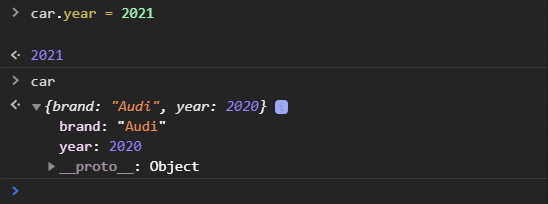

Как видим ничего не поменялось. Но при этом я могу удалить данное свойство.

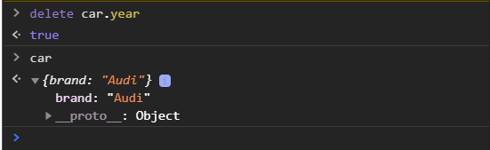

Это были базовые настройки свойств объекта.

<br>
<br>
<br>

Теперь поговрим про **getter**(получатель) и **setter**(связующий или установка).Их можно задавать как через **Object.defineProperty**.

```js
const car = {
  brand: "Audi",
  year: 2020,
};

Object.defineProperty(car, "year", {
  // configurable: false,
  // enumerable: false,
  // writable: false,
  get: function () {
    return `Машина выпущена в ${this.year}`;
  },
});

```
Мы в функции можем возвращать модефицированный объект или в более формате для пользователя. Если я сейчас обращусь к свойству **car.year**, то я получу ошибку.

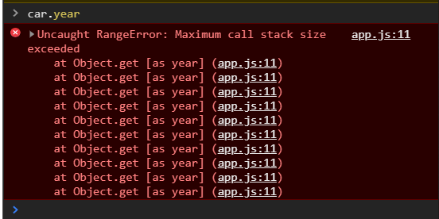

Мы не можем использовать тоже свойство что есть в объекте для getter которое я указываю во втором параметре **Object.defineProperty**. Вместо этого свойства я должен объявить новое.

```js
const car = {
  brand: "Audi",
  year: 2020,
};

Object.defineProperty(car, "age", {
  // configurable: false,
  // enumerable: false,
  // writable: false,
  get: function () {
    return `Машина выпущена в ${this.year}`;
  },
});
```

Если я теперь обращусь к свойстве **age**, то получу

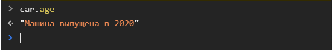

т.е. **getter** помогает во-первых скрыть какую-то логику. Это отчасти один из принципов ООП к которому мы вернемся это инкапсуляция, сокрытие какой-то логики и при этом **getter** у нас является функцией, но использовать мы будем его как свойство т.е. без вызова напрямую метода как это обычно происходит когда мы объявляем функцию в рамках объекта. И он нам позволяет нам внутри сделать какие-то манипуляции или использовать несколько свойств. Или делать какие-то проверки и возвращать какое-то более читебельное значение для пользователя.

**Getter** при этом может быть объявлен не только через **Object.defineProperty**. Его можно объявить через сам объект.

```js
const car = {
  brand: "Audi",
  year: 2020,
  get age(){
    return `Машина выпущена в ${this.year}`;
  },
};

Object.defineProperty(car, "age", {
  // configurable: false,
  // enumerable: false,
  // writable: false,
  // get: function () {
  //   return `Машина выпущена в ${this.year}`;
  // },
});
```

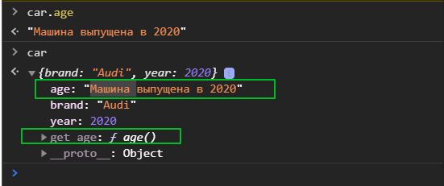

Появилась функция **get age**. 

<br>
<br>
<br>
<br>

Так же у нас есть и **setter**. Их так же можно объявлять через **Object.defineProperty**, но в данном случае я объявлю через объект. **set** должен так же называться как и **get**. **Set** принимает какое-то значение.

```js
const car = {
  brand: "Audi",
  year: 2020,
  get age() {
    return `Машина выпущена в ${this.year}`;
  },
  set age(value) {
    this.year = value;
  },
};

Object.defineProperty(car, "age", {
  // configurable: false,
  // enumerable: false,
  // writable: false,
  // get: function () {
  //   return `Машина выпущена в ${this.year}`;
  // },
});
```
Таким образом например когда я буду писать.

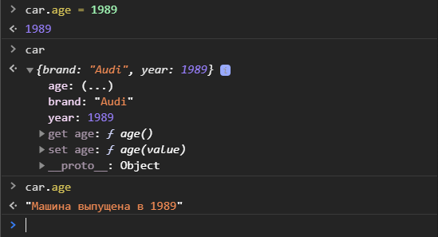

То по факту я переопределяю наше свойство **year**. И если я попробую получить **car.age** то оно уже будет изменено.

Здесь мы так же можем делать дополнительные условия, проверки что нам передали правильное значение. Если значение не правильное или не выполнены какие-то условия мы можем выбрасывать ошибку. Таким образом обезопасить себя и других пользователей от случайной перезаписи, умышленной перезаписи какого-то значения.

Мы с **set** и **get** будем довольно часто встречаться, это важная часть языка, довольно часто используется. На данном этапе довольно понять то что **getter** и **setter** дают возможность контролировать взаимодействие с каким-либо свойством и не давать его перезаписывать при не правильных условиях или выводить более человеческие значения пользователю. например у нас могут быть какие-нибудь свойства приходящие от сервера со значениями удобными серверу, там с какими-нибудь статусами или какими-то абревиатурами, а нам нужно пользователю выводить нормальные значения. Мы можем добавить **getter** соответственно через которые указывать какое-значение мы хотим вывести. Любо делать какие-то проверки и т.д.

При этом **getter** и  **setter** не копируются между объектами т.е. если я через деструктуризацию попытаюсь скопировать этот объект, то **getter** и **setter** в этот новый объект не попадут.

Так же с **Object.defineProperty** есть один очень важный трюк. Заключается он в такой ошибке. У нас с вами может быть такая проблема... Это может быть один из вопросов который могут задать на собеседовании, довольно хитрый вопрос, но тем не менее.

У нас может быть глобальная переменная. Предположим у нас есть какой-то код, очень большой и у нас где-то в этом коде происходит так что какая-то функция записывает в глабальную переменную которая ломает весь код. Предположим что у нас такой функцией будет **foo**.

```js
function foo() {
  globalVar = 10;
}

foo();
```

Ничего особенного, но если мы попробуем обратиться к **globalVar** у нас выведется 10. При этом если мы сделает **window.globalVar** мы так же получим **10**.

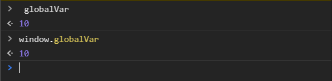

У нас происходит так что какая-то функция, а с учетом того что у нас кода очень много мы не знаем какая функция это делает. Берет и перезаписывает глобальную переменную или записывает новую глобальную переменную которая нам ломает весь код. 

Наша задача отыскать это. Можно конечно прошерстить весь код и найти эту ошибку. А можно сделать иначе. На объект **window**,а **window** это глобальный объект, соответственно раз это объект для него применим **Object.defineProperty**. Мы можем сделать следующее.
Объвить **Object.defineProperty(window)** в параметрах указываю объект **window**. Вторым параметром указываю свойство, а именно переменную **globalVar**. Дескриптор задаю **set:** в значении указываю функцию которая принимает какоето значение и выводит его в консоль. После чего я могу использовать ключевое слово **debugger** который перебрасывает туда где было вызвано изменение данного свойства.

```js
Object.defineProperty(window, "globalVar", {
  set: function (value) {
    console.log(value);
    debugger;
  },
});

function foo() {
  globalVar = 10;
}

foo();
```
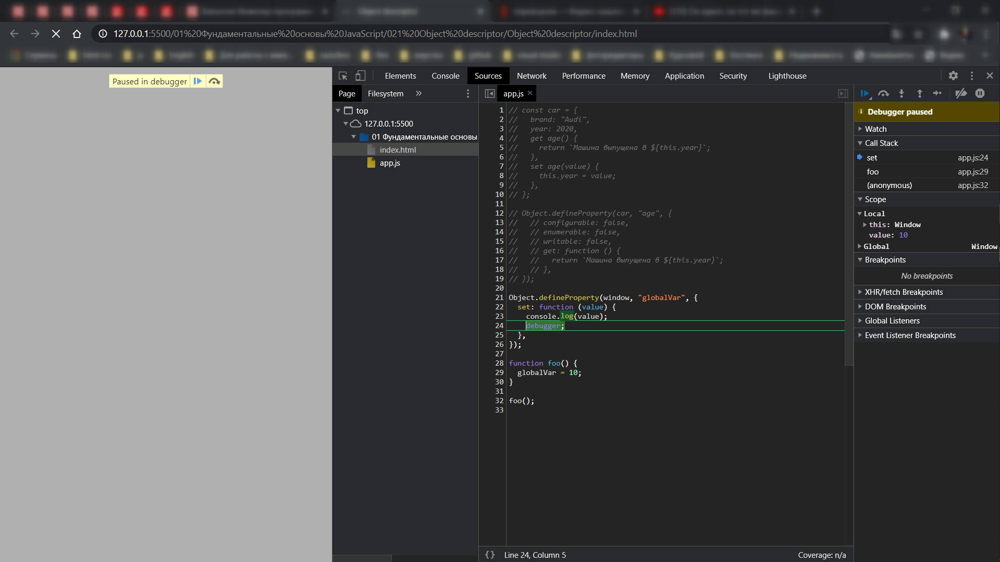

Здесь есть такое свойство как **call stack** в котором мы видим порядок откуда было вызвано данное изменение функция **foo**

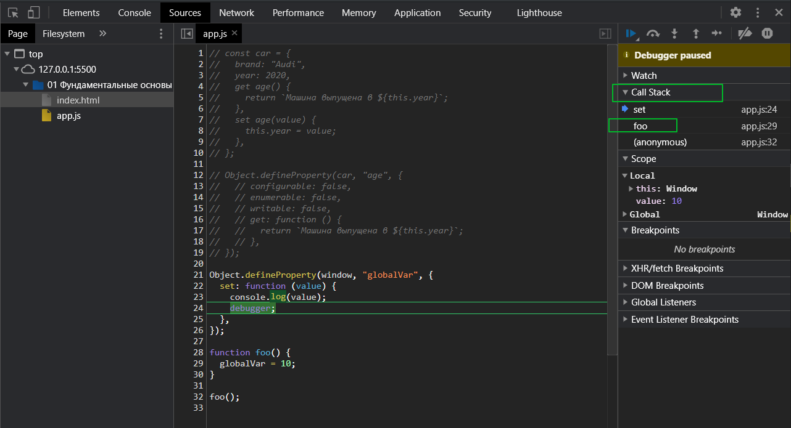

таким способом легко найти и исправить ошибку. Довольно хитрый трюк и может оказаться полезным. Ошибка может быть. Вы должны помнить о таком функционале что вы можете при помощи того же setter подписать какое-то условно говоря свойство и чекать как в него и кто будет записывать какие-то значения и откуда они были вызваны и т.д.

Так же у объекта есть довольно много методов которые выполняют частично тот функционал как **configurable**, **enumerable** и т.д.
