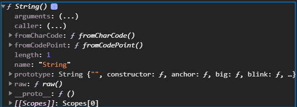
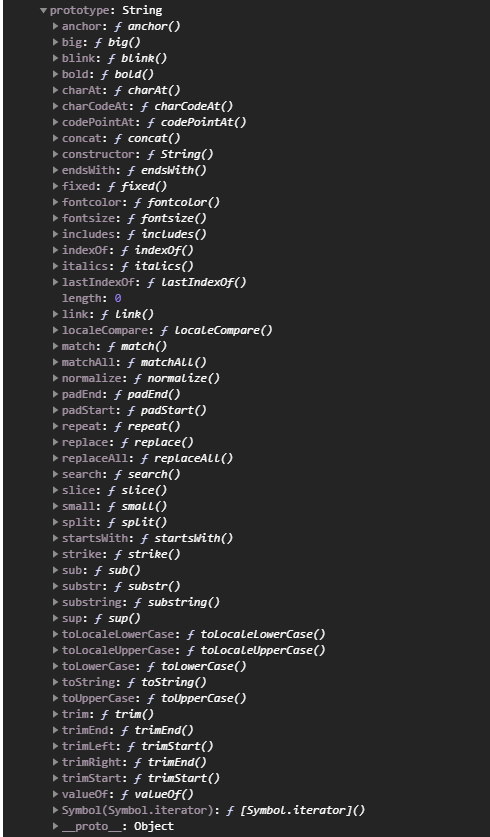
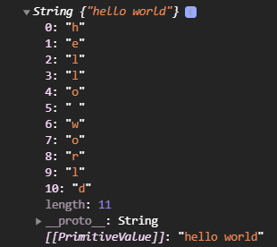
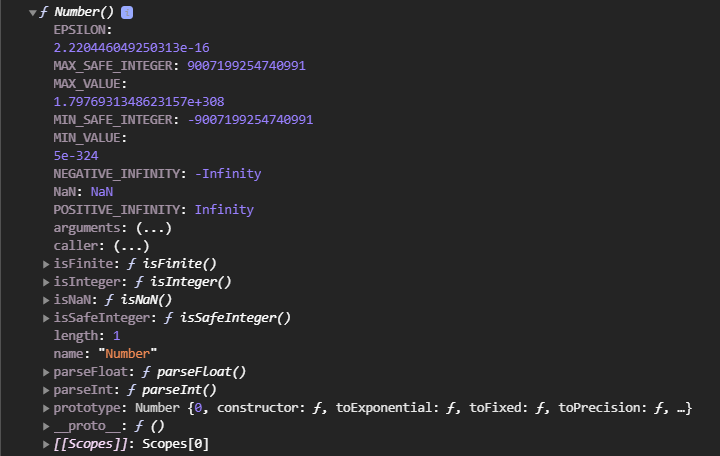

# Объекты обертки

<br>
<br>

[https://javascriptrefined.io/the-wrapper-object-400311b29151](https://javascriptrefined.io/the-wrapper-object-400311b29151)

<br>
<br>

Возможно вы задавались у же таким вопросом. А почему когда я создаю строку я могу у нее вызвать например длинну? Или например могу применить к ней методы которые с ней что-то сделают. Хотя как мы знаем методы это свойственно объектам т.е. это функции которые были объявлены в качестве свойства объекта. Можно сказать то что строка это тоже объект. Но здесь все не совсем так однозначно.

```js
let str = "hello world";
console.log(str.length);
```

Выводит **11** в консоль.

Можем вызвать **slice**

```js
let str = "hello world";
console.log(str.slice(1, -1));

```


И я получаю часть строки. Но ведь **str** это примитивный тип. Откуда же беруться эти методы? И самый главный вопрос всели в **JS** объекты?

**JS** использует специальные функции которые возвращают нам объекты обертки т.е. когда мы создаем строку **JS** вызывает функцию под названием **string** и передает туда нашу строку. Эта функция нам возвращает объект с методами для работы с этой строкой. С возможностью ее модификации и манипуляции.

Как же взглянуть на этот объект? 

Для того что бы заклянуть внутрь объекта мы должны воспользоваться **console.dir()** в параметрах указываю интересующую функцию. Можно данную функцию не вызывать. Если мы ее вызовем то мы получим пустую строку.

```js
let str = "hello world";
console.dir(String()); // получаем пустую строку
```

<br>
<br>
<br>

```js
let str = "hello world";
console.dir(String); 
```



И здесь есть интересное свойство **prototype**. **Хотя смотри есть fromChareCode и т.д. их я точно помню проходил в куре Попова!!!!**
С **prototype** подробнее будем знакомится позже. Но если в краце это специальный объект в котором содержаться общие методы и свойства для пораждаемых этой функцией, а функции в **JS** это классы. Так вот **prototype** это объект который содержит общие методы и свойства для всех порождаемых этим классом  экземплярам т.е. всех создаваемых переменных например строку. Или в будущем будем создавать экземпляры классов, какие-то объекты  и у них есть **prototype** то от кого они произошли с какими-то общими для них характеристиками и каким-то набором методов. Соответственно этот объект отслеживается **JS** и в случае когда мы обращаемся к каким-то методам и их нет у конкретного экземпляра, например у строки, то из прототипа может быть взят этот метод. Если развернуть **prototype**



то мы внутри увидим все те методы которые мы с вами использовали. Это все те методы которые мы можем вызывать у строки. Т.е. мы можем предположить и сделать вызов например

```js
let str = "hello world";
console.dir(String("hello world").slice(1, -1));

```


Получаем значение потому что вот эта часть **String("hello world")** т.к. это функция внутри имеет методы в **prototype** из которого мы можем их взять.

Чуть более подробно заглянуть и увидить то что там происходит, мы можем сделать следующее. Создаю переменную и вызываю не просто строку а как **new String('hello world')**. **new** это специальный оператор который делает из обычной функции функцию конструктор. С этим еще столкнемся. Когда этот оператор принимается к функции происходят определенные изменения в функции.

```js
const strObj = new String("hello world");
console.log(strObj);
```


И я получаю объект. Внутри него каждый символ относится к определенному индексу. Есть длинна. И если мы расскроем **proto** то здесь будут все те методы которые мы вызываем у наших строк. Внизу написано что его примитивное значение


Таким образом мы можем понять что под капотом **JS** создает объект обертку над нашим примитивным типом предоставляя нам набор методов для воздействия на этот элемент, на эту строку. При этом строка исходная не модифицируется потому что все эти методы возвращают значение а не изменяют саму строку.

Тоже самое происходит с **Number**.

```js
console.dir(Number);
```

То мы так же с вами увидим что это специальная функция. 



Во-первых у которой есть некоторые статические свойства т.е. константы. И здесь есть так же методы например **isNaN()**, есть так же **prototype** в котором есть **toFixed()** и т.д. Есть методы которые мы можем вызвать для наших чисел.

Тоже самое работает для **Boolean** только правда там особо нет методов. Потому что в **Boolean** есть два значения и с ними делать особо нечего.

Для **undefined** и **Null** у нас таких нет оберток потому что это фактически единственное значение, они специфичны очень. 

Есть еще  [simbol](https://learn.javascript.ru/symbol) (ссылка), но это отдельная история.

Вывод:

1. Для примитивных типов мы можем вызвать методы у строк и чисел т.к. **JS** создает объекты обертки при помощи специальных функций **String**, **Number** и предоставляет нам эти методы которыми мы можем как то внести модификацию.
2. И отвечая на вопрос все ли в **JS** объекты? Нет, не все. Есть объекты обертки, но примитивы остаются примитивами.

 **Это очень важно!!! Об этом чаще забывают и не помнят многие!!!**
