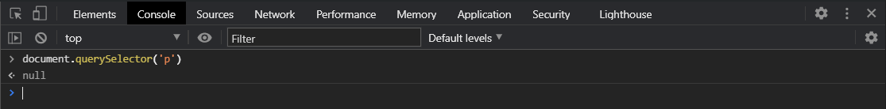
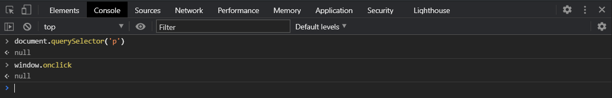
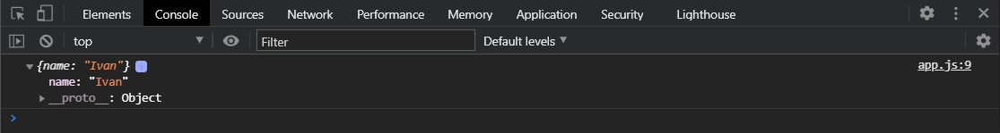
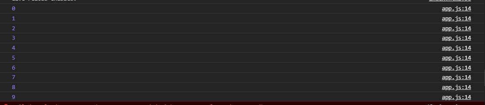
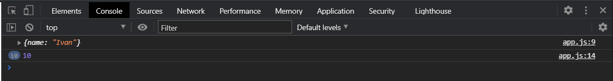
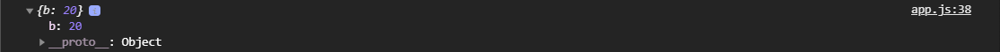
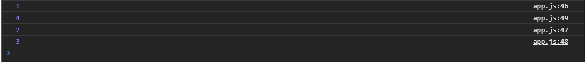
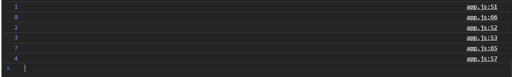
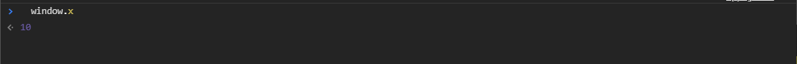
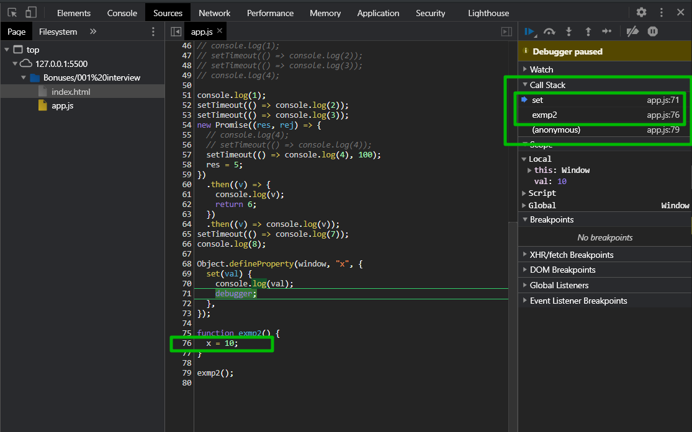

# Собеседование

Если вы начинающий разработчик то вас начнут собеседовать с теоретической части. Будут спрашивать самые базовые понятия в **JS**.

1. Типы данных : **Number**, **String**, **Boolean**, **undefined**, **null**, **symbol** - это примитивные типы. И один ссылочный тип это **Object**. И у него уже идут такие подтипы как массив функции и т.д.
2. Чем отличается **undefined** от **null**. **undefined** у нас указывает на то что нет значения. Обычно это у нас встречается где пустая переменная либо цункция ничего не возвращает, либо мы обращаемся к свойству в объекте которого не существует и т.д. **Null** указывает на то что у нас отсутствует объект. Точнее можно сказать что он указывает на то что здесь должен был быть объект, но его нет. Т.е. например если мы будем вызывать различные методы **DOM**, то если например вы попробуете.



Мы получаем **null** потому что предполагается в **querySelector** вернет **DOM** объект, но так как такого элемента нет на странице он возвращает **null**. Или если мы посмотрим в свойсво **window.onclick**



Потому что предполагается что в это свойство будет записан обработчик события **onclick** и так как его там нет, функция тоже объект, там содержиться **null**. И т.д. **null** мы встречаем там где должен был быть объект, но его там нет.

3. Далее следует вопрос с проверкой на то что вы понимаете что объекты передаются по ссылкам, а обычные примитивные типы содержатся в переменных. Если мы перезаписываем одну переменную в другую с примитивным типом, то они у нас ни как не связаны. А объекты передаются по ссылке.

Самый простой пример задачи.

```js
const obj1 = {
  name: "Konstantine",
};

const obj2 = obj1;

obj2.name = "Ivan";
```

Могут спросить чему будет рано имя в **obj1** т.е. чему будет равно **obj1** и **obj2**. И конечно же как вы знаете т.к. объекты передаются по ссылке т.е. мы передали значение **obj1** в **obj2** и изменяя **obj2.name = "Ivan";** мы будем изменять **obj1**.

```js
const obj1 = {
  name: "Konstantine",
};

const obj2 = obj1;

obj2.name = "Ivan";

console.log(obj1);
```



4. Дальше у вас могут спросить о том какие вы знаете методы перебирающие методы в массивах. Потому что это важный инструмен при работе с любым приложением знание тех методов которые существуют в **JS**. Вы должны четко сказать что у нас есть стандартно **forEach**, **map**, **filter**, **reduce**, **some**, **every**. Это основные перебирающие методы массивов. Вас могут спросить чем каждый из них отличается, что каждый из них возвращает из этих методов. Возможно дадут какую-нибудь задачку на использование этого метода. И вам нужно будет рассказать как они используются, как они работают. И если у вас будут какие-то сложности при решении задач вы можете рассуждать т.е. вы можете задавать наводящие вопросы и т.д. И впринцыпе вам в теории могут что-то подсказать и т.д. Но в целом там обычно не очень сложные задачи.

После того как вас расспросят о базовых вещах, вас скорее всего спросят:

1. что такое **this**? Чему он может быть равен в различных ситуациях.
2. Что такое замыкание?

Опять же вы должны будете объяснить что я сейчас покажу несколько задачек на **this** и на замыкание. Это еще теоретическая часть о которой вас будут спрашивать.

3. Могут спросить про **DOM**. Это могут быть различные вопросы на методы. Обычно любят спрашивать про всплытие и погружение событий. Как это работает? Что в этом такого? Как это остановить, изменить, отслеживать и т.д. Соответственно вы должны рассказать что события проходят два этапа. Сначало происходит погружение события. Если это **eventListenner** то передать третьим аргументом объект со свойством **capture** или просто передать третьим аргументом **true** это в старом формате. Если остановить всплытие вы используете **stopPropagation** либо **Event.stopImmediatePropagation()**, но обычно используется **stopPropagation**.
4. Далее могут спросить про **Event Loop**. На самом деле мало кто про него спрашивает. т.е. как происходит работа с асинхронностью т.е. как это происходит то что у нас есть стек вызовов, у нас есть браузерный **API** он вызывает например **setTimeout**, он вызывается выполняется в браузере. **callback** который мы передали становится в очередь **callback** и т.д.
5. Потом если начнется разговор про асинхронность вас конено же спросят про **AJAX** запросы про **promises**. Обычно любят спрашивать о том как можно сделать много запросов это **Promise**, [Promise.all()](https://developer.mozilla.org/ru/docs/Web/JavaScript/Reference/Global_Objects/Promise/all) мможете упомянуть [Promise.rase()](https://developer.mozilla.org/ru/docs/Web/JavaScript/Reference/Global_Objects/Promise/race) Вы блеснете потому что про **Promise.rase()** занют не все. И **async** **await** могут спросить как это устроено, что происходит и т.д.
6. Дальше могут спросить немного про **ООП**. Обычно про **ООП** очень сильно не спрашивают, хотя это зависит от того кто вас собеседует т.е. его предпочтение в **JS**, потому что это важно. Про **ООП** вы можете рассказать что есть классы, есть нааследование, есть инкапсуляция, полиморфизм. Инкапсуляция и полиморфизм реализованы не так как в других языках. Все свойства являются **public**. **Private** можно реализовать при помощи замыкания. Инкапсуляция это сокрытие какой-то логики и уровней доступа к отдельным методам и свойствам и т.д. Классы это некая абстрактная сущность описывающая можно сказать собственный тип данных. В котором у нас есть набор свойств и методов для работы с этим методом.
7. Обязательно спросят методы работы с объектами. Соответственно это [object.entries()](https://developer.mozilla.org/ru/docs/Web/JavaScript/Reference/Global_Objects/Object/entries), [Object.keys()](https://developer.mozilla.org/ru/docs/Web/JavaScript/Reference/Global_Objects/Object/keys), [Object.values()](https://developer.mozilla.org/ru/docs/Web/JavaScript/Reference/Global_Objects/Object/values), [Object.assign()](https://developer.mozilla.org/ru/docs/Web/JavaScript/Reference/Global_Objects/Object/assign) что это такое и как с этим работать. Не то что бы многоие но есть люди которые этих методов не знают и не умеют с ними работать. Опять же они очень помогают в разработке.
8. Так же вас могут спросить самый простой способ скопировать объект полностью. Вы можете сказать про [Object.assign()](https://developer.mozilla.org/ru/docs/Web/JavaScript/Reference/Global_Objects/Object/assign), про деструктуризацию, сразу сказать что это поверхностное копирование. Самый постой способ полного копирования это [JSON.stringify()](https://developer.mozilla.org/ru/docs/Web/JavaScript/Reference/Global_Objects/JSON/stringify) и JSON.parse(https://developer.mozilla.org/ru/docs/Web/JavaScript/Reference/Global_Objects/JSON/parse). Так же вас могут спросить, особенно если вы идете на какой-то **framefork**, по ним сильно много не спрашивают, это мое субъективное мнение. Обычно это несколько вопросов связанных с ним.
9. Здесь вас могут больше спросить об организации кода. О том что если у вас есть **API**, там есть множество сервисов для работы с этим **API**. Есть различные разделы например аутентификация, управление пользователем, его настройки, добавление удаление редактирование (например товары) и т.д. Вас могут спросить как вы будуте организовывать такой код. Здесь больше вопрос стоит в том что вы должны объяснить что вы будете код делить на части. На отдельные модули для взаимодействия с различными частями **API** и впринцыпе частями приложения. Вы не будете писать это условно в одном файле и разбрасывать это как угодно т.е. есть четкая структура что если у вас есть четкое взаимодействие к примеру с **Users** то у вас есть некий модуль в котором есть набор методов для работы с **User** для **AJAX** запросов. Есть отдельный модуль для работы со **Stuf(сотрудники)** в котором так же есть набор методов для запросов. У вас есть модуль который взаимодействует с **Users**, только с ними. Например есть какой-то общий модуль для взаимодействия. Вы структурируете свое приложение на небольшие части. Они же могут являться компонентами, модулями. Если мы говорим о **frameworks** то там есть хранилище **store** данных. Они так же вьются на небольшие модули для того что бы это можно было легко рассширять рефакторить и т.д.
10. Могут спросить про то что такое **callbacks**. Про то что такое функции высшего порядка. Соответственно здесь все довольно просто. Вы можете спокойно ответить что функции передаваемые в качестве аргументов в другие функции или возвращаемые из функции. И соответственно **callbacks** - это функции передаваемые как аргументы внутрь другой функции и соответственно вызываемые в процессе выполнения этой функции или по ее завершению.
11. Вас могут спросить о каких-то теоретических вещах в **DOM**. Я бы спросил какой нюанс есть в **innerHTML**. Чем отличается **querySelector** от **getElementsByClassName**. Что это живые и не живые коллекции.
12. Основные нововведения **ES6+** и здесь вы рассказываете про **let**, **const**, **arrow function**, **деструктуризация**, **promises**, **fetch**, **class** и т.д.

Теперь что касается задачь.

Начнут может быть с задачи которую я уже показывал. Потом могут попросить решить какие-нибудь задачи с использованием методов **filter**, **reduce**, **sort**, **find**, **findIndex**, **indexOf**. Будет вопрос чем отличается **findIndex** от **indexOf**.

Опять же если вас будут спрашивать в формате замыкания и отходя к **event Loop**.

Вам могут дать такую задачу. Это задача на понимание **event loop**, на понимание замыкания частично.

```js
function exm1() {
  for (let i = 0; i < 10; i++) {
    setTimeout(function () {
      console.log(i);
    });
  }
}
exm1();
```

т.е. если мы вызовем **exm1**, то что произойдет в этот момент и почему произойдем именно так.



При этом если мы поменяем **let** на **var**



Все время выводится **10** и у нас спросят почему так происходит. **var** всплывает т.е. получается следующее

```js
function exm1() {
  var i;
  for (i = 0; i < 10; i++) {
    setTimeout(function () {
      console.log(i);
    });
  }
}
exm1();
```

И соответственно в процессе цикла как вы помните **setTimeout** отработает после того как стек освободится. В стеке у нас есть цикл **for**. Соответственно когда весь цикл выполнится начнет отрабатывать **setTimeout** т.е. у нас будет 10 **callback** которые выполняться. И получается то что мы используем **var** то фактически **i** будет изменяться внешне. И каждый из **callback** который выполнится они все будут обращаться к глобальной **i** т.е. фактически после выполнения вот этой функции

```js
function exm1() {
  var i;
  for (i = 0; i < 10; i++) {
    setTimeout(function () {
      console.log(i);
    });
  }
}
```

**call stack** освободился и начнут выполняться наши **callback** и соответственно у нас функция получит доступ к **i** которая определена ввиде **var** и уже он получит доступ и измененной переменной. И по этому у нас все время будет выводится цифра **10**.

Если же будет **let**, которые имеют блочную область видимости, и в рамках этого блока на каждой итерации **let** будет новая объявляться и будет присваиваться значение. Таким образом вот эта функция

```js
function () {
      console.log(i);
    }
```

Когда она начнет выполняться, она в замыкании будет получать доступ именно к той **let** которая была на ее итерации.

Дальше вас могут спросить и **this**.

```js
const obj3 = {
  foo() {
    console.log(this.a);
  },
  a: 1,
};
```

Могут спросить чему равна **а**.
И дальше вас могут спросить если

```js
  foo() {
    console.log(this.a);
  },
  a: 1,
};

const b = obj3.foo;
b();
```

В консоли будет выведено **undefined**. Потому что мы вызываем функцию в глобальном пространстве а не в контексте объекта. Соответственно у нас **this** указывает на **window** а **а** там не существует.

Это можно исправить если использовать **call()** или **aply()** либо **bind()** если мы хотим вызвать вот в таком формате.

```js
const obj3 = {
  foo() {
    console.log(this.a);
  },
  a: 1,
};

const b = obj3.foo.bind(obj3);
b();
```

И все работает в консоль выводится **1**.

У вас еще может быть вот такая задачка. Она связана так же с объектами, то что они передаются по ссылке. Пустой объект и самовызывающаяся функция.

```js
const obj4 = {};

(function (x) {
  x.b = 20;
  x = null;
})(obj4);
```

Чему будет равен **obj4**? Задача немного с подвохом. Нужно присмотреться и не торопится с ответом. Во-первый мы в конце мы передаем **obj4** и он становится аргументом **x**. Фактически мы здесь нигде не копируем объект поэтому **х** это ссылка на **obj4**. Соответственно когда мы делаем **x.b = 20;** мы добавляем в **obj4** свойство **b = 20**. Дальше мы делаем **x = null**; и вот здесь есть небольшой подвох. Мы можем здесь подумать раз х это ссылка на объект **obj4** то он будет **null**. Но фактически **x** помимо того что это ссылка на объект это еще и переменная, локальная внутри функции, соответственно мы просто переопределяем эту локальную переменную. Т.е. здесь **x.b = 20;** мы изменили объект, а здесь **x = null;** мы переопределяем переменную. И если вне нашей функции мы обратимся к **console.log(obj4);**

```js
const obj4 = {};

(function (x) {
  x.b = 20;
  x = null;
})(obj4);

console.log(obj4);
```



У вас может быть вопрос связанный с **DOM**. Предположим у вас есть много **div** на странице **const divs = document.getElementsByClassName("div");** И задача состоит в том что вам нужно найти среди этих **div** - вов **div** с **id** не используя циклов, не используя методов для **DOM**. Как вы это можете сделать?

Это можно сделать если преобразовать эту коллекцию в массив или использовать метод **find()**.

```js
const divs = document.getElementsByClassName("div");

const divWithId = [...divs].find((el) => {});
```

В **find** мы на каждой итерации получим элемент и будем проверять что у него есть свойство **id**. Либо это можно сделать через **Array.prototype.find,call()**

```js
const divs = document.getElementsByClassName("div");

// const divWithId = [...divs].find((el) =>{})
const divWithId = [].find.call(divs, (el) => {});
```

или вот так

```js
const divs = document.getElementsByClassName("div");

// const divWithId = [...divs].find((el) =>{})
// const divWithId = [].find.call(divs,(el) =>{})
const divWithId = Array.prototype.find.call(divs, (el) => {});
```

Вас могут начать спрашивать по **event loop**(цикл событий).

```js
console.log(1);
setTimeout(() => console.log(2));
setTimeout(() => console.log(3));
console.log(4);
```

Это может еще перемешиваться с промисами. Вы просто должны помнить что все асинхронные действия выполняться только тогда когда освободится стек. т.е. когда вызовуться все функции которые идут синхронно.



Т.е. в общем-то эта конструкция с асинхронностью может вызывать какие-то дополнения с промисами.

```js
console.log(1);
setTimeout(() => console.log(2));
setTimeout(() => console.log(3));
new Promise((res, rej) => {
  // console.log(4);
  // setTimeout(() => console.log(4));
  setTimeout(() => console.log(4), 100);
  res = 5;
})
  .then((v) => {
    console.log(v);
    return 6;
  })
  .then((v) => console.log(v));
setTimeout(() => console.log(7));
console.log(8);
```



Сначало как видите выводится **1**, **8** потому что это синхронное выполнение. После этого казалось бы должны были получить двойку, но мы получаем сначало **5** потому что вызовотся промис, выведется **5**. Он попадет в **then**, выведется цифра **5**. Потом выведется возвращаемая цифра **6**. Потому что вот это действие new **Promise** синхронное, а дальше в нем происходят асинхронные действия т.е. вызов **res** это уже асинхронное, но вызов **new Promise** был синхронным. Поэтому у нас сначало вызывается пятерка. Потом вызывается **6** потому что продолжается цепочка **then**. После этого начинаются выполняться **setTimeout(() => console.log(2));**
**setTimeout(() => console.log(3));** потом выполнится **setTimeout(() => console.log(7));** и **setTimeout(() => console.log(4), 100);**

Представте себе ситуацию что какая-то функция определяет глобальную переменную. После чего эта функция вызывается где-то.

```js
function exmp2() {
  x = 10;
}

exmp2();
```

Представте что вот это определение переменной ломает весь ваш код. Но вы не знаете где это было вызвано. Где-то эта переменная изменилась. Вы знаете как она называется переменная, но где она была вызвана вы не знаете. Здесь решение сложное, но тем не менее интересное. Заключается оно в том что когда мы объявляем вот так вот переменную **x = 10;** то она становится глобальной.



И получается что так как **window** это объект мы можем это очень хитро завернуть использую **Object.defineProperty()** мы можем объявить что мы можем повесить на **window**, повесить **x**, и в **Object.descriptor** который я указываю ввиде объекта **{}**, в нем указать **set(val){console.log(val) debugger}**

```js
Object.defineProperty(window, "x", {
  set(val) {
    console.log(val);
    debugger;
  },
});

function exmp2() {
  x = 10;
}

exmp2();
```
Мы знаем как называется переменная но мы не знаем где она была вызвана. А у нас например кода очень много. Мы можем сделать **Object.defineProperty** на объект **window** и на глобальную переменную которая там появляется **"x"**. **Setter** это функция которая отработает тогда когда вот так вот **x = 10;** будет задаваться значение. Мы его консолим и вызываем **debugger**. Этот оператор останавливает выполнение дальнейшего кода и выкенет нас в наш **debugger** в котором мы можем посмотреть в **call stack** и увидить что вызвана функция **set** а вот **exmp2** это то что вызвало этот **set**.




