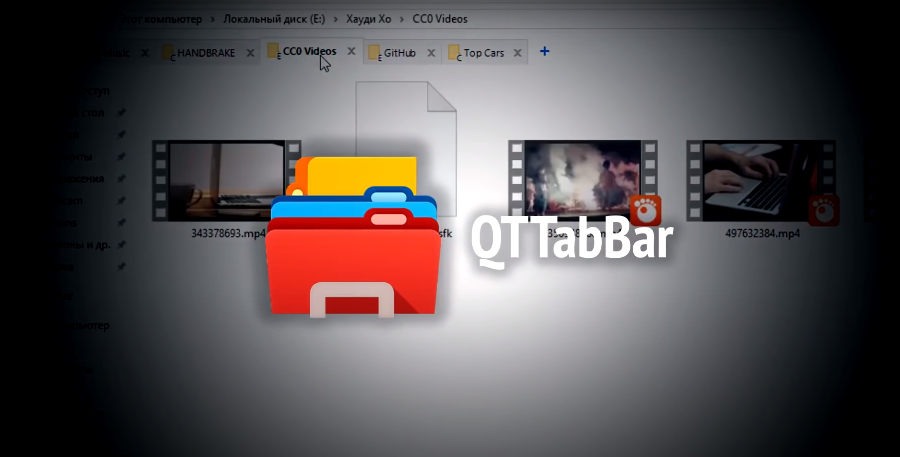
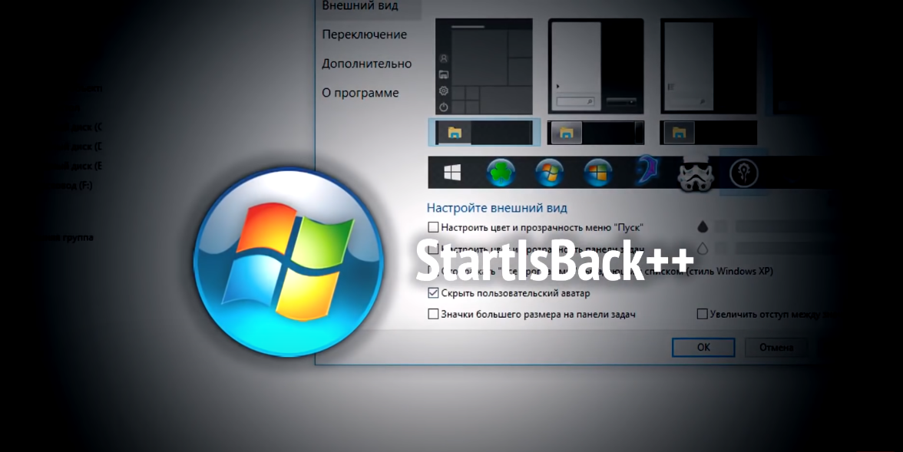

# Кастомизация виндовс

[https://www.youtube.com/watch?v=09wq7tKfuOo&t=262s](https://www.youtube.com/watch?v=09wq7tKfuOo&t=262s) ссылка на кастомизацию в стиле марти макфлай.

Календарь с делами - [http://gtorrent.org/programmy/ofis/119481-desktop-calendar-23734866-multi-ru.html](http://gtorrent.org/programmy/ofis/119481-desktop-calendar-23734866-multi-ru.html),

карзина в трее - [https://howdyho.net/download/386](https://howdyho.net/download/386),

RocketDock панелька с программами внузу как в macOS:  [http://howdyho.net/download/402](http://howdyho.net/download/402),

RainMeter  витжеты: [http://howdyho.net/download/403](http://howdyho.net/download/403).

 
 
 
 

Темы **windows**

 UltraUXThemePatcher [https://7themes.su/prog/UltraUXThemePatcher_3.7.1.rar](https://7themes.su/prog/UltraUXThemePatcher_3.7.1.rar),

 Как отключить ленточный интерфейс проводника (белая полоса вверху проводника, файл, компьютер, вид)?
Ответ: Для настройки проводника используйте утилиту OldNewExplorer: [http://7themes.su/news/oldnewexplorer/2014-02-22-818](http://7themes.su/news/oldnewexplorer/2014-02-22-818),

У вас на скриншоте тема имеет прозрачность, а у меня ее нет, почему?
Ответ: По умолчанию Windows 10 не поддерживает прозрачности, используйте программу Aero Glass: [http://7themes.su/news/aero_glass/2013-05-08-671](http://7themes.su/news/aero_glass/2013-05-08-671),

После сочетания клавиш CTR+ALT+Delete в темных темах, некоторые части интерфейса становятся белыми, как исправить?
Ответ: Примените твик реестра Remove Default Color: [http://7themes.su/_fr/7/Remove_Default_.rar](http://7themes.su/_fr/7/Remove_Default_.rar),
Скачиваю интересующую тему. Сами файлы темы помещаю в C:\Windows\Resources\Themes

 
 
 
 

**70 программ от хауди для винды**

**QTTabBar**(закладки как в браузере) - [http://nnmclub.to/forum/viewtopic.php?t=1291990](http://nnmclub.to/forum/viewtopic.php?t=1291990) 

**startlsBack++**(модифицированное меню пуск) - [http://nnmclub.to/forum/viewtopic.php?t=1406471](http://nnmclub.to/forum/viewtopic.php?t=1406471)

**Dism++**(Одна из эффективных программ очистки винды от мусора). 
[http://nnmclub.to/forum/viewtopic.php?t=1307005](http://nnmclub.to/forum/viewtopic.php?t=1307005)

**DESKTOPCAL** (Календарь) - [ https://howdyho.net/download/369]( https://howdyho.net/download/369)

**GlassWire** (VМожно отследить сколько потребляет трафика та или иная программа. Можно обнаруживать вирусы, майнеры и т.д.) - [http://nnmclub.to/forum/viewtopic.php?t=1391579](http://nnmclub.to/forum/viewtopic.php?t=1391579)

**Uncheky** (при установке программ автоматически снимает галочки с ПО которое может установится с утанавливаемой программой)- [http://nnmclub.to/forum/viewtopic.php?t=1098369](http://nnmclub.to/forum/viewtopic.php?t=1098369)

**Moo0 System Monitor** (Показывает нагрузку на ЦП, нагрузка на видео карту температура) - [http://nnmclub.to/forum/viewtopic.php?t=845172](http://nnmclub.to/forum/viewtopic.php?t=845172)

**WizTree** (определяет сколько занимает то или иной каталог диска) - [http://nnmclub.to/forum/viewtopic.php?t=1383140](http://nnmclub.to/forum/viewtopic.php?t=1383140)

Ueli (поисковик с macOS) - [http://howdyho.net/download/425](http://howdyho.net/download/425)

**Psiphon3**  VPN - [http://howdyho.net/download/367](http://howdyho.net/download/367)

**WindowFX** (Прозрачные окна, анимирование и тд) - [http://howdyho.net/download/412](http://howdyho.net/download/412)

**Fences** (группировка ярлыков на рабочес столе) - [http://nnmclub.to/forum/viewtopic.php?t=1082436](http://nnmclub.to/forum/viewtopic.php?t=1082436)

**Groupy** (несколько приложений в одном окне) - [http://howdyho.net/download/426](http://howdyho.net/download/426)

 **Win10 Tweaker** - [http://nnmclub.to/forum/viewtopic.php?t=1249828](http://nnmclub.to/forum/viewtopic.php?t=1249828)

**Hitman PRO** (в поддержку антивируса) - [http://nnmclub.to/forum/viewtopic.php?t=1200013](http://nnmclub.to/forum/viewtopic.php?t=1200013)

