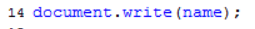

# Методы write() обьект document
Сохраняйте каждый урок в отдельном файле что бы затем было легко вернуться к какому-нибудь уроку и посмотреть, как мы там выполняли какой-то код. Потому что если мы будем выполнять все наши уроки в одном файле, то в итоге у нас получится просто каша. Поэтому сразу я дублирую данный файл 

И сразу сохраняю его под именем lesson5.

В предыдущем уроке мы с вами побывали в роли могущественного мэра. Что весь наш мир состоит из объектов каждый объект имеет свое свойство, которое его как то характеризует. Если это человек у него есть рост, вес и т.д. если это улица, то это количество домов и т.д. 
У каждого объекта есть свои методы, с помощью которых на него можно воздействовать, сменить одежду, повысить зп. Так вот в мире java script устроено примерно так же. Здесь так же есть объекты, у каждого объекта так же есть свои свойства и методы с помощью которых мы можем на них воздействовать. 
 И начнем мы изучение с самого важного объекта, это объект ***document***, его можно сравнить с объектом город, который был у нас в предыдущем уроке т.е. город содержит в себе все остальные уроки.
 Документ это основной объект который содержит в себе все остальные объекты. 
 
 Если мы вернемся к нашему примеру
 
 Все что нужно для формирования этой вэб страницы, все html теги, все картинки и т.д. все это входит в объект ***document*** и у этого объекта есть свои свойства и методы которыми мы можем воздействовать на данный документ.
 Вданном случае когда у нас кода еще очень мало
  
   При этом мы так же можем воздействовать на  этот объект. 
И первый метод который мы изучимэто будет метод  ***write ()***

с помощью этого метода мы можем записывать в наш документ, в нашу вэб-страницу, новую информацию. Если перевести write –это запись. Заметьте что я поставил две круглые скобки
если вы вниметельно смотрели предыдущий урок то вы должны были заметить чем отличается с-во от  метода. Когда мы писали допустим Сонова Нина Львовна точка (.) возраст , мы круглые скобки не ставили, просто писали точка возраст и нам выдавалась информация. Если нам надо было изменить цвет блузки то мы в скобках писали ее цвет. Так вот это главное отличие с-ва от методов. С-ва они просто возвращают какую-то информацию возраст рост и т.д. а метод он позволяет что-то сделать, что-то изменить с этим обьектом и по-этому содержит эти круглые скобки в которые обычно передаются уточняющие параметры т.е. что именно делать с этим обьектом. И в данном случае если мы оставим допустим просто так
то ничего не произойдет.
Если мы выводим текст то мы в скобках прописываем двойные или одинарные кавычки. 

Как видите у нас вывелась строка в наш документ. Т.е. по сути мы изменили наш документ и добавили в него эту строку с помощью метода document.write(); этот метод мы будем использовать на протяжении всего курса. Как вы видите он работает по простому принцыпу . нам нужно указать в качестве параметра что мы хотим вывести в документ и он нам выведет это.
И самое главное что нам нужно здесь запомнить это то что когда  мы выводим текст или вообще когда будем работать с текстом мы всегда долны его заключать в кавычки “”. Это основное правило работы с текстом. И вот этот самый интерпритарор JavaScript т.е. третий слуга. Т.е. все что будет идти до закрывающей кавычки это просто текст который нужно вывести. С таким же успехом мы могли заключить его в параграф и слово JavaScript сделать жирным.    

Теперь последний момент который здесь хотел уточнить. Если вам нужно вывести кавычки двойные или однинарные без разницы. Что бы компилятор не посчитал это ошибкой перед кавычкой ставим обратный слэш и прописать кавычку т.е. экранируем кавычку  \”……… \”.
Т.е. \”-это вывод на экран кавычки.

# Отлов ошибок и коментарии
Давайте поговорим о том, как отслеживать ошибки которые мы совершаем. Потому что JavaScript достаточно строгий язык, он не позволяет писать с ошибками и любая точка, любая скобка вызовет ошибку.
Так вот бывает такая ситуация что script у вас не работает, а вы смотрите и вроде бы у вас все правильно. Так вот в браузерах современных есть функция отлова этих ошибок что бы вы могли понять хотя бы в какой строке у вас ошибка. Делаем в нашем документе какую-нибудь ошибку. 

но многие редакторы не делают этого. 

# Суть и создание переменных
И так, переходим еще к одной части любого языка программирования - это переменные.
В любом языке программирования нужно как-то хранить данные, как-то сохранять информацию, которая понадобится в дальнейшем.
Например, у вас есть какой-то интернет магазин и в нем человек заказывает какие-то товары. Т.е. вам как-то нужно сохранять какие товары он заказал, какие. Затем вы извлекаете информацию о цене этих товаров и уже оперируя этими данными вы можете посчитать сумму заказа.
Для того что бы создать переменную нужно написать ключевое слово var -это ключевое слово, которое создает переменную. После чего нам нужно указать ключевое слово price цена и ставим точку с запятой.

теперь попробуем в этот контейнер положить какое-нибудь значение например 500. 

Давайте создадим еще одну переменную. Можно кстати в одной строке обьявить переменную и сразу присвоить ей значение. 

# Использвание переменных
И так мы с вами научились создавать переменные и теперь давайте попробуем использовать их в нашем скрипте. Пока что мы умеем выводить информацию с помощью метода write объект document. По - этому давайте используем этот метод и попробуем уже вывести не просто текст на экран, а текст которых хранится в какой то из наших переменных.
Пишем 
 
и укажем что мы хотим вывести текст из переменной name.

и здесь как мы видим мы не ставили двойные кавычки

потому что в данном случае мы выводим не просто текст а именно значение переменной. Это имейте ввиду!!!!!!

Теперь давайте попробуем изменить значение, которое хранится в переменной price например мы хотим хранить там не 500 а 200. 

здесь сразу виден смысл этого слова “ПЕРЕМЕННАЯ”,  потому что как вы видите в течении программы одна и та же переменная может иметь совершенно разные значения отсюда и слово переменная. 

по этому мы можем в течении работы скрипта хот сотни раз менять значение которое хранится в переменной при этом  если вы допустим хранили в ней число 200 вы можете следующей строкой сохранить туда какуюй-то строку. Как вы увидите дальше в процессе обучения мы будем хранить в переменных и массивы и объекты и др элементы. Поэтому переменные это такой фундамент это те самые коробочки которые хранят какую то информацию и которые спокойно можно использовать на протяжении всего скрипта  и это очень удобно.
Теперь смотрите что произойдет если я напишу вот таким образом? 

на самом деле произойдет все тоже самое что и раньше  значению 200 будет подставлено значение переменной name это значение Иван. Т.е. все что было в переменной price до этого будет стерто и будет подставлено значение иван и это значение будет присвоино переменной price.  
Если посмотреть это более наглядно то это будет выглядеть таким образом. 

Он удалит все что было в price и поместит туда значение переменной name.

                                                         
# 9. Какие имена можно давать переменным
В этом уроке мы с вами поговорим как правильно работать с именами переменных потому что научится создавать то мы научились  а вот какие имена им можно давать не поговорили. Эта ситуация очень важна потому что очень часто бывает что вы написали скрипт, запускаете его в браузере а он не работает. Как раз таки одна из причин может быть в неправильном имени переменной либо в использовании так сказать зарезервированного слова о них мы еще поговорим. 
И так какие привила нужно соблюдать когда вы создаете переменную??
Во-первых имя переменной может начинаться либо с буквы, либо с доллара $, либо с нижнего подчеркивания _. С других символов имя переменной начинаться не может.  

Таким образом запомните что имя переменной начинается только с 3-х символов. Я вообще рекомендую всегда называть только с буквы.
Дальше следующий момент. Опять же нельзя использовать в имени переменной различные не допустимые символы

по это му имейте ввиду что в имени переменной вы можете использовать так же только буквы числа, символ $ или нижнее подчеркивание.
Так же преременная чувствительна регистру. Что это значит?? Это значит что если вы создали переменную my_car; полностью маленькими буквами то во всем остальном скрипте вы так же должны использоватьименно такое написание этой переменной, потому что в противном случае если вы где-то напишите например

то My_car это будет для JavaScript совершенно другая переменная и он будет ее искать и не найдет естественно и тоже естественно может вызвать ошибку. По этому будте внимательнее, как вы создали  переменную так вы и должны ее затем в скрипте и использовать.
И червертый пункт тоже достаточно важный. Нельзя называть переменную одним из занятых слов. Что это  за занятое слово это список зарезервированных слов которые используются в самом языке программирования есть такие например fankshion  и другие такие слова которые используются как мы дальше с вами увидим в последующих уроках для создания различных конструкция языка.
Список этих зарезервированных слов я прикладываю в dopmat 

Там список слов которыми нельзя называть переменные. Эти слова используются для создания различных конструкций но есть и такие которые похожи на обычные слова

которые вы можете по ошибке использовать для создания переменных в своей программе но она работать не будет и скрипт вам будет выдавать какую-то не понятную ошибку а на самом деле дело как разтаки в том что вы заняли какое то слово которым нельзя называть переменную.
Это были основные правила которые вы должны учитывать при создании переменных.
И пару рекомендаций о том как создавать переменные.
Как вы заметили в предыдущем уроке мы для хранения цены назвали переменную price, для хранения имени назвали переменную name. Т.е. это не зря это обще известная рекомендация называть переменные в соответствии с тем какие данные в этой переменной хранятся. Т.е. если вам нужно хранить какую-то сумму денег в переменной  то вы можете назвать переменную   т.е. сразу понятно что в ней хранится.
Если допустим с Английским у вас плохо совсем то никто не мешает вам создавать имена переменных транслитом.

Единственный момент если в названии переменной два слова то желательно второе слово писать с большой буквы это тоже принятое практикой. Если в названии переменной у вас 3-ри слова то соответственно каждое следующее слово так же должно начинаться с большой буквы. Таким образом вы будете создавать уникальные переменные точно не наткнетесь на зарезервированное слово и будете понимать какие данные у вас хранятся в этой переменной и она будет легко читаться.
И последний момент который хотел затронуть это создание нескольких переменных за один прием. Мы с вами до этого все время создавали по одной переменной, но на самом деле с помощью слова var вы можете указать сразу несколько переменных 

Вот такая запись создаст сразу 3-ри переменных

# 10. Операции над переменными
 Операции над переменными это тоже очень важный момент. Все эти знания которые вы получите в этом уроке вы будете применяться вами на протяжении всего курса.
Теперь пришло время производить различные операции с этими переменными такие как например сложение, вычитание, умножение и деление. Допустим у нас есть несколько чисел. Пусть это будет количество яблок, количество апельсинов и нам нужно подсчитать общую итоговую сумму. 
Давайте решим эту задачу.
AppleCount к-во яблок
OrengeCount  к-во апельсинов 
TotalFruits сумма фруктов
Как вы догадались нам нужно сделать следующее  нам в   TotalFruits нужно занести сумму этих двух переменных.
Давайте выведем это все дело на экран

вот он нам вывел что у нас 112 фруктов. 
Если нас интересует умножение деление или вычетание там происходит все точно также. 
К примеру умножение 

Нас здесь интересует другой момент оператор плюс который мы с вами использовали для сложения двух чисел к-во яблок и апельсинов. Он на самом деле используется еще для одной цели для сложения строк. Вы можете удивится что строки можно складывать но на самом деле можно. Просто там как бы идет не складывание в прямом смысле слова, а просто соединение этих строк.

Смотрите мы можем с этих трех переменных вывести ФИО.

Вот он выводит 

Если вы хотите выводить все с пробелами это можно сделать двумя путями
Либо добавить пробел в нужных местах 

А есть еще другой вариант можно просто добавить пробелы в качестве дополнительных строк 

Мы очень часто будем пользоватся такими методами когда разделяется переменные между собой такими пробелами.

Дальше что произойдет с переменной если мы попробуем сложить  переменную в которой содержитс текст с переменной в которой содержится число.

Вот что произошло

Он ничего не стал вкладывать. Он просто превратил 34 в строку и обьеденил две строки. Он в любом случае не может сложить эти переменные.  По этому в этом случае когда мы складываем строку с числом, JavaScript всегда превращает число в строку и делает сложение. При этом здесь можно было так же добавить пробел. 
Это вы должны очень хорошо понимать, потому что смотрите какая ситуация у вас может получится. Например у  вас есть какая то переменная, количество воды (var couttWater), и мы указываем по шибке “145” , т.е. мы забыли что числа нужно указывать без кавычек и указали значение переменной  145 в “”. и у нас есть еще одна переменная к-во сока (countJuice) сока 200 и здесь мы уже пишем правильно

и смотрите если мы допустим хотим подсчитать сумму сколько у нас литров жидкости

Т.е. вроде бы все правильно, и мы надеемся получить 345.вот что он нам выдаст.

Т.е. он что сделал, он вял строку 145 , превратил в строку число 200 и сложил эти две строки. В будущем вы научитесь этого избегать потому что есть специальные функции которые позволяют превращать числа в кавычках в обычные числа.
Это называется конкотенацией т.е. слиянием двух строк.  По этому я не зря говорил что только любой текст заключается в кавычки. Запомните что строки можно склеивать между собой с помощью

# 11. Изменение значений переменных
И так в этом уроке мы с вами закончим работу с переменными
И закончим таким закрепляющим уроком в котором поговорим о том как увеличивать значения переменных или уменьшать не важно. Допустим у нас есть переменная

И допустим мы хотим увеличить ее значение на 16-ть. Нам нужно не сложить а именно увеличить  значение которое лежит в переменной count на 16-ть. Если мы напишем так

то мы уже знаем что произойдет. Значение 32 заменится на 16-ть, а нам этого не нужно.

Пишем вот так 

Нам достаточно указать значение этой переменной (count) и прибавить к ней 16-ть. Как мы уже знаем у нас сначала выполняется правая часть выражения после знака присваивания при этом первым делом название переменной заменяется на ее значение. Т.е. первым делом  всегда подставляется 32  и суммируется выражение. Получается 48 и после этого сумма заносится в переменную count. 

Тоже самое если хотели уменьшить на 16-ть.

Где то в литературе вы можете встретить сокращенные варианты записи

Тоже самое и с плюсом и с умножением.

Есть еще один вариант сокращения который так же очень часто используется это уменьшение и увеличение на 1-цу. Это вы можете сделать просто написав 

Это будет означать что вы увеличиваете значение переменной на еденицу. Тоже самое если уменьшить… из курса по си это называется постфиксная форма энкремента если ++, если с минусом то это постфиксная форма декремента.
В JavaScript это так же очень часто используется в так называемых циклах. А сейчас вам главное понять что это всего лишь обычная арифметика которая позволяет изменять значения переменной т.е. что то к ней плюсовать, что то вычитать, на что то ее разделить , на что то умножить.

#  Массивы
# 12. Введение в массивы
 Прежде чем перейти к JavaScript и понять для чего нам нужны массивы давайте перейдем к реальной жизни и посмотрим на вот такой пример. Если взять любой банк то там есть вот такой шкафчик
 и в нем как вы видите хранится куча разных папок.
Предположим это шкаф для хранения договоров. И когда какому то сотруднику банка нужен какой то договор, с каким то там частным лицом, либо юр лицом, он всегда знает что этот договор лежит в шкафчике под названием договора и ему достаточно подойти к этому шкафчику и  открыть его и найти папку где написано название нужной организации. Т.е. это очень удобно, это экономит время сотруднику банка не надо метаться там по всем  папкам по всем там шкафам по всему банку ходить искать этот договор когда он точно знает что договора лежат в одном месте. Так вот такая система очень удобна и в любом языке программирования есть ее аналог который называется массив.
Т.е. массив это некое скопление данных однотипных где к каждому элементу вы можете получить спокойно доступ.

Давайте вернемся к JavaScript и посмотрим как создаются массивы.
Вот простейший пример у нас есть семь дней недели с понедельника по воскресенье и нам нужно где-то их хранить. Они нам нужны в программе и если бы допустим массивов бы не было, мы бы пошли обычным путем. Мы создали бы семь переменных т.е. на каждый день недели по своей переменной.

Но как видите это не совсем удобно. Нам пришлось создать аж 7-мь переменных для хранения всего лишь дней недели.
На этот случай мы можем спокойно создать массив под названием days . 
Т.е. var days = []; и просто в квадратных скобках через запятую указываем дни недели.
Т.е. у нас в одной переменной хранятся сразу семь значений. 

Но здесь сразу встает вопрос как же получить доступ к определенному дню недели?? Ведь если мы выведем просто days то у нас выйдет не понятно что

выводит просто все эти дни перечисленные между собой.
Но как же нам получить доступ к отдельному элементу??
 А делается это очень просто вы указываете название массива и так же в квадратных скобках указываете номер элемента. Только здесь имейте ввиду что компьютер считает с ноля. По этому если вам нужно вывести  понедельник ставим [0];
 
Вот он нам вывел.
Если нам надо будет вывести воскресенье то это будет [6];
Вот таким образом работают массивы. Как видите ничего сложного нет и если посмотреть более наглядный пример это будет выглядеть примерно так.

Вы еще убедитесь на сколько удобны массивы в работе. Сейчас это может быть кажется не так актуально но потом когда мы будем все дальше и дальше углубляться в JavaScript вы поймете на сколько удобнее иногда бывает хранить данные в массивах чем в простых переменных.

Так что еще?? Мы здесь использовали массив чисто из текстовых элементов. Но вам никто не запрещает создавать смешанный массив. Первый элемент текстовый, второй числовой, третий там опять числовой, четвертый опять текстовый.
 Для примера давайте создадим разношерстный массив. На английском массив пишется так MyArray  Однако есть несколько способов создания массива. Но мы сначала закрепим способ который мы уже использовали , через квадратные скобки [] , а затем я вам расскажу о других способах.

Ну вот точно такой же массив, только он получен из разнородных элементов. И точно так же мы можем получить доступ из этих элементов просто указав нужный номер при выводе.

Сейчас для закрепления проделаем еще такую вещ.  Как вы видели мы выводили номер на прямую. Т.е. если нам нужно было воскресенье мы выводили [6]; если нужен был понедельник выводили [0]; 
Теперь давайте попробуем сделать так что бы подставлялось не конкретное число а переменная которая содержит нужное нам число. Потому что как правило на прямую так никогда не выводится, а выводится через какую-нибудь переменную. Допустим у нас есть переменная var number = 4;  и теперь попробуем вывести день недели который стоит под индексом 4 в этом массиве days. Т.е. мы вместо ноля указываем название нашей переменной 

как вы знаете волшебник всегда меняет название переменных на ее значение  и только потом выполняет все остальное т.е. он меняет number на 4-ку, затем ищет в массиве days элемент с этим индексом в данном случае это будет пятница , и затем выводит это все на экран.
так что имейте ввиду что в качестве индекса вы можете спокойно подставлять переменные.И как же все таки создавать массивы другим способом??
Этот способ с использованием ключевой фразы NewArray в переводе новый массив. И делается это таким образом. Допустим у вас есть несколько городов  которые вы хотите объединить в массив. Т.е. вы создаете переменную cities, указываете что нужно присвоить ей следующее значение и указываете ключевое слово newArray, т.е. это скажет нашему волшебнику что вы будете помещать в эту переменную  массив который будет состоять либо уже заполненных элементов, либо из пусты. Что значит из заполненных?? Это так же значит что мы можем заполнить здесь сразу города 

И так же вы можете создать массив, который будет состоять из пустых элементов. Но вы не указываете города, а указываете количество, например пять.

Это скажет нашему волшебнику о том что нужно создать массив из 5-ти пустых элементов. При этом вы как бы можете обращаться к этим элементам  по их индексам но в них будет пусто. Вот таким образом создаются массивы.

# 13. Свойство length + добавление/удаление элементов
В этом уроке мы поговорим о свойствах и методах которые есть у массивов. Массив это по сути такой же объект. И для лучшего усвоения давайте вспомним урок про могущественного мэра там у нас был подобный объект это улица Ибрагимова. Улица это тоже абстрактный объект который состоит из домов. Массив примерно тоже самое, он состоит из элементов, тоже имеет название и если вспомнить как мы могли узнавать различные с-ва различных объектов мы могли узнать допустим количество домов которые есть на этой улице.

Точно так же как мы можем узнать к-во домов на улице, мы можем узнать к-во элементов в массиве.
Делается это с помощью специального с-ва length. 
Давайте создадим какой-нибудь массив.
Берем с прошлого урока.

И допустим мы хотим узнать сколько элементов в этом массиве. Мы можем создать например переменную и занести туда информацию сколько же находится элементов в массиве days. 

и выводим на экран 

то в этом массиве 7-мь элементов.
Вот такое с-во длинны. Мы его очень часто будем использовать на практике
Теперь идем к методам.
Первый метод который мы изучим это метод добавление нового элемента в массив.
Для этого нам понадобится новый массив. Массив студентов.

Вот у нас есть массив из четырех студентов под названием students. И первый метод который мы изучим, метод воздействия на этот массив это добавление нового элемента в этот массив. Допустим у нас такая ситуация что в нашу группу студентов пришел новый студент и нам нужно его добавить в массив.
Сделать это можно с помощью двух методов. Это метод добавления элементов в самый конец массива либо метод добавления элементов в самое начало массива и есть еще один метод но о нем мы поговорим чуть позже.

**Начнем с метода добавления в самый конец (push).**
Раз это метод обязательно указываем круглые скобки в них мы будем указывать кого именно нам нужно добавить. А добавлять мы будем нового студента которого зовут  Сакуров Иоган.

Теперь если мы попробуем посчитать сколько у нас человек в этом массиве

По идее он должен вывести пять элементов массива

Можно даже указать что бы он нам вывел этот последний элемент

И вот он нам вывел

Если посмотреть все это дело с точки зрения нашего волшебника то получится примерно вот такая картина.

Теперь рассмотрим остальные методы.
Метод добавления в массив в самое начало (**unshift**).

Так же есть методы которые удаляют элементы из массива. Так из начала и из конца. Делается это с помощью метода (**pop**) .
Можно даже в скобках ничего не указывать он просто удалит последний элемент.
И кстати давайте сразу выведем последнего студента и посмотрим кто у нас сейчас является последним. 
 А как мы можем вывести последнего??? Вот подумайте.
Мы знаем что за длину массива у нас отвечает length т.е. мы можем спокойно написать что последний элемент у нас будет являться 

почему -1?? Потому что у нас подсчет идет с ноля. Т.е. если у нас в массиве четыре элемента то последний у нас будет идти под индексом 3-ри. Т.е. когда мы прописываем  -1 то говорим что будет на одного студента меньше.

Вот он нам убрал последнего студента.

Теперь нам нужно изучить метод который удаляет элемент из самого начала массива (**shift**).
В скобках можно так же ничего не указывать.

#14. Метод splice ()
Этот метод позволяет и удалять элементы из массива, и добавлять новые, и заменять даже элементы массива. 
Прописываем еще пятого студента

Давайте попробуем добавить двух новых студентов прямо перед Гагарином Матвеем.  Для этого нужно прописать следующий код.
Т.е. мы первым делом указываем перед каким элементом будем добавлять, т.е. в данном случае Гагарин Матвей это у нас 2-й по индексу, после следующим параметром указываем ноль 0, это скажет волшебнику что ничего удалять не нужно, а нужно что то добавить. А что именно мы должны перечислить дальше через запятую указываем в параметре каких студентов мы хотим добавить это “’ Эллу Мухачеву ”, “ Василий Брейденбург ”.

Теперь смотрите есть еще один вариант работы с методом  splise.

Что произойдет в этом случае??
Когда компилятор дойдет до такой строки он поймет что ему нужно дойти до 1-го элемента это будет Алалина Алина, далее у него идет 2-ка которая означает что нужно удалить 2-х человек.
Он удалит Аллалину Алину и Эллу Мухачеву. Т.е. он дешел до первого элемента, понял что ему нужно удалить двоих и затем на это место он вставит вот этих двух

Это можно сказать замена элементов. Т.е. мы меняем.
Если компилятор в методе splice встречает две цифры более ноля он получается он встает на тот элемент который стоит в первом параметре, за тем начиная с него удаляет то к-во элементов которое вы указали во втором параметре и получается если еще указаны и дальше следующие параметры то он вставит на это место эти элементы. Если же вторым параметром идет ноль то он просто дойдет до этого элемента, ничего не будет удалять и перед ним вставит эти элементы которые идут следующими параметрами.  Вот такая конечно запутанная функция но зато она универсальная и позволяет работать с массивами и уже на удаление и на добавление и на замену.

 # 15.Другие методы для работы с массивами 
 // дополнительные методы для работы с массивом
 /*
 реверс- reverse() 
сортировка-sort () 
замена разделителя-join () 
соединение массивов- concat () 
делаем вырезку из массива- slice () 
*/
В этом уроке мы рассмотрим оставшиеся методы которые можно использовать для работы с массивами. 
1-метод это метод **реверса**.
Для его демонстрации нам понадобится какой-нибудь массив.
Реверс просто переворачивает массив с ног на голову т.е. последний элемент становится первым, предпоследний вторым и т.д. 

Следующий метод это сортировка массива ( sort ).
Здесь давайте перемешаем наш массив со студентами…
Это метод который сортирует массив и в данном случае он отсортирует нам по алфавиту, наших студентов по первому слову. 

Этот метод как раз таки больше подходит для сортировки строковых массивов в которых все элементы это какие то строки, а для чисел он уже подходит меньше потому что там идет сравнение по первому знаку т.е. если допустим у вас есть число 126 и допустим 13, то у вас число 126 будет находится впереди потому что он сначала сравнивает единицу т.е. тут единица и тут единица, тут единица а там тройка и по его логике там как бы больше по этому число 13 будет стоять за числом 126. По этому этот метод подходит больше для сортировки строк.
Следующий метод это метод   (**join**).  
Смотрите для чего он нужен. Если мы выводим на экран массив просто так как он у нас есть, то он у нас выводится на экран через запятую.

т.е. каждый элемент массива отделен от следующего запятой. Если мы хотим допустим отделять точкой то мы можем использовать этот метод join, он будет нам возвращать этот наш массив только уже с тем разделителем который мы укажем. И в скобках обязательно указываем точку в “.” Потому что это текст. 

Так же мы можем указать подчеркивание, доллар там , +,  -, не важно, он в качестве разделителя будет ставить это значение.

Следующий метод.
Это соединение массивов – concat ()
Помните что я вам говорил что “+” для строк называется конкотенацией.
Так вот есть такой метод который может соединять массивы. При этом вы можете спросить почему мы не можем соеденить массив через тот же “+” ?? на самом деле мы можем соеденить массивы через “+” и вот что из этого получится у нас.

После Сакуров Иоган разделителя нет. Во второй группе разделителя между массивами нет. Он соединил. Но это уже не единый массив.
 Метод конкотенации правильно соединяет два массива.

теперь у нас полноценный массив где каждый элемент разделен запятой.

И последний метод.
Делаем вырезку из массива – slise ()
Он позволяет вытащить из массива несколько элементов и затем использовать их по своему усмотрению. Мы можем например создать из них отдельный массив. При этом он ни как не меняет исходный массив, он просто вытаскивает нужные элементы из указанного массива.
Допустим у нас есть группа студентов и нам нужно выбрать двух счастливчиков которые пойдут убираться в парк в эту субботу.
Допустим мы определились

так вот что бы нам вытащить этих двух студентов в отдельный массив мы как раз таки можем воспользоваться методом slise. При этом не путайте его с тем методом который мы уже изучили там был splice

Он указывает что в качестве параметра нужно указать начальный элемент и не обязательный конечный элемент.
Что значит не обязательный??
Если мы укажем только начальный элемент (1), то начиная с Гагарина Матвея возьмет всех до конца. Если нужно до какого то то нужно указать конечный элемент. В данном случае пишем (1,3) третий элемент не включительный.

# 16.Многомерные массивы
И так мы с вами начинаем последний урок по теме массивов и здесь мы затронем многомерные массивы так называемые которые тоже иногда встречаются в различных скриптах. 
И так для этой темы нам понадобятся три массива которые мы делали в предыдущем уроке.

Как вы думаете что будет если мы в качестве элементов массива укажем другие массивы?? Допустим у нас есть еще один массив Мой колледж. В колледже у нас занимается три группы студентов. И мы создаем такой массив в котором элементом массива является другой массив.

по сути мы создали массив из массивов. Вот это и есть многомерный массив. В данном случае массив myCollege будет являться многомерным. 
И вы можете спросить.
- А как же нам получить доступ к конкретному студенту?? 
Допустим нам нужно получить доступ к Дженсону Баттону. 
Здесь все достаточно просто т.е. вы точно так же выводите на экран с помощью document.write(); указываете массив myCollege , указываете в квадратных скобках сначала элемент с которого нам нужно вытащить конечный элемент, в данном случае это группа students2 (она у нас идет по индексу первым элементом, не забываем что счет от ноля) , и так же  не через запятую, еще в одних квадратных скобках, указываем индекс №1 т.к.  уже в массиве  students2 Джейсон Баттон так же идет под индексом 1. Т.е. в этом случае сначала обращение будет происходить сначала к students2, а   затем в нем уже к первому элементу этого массива.

Если бы нам нужна была Хантухова Лейла 

То мы б могли указать [0] [2]; получается students это [0] элемент массива , а в самом этом массива, считая от ноля, Хантухова Лейла  [2];

Как видите ничего сложного. Тоже самое что и с одинарными массивами только здесь еще нужно указывать второй индекс  который уже ищет конкретно в массиве.

 И для закрепления этого материала давайте попробуем создать еще три массива и объединить их в многомерный массив.

Пусть это будет массив который будет содержать разные сорта яблок и назовем его **appleSorts**  и занесем несколько сортов яблок.
Следующий массив это с сортами апельсина. И третий массив это массив фруктов. При этом вы можете наполнять массив не только из других массивов но и сочитать различные элементы. Можно написать допустим 

т.е. у нас токой многомерный массив который содержит и как простые элементы, так и массивы внутри себя.
И допустим мы хотим вывести наш любимый фрукт, и пусть это будет допустим турецкий апельсин. Как нам это сделать??
Выводим на экран document.write() вписываем сюда этот самый массив fruits, указываем сначала что в нем нужно найти  элемент который содержит сорта апельсина, orengeSorts, по счету он будет [3], и в нем турецкий апельсин получается [1]. При этом в начале можно еще добавить текст.

# 17. КОНСТРУКЦИЯ IF-ELSE 
Основы

И так мы с вами добрались до очень интересной темы это тема Условных операторов. И прежде чем начать разбираться что это такое, для чего это нужно и где используется, давайте перенесемся опять в нашу реальную жизнь и посмотрим где в нашей жизни бывают условия?
На самом деле сплошь и рядом встречаются эти условия. Даже планирование выходных самый простейший пример. Допустим вы планируете свои выходные и говорите 
- Вот если будет хорошая погода, то мы поедем на пляж, а если пойдет дождь, то мы пойдем играть в боулинг. Т.е. типичное условие. Если условие выполняется то мы делаем одно действие. Если не выполняется мы делаем другое действие. Т.е. у нас разные развилки исходя из того какое условие будет соблюдено. Очень много вещей в нашей жизни основывается на условиях, именно наших действий. Т.е. как мы будем себя вести зависит от многих условий. По этому и в любых языках программирования есть специальные конструкции которые позволяют создавать эти условия и выполнять какие то действия только в том случае если соблюдается условие.

Пример. Создадим переменную Погода.

И теперь попробуем написать такое условие что если погода у нас ясная, то мы выводим на экран сообщение о том что мы едем на пляж.  Как это делается?? 
Делается это с помощью конструкции, которая называется
 **if  (переводится как - если )**, и в круглых скобках мы указываем то самое условие которое должно быть соблюдено что бы выполнить какие то действия.

Если pogoda == ” ясно ”, ставим фигурные скобки {и в них указываем что должно случится если условие истинно (true ) } в нашем случае мы просто выводим на экран Ура, мы едем на пляж!
И обратите внимание еще вот на что. Смотрите когда компилятор доходит до условия то его задача заключается только в одном. Он вот эту часть которая находится в круглых скобках

должен превратить в одно единственное слово, или истина, или ложь. Т.е. в данном случае смотрите что он делает. Он естественно вместо названия переменной подставляет ее значение “ ясно”
т.е. по сути у нас получается ясно == “ ясно”. Он внимательно смотрит на это и видит Истину. И в результате вся эта часть в круглых скобках превращается в одно единственное слово Истина. Если же истина то он выполняет весь код который находится между фигурных скобок {} 

вот такая простая схема по которой он действует.

**else  (переводится как иначе)**
и так же можем указать код который будет выполняться в противном случае т.е. это код для той ситуации когда Ложь. т.е. мы можем написать если погода будет пасмурной  то мы пойдем в боулинг.

Теперь подобный пример

# 18.Множественные условия.
И так м с вами продолжаем изучение условий. В этом уроке мы разберем понятие множественных условий и опять таки приведем пример из реальной жизни. В предыдущем уроке мы рассматривали условие в котором  всего лишь одна переменная.
Но в жизни бывает так что мы ставим множественные условия. Т.е. если у нас погода ясная, и у нас есть машина, тогда мы едем на пляж. А если у нас машины нет, или погода плохая, тогда уже мы естественно на пляж не едем а идем играть в боулинг. Т.е. это и есть, множественное условие которое состоит из множества частей.
И ключевое здесь слово И. погода ясная И есть машина. JavaScript это называется логическое и – и пишется оно как два && (два амперсандра). 
Попрактикуемся. Создаем еще одну переменную машина (car). 

т.е. здесь должны соблюдены оба условия, погода ясная и наличие машины.
Компилятор сначала должен получить истину здесь 

Затем истину здесь 

После получения общей истины выводится на экран предложение из первых скобок

Если одно из условий становится ложным то и общее условие становится ложным. Это применительно для &&( и). т.е. мы как и жизни смотрим если у нас машины нет и погода плохая мы все равно на пляж не поедем.
**Еще одна ситуация. Часто мы ставим ситуацию в формате или            ( “||” ).**
Допустим у нас есть такая ситуация. Мы ждем друзей и говорим себе.
- Если к нам придет Паша или Игорь тогда мы пойдем играть в бильярд. А если придет играть кто-то другой, то мы пойдем играть в теннис.
 То здесь уже условие в формате или. Для условий в формате или “||” должно соблюдаться хотя бы одно из условий. Т.е. если для && должны соблюдаться оба условия, то для ||  достаточно соблюдение хотя бы одного из условий.
 Давайте реализуем этот пример.

Нас выводится что мы идем играть в бильярд хотя одно из условий не выполняется.

# 19. Несколько условий одновременно.
В жизни такое тоже бывает. Допустим представьте себе ситуацию что вы идете в магазин и говорите себе, что если там будет кефир я его себе куплю. Если же кефира не будет куплю себе ряженку, если ряженки не будет то куплю йогурт, а если и йогурта не будет то вообще уйду из магазина. Т.е. эта ситуация когда у вас есть сразу много если.
На этот случай в JavaScript так же есть решение и сейчас мы попробуем его реализовать. Сразу создадим три переменных.

далее пишем условие. 

Смотрите если при проверке кефира не оказалось то тогда нужно проверить есть ли ряженка. То как быть в этом случае?? В этом случае после **else** достаточно написать еще раз **if**. Т.е. мы говорим как бы что если кефира нет  то нужно проверить другое условие. Если и ее нет то пишем еще одно условие **else if** есть ли йогурт. Если же и йогурта нет то пишем иначе else мы ничего не покупаем  и уходим. 

Как мы видим что в netbeans выводит ошибку трубует оператора === а не оператора равенства, запомни и в последующем разберись.

Ладно продолжаем. 
Теперь по шагам попробуем разобрать как компилятор действует в этом случае.

Да не равно нет по этому это ложь.
эту часть он пропускает и идет дальше до слова иначе **else**  т.е. что делать если была ложь? а иначе оказывается нужно проверить еще одно условие if . 

с ряженкой так же ложь.  опять пропускает часть вывода на экран. 
Переходит дальше проверяет еще одно условие которое у нас равно истине.

# 20.Это важно знать
И так в этом последнем уроке посвященным условным операторам мы затронем три не больших вопроса которые вы должны знать и понимать потому что эти моменты будут часто использоваться на практике.
Смотрите вы можете столкнуться с вот такой ситуацией.
 Есть допустим такая переменная

И сразу за ней идет вот такое условие.
т.е. условие достаточно странновато.

т.е. number == 10; или еще как-нибудь. А здесь просто название переменной number. Как будет поступать компилятор в этом случае??

Как мы видим он выводит нам истину. 	Так вот как он действует в этом случае?? Я уже говорил что его основная задача когда он доходит до условия превратить все что находится в круглых скобках в одно единственное слово Истина или Ложь. и когда он видит просто какое то значение т.е. когда нет ни каких условий, есть только значение, то ему нужно принять решение. Что делать с этим значением?? Превратить его в Истину или в Ложь??
Так вот на этот случай на этот случай у него есть определенные правила. Смотрите если мы передаем просто число, какое-то число кроме ноля (0),  это могут быть как положительные так и отрицательные числа. Запомните любое число кроме ноля вернет истину. 
Это что касалось чисел. Что касается строк. Если вы передаете какую-то строку 
то это будет опять- таки истина.Если вы передаете пустую строку, в которой ничего нет, то это будет ложь.
Вот такие простые правила которые вам нужно запомнить и знать что будет делать компилятор в том случае если в качестве условия находится просто значение. Это был первый момент который мы должны были изучить.
Второй момент заключается в том что бы вы уяснили третий тип данных.
Какие типы данных мы с вами знаем на данный момент?? Это числовой тип и строковый. Т.е. все цифры передаем без всяких кавычек, а строки мы передаем в кавычках.
**Есть еще третий тип данных так называемое Булево значение.**  
Это те самые Истина и Ложь о которых мы говорили. Которые пишутся таким образом **true (Истина), false (Ложь).** т.е. вы можете даже на прямую присвоить какой-нибудь переменной значение истины и затем передать его в условие.

И наоборот 

Т.е. это так называемый Булевый тип данных он так же пишется без кавычек  и он состоит всего лишь из двух элементов Истина true, и Ложь false.
Так же частенько будут применяться эти значения по этому запомните.
Булево значение везде указывается без кавычек пример с массивом

Булево можно перевести как логическое т.е. логика.

# Циклы 

# Цикл while () 
Циклы будут использоваться в каждом скрипте по этому эту тему вам нужно понять так же очень хорошо. Это один из фундаментальных моментов любого языка программирования.
Что такое циклы?? Давайте для начала вернемся в реальную жизнь и посмотрим  какие циклы есть там. Представьте себе ситуацию что вы пришли в парк и решили там пробежать пять км по кругам. У вас есть круг в 1 км и вы решили пробежать пять таких кругов. Пробежали первый круг, в голове себе делаете отсчет, вот я побежал первый круг а сейчас бегу второй. Пробежали, опять держите в голове счетчик, я пробежал два круга и вот бегу третий и так далее пока не добежите до конца. После пятого круга вы останавливаетесь и идете домой.
Любой цикл содержит счетчик, какое-то действие, и ограничение когда нужно закончить цикл. В нашем случае действие –это бег по кругу, счетчик –это то самое переключение кругов которое вы пробегаете, и ограничение –это пять кругов, т.е. вы сами себе поставили такую планку что нужно остановиться когда я пробегу пять кругов.
Допустим что у нас есть ситуация что нам нужно вывести на экран числа от 1 до 100. Т.е. опять таки цикл.
Конструкция выглядит следующим образом. Мы пишем ключевое слово while ( переводится с английского как пока ) т.е. пока условие истинно, в круглых скобках прописываем условие. В условии у нас счетчик должен быть меньше или равен 100, потому что мы будем выводить числа от 1до 100.

И так прежде чем писать условие давайте создадим сам счетчик. Счетчик обычно называют одной буквой. Создаем счетчик и присваиваем ему значение 1-цы. 

Теперь условие. Мы говорим что нужно выполнять какое-то действие пока счетчик будет меньше или равен 100. 

и в фигурных скобках так же как и с условными операторами мы указываем действие. А действие это в нашем случае это вывести на экран этот самый счетчик и плюс к этому счетчику нам нужно вывести перенос строки  что бы у нас числа выводились каждая на новой строке

Но это еще не все. Мы с вами говорили что любой цикл это счетчик, действие и ограничение и при этом счетчик должен постоянно прибавляться.

А так мы можем вывести числа к примеру до 10 тыс за одну сек.

# 22. Проработка массива в цикле

В данном уроке мы с помощью элемента while попробуем вывести все элементы массива в цикле на экран.
Для решения этой задачи нам понадобится массив. По этому будем из 15-го урока массив со студентами. 

У нас массив из пяти студентов. Попробуем с помощью цикла while вывести всех этих студентов на экран. Мы знаем что в массиве элементы начинают отсчет с ноля. По этому мы можем сразу создать наш счетчик 

Дальше идем. У нас есть цикл while который имеет такую конструкцию, пока условие истинно нужно выполнять действие которое находится в фигурных скобках. 

какое у нас будет условие?? А условие у нас будет следующим, пока счетчик меньше чем общее количество элементов в массиве    i < students.leng

И получается у нас какая ситуация??  Последний элемент “ Сакуров Иоган ” будет иметь индекс 4-ре. По счету 0,1,2,3,4. И получается что если мы напишем таким образом 

То нас это устроит. У нас общее количество элементов 5-ть , соответственно последнее условие которое будет выполняться это 4 < 5. Это то что нам и нужно, потому что последний элемент это 4-й.
И далее пишем уже само действия вывода на экран каждого элемента нашего массива. Т.е. первый элемент это у нас Абаканов Сергей ( он будет students 0 ), и в данном случае вместо цифры нам нужно указывать счетчик. И в следующей строке мы должны обязательно увеличить счетчик.

как мы видим он вывел нам все пять элементов данного массива. И цикл сработал так как мы задумывали.