* [5.Методы write() обьект document](#методы-write()-обьект-document) 
* [6.Отлов ошибок и коментарии](#отлов-ошибок-и-коментарии)
* [7.Суть и создание переменных](#суть-и-создание-переменных)
* [8.Использвание переменных](#использвание-переменных) 
* [Какие имена можно давать переменным](#какие-имена-можно-давать-переменным)
* [Изменение значений переменных](#изменение-значений-переменных)
* [Массивы](#массивы)
* [Свойство length + добавление/удаление элементов](#свойство-length-+-добавление/удаление-элементов)
* [Метод splice ()](#метод-splice)
* [Другие методы для работы с массивами](#другие-методы-для-работы-с-массивами)
* [Многомерные массивы](#многомерные-массивы)
* [КОНСТРУКЦИЯ IF-ELSE ](#конструкция-if-else)
* [Множественные условия](#множественные-условия)
* [Несколько условий одновременно.](#несколько-условий-одновременно)
* [Это важно знать](#это-важно-знать)
* [Циклы. Цикл while () ](#цикл-while)
* [Проработка массива в цикле](#проработка-массива-в-цикле)
* [Цикл for](#цикл-for)
* [Методы объекта window](#методы-объекта-window)
* [Функции.Введение в функции](#функции)
* [Область видимости переменных функции](#область-видимости-переменных-функции)
* [Возвращение результата функцией](#возвращение-результата-функцией)
* [Свойства и методы строковых объектов](#свойства-и-методы-строковых-объектов)
* [Методы toLowerCase() и toupperCase()](#методы-tolowercase-и-touppercase)
* [Методы indexOf() и lastIndexOf()](#методы-indexof-и-lastindexof)
* [Метод slice()](#метод-slice)
* [Методы charAt() и charCodeAt()](#методы-charat-и-charcodeat)
* [Метод search() – введение в регулярные выражения](#метод-search-введение-в-регулярные-выражения)
* [Метод search() продолжение](#метод-search-продолжение)
* [Метод match()](#метод-match)
* [Ищем сайты в строке](#ищем-сайты-в-строке)
* [Метод replace()](#метод-replace)
* [Готовые регулярные выражения и сервисы](#готовые-регулярные-выражения-и-сервисы)
* [Функции и методы числовых объектов](#функции-и-методы-числовых-объектов)
* [Функция isNaN()](#функция-isnan)
* [Функции parseInt(), parseFloat() и Number() ](#функции-parseint-parsefloat-и-number)
* [Метод toFixed()](#метод-tofixed)
* [Объект Math и его методы round(), ceil(), floor()](#объект-math-и-его-методы-round-ceil-floor)
* [Объект Match и его метод random()](#объект-match-и-его-метод-random)
* [Введение в объект Date()](#введение-в-объект-date)
* [Практический пример по объекту Date()](#практический-пример-по-объекту-date)
* [Функции setTimeout(), setInterval(), clerInterval()](#функции-settimeout-setinterval-clerinterval)
* [функция typeOf()](#функция-typeof)
* [Условный оператор case ()](#условный-оператор-case)
* [Тернарный оператор](#тернарный-оператор)
* [Создание собственного объекта](#создание-собственного-объекта)
* [Создание методов для собственного объекта](#создание-методов-для-собственного-объекта)
* [Вывод на экран всех свойств объекта и их значений](#вывод-на-экран-всех-свойств-объекта-и-их-значений)
* [Объекты navigator, screen, location и их свойства](#объекты-navigator-screen-location-и-их-свойства)
* [DOM – ОБЪЕКТНАЯ МОДЕЛЬ ДОКУМЕНТА](#dom-объектная-модель-документа)
* [подготовка к дальнейшей работе](#подготовка-к-дальнейшей-работе)
* [Выбор элементов методом getElementsByTagName()](#выбор-элементов-методом-getelementsbytagname)
* [Выбор элемента методом getElementByld()](#выбор-элемента-методом-getelementbyid)
* [Выбор родственных элементов](#выбор-родственных-элементов)
* [Свойства innerText и innerHtml](#cвойства-innertext-и-innerhtml)

#Методы write() обьект document

Сохраняйте каждый урок в отдельном файле что бы затем было легко вернуться к какому-нибудь уроку и посмотреть, как мы там выполняли какой-то код. Потому что если мы будем выполнять все наши уроки в одном файле, то в итоге у нас получится просто каша. Поэтому сразу я дублирую данный файл 

И сразу сохраняю его под именем lesson5.

В предыдущем уроке мы с вами побывали в роли могущественного мэра. Что весь наш мир состоит из объектов каждый объект имеет свое свойство, которое его как то характеризует. Если это человек у него есть рост, вес и т.д. если это улица, то это количество домов и т.д. 
У каждого объекта есть свои методы, с помощью которых на него можно воздействовать, сменить одежду, повысить зп. Так вот в мире java script устроено примерно так же. Здесь так же есть объекты, у каждого объекта так же есть свои свойства и методы с помощью которых мы можем на них воздействовать. 
 И начнем мы изучение с самого важного объекта, это объект ***document***, его можно сравнить с объектом город, который был у нас в предыдущем уроке т.е. город содержит в себе все остальные уроки.
 Документ это основной объект который содержит в себе все остальные объекты. 
 
 Если мы вернемся к нашему примеру
 
 Все что нужно для формирования этой вэб страницы, все html теги, все картинки и т.д. все это входит в объект ***document*** и у этого объекта есть свои свойства и методы которыми мы можем воздействовать на данный документ.
 Вданном случае когда у нас кода еще очень мало
  
   При этом мы так же можем воздействовать на  этот объект. 
И первый метод который мы изучимэто будет метод  ***write ()***

с помощью этого метода мы можем записывать в наш документ, в нашу вэб-страницу, новую информацию. Если перевести write –это запись. Заметьте что я поставил две круглые скобки
если вы вниметельно смотрели предыдущий урок то вы должны были заметить чем отличается с-во от  метода. Когда мы писали допустим Сонова Нина Львовна точка (.) возраст , мы круглые скобки не ставили, просто писали точка возраст и нам выдавалась информация. Если нам надо было изменить цвет блузки то мы в скобках писали ее цвет. Так вот это главное отличие с-ва от методов. С-ва они просто возвращают какую-то информацию возраст рост и т.д. а метод он позволяет что-то сделать, что-то изменить с этим обьектом и по-этому содержит эти круглые скобки в которые обычно передаются уточняющие параметры т.е. что именно делать с этим обьектом. И в данном случае если мы оставим допустим просто так
то ничего не произойдет.
Если мы выводим текст то мы в скобках прописываем двойные или одинарные кавычки. 

Как видите у нас вывелась строка в наш документ. Т.е. по сути мы изменили наш документ и добавили в него эту строку с помощью метода document.write(); этот метод мы будем использовать на протяжении всего курса. Как вы видите он работает по простому принцыпу . нам нужно указать в качестве параметра что мы хотим вывести в документ и он нам выведет это.
И самое главное что нам нужно здесь запомнить это то что когда  мы выводим текст или вообще когда будем работать с текстом мы всегда долны его заключать в кавычки “”. Это основное правило работы с текстом. И вот этот самый интерпритарор JavaScript т.е. третий слуга. Т.е. все что будет идти до закрывающей кавычки это просто текст который нужно вывести. С таким же успехом мы могли заключить его в параграф и слово JavaScript сделать жирным.    

Теперь последний момент который здесь хотел уточнить. Если вам нужно вывести кавычки двойные или однинарные без разницы. Что бы компилятор не посчитал это ошибкой перед кавычкой ставим обратный слэш и прописать кавычку т.е. экранируем кавычку  \”……… \”.
Т.е. \”-это вывод на экран кавычки.

# Отлов ошибок и коментарии
Давайте поговорим о том, как отслеживать ошибки которые мы совершаем. Потому что JavaScript достаточно строгий язык, он не позволяет писать с ошибками и любая точка, любая скобка вызовет ошибку.
Так вот бывает такая ситуация что script у вас не работает, а вы смотрите и вроде бы у вас все правильно. Так вот в браузерах современных есть функция отлова этих ошибок что бы вы могли понять хотя бы в какой строке у вас ошибка. Делаем в нашем документе какую-нибудь ошибку. 

но многие редакторы не делают этого. 

# Суть и создание переменных
И так, переходим еще к одной части любого языка программирования - это переменные.
В любом языке программирования нужно как-то хранить данные, как-то сохранять информацию, которая понадобится в дальнейшем.
Например, у вас есть какой-то интернет магазин и в нем человек заказывает какие-то товары. Т.е. вам как-то нужно сохранять какие товары он заказал, какие. Затем вы извлекаете информацию о цене этих товаров и уже оперируя этими данными вы можете посчитать сумму заказа.
Для того что бы создать переменную нужно написать ключевое слово var -это ключевое слово, которое создает переменную. После чего нам нужно указать ключевое слово price цена и ставим точку с запятой.

теперь попробуем в этот контейнер положить какое-нибудь значение например 500. 

Давайте создадим еще одну переменную. Можно кстати в одной строке обьявить переменную и сразу присвоить ей значение. 

# Использвание переменных
И так мы с вами научились создавать переменные и теперь давайте попробуем использовать их в нашем скрипте. Пока что мы умеем выводить информацию с помощью метода write объект document. По - этому давайте используем этот метод и попробуем уже вывести не просто текст на экран, а текст которых хранится в какой то из наших переменных.
Пишем 
 
и укажем что мы хотим вывести текст из переменной name.

и здесь как мы видим мы не ставили двойные кавычки

потому что в данном случае мы выводим не просто текст а именно значение переменной. Это имейте ввиду!!!!!!

Теперь давайте попробуем изменить значение, которое хранится в переменной price например мы хотим хранить там не 500 а 200. 

здесь сразу виден смысл этого слова “ПЕРЕМЕННАЯ”,  потому что как вы видите в течении программы одна и та же переменная может иметь совершенно разные значения отсюда и слово переменная. 

по этому мы можем в течении работы скрипта хот сотни раз менять значение которое хранится в переменной при этом  если вы допустим хранили в ней число 200 вы можете следующей строкой сохранить туда какуюй-то строку. Как вы увидите дальше в процессе обучения мы будем хранить в переменных и массивы и объекты и др элементы. Поэтому переменные это такой фундамент это те самые коробочки которые хранят какую то информацию и которые спокойно можно использовать на протяжении всего скрипта  и это очень удобно.
Теперь смотрите что произойдет если я напишу вот таким образом? 

на самом деле произойдет все тоже самое что и раньше  значению 200 будет подставлено значение переменной name это значение Иван. Т.е. все что было в переменной price до этого будет стерто и будет подставлено значение иван и это значение будет присвоино переменной price.  
Если посмотреть это более наглядно то это будет выглядеть таким образом. 

Он удалит все что было в price и поместит туда значение переменной name.

                                                         
#Какие имена можно давать переменным
В этом уроке мы с вами поговорим как правильно работать с именами переменных потому что научится создавать то мы научились  а вот какие имена им можно давать не поговорили. Эта ситуация очень важна потому что очень часто бывает что вы написали скрипт, запускаете его в браузере а он не работает. Как раз таки одна из причин может быть в неправильном имени переменной либо в использовании так сказать зарезервированного слова о них мы еще поговорим. 
И так какие привила нужно соблюдать когда вы создаете переменную??
Во-первых имя переменной может начинаться либо с буквы, либо с доллара $, либо с нижнего подчеркивания _. С других символов имя переменной начинаться не может.  

Таким образом запомните что имя переменной начинается только с 3-х символов. Я вообще рекомендую всегда называть только с буквы.
Дальше следующий момент. Опять же нельзя использовать в имени переменной различные не допустимые символы

по это му имейте ввиду что в имени переменной вы можете использовать так же только буквы числа, символ $ или нижнее подчеркивание.
Так же преременная чувствительна регистру. Что это значит?? Это значит что если вы создали переменную my_car; полностью маленькими буквами то во всем остальном скрипте вы так же должны использоватьименно такое написание этой переменной, потому что в противном случае если вы где-то напишите например

то My_car это будет для JavaScript совершенно другая переменная и он будет ее искать и не найдет естественно и тоже естественно может вызвать ошибку. По этому будте внимательнее, как вы создали  переменную так вы и должны ее затем в скрипте и использовать.
И червертый пункт тоже достаточно важный. Нельзя называть переменную одним из занятых слов. Что это  за занятое слово это список зарезервированных слов которые используются в самом языке программирования есть такие например fankshion  и другие такие слова которые используются как мы дальше с вами увидим в последующих уроках для создания различных конструкция языка.
Список этих зарезервированных слов я прикладываю в dopmat 

Там список слов которыми нельзя называть переменные. Эти слова используются для создания различных конструкций но есть и такие которые похожи на обычные слова

которые вы можете по ошибке использовать для создания переменных в своей программе но она работать не будет и скрипт вам будет выдавать какую-то не понятную ошибку а на самом деле дело как разтаки в том что вы заняли какое то слово которым нельзя называть переменную.
Это были основные правила которые вы должны учитывать при создании переменных.
И пару рекомендаций о том как создавать переменные.
Как вы заметили в предыдущем уроке мы для хранения цены назвали переменную price, для хранения имени назвали переменную name. Т.е. это не зря это обще известная рекомендация называть переменные в соответствии с тем какие данные в этой переменной хранятся. Т.е. если вам нужно хранить какую-то сумму денег в переменной  то вы можете назвать переменную   т.е. сразу понятно что в ней хранится.
Если допустим с Английским у вас плохо совсем то никто не мешает вам создавать имена переменных транслитом.

Единственный момент если в названии переменной два слова то желательно второе слово писать с большой буквы это тоже принятое практикой. Если в названии переменной у вас 3-ри слова то соответственно каждое следующее слово так же должно начинаться с большой буквы. Таким образом вы будете создавать уникальные переменные точно не наткнетесь на зарезервированное слово и будете понимать какие данные у вас хранятся в этой переменной и она будет легко читаться.
И последний момент который хотел затронуть это создание нескольких переменных за один прием. Мы с вами до этого все время создавали по одной переменной, но на самом деле с помощью слова var вы можете указать сразу несколько переменных 

Вот такая запись создаст сразу 3-ри переменных

#Операции над переменными
 Операции над переменными это тоже очень важный момент. Все эти знания которые вы получите в этом уроке вы будете применяться вами на протяжении всего курса.
Теперь пришло время производить различные операции с этими переменными такие как например сложение, вычитание, умножение и деление. Допустим у нас есть несколько чисел. Пусть это будет количество яблок, количество апельсинов и нам нужно подсчитать общую итоговую сумму. 
Давайте решим эту задачу.
AppleCount к-во яблок
OrengeCount  к-во апельсинов 
TotalFruits сумма фруктов
Как вы догадались нам нужно сделать следующее  нам в   TotalFruits нужно занести сумму этих двух переменных.
Давайте выведем это все дело на экран

вот он нам вывел что у нас 112 фруктов. 
Если нас интересует умножение деление или вычетание там происходит все точно также. 
К примеру умножение 

Нас здесь интересует другой момент оператор плюс который мы с вами использовали для сложения двух чисел к-во яблок и апельсинов. Он на самом деле используется еще для одной цели для сложения строк. Вы можете удивится что строки можно складывать но на самом деле можно. Просто там как бы идет не складывание в прямом смысле слова, а просто соединение этих строк.

Смотрите мы можем с этих трех переменных вывести ФИО.

Вот он выводит 

Если вы хотите выводить все с пробелами это можно сделать двумя путями
Либо добавить пробел в нужных местах 

А есть еще другой вариант можно просто добавить пробелы в качестве дополнительных строк 

Мы очень часто будем пользоватся такими методами когда разделяется переменные между собой такими пробелами.

Дальше что произойдет с переменной если мы попробуем сложить  переменную в которой содержитс текст с переменной в которой содержится число.

Вот что произошло

Он ничего не стал вкладывать. Он просто превратил 34 в строку и обьеденил две строки. Он в любом случае не может сложить эти переменные.  По этому в этом случае когда мы складываем строку с числом, JavaScript всегда превращает число в строку и делает сложение. При этом здесь можно было так же добавить пробел. 
Это вы должны очень хорошо понимать, потому что смотрите какая ситуация у вас может получится. Например у  вас есть какая то переменная, количество воды (var couttWater), и мы указываем по шибке “145” , т.е. мы забыли что числа нужно указывать без кавычек и указали значение переменной  145 в “”. и у нас есть еще одна переменная к-во сока (countJuice) сока 200 и здесь мы уже пишем правильно

и смотрите если мы допустим хотим подсчитать сумму сколько у нас литров жидкости

Т.е. вроде бы все правильно, и мы надеемся получить 345.вот что он нам выдаст.

Т.е. он что сделал, он вял строку 145 , превратил в строку число 200 и сложил эти две строки. В будущем вы научитесь этого избегать потому что есть специальные функции которые позволяют превращать числа в кавычках в обычные числа.
Это называется конкотенацией т.е. слиянием двух строк.  По этому я не зря говорил что только любой текст заключается в кавычки. Запомните что строки можно склеивать между собой с помощью

#Изменение значений переменных
И так в этом уроке мы с вами закончим работу с переменными
И закончим таким закрепляющим уроком в котором поговорим о том как увеличивать значения переменных или уменьшать не важно. Допустим у нас есть переменная

И допустим мы хотим увеличить ее значение на 16-ть. Нам нужно не сложить а именно увеличить  значение которое лежит в переменной count на 16-ть. Если мы напишем так

то мы уже знаем что произойдет. Значение 32 заменится на 16-ть, а нам этого не нужно.

Пишем вот так 

Нам достаточно указать значение этой переменной (count) и прибавить к ней 16-ть. Как мы уже знаем у нас сначала выполняется правая часть выражения после знака присваивания при этом первым делом название переменной заменяется на ее значение. Т.е. первым делом  всегда подставляется 32  и суммируется выражение. Получается 48 и после этого сумма заносится в переменную count. 

Тоже самое если хотели уменьшить на 16-ть.

Где то в литературе вы можете встретить сокращенные варианты записи

Тоже самое и с плюсом и с умножением.

Есть еще один вариант сокращения который так же очень часто используется это уменьшение и увеличение на 1-цу. Это вы можете сделать просто написав 

Это будет означать что вы увеличиваете значение переменной на еденицу. Тоже самое если уменьшить… из курса по си это называется постфиксная форма энкремента если ++, если с минусом то это постфиксная форма декремента.
В JavaScript это так же очень часто используется в так называемых циклах. А сейчас вам главное понять что это всего лишь обычная арифметика которая позволяет изменять значения переменной т.е. что то к ней плюсовать, что то вычитать, на что то ее разделить , на что то умножить.

#  Массивы
# Введение в массивы
 Прежде чем перейти к JavaScript и понять для чего нам нужны массивы давайте перейдем к реальной жизни и посмотрим на вот такой пример. Если взять любой банк то там есть вот такой шкафчик
 
 и в нем как вы видите хранится куча разных папок.
Предположим это шкаф для хранения договоров. И когда какому то сотруднику банка нужен какой то договор, с каким то там частным лицом, либо юр лицом, он всегда знает что этот договор лежит в шкафчике под названием договора и ему достаточно подойти к этому шкафчику и  открыть его и найти папку где написано название нужной организации. Т.е. это очень удобно, это экономит время сотруднику банка не надо метаться там по всем  папкам по всем там шкафам по всему банку ходить искать этот договор когда он точно знает что договора лежат в одном месте. Так вот такая система очень удобна и в любом языке программирования есть ее аналог который называется массив.
Т.е. массив это некое скопление данных однотипных где к каждому элементу вы можете получить спокойно доступ.

Давайте вернемся к JavaScript и посмотрим как создаются массивы.
Вот простейший пример у нас есть семь дней недели с понедельника по воскресенье и нам нужно где-то их хранить. Они нам нужны в программе и если бы допустим массивов бы не было, мы бы пошли обычным путем. Мы создали бы семь переменных т.е. на каждый день недели по своей переменной.

Но как видите это не совсем удобно. Нам пришлось создать аж 7-мь переменных для хранения всего лишь дней недели.
На этот случай мы можем спокойно создать массив под названием days . 
Т.е. var days = []; и просто в квадратных скобках через запятую указываем дни недели.
Т.е. у нас в одной переменной хранятся сразу семь значений. 

Но здесь сразу встает вопрос как же получить доступ к определенному дню недели?? Ведь если мы выведем просто days то у нас выйдет не понятно что

выводит просто все эти дни перечисленные между собой.
Но как же нам получить доступ к отдельному элементу??
 А делается это очень просто вы указываете название массива и так же в квадратных скобках указываете номер элемента. Только здесь имейте ввиду что компьютер считает с ноля. По этому если вам нужно вывести  понедельник ставим [0];
 

Вот он нам вывел.
Если нам надо будет вывести воскресенье то это будет [6];
Вот таким образом работают массивы. Как видите ничего сложного нет и если посмотреть более наглядный пример это будет выглядеть примерно так.

Вы еще убедитесь на сколько удобны массивы в работе. Сейчас это может быть кажется не так актуально но потом когда мы будем все дальше и дальше углубляться в JavaScript вы поймете на сколько удобнее иногда бывает хранить данные в массивах чем в простых переменных.

Так что еще?? Мы здесь использовали массив чисто из текстовых элементов. Но вам никто не запрещает создавать смешанный массив. Первый элемент текстовый, второй числовой, третий там опять числовой, четвертый опять текстовый.
 Для примера давайте создадим разношерстный массив. На английском массив пишется так MyArray  Однако есть несколько способов создания массива. Но мы сначала закрепим способ который мы уже использовали , через квадратные скобки [] , а затем я вам расскажу о других способах.

Ну вот точно такой же массив, только он получен из разнородных элементов. И точно так же мы можем получить доступ из этих элементов просто указав нужный номер при выводе.

Сейчас для закрепления проделаем еще такую вещ.  Как вы видели мы выводили номер на прямую. Т.е. если нам нужно было воскресенье мы выводили [6]; если нужен был понедельник выводили [0]; 
Теперь давайте попробуем сделать так что бы подставлялось не конкретное число а переменная которая содержит нужное нам число. Потому что как правило на прямую так никогда не выводится, а выводится через какую-нибудь переменную. Допустим у нас есть переменная var number = 4;  и теперь попробуем вывести день недели который стоит под индексом 4 в этом массиве days. Т.е. мы вместо ноля указываем название нашей переменной 

как вы знаете волшебник всегда меняет название переменных на ее значение  и только потом выполняет все остальное т.е. он меняет number на 4-ку, затем ищет в массиве days элемент с этим индексом в данном случае это будет пятница , и затем выводит это все на экран.

так что имейте ввиду что в качестве     индекса вы можете спокойно подставлять переменные.И как же все таки создавать массивы другим способом??
Этот способ с использованием ключевой фразы NewArray в переводе новый массив. И делается это таким образом. Допустим у вас есть несколько городов  которые вы хотите объединить в массив. Т.е. вы создаете переменную cities, указываете что нужно присвоить ей следующее значение и указываете ключевое слово newArray, т.е. это скажет нашему волшебнику что вы будете помещать в эту переменную  массив который будет состоять либо уже заполненных элементов, либо из пусты. Что значит из заполненных?? Это так же значит что мы можем заполнить здесь сразу города 

И так же вы можете создать массив, который будет состоять из пустых элементов. Но вы не указываете города, а указываете количество, например пять.

Это скажет нашему волшебнику о том что нужно создать массив из 5-ти пустых элементов. При этом вы как бы можете обращаться к этим элементам  по их индексам но в них будет пусто. Вот таким образом создаются массивы.

#Свойство length + добавление/удаление элементов
В этом уроке мы поговорим о свойствах и методах которые есть у массивов. Массив это по сути такой же объект. И для лучшего усвоения давайте вспомним урок про могущественного мэра там у нас был подобный объект это улица Ибрагимова. Улица это тоже абстрактный объект который состоит из домов. Массив примерно тоже самое, он состоит из элементов, тоже имеет название и если вспомнить как мы могли узнавать различные с-ва различных объектов мы могли узнать допустим количество домов которые есть на этой улице.

Точно так же как мы можем узнать к-во домов на улице, мы можем узнать к-во элементов в массиве.
Делается это с помощью специального с-ва length. 
Давайте создадим какой-нибудь массив.
Берем с прошлого урока.

И допустим мы хотим узнать сколько элементов в этом массиве. Мы можем создать например переменную и занести туда информацию сколько же находится элементов в массиве days. 

и выводим на экран 

то в этом массиве 7-мь элементов.
Вот такое с-во длинны. Мы его очень часто будем использовать на практике
Теперь идем к методам.
Первый метод который мы изучим это метод добавление нового элемента в массив.
Для этого нам понадобится новый массив. Массив студентов.

Вот у нас есть массив из четырех студентов под названием students. И первый метод который мы изучим, метод воздействия на этот массив это добавление нового элемента в этот массив. Допустим у нас такая ситуация что в нашу группу студентов пришел новый студент и нам нужно его добавить в массив.
Сделать это можно с помощью двух методов. Это метод добавления элементов в самый конец массива либо метод добавления элементов в самое начало массива и есть еще один метод но о нем мы поговорим чуть позже.

**Начнем с метода добавления в самый конец (push).**
Раз это метод обязательно указываем круглые скобки в них мы будем указывать кого именно нам нужно добавить. А добавлять мы будем нового студента которого зовут  Сакуров Иоган.

Теперь если мы попробуем посчитать сколько у нас человек в этом массиве

По идее он должен вывести пять элементов массива

Можно даже указать что бы он нам вывел этот последний элемент

И вот он нам вывел

Если посмотреть все это дело с точки зрения нашего волшебника то получится примерно вот такая картина.

Теперь рассмотрим остальные методы.
Метод добавления в массив в самое начало (**unshift**).

Так же есть методы которые удаляют элементы из массива. Так из начала и из конца. Делается это с помощью метода (**pop**) .
Можно даже в скобках ничего не указывать он просто удалит последний элемент.
И кстати давайте сразу выведем последнего студента и посмотрим кто у нас сейчас является последним. 
 А как мы можем вывести последнего??? Вот подумайте.
Мы знаем что за длину массива у нас отвечает length т.е. мы можем спокойно написать что последний элемент у нас будет являться 

почему -1?? Потому что у нас подсчет идет с ноля. Т.е. если у нас в массиве четыре элемента то последний у нас будет идти под индексом 3-ри. Т.е. когда мы прописываем  -1 то говорим что будет на одного студента меньше.

Вот он нам убрал последнего студента.

Теперь нам нужно изучить метод который удаляет элемент из самого начала массива (**shift**).
В скобках можно так же ничего не указывать.

#Метод splice ()
Этот метод позволяет и удалять элементы из массива, и добавлять новые, и заменять даже элементы массива. 
Прописываем еще пятого студента

Давайте попробуем добавить двух новых студентов прямо перед Гагарином Матвеем.  Для этого нужно прописать следующий код.
Т.е. мы первым делом указываем перед каким элементом будем добавлять, т.е. в данном случае Гагарин Матвей это у нас 2-й по индексу, после следующим параметром указываем ноль 0, это скажет волшебнику что ничего удалять не нужно, а нужно что то добавить. А что именно мы должны перечислить дальше через запятую указываем в параметре каких студентов мы хотим добавить это “’ Эллу Мухачеву ”, “ Василий Брейденбург ”.

Теперь смотрите есть еще один вариант работы с методом  splise.

Что произойдет в этом случае??
Когда компилятор дойдет до такой строки он поймет что ему нужно дойти до 1-го элемента это будет Алалина Алина, далее у него идет 2-ка которая означает что нужно удалить 2-х человек.
Он удалит Аллалину Алину и Эллу Мухачеву. Т.е. он дешел до первого элемента, понял что ему нужно удалить двоих и затем на это место он вставит вот этих двух

Это можно сказать замена элементов. Т.е. мы меняем.
Если компилятор в методе splice встречает две цифры более ноля он получается он встает на тот элемент который стоит в первом параметре, за тем начиная с него удаляет то к-во элементов которое вы указали во втором параметре и получается если еще указаны и дальше следующие параметры то он вставит на это место эти элементы. Если же вторым параметром идет ноль то он просто дойдет до этого элемента, ничего не будет удалять и перед ним вставит эти элементы которые идут следующими параметрами.  Вот такая конечно запутанная функция но зато она универсальная и позволяет работать с массивами и уже на удаление и на добавление и на замену.

 #Другие методы для работы с массивами 
 // дополнительные методы для работы с массивом
 /*
 реверс- reverse() 
сортировка-sort () 
замена разделителя-join () 
соединение массивов- concat () 
делаем вырезку из массива- slice () 
*/
В этом уроке мы рассмотрим оставшиеся методы которые можно использовать для работы с массивами. 
1-метод это метод **реверса**.
Для его демонстрации нам понадобится какой-нибудь массив.
Реверс просто переворачивает массив с ног на голову т.е. последний элемент становится первым, предпоследний вторым и т.д. 

Следующий метод это сортировка массива ( sort ).
Здесь давайте перемешаем наш массив со студентами…
Это метод который сортирует массив и в данном случае он отсортирует нам по алфавиту, наших студентов по первому слову. 

Этот метод как раз таки больше подходит для сортировки строковых массивов в которых все элементы это какие то строки, а для чисел он уже подходит меньше потому что там идет сравнение по первому знаку т.е. если допустим у вас есть число 126 и допустим 13, то у вас число 126 будет находится впереди потому что он сначала сравнивает единицу т.е. тут единица и тут единица, тут единица а там тройка и по его логике там как бы больше по этому число 13 будет стоять за числом 126. По этому этот метод подходит больше для сортировки строк.
Следующий метод это метод   (**join**).  
Смотрите для чего он нужен. Если мы выводим на экран массив просто так как он у нас есть, то он у нас выводится на экран через запятую.

т.е. каждый элемент массива отделен от следующего запятой. Если мы хотим допустим отделять точкой то мы можем использовать этот метод join, он будет нам возвращать этот наш массив только уже с тем разделителем который мы укажем. И в скобках обязательно указываем точку в “.” Потому что это текст. 

Так же мы можем указать подчеркивание, доллар там , +,  -, не важно, он в качестве разделителя будет ставить это значение.

Следующий метод.
Это соединение массивов – concat ()
Помните что я вам говорил что “+” для строк называется конкотенацией.
Так вот есть такой метод который может соединять массивы. При этом вы можете спросить почему мы не можем соеденить массив через тот же “+” ?? на самом деле мы можем соеденить массивы через “+” и вот что из этого получится у нас.

После Сакуров Иоган разделителя нет. Во второй группе разделителя между массивами нет. Он соединил. Но это уже не единый массив.
 Метод конкотенации правильно соединяет два массива.

теперь у нас полноценный массив где каждый элемент разделен запятой.

И последний метод.
Делаем вырезку из массива – slise ()
Он позволяет вытащить из массива несколько элементов и затем использовать их по своему усмотрению. Мы можем например создать из них отдельный массив. При этом он ни как не меняет исходный массив, он просто вытаскивает нужные элементы из указанного массива.
Допустим у нас есть группа студентов и нам нужно выбрать двух счастливчиков которые пойдут убираться в парк в эту субботу.
Допустим мы определились

так вот что бы нам вытащить этих двух студентов в отдельный массив мы как раз таки можем воспользоваться методом slise. При этом не путайте его с тем методом который мы уже изучили там был splice

Он указывает что в качестве параметра нужно указать начальный элемент и не обязательный конечный элемент.
Что значит не обязательный??
Если мы укажем только начальный элемент (1), то начиная с Гагарина Матвея возьмет всех до конца. Если нужно до какого то то нужно указать конечный элемент. В данном случае пишем (1,3) третий элемент не включительный.

#Многомерные массивы
И так мы с вами начинаем последний урок по теме массивов и здесь мы затронем многомерные массивы так называемые которые тоже иногда встречаются в различных скриптах. 
И так для этой темы нам понадобятся три массива которые мы делали в предыдущем уроке.

Как вы думаете что будет если мы в качестве элементов массива укажем другие массивы?? Допустим у нас есть еще один массив Мой колледж. В колледже у нас занимается три группы студентов. И мы создаем такой массив в котором элементом массива является другой массив.

по сути мы создали массив из массивов. Вот это и есть многомерный массив. В данном случае массив myCollege будет являться многомерным. 
И вы можете спросить.
- А как же нам получить доступ к конкретному студенту?? 
Допустим нам нужно получить доступ к Дженсону Баттону. 
Здесь все достаточно просто т.е. вы точно так же выводите на экран с помощью document.write(); указываете массив myCollege , указываете в квадратных скобках сначала элемент с которого нам нужно вытащить конечный элемент, в данном случае это группа students2 (она у нас идет по индексу первым элементом, не забываем что счет от ноля) , и так же  не через запятую, еще в одних квадратных скобках, указываем индекс №1 т.к.  уже в массиве  students2 Джейсон Баттон так же идет под индексом 1. Т.е. в этом случае сначала обращение будет происходить сначала к students2, а   затем в нем уже к первому элементу этого массива.

Если бы нам нужна была Хантухова Лейла 

То мы б могли указать [0] [2]; получается students это [0] элемент массива , а в самом этом массива, считая от ноля, Хантухова Лейла  [2];

Как видите ничего сложного. Тоже самое что и с одинарными массивами только здесь еще нужно указывать второй индекс  который уже ищет конкретно в массиве.

 И для закрепления этого материала давайте попробуем создать еще три массива и объединить их в многомерный массив.

Пусть это будет массив который будет содержать разные сорта яблок и назовем его **appleSorts**  и занесем несколько сортов яблок.
Следующий массив это с сортами апельсина. И третий массив это массив фруктов. При этом вы можете наполнять массив не только из других массивов но и сочитать различные элементы. Можно написать допустим 

т.е. у нас токой многомерный массив который содержит и как простые элементы, так и массивы внутри себя.
И допустим мы хотим вывести наш любимый фрукт, и пусть это будет допустим турецкий апельсин. Как нам это сделать??
Выводим на экран document.write() вписываем сюда этот самый массив fruits, указываем сначала что в нем нужно найти  элемент который содержит сорта апельсина, orengeSorts, по счету он будет [3], и в нем турецкий апельсин получается [1]. При этом в начале можно еще добавить текст.

#КОНСТРУКЦИЯ IF-ELSE 
Основы

И так мы с вами добрались до очень интересной темы это тема Условных операторов. И прежде чем начать разбираться что это такое, для чего это нужно и где используется, давайте перенесемся опять в нашу реальную жизнь и посмотрим где в нашей жизни бывают условия?
На самом деле сплошь и рядом встречаются эти условия. Даже планирование выходных самый простейший пример. Допустим вы планируете свои выходные и говорите 
- Вот если будет хорошая погода, то мы поедем на пляж, а если пойдет дождь, то мы пойдем играть в боулинг. Т.е. типичное условие. Если условие выполняется то мы делаем одно действие. Если не выполняется мы делаем другое действие. Т.е. у нас разные развилки исходя из того какое условие будет соблюдено. Очень много вещей в нашей жизни основывается на условиях, именно наших действий. Т.е. как мы будем себя вести зависит от многих условий. По этому и в любых языках программирования есть специальные конструкции которые позволяют создавать эти условия и выполнять какие то действия только в том случае если соблюдается условие.

Пример. Создадим переменную Погода.

И теперь попробуем написать такое условие что если погода у нас ясная, то мы выводим на экран сообщение о том что мы едем на пляж.  Как это делается?? 
Делается это с помощью конструкции, которая называется
 **if  (переводится как - если )**, и в круглых скобках мы указываем то самое условие которое должно быть соблюдено что бы выполнить какие то действия.

Если pogoda == ” ясно ”, ставим фигурные скобки {и в них указываем что должно случится если условие истинно (true ) } в нашем случае мы просто выводим на экран Ура, мы едем на пляж!
И обратите внимание еще вот на что. Смотрите когда компилятор доходит до условия то его задача заключается только в одном. Он вот эту часть которая находится в круглых скобках

должен превратить в одно единственное слово, или истина, или ложь. Т.е. в данном случае смотрите что он делает. Он естественно вместо названия переменной подставляет ее значение “ ясно”
т.е. по сути у нас получается ясно == “ ясно”. Он внимательно смотрит на это и видит Истину. И в результате вся эта часть в круглых скобках превращается в одно единственное слово Истина. Если же истина то он выполняет весь код который находится между фигурных скобок {} 

вот такая простая схема по которой он действует.

**else  (переводится как иначе)**
и так же можем указать код который будет выполняться в противном случае т.е. это код для той ситуации когда Ложь. т.е. мы можем написать если погода будет пасмурной  то мы пойдем в боулинг.

Теперь подобный пример

#Множественные условия
И так м с вами продолжаем изучение условий. В этом уроке мы разберем понятие множественных усл������вий и опять таки приведем пример из реальной жизни. В предыдущем уроке мы рассматривали условие в котором  всего лишь одна переменная.
Но в жизни бывает так что мы ставим множественные условия. Т.е. если у нас погода ясная, и у нас есть машина, тогда мы едем на пляж. А если у нас машины нет, или погода плохая, тогда уже мы естественно на пляж не едем а идем играть в боулинг. Т.е. это и есть, множественное условие которое состоит из множества частей.
И ключевое здесь слово И. погода ясная И есть машина. JavaScript это называется логическое и – и пишется оно как два && (два амперсандра). 
Попрактикуемся. Создаем еще одну переменную машина (car). 

т.е. здесь должны соблюдены оба условия, погода ясная и наличие машины.
Компилятор сначала должен получить истину здесь 

Затем истину здесь 

После получения общей истины выводится на экран предложение из первых скобок

Если одно из условий становится ложным то и общее условие становится ложным. Это применительно для &&( и). т.е. мы как и жизни смотрим если у нас машины нет и погода плохая мы все равно на пляж не поедем.
**Еще одна ситуация. Часто мы ставим ситуацию в формате или            ( “||” ).**
Допустим у нас есть такая ситуация. Мы ждем друзей и говорим себе.
- Если к нам придет Паша или Игорь тогда мы пойдем играть в бильярд. А если придет играть кто-то другой, то мы пойдем играть в теннис.
 То здесь уже условие в формате или. Для условий в формате или “||” должно соблюдаться хотя бы одно из условий. Т.е. если для && должны соблюдаться оба условия, то для ||  достаточно соблюдение хотя бы одного из условий.
 Давайте реализуем этот пример.

Нас выводится что мы идем играть в бильярд хотя одно из условий не выполняется.

#Несколько условий одновременно.
В жизни такое тоже бывает. Допустим представьте себе ситуацию что вы идете в магазин и говорите себе, что если там будет кефир я его себе куплю. Если же кефира не будет куплю себе ряженку, если ряженки не будет то куплю йогурт, а если и йогурта не будет то вообще уйду из магазина. Т.е. эта ситуация когда у вас есть сразу много если.
На этот случай в JavaScript так же есть решение и сейчас мы попробуем его реализовать. Сразу создадим три переменных.

далее пишем условие. 

Смотрите если при проверке кефира не оказалось то тогда нужно проверить есть ли ряженка. То как быть в этом случае?? В этом случае после **else** достаточно написать еще раз **if**. Т.е. мы говорим как бы что если кефира нет  то нужно проверить другое условие. Если и ее нет то пишем еще одно условие **else if** есть ли йогурт. Если же и йогурта нет то пишем иначе else мы ничего не покупаем  и уходим. 

Как мы видим что в netbeans выводит ошибку трубует оператора === а не оператора равенства, запомни и в последующем разберись.

Ладно продолжаем. 
Теперь по шагам попробуем разобрать как компилятор действует в этом случае.

Да не равно нет по этому это ложь.
эту часть он пропускает и идет дальше до слова иначе **else**  т.е. что делать если была ложь? а иначе оказывается нужно проверить еще одно условие if . 

с ряженкой так же ложь.  опять пропускает часть вывода на экран. 
Переходит дальше проверяет еще одно условие которое у нас равно истине.

#Это важно знать
И так в этом последнем уроке посвященным условным операторам мы затронем три не больших вопроса которые вы должны знать и понимать потому что эти моменты будут часто использоваться на практике.
Смотрите вы можете столкнуться с вот такой ситуацией.
 Есть допустим такая переменная

И сразу за ней идет вот такое условие.

т.е. условие достаточно страннова-то.

т.е. number == 10; или еще как-нибудь. А здесь просто название переменной number. Как будет поступать компилятор в этом случае??

Как мы видим он выводит нам истину. 	Так вот как он действует в этом случае?? Я уже говорил что его основная задача когда он доходит до условия превратить все что находится в круглых скобках в одно единственное слово Истина или Ложь. и когда он видит просто какое то значение т.е. когда нет ни каких условий, есть только значение, то ему нужно принять решение. Что делать с этим значением?? Превратить его в Истину или в Ложь??
Так вот на этот случай на этот случай у него есть определенные правила. Смотрите если мы передаем просто число, какое-то число кроме ноля (0),  это могут быть как положительные так и отрицательные числа. Запомните любое число кроме ноля вернет истину. 
Это что касалось чисел. Что касается строк. Если вы передаете какую-то строку 

то это будет опять- таки истина.Если вы передаете пустую строку, в которой ничего нет, то это будет ложь.
Вот такие простые правила которые вам нужно запомнить и знать что будет делать компилятор в том случае если в качестве условия находится просто значение. Это был первый момент который мы должны были изучить.
Второй момент заключается в том что бы вы уяснили третий тип данных.
Какие типы данных мы с вами знаем на данный момент?? Это числовой тип и строковый. Т.е. все цифры передаем без всяких кавычек, а строки мы передаем в кавычках.
**Есть еще третий тип данных так называемое Булево значение.**  
Это те самые Истина и Ложь о которых мы говорили. Которые пишутся таким образом **true (Истина), false (Ложь).** т.е. вы можете даже на прямую присвоить какой-нибудь переменной значение истины и затем передать его в условие.

**И наоборот** 

Т.е. это так называемый Булевый тип данных он так же пишется без кавычек  и он состоит всего лишь из двух элементов Истина true, и Ложь false.

Так же частенько будут применяться эти значения по этому запомните.
Булево значение везде указывается без кавычек пример с массивом

Булево можно перевести как логическое т.е. логика.

# Циклы 

# Цикл while () 
Циклы будут использоваться в каждом скрипте по этому эту тему вам нужно понять так же очень хорошо. Это один из фундаментальных моментов любого языка программирования.
Что такое циклы?? Давайте для начала вернемся в реальную жизнь и посмотрим  какие циклы есть там. Представьте себе ситуацию что вы пришли в парк и решили там пробежать пять км по кругам. У вас есть круг в 1 км и вы решили пробежать пять таких кругов. Пробежали первый круг, в голове себе делаете отсчет, вот я побежал первый круг а сейчас бегу второй. Пробежали, опять держите в голове счетчик, я пробежал два круга и вот бегу третий и так далее пока не добежите до конца. После пятого круга вы останавливаетесь и идете домой.
Любой цикл содержит счетчик, какое-то действие, и ограничение когда нужно закончить цикл. В нашем случае действие –это бег по кругу, счетчик –это то самое переключение кругов которое вы пробегаете, и ограничение –это пять кругов, т.е. вы сами себе поставили такую планку что нужно остановиться когда я пробегу пять кругов.
Допустим что у нас есть ситуация что нам нужно вывести на экран числа от 1 до 100. Т.е. опять таки цикл.
Конструкция выглядит следующим образом. Мы пишем ключевое слово while ( переводится с английского как пока ) т.е. пока условие истинно, в круглых скобках прописываем условие. В условии у нас счетчик должен быть меньше или равен 100, потому что мы будем выводить числа от 1до 100.

И так прежде чем писать условие давайте создадим сам счетчик. Счетчик обычно называют одной буквой. Создаем счетчик и присваиваем ему значение 1-цы. 

Теперь условие. Мы говорим что нужно выполнять какое-то действие пока счетчик будет меньше или равен 100. 

и в фигурных скобках так же как и с условными операторами мы указываем действие. А действие это в нашем случае это вывести на экран этот самый счетчик и плюс к этому счетчику нам нужно вывести перенос строки  что бы у нас числа выводились каждая на новой строке

Но это еще не все. Мы с вами говорили что любой цикл это счетчик, действие и ограничение и при этом счетчик должен постоянно прибавляться.

А так мы можем вывести числа к примеру до 10 тыс за одну сек.

#Проработка массива в цикле

В данном уроке мы с помощью элемента while попробуем вывести все элементы массива в цикле на экран.
Для решения этой задачи нам понадобится массив. По этому будем из 15-го урока массив со студентами. 

У нас массив из пяти студентов. Попробуем с помощью цикла while вывести всех этих студентов на экран. Мы знаем что в массиве элементы начинают отсчет с ноля. По этому мы можем сразу создать наш счетчик 

Дальше идем. У нас есть цикл while который имеет такую конструкцию, пока условие истинно нужно выполнять действие которое находится в фигурных скобках. 

какое у нас будет условие?? А условие у нас будет следующим, пока счетчик меньше чем общее количество элементов в массиве    i < students.leng

И получается у нас какая ситуация??  Последний элемент “ Сакуров Иоган ” будет иметь индекс 4-ре. По счету 0,1,2,3,4. И получается что если мы напишем таким образом 

То нас это устроит. У нас общее количество элементов 5-ть , соответственно последнее условие которое будет выполняться это 4 < 5. Это то что нам и нужно, потому что последний элемент это 4-й.
И далее пишем уже само действия вывода на экран каждого элемента нашего массива. Т.е. первый элемент это у нас Абаканов Сергей ( он будет students 0 ), и в данном случае вместо цифры нам нужно указывать счетчик. И в следующей строке мы должны обязательно увеличить счетчик.

как мы видим он вывел нам все пять элементов данного массива. И цикл сработал так как мы задумывали.

#Цикл for 
Этот тип цикла отличается от while в лучшую сторону. И так давайте для лучшего понимания этого цикла возьмем тот цикл while который мы использовали в 22-м уроке.

Если мы внимательно посмотрим на наш цикл то условно его можно разделить на несколько этапов.

И при этом какой бы цикл while вы не взяли там будут все эти элементы. Потому что всегда нужен счетчик, всегда нужно проверять условие, выполнять какие-то действия, и увеличивать счетчик. 
Но здесь смотрите у нас происходит как бы все по отдельности. Нам сначала нужно создать счетчик

Дальше мы должны не забыть увеличить этот счетчик или уменьшить

И отдельно должны проверить условие 

Так вот, в цикле For там эти три элемента занесены как бы в одно единое целое, и по этому, он выглядит немного по другому, но за то там это все более понятно и сама структура цикла будет более аккуратна.
Точно так же пишем for? Ставим круглые скобки (), и в них сразу пишем и установку счетчика, и условие, и что нужно делать со счетчиком в конце цикла. Делается это таким образом сначала мы ставим счетчик (var I = 0; далее пишем условие I < students.length; и в конце ставим что нужно делать со счетчиком i++ ), а затем в фигурных скобках нам нужно прописать только действие в нашем случае действие вывода на экран. 

Вот он цикл полностью 

Весь этот цикл поместился в 3-ри строки. Потому что создание счетчика и что с ним делать вынесено прям в структуру цикла

Это одно единственное отличие от цикла while/ там нам как бы нужно было разбросанно все делать, а здесь мы ставим скобки, устанавливаем счетчик, далее пишем условие, и говорим что нужно сделать со счетчиком после того как будет выполнено действие.
Таким образом он сперва выставляет счетчик, проверяет условие, начинает выполнять действие, после того как он их выполнил увеличивает счетчик i++  и снова проверяет условие. Выполняет действие, увеличивает счетчик и снова выполняет условие.
На практике более часто выполняют этот цикл.

#Методы объекта window
Давайте посмотрим один из методов этого обьекта windod который позволяет порождать новое окно.

И теперь мы воспользуемся методом open для объекта window. Он позволяет генерировать новое окно, принимает к себе три параметра 
1.	Это какую страницу будем загружать в этот документ
2.	Название этого окна ( в коде обзываем Новое окно)
3.	Последний параметр это различные опции окна. Мы укажем только ширину и высоту.

У меня сейчас не отображалось. Браузере были заблокированы всплывающие окна.

У нас родительское окно сгенерировало новое дочернее окно

Дело в том что мы пока что с этим окном ничего не можем сделать потому что у нас нет к нему доступа. А что бы получить к нему доступ нужно воспользоваться тем что данный метод, когда он создает окно, он возвращает ссылку на это окно. По этому мы можем создать переменную и поместить эту ссылку в эту переменную. Таким образом мы получим пульт управления этим окном. Давайте перед созданием этого окна создадим переменную и присвоим ей значение той ссылки которая вернет данный метод в эту переменную 

Таким образом мы теперь можем управлять этим окном и записывать туда информацию с того же метода document.write

Т.е. теперь мы уже работаем не с нашим окном, а пишем уже в документ дочернего окна. 
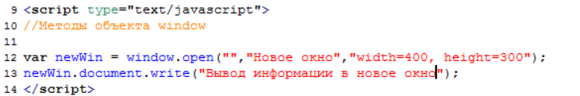

Для чего я вам это обьяснил? А для того что бы вы поняли суть этого обьекта window. т.е. по сути когда мы работаем с текущем окном мы должны писать window. Допустим мы хотим вывести информацию в текущее окно вы всегда должны были сначала писать window а потом document.write и что то выводить.
Но просто дело в том что когда мы работаем с текущим окном, то вот эту часть можно спокойно отбрасывать

это и так понятно кода мы допустим находимся в том же городе и наша друзья находятся в том же городе, мы же не говорим я вчера ходил в такой то клуб такого то города. Мы просто обычно называем клуб.
Тоже самое и здесь, если вы работаете с текущим окном вам не обязательно каждый раз писать window. Но вы просто должны иметь ввиду что он есть и он является корнем и он настолько мощный, этот обьект, что он содержит в себе другие обьекты. Потому что мы с вами знаем что document это тоже обьект и в данном случае мы видим что объект document принадлежит объекту window. 
При этом есть еще другие обьекты на подобие document, потому что мы с вами видели что document это всего лишь то что загружается в браузер и представляет собой вэб сайт. Кроме этого же у нас есть еще например браузер который так же является объектом который принадлежит объекту window и пишится он как навигатор. Там есть еще объект scrin он тоже принадлежит объекту window и содержит всю информацию об экране пользователя. Есть обьект history который содержит информацию о том как пользователь перемещался по сайту. Обьект locashion и т.д. по сути обьект window он является родителем для многих обьектов. Но он обычно отбрасывается потому что мы всегда работаем с текущим окном. А если мы работаем с каким-то другим окном как здесь мы всегда должны писать перед теми обьектами которые мы там используем ( document.write ) название того окна к которомц мы обращаемся. 
Вот такая немножко мудреная схема.
Теперь переходим к изучению нормальных методов объектов window потому что он не только является родителем для других объектов. У него как мы уже убедились есть обычные методы open/ и кроме этого у него есть еще несколько интересных методов которые мы сейчас с вами  изучим. 
И первый из этих методов это метод alert это обычное модальное окошко которое, что бы исчезло со страницы нужно нажать по нему клавишу Ок.  при этом в это модально окошко мы можем вводить информацию.

Почему оно называется модальным? Потому что пока мы с ним не разберемся мы не сможем получить доступ к другому документу. Т.е. оно блокирует все остальное и берет внимание на себя, пока мы его не закроем мы не можем получить доступ к другим объектам.
Так вот это был первый метод. При этом как я уже сказал если мы работаем с текущим окном, то можно объект window даже не писать а просто все время указывать

И оно так же у нас появится.

Следующий полезный метод который нам нужно знать это метод prompt мы его будем частенько использовать и он похож на метод alert только отличается тем что содержит в себе поле для ввода и позволяет запросить у пользователя какую-то информацию и принимает он два параметра.
1.	Это тот самый вопрос который вы хотите задать а второй сейчас посмотрим

Видите, появляется примерно такое же окошко только здесь уже иконка вопроса и есть поле для ввода. То что ввел пользователь возвращает сюда

соответственно мы можем поместить в какую-нибудь переменную.

в эту переменную будет заносится результат работы метода prompt т.е. все что введет пользователь в ответе на сообщение будет помещено в нашу переменную age. 

И сразу разберемся со вторым параметром. Он позволяет внести значение по умолчанию которое будет выводится в то самое поле для ввода информации

Вводим значение. И сейчас у нас в переменную age поместилось значение 32 и мы его можем вывести с помощью того же метода alert 

И последний метод который мы здесь затронем  confirm этот метод так же похож на alert, только кроме кнопки Ок он еще имеет кнопку Отмена.

Т.е. если мы нажимаем Ок то данный метод вернет истину true, если нажали бы Отмена он бы вернул Ложь false.  И так же мы можем поместить этот ответ в какую-нибудь переменную 

А дальше используется какое-нибудь условие, и в зависимости от ответа пользователя что-то делается
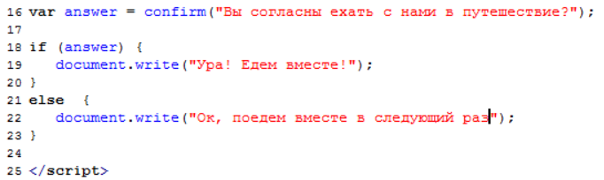

Конечно у объекта window есть много других методов но они будут затронуты нами позже.
#Функции
#Введение в функции
  Функции часто используются для создания скриптов.  При этом функции используются почти во всех языках программирования. По этому очень важно их понять и использовать уже самостоятельно, тем более что ничего сложного в них нет. И перед тем как изучать функции в JavaScript я как обычно постараюсь привести пример из реальной жизни.
На самом деле в реальной жизни мы так же часто пользуемся функциями просто там это называется по другому и мы, это, как бы не осознаем.
Представьте себе ситуацию что вы работаете в какой-то организации и у вас есть помощник. Основная задача этого помощника выполнять все ваши поручения. И вот вам однажды захотелось пиццы, но у вам много работы, сами вы ни как не можете оторваться, по этому решаете поручить данную задачу своему помощнику. Но проблема в том, что помощник никогда пиццу не покупал, не знает где ее можно купить, и какую вообще купить. Так вот вы берете лист бумаги и пишете ему инструкцию о том как нужно и где купить пиццу. Т.е. вы ему пишите выйдешь из офиса пройдешь 500 м прямо до супермаркета, там свернешь направо……  т.е. это и есть простейший пример функции в данном случае ее можно назвать пицца.
В чем здесь хитрость?? А хитрость здесь в том, что если завтра вы захотите пиццу вам уже не надо будет писать ни каких инструкций. Вы просто говорите помощнику принеси мне пиццу и в качестве параметра можете указать какую именно вам пиццу нужно с грибами или с креветками. Большую там с грибами или маленькую. Вы один раз создав какую-то инструкцию можете потом ею пользоваться уже просто вызывая ее одним словом так скажем. Нам не нужно каждый раз объяснять, что нужно пройти 500 м до супермаркета и т.д. нам достаточно сказать купи пиццу и указать параметр. С точки зрения JavaScript это выглядело бы таким образом

и в следующий раз мы получим готовый результат без всяких инструкций.
Тоже самое мы с вами будем сейчас делать и JavaScript, функции очень хорошо экономят время. Напишем простейшую функцию.
Сумма двух чисел и вывод ее на экран. Давайте напишем общий вид нашей функции, пишется таким образом **function** после указываем название функции и в круглых скобках указываем для передачи ей параметров. В качестве параметров у нас будет число 1-н и число 2-ва, **( number1, number2 ),** и в фигурных скобках мы должны прописать всякие действия которые должны выполняться. Т.е. наша задача сложить два числа которые нам передали. Т.е. что мы делаем? Мы создаем какую-нибудь переменную? к примеру назовем ее **itog** ,и заносим туда сумму этих переменных 
**number1 + number 2.** Далее выводим эту сумму на экран

Вот мы с вами создали функцию сумма. Однако это еще пол дела. Это все равно что если мы с вами написали инструкцию , и если мы с вами сейчас сохраним и посмотрим, у нас ничего  не будет ( пустой экран в браузере). Это мы просто написали инструкцию которая как бы лежит на столе перед нашим помощником, а что бы это дело выполнить мы должны вызвать саму функцию. Вызываем функцию  summa и указываем в качестве параметров эти самые два числа, т.е. теперь мы можем указывать любые числа  и он нам их сложит

И теперь в любой момент когда нам нужна сумма каких то двух чисел мы просто вызываем данную функцию, нам не нужно каждый раз писать переменные выводить на экран, мы просто указываем короткое слово summa и в скобочках передаем ей два числа которые мы хотим сложить а он уже считае и выводит на экран. 
Наглядный пример 

При этом, параметры естественно можно указывать не обязательно прям на прямую в числах. Вы можете передать сюда какие-то переменные. Допустим у вас есть там, где-нибудь какие-то переменные, количество машин и к-во мотоциклов, 
И вам нужно посчитать сумму сколько у вас всего транспортных средств. Вы спокойно можете в качестве параметров в **summa** передать эти переменные **car** и **moto**.  И он нам все посчитает.

Т.е. вы всегда должны помнить, что вместо переменных подставляется их значение т.е. перед тем как компилятор начнет выполнять функцию **summa** он вместо переменных подставит их числовые значения и только потом начнет выполнять данную функцию.

#Область видимости переменных функции 
Область видимости переменных тесно связано с функциями по этому его важно понимать. На самом деле переменные бывают глобальные и локальные.
Что такое глобальные переменные? Смотрите, когда мы создаем в нашем скрипте какую-нибудь переменную 

К примеру переменная number, то это у нас глобальная переменная которую мы можем использовать где угодно в нашем скрипте. Допустим даже в любой функции к примеру создадим функцию.

Хотя переменная создана вне функции, где то в начале скрипта, а мы ее используем внутри функции

Она все равно работает как положено. Это и есть смысл глобальных переменных. Т.е. вы ее один раз где-то создали в начале скрипта, а затем вы ее можете где угодно использовать, там в массивах, в функциях и т.д.
Что такое локальная переменная?? Теперь давайте немного вернемся назад. И создадим какую -нибудь функцию. 
И пусть будет новая переменная, в которой содержится значение 45
И опять таки выводим значение этой переменной на экран. И опять же для вывода на экран вызываем функцию.

число выводится на экран.
Но, смотрите дело вот в чем. Если выводите переменную внутри функции

то это уже называется локальная переменная и если вы попробуете вывести эту переменную за пределами вашей функции например где-нибудь после описания функции

Потому что переменная создана внутри функции, по этому, она считается локальная, и может использоваться только внутри функции. Вот это и есть понятие области видимости переменных.
Просто запомните что если вы создаете переменную с помощью ключевого слова **var** внутри какой то функции, то эта переменная будет работать только внутри этой функции.

вне этой функции она работать не будет.
А переменные, созданные вне функции, они называются глобальные и могут использоваться где угодно в том числе и внутри функции. Вот такой простейший пример. И я думаю, что вы теперь понимаете, что нельзя, например, создать какую-то переменную внутри функции и затем попробовать использовать ее вне этой функции.

#Возвращение результата функцией
Если мы посмотрим предыдущие уроки посвященные функциям то мы увидим что мы всегда старались вывести результат на экран.

Т.е. мы всегда в качестве результата старались вывести результат на экран. Мы все время в качестве результата выводили все на экран. Но при программировании часто бывает так что функция не должна выводить результат на экран, она должна его просто вернуть, и мы должны его просто получить. Допустим тот же самый квадрат числа. Допустим мы создали функцию, которая вычисляет квадрат числа, но квадрат числа нам нужен для дальнейших каких-то вычислений, а не для того что бы вывести его на экран. По этому, на этот случай функции должны уметь возвращать значения и сейчас мы посмотрим как это делается.  
Давайте вернемся к функции по созданию квадрата числа. 
function square(number) эта функция принимает число. { и в качестве действия мы создаем переменную var itog = куда помещаем результат перемножения переданного числа number*number } в итоге у нас в переменной itog находится квадрат числа. 

Но нам не нужно его выводить на экран,  нам нужно просто вернуть этот квадрат что бы его можно было занести например в какую -нибудь переменную. 
И делается это таким образом. Мы просто пишем ключевое слово 
Return,оно переводится как вернуть,  и указываем что нам нужно вернуть, в данном случае это квадрат числа который находится в переменной itog.
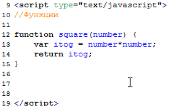
И все теперь если где то вызываем функцию, то мы можем спокойно занести ее результат в какую-то переменную и использовать дальше этот результат для своих целей. Т.е. мы создаем например какую-нибудь переменную, вызываем в ней функцию square и указываем что нам нужно узнать квадрат числа 298  и поместить его в переменную total/ а затем мы уже допустим выведем значение этой переменной через тот же метод alert 

Смотрим что вывелось в браузере

Мы видим что у нас уже в переменную alert выводится значение переменной total, которая в свою очередь получает результат из функции square (298); т.е. вот такое интересное свойство любой функции которое вы можете использовать когда вам не нужно выводить результат на экран, а когда нужно всего лишь вернуть значение которое было посчитано например внутри функции, или которое просто было получено внутри функции. Мы частенько будем пользоваться этим методом по этому что бы вы знали что это такое мы здесь этот момент затронули.

#Свойства и методы строковых объектов 

#Свойства length
 Мы с вами добрались до свойств и методов объекта string. Что это такое мы с вами разузнаем. Как вы знаете JavaScript это объектно- ориентированный язык. Здесь многое основано на объектах. 
Так вот когда мы создаем какую-нибудь переменную и помещаем в нее какой-нибудь текстовое значение 

То по сути мы с вами создаем объект строкового типа. Он называется еще string на английском.  По сути этой строчкой

мы с вами создали объект name строкового типа. Как мы знаем у объектов в JavaScript есть свои свойства и методы, и строковые объекты здесь не исключение. Мы для строковых объектов можем использовать различные свойства и методы получая информацию об этих объектах, а так же изменяя эти объекты с помощью определенных методов. 
И первым делом мы изучим простейшее с-во строкового объекта это с-во  length, оно нам известно уже по массивам, по этому вам будет очень просто понять. Как мы знаем для массивов свойство length возвращает количество элементов которое находится в массиве, а для строкового объекта оно возвращает к-во символов. Т.е. для данного случая как мы видим 4-ре символа. 

Естественно что пробел, значки и другие символы это все символы. 
И давайте попробуем проверить работу строкового объекта и выведем длину данного объекта на экран. 

как видим что он нам вывел что длинна объекта name 4-ре символа.
Вот такой простой пример работы со строковыми объектами. И одно из свойств этих объектов свойств length которое возвращает длину объекта.

#Методы toLowerCase() и toupperCase()
Эти методы позволяют вам перевести строку либо в верхний, либо в нижний регистр. Для чего это нужно?? Это может пригодится вам в тех ситуациях когда вы делаете например какой-нибудь тест. Вы задаете человеку вопрос. Например какая первая планета от солнца? И он должен ввести ответ самостоятельно, вбить его в поле для ввода. При этом, он может написать, например, меркурий с большой буквы, может написать полностью большими буквами, может полностью маленькими. А мы знаем, что с точки зрения JavaScript, например, Меркурий написанный с большой буквы и меркурий написанный с маленькой буквы это совсем разные вещи. По этому, сделаны эти методы которые позволяют вам перевести какую-то строку полностью например в верхний регистр т.е. все буквы будут большими. И соответственно вы формируете ответ так же большими буквами и получается у вас есть возможность для сравнения. Вы переводите ответ пользователя так же во все большие буквы, сравниваете со своим ответом, если они совпадают, то значит человек ответил правильно, если нет то не правильно.
И сейчас мы посмотрим, как эти методы работают.

Допустим нам нужно перевести это значение полностью в верхний регистр и вывести на экран. Как это сделать?
Создадим например еще одну переменную 

Вот он вывел нам полностью в верхнем регистре. Здесь самое главное понять что сам метод toUpperCase он не меняет значение переменной т.е. в переменной fruit так и осталось значение Апельсин этот метод просто возвращает измененное значение которое вы уже можете сохранить в другую переменную а сама исходная переменная не меняется.

Теперь что касается toLowerCase 

#Методы indexOf() и lastIndexOf()
Они предназначены для поиска в строке совпадений с каким-то образцом. Для примера давайте создадим строку в которой у нас будут такие слова

И допустим нам нужно выяснить есть ли в этой фразе, в переменной myString слово солнце. И для этих целей нам как раз таки поможет indexOf который мы можем использовать для своих целей. Т.е. мы можем спокойно написать еще одну переменную с indexOf и в качестве параметра указать что мы ищем. 

Этот метод так же возвращет результат. И что бы посмотреть этот результат давайте выведем все это дело методом document.write(); 

Вот он нам выводит 14. Что значит 14??  На самом деле он возвращает позицию с которой начинаются совпадения. Т.е. мы знаем что объект string он так же имеет свою длину, которая начинается с ноля, т.е. 

По сути он нам вернул ответ что он нашел совпадение и совпадение начинается с 14-го символа. Если б мы например искали какое-то другое слово, например Луна, то он нам ничего бы не нашел.

когда он ничего не находит он возвращает -1. ЭТО ТОЖЕ НУЖНО ПОМНИТЬ!!!
И метод lastIndexOf
Для чего нужен он? Если вы заметили indexOf он выдал нам значение 14 хотя у нас есть еще одно значение слова Солнце.

и оно уже ближе к концу. Так вот что бы искать совпадения начиная с конца нужен метод lastIndexOf 

И в этом случае мы получим уже совсем другое число. 
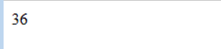
это очень простенькие методы по сравнению с тем что мы пройдем дальше. Там мы столкнемся с так называемыми регулярными выражениями где подобные совпадения искать намного проще, при этом вы можете сразу несколько слов найти в одной фразе. Можно будет сразу найти все слова солнце и поместить их в массив.

# Метод slice()
Познакомимся с уже знакомым нам методом slice знакомым по массивам. Если вы помните тот урок то мы там с помощью этого метода выбирали двух счастливчиков, двух студентов которые пойдут убираться в парк. Т.е. мы из общего массива студентов вырезали этих двух в отдельный массив. И здесь метод slice работает точно так же. Вы можете с помощью него извлечь из какой-то строковой переменной, из строки, определенное количество символов в какую-то другую переменную. И давайте попробуем рассмотреть это все дело на примере.
Допустим у нас есть переменная var mySite = которая содержит название сайта

Наша задача вывести в отдельную переменную, например, myDomen только название ruseller.com. 
Так вот нам здесь как раз таки поможет этот slice с помощью которого мы можем вырезать нужную часть строки и использовать ее по своему усмотрению. Var myDomen = и говорим что в эту переменную нужно занести часть переменной  mySite. Из которой мы, с помощью метода slice вырезаем нужное количество элементов, при этом здесь точно так же как и в массивах, если мы хотим вырезать с какого-то символа и до конца, то достаточно указать 1-н параметр. Путем подсчета от ноля нам нужно вырезать с 7-го символа и до конца.

При этом заметьте что исходная переменная ни как не меняется, просто метод slice возвращает какое-то количество символов, а саму переменную он не меняет.
Теперь что касается второго параметра. Допустим нам нужно вырезать только слово Ruseller. Как нам это сделать? Здесь нам уже пригодится второй параметр по этому мы  пишем допустим новую переменную допустим var myRoot = и туда нужно взять из переменной mySite. и с помощью метода slise вырезать конкретный кусочек указываем с 7-го по 15-й. (7,15).

#Методы charAt() и charCodeAt()
Это метод который позволяет выяснить какой символ находится в определенном месте строки и узнать kod символа, любого который находится в строке. Сейчас мы на практическом методе рассмотрим эти два метода и вы сразу поймете на сколько они полезны.
Но начнем с того например что создадим переменную например     var sity = и поместим в эту переменную “Самара”.

Допустим наша задача состоит в том, что бы узнать какой символ находится третьим в этой строке. Мы конечно видим, что это буква м, но бывает часто ситуации что мы не видим значение переменной, нам нужно просто проверить какой-то символ. И мы можем спокойно сделать это следующим образом. Мы пишем document.write(указываем что нас интересует переменная sity. И с помощью метода charAt(мы говорим что нам нужно узнать какая же буква 3-я по счету, мы знаем что у нас отсчет строковых начинается с ноля, по этому третья буква будет иметь индекс 2))

нам выводится буква м. т.е. все правильно, мы узнали какой символ находится 3-м в этой строке. Вы можете спросить для чего это нужно?
Следующий метод позволит нам узнать код этого символа. 

Потому что в JavaScript каждый символ он на самом деле еще имеет так называемый код, который так же может использоваться в некоторых случаях

Теперь мы на реальном примере рассмотрим ситуацию в которой нам нужно проверить следующее. Представьте что у вас есть сайт и на нем есть форма для ввода какой-то информации, например для ввода имени. И допустим вы поставили такое условие что имя можно вводить только русскими буквами. При этом если человек вводит имя с использованием других символов т.е. может быть пробел поставил, может быть звездочку какую-нибудь, английскую букву использовал, то в этом случае вы не принимаете этот ввод и выдаете ошибку. До форума мы с вами еще доберемся а пока предположим что пользователь уже ввел информацию и вы поместили ее в переменную name. Теперь наша задача в том что бы проверить эту переменную и вынести вердикт, правильно введено имя или нет. Допустим пользователь ввел туда имя Иван, но вместо последней буквы ввел английскую h. И нам нужно проверить соответствует ли строка нашим требованиям. Т.е. полностью из русских букв. 
Как мы будем решать эту задачу?? Здесь нам как раз таки и понадобятся те два метода о которых мы говорили в начале. Метод charAt который позволяет выяснить какой символ находится в каком месте строки. И charCodeAt который позволяет узнать код символа.
И так раз мы хотим проверить данную строку на соответствие русским буквам, нам для начало нужно узнать какие коды соответствуют русским буквам. По этому первым делом займемся следующим. Создадим переменную допустим var rusLetters = и занесем в нее наши буквы начиная от А до Я. Т.е. нас интересует “аяАЯ” все что будет располагаться между этими буквами и есть то что нам нужно, то что нас устраивает. 

И теперь в следующих строках выведем коды этих букв. 

И вот он нам сейчас должен по идее вывести

Что это нам дает? А это нам дает следующее. Мы уже можем спокойно проверять вот ту переменную

И так когда нам нужно проверить какое-то большое количество элементов, то это сразу наводит на мысль о цикле, т.е. нам нужен цикл, потому что строка у нас может быть очень длинной и проверять ее по символам это не дело. По этому мы воспользуемся циклом. В цикле проверим каждый символ указанной строки. Мы знаем что отсчет  символов в строке идет с ноля по этому счетчик у нас так и будет с ноля. Что бы проверить всю строку нам нужно написать условие что счетчик должен дойти до конца строки

так идем дальше. Следующий шаг это �� нас { действия } а какие у нас будут действия здесь нужно хорошенько подумать. Смотрите мы начинаем перебирать нашу переменную name. Сначала мы должны взять первый символ, получается у него будет индекс 0, и проверить его с помощью условия, т.е. если он у нас не попадает в указанный диапазон то мы должны вывести на экран ошибку.
Очень много текста разбирай код кароч

Далее продолжение  строки вывода

По идее если мы все правильно сделали он нам должен вывести что h не подходит.

Если мы исправляем, а потом проверяем то у нас ни каких сообщений не выходит.

#Метод search() введение в регулярные выражения
И так мы с вами добрались до очень важного метода, это метод search который позволяет работать с регулярными выражениями. 
Что такое регулярные выражения?? На самом деле это некий шаблон, и используется он в тех случаях, когда вам нужно найти в тексте не определенное какое-то значение, а просто совпадение с неким шаблоном.
Вот простейшая ситуация. У вас есть строка в которой находится какой-то текст и в этом тексте упоминается индекс, почтовый индекс, который в России состоит из 6-ти цифр. И ваша задача найти этот индекс, но если вы будете это делать простыми способами, например как мы это делали в 30-ом уроке используя метод indexOf, то нам придется написать огромное количество комбинаций index-ов, потому что они могут начинаться там он ноля (0), и заканчивая 999.999…. т.е. если вам обычными методами пришлось бы искать совпадение с индексом, то надо было писать огромное количество строк кода что бы выяснить есть ли у нас совпадение с каким-то индексом в этой строке. По этому на этот случай придуманы так называемые шаблоны, и простейший шаблон в этом случае был бы таким: искать в тексте шесть подряд идущих цифр от 0  до 9-ти. И тогда если бы он искал по этому шаблону, он бы нашел любой индекс который встретился бы у него в тексте. Это и есть такой самый простой пример регулярных выражений, и сейчас мы попробуем воспользоваться методом search и сначала поищем просто слово, а затем попробуем поискать именно используя регулярные выражения.
И так предположим у нас есть переменная 

И наша задача с помощью метода search найти в этой строке слово “мы”. Как мы в этом случае должны поступать? Т.е. мы первым делом должны создать как раз таки шаблон по которому будем производить поиск. Здесь шаблон простейший это просто слово “мы ”. создаем переменную в которой будет хранится шаблон,  пусть она будет называться **regV** т.е. как будто регулярное выражение** =** и пишем это самое регулярное выражени ставим два слеша, как будто хотим поставить коментарий, **//**  и между слэшами пишем наш шаблон. Это и будет регулярное выражение

Т.е. если компилятор встречает что-то заключенное в два таких слеша он сразу понимает что это регулярное выражение.
И теперь воспользуемся методом search для переменной test. Т.е. мы говорим что нужно в переменной test.search( search переводится как искать)найти совпадения с этим шаблоном который мы поместили в переменную (regV); естественно этот метод возвращает результат, он работает так же как indexOf т.е. если он находится в пределе с шаблоном то он вернет позицию этого совпадения по этому нам понадобится переменная result в которую мы поместим результат работы метода search. И выведем этот result на экран. 

При выводе вывелось значение 4-ре которая говорит о том что он нашел совпадение в четвертом элементе данной строки. Если посмотреть это на наглядном примере то будет это выглядеть таким образом

Вот по такому принцыпу работают эти регулярные выражения. Я пециально для начала взял простой пример там где мы не используем шаблоны, что бы вы поняли как это дело работает.
А сейчас давайте попробуем вернуться к тому примеру с индексами и попробуем поискать в строке именно совпадения уже с шаблоном.

Это индекс 45 00 00 ставим точку с запятой. И теперь нам нужно создать шаблон var regV  = и говорим что нам нужно найти шесть подряд идущих цифр от 0 до 9-ти. В регулярных выражениях все подобные вещи закодированы специальными символами и цифра от 0 до 9-ти обозначается обратный слеш и буква d  
\d, это для компилятора будет значить искать цифру он 0 до 9-ти.
Соответсвенно если нам нужно искать шесть подряд таких цифр 

Это будет для него означать искать шесть подряд идущих цифр он 0-до 9-ти.
И следующей строкой мы создаем опять таки перемеенную result = и говорим что нужно взять переменную myindex. И спомощью serch найти совпадение с шаблоном (regV). и следующей строкой выводим переменную result на экран. 

Вот такой у нас момент. Т.е. по сути сейчас компилятор у нас будет искать по шаблону и мы посмотрим найдет он или нет. И как видите он нашел, вывел 0,  а теперь если мы попробуем в переменной изменить какой нибудь  0-ль на онглийскую букву. И он нам выдает -1 что означает что совпападений не найдено. Этот пример в более наглядном виде. 

Тема сложноватая конечно, но нужно просто быть очень внимательным. 

#Метод search() продолжение
Прежде чем пойти дальше здесь стоит сказать пару слов. Во первых вы должны понимать что регулярные выражения это не что то такое что придумано именно для JavaScript и используется только в нем. Нет, регулярные выражения по сути отдельный мини язык который используется во многих языках программирования. По этим регулярным выражениям  существует много информации т.е. есть даже целые книги, и естественно в рамках курса по JavaScript мы не будем от и до проходить все эти регулярные выражения. Здесь же мы пройдем основные моменты которые помогут вам составлять не сложные регулярные выражения. 
И второй момент это шпаргалка по регулярным выражениям, т.к. вот эти коды которые формируют шаблоны их достаточно много и запоминаются они достаточно сложно. Кароче в сети вы можете найти много шпаргалок. 

На русском

Эти шпаргалки ищи в дополнительных материалах.
И давайте попробуем использовать первый элемент этой шпаргалки и посмотрим как нам можно сократить эту запись

Потому что вы наверняка подумали что она достаточно странновата, и если нам допустим надо было бы там искать совпадения с десятью числами или двадцатью, у нас строка получилась бы очень длинной.
На самом деле есть более сокращенная запись этого кода. И если мы посмотрим на шпаргалку, то здесь есть такой блок

Показывает нам значки для указания количества элементов. Т.е. мы указываем цифру от 0 до 9-ти, тот самый \d, и после него мы можем указать сколько нам нужно таких \d и вот в данном случае нас интересует вот этот элемент

Т.е. нам достаточно поставить такие {} и написать нужное количество совпадений. Что мы сейчас и сделаем. 

И при этом если мы выведем на экран, то ничего не изменится. Он нам точно так же выведет совпадения в нулевом элементе. Это простоболее сокращенный вариант.
Идем дальше. Теперь попробуем изменить нашу строку и предположим что пользователь ввел не просто индекс, а допустим написал так

он не знал что нужно вводить именно число, по этому и ввел именно такие слова. И при этом если мы посмотрим что нам в этот момент скомпилирует, мы увидим что он у нас найдет совпадение в 11-ом символе.

т.е. все правильно. Когда мы смотрели 	наглядный пример по регулярным выражениям, мы видели как компилятор первым делом ставит шаблон в самое начало строки и начинает его потихоньку двигать пока не найдет совпадения. И вот здесь он находит совпадение

Уже в самом конце, в 11-ом элементе. Но естественно нас это не страивает, нам нужно что бы в нашей строке был только индекс.
Как этого добиться? Для этого опять вернемся к шпаргалке и посмотрим

и как видите здесь самый первый якорь обозначается как начало строки. Т.е. если мы ставим этот якорь, то мы говорим компилятору что до совпадения не должно ничего быть. Если до совпадения есть какие - то символы, то такое совпадение не считается.Давайте попробуем проверить. И поставим перед \d  нашу птичку /^ которая для компилятора будет означать что совпадения обязательно должно быть началом строки. 

и видим что он нам говорит что таких совпадений у нас нет.

Потому что как мы видим что в начале строки  у нас идет Мой индекс.
Если же мы это удалим и оставим как у нас было, то он нам найдет совпадение 

Потому что оно, совпадение, начинается у нас с самого начала строки.
Теперь он у нас мог нас ввести в такую ситуацию. 

И получается здесь опять наше регулярное выражение, подходит т.е.  начинается сначала и идет 6-ть подряд цифр от 0 – до 9-ти. И наш компилятор исправно покажет что он нашел совпадение по шаблону. Но опять таки нас это не устраивает. Нам нужно зделать так что бы после шаблона так же ничего не было. И для этого есть другой якорь и он означает конец строки. 
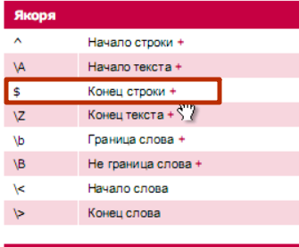
т.е. если мы хотим что бы после совпадения с шаблоном

Т.е. это скажет компилятору что обязательно должно быть начало строки /^,  затем шесть цифр он ноля до девяти \d{6}, и после них ничего не должно быть $/. Сохраняем проверяем.

мы видим что он ничего не нашел. Т.е. все правильно. Если у нас в тексте есть еще что –то кроме индекса то это нам не подходит, и мы будем возвращать пользователю ошибку. А если че мы оставляем только индекс

то будет все нормально. 

#Метод match()
Этот метод так же позволяет с помощью регулярных выражений искать совпадения в строке. Но его особенность в том что он возвращает не позицию найденного совпадения, а само совпадение. Если мы возьмем предыдущий урок где мы с вами искали индекс, то в обычной ситуации когда мы искали то браузер возвращал позицию найденного совпадения.
 
Если же мы поменяем search на match 

то  браузер нам вернет само совпадение

И это на много удобнее, потому что когда он возвращает само совпадение мы можем его сохранить куда-нибудь дальше в переменную и с ним потом работать. По этому в основном используют метод match, тем более что он позволяет искать глобально. Т.е. с помощью метода match мы можем найти сразу много совпадений если в строке встречается например 10-ть индексов. Но об этом чуть позже. Сейчас вернемся к текущему уроку.	Для работы нам понадобится вот такая строчка

Все это нужно занести в переменную peoples и наша задача будет состоять в том что бы написать регулярное выражение которое вытаскивает из этой строки Московские номера телефонов. В чем у нас особенность Московского номера, в том что код у него (495) и все, остальное все так же как и у других телефонов. В Уфинского например (347).
Теперь давайте создадим переменную для написания регулярного выражения. Наше регулярное выражение будет начинаться с цифр 8 и в круглых скобках (495). 

Но проблема здесь в том что такие круглые скобки в регулярных выражениях писать нельзя. Потому что они используются для создания так называемых подшаблонов, о них мы поговорим чуть позже, т.е. это специальные символы которые используются в самих регулярных выражениях. По этому если вы хотите искать именно круглую скобку то нам нужно перед ней поставить обратный слеш, и тоже самое перед следующей скобкой. 

Вот таким образом будет выглядеть первая часть нашего регулярного выражения, которая будет искать 8(495). Дальше судя по  номерам которые у нас здесь есть идут три подряд цифры от 0 до 9-ти. Это мы уже знаем как делать.

вот оно наше регулярное выражение которое по сути должно искать номера телефонов московского региона.
Теперь попробуем все это дело поискать через метод match. т.е. мы создаем переменную result = в которую помещаем результат и говорим что нужно взять переменную peoples. И помощью match, кстати match в английском имеет около 50-ти значений но нас интересует значение совпадать, и в круглых скобках указываем по какому шаблону нужно искать ему совпадения (regV). 

Видим что он нам нашел номер телефона который у нас идет самым первым. Но  проблема в том что в нашей строке два номера телефона которые удовлетворяют условиям и мы хотели бы вытащить оба. В этом случае нужно после описания регулярного выражения, после слеша, поставить так называемый модификатор шаблона, и в нашем случае это модификатор g. Если мы посмотрим шпаргалку, там эти модификаторы есть

и g означает глобальный поиск, что нужно искать по всей строке и сразу занести в результат все совпадения которые будут найдены.

Видим да? Теперь у нас в результате массив в котором содержаться все совпадения которые были найдены.
Вот такое просто регулярное выражение которое нам помогло закрепить наши знания и заодно мы изучили метод match.

#Ищем сайты в строке
И так у нас есть тестовая строка которая содержит несколько названий сайтов

Около 5-ти сайтов. Часть из них это сайты в зоне ru, при этом они все написаны специально по разному, где то RU большое, стоят – дефисы, есть протокол http://, https://,www так вот наша задача будет состоять в том что бы написать такое регулярное выражение которое будет извлекать из этой строки все сайты в зоне ru, причем с протоколом.
И давайте этим займемся. Там будет несколько интересных моментов которые вам надо обязательно знать. И так создаем переменную которая будет содержать наше регулярное выражение. Начнем мы с простейшего метода, т.е. пойдем по пути от простого к сложному и для начала попробуем найти все вхождения .ru в этой строке. Т.е. первым делом попробуем поискать .ru. 

Пишем .ru 

Но мы знаем что точка в регулярных выражениях обозначает любой символ по этому мы обязательно должны заэкранировать ее с помощью слеша, это скажет компилятору что мы ищем именно точку, и давайте выведем это все на экран. До этого пишем переменную result. При этом я предлагаю вывести не просто как мы раньше выводили, просто массив, а попробовать в цикле перебрать этот массив и вывести каждое совпадение на новую строку. За одно вспомним циклы.
 
создаем цикл for. Т.к. это массив счетчик у нас пойдет с ноля, говорим что условие верно пока счетчик меньше чем длинна нашего массива i < result.length. И какие действия {} ??? А действия у нас самые простые, выводим на экран текущий элемент нашего массива result [i] + “ ”. Вот таким образом мы составили регулярное выражение для поиска строки .ru смотрим что это нам дало.

вот он нам нашел. Но мы хотим что бы он нам нашел все точки ru, по этому указываем наш флаг глобального поиска 

Теперь пришло время познакомится еще с одним флагом это флаг который позволяет модифицировать шаблон и игнорировать регистр т.е. искать .ru которая написана большими символами так и маленькими, не обращать внимание на регистр. 

идем дальше. Смотрим на наше регулярное выражение и двигаемся в левую сторону. Что может быть перед нашей .ru??
Так нам нужно знать что домены содержат как минимум два символа и при этом домены могут состоять только из латнских букв знака – тире, и цифры. Эти три составляющие могут быть в составе домена. Пока не берем кирилические домены, нас интересуют обыкновенные.
И так у нас есть утверждение что перед .ru могут встречаться любые буквы английского алфавита, либо любые цифры от 0 до 9-ти, либо знак – тире. Как нам обозначить?? 
Если у вас такая ситуация, то потребуется так называемый диапазон

все что находится в квадратных скобках нас устраивает и может встречатся чколько-то раз. Сейчас наша задача написать что перед .ru может встречаться диапазон таких символов. Это все символы английского алфавита, по этому ставим [a-z], тудаже все цифры от 0 до 9-ти, можно поставить знакомую нам уже \d, а можно написать [a-z0-9-] и последним что еще может встретится знак тире. 

при этом смотрите. Если мы сохраним и посмотрим что это нам даст

мы увидим что это нам выдает по одному символу. Это потому что мы не указали сколько раз могут встречаться эти символы. Что бы указать сколько раз мы должны после квадратной скобки указать так насываемый КВАНТЕР

И как мы знаем минимум у нас должно быть два символа, а максимум не ограничено. Нас устроит {3} или больше, в нашем случае 2, т.е. пишем {2,}.

Если бы нужно было указать от 2 до 1000 то можно было бы написать {2,1000}

и вот он нам уже нашел 4-ре интересующих нас сайта, но пока он не берет в рассчет протаколы. Потому что если мы внимательно посмотрим www.mysite.ru он начинает поиск с конца, находит .ru, потом находит mysite и опять доходит до точки которая его не устраивает. В других точно так же, он доходит до слеша и опять останавливается. Т.е. наша задача теперь научить его брать так же протаколы. А протаколы у нас могут вообще не быть, могут быть www а могут быть https или http. Т.е. выбор достаточно большой. И когда у вас такая ситуация когда что-то может быть, а может и не быть, то здесь вам понадобяться так называемые подшаблоны. Т.е. мы смотрите указываем что нас интересует www\. Точку экранируем, но естественно www это не обязательный компонент названия домена, по этому мы берем его в круглые скобки () и говорим что данная комбинация может вообще не встретится, а если встретиться то один раз. И смотрим что у нас отвечает за такой подход?

Остается дело за протоколами. Но здесь вы уже наверное догадались. Там история такая что http может быть а может и не быть

И так таким образом мы обеспечили

И осталос разобраться с https:// 

ставим букву s и знак ? что скажет что буква s если и будет то один раз, если ее не будет то ничего страшного.

Вот таким образом мы с вами составили достаточно длинное регулярное выражение. Оно кажется страшным, но когда вы знаете что за что здесь отвечает, то оно кажется достаточно простым. Естественно это не универсальное регулярное выражение я его придумал к этому уроку что бы вы поняли что такое регистр, независимость, подшаблоны, что такое диапазон символов, потому что это будет использоваться в домашнем задании, что такое квантеры и когда нужно допустим от и до вхождений, ну и что такое естественно знак вопроса который позволяет либо входить либо не входить элементу в наш шаблон. И допустим смотрите если у вас есть задача искать еще и сайты с поддоменами. Потому что бывает и тогда в наш диапазон придется добавить еще точку. 

#Метод replace() 
Остался у нас еще один метод из этой серии это метод replace который у же может не просто находить что-то, но он уже умеет заменять. Это тоже часто используется. Здесь мы посмотрим на примере как это делается. И так у нас есть допустим какая-то строка которая содержит название сайтов где вместо точек проставлены запятые. 

в данном случае здесь три сайта. Но представте что у вас их миллион и в ручную их менять было бы очень проблематично, т.е. к каждую запятую нужно менять на точку. Так вот а с помощью методе replace мы можем составить регулярное выражение по поиску этой запятой и указать ему второй параметр, который скажет на что нужно поменять эту запятую.
Как это происходит. Сначала как обычно создаем регулярное выражение. Само регулярное выражение будет состоять все го лишь из запятой

И дальше мы говорим что нас интересует переменная myString. И метод replace с помощью которого мы хотим поменять что-то на что-то. Мы будем менять то что он найдет в соответствии с этим шаблоном (regV). В данном случае он найдет все запятые, при этом нам обязательно нужно поставить глобальный поиск g что бы он нашел все запятые
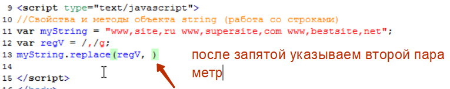
Вторым параметром мы передаем что он должен менять найденные совпадения. В данном случае мы говорим что он должен менять на ‘.’ Точку. 

Вот и все. Выводим эту строку и смотрим поменял он или нет. 

Как видим он нам ничего не поменял. А почему так произошло?? На самом деле ни какой ошибки у нас нет, все написано правильно. Просто смотрите в чем дело. Этот метод не изменяет исходную строку т.е. у нас как был myString состоящий из этих строк
так мы его и вывели.
Метод replace он что делает?? Он берет указанную здесь строку

Находит в ней запятые, ставит точки и возвращает уже эту измененную строку. Т.е. мы что бы посмотреть на результат работы метода replace должны дыли создать еще одну переменную и поместить результат работы этого метода

это зделано было спациально что бы вы поняли что метод replace он основную строку не трогает, он просто ее берет делает с ней какие-то манипуляции замены и возвращает результат, а сама строка остается не изменной 

Видим что метод replace нашел все запятые и поменял их на точки и поместил в переменную result. Вот таким образом работает этот метод.

#Готовые регулярные выражения и сервисы
 В рамках данного курса не реально полностью осветить все моменты связанные с этой темой, да это честно говоря и не нужно, потому что простые регулярные выражения вы уже составить сможете, а сложные могут понадобится вам в очень редких случаях. Да если и понадобятся, вам будет достаточно изучить дополнительные какие-то флаги которые мы с вами не затронули, и основываясь на тех знаниях которые у вас уже есть вы спокойно сможете составить и другие регулярные выражения. Тем более что в этом уроке мы поговорим с вами о таких инструментах полезных которые призваны именно для помощи тем кто не хочет сам писать регулярные выражения, либо хочет, но хочет делать это более комфортно.
Первый инструмент это сайт

здесь есть раздел посвященный регулярным выражениям. Для чего этот сайт?? Когда у вас есть какой-то текст вы можете спокойно протестировать ваше регулярное выражение. 

вы можете прям на ходу писать ваше регулярное выражение и проверять что у вас отберется в итоговый массив. Кароче разбирайся как здесь можно работать на ходу с регулярными выражениями. 
Здесь есть вкладка community на которой собраны регулярные выражения от учатников данного сайта. 

Но здесь они не так удобно представлены как на другом сайте

библиотека этих самых регулярных выражений. И здесь собрано просто огромное количество этих регулярных выражений. 

#Функции и методы числовых объектов

#Функция isNaN()
Переходим к числовым объектам. При этом здесь нужно сделать не большую оговорку. Объекты типа number 

Если у строковых объектов есть много своих методов, с которыми мы с вами уже знакомились, то у объекта числового типа у него тоже есть свои методы, но они такие экзотические, очень редко-редко используемые. По этому для работы с числами в основном используются встроенные в JavaScript функции которые помогают работать с числами, и здесь мы с вами потихоньку начнем знакомится.
И первая из таких функций isNaN которая позволяет проверить что находится в переменной, число или не число. Эта функция часто используется в условных выражениях в if else в основном и сейчас мы с вами проверим ее на практике и попробуем с той же переменной fruit поэкспериментировать. 
Мы допустим создадим условие в котором проверим что содержится в переменной fruit если не число то выведем информацию что там не число, если же число то выведем его на экран. Запомните если в переменной не число то она вернет истину по тому что в переводе isNaN это не число. 

Вот таким образом работает данная функция

Вот такая интересная встроенная в JavaScript функция. И так же запомните что это встроенная функция. Таких не много.

#Функции parseInt(), parseFloat() и Number() 
И так в этом уроке мы с вами поговорим еще о нескольких функциях которые встроены в JavaScript которые могут вам пригодится при работе с числами первая из этих функций это функция parseInt() которая пытается преобразовать тот параметр который вы ей передадите в число. При этом данная функция может работать в разных системах счисления, но мы не будем углубляться далеко и остановимся на обычном использовании на десятичной системе счисления которая у нас используется. И давайте приведем пример. Допустим у нас есть какая то переменная и мы опять таки по ошибке занесли в нее число

либо мы просто получили это значение из какой – нибудь функции но так же она оказалась в текстовом варианте. Так вот с помощью этой функции мы можем преобразовать данное значение в число. 

т.е. теперь у нас в newcount должно быть числом. Как мы можем это проверить??? Мы можем попробовать взять еще одну переменную и присвоить ей числовое значение, и попробовать сложить переменные. 

и видим что он нам выводит. Т.е. он взял строку “36” затем взял строку переменную test = “65” и соединил эти две строки. Потому что компилятор в случае когда мы пытаемся сложить строку с числом то он преобразует это число в строку сначала. Если же мы попробуем сложить переменную newcount которая обработана методом parseInt 

то он нам уже нормально все сложит

При этом чем еще полезна эта функция?? А тем что она еще может преобразовывать текст в число даже если в тексте есть еще что то кроме числа. 

но здесь нужно иметь ввиду что строка должна начинаться с числа. Потому что если мы напишем числовое значение в конце то он выдаст значение nan т.е. это не число. 
 При этом эта функция может быть полезна когда нам нужно получить целое основание. 
 
 
 следующая функция parseFloat она позволяет уже преобразовывать уже не только целые но и десятичные 
  
   
  Последняя функция Number она очень похожа на функцию parseInt и позволяет преобразовывать любой переданный ей объект в число. Как это работает??  
  Вывелось
  
   Т.е. он преобразовал истину в единицу. Если бы было false он бы вывел ноль.
При этом если ему передать число в строке

И вернет результат. Но уже не вернет если после написать какие то слова. 

#Метод toFixed()
В этом уроке мы с вами пройдем метод для работы с числовыми типами т.е. именно метод. Если в предыдущем уроке ми прошли функции которые уже встроены в JavaScript и позволяют преобразовать там например строку в число, то здесь именно метод который предназначен для работы с числовыми объектами. Метод очень простой, но иногда может пригодится.
Смотрите в чем проблема. Когда мы допустим создаем переменную prise и присваиваем ей значение 10р 30к. и пытаемся вывести ее на экран то посмотрите что получается. 

Мы видим что наш javascript отбрасывает последний ноль и выводит 10.3 
Но как вы знаете цены в таком формате обычно не пишутся. Всегда указывается две цифры после запятой. Вот на этот случай как раз и сделан метод toFixed который позволяет нам зафиксировать количество цифр после запятой которое нам нужно. Т.е. если бы мы написали так

и в скобках обязательно указали что нам нужно выводить две цифры, то мы получили бы нужный нам результат.

Вот такой простой метод. Вы его просто должны помнить. Если вдруг вам когда - то придется работать с ценами. А если вы столкнетесь с интернет магазином, например, то там обязательно придется с этим работать, то метод toFixed вам здесь очень хорошо поможет. При этом запомните что это именно метод и он вызывается именно через точку. 

У нас объект числового типа это price и через точку вы вызываете этот метод. Напомню, что функции, которые мы использовали в прошлом уроке, они вызывались по - другому. Там писалась функция, а в качестве параметра ей уже передавалась переменная.

#Объект Math и его методы round(), ceil(), floor()
Пришло время изучить еще один компонент который так же помогает работать и числами это объект Math это встроенный в JavaScript объект и он позволяет работать с числами.
Если приводить аналогию с тем уроком про могущественного мэра, где мы были управляющими города, то здесь можно сказать так что. Представьте что в этом городе есть некий вычислительный центр, какой то математический институт, куда все жители этого городи идут и когда им нужно посчитать там косинус, синус или что то такое, или округлить какое то число, они идут туда и говорят.
- ребята нам нужно сделать то – то..  вот вам исходные данные, пожалуйста верните нам результат.
В этом математическом центре происходят все вычисления. Вам возвращают готовый результат. 
Тоже самое и объект Math, он уже встроен в JavaScript и когда вам нужно там округлить число, или вычислить синус, там очень много у него возможностей, вы можете всегда обратиться к этому объекту и он вам вернет результат.
Как это примерно работает?? Давайте попробуем изучить округление. 
Предположим у вас есть какой то скрипт который вычисляет продолжительность жизни человека в зависимости от всяких параметров которые он введет. Допустим у вас на выходе, после всех подсчетов, получилось что возраст этого человека

Но естественно что возраст в таких значениях выводить не принято. Возраст принято выводит в годах. В данном случае понятно что нужно выводить 81. И здесь как раз токи что бы округлить данное значение, нам на помощь придет объект Math с его методом round. Т.е. как это работает? Допустим вы хотите изменить значение 80.93 и занести в переменную age значение 81. Мы пишем что в переменную age = вызываем объект Math и говорим что мы хотим воспользоваться его методом round  и в круглые скобки передаем значение которое хотим округлить в нашем случае это эта же переменная age

Вывелось

Есть еще методы которые округляют конкретно в какую – то сторону. Допустим у нас есть ситуация когда нам нужно обязательно округлять только в верхнюю сторону. Метод ceil с английского переводится как потолок. Т.е. запомните когда нам нужно округлить обязательно в нужную сторону  то нам нужно вызывать этот метод.

Если же нужно обязательно округлить в меньшую сторону т.е. не важно сколько после запятой 01 или 999. Метод floor в переводе пол.

Math это сокращение кстати от слова математика. По этому всегда помните если вам нужно произвести какие то операции на подобие скругления или генерации случайных чисел, то это вам всегда нужно обращаться к объекту Math и его методам которые как раз таки этим и занимаются. 

#Объект Match и его метод random()
Это метод генерации случайного числа. Частенько бывает такое что в процессе работы скрипта вам нужно получить какое то случайное число. Создаем переменную и помещаем туда это случайное число.
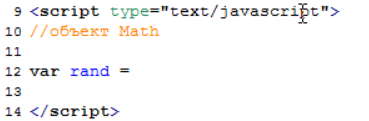
И занесем в нее случайное число которое будет сгенерировано с помощью метода random.

При выводе

Вот как видите что он нам вывел. Проблема этого метода в чем?? Он генерирует случайное число в диапазоне он ноля до единицы.
Так вот, как же нам получить случайное число, например, от 0 до 100?? Это делается очень просто. Достаточно умножить выражение на 100.

но при этом как вы видите у нас после точки еще идут много цифр. Обычно так не используется в генераторе случайных чисел. 
мы с вами уже умеем округлять. По этому мы можем воспользоватся для округления методом round того же объекта Math т.е. он будет у нас в зависимости он того на сколько ушли десятые, сотые и тысячные. Если десятые больше 5-ти десятых он округлит в большую сторону, если меньше то в меньшую. 
Все что писали ранее берем в круглые скобки и передаем в качестве параметра тому же объекту Math, только другому его методу это методу round который округляет у нас разные числа. 

Т.е. компилятор всегда действует так. Он сначала  то что в скобках, он сгенерирует случайное число умножит его на 100

Получит случайное число и затем методом round округлит это число до целого.

При этом иногда бывают такие ситуации что нужно генерировать числа не от ноля до ста, а например от 50-ти до 60-ти. В этом случае вам придется повозится. Прописать определенные конструкции. Но изобретать велосипед мы не будем. На самом деле, многие JavaScript программисты уже давно поняли что в JavaScript не хватает функции, которая принимала бы два параметра, допустим 50 и 60 и генерировала случайное число в этом диапазоне. И в сети можно найти много реализаций таких функций которые уже готовы приема этих параметров и генерации случайного числа. Одно из них в доп мат.

И здесь в чем фишка?? Когда вам нужно сгенерировать случайное число в определенном диапазоне вы просто создаете переменную в которую вы хотите занести результат и вызываете эту функцию myRendom, а в качестве параметров передаете ей от скольки и до скольки вам нужно генерировать число.

#Введение в объект Date()
В этом уроке мы с вами познакомимся с еще одним встроенным в JavaScript объектом. Мы с вами уже познакомились уже с одним подобным объектом Math который предназначен для различных математических вычислений и его я сравнивал со зданием, где сидят разные математики, куда вы можете принести свою задачу, округлить там какое - то число или сгенерировать случайные числа, и они вам выдадут результат.
Тоже самое объект Date можно сравнить с каким – то зданием где сидят люди, которые отвечают за работу с датами. Т.е. все что касается с датами это к ним. Но единственное его отличие от объекта Math что он работает немного по другому. В Math мы писали, допустим что нам нужно было округлить какое то число мы сразу писали Math. Его метод round например и в скобках указывали какое число нужно округлить.

То объект Date, с ним как бы так на прямую работать нельзя. И для начала нужно создать переменную в которую поместить как бы экземпляр этого объекта. Т.е. создать переменную по сути с типом этого объекта Date. 
Делается это очень просто. Вы создаете переменную var fortime = и говорите что туда помещаем объект типа Date. New Date()

Теперь через переменную fortime мы можем получить доступ ко всем методам данного объекта.
Давайте изучим первый метод с помощью которого мы можем узнать текущий год.
Например создадим отдельную переменную для хранения года year = и скажем что бы получить текущий год  мы обращаемся к нашему объекту fortime. И говорим что нас интересует метод getFullYear() этот метод вернет текущий год.

Вот он нам вывел текущий год.

Следующий метод это метод который позволяет узнать текущий месяц. Нас интересует метод getMonth() данный метод вернет нам порядковый номер месяца, не его именно название, а порядковый номер при чем номера как вы знаете в JavaScript начинаются с ноля.

и вот он нам говорит что сейчас седьмой месяц, хотя сейчас на самом деле август, т.е. по сути по нашим подсчетам 8-й, но если мы учитываем что январь для него это 0-й месяц то он показывает все правильно. По этому если вы хотите узнать текущий месяц с точки зрения наших подсчетов, то мы можем прибавить +1.

И следующий метод который мы изучим это метод который возвращает сегодняшнее число. Нас интересует метод getDate. Именно Date а не Day, Day мы пройдем чуть по позже.

И вот он нам говорит что сегодня 25. Числа у него как положено идут с единицы по этому здесь все правильно указано.

И так. Следующее что мы хотим узнать это тот самый getDay это уже день недели.

Он так же нам вернет численное значение, 0-ль для него это Воскресенье, 1-ца понедельник. Почему то отсчет идет с Воскресенья

он говорит что все правильно.
Следующий метод который нам пригодится это какой сейчас час. Это метод getHours() 

Следующий как вы могли догадаться это минуты и секунды.
Минуты метод getMinutes, для получения секунд метод getSeconds.

Это нам дает полную текущую картину даты. 

Но имейте в виду что это дата которая установлена на компьютере пользователя.т.е. это не дата которая на сервере.

#Практический пример по объекту Date()
Сейчас для дальнейшей работы нам понадобится переменная которая так же содержит объект Date 

И начнем мы с того что изучим еще один метод это метод getTime. Давайте выведем на экран результат работы этого метода. 

И вот мы с вами получаем каое то абстрактное число. На самом деле это число милисекунд которое прошли с момента первого января 1970-го года. В JavaScript дата хранится именно в этом формате, т.е. любая дата представляет к-во милисекунд прошедшей от этой даты. Эта дата фигурирует во многих языках программирования. Она была взята за отсчет программистами которые создавали на тот момент первую версию ОС Unix которая сейчас используется на многих серверах, и было принято решение дату считать именно в формате милисекунд от этой даты. И все что мы с вами видим. 
В предыдущем уроке мы с вами выводили ме��одами

На самом деле JavaScript он уже преобразует это к-во милисекунд и выводит нам готовый результат. Но на  самом деле он хранит все в этих самых милисекундах. 
А для чего они нужны вы можете спросить?? А нужны они вот для чего. С помощью них мы сможем работать с датами не сегодняшнего дня. Т.е. смотрите, например, мы можем посчитать сколько дней прошло как раз с первого января 1970-го? 
Как нам это сделать?
Мы знаем что в одной секунде содержится тысяча(1000) милисекунд. Т.е. первым делом мы можем узнать сколько секунд прошло.
Создаем переменную var from1970 = и говорим что хотим узнать сколько секунд прошло с того момента? Берем переменную naw. говорим  что нам нужно воспользоватся методом getTime который вернет нам количество милисекунд, и разделить это к-во на 1000. 

вот он нам уже выводит какое то другое число. Это к-во секунд. Но все равно очень и очень много по этому мы идем дальше.
Мы хотим узнать, а сколько же минут прошло. Мы знаем что в одной минуте 60-т секунд, по этому мы можем разделить полученное число еще на 60-т  и получим с вами результат. Почему то он заключает все в скобки и 1000 *60.

Таким образом мы получим количество минут которое прошло с момента 1-го января 1970.
Вот выдает к-во мин.
Теперь если мы хотим узнать к-во часов мы можем еще раз умножить на 60.

Скоько прошло дней? Мы знаем что в одном дне 24-ч по этому если мы умножим

Давайте избавимся от этих значений после запятой. 

Так к чему мы это все сделали?? Мы это сделали потому что мы можем узнать количество дней прошедших от 1-го января 1970. Что это нам дает? А дает это нам следующее. На самом деле мы можем создавать дату не только для сегодняшнего дня, как мы делали в предыдущем уроке и в этом.

Если же нам нужно создать объект Date для какого – то другого дня, то мы можем указать этот день в качестве параметра, и нам будет создан объект Date уже для того дня. И соответственно мы так же можем посчитать количество дней прошло от первого января 1970 года до того дня, и вычислить какую – то полезную для нас информацию. Например если мы хотим знать сколько осталось дней до нового года то мы можем поступить таким образом. Создаем новую переменную var ny = и создать объект new Date для первого дня нового года. Для этого в качестве параметров достаточно указать данные в скобках, сначала указываем год, затем указываем месяц не забываем что январь нолевой месяц, потом число, далее часы, далее минуты, и секунды, можно еще указать и мили секунды.

И мы таким же образом можем посчитать к-во дней которое пройдет до этого дня.

И таким образом в from1970ToNy будет помещено к-во дней которое пройдет от 1970 до 2011. И соответственно если мы хотим узнать сколько же дней от сегодняшнего дня до нового года нам достаточно посчитать разницу.

получается здесь у нас хранится к-во дней с 1970 до наших дней, а вот здесь

У нас хранится к-во дней до нового года.
Вычитаем из одной переменной другую. Т.е. к-во дней данного года минус количество дней до текущего момента. 

продолжение

вот что он нам вывел.

Вот таким образом мы с вами научились создавать объект типа Date не для сегодняшней даты, а для любой другой. При этом мы здесь же можем кстати узнать какой это будет день недели. Мы можем из домашнего задания взять тот самый массивчик который у нас хранит дни недели

И остался один не большой момент который вам так же нужноо знать. Это как создать объект типа Date указав к-во милисекунд прошедших с первого января 1970, потому что если мы посмотрим

Мы создали объект не сегодняшней даты указав, год, месяц, число и т.д. 
Можно еще создавать объект типа Date для не сегодняшней даты именно просто с помощью указания просто к-ва милисекунд 

#Функции setTimeout(), setInterval(), clerInterval()
В этом уроке мы с вами изучим еще три метода объекта window которые могут пригодится вам в работе. Эти методы предназначены для отсроченного выполнения какого - то кода. Потому что не всегда бывает полезно выполнять код сразу же, а именно нужно бывает выполнить с какой – то задержкой.
SetTimout () он предназначен для однократного выполнения какого то кода, через какое – то количество времени. Т.е. у нас есть какой то код, этот код мы должны передать в первом параметре

И количество времени которое должно пройти до выполнение этого кода, вторым параметром. Количество времени указывается в милисекундах

Да. Через три секунды выдает такое сообщение

При этом код можно передавать не на прямую, а создать какую – нибудь функцию, и только название этой функции передавать. Простейший. Напишем простейшую функцию, у нее не будет параметров, а в качестве действия она будет выводить тот же Alert 
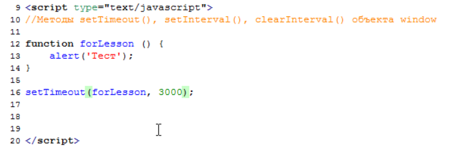
Точно так же через три секунды выводит alert 

Это был метод setTimeout, он именно для однократного выполнения какого – то кода. 
Но бывают ситуации когда нужно повторять выполнения кода через определенное время. Прошло три секунды выдали alert, прошло еще три секунды выдали alert, и так до бесконечности.
Для этого уже используется метод setInterval

Окно появляется через три секунды, после закрытия опять появляется через три секунды. И так выполнять будет до бесконечности.
Что бы его остановить есть еще один метод это clearInterval 
Т.е. он очищает этот интервал и не позволяет этому продолжаться все время. Что бы воспользоваться этим методом достаточно сохранить в какую – нибудь переменную id этого интервала которого мы запускаем

Когда он начинает выполняться он возвращает индификатор этого интервала и этот индификатор мы помещаем в эту переменную idInt , и затем в нужном месте программы, где нам это нужно , мы можем сделать так например при нажатии на кнопки этот интервал был остановлен ( изучим далее).
Мы посто вызываем метод cleatInterval и указываем ему этот самый индификатор который у нас был сохранен ( idInt  ); этот метод прекратит выполнение данного интервала и у нас его исполнение прекратиться

#функция typeOf()
Эта функция тоже встроена в JavaScript которая позволяет узнать тип того параметра который вы ей передадите.
Я специально создал несколько тестовых переменных.

И давайте посмотрим как это работает

Хотя на самом деле было бы логичнее показать что это массив. Но так уж устроен JavaScript.

Здесь при выводе на экран object он ответит правильно.

#Условный оператор case ()
Познакомимся иеще с одной условной конструкцией  на подобие if else но только эта конструкция применяется гораздо реже и в основном в тех случаях когда есть очень много условий. Вот разберем пример

Допустим у нас есть ситуация когда человеку нужно выбрать какую – то дверь. Т.е. это какая – то викторина к примеру и в зависимости от выбранной двери мы должны ему сообщить что он выйграл. Там утюг, магнитофон…. Пять дверей, и он должен выбрать число от одного до пяти, и в зависимости  от того что он выбрал мы ему выдаем ответ. Основываясь на тех знаниях которые у нас есть, если бы мы использовали оператор if  то у нас получилось бы так как на картинке выше.
Так вот для таких случаев, когда много else if, есть еще один условный оператор который чуть – чуть по проще записывается и конструкция можно немножко уменьшить за счет этого. 
Называется он switch () { case}, в круглые скобки вы должны передать переменную которую будете проверять. В нашем случае это переменна (dver), а в фигурных скобках {} в каких случаях что делать т.е. если переменная dver будет равна единицы то мы долны делать следующее

  Ставим двоеточие и пишем что нужно делать. В нашем случае что мы выиграли авто. И при этом после кода нужно указать ключевое слово break;

Дальше уже пишем вариант когда человек выбрал двойку.

В конце пишем ключевое слово default  оно предназначено на тот случай когда ни один из case у нас не пройдет т.е. если переменная dver будет не равна не 1,2,3,4,5, то мы можем написать что в этом случае делать. Этот код писать не обязательно, но если вам нужно что – то делать когда переменная не равна не одному из случаев то его можно написать.

Не сказать что бы на много стало проще, но как бы все равно по аккуратней стало. Если посмотреть  на действия нашего компилятора, то когда он доходит до конструкции switch case он что делает? Он смотрит на переменную dver, подставляет ее значение, например 3-ку, и затем ищет case 3, если он его находит то он выполняет код. И выполняет оператор break который говорит что нужно выходить из цикла.

Проверка

Скорее всего что в нашей переменной обрабатывается не число, а строка попробуем обработать нашу переменную функцию Number 

Проверка
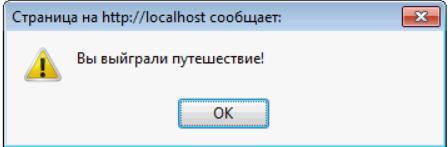
На самом деле когда такие ситуации бывают. Если вы видите неожиданный результат то внимательно посмотрите на тип переменной, потому что когда мы запрашиваем у пользователя методом prompt какую – то информацию то она возвращается именно в строковом варианте. По этому у нас здесь и вышло что мы ввели не верное число потому что для него это была строка.
А когда мы обработали строку через функцию Number 

#Тернарный оператор
В разных источниках по JavaScript вы можете натолкнуться на запись подобного вида

Мы с таким еще не сталкивались. Идет переменная result  дальше какие то скобки, какое – то условие ( apple == orenge ), знак вопроса, текст и еще какой – то текст. 
Т.е. как это можно понять? На самом деле это сокращение для условия if else 
Сейчас я запишу то же самое что было бы при записи if else  и вы сразу все поймете.

Т.е. это сокращенная запись для конструкции if else. Применяется в том случае когда по результатам сравнения нужно присвоить значение  какой – то одной переменной. В нашем случае если истина true, то мы присваиваем значение переменной result = одинаково, если ложь false то тоже значение переменной result только другое = разное к-во.
Так вот если у вас такая ситуация то можно использовать этот самый тернарный оператор  

Для более сокращенной записи

#Создание собственного объекта
Помните когда мы с  вами были в роли могущественного мэра мы могли узнать информацию о любом объекте и изменять эти объекты с помощью методов которые им присущи. Так вот мы на самом деле на столько могущественны что мы можем создавать свои собственные объекты. 
И давайте приведем пример допустим мы создаем объект car, новую машину, и говорим что он у нас новый объект, пишется таким образом, new Object (),

и такая запись создает у нас новый объект car который у нас будет доступен в программе и более того мы можем этому объекту кар присваивать всякие с-ва. Например мы можем указать цвет этой машины, максимальная скорость, производитель

вот таким образом мы с вами создали объект и дали ему три с-ва.

Если нам где – то понадобится использовать данный объект, мы спокойно его сможем использовать и пользоваться его с-вами. Например попробуем вывести документ, какой у нас цвет у машины

Вот что нам выводит.

Т.е. все просто, мы с вами создали объект, добавили к нему всяких свойств и теперь можем пользоваться этими свойствами. Это был первый метод создания объекта. Есть еще один т.е. равносильный.
Я советую обратить внимание на второй метод потому что при работе с jquery в будущем, там используется очень похожий вариант и по этому лучше привыкать сразу к нему.
Смотрите, допустим у нас есть задача создать еще один объект, например moto = и говорим что хотим создать объект просто ставим вот такие {} фигурные скобки. Это скажет нашему компилятору что это объект. При этом мы сразу здесь можем указать все с-ва данного объекта. Например цвет, пишем color, здесь уже не надо писать moto.color. пишем color ставим : и пишем цвет. Что бы написать следующее с-во ставим запятую, и пишем следующее с-во.

вот таким образом мы с вами создали два объекта. Один car и указали его с-ва. Второй создали немного другим способом, через фигурные скобки. и попробуем сейчас воспользоваться каким – нибудь свойством для объекта moto

#Создание методов для собственного объекта
Перед тем как добавлять методы здесь стоит упомянуть вот какой момент. Помните мы для вывода использовали вот такую конструкцию 

Мы писали объект и указывали его с-во. И он нам все прекрасно выводил. Но проблема в том что допустим мы хотим передать ему  название свойств через какую – нибудь переменную
Вот допустим мы в какой то переменной храним текст “color” 

и таким образом хотим вывести название этого с-ва через переменную, то у нас ничего не получится

потому что он у нас будет искать значение с-ва test 
выводит

и такого с-ва естественно нет. Он выведет нам не определено.

Так как быть в этих случаях? В этих случаях с-во нужно писать уже не через точку, а через квадратные скобки.

вот он вывел.
Так что вот это имейте ввиду, что когда вам нужно достучаться к с-ву через переменную, храня его название в какой – то переменной, то нужно использовать квадратные скобки.

И теперь что касается добавления методов к объекту. Для этих целей давайте создадим другой объект. Это у нас будет другой объект который отвечает за информацию по летним турам предположим. Мы пишем скрипт для какого – нибудь турестического агенства, то и в одном объекте решили хранить все цены по каким –то направлениям, и + в этот объект повесим метод который будет делать нам расчет всяких туров.
 Т.е. мы говорим, что создаем объект summerTur = {} и сразу пропишем его с-ва этого объекта.

вот таким образом мы с вами создали три объекта, и каждый из них хранит цену проживания за сутки.

Теперь попробуем создать метод который будет у нас рассчитывать различную информацию по этим турам. Например стоимость.
Как создаются методы? Вы просто пишете название вашего объекта, ставите точку и придумываете название своему методу, пусть это будет calс рассчет, калькуляция.

Вот мы говорим что хотим добавить к нашему объекту такой метод, а раз метод это всегда какие то действия, а раз действия это функция. По этому пишем function, здесь уже имя давать не надо, это так называемая анонимная функция, по сути мы дали название этой функции уже здесь

когда придумывали метод.
И после function просто указываем нужны ли параметры (), в нашем случае будем писать метод который принимает три параметра, это к-во людей которые едут отдыхать, сколько дней они хотят отдыхать, и в какую страну.

вот эти три параметра который будет принимать наш метод. Дальше пишем что будет делать этот метод. 
Он будет подсчитывать сколько стоит пребывать в этой стране, стольким людям, столько то дней. И возвращать результат.
Т.е. создаем переменную result = и говорим что результат это у нас умножение количества людей на ко-во дней и на сумму проживания в этой стране за одного человека за сутки, т.е. мы должны здесь указать ту страну которую нам передадут

Так вот нам нужно получить доступ к нашему объекту и его свойству turkey. Мы конечно можем написать

Но т.к. название страны у нас хранится в переменной, то здесь нужно указывать через квадратные скобки. [coutry]

И он найдет объект summerTour возьмет его с-во turkey и подставит 2000р.
Это мы создали вот таким вариантом да.
Но есть еще один такой ключевой момент, который вы так же должны знать, это так называемое слово this. Т.к. мы работаем по сути с одним и тем же объектом т.е. мы пишем метод для объекта summerTour 

То мы можем не писать название этого объекта, мы можем просто написать

Т.е. тот же самый объект, с которым мы и работаем. По этому мы можем писать и так и так. Но если мы где то встретим слово this, знайте что оно означает тот же самый объект который по сути и вызвал данный метод

Вот мы по сути и написали метод, единственное что он нам по сути должен вернуть этот результат. По этому добавим ключевое слово return result ( т.е. вернуть нам переменную результат).

И теперь допустим если к нам пришли в салон какие – то люди и говорят.
-посчитайте нам сколько будет съездить на двоих, на 10-ть дней в турцию.
Мы вызываем наш калькулятор, и в качестве параметров передаем туда пожелание клиента

Выводим на экран

Если вам это интересно вы в интернете всегда сможете найти и более детальную работу с объектами. Там есть еще несколько всяких с-йств более сложного характера. Но для общего понимания этого достаточно.

#Вывод на экран всех свойств объекта и их значений
Иногда это бывает очень полезно посмотреть в каких свойствах что находится в данный момент. По этому вам возможно это где то пригодится. Начнем с простого с объекта summerTour который мы уже использовали.

Что бы вывести все его свойства на экран, нам нужно воспользоваться специальной конструкцией цикла for, и выглядит она таким образом.
Сначала создаем какую- нибудь переменную, например option = и затем пишем. For и в качестве условий() говорим что нам в переменной option нужно занести все свойства конкретного объекта, для этого нужно поставить ключевое слово in   и указать интересующий нас объект

Таким образом у нас при каждом проходе цикла будет заносится новое свойство т.е. при первом проходе в переменную option занесется 1-е свойство, и соответственно мы можем его сразу здесь вывести т.е. мы здесь говорим что нам нужно здесь вывести название свойства, переменная option и + вывести сразу его значение, двоеточие или равно 

Мы знаем что бы вывести свойства объекта нам нужно сначала указать этот объект, а затем  через точку указать его свойства. Но в данном случае у нас название свойства находится в переменной, по этому нужно вводить в квадратных скобках.

Вот такая конструкция выведет нам на экран все свойства объекта.

вот таким образом он вывел все свойства нашего объекта и сразу указал их значение. Таким образом вы можете вывести свойства любого объекта.
Наш любимый объект  document, у него просто огромное количество свойств.

И если вас интиресуют все эти свойства. Вы можете зайти на сайт

Если хотите углубленно изучать JavaScript можете почитать, здесь есть некоторые интересные свойства объекта. Вот таким образом вы можете посмотреть свойства любого объекта который вас интересует. 

#Объекты navigator, screen, location и их свойства 
Объекты navigator представляют собой свойства браузера и не только, объект screen который несет в себе информацию о экране пользователя и объект location который несет информацию о адресе страницы которая сейчас загружена.
И для изучения свойств этих объектов я решил написать не большую функцию которая бы выводила нам следующую информацию

И так начнем мы с объекта navigator, это самый такой интересный объект у которого много интересных свойств. И я предлагаю первым делом вывести на экран все его свойства. Для этого из предыдущего урока возьмем конструкцию Которая позволяет вывести все свойства объекта на экран.

Вот у нас все свойства данного объекта и здесь так же много интересных свойств. Самые основные это userAgent где хранится полное название браузера. оscpu здесь хранится какая у пользователя операционная система. Online : true хранится информация о том подключен ли пользователь к интернету в данный момент. CookieEnebled : true включены ли у него куки.
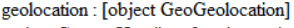
есть интересная функция которая доступна в html5 которая позволяет узнать место положения пользователя.
 язык который установлен на данный момент. Т.е. вы с помощью объекта навигатор можете многое узнать о пользователе который зашел на вашу страницу.
И давайте начнем реализацию нашей функции, первым делом нам нужно вывести название браузера.

Так идем дальше. Следующий момент который нам нужно вывести это язык браузера. Потом название операционной системы. Дальше включены ли куки. Следующее нам нужно узнать подключен ли пользователь к интернету

Следующая наша задача вывести разрешение экрана. За это уже отвечает объект screen. Так же можно посмотреть все его свойства 

Здесь их не так много  и нас интересует разрешение пользователя экрана по высоте, по ширине и глубина цвета его экрана. Если вас интересуют эти свойства то я вам еще раз посоветую сайт 

Здесь вам выдадут все свойства того или инго объекта с описанием. Правда они частенько отличаются от тех что на самом деле доступны, в этом как бы недостаток JavaScript что какие то свойства работают во всех браузерах, какие то не во всех, по этому здесь это нужно тоже учитывать.
Так выводим ширину и высоту, дальше глубину цвета.

и последнее это адрес загруженной страницы это у нас уже объект location   

И наша задача вывести полный одрес загруженной страницы

И таким образом мы с вами решили поставленную задачу. Забыли правда вывести функцию.

#Модификация вэб – страниц
#DOM – ОБЪЕКТНАЯ МОДЕЛЬ ДОКУМЕНТА
Дело в том что браузер, когда он загружает какой то код с сервера, то он первым делом пытается превратить в понятный для нас вид.
Вот например

Конструкция страницы т.е. идет html тег, теги head , body т.е. простейшая такая html страничка которая получена с сервера т.е. он превращает в такой понятный вид.

мы видим результат работы браузера. Но кроме этого он строит вокруг себя так называемую объектную модель документа. Мы знаем что в JavaScript все основано на объектах, по этому JavaScript работает вот с этой объектной  моделью, где каждый тег представляет из себя отдельный объект. Это выглядит примерно таким образом

Т.е. параллельно с тем что он показывает в браузере, он строит для себя html дерево, дом дерево его еще называют, это объектная модель документа. И здесь как вы видите все соответствует коду т.е. самый главный тег html, в него входят все основные теги, дальше идут два тега head и body, в них уже входят остальные теги.
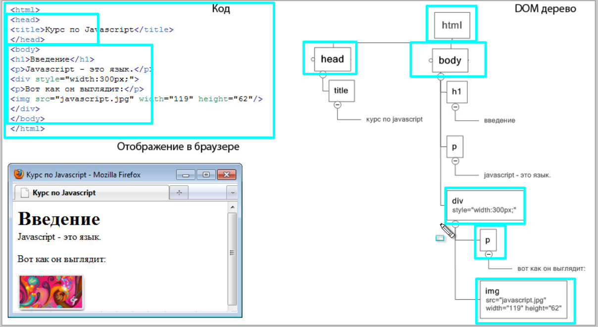
Т.е. вот таким образом это все выглядит. Это dom дерево которое строится параллельно с отображение в браузере html кода. При этом в этом dom дереве хранятся все html теги, все атрибуты этих тегов. Например для тега div stile

При этом каждый элемент в этом dom дереве называется узлом. Т.е. 

Фраза введение это тоже узел и называется это текстовый узел. Тег 
 так же, т.е. все что вы видите в этом дом дереве это так же узлы. При этом здесь нужно еще понимать модель родства. Потому что смотрите. Самый главный тег это у нас html, он получается родитель для всех остальных тегов, получается теги head и body это его сыновья по сути, они между собой братья а у них уже есть как бы свои потомки. Может это звучит не обычно но это просто нужно понимать, потому что дальше это пригодиться и в самом JavaScript и при работе jquery эти наследования нужно понимать. В общем вот такая простейшая схема которая, если ее представить на наш людской уровень то ее очень легко понять.
Так вот для чего мы вообще затронули этот dom дерево? А затронули мы его для того что JavaScript работает как раз таки с этим dom деревом, и с помощью JavaScript мы например можем удалять какие – то узлы из этого дерева, либо наоборот добавлять, либо менять атрибуты у узлов. И по этому как вы можете себе представить, если мы например удаляем тег 
 из дерева 

То оно автоматически меняется и в браузере. Если мы например с помощью JavaScript изменим размер блока div на 500 

То в браузере этот блок тоже расширится. 

#подготовка к дальнейшей работе
С этого момента нам понадобится какой – то тестовый сайт  на котором мы будем экспериментировать и обучаться с элементами вэб – страниц. 
Вымышленный сайт по продаже мотоциклов пака templets и папка moto. Добавляем его к нам на сервер 

После того как вы скопировали, нужно обязательно перезапустить сервер, что бы у нас этот сайт был виден.

Далее изучай netbeans как открыть существующий проект. 

Открываем индексный файл. Здесь специально добавлены коментарии.
Вот он внешний вид сайта

Он очень простой. Я постарался подобрать максимальное количество всяких разных элементов что бы нам было проще работать и мы могли охватить как можно больше областей работы с jquery и JavaScript cptcm есть и картинки и списки и форма где много элементов и таблица.

#Выбор элементов методом getElementsByTagName()
И так мы с вами дошли до методов JavaScript которые позволяют отбирать элементы вэб страницы для дальнейшей работы с ними. Ближайшие несколько уроков мы с вами будем изучать методы именно присущие чистому JavaScript, дело в том что все что мы свами изучим в ближайших 3-х, 4-х уроках делается на самом деле более быстро и легко через jquery. Но как делать это через простой JavaScript вам тоже нужно знать, потому что вы можете наткнуться на какой – нибудь старый скрипт, или вас попросят переделать какой- то скрипт где используются эти старые методы. По этому ближайшие несколько уроков мы с вами изучим принципы отбора элементов со страницы именно с помощью простого JavaScript. А уже на практике будем пользоваться библиотекой Jquery для этих целей.
И перед тем как мы перейдем к изучению первого метода небольшой организационный момент. Нам нужно создать отдельный JavaScript файл где мы будем хранить наши скрипты с текущего момента. Дело в том что как мы свами писали код в предыдущих уроках прям в файле, так сейчас уже не принято делать потому что сейчас идет такая концепция что все должно быть отдельно, html код отдельно, css отдельно и JavaScript так же должен быть отдельно и должен быть вынесен в отдельный файл.
По этому я сейчас предлагая создать отдельный JavaScript файл сохранить его в папку js 

И подключить к нашей странице.
На примере phpdesigner 

Кнопочка создать новый файл (newProject). Создаем JavaScript 

Дальше подключаем его к нашему документу. Мы пишем обычный script только  указываем атрибут сорс src т.е. где у нас лежит  файл со скриптами в его случае это , смотри на картинку там адрес, и указываем атрибут type в котором указываем что это текст/javascript 

Если вы не знакомы что можно подключать JavaScript файл вот так отдельным образом, то здесь ничего сложного нет. Все что мы напишем в этот внешний JavaScript файл будет подставлено вот сюда

В момент загрузки страницы весь этот код будет подставлен сюда, между тегами script, и будет так же выполняться как если бы он был написан напрямую сюда. Так идля проверки попробуем вывести какое – нибудь простенькое сообщение, проверим работает ли у нас подключенный файл.

И мы видим что у нас alert вывелся т.е. все норм.
И так, теперь можно переходить к изучению первого метода для отбора элементов вэб страницы, и это метод который носит длинное название getElementsByTegName что можно перевести как получить элементы по имени тегу. Название говорит само за себя. И когда вам нужно выбрать какие то элементы страницы с одинаковым тегом т.е. все абзацы например, все блоки div, все картинки, все элементы списков т.е. все что попадает под один тег вы можете выбирать с помощью этого метода.
Это метод уже знакомого нам метода document 
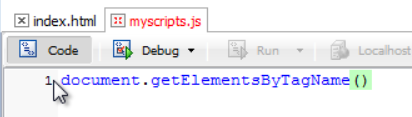
При чем обратите внимание именно Elements с буквой s на конце что подразумевает много элементов. И допустим мы попробуем выбрать все картинки которые у нас есть на странице. Для этого мы в качестве параметра передаем тег img 

Этот код вернет нам массив из всех картинок нашей страницы, при этом можно сразу поместить данный результат в переменную. У нас в переменной будет находится массив из картинок

Вот такая запись поместит в переменную allImg массив из всех картинок. И как мы знаем унас у любого массива есть свойства длинны т.е. сколько в нем элементов, по этому мы с вами можем спокойно узнать сколько же у нас всего картинок на странице просто выведя на экран свойство length нашего объекта allImg. 
По этому давайте проверим. 

как выидите он нам пишет что всего картинок 0-ль хотя картинок у нас достаточно много. Почему же он нам показал none? Вот здесь кроется еще одна важная вещь, которую вы должны понимать при работе с JavaScript и это вам дальше облегчит жизнь. Дело в том что как я вам уже объяснял, у нас браузер, в момент когда он получает этот код, он начинает строить нашу вэб страничку и при этом он строит параллельно dom дерево, и когда он доходит до этого скрипта

Он начинает его выполнять, и на данный момент у него из дом дерева готово только вот эта часть

Он видит скрипт, начинает его выполнять 

Смотрит назад. Смотрит сколько здесь картинок, в выделенной части

Естественно у него их 0-ль. Он заносить в переменную значение 0-ль и мы его видим на экране.
По этому когда вы работаете с JavaScript то имейте ввиду, что если вы работаете с какими – то тегами или еще с чем то таким, отбираете какие – то элементы страницы, то вызов скрипта нужно помещать в самый конец, либо как мы увидим в случае с jquery нужно писать специальную команду. Но здесь мы пока зделаем так что поместим скрипт в самый конец 

видите, теперь он говорит что картинок 6-ть. Запомните что когда дом дерево не достроено вы результата не увидите. Всегда нужно чистый JavaScript, тег его подключения, помещать в самый конец, в самый конец древа. 

#Выбор элемента методом getElementByld()
Сейчас пришло время изучить метод который позволяет отобрать какой то конкретный элемент страницы по его уникальному индификатору. Если вы внимательно посмотрите на представленную страницу то увидите что многие объекты здесь имеют свои индификаторы

Head id = “forheader”,  например h1 id = “main h1”, картинки. Много элементов имеют свои индификаторы. При программировании на JavaScript очень важно использовать эти индификаторы, как можно чаще, потому что чем больше у вас таких индификаторов, тем проще вам получить доступ к какому – то конкретному элементу. Конечно в jqury есть больше выбора доступа к элементам, но именно простой JavaScript в нем ограничены эти возможности по этому чем больше индификаторов в элементах у вас, тем проще вам достучаться до конкретного объекта.
 И в данном случае давайте попробуем выбрать какой – нибудь элемент нашей страницы по его id. Например пусть это будет первый мотоцикл

У него id

Переходим в файл js и создаем переменную и скажем что хотим поместить в него ссылку на отдельный элемент и в качестве параметра в круглых скобках передаем этот индификатор

И вот такая запись вернет нам ссылку на этот самый объект т.е. не саму эту картинку поместит в переменную moto, а именно как бы ссылку на этот объект, и теперь мы можем с этим объектом все что хотим делать через эту переменную moto. Это примерно тоже самое когда мы создавали объект типа date. Это когда пы создавали объект дата писали newdate, а потом уже через переменную получали доступ к свойствам объекта т.е. там могли узнать полный год getForYuer, могли узнать там месяц и т.д.
Точно так же примерно и здесь. Когда мы пишем какую – то переменную и говорим присвоить ей какой – то объект который выбран с помощью метода getElementById мы просто как бы говорим что нужно в dom дереве найти  этот объект и ссылочку на него поместить уже в эту переменную, а затем когда нам уже с этим объектом нужно будет работать мы всегда можем получить к нему доступ через эту переменную и в данном случае можно например получить доступ к его свойствам. Если мы посмотрим внимательно на тег img 

то увидим что у него есть и другие атрибуты т.е. это src откуда ему подгружать картинку, width ширина этой картинки, height высота , alt альтернативный текст. И мы по сути с вами можем получить доступ к любому из этих атрибутов потому что они с точки зрения объекта являются его свойствами. Как у человека есть с-ва рост, вес и т.д. так же и у картинки есть свои свойства, ширина, высота…. 
И если мы написали что мы сюда помещаем ссылку на этот объект
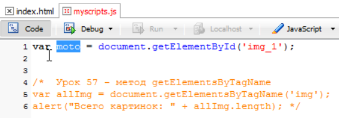
то мы спокойно можем получить доступ ко всем его свойствам и например вывести на экран альтернативный текст этой картинки. Пишем alert и в параметре () указываем что мы хотим поместить объект moto и его свойство alt.

вот она выводит Мотоцикл 1 . так же мы могли бы вывести ширину например 

т.е. таким образом работает этот метод getElementById, он позволяет нам вытащить ссылку на этот объект именно по его id, и если у вас на страничке много объектов с id то вам проще поймать этот объект, вытащить его и уже с ним дальше работать.      

#Выбор родственных элементов
Эти свойства так же помогают получать доступ к элементам страницы но уже не за счет методов а именно за счет свойств. И свойства эти такого плана. 
Смотрите м в предыдущем уроке учились отбирать элемент по индификатору

в котором четыре картинки. По сути мы с вами уже умеем отбирать конкретный блок по индификатору, и в данном случае для нас не представляет проблемы вытащить этот блок div. Так вот, после того как мы его вытащим и сохраним ссылку на него в какой – нибудь переменную, то мы получаем доступ не только к его свойствам, но мы получаем доступ еще к некоторым интересным свойствам и первым из этих свойств называется childlNodes. Что это за свойство такое? Child можно перевести как ребенок а node это узел т.е. если совместить то получится дочерний узел или узел потомок. Так вот когда мы отбираем какой то объект в переменную, мы получаем доступ к этому свойству childNodes и с помощью него можем вытащить всех потомков данного элемента. В данном случае четыре картинки

И давайте провери на практике и посмотрим что из этого получится. Первым делом вытаскиваем в какую – нибудь переменную. Этот блок div и говорим что мы хотим получить сюда ссылку на определенный элемент

Вот мы получили на него ссылочку, и теперь мы за счет этой переменной получаем доступ ко всем свойствам данного объекта. И мы говорим что хотим получить доступ ко всем его потомкам, их много, по этому нам вернут массив. Соответственно этот массив так же нужно куда – то сохранить. По этому давайте создадим еще одну переменную var childDiv т.е. массив из его детей. По этому мы говорим что нас интересует mydiv. И указываем это самое свойство childNodes  

и таким образом эта строчка вернет нам массив из всех его дочерних узлов и мы полуим этот массив в переменную childDiv.
И теперь для того что бы убедится что мы на самом деле получили всех его потомков, давайте попробуем вывести на экран допустим свойство alt каждого из его потомков. Нам это нужно вывести в цикле 4-ре раза подряд.
Т.е. мы создаем простенький цикл для перебора элементов массива. Говорим что счетчик у нас работает до тех пор пока,               i < childDiv.length ,ай меньше чем длинна массива. И говорим что при переборе нужно вывести на экран свойство alt конкретного текущего потомка

вот таким образом он нам должен вывести все четыре дополнительных alt. 

Что это за undefined такой ? ведь по сути у нас здесь видны только четыре потомка. Так вот это еще один такой сюрприз от JavaScript который так же не очень приятный и который решается в jquery с легкостью. Смотрите в чем здесь дело. 
Вернемся в браузер, и если у вас еще не установлено специальное расширение

то установите его. Это инспектор того самого дерева о котором мы с вами говорили.
Если мы его запускаем то вот что мы видим

Обратите внимание ниже 

Когда мы становимся на div который в себе содержит картинки, то обратите внимание как в браузере они начинают подсвечиваться.
Если мы открываем этот div

При кликанье на каждую из них картинки в браузере подсвечиваются. Обратите внимание что между тегами картинок есть text т.е. это те самые тексты которые нам мывадились как undefined т.е. у них нет атрибута alt по этому JavaScript выводил нам undefined. 
А что это за text такой? А это смотрите, помните что я вам говорил что для JavaScript в этом dom дереве все является по сути объектами т.е. тег это объект, текст внутри этого тега это тоже объект. А теперь внимательно взглянем вот сюда 

На самом деле у нас между тегом div и первой картинкой есть пробелы. А мы знаем что пробел для JavaScript ни чем не отличается например от буквы а, и по сути для него такая ситуация, пробел для него все равно какой то символ. по этому вот здесь у нас получилась такая ситуация что мы увидили эти значения undefined потому что когда мы запросили ����е дочерние узлы для этого блока div то он нам туда положил не только картинки но и эти пробельные символы которые находятся между ними. Если мы возьмем и соединим все в единую строку то вывода undefined не будет. Вот такая особенность JavaScript что он считает пробелы за текстовые узлы.
Есть еще свойства которые помогают получить доступ к элементам. Прежде всего это мы можем узнать родителя какого то элемента.

И пишем в свойствах parentNode т.е. родительский узел.

И выводим свойства этого родительского узла на экран к примеру id. 

Кроме этого есть еще парочка свойств которые вы должны знать. И это свойства связанные с братьями. Узнаем следующий элемент после прописанного с помощью свойства nextSiblings. Выведем ссылку. 

Это те самые пробелы о которых я говорил. Уберем пробел и получим желаемое.
И нам осталось последнее свойство это предыдущий брат. 

# 60. Свойства innerText и innerHtml 
Из предыдущих уроков мы умеем выбирать элементы вэб страницы по названию тегов, их id. Мы можем получать доступ к свойствам этих элементов т.е. можем узнать ширину, источник картинки например, высоту, альтернативный текст и т.д. можем с помощью моделей потомков путешествовать  по братьям, сестрам выбранного элемента. 
Но мы до сих пор не можем вытащить например  текст элемента. Смотрите у нас есть например заголовок h1 например

у него есть id мы спокойно можем получить доступ к этому элементу. Но вот как получить доступ к тексту этого элемента. Давайте попробуем получить доступ по id.
Создаем переменную например var mainHeader = и сюда мы вытаскиваем наш элемент document. Получить элемент по id getElementBiId  далее в параметрах указываем этот id (‘ main_h1 ’) 

Вот таким образом мы получили наш элемент. Но что бы получить доступ к тексту нашего элемента мы пока не знаем.
Если мы с вами напишем вот так 

смотрите что он нам выдаст,

не текст а нечто. Он скажет что там объект, заголовок какой то. Понятно для него это объект. Потому что мы получили в эту переменную mainHeader всего лишь объект с id main_h1. И когда мы выводим он говорит что да объект такой то там.
А как же нам получить доступ к тексту этого объекта?? Есть специальное свойство, это можно сказать свойство исключение которое позволляет получить доступ к объекту, точнее доступ к тексту объекта но при этом еще и менять этот текст. Как вы знаете свойства унас всегда использовали только для получения информации, но вот это свойство исключение, оно может как получать информацию так и изменять ее. И пишется оно таким образом. Это совойство бло введено разработчиками браузеров в JavaScript, по этому оно используется так скажем на свой страх и риск, но вроде как оно в последнее время работает, но не везде. 

Т.е. мы говорим что мы хотим вытащить внутренний текст.

смотрите fireFox нам undefined он не понимает что мы ему написали.
А в опере он нам выводит то что нам нужно

Так вот проблема в том что fireFox не понимает этого свойства. Видимо с этим разработчиком остальные не договорились и он пошел своим путем и он понимает другое свойство т.е. он для тех же самых целей использует 

Смотрим что это дает в fireFox

Если смотрим в других браузерах, то это свойство уже они не понимают. В jqury будет проще, там как бы заложены все эти комбинации. Там на много проще мы уже не задумываемся потдерживает этот браузер такое свойство или нет, а как сработает с этой dom моделью такой то браузер, а как этот. В jqury все эти проблемы решены, поэтому то JavaScript и пошел быстрыми шагами вверх, потому что эти библиотеки решили все эти подобные проблемы которых очень много на самом деле в стандартном JavaScript и во многих книгах я даже читал такую мысль что если пробовать описать эти все приемы и методы которые позволяют сгладить все эти неровности т.е. позволить JavaScript коду который работает с этой dom моделью  хорошо работать во всех браузерах то придется писать отдельную книгу, по этому JavaScript и долго оставался таким языком который не позволял реализовать много полезного, но с появлением этих библиотек типа jqury все эти не ровности  ……
А здесь нам осталось еще одно свойство которое называется innerHTML но его мы будем уже применять не к объекту который содержит просто текст, а давайте применим его например к тому же блоку div 

в нем много html кода внутри и если вам нужно вытащить html код из элемента или поменять код элемента, то используется этот метод. 

Другие браузеры так же хорошо потдерживают это свойство. И попробуем поменять html код и например вместо этих всех картинок, которые у нас есть внутри, мы сделаем так. 

Как мы видим картинки у нас изменились. Вместо картинок вывелся абзац 
